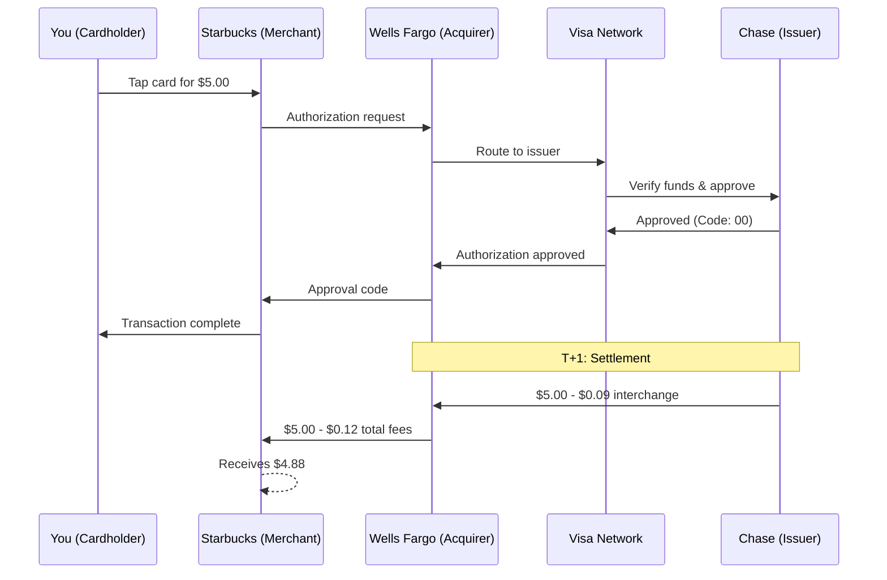

# The Four-Party Model

> **Last Updated:** 2025-12-18
>
> **Status:** Complete

The **four-party payment model** (also called the four-corner model) is the foundational structure of the modern card payment ecosystem. Every credit and debit card transaction involves four parties: the **cardholder**, **issuing bank** (issuer), **acquiring bank** (acquirer), and **merchant** — all connected through **card networks** like Visa and Mastercard. Understanding how these parties interact, how [interchange fees](/ecosystem/fundamentals/four-party-model/fee-breakdown) flow, and how [transactions are authorized and settled](/ecosystem/fundamentals/four-party-model/transaction-flows) is essential for anyone building payment platforms or [PayFac systems](/ecosystem/fundamentals/four-party-model/payfac).

---

## What Is the Four-Party Payment Model?

The Four-Party Model consists of four main participants in every card transaction:

| Party | Role | Example |
|-------|------|---------|
| **Cardholder** | Consumer who uses the card | You, buying coffee |
| **Merchant** | Business accepting the payment | Starbucks |
| **Issuing Bank (Issuer)** | Bank that issued the card | Chase (your credit card bank) |
| **Acquiring Bank (Acquirer)** | Bank that enables merchant to accept cards | Wells Fargo Merchant Services |

The **[Card Network](/ecosystem/fundamentals/card-network-role)** (Visa, Mastercard) sits in the middle, facilitating communication between all parties.

---

## Visual Representation

### Basic Four-Party Structure

```
┌─────────────────────────────────────────────────────────────────────────┐
│                           CARD NETWORK                                  │
│                        (Visa / Mastercard)                              │
│                                                                         │
│    Sets rules, routes transactions, manages disputes, collects fees     │
└─────────────────────────────────────────────────────────────────────────┘
                   ▲                               ▲
                   │                               │
                   │                               │
          ┌────────┴────────┐             ┌────────┴────────┐
          │  ISSUING BANK   │             │ ACQUIRING BANK  │
          │    (Issuer)     │             │   (Acquirer)    │
          │                 │             │                 │
          │ - Issues cards  │             │ - Enables card  │
          │ - Approves txns │             │   acceptance    │
          │ - Bears credit  │             │ - Bears merchant│
          │   risk          │             │   risk          │
          └────────┬────────┘             └────────┬────────┘
                   │                               │
                   │                               │
                   ▼                               ▼
          ┌─────────────────┐             ┌─────────────────┐
          │   CARDHOLDER    │────────────▶│    MERCHANT     │
          │                 │  purchases  │                 │
          │ - Uses card     │  goods or   │ - Sells goods/  │
          │ - Pays bill     │  services   │   services      │
          │   to issuer     │             │ - Receives      │
          │                 │             │   payment       │
          └─────────────────┘             └─────────────────┘
```

### Real-World Example: $5 Coffee Purchase

Let's trace a real transaction through the four-party model:



**Money flow:**
- Customer pays: $5.00
- [Interchange](/ecosystem/fundamentals/four-party-model/fee-breakdown) to Chase (issuer): $0.09
- Assessment to Visa: $0.01
- Acquirer markup to Wells Fargo: $0.02
- Merchant receives: $4.88

**Time:**
- [Authorization](/ecosystem/fundamentals/four-party-model/transaction-flows): 800ms
- Settlement: T+1 (next business day)
- Funding to merchant: T+2

---

## Four-Party vs Three-Party Model: Key Differences

Before diving deeper, it's important to understand that not all card networks use the Four-Party Model.

### Three-Party Model (Closed-Loop)

American Express and Discover originally operated as **Three-Party** networks:

```
┌─────────────────────────────────────────────────────────────────────────┐
│                    THREE-PARTY MODEL (Closed-Loop)                      │
├─────────────────────────────────────────────────────────────────────────┤
│                                                                         │
│                      ┌─────────────────────┐                            │
│                      │   AMEX / DISCOVER   │                            │
│                      │                     │                            │
│                      │  Acts as BOTH:      │                            │
│                      │  • Issuer           │                            │
│                      │  • Acquirer         │                            │
│                      │  • Network          │                            │
│                      └──────────┬──────────┘                            │
│                                 │                                       │
│                    ┌────────────┴────────────┐                          │
│                    │                         │                          │
│                    ▼                         ▼                          │
│           ┌─────────────────┐       ┌─────────────────┐                 │
│           │   CARDHOLDER    │──────▶│    MERCHANT     │                 │
│           └─────────────────┘       └─────────────────┘                 │
│                                                                         │
└─────────────────────────────────────────────────────────────────────────┘
```

**Key Differences:**

| Aspect | Four-Party (Visa/MC) | Three-Party (AmEx/Discover) |
|--------|----------------------|----------------------------|
| **Network role** | Routes messages only | Issues cards + acquires merchants |
| **Interchange** | Paid issuer → acquirer | No interchange (internal) |
| **Merchant fees** | Lower (2.0-2.5%) | Higher (2.5-3.5%) |
| **Control** | Distributed | Centralized |

**Modern Reality:** Today, AmEx and Discover also license third-party issuers, making them quasi-four-party networks. But they still have proprietary acquiring arms.

**Why it matters for [PayFac](/ecosystem/fundamentals/four-party-model/payfac):**

- AmEx OptBlue program allows [PayFacs](/ecosystem/fundamentals/four-party-model/payfac) to accept AmEx through their existing acquirer
- Different [fee structures](/ecosystem/fundamentals/four-party-model/fee-breakdown) and chargeback rules apply for each network

---

## Deep Dive: Each Party's Role

### 1. Cardholder

The cardholder is the consumer who:

- Has a contractual relationship with the **issuing bank**
- Uses the card to make purchases
- Is responsible for paying the monthly bill
- Can dispute transactions (initiating [chargebacks](/ecosystem/fundamentals/transaction-lifecycle/detailed-flows#chargebacks--disputes))

**Key Point:** The cardholder has NO direct relationship with the merchant's bank or the card network.

### 2. Merchant

The merchant is the business that:

- Has a contractual relationship with the **acquiring bank**
- Accepts card payments for goods/services
- Pays fees (Merchant Discount Rate) to accept cards
- Bears responsibility for valid transactions and fraud prevention

**Key Point:** The merchant receives the transaction amount MINUS [fees](/ecosystem/fundamentals/four-party-model/fee-breakdown), typically 1.5% - 3.5% of the sale.

### 3. Issuing Bank (Issuer)

The issuer is a financial institution that:

- Issues credit/debit cards to consumers
- Sets credit limits and terms
- Bears the **credit risk** (if cardholder doesn't pay)
- [Approves or declines transactions](/ecosystem/fundamentals/four-party-model/transaction-flows) in real-time
- Receives **[interchange fees](/ecosystem/fundamentals/four-party-model/fee-breakdown)** on every transaction

**Examples:** Chase, Bank of America, Capital One, Citi

**Key Point:** The issuer makes money from:

- Interest on unpaid balances
- Annual fees
- [Interchange fees](/ecosystem/fundamentals/four-party-model/fee-breakdown) (paid by the acquirer)

### 4. Acquiring Bank (Acquirer)

The acquirer is a financial institution that:

- Enables merchants to accept card payments
- Bears the **merchant risk** (chargebacks, fraud, merchant bankruptcy)
- Pays [interchange fees](/ecosystem/fundamentals/four-party-model/fee-breakdown) to the issuer
- Funds the merchant (after deducting fees)
- Manages [merchant underwriting](/glossary#underwriting) and compliance

**Examples:** Chase Paymentech, Wells Fargo Merchant Services, Worldpay, Fiserv (see [Acquiring Banks](/ecosystem/industry-players/acquiring-banks/overview) and [Payment Processors](/ecosystem/industry-players/payment-processors) for detailed coverage)

**Key Point:** The acquirer takes on significant risk. If a merchant processes fraudulent transactions and disappears, the acquirer is liable for chargebacks.

### 5. [Card Network](/ecosystem/fundamentals/card-network-role) (The "Fifth" Party)

Though called the "Four-Party Model," the [card network](/ecosystem/fundamentals/card-network-role) is essential:

- **Routes messages** between issuers and acquirers
- **Sets rules** all parties must follow
- **Calculates net positions** for [settlement](/ecosystem/fundamentals/four-party-model/transaction-flows)
- **Collects [assessment fees](/ecosystem/fundamentals/four-party-model/fee-breakdown)** for network usage
- **Manages disputes** and arbitration

**Key Clarification:** Networks facilitate the exchange of funds and calculate net positions, but they don't hold merchant or cardholder funds. They instruct banks on how much to transfer.

**Examples:** Visa, Mastercard, Discover (network arm), UnionPay

---

## The Durbin Amendment: Debit Interchange Caps

The Durbin Amendment (2010, part of Dodd-Frank) caps debit interchange for large banks. For comprehensive coverage of debit networks and routing, see [Debit Networks & Routing](/ecosystem/fundamentals/debit-networks-routing).

**Who It Affects:**

- Banks with **$10 billion+ in assets** ("regulated issuers")
- Examples: Chase, Bank of America, Wells Fargo, Citi

**The Cap:**

```text
Maximum: $0.22 + 0.05% of transaction amount
(+ $0.01 fraud adjustment if eligible)
```

**Impact:**

| Issuer Type | $100 Debit Transaction |
|-------------|------------------------|
| **Regulated** (Chase) | ~$0.27 interchange |
| **Unregulated** (local credit union) | ~$1.00+ interchange |

**Why It Matters:**

- Large banks earn ~70% less on debit vs credit
- This is why big banks push credit cards over debit
- Small banks/credit unions have competitive advantage in debit rewards
- Merchants save significantly on regulated debit (but some processors don't pass savings through)

---

## Honor All Cards Rule

A critical network rule that affects merchants:

**The Rule:** If a merchant accepts Visa, they must accept **ALL** Visa cards, including premium cards with higher interchange.

**Implications:**

- Merchants cannot selectively accept only low-interchange cards
- Cannot refuse premium rewards cards
- Creates cross-subsidy: cash/debit customers subsidize rewards cardholders

**Durbin Amendment Exception:**

- Merchants CAN set minimum transaction amounts up to $10
- Merchants CAN offer discounts for different payment types (cash vs card)
- Merchants CANNOT surcharge based on specific card type (in most states)

---

## Key Terms Defined

| Term | Definition |
|------|------------|
| **[Issuer](/glossary#issuer) / Issuing Bank** | Financial institution that issues credit or debit cards to cardholders. Responsible for authorizing transactions and extending credit. |
| **[Acquirer](/glossary#acquirer) / Acquiring Bank** | Financial institution that enables merchants to accept card payments. Bears risk if merchant defaults on chargebacks. |
| **[Interchange Fee](/glossary#interchange-fee)** | Fee paid by acquiring bank to issuing bank on each transaction. Set by card networks. Ranges from 0.05% + $0.22 (regulated debit) to 3.3%+ (premium credit). See [Fee Breakdown](/ecosystem/fundamentals/four-party-model/fee-breakdown) for details. |
| **[Assessment Fee](/glossary#assessment-fee)** | Fee charged by card networks (Visa, Mastercard) for using their infrastructure. Includes percentage and fixed components. Typically 0.13%-0.15% + per-transaction fees. |
| **[Merchant Discount Rate (MDR)](/glossary#mdr)** | Total percentage fee charged to merchants. Includes interchange + assessment + acquirer markup. See [Fee Breakdown](/ecosystem/fundamentals/four-party-model/fee-breakdown). |
| **[BIN/IIN](/glossary#bin)** | Bank/Issuer Identification Number. First 6-8 digits of card number identifying the issuing institution. Industry transitioned to 8-digit IINs in 2022. |
| **[Authorization](/glossary#authorization)** | Real-time approval from issuer to proceed with transaction. Places hold on funds. See [Transaction Flows](/ecosystem/fundamentals/four-party-model/transaction-flows). |
| **[Capture](/glossary#capture)** | Merchant's request to collect authorized funds. Can be same day or later. See [Transaction Flows](/ecosystem/fundamentals/four-party-model/transaction-flows). |
| **[Settlement](/glossary#settlement)** | Actual movement of funds between banks. Typically T+1 to T+3. See [Transaction Lifecycle](/ecosystem/fundamentals/transaction-lifecycle/overview). |
| **[Chargeback](/glossary#chargeback)** | Cardholder dispute that reverses a transaction. Merchant must prove transaction was valid. See [Chargeback Lifecycle](/risk-compliance/chargebacks/lifecycle) for the complete process. |

---

## Key Takeaways

1. **Four parties, four relationships**: Cardholder → Issuer, Merchant → Acquirer, both connected through the [Card Network](/ecosystem/fundamentals/card-network-role)

2. **Money flows opposite to goods**: Customer gets product, merchant gets money (minus [fees](/ecosystem/fundamentals/four-party-model/fee-breakdown))

3. **Risk is distributed**: Issuer bears credit risk, Acquirer bears merchant risk

4. **[Interchange](/ecosystem/fundamentals/four-party-model/fee-breakdown) is king**: It's the largest fee component (1.4%-3.3% for credit) and drives industry economics

5. **Networks facilitate, not hold**: [Visa/Mastercard](/ecosystem/fundamentals/card-network-role) route messages and calculate positions but don't hold funds

6. **Durbin caps debit**: Large banks' debit [interchange](/ecosystem/fundamentals/four-party-model/fee-breakdown) capped at $0.22 + 0.05%

7. **Honor All Cards**: Merchants accepting Visa must accept ALL Visa cards, including premium

---

## Related Topics

**Deep Dives:**
- **[Transaction Flows](/ecosystem/fundamentals/four-party-model/transaction-flows)** - Authorization, capture, settlement, and response codes
- **[Fee Breakdown & Money Flow](/ecosystem/fundamentals/four-party-model/fee-breakdown)** - Detailed interchange, assessment, and fee economics
- **[Interchange Optimization](/ecosystem/fundamentals/four-party-model/optimization)** - Level 2/3 data, cross-border transactions
- **[PayFac Position in the Model](/ecosystem/fundamentals/four-party-model/payfac)** - How Payment Facilitators fit into the four-party structure
- **[Self-Assessment Quiz](/ecosystem/fundamentals/four-party-model/quiz)** - Test your understanding

**Related Fundamentals:**
- **[Card Network Role](/ecosystem/fundamentals/card-network-role)** - Deep dive into network infrastructure, BIN routing, and network rules
- **[Transaction Lifecycle](/ecosystem/fundamentals/transaction-lifecycle/overview)** - Detailed authorization → capture → settlement flow
- **[Debit Networks & Routing](/ecosystem/fundamentals/debit-networks-routing)** - PIN vs signature debit, Durbin Amendment, least-cost routing

**Industry Players:**
- **[Payment Processors](/ecosystem/industry-players/payment-processors)** - The technical backbone connecting merchants to networks
- **[Payment Gateways](/ecosystem/industry-players/payment-gateways/overview)** - Secure transmission layer for payment data
- **[Acquiring Banks](/ecosystem/industry-players/acquiring-banks/overview)** - Merchant enablement and risk management
- **[ISOs](/ecosystem/industry-players/isos)** - Independent Sales Organizations and merchant acquisition
- **[ISVs](/ecosystem/industry-players/isvs)** - Software vendors with embedded payments

**Related Modules:**
- **[Risk & Compliance](/risk-compliance/)** - Chargebacks, fraud prevention, network monitoring programs

---

## References

### Official Interchange Rate Documentation

- [Visa USA Interchange Reimbursement Fees](https://usa.visa.com/content/dam/VCOM/download/merchants/visa-usa-interchange-reimbursement-fees.pdf) - Official Visa interchange rates
- [Mastercard Interchange Programs and Rates](https://www.mastercard.us/content/dam/public/mastercardcom/na/global-site/documents/mastercard-rules.pdf) - Official Mastercard rates (see interchange section)
- [Visa Merchant Regulations & Fees](https://usa.visa.com/support/small-business/regulations-fees.html) - Visa merchant fee overview

*Note: Interchange rates change periodically. Always verify current rates at official network portals.*

### Network Rules & Standards

- [Visa Core Rules and Visa Product and Service Rules](https://usa.visa.com/dam/VCOM/download/about-visa/visa-rules-public.pdf) - Complete Visa rulebook
- [Mastercard Rules](https://www.mastercard.us/content/dam/public/mastercardcom/na/global-site/documents/mastercard-rules.pdf) - Mastercard network standards

### Regulatory Resources

- [Federal Reserve Regulation II](https://www.federalreserve.gov/paymentsystems/regii-about.htm) - Debit interchange fee caps (Durbin Amendment)
- [CFPB Credit Card Market Report](https://www.consumerfinance.gov/data-research/research-reports/the-consumer-credit-card-market/) - Consumer protection and market analysis

### Industry Resources

- [Electronic Transactions Association (ETA)](https://www.electran.org/) - Payments industry association
- [Nilson Report](https://nilsonreport.com/) - Industry publication tracking payment card statistics
- [U.S. Payments Forum](https://www.uspaymentsforum.org/) - EMV and payments standards

---

## Further Reading

### Books

- **"Payments Systems in the U.S."** by Carol Coye Benson & Scott Loftesness - Comprehensive textbook on US payments
- **"Electronic Value Exchange"** by David Stearns - History of card networks and interchange

### Online Guides

- [Stripe: How Cards Work](https://stripe.com/guides/introduction-to-card-payments) - Developer-friendly overview
- [Merchant Cost Consulting: Interchange Rates](https://merchantcostconsulting.com/lower-credit-card-processing-fees/visa-interchange-rates/) - Detailed rate analysis
- [Helcim: Visa USA Interchange Rates](https://www.helcim.com/visa-usa-interchange-rates/) - Practical interchange breakdown

---

*Continue reading: [Transaction Flows](/ecosystem/fundamentals/four-party-model/transaction-flows)*
