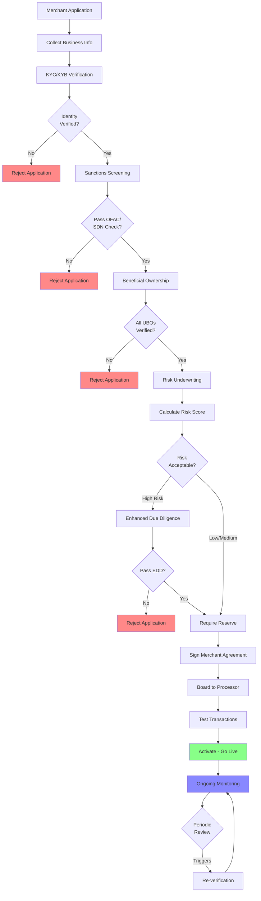

# Merchant Onboarding

## Learning Objectives

By the end of this module, you will:

- Understand KYC (Know Your Customer) and KYB (Know Your Business) verification requirements
- Master the underwriting process and risk assessment frameworks
- Identify key risk factors and their impact on merchant approval
- Navigate merchant agreements, reserves, and the MATCH list
- Implement ongoing monitoring and enhanced due diligence procedures
- Grasp PayFac-specific onboarding considerations and sponsor bank delegation

## Prerequisites

Before starting this module, you should have completed:

- [Payment Ecosystem Foundation](/ecosystem/) - Understanding the four-party model, industry players, and PayFac basics

## Why This Matters

Merchant onboarding is the critical gateway that determines:

- **Risk Exposure** - Proper verification prevents fraud, chargebacks, and regulatory violations
- **Regulatory Compliance** - Meeting BSA/AML, OFAC, and card network requirements
- **Business Sustainability** - Balancing conversion rates with risk management
- **Sponsor Bank Relationship** - Maintaining compliance standards that protect your processing rights

Poor onboarding leads to:
- Excessive chargebacks and fraud losses
- Regulatory fines and sanctions
- Sponsor bank termination
- Merchant attrition due to slow approval times

## Module Structure

This module covers Week 3-4 of the learning path and is organized into five sections:

### KYC & KYB Verification

Identity and business verification fundamentals:

- **KYC Requirements** - Individual identity verification processes
- **KYB Requirements** - Business entity validation and documentation
- **Beneficial Ownership** - Ultimate Beneficial Owner (UBO) identification
- **Sanctions Screening** - OFAC, SDN list checking, and compliance

### Underwriting & Risk Assessment

Risk evaluation and merchant approval processes:

- **Fundamentals** - Core underwriting principles and objectives
- **Risk Factors** - Business type, processing history, and red flags
- **MCC Codes** - Merchant Category Code classification and risk tiers
- **Risk Scoring** - Automated scoring models and decision frameworks

### Merchant Lifecycle

Agreements and ongoing relationship management:

- **Merchant Agreements** - Merchant Processing Agreement (MPA), reserves, and MATCH list
- **Ongoing Monitoring** - Transaction monitoring, re-verification, and enhanced due diligence

### PayFac Considerations

Payment Facilitator-specific onboarding requirements:

- **Sponsor Delegation** - What responsibilities transfer from sponsor to PayFac
- **Portfolio Risk** - Aggregate risk management across sub-merchants

### Study Guide

Learning resources and self-assessment:

- **Topics** - Research focus areas for Week 3-4
- **Questions** - Self-assessment exercises
- **Resources** - Reading materials and industry references

## Onboarding Flow Overview

## Key Concepts to Master

### Identity Verification

Understanding the difference between:
- **KYC** - Individual identity verification (proprietors, principals, beneficial owners)
- **KYB** - Business entity verification (company structure, registration, tax status)
- **Beneficial Ownership Rule** - FinCEN requirements for identifying 25%+ owners

### Risk Assessment

Evaluating merchant risk through:
- **Business Type** - MCC code risk classification
- **Processing History** - Prior merchant accounts, MATCH list status
- **Financial Indicators** - Credit scores, business financials, projected volumes
- **Reputation Signals** - BBB ratings, online reviews, litigation history

### Compliance Requirements

Meeting regulatory and network obligations:
- **BSA/AML** - Bank Secrecy Act and Anti-Money Laundering programs
- **OFAC Screening** - Office of Foreign Assets Control sanctions compliance
- **Card Network Rules** - Visa, Mastercard merchant onboarding standards
- **State Licensing** - Money transmitter licenses where applicable

### PayFac Responsibilities

As a Payment Facilitator, you inherit:
- **Underwriting Responsibility** - Risk assessment delegated from sponsor bank
- **Compliance Burden** - Ongoing monitoring and reporting obligations
- **Portfolio Risk** - Aggregate risk across all sub-merchants
- **Sponsor Oversight** - Regular audits and compliance reviews

## Time Allocation Suggestion

- **Week 3:** KYC/KYB verification, sanctions screening, beneficial ownership
- **Week 4:** Underwriting fundamentals, risk scoring, merchant agreements, ongoing monitoring

## Success Criteria

After completing this module, you should be able to:

- Design a compliant KYC/KYB verification flow
- Identify high-risk merchant indicators
- Explain the beneficial ownership rule and its implementation
- Map merchant categories to appropriate MCC codes
- Describe the contents and purpose of a Merchant Processing Agreement
- Implement an ongoing monitoring program
- Articulate PayFac-specific onboarding requirements

## Common Challenges

### Balancing Friction vs. Risk

**The Dilemma:** More verification steps = better risk management but lower conversion rates

**The Solution:** Risk-based decisioning - light touch for low-risk, enhanced scrutiny for high-risk

### Data Quality Issues

**The Problem:** Merchants provide incomplete or inaccurate information

**The Approach:** Automated validation, third-party data sources, clear error messaging

### Regulatory Updates

**The Reality:** Compliance requirements constantly evolve

**The Strategy:** Regular policy reviews, industry association membership, legal counsel engagement

## Progress Tracking

Track your progress through this module by completing the quiz in each category and the comprehensive questions in the Study Guide section.

---

> **Next Steps:** Start with [KYC & KYB Verification](/onboarding/kyc-kyb/) to understand identity and business verification requirements.
