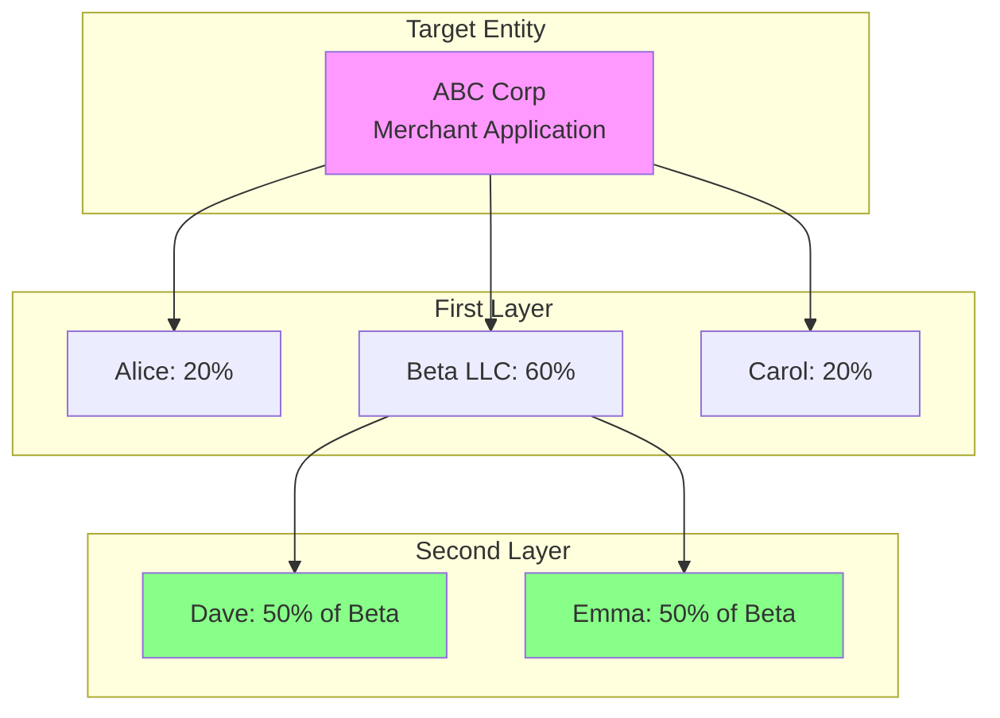
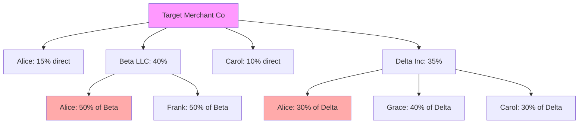
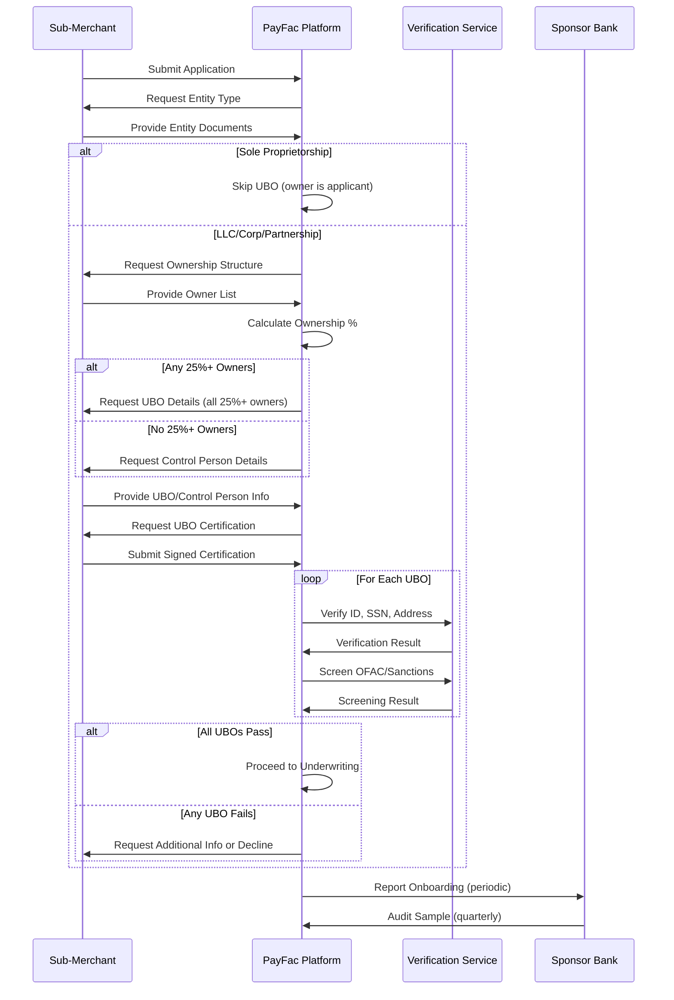

# Beneficial Ownership

> **Last Updated:** 2025-12-26
>
> **Status:** Complete

## Quick Reference

**Key Numbers:**
- **25% or more** - Ownership threshold triggering beneficial owner identification
- **At least 1** - Control person required ONLY when no 25%+ owners exist
- **Typically 1-4** - Number of beneficial owners commonly identified (no regulatory maximum)

**Critical Dates:**
- **May 11, 2018** - CDD Rule effective date (31 CFR 1010.230)
- **March 21, 2025** - FinCEN exempts U.S. entities from CTA BOI reporting
- **March 26, 2025** - CTA BOI reporting suspended for domestic companies

**Current Status (2025):**
- CDD Rule: **ACTIVE** - applies to financial institutions and PayFacs through sponsor banks
- CTA BOI Reporting: **SUSPENDED** for U.S. domestic entities (foreign reporting companies still required)

:::danger FinCEN Requirement
The Customer Due Diligence Rule (31 CFR 1010.230) remains ACTIVE and binding on financial institutions, including PayFacs through their sponsor bank relationships. The March 2025 CTA exemption does NOT remove PayFac obligations to collect beneficial ownership information.
:::

## Overview

Beneficial ownership identifies the **natural persons** (real individuals) who ultimately own or control a legal entity. This prevents shell companies, money laundering, sanctions evasion, and terrorist financing by ensuring you know the actual humans behind every business relationship.

### Why It Matters

**Regulatory Compliance:**
- Required under FinCEN's Customer Due Diligence Rule
- Enforced through sponsor bank oversight
- Violations can result in civil and criminal penalties

**Risk Management:**
- Detects shell companies used for money laundering
- Identifies sanctioned individuals hiding behind corporate structures
- Prevents fraud through nominee ownership arrangements
- Reveals conflicts of interest and related-party transactions

**Business Protection:**
- Avoids onboarding criminals and terrorists
- Protects platform reputation
- Demonstrates due diligence to regulators
- Reduces long-term compliance risk

## Regulatory Landscape

### CDD Rule vs. Corporate Transparency Act

Two distinct but related beneficial ownership frameworks exist in 2025:

#### Customer Due Diligence Rule (CDD Rule) - ACTIVE

**Regulation:** 31 CFR 1010.230
**Effective:** May 11, 2018
**Applies to:** Financial institutions opening accounts for legal entity customers
**Status:** Fully active and enforced

**Key Provisions:**
- Identify beneficial owners at account opening
- Two-prong test: 25% ownership OR control person
- Verify identity of each beneficial owner
- Update information when changes occur

**PayFac Relevance:** Sponsor banks are covered financial institutions, and they delegate CDD obligations to PayFacs through registration agreements. **PayFacs MUST collect beneficial ownership information for sub-merchants.**

#### Corporate Transparency Act (CTA) - SUSPENDED

**Effective Date:** January 1, 2024 (original)
**Applies to:** Reporting companies filing with FinCEN
**Status:** U.S. domestic companies exempted as of March 21, 2025

**March 2025 Update:**
FinCEN issued an interim final rule exempting ALL U.S. domestic companies from Beneficial Ownership Information (BOI) reporting requirements. Only **foreign reporting companies** with U.S. operations must continue filing.

:::warning Time-Sensitive Information
CTA requirements changed significantly in March 2025. While CTA BOI reporting is suspended for U.S. entities, the CDD Rule remains fully active for financial institutions and their agents (including PayFacs).
:::

**Bottom Line for PayFacs:** Continue collecting beneficial ownership under the CDD Rule. The CTA suspension does NOT eliminate your obligations.

## The Two-Prong Test

The CDD Rule uses a **two-prong approach** to identify beneficial owners:

### Prong 1: Ownership (25% Threshold)

Identify each individual who **directly or indirectly owns 25% or more** of the equity interests of the legal entity.

**Equity Interests Include:**
- Stock shares (voting and non-voting)
- Partnership interests
- LLC membership units
- Other profit-sharing arrangements

**Calculation Method:**
- Add all direct and indirect ownership
- Trace through multiple layers of entities
- Multiply percentages through ownership chains

### Prong 2: Control Person

Identify **at least one individual** who has significant responsibility to control, manage, or direct the legal entity.

**Important:** Under FinCEN's CDD Rule, the control person prong is **required only when NO individual meets the 25% ownership threshold**. However, many sponsor banks require collecting a control person in ALL cases as a risk management enhancement. Check your sponsor agreement.

## Ownership Prong: The 25% Rule

### Direct Ownership

Straightforward equity ownership where an individual directly holds shares/units.

**Example:**
```
ABC Corp Stock Ownership:
- Alice: 40% (direct)
- Bob: 30% (direct)
- Carol: 20% (direct)
- Dave: 10% (direct)

Beneficial Owners (Ownership Prong): Alice, Bob
(Carol and Dave below 25% threshold)
```

### Indirect Ownership

Ownership held through one or more intermediary entities. Must calculate by **multiplying percentages through each layer**.

**Example: Single-Layer Indirect**
```
ABC Corp Ownership:
- Alice: 30% (direct)
- Beta LLC: 50% (direct)
  └─ Bob owns 60% of Beta LLC
- Gamma Trust: 20% (direct)
  └─ Carol owns 100% of Gamma Trust

Calculations:
- Alice: 30% direct = 30%
- Bob: 50% × 60% = 30% indirect
- Carol: 20% × 100% = 20% indirect

Beneficial Owners: Alice (30%), Bob (30%)
```

### Multi-Layered Ownership

Trace through multiple corporate layers:



**Calculation:**
- Alice: 20% direct = **20%** (below threshold)
- Carol: 20% direct = **20%** (below threshold)
- Dave: 60% × 50% = **30%** (indirect, qualifies)
- Emma: 60% × 50% = **30%** (indirect, qualifies)

**Beneficial Owners:** Dave (30%), Emma (30%)

### Complex Scenario: The 20/20/20/20/20 Split

**Question from Study Guide:**
> A company is 20% owned by four different individuals and 20% owned by another company. Who needs to be identified as beneficial owners?

**Answer:**
```
ABC Corp Ownership:
- Alice: 20% (direct)
- Bob: 20% (direct)
- Carol: 20% (direct)
- Dave: 20% (direct)
- Epsilon Inc: 20% (direct)
  └─ Must trace Epsilon's ownership

If Epsilon Inc has one owner:
- Emma: 100% of Epsilon
  └─ Emma's indirect ownership: 20% × 100% = 20%

Result: NO individuals meet 25% threshold via ownership prong
Action: Must identify control person (Prong 2)
```

**If Epsilon has concentrated ownership:**
```
Epsilon Inc Ownership:
- Frank: 60%
- Grace: 40%

Frank's indirect ownership: 20% × 60% = 12%
Grace's indirect ownership: 20% × 40% = 8%

Result: Still no 25%+ owners
Action: Must identify control person
```

**If another entity owns Epsilon:**
```
Epsilon Inc owned by:
- Zeta Holdings: 100%
  └─ Must trace Zeta's ownership

Zeta Holdings owned by:
- Helen: 100%

Helen's ownership: 20% × 100% × 100% = 20%

Result: Still below 25%
Action: Identify control person
```

**Key Principle:** Always trace corporate ownership to **natural persons** and multiply percentages through each layer.

## Control Person Prong

When **no individual owns 25% or more**, you MUST identify **at least one control person**.

:::tip FinCEN Guidance
Per FinCEN's Small Entity Compliance Guide FAQ 15: If the legal entity has identified one or more individuals under the ownership prong, it is **not required** to identify an individual under the control prong. However, financial institutions (and sponsor banks) may choose to require both prongs as a risk management best practice.
:::

### Four Pathways to Control

#### 1. Executive Officers

Individuals with executive leadership responsibility:
- Chief Executive Officer (CEO)
- Chief Financial Officer (CFO)
- Chief Operating Officer (COO)
- President
- Vice President
- Managing Member (LLC)
- General Partner (Partnership)

#### 2. Senior Managers

Individuals with authority over key business functions:
- Head of compliance
- Head of operations
- Division heads with P&L responsibility

#### 3. Authorized Decision-Makers

Individuals who can make or direct major business decisions:
- Authority to enter contracts on behalf of the entity
- Authority to make significant financial decisions
- Signer on bank accounts
- Authority to hire/fire employees

#### 4. Board Members with Control

Board members or similar governing body members who:
- Control majority of board votes
- Have veto power over key decisions
- Act as executive chairman

### Control Person Selection

**Preferred Order (if no 25%+ owners):**
1. CEO or equivalent
2. If no CEO, then COO or President
3. If no executive officers, then managing member/general partner
4. If none of above, individual with greatest control authority

**If 25%+ owners exist:**
FinCEN does **not require** a control person when ownership-prong beneficial owners are identified. However, many sponsor banks require both prongs. If your sponsor requires a control person regardless of ownership prong results, the CEO often also qualifies as an owner, satisfying both requirements with one individual.

### Control Person Examples

**Example 1: Widely Distributed Ownership**
```
Tech Startup LLC:
- 10 founders each own 10%

No individual meets 25% threshold (ownership prong empty)
Control Person Required: CEO (e.g., one of the founders serving as CEO)
```

**Example 2: Public Company Subsidiary**
```
ABC Corp is wholly owned subsidiary of PublicCo Inc (publicly traded)

PublicCo is exempt from beneficial ownership requirements
ABC Corp has no beneficial owners via ownership prong
Control Person Required: ABC Corp's CEO
```

**Example 3: Both Prongs Satisfied**
```
Software Company Inc:
- Alice: 30% (CEO)
- Bob: 30% (CTO)
- Venture Fund: 40%

Ownership Prong: Alice (30%), Bob (30%)
Control Person: Alice (CEO)

Result: Alice satisfies both prongs, counts once
Total Beneficial Owners to Verify: Alice, Bob (2 individuals)
```

## Layered Ownership Calculation

### Step-by-Step Methodology

**Step 1: Map the Ownership Structure**

Create a visual diagram showing all entities and ownership percentages.

**Step 2: Identify All Paths to Each Individual**

An individual may own through multiple paths (direct + indirect). Add all paths together.

**Step 3: Calculate Each Path**

Multiply percentages through each layer.

**Step 4: Sum All Paths**

Total ownership = sum of all paths to that individual.

**Step 5: Identify 25%+ Owners**

Compare each individual's total to the 25% threshold.

### Complex Example: Multiple Paths



**Alice's Total Ownership:**
- Path 1 (direct): 15%
- Path 2 (through Beta): 40% × 50% = 20%
- Path 3 (through Delta): 35% × 30% = 10.5%
- **Total: 15% + 20% + 10.5% = 45.5%** ✓ Qualifies

**Carol's Total Ownership:**
- Path 1 (direct): 10%
- Path 2 (through Delta): 35% × 30% = 10.5%
- **Total: 10% + 10.5% = 20.5%** ✗ Below threshold

**Frank's Total Ownership:**
- Path 1 (through Beta): 40% × 50% = 20%
- **Total: 20%** ✗ Below threshold

**Grace's Total Ownership:**
- Path 1 (through Delta): 35% × 40% = 14%
- **Total: 14%** ✗ Below threshold

**Beneficial Owners (Ownership Prong):** Alice only

**Control Person Required:** Yes (if Alice is not CEO, identify CEO)

## Exempt Entity Categories

The CDD Rule provides **23 categories of exempt entities** that do NOT require beneficial ownership collection:

### Financial Institution Exemptions

1. Banks and credit unions
2. Broker-dealers
3. Mutual funds and investment companies
4. Insurance companies
5. Registered investment advisers

### Public Company Exemptions

6. Publicly traded companies (SEC-registered)
7. Subsidiaries of publicly traded companies where the parent owns >50%

### Government Exemptions

8. U.S. government entities
9. State and local government entities
10. Foreign government entities

### Other Exemptions

11. Public utilities
12. Financial market utilities
13. Pooled investment vehicles operated by exempt entities
14. Tax-exempt entities (501(c)(3) nonprofits)
15. Non-U.S. entities with no U.S. operations

**PayFac Note:** Most sub-merchants are NOT exempt. Typical small businesses (LLCs, corporations, partnerships) require full beneficial ownership collection.

:::tip When in Doubt
If unsure whether an entity qualifies for an exemption, **collect beneficial ownership anyway**. Over-compliance is safer than under-compliance.
:::

## Data Collection Requirements

### Information to Collect for Each Beneficial Owner

**Required Fields:**
- Full legal name (first, middle, last)
- Date of birth (MM/DD/YYYY)
- Residential address (NOT business address)
- Social Security Number or equivalent (ITIN, foreign national ID)
- Ownership percentage OR control role description
- Relationship to the entity (owner, CEO, managing member, etc.)

**Supporting Documentation:**
- Government-issued photo ID (driver's license, passport)
- Proof of address (utility bill, bank statement - if ID address differs)
- Ownership documentation (cap table, operating agreement, shareholder registry)

### Certification Requirements

The legal entity customer must **certify in writing** that:
1. The beneficial ownership information provided is complete and accurate
2. All individuals who meet the 25% threshold have been disclosed
3. At least one control person has been identified
4. The entity will update the information if it changes

**Certification Format:**
- FinCEN Certification Regarding Beneficial Owners of Legal Entity Customers (sample form available)
- Can be integrated into your application workflow
- Must be signed by an authorized representative of the entity
- Retain for 5 years after relationship ends

### Verification Standards

Each beneficial owner identified must undergo **full KYC verification**:

1. **ID Verification** - Government-issued photo ID reviewed and validated
2. **SSN Validation** - SSN verified against IRS or credit bureau databases
3. **Address Verification** - Confirm residential address through utility bills, credit reports, or database checks
4. **Sanctions Screening** - Screen against OFAC SDN list and other sanctions databases
5. **PEP Screening** - Check if individual is a Politically Exposed Person

**Verification can be:**
- **Documentary** - Rely on documents provided by customer
- **Non-Documentary** - Use third-party databases (credit bureaus, public records, identity verification services like Socure, IDology, Persona)

Best practice: Use **both methods** for high-risk merchants.

## PayFac Implementation

### Sponsor Bank Delegation

**Sponsor Bank's Obligation:**
Under the CDD Rule, the sponsor bank is the covered financial institution and bears ultimate responsibility for beneficial ownership collection.

**Delegation to PayFac:**
Sponsor banks typically delegate day-to-day compliance tasks to PayFacs through the registration agreement:
- Collect beneficial ownership information from sub-merchants
- Verify identity of each beneficial owner
- Screen against sanctions lists
- Maintain records and certifications
- Report suspicious activity

**PayFac's Responsibility:**
- Implement compliant beneficial ownership collection workflows
- Train underwriting teams on UBO requirements
- Use adequate verification tools and services
- Document all collection and verification steps
- Respond to sponsor bank audits and reviews

**Sponsor Oversight:**
- Periodic audits of PayFac's beneficial ownership procedures
- Sample testing of sub-merchant files
- Review of exceptions and high-risk cases
- Enforcement action if PayFac fails to comply

### Application Flow



### Platform Design Considerations

**Database Schema:**
- Separate `beneficial_owners` table linked to merchant entity
- Store ownership percentage and control role flags
- Track verification status for each UBO
- Maintain audit trail of ownership changes

**Application Workflow:**
- Dynamic form that shows/hides UBO fields based on entity type
- Ownership calculator widget for complex structures
- E-signature integration for certifications
- Document upload for ownership proof

**Verification Integration:**
- API integration with identity verification providers (Socure, IDology, Persona)
- Sanctions screening API (Comply Advantage, Dow Jones, Chainalysis KYT)
- Credit bureau integration for SSN validation
- Automated verification decision logic

**Ongoing Monitoring:**
- Flag ownership changes during merchant lifecycle
- Re-verify UBOs when control changes
- Alert when ownership structure becomes more complex
- Annual re-certification workflow

## Ongoing Monitoring

Beneficial ownership is **not a one-time check**. You must monitor for changes and re-verify when triggered.

### When to Update Beneficial Ownership

**Mandatory Update Triggers:**
- Ownership change results in new 25%+ owner
- Current 25%+ owner falls below threshold or exits
- Control person changes (new CEO, managing member, etc.)
- Corporate restructuring (merger, acquisition, spin-off)
- Entity conversion (LLC converts to C-Corp, etc.)

**Risk-Based Update Triggers:**
- Suspicious activity report (SAR) filed for the merchant
- Significant volume increase (10x from original projections)
- Material change in business model or product offerings
- Negative news about beneficial owners
- Sanctions list updates (OFAC adds new names)

**Periodic Re-Verification:**
There is **no automatic annual requirement** under the CDD Rule, but best practices include:
- Annual certification for high-risk merchants
- Bi-annual certification for medium-risk merchants
- Event-driven only for low-risk merchants

**Study Guide Q9 Answer:**
> **How often should beneficial ownership information be re-verified?**
>
> Re-verification is **risk-based and event-driven**, not automatic. Update when:
> - Ownership or control changes occur
> - Risk indicators suggest changes (volume spikes, SAR filings, negative news)
> - Annual re-certification for high-risk merchants
>
> Unlike some regulations, the CDD Rule does not mandate automatic annual updates for all merchants.

### Change Detection Methods

**Self-Reporting:**
- Merchant agreement requires notification of ownership changes within 30 days
- Annual attestation that ownership info remains current
- Triggered updates during merchant portal logins

**Automated Monitoring:**
- Secretary of State filing monitoring (UCC filings, annual reports)
- News alerts for beneficial owners (mergers, bankruptcies, criminal charges)
- Credit report monitoring for control persons
- Public records changes (address changes, liens)

**Risk-Triggered Review:**
- Chargeback ratio spikes
- Volume variance from projections
- Suspicious transaction patterns
- Customer complaints or disputes

## Common Challenges

### Challenge 1: Incomplete Ownership Disclosure

**Problem:** Merchant claims no one owns 25% or more, but ownership structure is complex and unclear.

**Solution:**
- Require cap table or detailed ownership breakdown
- Ask for operating agreement or shareholder registry
- Use third-party corporate records search (Dun & Bradstreet, LexisNexis)
- Decline if merchant refuses to provide clarity

### Challenge 2: Offshore or Complex Structures

**Problem:** Ownership traces through foreign entities, tax havens, or nominee arrangements.

**Solution:**
- Trace all paths to natural persons, regardless of how many layers
- Require detailed explanations for offshore entities
- Apply enhanced due diligence (EDD) for tax haven jurisdictions
- Consider declining if ultimate ownership cannot be determined

### Challenge 3: Trust and Estate Ownership

**Problem:** Business is owned by a trust, estate, or foundation.

**Solution:**
- For trusts: Identify trustee AND beneficiaries with 25%+ beneficial interest
- For estates: Identify executor AND heirs with 25%+ interest
- For foundations: Identify controlling board members
- Document trust agreements and beneficiary disclosures

### Challenge 4: Frequent Ownership Changes

**Problem:** Startups with frequent funding rounds and cap table changes.

**Solution:**
- Require updated cap table after each funding round
- Set materiality threshold (e.g., only update if 25%+ owner changes)
- Use automated cap table integrations (Carta, Pulley)
- Require 30-day notification of any ownership changes

### Challenge 5: Control Person Ambiguity

**Problem:** No clear CEO or executive; flat organizational structure.

**Solution:**
- Identify individual with **most** control authority
- If co-founders share control equally, identify one (or both if practical)
- Document rationale for control person selection
- Verify authority through corporate resolutions or operating agreements

### Challenge 6: Verification Failures

**Problem:** Beneficial owner fails ID verification or sanctions screening.

**Solution:**
- Request additional documentation (second form of ID, proof of address)
- Conduct manual review if automated verification fails
- If sanctions hit: **decline immediately**, file SAR if required
- If ID verification fails: Allow one re-submission, then decline

## Self-Assessment Questions

### Question 1: Basic Threshold

**What is the typical ownership threshold that triggers UBO identification requirements?**

<details>
<summary>Answer</summary>

**25% or more** of the equity interests.

This applies to direct or indirect ownership. If any individual owns 25% or more (through any combination of direct and indirect paths), they must be identified and verified as a beneficial owner.
</details>

### Question 2: The 20/20/20/20/20 Scenario

**A company is 20% owned by four different individuals and 20% owned by another company. Who needs to be identified as beneficial owners?**

<details>
<summary>Answer</summary>

**Answer:** Must trace through the company ownership to natural persons.

**Step 1:** Four individuals each own 20% direct (below 25% threshold)

**Step 2:** Fifth 20% is owned by another company - must identify who owns that company

**Scenario A - Single owner of the corporate shareholder:**
- If one person owns 100% of the corporate shareholder:
  - Their indirect ownership: 20% × 100% = 20% (below threshold)
  - Result: No ownership-prong beneficial owners

**Scenario B - Concentrated ownership in corporate shareholder:**
- If corporate shareholder is owned: 60% by Person X, 40% by Person Y
  - Person X indirect: 20% × 60% = 12%
  - Person Y indirect: 20% × 40% = 8%
  - Result: Still no 25%+ owners

**Scenario C - Corporate shareholder owned by another entity:**
- Trace through multiple layers multiplying percentages

**In all scenarios where no 25%+ owner exists:** Must identify **control person** (likely CEO or managing member)

**Key Principle:** Always trace corporate ownership to natural persons, never stop at the entity level.
</details>

### Question 3: Regulatory Purpose

**Why do regulators care about beneficial ownership? What risks does opaque ownership create?**

<details>
<summary>Answer</summary>

**Regulatory Objectives:**

1. **Prevent Money Laundering** - Criminals use shell companies to hide illicit proceeds. Beneficial ownership exposes the real individuals behind the structure.

2. **Sanctions Enforcement** - Sanctioned individuals (OFAC SDN list) create complex ownership layers to evade detection. Tracing to ultimate owners catches them.

3. **Terrorism Financing Prevention** - Terrorist organizations use front companies. Beneficial ownership reveals connections to known terrorists.

4. **Tax Evasion Detection** - Opaque ownership enables tax havens and unreported income. Transparency supports tax enforcement.

5. **Corruption and Kleptocracy** - Foreign officials steal state assets and hide them through corporate structures. Beneficial ownership exposes Politically Exposed Persons (PEPs).

**Risks of Opaque Ownership:**

- **Shell Company Abuse** - Entities with no real business used for fraud
- **Nominee Arrangements** - Strawman owners hiding true controllers
- **Layered Structures** - Multiple entities across jurisdictions to obscure ownership
- **Anonymous Trusts** - Bearer shares, nominee trustees masking beneficial interests
- **Sanctions Circumvention** - Bad actors accessing the financial system

**Bottom Line:** Beneficial ownership makes it harder for criminals to hide behind corporate veils.
</details>

### Question 4: Re-Verification Cadence

**How often should beneficial ownership information be re-verified?**

<details>
<summary>Answer</summary>

**Not automatic annual** - The CDD Rule does NOT require yearly re-verification for all merchants.

**Re-verification is risk-based and event-driven:**

**Mandatory Triggers:**
- Ownership change (new 25%+ owner, existing owner exits)
- Control person change (new CEO, managing member)
- Corporate restructuring (merger, acquisition)
- Merchant notification of ownership change

**Risk-Based Triggers:**
- High-risk merchant: Annual re-certification
- Medium-risk merchant: Bi-annual or material changes only
- Low-risk merchant: Event-driven only
- Suspicious activity (SAR filed, volume spike, chargebacks)
- Negative news about beneficial owners

**Ongoing Monitoring (Continuous):**
- Sanctions screening updates (daily/weekly OFAC list checks)
- News alerts for beneficial owners
- Public records monitoring (Secretary of State filings)

**Best Practice:**
- Annual attestation for high-risk merchants (nutraceuticals, forex, crypto)
- Event-triggered updates for standard merchants
- Continuous sanctions monitoring for all merchants
- Clear policy documented in sponsor bank agreement

**Wrong Answer:** "Every year for all merchants" - This is over-compliance and operationally burdensome.
</details>

### Question 5: Multi-Layered Calculation

**ABC Corp is 50% owned by Beta LLC. Beta LLC is 80% owned by Alice and 20% owned by Bob. What is Alice's indirect ownership of ABC Corp?**

<details>
<summary>Answer</summary>

**Calculation:**
Alice's ownership of ABC Corp = (Alice's % of Beta) × (Beta's % of ABC)
= 80% × 50%
= **40%**

**Alice qualifies as a beneficial owner** (exceeds 25% threshold)

**Bob's indirect ownership:**
= 20% × 50%
= **10%** (below 25% threshold, not a beneficial owner via ownership prong)

**If no one else owns 25%+ of ABC Corp:** Must also identify a control person (Prong 2)
</details>

### Question 6: Control Person Required?

**A corporation has three shareholders: Alice (30%), Bob (30%), and Carol (25%). Alice is CEO. Who are the beneficial owners?**

<details>
<summary>Answer</summary>

**Ownership Prong:**
- Alice: 30% ✓ (meets 25% threshold)
- Bob: 30% ✓ (meets 25% threshold)
- Carol: 25% ✓ (exactly at threshold - **yes, 25% qualifies**)

**Control Person Prong (Per FinCEN CDD Rule):**
Since there ARE beneficial owners identified via the ownership prong, FinCEN does NOT require a separate control person. Alice, as CEO, already satisfies both prongs.

**Total Beneficial Owners to Verify:**
- Alice (30% owner)
- Bob (30% owner)
- Carol (25% owner)

**Answer: 3 beneficial owners** (Alice, Bob, Carol)

**Note:** If your sponsor bank requires a control person in ALL cases, Alice (CEO) would satisfy that requirement. She is counted once even if she satisfies both prongs.
</details>

### Question 7: Trust Ownership

**A merchant LLC is 60% owned by the Smith Family Trust. Who is the beneficial owner?**

<details>
<summary>Answer</summary>

**Must trace through the trust to identify:**

**Option 1: Trustee as Beneficial Owner**
- If the trustee has discretionary control over trust assets, the trustee may be the beneficial owner

**Option 2: Trust Beneficiaries**
- Identify beneficiaries with 25%+ beneficial interest in the trust
- Calculate: (Trust's % of LLC) × (Beneficiary's % of Trust)
- Example: If Smith Family Trust is 60% of LLC, and John Smith is 50% beneficiary of trust:
  - John's indirect ownership: 60% × 50% = 30% → Qualifies as beneficial owner

**Best Practice:**
- Request trust agreement or summary
- Identify both trustee AND beneficiaries with 25%+ interest
- Apply enhanced due diligence for revocable living trusts (settlor often has control)

**Red Flag:** If merchant resists disclosing trust details, consider declining or applying EDD.
</details>

## Related Topics

- [KYC Requirements](./kyc-requirements.md) - Individual identity verification for beneficial owners
- [KYB Requirements](./kyb-requirements.md) - Business entity verification before UBO collection
- [Sanctions Screening](./sanctions-screening.md) - OFAC screening for all identified beneficial owners
- [Underwriting Fundamentals](../underwriting/fundamentals.md) - How UBO information informs risk scoring
- [Ongoing Monitoring](../merchant-lifecycle/ongoing-monitoring.md) - Continuous UBO monitoring triggers

## References

### Official Regulations

- [31 CFR 1010.230 - Customer Due Diligence Rule](https://www.ecfr.gov/current/title-31/subtitle-B/chapter-X/part-1010/subpart-C/section-1010.230) - Primary regulation
- [FinCEN CDD Final Rule (May 2016)](https://www.fincen.gov/resources/statutes-and-regulations/cdd-final-rule) - Original rulemaking with commentary
- [FinCEN Small Entity Compliance Guide](https://www.fincen.gov/sites/default/files/2018-04/FinCEN_Guidance_CDD_FAQ_FINAL_508_2.pdf) - FAQ and guidance

### Corporate Transparency Act

- [FinCEN BOI Reporting (current status)](https://www.fincen.gov/boi) - Check for latest CTA updates
- [March 2025 Interim Final Rule](https://www.fincen.gov/) - U.S. entity exemption announcement

### Industry Resources

- [ABA Beneficial Ownership Guide](https://www.aba.com/) - Banking industry best practices
- [ACAMS UBO Training](https://www.acams.org/) - Anti-money laundering certification body
- [Federal Reserve CDD Resources](https://www.federalreserve.gov/) - Supervisory guidance for banks

### Third-Party Services

- **Identity Verification:** Socure, IDology, Persona, Jumio
- **Sanctions Screening:** Comply Advantage, Dow Jones Risk & Compliance, Chainalysis KYT
- **Corporate Records:** Dun & Bradstreet, LexisNexis, Corporationwiki
- **Cap Table Management:** Carta, Pulley (for ongoing ownership tracking)

---

> **Key Takeaway:** Beneficial ownership is about identifying the **real humans** behind every legal entity. The 25% threshold and control person requirements ensure you can't hide behind corporate structures. For PayFacs, this is a non-negotiable compliance obligation enforced through your sponsor bank relationship.
