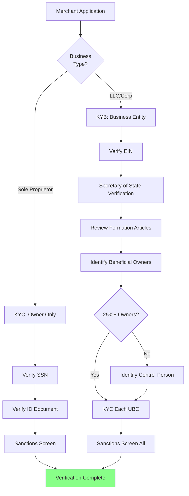

# KYC & KYB Verification

> **Last Updated:** 2025-12-28
> **Status:** Complete

## Quick Reference

**Key Regulations:**

- **FinCEN CIP Rule (31 CFR 1020.220)** - Customer Identification Program requirements
- **FinCEN CDD Rule (31 CFR 1010.230)** - Customer Due Diligence and beneficial ownership
- **OFAC Sanctions** - Strict liability screening against SDN list

**Critical Thresholds:**

- **25%** - Ownership threshold triggering beneficial owner identification
- **50%** - OFAC rule for automatic entity blocking
- **10 years** - Record retention requirement (updated March 2025)

**2025 Regulatory Updates:**

- **March 21, 2025** - FinCEN exempts U.S. domestic entities from CTA BOI reporting
- **March 21, 2025** - OFAC record retention extended from 5 to 10 years
- **June 2025** - Banks may use third-party sources for TIN verification

:::warning CDD Rule Still Active
While the Corporate Transparency Act (CTA) reporting was suspended for U.S. entities, the **FinCEN CDD Rule remains fully active**. PayFacs must still collect and verify beneficial ownership through sponsor bank requirements.
:::

## Overview

KYC (Know Your Customer) and KYB (Know Your Business) verification form the foundation of compliant merchant onboarding. These processes ensure you know who you're doing business with and meet regulatory requirements for preventing fraud, money laundering, and sanctions violations.

## Key Distinctions

| Aspect | KYC (Know Your Customer) | KYB (Know Your Business) |
|--------|--------------------------|--------------------------|
| **Focus** | Individual identity | Business entity |
| **Subjects** | Proprietors, principals, UBOs | Corporation, LLC, partnership |
| **Data Points** | Name, DOB, SSN, address | EIN, formation docs, ownership structure |
| **Verification** | ID documents, SSN validation | Secretary of State, IRS verification |
| **Regulatory Driver** | USA PATRIOT Act, BSA/AML | FinCEN CDD Rule |

## Verification Flow

## Module Contents

### [KYC Requirements](./kyc-requirements.md)

Master individual identity verification for business owners and principals.

**Core Topics:**
- CIP Compliance and verification flow
- Required data elements
- PEP and adverse media screening

**Deep Dive Topics:**

| Topic | Description |
|-------|-------------|
| [Verification Methods](./kyc/verification-methods.md) | Documentary, non-documentary, and biometric verification |
| [Provider Landscape](./kyc/providers.md) | Jumio, Onfido, Persona, Alloy, Socure comparisons |
| [PEP Screening](./kyc/pep-screening.md) | Politically exposed person identification and EDD |
| [Implementation Guide](./kyc/implementation.md) | Integration patterns, data retention, SAR filing |

---

### [KYB Requirements](./kyb-requirements.md)

Verify business entities and their legal standing.

**Core Topics:**
- Entity types and key terms
- KYB vs KYC distinction
- Verification flow diagrams

**Deep Dive Topics:**

| Topic | Description |
|-------|-------------|
| [Entity Types & Documentation](./kyb/entity-types.md) | Sole prop, LLC, corporation, partnership, non-profit requirements |
| [Verification Methods](./kyb/verification-methods.md) | EIN, Secretary of State, business credit, address verification |
| [Implementation Guide](./kyb/implementation.md) | Sponsor bank requirements, timelines, manual review triggers |
| [2025 Regulatory Updates](./kyb/regulatory-updates.md) | FinCEN CTA exemption and CDD Rule status |

---

### [Beneficial Ownership](./beneficial-ownership.md)

Identify the natural persons behind legal entities.

**Topics Covered:**
- Two-prong test (25% ownership OR control person)
- Indirect ownership calculation through corporate chains
- CDD Rule data collection and certification requirements
- 2025 CTA Update (March exemption for U.S. entities)
- Ongoing monitoring and event-driven re-verification

---

### [Sanctions Screening](./sanctions-screening.md)

Mandatory OFAC compliance with strict liability.

**Core Topics:**
- SDN list and 50% Rule
- Strict liability standard
- Screening process flow

**Deep Dive Topics:**

| Topic | Description |
|-------|-------------|
| [Fuzzy Matching](./sanctions/fuzzy-matching.md) | Levenshtein, Jaro-Winkler, Soundex algorithms |
| [False Positives](./sanctions/false-positives.md) | Mitigation strategies and exclusion lists |
| [Screening Operations](./sanctions/operations.md) | Real-time vs batch, ongoing monitoring, record retention |
| [True Match Procedures](./sanctions/true-match.md) | Blocking, SAR filing, OFAC reporting |
| [Vendor Landscape](./sanctions/vendors.md) | Dow Jones, World-Check, ComplyAdvantage comparison |
| [PayFac Implementation](./sanctions/payfac-implementation.md) | Sponsor bank requirements, transaction monitoring |
| [Enforcement Actions](./sanctions/enforcement.md) | Recent OFAC cases and lessons learned |

---

### [Quiz](./quiz.md)

Test your understanding with the KYC & KYB Quiz:

- **20 comprehensive questions** across all module topics
- **Scenario-based problems** testing practical application
- **Detailed explanations** with regulatory context

## Why This Matters

Effective KYC/KYB verification:

- **Prevents Fraud** - Confirms the merchant is who they claim to be
- **Ensures Compliance** - Meets federal BSA/AML requirements
- **Avoids Sanctions Violations** - Prevents processing for prohibited entities
- **Protects Sponsor Bank** - Demonstrates due diligence to your sponsor
- **Reduces Risk** - Identifies shell companies, synthetic identities, and bad actors

## Common Pitfalls

1. **Incomplete UBO Collection** - Missing beneficial owners who meet the 25% threshold
2. **Stale Sanctions Data** - Not using real-time or daily-updated OFAC lists
3. **Weak Document Verification** - Accepting photocopies without liveness checks
4. **Sole Proprietor Confusion** - Treating DBA names as separate legal entities
5. **Foreign Entity Gaps** - Inadequate verification for non-US businesses

## Learning Path

**Recommended order:**

1. [KYC Requirements](./kyc-requirements.md) - Start with individual identity verification
2. [KYB Requirements](./kyb-requirements.md) - Then business entity verification
3. [Beneficial Ownership](./beneficial-ownership.md) - Learn UBO identification rules
4. [Sanctions Screening](./sanctions-screening.md) - Understand OFAC compliance
5. [Quiz](./quiz.md) - Test your understanding

---

> **Next:** Begin with [KYC Requirements](./kyc-requirements.md) to learn individual identity verification processes, or continue to [Underwriting & Risk Assessment](/onboarding/underwriting/) after completing this module.
