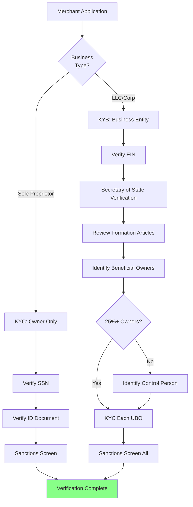

# KYC & KYB Verification

> **Last Updated:** 2025-12-26
>
> **Status:** Complete

## Quick Reference

**Key Regulations:**
- **FinCEN CIP Rule (31 CFR 1020.220)** - Customer Identification Program requirements
- **FinCEN CDD Rule (31 CFR 1010.230)** - Customer Due Diligence and beneficial ownership
- **OFAC Sanctions** - Strict liability screening against SDN list

**Critical Thresholds:**
- **25%** - Ownership threshold triggering beneficial owner identification
- **50%** - OFAC rule for automatic entity blocking
- **10 years** - Record retention requirement (updated March 2025)

**2025 Regulatory Updates:**
- **March 21, 2025** - FinCEN exempts U.S. domestic entities from CTA BOI reporting
- **March 21, 2025** - OFAC record retention extended from 5 to 10 years
- **June 2025** - Banks may use third-party sources for TIN verification

:::warning CDD Rule Still Active
While the Corporate Transparency Act (CTA) reporting was suspended for U.S. entities, the **FinCEN CDD Rule remains fully active**. PayFacs must still collect and verify beneficial ownership through sponsor bank requirements.
:::

## Overview

KYC (Know Your Customer) and KYB (Know Your Business) verification form the foundation of compliant merchant onboarding. These processes ensure you know who you're doing business with and meet regulatory requirements for preventing fraud, money laundering, and sanctions violations.

## What You'll Learn

- **KYC Requirements** - How to verify individual identities for proprietors, principals, and beneficial owners
- **KYB Requirements** - Business entity validation, documentation requirements, and verification methods
- **Beneficial Ownership** - FinCEN's Ultimate Beneficial Owner (UBO) rule and implementation
- **Sanctions Screening** - OFAC, SDN list checking, and ongoing monitoring obligations

## Key Distinctions

| Aspect | KYC (Know Your Customer) | KYB (Know Your Business) |
|--------|--------------------------|--------------------------|
| **Focus** | Individual identity | Business entity |
| **Subjects** | Proprietors, principals, UBOs | Corporation, LLC, partnership |
| **Data Points** | Name, DOB, SSN, address | EIN, formation docs, ownership structure |
| **Verification** | ID documents, SSN validation | Secretary of State, IRS verification |
| **Regulatory Driver** | USA PATRIOT Act, BSA/AML | FinCEN CDD Rule |

## Verification Flow

## Module Contents

### [KYC Requirements](./kyc-requirements.md)

Master individual identity verification for business owners and principals:
- **CIP Compliance** - FinCEN Customer Identification Program requirements
- **Verification Methods** - Documentary (ID documents) vs. non-documentary (database checks)
- **Liveness Detection** - ISO 30107-3 PAD standards and deepfake prevention
- **PEP Screening** - Risk-based approach to politically exposed persons
- **Provider Landscape** - Jumio, Onfido, Persona, Socure comparisons

### [KYB Requirements](./kyb-requirements.md)

Verify business entities and their legal standing:
- **Entity Types** - Sole proprietor, LLC, corporation, partnership documentation
- **EIN Verification** - IRS TIN Matching, Form 147C, third-party services
- **State Verification** - Secretary of State searches, Certificate of Good Standing
- **Business Credit** - D&B, Experian Business reports and indicators
- **Website/Address Verification** - Virtual office detection, physical presence confirmation

### [Beneficial Ownership](./beneficial-ownership.md)

Identify the natural persons behind legal entities:
- **Two-Prong Test** - 25% ownership threshold OR control person
- **Indirect Ownership** - Multi-layer calculation through corporate chains
- **CDD Rule Requirements** - Data collection, certification, verification standards
- **2025 CTA Update** - March exemption for U.S. entities (CDD Rule still active)
- **Ongoing Monitoring** - Event-driven re-verification triggers

### [Sanctions Screening](./sanctions-screening.md)

Mandatory OFAC compliance with strict liability:
- **SDN List Screening** - Real-time verification against sanctions lists
- **50% Rule** - Automatic blocking for entities majority-owned by SDN parties
- **Fuzzy Matching** - Algorithms and false positive management
- **True Match Procedures** - Blocking, reporting, and sponsor bank notification
- **Record Retention** - 10-year requirement (March 2025 update)

## Why This Matters

Effective KYC/KYB verification:

- **Prevents Fraud** - Confirms the merchant is who they claim to be
- **Ensures Compliance** - Meets federal BSA/AML requirements
- **Avoids Sanctions Violations** - Prevents processing for prohibited entities
- **Protects Sponsor Bank** - Demonstrates due diligence to your sponsor
- **Reduces Risk** - Identifies shell companies, synthetic identities, and bad actors

## Common Pitfalls

1. **Incomplete UBO Collection** - Missing beneficial owners who meet the 25% threshold
2. **Stale Sanctions Data** - Not using real-time or daily-updated OFAC lists
3. **Weak Document Verification** - Accepting photocopies without liveness checks
4. **Sole Proprietor Confusion** - Treating DBA names as separate legal entities
5. **Foreign Entity Gaps** - Inadequate verification for non-US businesses

## Self-Assessment

Test your understanding with the [KYC & KYB Quiz](./quiz.md), covering:

- **20 comprehensive questions** across all module topics
- **Scenario-based problems** testing practical application
- **Detailed explanations** with regulatory context
- **Key concepts** including the 20/20/20/20/20 ownership scenario, 50% Rule, and strict liability

## Learning Path

**Recommended order:**

1. [KYC Requirements](./kyc-requirements.md) - Start with individual identity verification
2. [KYB Requirements](./kyb-requirements.md) - Then business entity verification
3. [Beneficial Ownership](./beneficial-ownership.md) - Learn UBO identification rules
4. [Sanctions Screening](./sanctions-screening.md) - Understand OFAC compliance
5. [Quiz](./quiz.md) - Test your understanding

---

> **Next:** Begin with [KYC Requirements](./kyc-requirements.md) to learn individual identity verification processes, or continue to [Underwriting & Risk Assessment](/onboarding/underwriting/) after completing this module.
