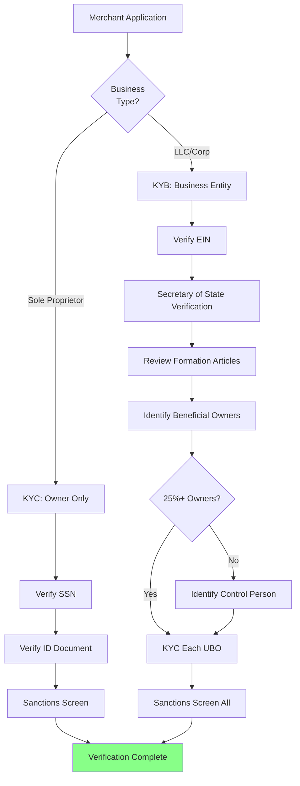

# KYC & KYB Verification

> **Status:** Pending content development

## Overview

KYC (Know Your Customer) and KYB (Know Your Business) verification form the foundation of compliant merchant onboarding. These processes ensure you know who you're doing business with and meet regulatory requirements for preventing fraud, money laundering, and sanctions violations.

## What You'll Learn

- **KYC Requirements** - How to verify individual identities for proprietors, principals, and beneficial owners
- **KYB Requirements** - Business entity validation, documentation requirements, and verification methods
- **Beneficial Ownership** - FinCEN's Ultimate Beneficial Owner (UBO) rule and implementation
- **Sanctions Screening** - OFAC, SDN list checking, and ongoing monitoring obligations

## Key Distinctions

| Aspect | KYC (Know Your Customer) | KYB (Know Your Business) |
|--------|--------------------------|--------------------------|
| **Focus** | Individual identity | Business entity |
| **Subjects** | Proprietors, principals, UBOs | Corporation, LLC, partnership |
| **Data Points** | Name, DOB, SSN, address | EIN, formation docs, ownership structure |
| **Verification** | ID documents, SSN validation | Secretary of State, IRS verification |
| **Regulatory Driver** | USA PATRIOT Act, BSA/AML | FinCEN CDD Rule |

## Verification Flow

## Topics Covered

### Individual Identity (KYC)

- Identity document requirements (driver's license, passport)
- SSN/ITIN validation methods
- Address verification techniques
- Credit bureau checks
- Identity verification services (IDology, Socure, Persona)

### Business Verification (KYB)

- Business entity types and documentation needs
- EIN verification through IRS
- Secretary of State business registry searches
- Articles of incorporation/organization review
- Operating agreements and corporate structure
- Business credit reports (Dun & Bradstreet, Experian Business)

### Beneficial Ownership Rule

- FinCEN Customer Due Diligence (CDD) requirements
- 25% ownership threshold
- Control person identification when no 25% owners exist
- Certification requirements
- UBO data collection and validation

### Sanctions Screening

- OFAC (Office of Foreign Assets Control) list checking
- SDN (Specially Designated Nationals) list
- Sanctioned countries and prohibited jurisdictions
- PEP (Politically Exposed Persons) screening
- Ongoing monitoring vs. one-time checks
- Third-party screening services (Comply Advantage, Chainalysis)

## Why This Matters

Effective KYC/KYB verification:

- **Prevents Fraud** - Confirms the merchant is who they claim to be
- **Ensures Compliance** - Meets federal BSA/AML requirements
- **Avoids Sanctions Violations** - Prevents processing for prohibited entities
- **Protects Sponsor Bank** - Demonstrates due diligence to your sponsor
- **Reduces Risk** - Identifies shell companies, synthetic identities, and bad actors

## Common Pitfalls

1. **Incomplete UBO Collection** - Missing beneficial owners who meet the 25% threshold
2. **Stale Sanctions Data** - Not using real-time or daily-updated OFAC lists
3. **Weak Document Verification** - Accepting photocopies without liveness checks
4. **Sole Proprietor Confusion** - Treating DBA names as separate legal entities
5. **Foreign Entity Gaps** - Inadequate verification for non-US businesses

## Self-Assessment

Complete the quiz in this section to test your understanding of KYC/KYB verification processes.

---

> **Next:** Explore each verification component in detail through the topics in this section.
