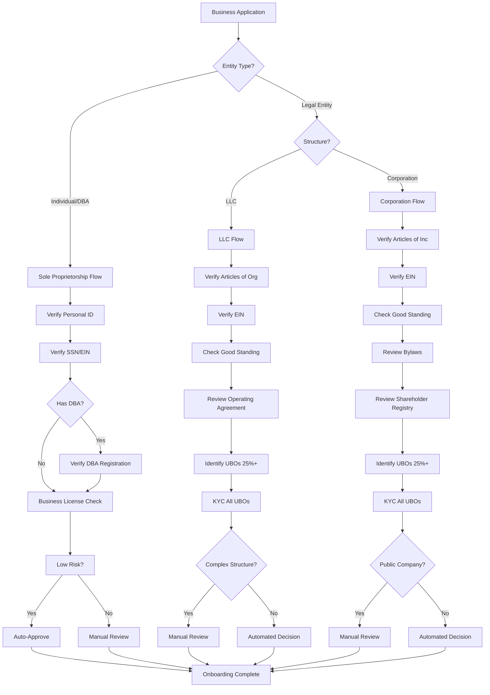

# KYB Requirements

> **Last Updated:** 2025-12-28
> **Status:** Complete

## Quick Reference

**Purpose:** Verify business entity legitimacy, legal structure, and authorized representatives

**Key Verification Points:**
- Legal entity existence and good standing
- Tax identification (EIN/TIN) validation
- Business ownership structure
- Authorized signers and decision-makers
- Physical business presence

**Primary Entity Types:**
- Sole Proprietorship / DBA
- Limited Liability Company (LLC)
- Corporation (C-Corp / S-Corp)
- Partnership
- Non-Profit Organization

**Verification Sources:** State Secretary of State offices, IRS, D&B, Experian Business, LexisNexis

## Topics in This Section

Explore the detailed KYB topics:

| Topic | Description |
|-------|-------------|
| **[Entity Types & Documentation](./kyb/entity-types.md)** | Required documents for each business type (sole prop, LLC, corp, partnership, non-profit) |
| **[Verification Methods](./kyb/verification-methods.md)** | EIN validation, Secretary of State checks, business credit, address and website verification |
| **[Implementation Guide](./kyb/implementation.md)** | Sponsor bank requirements, approval timelines, manual review triggers, rejection handling |
| **[2025 Regulatory Updates](./kyb/regulatory-updates.md)** | FinCEN CTA exemption and CDD Rule status |

## Overview

**Know Your Business (KYB)** is the process of verifying a business entity's legal existence, structure, ownership, and authorization to conduct payment processing activities. While KYC (Know Your Customer) focuses on individual identity verification, KYB validates the business itself.

### Why KYB Matters

**For Payment Facilitators:**
- **Regulatory Compliance:** FinCEN Customer Due Diligence (CDD) Rule requires identifying and verifying beneficial owners
- **Risk Management:** Prevents shell companies, fraud schemes, and money laundering operations
- **Sponsor Bank Requirements:** Banks mandate comprehensive business verification before enabling payment processing
- **Network Rules:** Visa and Mastercard require proper merchant identification and monitoring

**For Merchants:**
- Establishes trust and credibility
- Enables payment processing capabilities
- Provides access to financial services
- Protects against identity theft and fraud

### KYB vs KYC

| Aspect | KYB | KYC |
|--------|-----|-----|
| **Subject** | Business entity | Individual person |
| **Documents** | Articles, EIN, licenses | Government ID, SSN |
| **Verification** | State records, IRS | Identity databases, credit bureaus |
| **Ownership** | UBOs, corporate structure | N/A |
| **Complexity** | High (multi-layer entities) | Low to moderate |
| **Timeline** | Hours to weeks | Minutes to days |

:::info Key Difference
KYB verifies the business exists legally and identifies who controls it. KYC verifies individual identities. Both are required for complete merchant onboarding.
:::

## Key Terms

**Articles of Incorporation/Organization:** Legal documents filed with the state to create a corporation or LLC, containing business name, purpose, registered agent, and initial directors/members.

**Certificate of Good Standing:** Official state document confirming a business is properly registered, current on filings and fees, and authorized to conduct business.

**DBA (Doing Business As):** Fictitious business name registration allowing a business to operate under a name different from its legal name.

**EIN (Employer Identification Number):** Federal tax ID issued by the IRS for business entities, similar to an SSN for individuals.

**Operating Agreement:** Internal LLC document outlining ownership percentages, management structure, and operating procedures (not filed with the state).

**Corporate Bylaws:** Internal rules governing corporation management and operations (not filed with the state).

**Registered Agent:** Person or entity designated to receive legal documents and official correspondence on behalf of a business.

**Business License:** Permit issued by local, state, or federal government authorizing specific business activities (industry-dependent).

## Entity Verification Flow

## Self-Assessment Questions

**Q1: What are the key documents required for LLC merchant onboarding?**

Click to see answer

**Required Documents:**

1. **Articles of Organization (Certificate of Formation)** - Official state filing creating the LLC
2. **EIN Letter** - IRS Form CP 575 or Form 147C
3. **Operating Agreement** - Internal document showing ownership structure (required in some states)
4. **Certificate of Good Standing** - Official state document confirming current status (should be &lt;90 days old)
5. **Beneficial Owner Identification** - Government ID and KYC for all 25%+ owners

See [Entity Types & Documentation](./kyb/entity-types.md) for full details.

---

**Q2: How do you verify a business's EIN with the IRS?**

Click to see answer

**Three Primary Methods:**

1. **IRS TIN Matching Program** - Free via IRS e-Services, real-time verification
2. **IRS Form 147C Letter** - Official IRS verification, available by phone/fax/mail
3. **Third-Party Services** - Middesk, D&B, Tax1099 integrations

See [Verification Methods](./kyb/verification-methods.md) for complete process.

---

**Q3: What triggers manual review vs automated approval in KYB?**

Click to see answer

**Manual Review Triggers:**
- High-risk industries (gaming, CBD, crypto, adult)
- Complex ownership structures (multi-layer LLCs, offshore entities)
- Sanctions/watchlist screening hits
- New business (&lt;6 months) with high volume projections
- Shell company indicators (virtual office, no website)
- Data inconsistencies across documents

See [Implementation Guide](./kyb/implementation.md) for detailed criteria.

## Related Topics

- [KYC Requirements](./kyc-requirements.md) - Individual identity verification for business owners and principals
- [Beneficial Ownership](./beneficial-ownership.md) - Identifying and verifying UBOs (25%+ owners)
- [Sanctions Screening](./sanctions-screening.md) - OFAC, MATCH, PEP, and watchlist screening processes
- [Business Underwriting](/onboarding/underwriting/fundamentals.md) - Risk assessment and approval criteria

## References

**Government Sources:**

- [FinCEN Customer Due Diligence Rule](https://www.fincen.gov/resources/statutes-regulations/guidance/customer-due-diligence-requirements-financial-institutions)
- [IRS EIN Information](https://www.irs.gov/businesses/small-businesses-self-employed/employer-id-numbers)
- [IRS TIN Matching](https://www.irs.gov/payments/tin-matching)
- [NASS Secretary of State Directory](https://www.nass.org/business-services/corporations)

**Business Verification Services:**

- [Middesk Business Verification](https://www.middesk.com/)
- [Dun & Bradstreet Business Directory](https://www.dnb.com/)
- [Experian Business Credit Reports](https://www.experian.com/business/)
