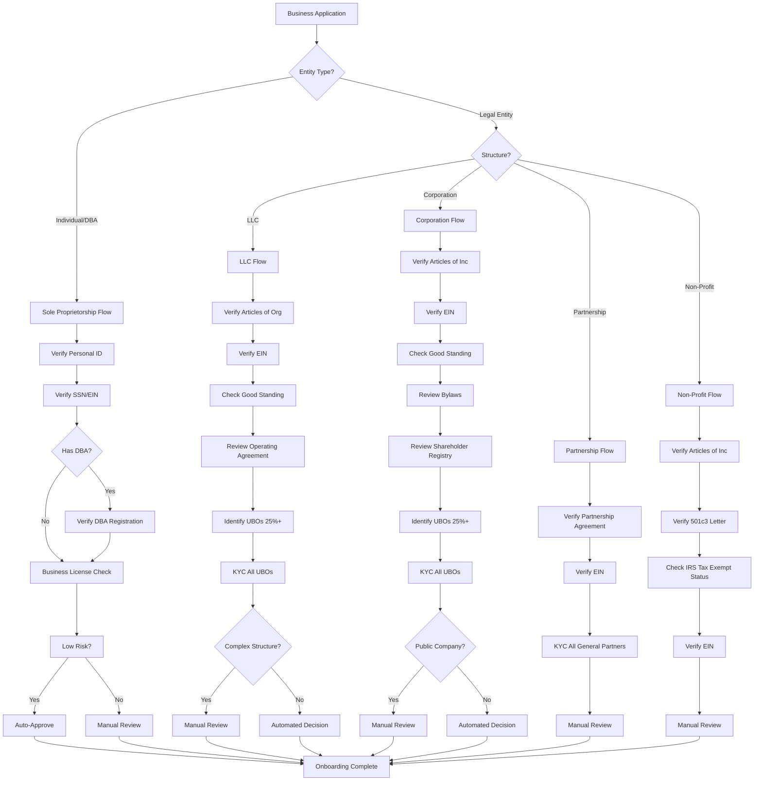
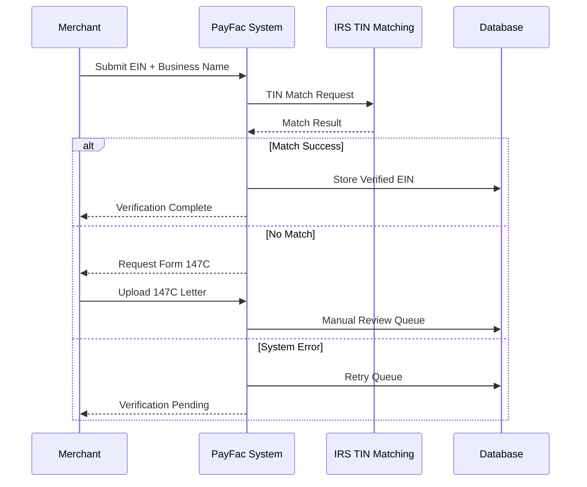
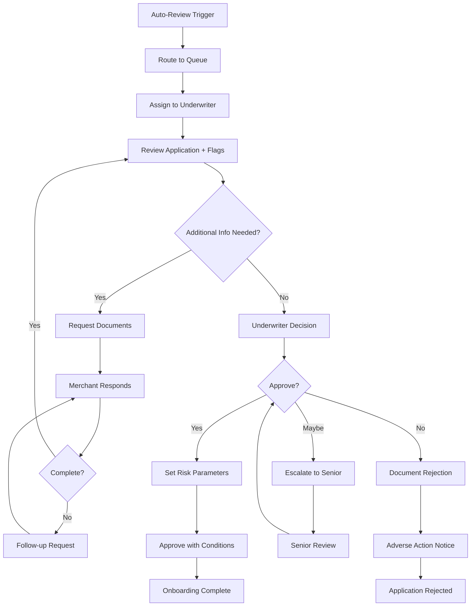

# KYB Requirements

> **Last Updated:** 2025-12-25
> **Status:** Complete

## Quick Reference

**Purpose:** Verify business entity legitimacy, legal structure, and authorized representatives

**Key Verification Points:**
- Legal entity existence and good standing
- Tax identification (EIN/TIN) validation
- Business ownership structure
- Authorized signers and decision-makers
- Physical business presence

**Primary Entity Types:**
- Sole Proprietorship / DBA
- Limited Liability Company (LLC)
- Corporation (C-Corp / S-Corp)
- Partnership
- Non-Profit Organization

**Verification Sources:** State Secretary of State offices, IRS, D&B, Experian Business, LexisNexis

## Overview

**Know Your Business (KYB)** is the process of verifying a business entity's legal existence, structure, ownership, and authorization to conduct payment processing activities. While KYC (Know Your Customer) focuses on individual identity verification, KYB validates the business itself.

### Why KYB Matters

**For Payment Facilitators:**
- **Regulatory Compliance:** FinCEN Customer Due Diligence (CDD) Rule requires identifying and verifying beneficial owners
- **Risk Management:** Prevents shell companies, fraud schemes, and money laundering operations
- **Sponsor Bank Requirements:** Banks mandate comprehensive business verification before enabling payment processing
- **Network Rules:** Visa and Mastercard require proper merchant identification and monitoring

**For Merchants:**
- Establishes trust and credibility
- Enables payment processing capabilities
- Provides access to financial services
- Protects against identity theft and fraud

### KYB vs KYC

| Aspect | KYB | KYC |
|--------|-----|-----|
| **Subject** | Business entity | Individual person |
| **Documents** | Articles, EIN, licenses | Government ID, SSN |
| **Verification** | State records, IRS | Identity databases, credit bureaus |
| **Ownership** | UBOs, corporate structure | N/A |
| **Complexity** | High (multi-layer entities) | Low to moderate |
| **Timeline** | Hours to weeks | Minutes to days |

:::info Key Difference
KYB verifies the business exists legally and identifies who controls it. KYC verifies individual identities. Both are required for complete merchant onboarding.
:::

## Key Terms

**Articles of Incorporation/Organization:** Legal documents filed with the state to create a corporation or LLC, containing business name, purpose, registered agent, and initial directors/members.

**Certificate of Good Standing:** Official state document confirming a business is properly registered, current on filings and fees, and authorized to conduct business.

**DBA (Doing Business As):** Fictitious business name registration allowing a business to operate under a name different from its legal name.

**EIN (Employer Identification Number):** Federal tax ID issued by the IRS for business entities, similar to an SSN for individuals.

**Operating Agreement:** Internal LLC document outlining ownership percentages, management structure, and operating procedures (not filed with the state).

**Corporate Bylaws:** Internal rules governing corporation management and operations (not filed with the state).

**Registered Agent:** Person or entity designated to receive legal documents and official correspondence on behalf of a business.

**Business License:** Permit issued by local, state, or federal government authorizing specific business activities (industry-dependent).

## Documentation Requirements by Entity Type

### Overview Matrix

| Entity Type | Required Documents | Typical Timeline | Common Issues |
|-------------|-------------------|------------------|---------------|
| **Sole Proprietorship** | Personal ID, SSN/EIN, DBA (if applicable), Business License | 1-3 days (manual)<br/>&lt;10 min (automated) | Missing DBA registration, unlicensed operation |
| **LLC** | Articles of Organization, EIN Letter, Operating Agreement, Good Standing Certificate | 3-5 days (manual)<br/>10 min - 2 hrs (automated) | Expired good standing, missing operating agreement |
| **Corporation** | Articles of Incorporation, Bylaws, EIN Letter, Stock Certificates, Good Standing | 5-7 days (manual)<br/>2-4 hrs (automated) | Complex ownership structure, offshore entities |
| **Partnership** | Partnership Agreement, EIN, Partner KYC for all partners | 3-5 days | Incomplete partner information |
| **Non-Profit** | Articles of Incorporation, 501(c)(3) Letter, Bylaws, EIN | 5-10 days | Invalid tax-exempt status |

### Sole Proprietorship

**Definition:** Business owned and operated by a single individual, with no legal separation between owner and business.

**Required Documentation:**

1. **Personal Identification**
   - Government-issued photo ID (driver's license, passport)
   - Social Security Number (SSN)

2. **Business Name Registration (if applicable)**
   - **DBA (Doing Business As) Filing** - Required when operating under a name different from the owner's legal name
   - Filed with county clerk or state agency
   - **Cost:** $5-$50 typical, up to $150 in some states
   - **Validity:** Usually 5 years, requires renewal

3. **Tax Identification**
   - SSN (for sole proprietors without employees)
   - EIN (if hiring employees or electing corporate tax treatment)

4. **Business License**
   - Industry-specific licenses (food service, contractors, healthcare, etc.)
   - Local business operation permits
   - Professional certifications

**Verification Steps:**
- Verify personal identity via KYC process
- Check DBA registration with county/state records
- Validate business license if industry-regulated
- Confirm business address and operations

**Common Issues:**
- Operating under fictitious name without DBA registration
- Mixing personal and business finances (red flag for fraud)
- Missing industry-specific licenses

:::tip Sole Proprietor Fast Track
Many PayFacs automate sole proprietor onboarding for low-risk industries (e.g., retail, professional services) with approvals in under 10 minutes when all documents are provided.
:::

### LLC (Limited Liability Company)

**Definition:** Legal business structure providing liability protection for owners (members) while maintaining flexible management and pass-through taxation.

**Required Documentation:**

1. **Articles of Organization (Certificate of Formation)**
   - Official state filing creating the LLC
   - Contains: Business name, registered agent, members/managers
   - Filed with Secretary of State
   - **Obtain from:** State SOS office or online portal

2. **Operating Agreement**
   - Internal document outlining ownership structure, management, profit distribution
   - **Not filed with the state** (internal document)
   - **States requiring Operating Agreement:** California, Delaware, Maine, Missouri, New York, Arkansas, DC, Iowa, New Mexico
   - Even if not required, highly recommended for multi-member LLCs

3. **EIN Letter**
   - **IRS Form CP 575** - Original EIN confirmation letter
   - **IRS Form 147C** - Verification of existing EIN
   - **How to obtain:**
     - Phone: 1-800-829-4933 (immediate verbal confirmation)
     - Fax: Same-day confirmation
     - Mail: 4-6 weeks
     - IRS e-Services TIN Matching (free: 25 interactive/100k bulk)

4. **Certificate of Good Standing**
   - Confirms LLC is current on state filings and authorized to operate
   - **Cost:** $10-$50 (FREE in Wyoming, Colorado)
   - **Validity:** Many PayFacs require &lt;90 days old
   - **Requirements:** Annual reports filed, fees paid, registered agent maintained

5. **Beneficial Ownership Documentation**
   - Identification for all members with 25%+ ownership
   - See [Beneficial Ownership](./beneficial-ownership.md) for details

**Verification Steps:**
- Search Secretary of State business database
- Verify active/good standing status
- Validate EIN with IRS TIN Matching
- Review operating agreement for ownership structure
- Conduct KYC on all 25%+ beneficial owners

**Common Issues:**
- Expired or suspended status (missed annual reports)
- Missing operating agreement in states that require it
- Single-member LLC without clear management structure
- Recent formation (&lt;6 months) with high projected volume

:::warning Multi-Layer LLC Structures
LLCs owned by other LLCs require drilling down through ownership layers until reaching natural persons with 25%+ beneficial ownership. This triggers manual review and extends approval timelines to 5-10 days.
:::

### Corporation

**Definition:** Legal entity separate from its owners (shareholders), providing strongest liability protection with formal governance structure.

**Types:**
- **C-Corporation:** Standard corporation taxed separately from owners
- **S-Corporation:** Pass-through taxation election (requires IRS approval)

**Required Documentation:**

1. **Articles of Incorporation (Certificate of Incorporation)**
   - Official state filing creating the corporation
   - Contains: Corporate name, purpose, stock structure, incorporator
   - Filed with Secretary of State

2. **Corporate Bylaws**
   - Internal rules governing board meetings, voting, officer duties
   - **Not filed with the state**
   - Required for proper corporate governance

3. **EIN Letter**
   - Same as LLC requirements (CP 575 or 147C)

4. **Stock Certificates / Shareholder Registry**
   - Proof of share issuance and ownership
   - Shareholder registry showing all owners and percentages
   - Required for UBO identification

5. **Certificate of Good Standing**
   - Same requirements as LLC

6. **Board Resolutions**
   - Corporate resolution authorizing payment processing agreement
   - Board minutes approving signatories

**Verification Steps:**
- Secretary of State incorporation verification
- Validate EIN with IRS
- Review shareholder registry for beneficial owners (25%+)
- Verify authorized signers via board resolution
- Check good standing status

**Common Issues:**
- Complex ownership structures (holding companies, foreign entities)
- Missing or outdated shareholder registry
- Unauthorized signers (not listed in bylaws/resolutions)
- Publicly traded companies (different KYB requirements)

:::info S-Corp vs C-Corp
From a KYB perspective, both are treated identically. The distinction matters for tax purposes but not entity verification. Both require the same documentation.
:::

### Partnership

**Definition:** Business owned by two or more individuals or entities sharing profits, losses, and management responsibilities.

**Types:**
- **General Partnership (GP):** All partners share liability and management
- **Limited Partnership (LP):** General partners manage; limited partners invest only
- **Limited Liability Partnership (LLP):** All partners have limited liability

**Required Documentation:**

1. **Partnership Agreement**
   - Legal contract defining partnership terms, profit-sharing, decision-making
   - May be written or oral (written strongly recommended)
   - Should include: Partner names, capital contributions, profit splits, management duties

2. **EIN**
   - Required for all partnerships filing tax returns

3. **Certificate of Partnership** (if registered)
   - Some states require formal partnership registration
   - LLPs must register in all states

4. **KYC for All Partners**
   - Complete identity verification for each partner
   - Beneficial ownership for partners with 25%+ stake

**Verification Steps:**
- Review partnership agreement for structure
- Conduct KYC on all general partners
- Verify EIN with IRS
- Check state registration if applicable

**Common Issues:**
- Oral partnerships with no written agreement
- Unclear profit-sharing arrangements
- Missing partner information
- Inactive or deceased partners still listed

### Non-Profit Organizations

**Definition:** Organizations formed for charitable, educational, religious, or social purposes with tax-exempt status.

**Required Documentation:**

1. **Articles of Incorporation**
   - Must include non-profit purpose statement
   - Filed with Secretary of State

2. **501(c)(3) Determination Letter**
   - IRS approval of tax-exempt status
   - Confirms organization qualifies for charitable donations
   - **Critical:** Verify letter is current and not revoked

3. **Bylaws**
   - Organizational governance rules
   - Board structure and voting procedures

4. **EIN**
   - Required for all non-profits

5. **Board Resolution**
   - Authorizing payment processing services
   - Listing authorized signers

**Verification Steps:**
- Verify 501(c)(3) status via IRS Tax Exempt Organization Search
- Check Secretary of State registration
- Review bylaws for board authority
- Validate EIN

**Common Issues:**
- Revoked tax-exempt status (failure to file Form 990)
- Unauthorized commercial activities
- Missing board authorization

:::danger Tax-Exempt Status Verification
Always verify current 501(c)(3) status via IRS Tax Exempt Organization Search (https://apps.irs.gov/app/eos/). Revoked status means the organization is not eligible for tax-exempt benefits and may face restrictions on payment processing.
:::

## Entity Verification Flow



## Verification Methods

### EIN/Tax ID Verification

The **Employer Identification Number (EIN)** is the primary federal tax identifier for businesses. Validating the EIN confirms the business is registered with the IRS and authorized to operate.

**Verification Options:**

**1. IRS TIN Matching Program**
- **Free service** via IRS e-Services
- **Limits:** 25 interactive matches or 100,000 bulk matches
- **Process:**
  - Create IRS e-Services account
  - Submit TIN, name, and name type (business or individual)
  - Receive match/no-match response
- **Use case:** Real-time validation during onboarding

**2. IRS Form 147C Letter**
- **Official verification** of existing EIN
- **How to request:**
  - **Phone:** 1-800-829-4933 (immediate verbal confirmation for authorized parties)
  - **Fax:** Same-day confirmation
  - **Mail:** 4-6 weeks processing time
- **Use case:** Merchant cannot locate original CP 575 letter

**3. Third-Party Services**
- **Middesk:** Integrates with IRS systems, real-time EIN validation
- **D&B:** Cross-references EIN with business credit file
- **Tax1099:** Specialized TIN verification for Form 1099 reporting

**Backup Withholding:**
- If EIN is invalid or does not match business name, payer must withhold **24%** of payments for IRS backup withholding
- PayFacs cannot process for merchants with invalid EINs

**Verification Process:**



:::tip IRS TIN Matching Best Practice
Implement real-time TIN matching during application submission. Immediate validation prevents downstream issues and reduces manual review volume by 40-60%.
:::

### Secretary of State Verification

Every business entity (except sole proprietorships using personal names) must register with the state where incorporated or formed.

**What to Verify:**

1. **Entity Existence**
   - Business is registered and legally formed
   - Entity ID/file number matches application

2. **Current Status**
   - **Active/Good Standing:** Authorized to operate
   - **Inactive:** Voluntarily dissolved
   - **Suspended/Revoked:** Failed to file reports or pay fees (high risk)
   - **Administratively Dissolved:** State action due to non-compliance (reject)

3. **Registration Details**
   - Legal business name matches application
   - Formation date (flag entities &lt;6 months old)
   - Registered agent name and address
   - Principal office address

4. **Annual Report Compliance**
   - Recent filings are current
   - No outstanding fees or penalties

**Verification Methods:**

**1. Manual State Database Search**
- Each state maintains Secretary of State business database
- Free public access (most states)
- Search by business name or entity ID

**2. API Integration**
- **Middesk:** Aggregates all 50 state SOS offices, real-time lookups
- **Corpnet:** Multi-state business search and monitoring
- **State-specific APIs:** Some states offer official APIs (Delaware, Wyoming)

**3. Certificate of Good Standing**
- Official state document confirming current status
- **Cost:** $10-$50 (FREE in Wyoming, Colorado)
- **Validity:** Most PayFacs require &lt;90 days old
- Merchant obtains from state and uploads

**Red Flags:**
- Suspended or dissolved status
- Mismatched business name
- Very recent formation with high volume projections
- Frequent state changes (jurisdiction shopping)
- Missing or invalid registered agent

**Multi-State Considerations:**
- Business may be registered in one state (incorporation state) but operate nationally
- Verify registration in state of incorporation AND states where doing business
- Foreign qualification required for out-of-state operations in many states

:::warning Virtual Office Addresses
Starting Q1 2025, Middesk flags virtual mailbox services (Regus, WeWork Mail, UPS Store) as potential shell company indicators. Cross-reference registered agent address with physical business location.
:::

### Business Credit Verification

Business credit reports provide financial history, trade references, and risk indicators beyond basic entity verification.

**Primary Services:**

**1. Dun & Bradstreet (D&B)**
- **Coverage:** 600M+ global business entities
- **DUNS Number:** Unique 9-digit business identifier
- **Reports Include:**
  - Payment history (trade references)
  - Credit score (Paydex: 1-100, higher is better)
  - Financial statements (if available)
  - Corporate family tree (parent/subsidiary relationships)
  - Judgments, liens, bankruptcies
- **Cost:** $50-$200 per report

**2. Experian Business**
- Business credit scores (Intelliscore Plus: 1-100)
- Payment trends and trade lines
- Public records (judgments, liens, UCCs)
- Industry risk analysis

**3. Equifax Business**
- Business credit report
- Commercial credit score
- Failure risk score

**What PayFacs Look For:**

| Indicator | Green Flag | Yellow Flag | Red Flag |
|-----------|------------|-------------|----------|
| **Credit Score** | 80-100 (D&B Paydex) | 50-79 | &lt;50 |
| **Trade Lines** | 10+ positive references | 3-9 references | &lt;3 or negative |
| **Payment History** | Pays on time (DBT 0-30) | Occasional late (DBT 30-60) | Frequent late (DBT 60+) |
| **Public Records** | None | Satisfied liens/judgments | Active liens, bankruptcy |
| **Business Age** | 3+ years | 1-3 years | &lt;1 year |

**When Credit Checks Are Used:**
- **High-volume merchants:** >$100k monthly processing
- **High-risk industries:** Extended credit terms common
- **Commercial/B2B:** Longer payment cycles
- **Sub-merchant platforms:** Evaluating platform viability

**Limitations:**
- New businesses have no credit history (thin file)
- Small businesses may not have trade references
- Credit score is backward-looking (doesn't predict future)

:::info DUNS Number Requirement
Some sponsor banks require a DUNS number for all corporate merchants processing >$50k monthly. Obtaining a DUNS number is free via D&B website but can take 30 days for first-time businesses.
:::

## Business Address Verification

Confirming a legitimate physical business presence helps identify shell companies and mail drops.

**Verification Methods:**

**1. USPS Address Validation**
- Confirms address exists and is deliverable
- Standardizes address format
- **API:** USPS Web Tools API (free for low volume)

**2. Physical Presence Confirmation**
- **Google Street View:** Visual verification of business location
- **Google Business Profile:** Verified business listing with reviews
- **Yelp/Business Directories:** Cross-reference listings

**3. Utility Bill or Lease Agreement**
- Request proof of business address
- Utility bill (electric, water, internet) in business name
- Commercial lease agreement
- Property deed (if owned)

**4. Third-Party Services**
- **Middesk:** Virtual mailbox detection (Q1 2025 update)
- **Melissa Data:** Address verification and geocoding
- **Loqate:** International address validation

**Red Flags:**

**Virtual Office / Mail Drop:**
- UPS Store, Regus, WeWork Mail, virtual office providers
- No physical business operations at address
- Shared suite numbers with many businesses
- **Risk:** Shell company indicator, no physical operations

**Residential Address:**
- Home-based business (acceptable for many low-risk industries)
- High-volume processing from residence (unusual, review carefully)

**PO Box Only:**
- Cannot serve as registered agent or principal office in most states
- Acceptable for mailing address but requires physical address too

**Frequent Address Changes:**
- Multiple address changes in short period
- Different address on each document
- **Risk:** Unstable business, potential fraud

**Foreign Address (Non-US):**
- Offshore entities with no U.S. presence
- Requires enhanced due diligence
- May trigger sponsor bank restrictions

**Verification Best Practices:**
1. Cross-reference address across all documents (Articles, EIN letter, bank account)
2. Validate address matches business type (e.g., restaurant at commercial address)
3. Check Google Business Profile for consistency
4. Flag virtual offices for manual review
5. For high-risk or high-volume, request utility bill or lease

:::warning Virtual Office Detection
As of Q1 2025, Middesk's updated service flags known virtual mailbox providers. PayFacs should implement secondary verification (lease, utility bill) when virtual office is detected, especially for high-volume merchants.
:::

## Website Verification

Website review provides operational validation and helps assess business legitimacy and risk profile.

**What to Verify:**

**1. Domain Ownership**
- **WHOIS Lookup:** Verify domain registration matches business entity
- **Domain Age:** New domains (&lt;6 months) with mature businesses are suspicious
- **Registrar:** Legitimate registrars (GoDaddy, Namecheap) vs. anonymizing services

**2. Website Content**
- **Product/Service Clarity:** Clear description of what business sells
- **Contact Information:** Phone, email, physical address match application
- **About Us / Company Info:** Validates business story and timeline
- **Terms of Service:** Professional, legally compliant terms
- **Privacy Policy:** Especially critical for businesses handling customer data

**3. SSL Certificate**
- **HTTPS:** Secure connection required for e-commerce
- **Certificate Validity:** Not expired, matches domain
- **Issuer:** Trusted CA (Let's Encrypt, DigiCert, etc.)

**4. Trust Signals**
- Customer reviews (Google, Trustpilot, BBB)
- Social media presence (Facebook, Instagram, LinkedIn)
- Professional design and functionality
- Contact forms work, email addresses are active

**5. Risk Indicators**
- **Industry Type:** Match with stated MCC code
- **Prohibited Products:** Tobacco, adult content, gambling (restricted)
- **Compliance:** Age verification for restricted products
- **Shipping/Delivery:** International shipping increases risk
- **Pricing:** Compare to market rates (too-good-to-be-true pricing)

**Red Flags:**

| Issue | Risk Level | Action |
|-------|------------|--------|
| No website or under construction | High | Reject or require explanation |
| Website content doesn't match MCC | High | Manual review, possible MCC change |
| Anonymized WHOIS | Medium | Request business verification |
| Broken links, poor quality | Medium | Assess overall legitimacy |
| Customer complaints (BBB, reviews) | Medium-High | Review complaint nature |
| Recently created domain with "established" business | High | Request incorporation docs, tax returns |
| Offshore hosting with U.S. business | Medium | Enhanced due diligence |

**Automated Tools:**
- **URLscan.io:** Website screenshot and analysis
- **BuiltWith:** Technology stack detection
- **Wayback Machine:** Historical website versions
- **Google Safe Browsing:** Malware/phishing detection

:::tip Website Review Automation
Implement automated website checks during onboarding: SSL validation, domain age, content scraping for MCC matching. Flag high-risk indicators for manual review rather than auto-rejecting, as many legitimate small businesses have basic websites.
:::

## Certificate of Good Standing

A **Certificate of Good Standing** (also called Certificate of Existence or Certificate of Status) is an official state document confirming a business entity is properly registered, current on all filings and fees, and authorized to conduct business.

**Purpose:**
- Proves business is in compliance with state requirements
- Required by banks, lenders, and payment processors
- Necessary for foreign qualification (registering in other states)
- Validates entity hasn't been dissolved or suspended

**Information Included:**
- Legal business name
- Entity type (LLC, Corporation, etc.)
- Formation/incorporation date
- Current status (Active, Good Standing)
- State of formation
- Entity ID/file number
- Issue date (certificate date)

**How to Obtain:**
- Request from Secretary of State office (online, mail, or in-person)
- **Cost:** $10-$50 in most states (FREE in Wyoming, Colorado)
- **Processing:** Immediate online to 5-10 business days by mail
- **Validity:** No expiration, but most PayFacs require &lt;90 days old

**State Requirements for Good Standing:**

To maintain good standing, businesses must:
1. **File Annual Reports:** Submit yearly information updates (most states)
2. **Pay Annual Fees/Taxes:** Franchise tax, renewal fees
3. **Maintain Registered Agent:** Active agent with physical address in state
4. **Stay Current on Other Filings:** Amendment reports, ownership changes

**When Required:**

| Scenario | Requirement |
|----------|-------------|
| **PayFac Onboarding** | Recommended for LLC/Corp, especially high-volume |
| **Bank Account Opening** | Often required by commercial banks |
| **Sponsor Bank Due Diligence** | Required for merchants processing >$100k monthly |
| **Foreign Qualification** | Required to register in additional states |
| **Business Loans** | Typically required by lenders |
| **Annual Review** | Some PayFacs require annual re-verification |

**PayFac Best Practices:**
- **Require for all LLCs and Corporations** processing >$50k monthly
- **Accept certificates &lt;90 days old** to ensure current status
- **Automate expiration tracking** to request updated certificates annually
- **Verify certificate authenticity** via state SOS website or API
- **Flag suspended/dissolved status** for immediate account review

**Common Issues:**

**Suspended Status:**
- Caused by: Missed annual report, unpaid fees, no registered agent
- **Action:** Business must file missing reports and pay fees to reinstate
- **Timeline:** 2-4 weeks for reinstatement in most states

**Dissolved Status:**
- **Voluntary:** Business filed dissolution papers
- **Administrative:** State dissolved due to non-compliance
- **Action:** Cannot process payments for dissolved entities (terminate account)

**Foreign State Confusion:**
- Certificate must be from state of incorporation/formation
- Business operating in multiple states needs good standing only from home state (unless foreign qualified)

:::warning Certificate Age Requirement
Best practice is to require certificates &lt;90 days old. Older certificates may not reflect current status if business recently fell out of compliance. For high-risk or high-volume merchants, some PayFacs require &lt;30 days old.
:::

## PayFac Implementation

### Sponsor Bank Requirements

Payment Facilitators operate under a **sponsor bank relationship**, which imposes specific KYB and compliance obligations. The sponsor bank is ultimately responsible for PayFac's sub-merchant activity, so banks mandate rigorous due diligence.

**Core KYB Requirements:**

**1. MATCH List Screening**
- **MATCH (Member Alert to Control High-risk):** Mastercard database of terminated merchants
- **Purpose:** Prevent merchants terminated for fraud from re-applying
- **Check:** All businesses and principals (UBOs 25%+)
- **Timing:** At onboarding and periodically (quarterly/annually)
- See [Sanctions Screening](./sanctions-screening.md) for details

**2. OFAC Screening**
- **OFAC (Office of Foreign Assets Control):** U.S. Treasury sanctions list
- **Check:** Business entity name + all UBOs (25%+ owners)
- **Lists:** SDN (Specially Designated Nationals), Sectoral Sanctions, others
- **Frequency:** At onboarding, real-time for high-risk, monthly for all merchants

**3. UBO Verification**
- **Requirement:** Identify and verify all beneficial owners with 25%+ ownership
- **Process:**
  - Collect UBO names, DOB, addresses, SSN
  - Perform KYC on each UBO (government ID, identity verification)
  - Screen against OFAC, PEP lists, criminal databases
- **Complexity:** Multi-layer entities require drilling through ownership structure
- See [Beneficial Ownership](./beneficial-ownership.md) for complete process

**4. Entity Verification**
- Articles of Incorporation/Organization
- EIN validation with IRS
- Certificate of Good Standing
- Operating Agreement or Bylaws review

**5. PCI DSS Compliance**
- **PCI DSS (Payment Card Industry Data Security Standard):** Security requirements for handling card data
- **Merchant Level:** Determined by transaction volume
  - **Level 1:** >6M Visa/Mastercard transactions annually
  - **Level 2:** 1-6M transactions
  - **Level 3:** 20k-1M e-commerce transactions
  - **Level 4:** &lt;20k e-commerce or &lt;1M total
- **PayFac Responsibility:** Ensure sub-merchants comply (typically SAQ A or A-EP for e-commerce)

**6. Transaction Monitoring**
- Sponsor banks require PayFacs to monitor for:
  - Unusual transaction patterns
  - Velocity increases (sudden volume spikes)
  - High refund/chargeback rates
  - Cross-border transactions
  - Suspicious activity (structuring, money laundering)

**7. Periodic Reviews**
- **Annual KYB refresh** for all active merchants
- **Enhanced review** for high-volume, high-risk, or flagged merchants
- **Document updates:** Request new good standing certificates, UBO changes

:::danger Sponsor Bank Audits
Sponsor banks conduct annual audits of PayFac compliance programs. Inadequate KYB processes are the #1 audit finding and can result in volume caps, fines, or relationship termination. Maintain documentation for every merchant decision (approval, rejection, manual review).
:::

### Approval Timelines

KYB approval timelines vary based on entity complexity, risk profile, and automation level.

**Automated Onboarding (Low Risk):**

| Entity Type | Timeline | Requirements |
|-------------|----------|--------------|
| **Sole Proprietor** | &lt;10 minutes | Clean identity check, no DBA issues, low-risk industry |
| **LLC (simple)** | 10 min - 2 hours | Single-member or clear ownership, good standing verified, automated UBO KYC |
| **Corporation (simple)** | 2-4 hours | Clear shareholder registry, automated UBO KYC, good standing verified |

**Manual Review Required:**

| Scenario | Timeline | Reason |
|----------|----------|--------|
| **High-Risk Industry** | 1-3 days | Gaming, CBD, adult, crypto, nutraceuticals |
| **Complex Ownership** | 3-5 days | Multi-layer LLCs, offshore entities, holding companies |
| **Sanctions/PEP Hits** | 3-7 days | OFAC or PEP screening requires investigation |
| **New Entity (&lt;6 months)** | 2-5 days | No operating history, enhanced due diligence |
| **High Volume New Merchant** | 5-10 days | Projecting >$250k monthly with no history |
| **Shell Company Indicators** | 1-2 weeks or reject | Virtual office, no website, mismatched data |

**Factors Affecting Timeline:**

**Faster:**
- Complete documentation provided upfront
- Clean background checks (no OFAC/MATCH hits)
- Established business (3+ years)
- Low-risk industry (retail, professional services)
- Automated verification systems
- Single-member LLC or sole proprietor

**Slower:**
- Missing or incomplete documents
- Complex ownership structure
- OFAC/sanctions screening hits (false positives common)
- High-risk industry requiring specialized underwriting
- Foreign entities or multi-national operations
- Manual review queue backlog

**Optimization Strategies:**

**For PayFacs:**
1. **Document checklist:** Clear requirements by entity type reduce back-and-forth
2. **Real-time validation:** EIN, address, OFAC checks during application
3. **Risk-based automation:** Auto-approve low-risk, route high-risk to specialists
4. **Prefill data:** Use APIs (Middesk, D&B) to auto-populate business info
5. **Status transparency:** Keep merchants informed of review progress

**For Merchants:**
1. **Prepare documents:** Gather all required docs before starting application
2. **Accurate information:** Ensure consistency across all documents
3. **Clear ownership:** Provide complete UBO information upfront
4. **Responsive:** Reply quickly to requests for additional information

:::tip Automation ROI
PayFacs implementing comprehensive automated KYB (Middesk, Plaid, Alloy, etc.) reduce average onboarding time from 3-5 days to &lt;4 hours for 70-80% of applications, while reducing operational costs by $15-30 per application.
:::

### Manual Review Triggers

Certain KYB scenarios require human review rather than automated approval, balancing risk management with operational efficiency.

**Common Triggers:**

**1. High-Risk Industries**
- **Gaming/Gambling:** Online casinos, sports betting, sweepstakes
- **Adult Content:** Adult entertainment, dating services
- **CBD/Cannabis:** Hemp products, CBD e-commerce (state-dependent)
- **Cryptocurrency:** Exchanges, ATMs, wallet services
- **Nutraceuticals:** Supplements, weight loss products
- **Travel:** Airlines, timeshares, travel agencies
- **Telemarketing:** Outbound sales, subscription services
- **Firearms:** Gun sales, ammunition (bank-dependent)

**2. Complex Ownership Structures**
- **Multi-layer entities:** LLC owned by another LLC, corporate chains
- **Offshore ownership:** Foreign entities in ownership structure
- **Trust/estate ownership:** Beneficial ownership unclear
- **Private equity/VC backing:** Institutional investors with complex structures
- **More than 4 UBOs:** Requires extensive KYC processing

**3. Sanctions/Watchlist Screening Hits**
- **OFAC match:** Business name or UBO on sanctions list (often false positive)
- **PEP (Politically Exposed Person):** Government officials, family members
- **Adverse media:** Negative news articles, lawsuits, criminal charges
- **MATCH list hit:** Previous payment processing termination
- **Criminal background:** UBO with fraud, money laundering, financial crimes

**4. New Business with High Projections**
- Entity formed &lt;6 months ago
- Projecting >$100k monthly processing volume
- **Risk:** No operating history to validate projections, potential fraud

**5. Shell Company Indicators**
- Virtual office or mail drop address
- No website or under-construction website
- No employees listed
- Recently formed with "established since" claims
- PO Box as only address
- Mismatched business names across documents

**6. Data Inconsistencies**
- Business name doesn't match Articles of Incorporation
- Address differs between documents (application, EIN letter, SOS records)
- UBO information conflicts with corporate documents
- Website content doesn't match stated industry/MCC
- SSN/EIN mismatch with IRS records

**7. Financial Anomalies**
- Extremely high processing volume for business type
- Business model unclear or suspicious
- Pricing significantly below market rates
- Excessive international transactions

**8. Compliance Flags**
- Negative credit report (bankruptcies, liens, judgments)
- Outstanding tax issues (IRS liens, unpaid taxes)
- Active lawsuits or legal judgments
- Regulatory actions (FTC, CFPB, state AG)

**Manual Review Process:**



**Manual Review Best Practices:**

**For PayFacs:**
1. **Clear escalation paths:** Define what requires senior review
2. **Documented decisions:** Every manual decision logged with rationale
3. **Consistent criteria:** Standardized risk assessment frameworks
4. **Turnaround SLAs:** 24-48 hours for manual review queue
5. **Merchant communication:** Proactive updates on review status
6. **Risk-based conditions:** Approve with rolling reserves, volume caps

**Balancing Act:**
- **Too strict:** High rejection rates, lost legitimate merchants
- **Too lenient:** Fraud losses, chargebacks, sponsor bank issues
- **Goal:** Accept maximum legitimate merchants while managing risk

:::info False Positive Management
OFAC screening generates false positives for common names (e.g., "Ahmed Khan" matches thousands of people). Implement enhanced screening (DOB, address matching) rather than auto-rejecting on name alone. Estimated 95%+ of OFAC hits are false positives requiring investigation.
:::

### Common Rejection Reasons

Understanding why merchants are rejected helps improve application quality and set proper expectations.

**Top Rejection Reasons:**

**1. Incomplete or Missing Documentation (30-40% of rejections)**
- Missing Articles of Incorporation/Organization
- No EIN letter or verification
- Missing UBO identification
- Incomplete ownership information
- No operating agreement or bylaws

**Action:** Clear document checklist, real-time validation, allow re-submission

**2. Data Entry Errors / Inconsistencies (20-25%)**
- Business name doesn't match official records
- Address typos or format issues
- EIN doesn't match IRS records
- SSN/DOB errors for UBOs
- Phone/email not working

**Action:** Auto-format validation, real-time verification, confirm before submitting

**3. Shell Company / Lack of Business Presence (15-20%)**
- Virtual office or mail drop as only address
- No functional website
- No verifiable business operations
- Entity formed very recently with no history
- No employees or business assets

**Action:** Provide proof of operations (lease, utility bill, customer contracts, tax returns)

**4. Hidden or Undisclosed Beneficial Owners (10-15%)**
- Operating agreement shows different owners than application
- Complex ownership structure not fully disclosed
- Offshore entities obscuring true ownership
- Trust or nominee arrangements

**Action:** Full transparency on ownership, provide complete corporate structure diagram

**5. OFAC / Sanctions Screening Failure (5-10%)**
- Business or UBO on OFAC SDN list (true positive)
- Operating in sanctioned country (Iran, North Korea, Syria, etc.)
- Secondary sanctions exposure (Russia-related, certain sectors)

**Action:** If false positive, provide additional identifying info (DOB, passport). If true positive, application rejected permanently.

**6. MATCH List Hit (5-10%)**
- Business or principal previously terminated for fraud, excessive chargebacks, or violations
- Attempting to re-board under new entity name

**Action:** Disclosure and explanation may allow approval with conditions (rolling reserve, volume caps). Intentional concealment leads to permanent rejection.

**7. Suspended or Dissolved Entity Status (5-10%)**
- Secretary of State records show inactive, suspended, or dissolved status
- Failed to file annual reports or pay fees
- Administratively dissolved by state

**Action:** Reinstate entity with state, obtain new Good Standing certificate, re-apply

**8. High-Risk Industry Without Proper Compliance (5-8%)**
- CBD/cannabis without state licenses
- Gaming without regulatory approval
- Adult content without age verification
- Firearms without FFL (Federal Firearms License)

**Action:** Provide required licenses, implement compliance controls, seek specialized high-risk processor

**9. Adverse Credit or Financial History (3-5%)**
- Recent bankruptcy (within 5-7 years)
- Active tax liens or judgments
- Negative business credit report
- Pattern of business failures

**Action:** Provide explanation, demonstrate current financial stability, consider secured processing (cash reserve)

**10. Fraudulent Application / Misrepresentation (2-5%)**
- False information provided
- Fake or altered documents
- Identity theft (stolen EIN, SSN)
- Knowingly concealing adverse history

**Action:** Permanent rejection, potential reporting to law enforcement

**Rejection Communication:**

**Adverse Action Notice Requirements (FCRA - Fair Credit Reporting Act):**
- If rejection based on credit report, must provide specific reasons
- Merchant has right to dispute and request free copy of report
- Must provide contact info for credit bureau used

**Best Practices:**
- **Specific reasons:** Don't just say "insufficient documentation" - list exactly what's missing
- **Actionable feedback:** "Please provide your LLC Operating Agreement showing ownership percentages"
- **Appeal process:** Allow merchants to provide additional information or corrections
- **Reapplication guidelines:** When can they reapply? What needs to change?

**Sample Rejection Scenarios:**

| Scenario | Reason | Solution | Can Reapply? |
|----------|--------|----------|--------------|
| Missing EIN letter | Incomplete docs | Upload IRS CP 575 or Form 147C | Yes, immediately |
| Business name typo | Data entry error | Correct spelling, resubmit | Yes, immediately |
| Dissolved LLC | Suspended entity | Reinstate with state, get Good Standing | Yes, after reinstatement |
| Virtual office only | Shell company concern | Provide lease/utility bill for actual location | Yes, with proof |
| OFAC false positive | Name match | Provide DOB, passport, additional ID | Yes, after investigation |
| MATCH list fraud termination | Prior termination | Explain circumstances, accept conditions | Maybe, case-by-case |
| True OFAC SDN hit | Sanctions violation | N/A | No, permanent rejection |
| Fraudulent documents | Misrepresentation | N/A | No, permanent ban |

:::tip Improving Approval Rates
PayFacs can improve approval rates by 20-30% with:
1. Clear document requirements by entity type
2. Real-time validation (EIN, address, phone) during application
3. Allow save-and-resume (merchants can gather docs over time)
4. Proactive communication when docs are missing
5. Appeal/resubmission process for correctable issues
:::

## 2025 Regulatory Updates

### FinCEN CTA Exemption (March 2025)

**Major Change:** On **March 26, 2025**, FinCEN issued guidance removing BOI (Beneficial Ownership Information) reporting requirements for **all U.S. domestic companies** under the Corporate Transparency Act (CTA).

**Background:**
- **Corporate Transparency Act (CTA):** Enacted 2021, required companies to report beneficial owners to FinCEN
- **Original Rule:** All corporations, LLCs, and similar entities must file BOI reports identifying 25%+ beneficial owners
- **Exemptions:** Large operating companies, regulated entities (banks, brokers), certain trusts

**What Changed (March 2025):**
- **U.S. Domestic Entities:** No longer required to file BOI reports with FinCEN
- **Foreign Entities:** Still must report BOI if registered to do business in the U.S.
- **25% Threshold:** Beneficial ownership threshold remains 25% for other purposes (FinCEN CDD Rule, sponsor bank requirements)

**Impact on PayFacs:**

| Area | Before (2021-2025) | After (March 2025) |
|------|-------------------|-------------------|
| **FinCEN BOI Filing** | Required for all entities | Not required for U.S. domestic entities |
| **PayFac KYB Process** | No change (never relied on FinCEN filings) | No change |
| **UBO Identification** | Required (25%+ owners) | **Still required** (FinCEN CDD Rule) |
| **Sponsor Bank Requirements** | UBO verification mandatory | **Still mandatory** |

**Key Takeaway:**
- **FinCEN BOI database is no longer updated** for U.S. entities (as of March 26, 2025)
- **PayFacs still must identify and verify UBOs** under FinCEN CDD Rule (separate regulation)
- **CTA exemption does NOT eliminate KYB requirements** for payment processors

:::warning CTA Exemption Does NOT Eliminate UBO Requirements
While the March 2025 CTA update removed FinCEN reporting, PayFacs are still required to collect and verify beneficial owner information under the **FinCEN Customer Due Diligence (CDD) Rule**, which remains in full effect. This is separate from the CTA.
:::

**Foreign Entity Requirements (Still in Effect):**
- Foreign companies registered in the U.S. still must file BOI reports
- 25%+ beneficial owners must be identified
- Submitted to FinCEN BOI database

### FinCEN CDD Rule (Still Active)

The **Customer Due Diligence (CDD) Rule** remains the primary regulation requiring KYB and UBO verification for financial institutions, including PayFacs and sponsor banks.

**Four Core Components:**

**1. Customer Identification Program (CIP)**
- Verify identity of business entity
- Collect: Legal name, address, EIN, entity type
- Validate through Secretary of State, IRS records

**2. Beneficial Ownership Identification**
- **Who:** All individuals with 25%+ ownership (equity interest)
- **Plus:** One individual with significant control (senior officer if no 25%+ owner)
- **Information Required:**
  - Name
  - Date of birth
  - Address (residential or business)
  - Social Security Number (or passport for foreign individuals)

**3. Understanding Nature and Purpose of Customer Relationship**
- What is the business purpose?
- What products/services does the merchant sell?
- Expected transaction volume and patterns
- Geographic scope (local, national, international)

**4. Ongoing Monitoring**
- Monitor transactions for suspicious activity
- Update customer information periodically
- File SARs (Suspicious Activity Reports) when required

**CDD Timeline:**
- **Account opening:** Must collect beneficial ownership before opening account (onboarding)
- **Existing accounts:** No retroactive requirement (grandfathered)
- **Annual review:** Update UBO information if changes suspected

**Exemptions:**
- Financial institutions already regulated (banks, broker-dealers)
- Publicly traded companies (SEC reporting requirements)
- Government entities

:::info CDD vs CTA Distinction
- **FinCEN CDD Rule:** Financial institutions must collect UBO info (still required)
- **FinCEN CTA (now exempt for U.S. entities):** Companies must file UBO info with FinCEN (no longer required as of March 2025)

PayFacs operate under CDD Rule, so KYB/UBO requirements have **not changed** despite CTA exemption.
:::

## Self-Assessment Questions

Test your understanding of KYB requirements with these questions:

**Q2: What are the key documents required for LLC merchant onboarding?**

<details>
<summary>Click to see answer</summary>

**Required Documents:**

1. **Articles of Organization (Certificate of Formation)**
   - Official state filing creating the LLC
   - Contains business name, registered agent, members/managers

2. **EIN Letter**
   - IRS Form CP 575 (original EIN assignment) OR
   - IRS Form 147C (verification of existing EIN)

3. **Operating Agreement**
   - Internal document showing ownership structure and management
   - Required in: CA, DE, ME, MO, NY, AR, DC, IA, NM
   - Recommended even if not required by state

4. **Certificate of Good Standing**
   - Official state document confirming current, compliant status
   - Required for high-volume merchants (>$50k monthly)
   - Should be &lt;90 days old

5. **Beneficial Owner Identification**
   - Government ID and KYC for all 25%+ owners
   - SSN or passport number
   - Date of birth and address

**Optional (based on risk/volume):**
- Business bank account verification (voided check, bank letter)
- Business license (industry-specific)
- Website/operational validation
- Business credit report (D&B, Experian)

**Verification Steps:**
- Validate Articles with Secretary of State database
- Verify EIN with IRS TIN Matching
- Check Good Standing status
- Review Operating Agreement for ownership structure
- Conduct KYC on all identified UBOs
</details>

---

**Q3: How do you verify a business's EIN with the IRS?**

<details>
<summary>Click to see answer</summary>

**Three Primary Methods:**

**1. IRS TIN Matching Program (Recommended for PayFacs)**
- **Access:** IRS e-Services (free registration required)
- **Capacity:** 25 interactive matches OR 100,000 bulk matches
- **Process:**
  - Create IRS e-Services account
  - Submit TIN (EIN), business name, and name type
  - Receive real-time match/no-match response
- **Advantage:** Instant verification, no cost
- **Limitation:** Requires e-Services account, annual volume limits

**2. IRS Form 147C Letter**
- **Purpose:** Official IRS verification of existing EIN
- **How to Request:**
  - **Phone:** 1-800-829-4933 (Business & Specialty Tax Line)
    - Immediate verbal confirmation for authorized party
  - **Fax:** Submit written request with business details
    - Same-day or next-day response
  - **Mail:** Write to IRS with business information
    - 4-6 weeks processing time
- **Who Can Request:** Business owner, authorized representative, tax professional with POA
- **Advantage:** Official IRS document, useful when merchant lost original CP 575
- **Limitation:** Time delays (except phone verification)

**3. Third-Party Verification Services**
- **Middesk:** Integrates with IRS systems for real-time EIN validation
- **D&B (Dun & Bradstreet):** Cross-references EIN with business credit file
- **Tax1099:** Specialized TIN verification for tax reporting
- **Advantage:** API integration, automated workflows
- **Limitation:** Costs $1-5 per verification

**What to Verify:**
- EIN matches the exact legal business name (as registered with IRS)
- Name type (individual vs. business entity)
- Entity type (LLC, Corporation, Partnership)

**Consequences of Invalid EIN:**
- **Backup Withholding:** Payer must withhold 24% of payments for IRS
- **Payment Processing:** Cannot approve merchant with invalid/unverified EIN
- **1099 Reporting:** Incorrect TIN triggers IRS penalties for payer

**Best Practice Flow:**
1. Merchant submits EIN during application
2. Real-time TIN Matching API call during onboarding
3. If match: Continue to next verification step
4. If no match: Request IRS Form 147C letter or CP 575
5. If still no match: Reject application (cannot process with invalid EIN)

**Red Flags:**
- EIN format incorrect (not XX-XXXXXXX)
- EIN matches different business name
- Very recent EIN with "established" business claims
- Same EIN used by multiple applications (fraud indicator)
</details>

---

**Q5: What triggers manual review vs automated approval in KYB?**

<details>
<summary>Click to see answer</summary>

**Automated Approval Criteria (Green Path):**

**Low-Risk Profile:**
- Sole proprietorship or simple LLC (single-member or clear ownership)
- Established business (3+ years)
- Low-risk industry (retail, professional services, SaaS)
- Projected volume &lt;$100k monthly
- Clean background checks (no OFAC/MATCH/adverse media hits)
- Complete, consistent documentation
- U.S. domestic entity and owners
- Verified website with clear business model

**Typical Timeline:** &lt;10 minutes to 4 hours

---

**Manual Review Triggers (Yellow/Red Path):**

**1. High-Risk Industries (Always Manual)**
- Gaming/gambling, adult content
- CBD/cannabis, cryptocurrency
- Nutraceuticals, telemarketing
- Travel, firearms
- **Reason:** Specialized underwriting required, higher fraud/chargeback risk

**2. Complex Ownership Structures**
- Multi-layer entities (LLC owned by LLC)
- More than 4 beneficial owners (25%+)
- Offshore or foreign ownership in chain
- Trust or estate ownership
- Private equity/VC backing
- **Reason:** Requires investigation to identify true beneficial owners

**3. Sanctions/Watchlist Screening Hits**
- OFAC (Office of Foreign Assets Control) name match
- PEP (Politically Exposed Person) match
- MATCH list hit (prior termination)
- Adverse media (lawsuits, criminal charges)
- **Reason:** Requires investigation (95%+ of OFAC hits are false positives requiring review)

**4. New Business, High Volume**
- Entity formed &lt;6 months ago
- Projecting >$100k monthly volume with no operating history
- **Reason:** No historical data to validate projections, fraud risk

**5. Shell Company Indicators**
- Virtual office or mail drop as only address
- No website or under-construction site
- No employees, no physical presence
- Recently formed with "established since" claims
- **Reason:** Potential money laundering, fraud operation

**6. Data Inconsistencies**
- Business name doesn't match corporate documents
- Address differs across documents
- EIN/SSN doesn't match IRS records
- Website content contradicts stated industry/MCC
- UBO information conflicts with operating agreement
- **Reason:** Potential fraud, identity theft, or data entry errors requiring clarification

**7. Financial Anomalies**
- Volume projections far exceed typical for industry/business age
- Business model unclear or suspicious
- Pricing significantly below market (too-good-to-be-true)
- High percentage of international transactions
- **Reason:** Money laundering, fraud risk

**8. Compliance Red Flags**
- Negative credit report (bankruptcy, liens, judgments)
- Tax issues (IRS liens)
- Active lawsuits or regulatory actions
- Suspended or dissolved entity status
- **Reason:** Financial instability, legal risk

---

**Manual Review Process:**

```
Application Submitted
    ↓
Automated Screening (OFAC, MATCH, data validation)
    ↓
Trigger Detected → Route to Manual Queue
    ↓
Underwriter Review (1-5 days)
    ↓
Additional Documentation Requested (if needed)
    ↓
Merchant Response (24-72 hours)
    ↓
Final Decision:
  - Approve (possibly with conditions: rolling reserve, volume caps)
  - Reject (with specific reason and appeal process)
  - Escalate to Senior Underwriter (complex cases)
```

**Conditional Approvals (Common for Manual Reviews):**
- **Rolling Reserve:** Hold 5-10% of funds for 90-180 days (high-risk mitigation)
- **Volume Caps:** Limit to $50k monthly until history established
- **Enhanced Monitoring:** Daily transaction review for 90 days
- **Delayed Funding:** 7-14 day hold on payouts (chargeback protection)

---

**Optimization Strategy:**

**For PayFacs:**
- **Risk-based routing:** Low-risk auto-approve, borderline manual review, high-risk reject/escalate
- **Clear thresholds:** Document exact criteria for each path
- **Underwriter training:** Consistent decision-making across team
- **False positive reduction:** Enhanced OFAC screening (DOB, address) to reduce manual queue
- **SLA management:** 24-48 hour turnaround for manual reviews

**Success Metrics:**
- **Auto-approval rate:** 70-80% for mature PayFacs
- **Manual review conversion:** 60-75% approval rate after review
- **Average time to decision:** &lt;4 hours for auto, &lt;48 hours for manual
</details>

## Related Topics

- [KYC Requirements](./kyc-requirements.md) - Individual identity verification for business owners and principals
- [Beneficial Ownership](./beneficial-ownership.md) - Identifying and verifying UBOs (25%+ owners)
- [Sanctions Screening](./sanctions-screening.md) - OFAC, MATCH, PEP, and watchlist screening processes
- [Business Underwriting](/onboarding/underwriting/fundamentals.md) - Risk assessment and approval criteria
- [MCC Codes](/onboarding/underwriting/mcc-codes.md) - Merchant Category Codes for business classification

## References

**Government Sources:**

- **FinCEN Customer Due Diligence Rule:** [FinCEN CDD Final Rule](https://www.fincen.gov/resources/statutes-regulations/guidance/customer-due-diligence-requirements-financial-institutions)
- **FinCEN CTA Update (March 2025):** [Corporate Transparency Act Exemption Guidance](https://www.fincen.gov/beneficial-ownership-information)
- **IRS EIN Information:** [IRS Employer ID Numbers](https://www.irs.gov/businesses/small-businesses-self-employed/employer-id-numbers)
- **IRS TIN Matching:** [IRS e-Services](https://www.irs.gov/payments/tin-matching)
- **OFAC Sanctions Lists:** [U.S. Treasury OFAC](https://home.treasury.gov/policy-issues/office-of-foreign-assets-control-sanctions-programs-and-information)

**State Resources:**

- **Secretary of State Offices:** [NASS Directory](https://www.nass.org/business-services/corporations)
- **Certificate of Good Standing:** State-specific requirements via individual SOS websites

**Business Verification Services:**

- **Middesk:** [Middesk Business Verification](https://www.middesk.com/)
- **Dun & Bradstreet:** [D&B Business Directory](https://www.dnb.com/)
- **Experian Business:** [Business Credit Reports](https://www.experian.com/business/)
- **LexisNexis:** [Risk Solutions](https://risk.lexisnexis.com/)

**Payment Industry:**

- **Visa MATCH:** [Visa MATCH System](https://usa.visa.com/support/small-business/security-compliance.html)
- **PCI DSS:** [PCI Security Standards](https://www.pcisecuritystandards.org/)
- **Electronic Transactions Association (ETA):** [Payment Industry Resources](https://www.electran.org/)

**Guides and Best Practices:**

- **SBA Business Registration Guide:** [SBA.gov Business Guide](https://www.sba.gov/business-guide)
- **FDIC Bank Secrecy Act:** [BSA/AML Examination Manual](https://www.fdic.gov/regulations/examinations/bsa/)

---

**Compliance Disclaimer:** This documentation is for educational purposes only. KYB requirements vary by sponsor bank, payment processor, and jurisdiction. Always consult with your legal counsel, compliance officer, or Qualified Security Assessor (QSA) for specific requirements applicable to your PayFac platform.
