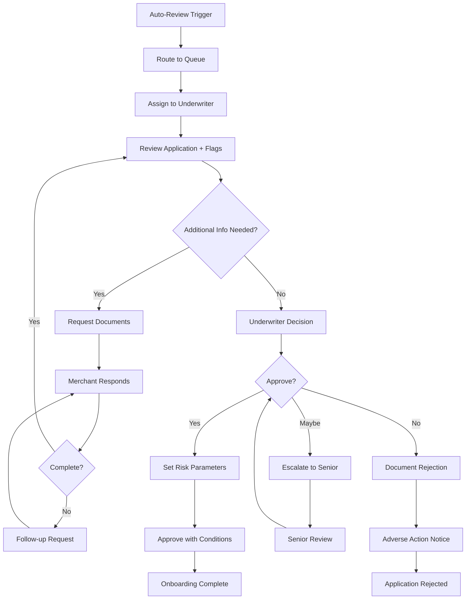

# KYB Implementation Guide

> **Last Updated:** 2025-12-28
> **Status:** Complete

This page covers practical implementation considerations for KYB processes, including sponsor bank requirements, approval timelines, and handling edge cases.

## Sponsor Bank Requirements

Payment Facilitators operate under a **sponsor bank relationship**, which imposes specific KYB and compliance obligations. The sponsor bank is ultimately responsible for PayFac's sub-merchant activity, so banks mandate rigorous due diligence.

### Core KYB Requirements

#### 1. MATCH List Screening

- **MATCH (Member Alert to Control High-risk):** Mastercard database of terminated merchants
- **Purpose:** Prevent merchants terminated for fraud from re-applying
- **Check:** All businesses and principals (UBOs 25%+)
- **Timing:** At onboarding and periodically (quarterly/annually)
- See [Sanctions Screening](../sanctions-screening.md) for details

#### 2. OFAC Screening

- **OFAC (Office of Foreign Assets Control):** U.S. Treasury sanctions list
- **Check:** Business entity name + all UBOs (25%+ owners)
- **Lists:** SDN (Specially Designated Nationals), Sectoral Sanctions, others
- **Frequency:** At onboarding, real-time for high-risk, monthly for all merchants

#### 3. UBO Verification

- **Requirement:** Identify and verify all beneficial owners with 25%+ ownership
- **Process:**
  - Collect UBO names, DOB, addresses, SSN
  - Perform KYC on each UBO (government ID, identity verification)
  - Screen against OFAC, PEP lists, criminal databases
- **Complexity:** Multi-layer entities require drilling through ownership structure
- See [Beneficial Ownership](../beneficial-ownership.md) for complete process

#### 4. Entity Verification

- Articles of Incorporation/Organization
- EIN validation with IRS
- Certificate of Good Standing
- Operating Agreement or Bylaws review

#### 5. PCI DSS Compliance

- **PCI DSS (Payment Card Industry Data Security Standard):** Security requirements for handling card data
- **Merchant Level:** Determined by transaction volume
  - **Level 1:** >6M Visa/Mastercard transactions annually
  - **Level 2:** 1-6M transactions
  - **Level 3:** 20k-1M e-commerce transactions
  - **Level 4:** &lt;20k e-commerce or &lt;1M total
- **PayFac Responsibility:** Ensure sub-merchants comply (typically SAQ A or A-EP for e-commerce)

#### 6. Transaction Monitoring

Sponsor banks require PayFacs to monitor for:
- Unusual transaction patterns
- Velocity increases (sudden volume spikes)
- High refund/chargeback rates
- Cross-border transactions
- Suspicious activity (structuring, money laundering)

#### 7. Periodic Reviews

- **Annual KYB refresh** for all active merchants
- **Enhanced review** for high-volume, high-risk, or flagged merchants
- **Document updates:** Request new good standing certificates, UBO changes

:::danger Sponsor Bank Audits
Sponsor banks conduct annual audits of PayFac compliance programs. Inadequate KYB processes are the #1 audit finding and can result in volume caps, fines, or relationship termination. Maintain documentation for every merchant decision (approval, rejection, manual review).
:::

## Approval Timelines

KYB approval timelines vary based on entity complexity, risk profile, and automation level.

### Automated Onboarding (Low Risk)

| Entity Type | Timeline | Requirements |
|-------------|----------|--------------|
| **Sole Proprietor** | &lt;10 minutes | Clean identity check, no DBA issues, low-risk industry |
| **LLC (simple)** | 10 min - 2 hours | Single-member or clear ownership, good standing verified, automated UBO KYC |
| **Corporation (simple)** | 2-4 hours | Clear shareholder registry, automated UBO KYC, good standing verified |

### Manual Review Required

| Scenario | Timeline | Reason |
|----------|----------|--------|
| **High-Risk Industry** | 1-3 days | Gaming, CBD, adult, crypto, nutraceuticals |
| **Complex Ownership** | 3-5 days | Multi-layer LLCs, offshore entities, holding companies |
| **Sanctions/PEP Hits** | 3-7 days | OFAC or PEP screening requires investigation |
| **New Entity (&lt;6 months)** | 2-5 days | No operating history, enhanced due diligence |
| **High Volume New Merchant** | 5-10 days | Projecting >$250k monthly with no history |
| **Shell Company Indicators** | 1-2 weeks or reject | Virtual office, no website, mismatched data |

### Factors Affecting Timeline

**Faster:**
- Complete documentation provided upfront
- Clean background checks (no OFAC/MATCH hits)
- Established business (3+ years)
- Low-risk industry (retail, professional services)
- Automated verification systems
- Single-member LLC or sole proprietor

**Slower:**
- Missing or incomplete documents
- Complex ownership structure
- OFAC/sanctions screening hits (false positives common)
- High-risk industry requiring specialized underwriting
- Foreign entities or multi-national operations
- Manual review queue backlog

### Optimization Strategies

**For PayFacs:**
1. **Document checklist:** Clear requirements by entity type reduce back-and-forth
2. **Real-time validation:** EIN, address, OFAC checks during application
3. **Risk-based automation:** Auto-approve low-risk, route high-risk to specialists
4. **Prefill data:** Use APIs (Middesk, D&B) to auto-populate business info
5. **Status transparency:** Keep merchants informed of review progress

**For Merchants:**
1. **Prepare documents:** Gather all required docs before starting application
2. **Accurate information:** Ensure consistency across all documents
3. **Clear ownership:** Provide complete UBO information upfront
4. **Responsive:** Reply quickly to requests for additional information

:::tip Automation ROI
PayFacs implementing comprehensive automated KYB (Middesk, Plaid, Alloy, etc.) reduce average onboarding time from 3-5 days to &lt;4 hours for 70-80% of applications, while reducing operational costs by $15-30 per application.
:::

## Manual Review Triggers

Certain KYB scenarios require human review rather than automated approval, balancing risk management with operational efficiency.

### Common Triggers

#### 1. High-Risk Industries

- **Gaming/Gambling:** Online casinos, sports betting, sweepstakes
- **Adult Content:** Adult entertainment, dating services
- **CBD/Cannabis:** Hemp products, CBD e-commerce (state-dependent)
- **Cryptocurrency:** Exchanges, ATMs, wallet services
- **Nutraceuticals:** Supplements, weight loss products
- **Travel:** Airlines, timeshares, travel agencies
- **Telemarketing:** Outbound sales, subscription services
- **Firearms:** Gun sales, ammunition (bank-dependent)

#### 2. Complex Ownership Structures

- **Multi-layer entities:** LLC owned by another LLC, corporate chains
- **Offshore ownership:** Foreign entities in ownership structure
- **Trust/estate ownership:** Beneficial ownership unclear
- **Private equity/VC backing:** Institutional investors with complex structures
- **More than 4 UBOs:** Requires extensive KYC processing

#### 3. Sanctions/Watchlist Screening Hits

- **OFAC match:** Business name or UBO on sanctions list (often false positive)
- **PEP (Politically Exposed Person):** Government officials, family members
- **Adverse media:** Negative news articles, lawsuits, criminal charges
- **MATCH list hit:** Previous payment processing termination
- **Criminal background:** UBO with fraud, money laundering, financial crimes

#### 4. New Business with High Projections

- Entity formed &lt;6 months ago
- Projecting >$100k monthly processing volume
- **Risk:** No operating history to validate projections, potential fraud

#### 5. Shell Company Indicators

- Virtual office or mail drop address
- No website or under-construction website
- No employees listed
- Recently formed with "established since" claims
- PO Box as only address
- Mismatched business names across documents

#### 6. Data Inconsistencies

- Business name doesn't match Articles of Incorporation
- Address differs between documents (application, EIN letter, SOS records)
- UBO information conflicts with corporate documents
- Website content doesn't match stated industry/MCC
- SSN/EIN mismatch with IRS records

#### 7. Financial Anomalies

- Extremely high processing volume for business type
- Business model unclear or suspicious
- Pricing significantly below market rates
- Excessive international transactions

#### 8. Compliance Flags

- Negative credit report (bankruptcies, liens, judgments)
- Outstanding tax issues (IRS liens, unpaid taxes)
- Active lawsuits or legal judgments
- Regulatory actions (FTC, CFPB, state AG)

### Manual Review Process

### Manual Review Best Practices

**For PayFacs:**
1. **Clear escalation paths:** Define what requires senior review
2. **Documented decisions:** Every manual decision logged with rationale
3. **Consistent criteria:** Standardized risk assessment frameworks
4. **Turnaround SLAs:** 24-48 hours for manual review queue
5. **Merchant communication:** Proactive updates on review status
6. **Risk-based conditions:** Approve with rolling reserves, volume caps

**Balancing Act:**
- **Too strict:** High rejection rates, lost legitimate merchants
- **Too lenient:** Fraud losses, chargebacks, sponsor bank issues
- **Goal:** Accept maximum legitimate merchants while managing risk

:::info False Positive Management
OFAC screening generates false positives for common names (e.g., "Ahmed Khan" matches thousands of people). Implement enhanced screening (DOB, address matching) rather than auto-rejecting on name alone. Estimated 95%+ of OFAC hits are false positives requiring investigation.
:::

## Common Rejection Reasons

Understanding why merchants are rejected helps improve application quality and set proper expectations.

### Top Rejection Reasons

#### 1. Incomplete or Missing Documentation (30-40% of rejections)

- Missing Articles of Incorporation/Organization
- No EIN letter or verification
- Missing UBO identification
- Incomplete ownership information
- No operating agreement or bylaws

**Action:** Clear document checklist, real-time validation, allow re-submission

#### 2. Data Entry Errors / Inconsistencies (20-25%)

- Business name doesn't match official records
- Address typos or format issues
- EIN doesn't match IRS records
- SSN/DOB errors for UBOs
- Phone/email not working

**Action:** Auto-format validation, real-time verification, confirm before submitting

#### 3. Shell Company / Lack of Business Presence (15-20%)

- Virtual office or mail drop as only address
- No functional website
- No verifiable business operations
- Entity formed very recently with no history
- No employees or business assets

**Action:** Provide proof of operations (lease, utility bill, customer contracts, tax returns)

#### 4. Hidden or Undisclosed Beneficial Owners (10-15%)

- Operating agreement shows different owners than application
- Complex ownership structure not fully disclosed
- Offshore entities obscuring true ownership
- Trust or nominee arrangements

**Action:** Full transparency on ownership, provide complete corporate structure diagram

#### 5. OFAC / Sanctions Screening Failure (5-10%)

- Business or UBO on OFAC SDN list (true positive)
- Operating in sanctioned country (Iran, North Korea, Syria, etc.)
- Secondary sanctions exposure (Russia-related, certain sectors)

**Action:** If false positive, provide additional identifying info (DOB, passport). If true positive, application rejected permanently.

#### 6. MATCH List Hit (5-10%)

- Business or principal previously terminated for fraud, excessive chargebacks, or violations
- Attempting to re-board under new entity name

**Action:** Disclosure and explanation may allow approval with conditions (rolling reserve, volume caps). Intentional concealment leads to permanent rejection.

#### 7. Suspended or Dissolved Entity Status (5-10%)

- Secretary of State records show inactive, suspended, or dissolved status
- Failed to file annual reports or pay fees
- Administratively dissolved by state

**Action:** Reinstate entity with state, obtain new Good Standing certificate, re-apply

#### 8. High-Risk Industry Without Proper Compliance (5-8%)

- CBD/cannabis without state licenses
- Gaming without regulatory approval
- Adult content without age verification
- Firearms without FFL (Federal Firearms License)

**Action:** Provide required licenses, implement compliance controls, seek specialized high-risk processor

#### 9. Adverse Credit or Financial History (3-5%)

- Recent bankruptcy (within 5-7 years)
- Active tax liens or judgments
- Negative business credit report
- Pattern of business failures

**Action:** Provide explanation, demonstrate current financial stability, consider secured processing (cash reserve)

#### 10. Fraudulent Application / Misrepresentation (2-5%)

- False information provided
- Fake or altered documents
- Identity theft (stolen EIN, SSN)
- Knowingly concealing adverse history

**Action:** Permanent rejection, potential reporting to law enforcement

### Rejection Communication

**Adverse Action Notice Requirements (FCRA - Fair Credit Reporting Act):**
- If rejection based on credit report, must provide specific reasons
- Merchant has right to dispute and request free copy of report
- Must provide contact info for credit bureau used

**Best Practices:**
- **Specific reasons:** Don't just say "insufficient documentation" - list exactly what's missing
- **Actionable feedback:** "Please provide your LLC Operating Agreement showing ownership percentages"
- **Appeal process:** Allow merchants to provide additional information or corrections
- **Reapplication guidelines:** When can they reapply? What needs to change?

### Sample Rejection Scenarios

| Scenario | Reason | Solution | Can Reapply? |
|----------|--------|----------|--------------|
| Missing EIN letter | Incomplete docs | Upload IRS CP 575 or Form 147C | Yes, immediately |
| Business name typo | Data entry error | Correct spelling, resubmit | Yes, immediately |
| Dissolved LLC | Suspended entity | Reinstate with state, get Good Standing | Yes, after reinstatement |
| Virtual office only | Shell company concern | Provide lease/utility bill for actual location | Yes, with proof |
| OFAC false positive | Name match | Provide DOB, passport, additional ID | Yes, after investigation |
| MATCH list fraud termination | Prior termination | Explain circumstances, accept conditions | Maybe, case-by-case |
| True OFAC SDN hit | Sanctions violation | N/A | No, permanent rejection |
| Fraudulent documents | Misrepresentation | N/A | No, permanent ban |

:::tip Improving Approval Rates
PayFacs can improve approval rates by 20-30% with:
1. Clear document requirements by entity type
2. Real-time validation (EIN, address, phone) during application
3. Allow save-and-resume (merchants can gather docs over time)
4. Proactive communication when docs are missing
5. Appeal/resubmission process for correctable issues
:::

## Related Topics

- [KYB Requirements Overview](../kyb-requirements.md) - Core KYB concepts and verification flow
- [Entity Types](./entity-types.md) - Documentation by business type
- [Verification Methods](./verification-methods.md) - EIN, SOS, and verification processes
- [2025 Regulatory Updates](./regulatory-updates.md) - Latest compliance changes
