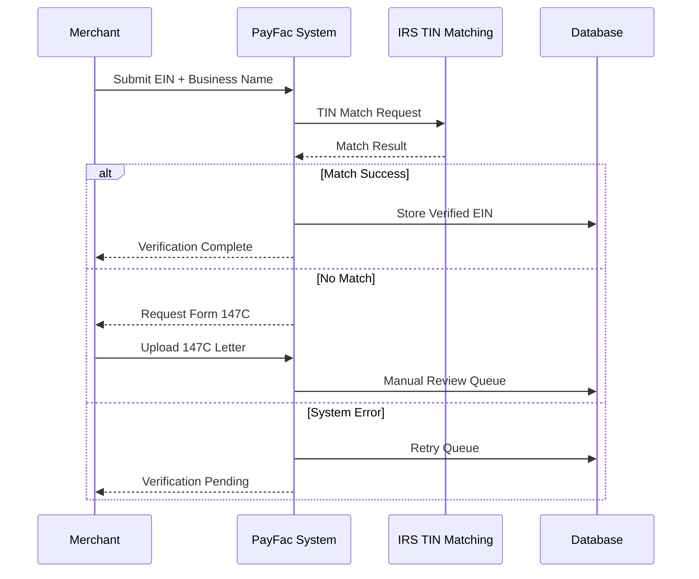

# KYB Verification Methods

> **Last Updated:** 2025-12-28
> **Status:** Complete

This page covers the various methods and data sources used to verify business entity information during the KYB process.

## EIN/Tax ID Verification

The **Employer Identification Number (EIN)** is the primary federal tax identifier for businesses. Validating the EIN confirms the business is registered with the IRS and authorized to operate.

### Verification Options

#### 1. IRS TIN Matching Program

- **Free service** via IRS e-Services
- **Limits:** 25 interactive matches or 100,000 bulk matches
- **Process:**
  - Create IRS e-Services account
  - Submit TIN, name, and name type (business or individual)
  - Receive match/no-match response
- **Use case:** Real-time validation during onboarding

#### 2. IRS Form 147C Letter

- **Official verification** of existing EIN
- **How to request:**
  - **Phone:** 1-800-829-4933 (immediate verbal confirmation for authorized parties)
  - **Fax:** Same-day confirmation
  - **Mail:** 4-6 weeks processing time
- **Use case:** Merchant cannot locate original CP 575 letter

#### 3. Third-Party Services

- **Middesk:** Integrates with IRS systems, real-time EIN validation
- **D&B:** Cross-references EIN with business credit file
- **Tax1099:** Specialized TIN verification for Form 1099 reporting

### Backup Withholding

- If EIN is invalid or does not match business name, payer must withhold **24%** of payments for IRS backup withholding
- PayFacs cannot process for merchants with invalid EINs

### Verification Process Flow

:::tip IRS TIN Matching Best Practice
Implement real-time TIN matching during application submission. Immediate validation prevents downstream issues and reduces manual review volume by 40-60%.
:::

## Secretary of State Verification

Every business entity (except sole proprietorships using personal names) must register with the state where incorporated or formed.

### What to Verify

1. **Entity Existence**
   - Business is registered and legally formed
   - Entity ID/file number matches application

2. **Current Status**
   - **Active/Good Standing:** Authorized to operate
   - **Inactive:** Voluntarily dissolved
   - **Suspended/Revoked:** Failed to file reports or pay fees (high risk)
   - **Administratively Dissolved:** State action due to non-compliance (reject)

3. **Registration Details**
   - Legal business name matches application
   - Formation date (flag entities &lt;6 months old)
   - Registered agent name and address
   - Principal office address

4. **Annual Report Compliance**
   - Recent filings are current
   - No outstanding fees or penalties

### Verification Methods

#### 1. Manual State Database Search

- Each state maintains Secretary of State business database
- Free public access (most states)
- Search by business name or entity ID

#### 2. API Integration

- **Middesk:** Aggregates all 50 state SOS offices, real-time lookups
- **Corpnet:** Multi-state business search and monitoring
- **State-specific APIs:** Some states offer official APIs (Delaware, Wyoming)

#### 3. Certificate of Good Standing

- Official state document confirming current status
- **Cost:** $10-$50 (FREE in Wyoming, Colorado)
- **Validity:** Most PayFacs require &lt;90 days old
- Merchant obtains from state and uploads

### Red Flags

- Suspended or dissolved status
- Mismatched business name
- Very recent formation with high volume projections
- Frequent state changes (jurisdiction shopping)
- Missing or invalid registered agent

### Multi-State Considerations

- Business may be registered in one state (incorporation state) but operate nationally
- Verify registration in state of incorporation AND states where doing business
- Foreign qualification required for out-of-state operations in many states

:::warning Virtual Office Addresses
Starting Q1 2025, Middesk flags virtual mailbox services (Regus, WeWork Mail, UPS Store) as potential shell company indicators. Cross-reference registered agent address with physical business location.
:::

## Business Credit Verification

Business credit reports provide financial history, trade references, and risk indicators beyond basic entity verification.

### Primary Services

#### 1. Dun & Bradstreet (D&B)

- **Coverage:** 600M+ global business entities
- **DUNS Number:** Unique 9-digit business identifier
- **Reports Include:**
  - Payment history (trade references)
  - Credit score (Paydex: 1-100, higher is better)
  - Financial statements (if available)
  - Corporate family tree (parent/subsidiary relationships)
  - Judgments, liens, bankruptcies
- **Cost:** $50-$200 per report

#### 2. Experian Business

- Business credit scores (Intelliscore Plus: 1-100)
- Payment trends and trade lines
- Public records (judgments, liens, UCCs)
- Industry risk analysis

#### 3. Equifax Business

- Business credit report
- Commercial credit score
- Failure risk score

### What PayFacs Look For

| Indicator | Green Flag | Yellow Flag | Red Flag |
|-----------|------------|-------------|----------|
| **Credit Score** | 80-100 (D&B Paydex) | 50-79 | &lt;50 |
| **Trade Lines** | 10+ positive references | 3-9 references | &lt;3 or negative |
| **Payment History** | Pays on time (DBT 0-30) | Occasional late (DBT 30-60) | Frequent late (DBT 60+) |
| **Public Records** | None | Satisfied liens/judgments | Active liens, bankruptcy |
| **Business Age** | 3+ years | 1-3 years | &lt;1 year |

### When Credit Checks Are Used

- **High-volume merchants:** >$100k monthly processing
- **High-risk industries:** Extended credit terms common
- **Commercial/B2B:** Longer payment cycles
- **Sub-merchant platforms:** Evaluating platform viability

### Limitations

- New businesses have no credit history (thin file)
- Small businesses may not have trade references
- Credit score is backward-looking (doesn't predict future)

:::info DUNS Number Requirement
Some sponsor banks require a DUNS number for all corporate merchants processing >$50k monthly. Obtaining a DUNS number is free via D&B website but can take 30 days for first-time businesses.
:::

## Business Address Verification

Confirming a legitimate physical business presence helps identify shell companies and mail drops.

### Verification Methods

#### 1. USPS Address Validation

- Confirms address exists and is deliverable
- Standardizes address format
- **API:** USPS Web Tools API (free for low volume)

#### 2. Physical Presence Confirmation

- **Google Street View:** Visual verification of business location
- **Google Business Profile:** Verified business listing with reviews
- **Yelp/Business Directories:** Cross-reference listings

#### 3. Utility Bill or Lease Agreement

- Request proof of business address
- Utility bill (electric, water, internet) in business name
- Commercial lease agreement
- Property deed (if owned)

#### 4. Third-Party Services

- **Middesk:** Virtual mailbox detection (Q1 2025 update)
- **Melissa Data:** Address verification and geocoding
- **Loqate:** International address validation

### Red Flags

**Virtual Office / Mail Drop:**
- UPS Store, Regus, WeWork Mail, virtual office providers
- No physical business operations at address
- Shared suite numbers with many businesses
- **Risk:** Shell company indicator, no physical operations

**Residential Address:**
- Home-based business (acceptable for many low-risk industries)
- High-volume processing from residence (unusual, review carefully)

**PO Box Only:**
- Cannot serve as registered agent or principal office in most states
- Acceptable for mailing address but requires physical address too

**Frequent Address Changes:**
- Multiple address changes in short period
- Different address on each document
- **Risk:** Unstable business, potential fraud

**Foreign Address (Non-US):**
- Offshore entities with no U.S. presence
- Requires enhanced due diligence
- May trigger sponsor bank restrictions

### Verification Best Practices

1. Cross-reference address across all documents (Articles, EIN letter, bank account)
2. Validate address matches business type (e.g., restaurant at commercial address)
3. Check Google Business Profile for consistency
4. Flag virtual offices for manual review
5. For high-risk or high-volume, request utility bill or lease

:::warning Virtual Office Detection
As of Q1 2025, Middesk's updated service flags known virtual mailbox providers. PayFacs should implement secondary verification (lease, utility bill) when virtual office is detected, especially for high-volume merchants.
:::

## Website Verification

Website review provides operational validation and helps assess business legitimacy and risk profile.

### What to Verify

#### 1. Domain Ownership

- **WHOIS Lookup:** Verify domain registration matches business entity
- **Domain Age:** New domains (&lt;6 months) with mature businesses are suspicious
- **Registrar:** Legitimate registrars (GoDaddy, Namecheap) vs. anonymizing services

#### 2. Website Content

- **Product/Service Clarity:** Clear description of what business sells
- **Contact Information:** Phone, email, physical address match application
- **About Us / Company Info:** Validates business story and timeline
- **Terms of Service:** Professional, legally compliant terms
- **Privacy Policy:** Especially critical for businesses handling customer data

#### 3. SSL Certificate

- **HTTPS:** Secure connection required for e-commerce
- **Certificate Validity:** Not expired, matches domain
- **Issuer:** Trusted CA (Let's Encrypt, DigiCert, etc.)

#### 4. Trust Signals

- Customer reviews (Google, Trustpilot, BBB)
- Social media presence (Facebook, Instagram, LinkedIn)
- Professional design and functionality
- Contact forms work, email addresses are active

#### 5. Risk Indicators

- **Industry Type:** Match with stated MCC code
- **Prohibited Products:** Tobacco, adult content, gambling (restricted)
- **Compliance:** Age verification for restricted products
- **Shipping/Delivery:** International shipping increases risk
- **Pricing:** Compare to market rates (too-good-to-be-true pricing)

### Website Red Flags

| Issue | Risk Level | Action |
|-------|------------|--------|
| No website or under construction | High | Reject or require explanation |
| Website content doesn't match MCC | High | Manual review, possible MCC change |
| Anonymized WHOIS | Medium | Request business verification |
| Broken links, poor quality | Medium | Assess overall legitimacy |
| Customer complaints (BBB, reviews) | Medium-High | Review complaint nature |
| Recently created domain with "established" business | High | Request incorporation docs, tax returns |
| Offshore hosting with U.S. business | Medium | Enhanced due diligence |

### Automated Tools

- **URLscan.io:** Website screenshot and analysis
- **BuiltWith:** Technology stack detection
- **Wayback Machine:** Historical website versions
- **Google Safe Browsing:** Malware/phishing detection

:::tip Website Review Automation
Implement automated website checks during onboarding: SSL validation, domain age, content scraping for MCC matching. Flag high-risk indicators for manual review rather than auto-rejecting, as many legitimate small businesses have basic websites.
:::

## Certificate of Good Standing

A **Certificate of Good Standing** (also called Certificate of Existence or Certificate of Status) is an official state document confirming a business entity is properly registered, current on all filings and fees, and authorized to conduct business.

### Purpose

- Proves business is in compliance with state requirements
- Required by banks, lenders, and payment processors
- Necessary for foreign qualification (registering in other states)
- Validates entity hasn't been dissolved or suspended

### Information Included

- Legal business name
- Entity type (LLC, Corporation, etc.)
- Formation/incorporation date
- Current status (Active, Good Standing)
- State of formation
- Entity ID/file number
- Issue date (certificate date)

### How to Obtain

- Request from Secretary of State office (online, mail, or in-person)
- **Cost:** $10-$50 in most states (FREE in Wyoming, Colorado)
- **Processing:** Immediate online to 5-10 business days by mail
- **Validity:** No expiration, but most PayFacs require &lt;90 days old

### State Requirements for Good Standing

To maintain good standing, businesses must:
1. **File Annual Reports:** Submit yearly information updates (most states)
2. **Pay Annual Fees/Taxes:** Franchise tax, renewal fees
3. **Maintain Registered Agent:** Active agent with physical address in state
4. **Stay Current on Other Filings:** Amendment reports, ownership changes

### When Required

| Scenario | Requirement |
|----------|-------------|
| **PayFac Onboarding** | Recommended for LLC/Corp, especially high-volume |
| **Bank Account Opening** | Often required by commercial banks |
| **Sponsor Bank Due Diligence** | Required for merchants processing >$100k monthly |
| **Foreign Qualification** | Required to register in additional states |
| **Business Loans** | Typically required by lenders |
| **Annual Review** | Some PayFacs require annual re-verification |

### PayFac Best Practices

- **Require for all LLCs and Corporations** processing >$50k monthly
- **Accept certificates &lt;90 days old** to ensure current status
- **Automate expiration tracking** to request updated certificates annually
- **Verify certificate authenticity** via state SOS website or API
- **Flag suspended/dissolved status** for immediate account review

### Common Issues

**Suspended Status:**
- Caused by: Missed annual report, unpaid fees, no registered agent
- **Action:** Business must file missing reports and pay fees to reinstate
- **Timeline:** 2-4 weeks for reinstatement in most states

**Dissolved Status:**
- **Voluntary:** Business filed dissolution papers
- **Administrative:** State dissolved due to non-compliance
- **Action:** Cannot process payments for dissolved entities (terminate account)

**Foreign State Confusion:**
- Certificate must be from state of incorporation/formation
- Business operating in multiple states needs good standing only from home state (unless foreign qualified)

:::warning Certificate Age Requirement
Best practice is to require certificates &lt;90 days old. Older certificates may not reflect current status if business recently fell out of compliance. For high-risk or high-volume merchants, some PayFacs require &lt;30 days old.
:::

## Related Topics

- [KYB Requirements Overview](../kyb-requirements.md) - Core KYB concepts and verification flow
- [Entity Types](./entity-types.md) - Documentation by business type
- [Implementation Guide](./implementation.md) - Approval timelines and manual review triggers
