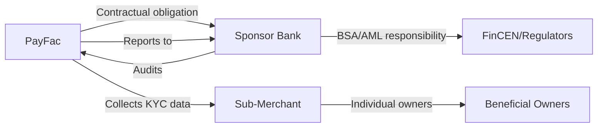
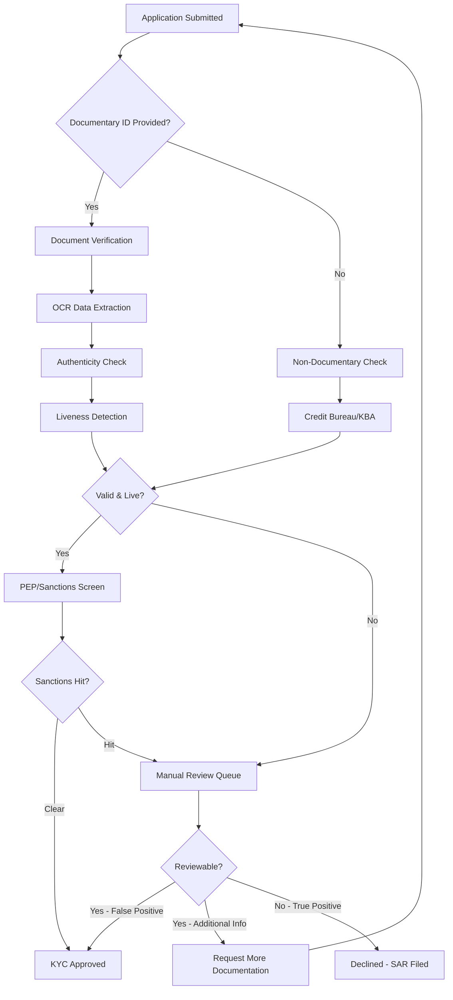
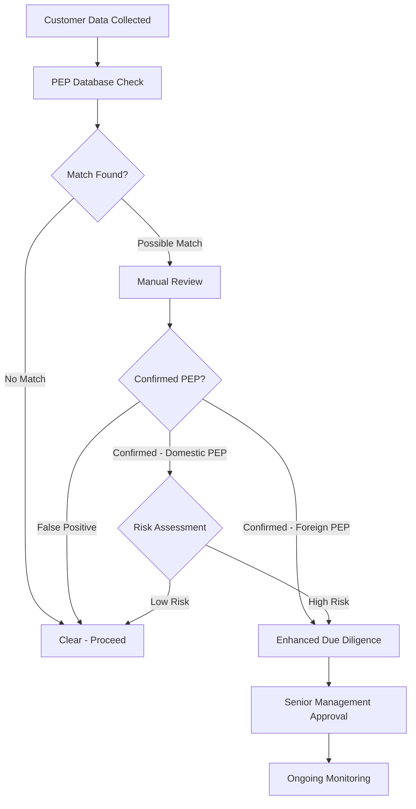
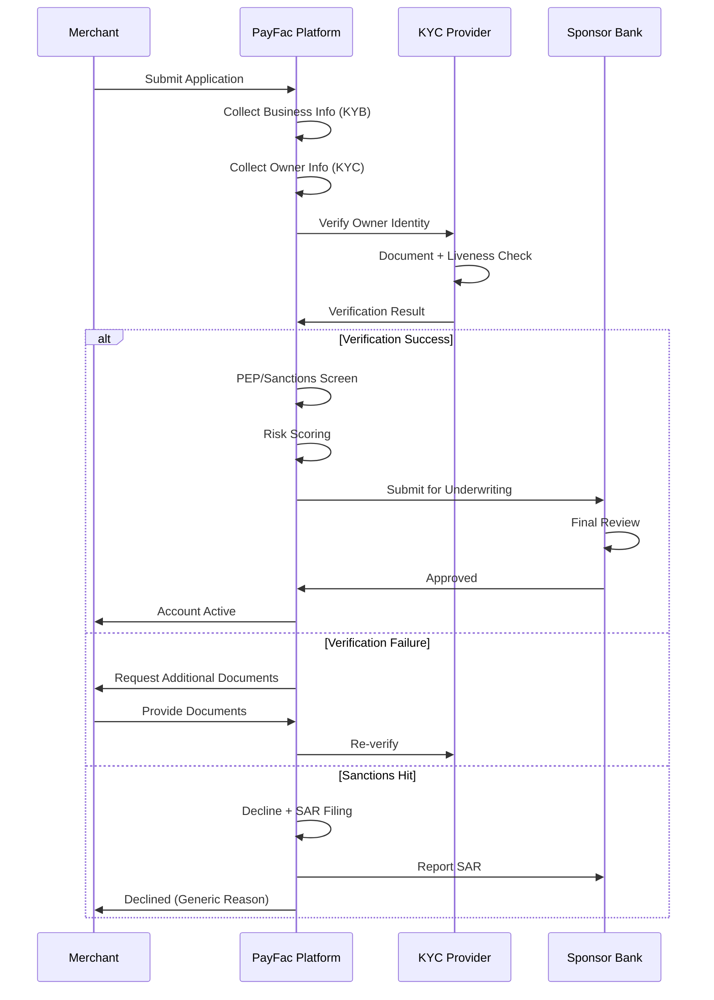

# KYC Requirements

> **Last Updated:** 2025-12-25
> **Status:** Complete

## Quick Reference

**Legal Requirement:** FinCEN Customer Identification Program (CIP) mandate (31 CFR 1020.220)

**Regulatory Authority:** Financial Crimes Enforcement Network (FinCEN) / U.S. Treasury

**Key Timeline:** FinCEN requires verification within "reasonable period" after account opening (regulation does not specify exact days). **PayFac Best Practice:** Sponsor banks typically require verification **BEFORE** enabling payment processing (pre-funding).

**Non-Compliance Penalties:**

- Civil penalties up to $5,000/day per violation
- OFAC violations: Up to $1,435,263 per violation (2025)
- Criminal penalties for willful violations

**PayFac Context:** While PayFacs may be exempt from direct BSA obligations as MSBs (payment processor exemption), they have **contractual KYC obligations** from sponsor banks. The sponsor bank remains ultimately responsible for sub-merchant compliance.

## Overview

Know Your Customer (KYC) is the regulatory process of verifying the identity of individuals before establishing a business relationship. For Payment Facilitators, KYC applies to the individual owners, principals, and beneficial owners behind merchant businesses.

### Why KYC Exists

KYC requirements stem from the **Bank Secrecy Act (BSA)** and **USA PATRIOT Act**, designed to:

- Prevent money laundering and terrorist financing
- Combat fraud and identity theft
- Enable law enforcement to trace illicit funds
- Protect the financial system's integrity

### KYC vs. KYB Distinction

| Aspect | KYC (Know Your Customer) | KYB (Know Your Business) |
|--------|--------------------------|--------------------------|
| **Subject** | Individuals | Business entities |
| **Data Points** | Name, DOB, SSN, address | Legal name, EIN, formation docs |
| **Verification** | Government ID, credit bureau | Articles of incorporation, business license |
| **Objective** | Confirm individual identity | Confirm business legitimacy |
| **Use Case** | Sole proprietors, beneficial owners | LLCs, corporations, partnerships |

:::info Key Definitions

**KYC (Know Your Customer):** Process of verifying the identity of an individual customer

**CIP (Customer Identification Program):** Specific procedures required by FinCEN to verify customer identities (31 CFR 1020.220)

**CDD (Customer Due Diligence):** Broader ongoing monitoring of customer activity and risk assessment

**EDD (Enhanced Due Diligence):** Heightened scrutiny for high-risk customers (e.g., foreign PEPs, high-volume merchants)

**Identity Verification:** Confirming someone is who they claim to be (documentary/non-documentary methods)

**Identity Authentication:** Confirming the person presenting credentials is the actual individual (liveness detection, biometrics)

:::

### PayFac KYC Responsibility



**Key Points:**

- PayFac performs KYC collection and initial verification
- Sponsor bank retains ultimate regulatory responsibility
- PayFac must maintain records for sponsor bank audits
- Failure = sponsor bank can terminate PayFac relationship

## Required Data Elements

Under FinCEN CIP Rule (31 CFR 1020.220), the following data points are **mandatory**:

| Data Element | U.S. Individuals | Non-U.S. Individuals | Source | Verification Method | Notes |
|--------------|------------------|----------------------|--------|---------------------|-------|
| **Name** | ✓ Required | ✓ Required | Government ID | Documentary | Full legal name as on ID |
| **Date of Birth** | ✓ Required | ✓ Required | Government ID | Documentary | MM/DD/YYYY format |
| **Address** | ✓ Required | ✓ Required | Utility bill, bank statement | Documentary or database | Must be street address (not P.O. Box for primary) |
| **Identification Number** | SSN or ITIN | Passport or Alien ID | SSA, IRS, passport | Documentary or database | TIN required for tax reporting (1099-K) |

:::warning TIN Collection Update (June 2025)

As of June 2025, banks may now use **third-party sources** for TIN verification instead of requiring direct customer submission. This enables:

- Faster onboarding (no waiting for customer to provide SSN)
- Reduced friction (one less field to collect)
- Improved accuracy (direct database verification)

Many KYC providers now include TIN verification via Social Security Administration (SSA) eCBSV (Electronic Consent Based Social Security Number Verification).

:::

### Additional Data Points (Best Practice)

While not mandated by FinCEN CIP, the following are commonly collected:

- **Middle name/initial:** Reduces false positives in sanctions screening
- **Phone number:** Contact verification, fraud prevention
- **Email address:** Communication, account recovery
- **Citizenship/nationality:** Determines tax obligations (FATCA, etc.)
- **Occupation/industry:** Risk scoring, KYC refresh frequency
- **Source of funds:** High-risk industries (crypto, gambling, adult)

## Verification Methods

### Documentary Verification

Verifying identity using **government-issued documents**.

**Acceptable Documents (Individuals):**

- Unexpired driver's license (state or foreign)
- Passport (U.S. or foreign)
- State-issued ID card
- Military ID
- Tribal ID

**Requirements:**

- Must be current (not expired)
- Must contain photograph
- Must contain name, DOB, and address (or separate proof of address)
- Must be issued by a government authority

**Verification Process:**

1. Collect document image (front/back for driver's license)
2. Extract data via OCR (Optical Character Recognition)
3. Verify authenticity (microprinting, holograms, fonts, security features)
4. Match extracted data to customer-provided data
5. Perform liveness detection (confirm person is present, not using photo of ID)

### Non-Documentary Verification

Verifying identity using **independent sources** when documents are unavailable or require additional confirmation.

**Acceptable Methods:**

| Method | Description | Cost | Accuracy | Use Case |
|--------|-------------|------|----------|----------|
| **Contact Customer Directly** | Call provided phone, send mail to address | Low | Medium | Low-risk verification |
| **Credit Bureau Database** | Check Experian, Equifax, TransUnion records | $0.10-$1.00 | High | U.S. residents with credit history |
| **Public Database** | DMV records, voter registration, property records | $0.50-$2.00 | Medium-High | U.S. residents |
| **Knowledge-Based Authentication (KBA)** | Quiz on personal history (past addresses, loans) | $1.00-$3.00 | High | Thin-file or additional verification |
| **References** | Contact from other financial institutions | Low | Medium | Existing banking relationship |

**Knowledge-Based Authentication (KBA) Example:**

```
Question 1: Which of the following streets have you lived on?
A) 123 Oak Street
B) 456 Maple Avenue
C) 789 Pine Road
D) None of the above

Question 2: What was the monthly payment on your auto loan in 2020?
A) $250-$350
B) $350-$450
C) $450-$550
D) I did not have an auto loan
```

**KBA Limitations:**

- Requires credit history (excludes "thin-file" individuals)
- Data breach risk (stolen personal info can pass KBA)
- Privacy concerns (perceived as invasive)

### Biometric Verification

Modern KYC increasingly uses **biometric authentication** to combat deepfakes and synthetic identities.

**Liveness Detection Standards:**

| Standard | Level | Description | Use Case |
|----------|-------|-------------|----------|
| **ISO/IEC 30107-3 PAD Level 1** | Basic | Detects printed photos, masks, replays | Standard onboarding |
| **ISO/IEC 30107-3 PAD Level 2** | Advanced | Detects deepfakes, injection attacks | High-risk merchants |
| **CEN/TS 18099** | EU Standard | Injection attack detection (server-side deepfakes) | EU operations |

**Liveness Detection Techniques:**

- **Passive liveness:** AI analyzes single photo for micro-textures, reflections, depth
- **Active liveness:** User performs action (blink, turn head, smile)
- **Challenge-response:** Random sequence of actions (harder to pre-record)

:::danger Deepfake Threat (2025)

**Deepfake fraud has grown 2,000%+ in recent years:**

- 1 in 15 identity fraud attempts involves deepfakes
- Deepfake toolkits available for under $20
- Advanced AI can generate realistic video in real-time

**Mitigation:**

- Require ISO/IEC 30107-3 PAD Level 2 compliance from verification providers
- Use multiple factors (document + biometric + database)
- Monitor for suspicious patterns (multiple applications from same device)

:::

## Verification Flow



**Typical Processing Times:**

- **Automated approval:** &lt;60 seconds (95%+ with AI-powered verification)
- **Manual review:** 1-3 business days (5-20% of applications)
- **Additional documentation:** 3-7 business days

**Industry Benchmarks:**

- **Auto-approval rate:** 95%+ (modern AI systems)
- **False positive rate:** 30% of legitimate applications wrongly flagged (older systems)
- **Customer abandonment:** 68% abandon process if takes &gt;10 minutes
- **Lost clients:** 70% of financial institutions lost clients due to slow onboarding

## Verification Provider Landscape (2025)

| Provider | Strengths | Pricing Model | Key Features | Global Coverage |
|----------|-----------|---------------|--------------|-----------------|
| **Jumio** | High accuracy AI/ML | $55,850/year median (enterprise) | 95%+ auto-approval, deepfake detection | 200+ countries |
| **Onfido** | EU leader, compliance | Volume-based tiers | GDPR compliance, ISO 30107-3 Level 2 | Global, strong EU |
| **Persona** | Customizable workflows | API usage-based | 150+ registry connections, orchestration | 200+ countries |
| **Alloy** | Orchestration platform | $62,012/year median | 160+ data providers, single API | U.S. focus |
| **Socure** | Premium accuracy | $10k/year mid-market | SSA-approved eCBSV, graph analytics | U.S. focus |
| **Sumsub** | Reusable KYC | $299/month + $1.85/verification | Multi-jurisdiction, ongoing monitoring | 220+ countries |
| **FACEKI** | Budget option | $0.95/verification | Basic document + liveness | 150+ countries |
| **Didit Core** | Free tier | Free base + $0.15/add-on | Open-source integration | Limited coverage |

**Per-Verification Cost Breakdown:**

- **ID Document Verification:** $0.10 - $1.50
- **Liveness + Facial Match:** $0.20 - $1.00
- **Credit Bureau Check:** $0.10 - $1.00
- **KBA (Knowledge-Based Authentication):** $1.00 - $3.00
- **Full KYC Suite:** $1.85 - $5.00

**Selection Criteria:**

- **Volume:** High-volume PayFacs negotiate volume discounts
- **Geography:** Match provider coverage to merchant base
- **Risk profile:** High-risk industries need advanced deepfake detection
- **Integration:** API quality, documentation, webhooks
- **Compliance:** PCI DSS if storing card data, SOC 2, ISO 27001

:::tip Provider Selection for PayFacs

**Startup PayFac (&lt;1,000 merchants/year):**

- Consider: FACEKI, Didit Core, Persona (pay-as-you-go)
- Budget: $2-5 per merchant

**Growth PayFac (1,000-10,000 merchants/year):**

- Consider: Sumsub, Onfido, Alloy
- Budget: $30k-100k/year

**Enterprise PayFac (&gt;10,000 merchants/year):**

- Consider: Jumio, Socure, Onfido
- Budget: $100k-500k/year
- Negotiate custom pricing

:::

## PEP Screening

### What is a PEP?

**Politically Exposed Person (PEP):** Individual who holds or has held a prominent public position, or their immediate family members/close associates.

**Examples:**

- Heads of state, government ministers
- Senior politicians, judges, military officers
- State-owned enterprise executives
- Central bank officials
- Ambassadors, consuls
- **Family members:** Spouses, children, parents
- **Close associates:** Business partners, advisors

### PEP Screening Requirements

:::warning PEP Screening is NOT Mandatory Under BSA/AML

Unlike sanctions screening (OFAC), **PEP screening is voluntary and risk-based** under U.S. regulations.

**FinCEN/Regulators Guidance:**

- Due diligence must be "commensurate with risk"
- No blanket requirement to screen all customers for PEP status
- **Focus on Foreign PEPs** (higher corruption risk)
- Domestic PEPs optional but best practice

**Distinction:**

- **PEP (general):** Broader term, risk-based screening
- **Senior Foreign Political Figure (SFPF):** Specific EDD requirements under 31 CFR 1010.620

:::

### When to Screen for PEPs

**Risk-Based Triggers:**

- High transaction volumes (&gt;$100k/month)
- International transactions (cross-border payments)
- High-risk industries (money services, jewelry, art)
- Unusual activity patterns (large cash deposits)
- Geographic risk (countries with high corruption indices)

**Screening Frequency:**

- **Onboarding:** Initial screen
- **Ongoing:** Annual refresh for high-risk merchants
- **Event-driven:** When suspicious activity detected

### PEP Screening Process



**Enhanced Due Diligence for Foreign PEPs:**

- Source of wealth documentation
- Purpose of business relationship
- Expected transaction patterns
- Senior management approval (documented)
- Ongoing monitoring (quarterly or more frequent)

### False Positive Handling

**Common False Positives:**

- Common names (e.g., "John Smith" matches thousands)
- Partial name matches (e.g., "Robert Johnson" vs "Bob Johnston")
- Family name matches without relationship
- Historical PEPs (no longer in office, low risk)

**Resolution Process:**

1. Review match details (name, DOB, nationality, position)
2. Request additional information if unclear
3. Document decision (cleared or confirmed PEP)
4. Retain documentation for audit (5 years)

## Adverse Media Screening

**Adverse Media:** Negative news coverage indicating potential financial crime risk (fraud, corruption, money laundering, terrorism).

**Why It Matters:**

- Identifies reputational risk before onboarding
- Detects fraud not yet reflected in sanctions lists
- Required for EDD (Enhanced Due Diligence)

**Industry Spending:** $274.1 billion annually on financial crime compliance (includes adverse media screening)

**Challenges:**

- **High false positive rates:** Common names trigger irrelevant news
- **Language barriers:** Foreign-language news sources
- **Context understanding:** Distinguishing victim vs. perpetrator
- **Operational burden:** Manual review of flagged articles

**AI Solutions (2025):**

- Natural language processing (NLP) to understand context
- Entity resolution (disambiguate individuals)
- Sentiment analysis (positive vs. negative coverage)
- Automated risk scoring

**Providers:**

- Moody's Analytics (advanced NLP)
- Siron®One (AI-powered false positive reduction)
- World-Check (Refinitiv/LSEG)
- Dow Jones Risk & Compliance

## PayFac Implementation Considerations

### Where KYC Fits in Onboarding Flow



**Integration Patterns:**

**Synchronous (Real-time):**

```typescript
// NestJS example: Synchronous KYC verification
import { Injectable } from '@nestjs/common';
import { JumioClient } from 'jumio-sdk';

@Injectable()
export class KycService {
  constructor(private jumioClient: JumioClient) {}

  async verifyIndividual(data: IndividualKycDto): Promise<KycResult> {
    // Submit verification request
    const verificationId = await this.jumioClient.createVerification({
      firstName: data.firstName,
      lastName: data.lastName,
      dob: data.dateOfBirth,
      country: data.country,
      callbackUrl: `${process.env.BASE_URL}/webhooks/kyc`,
    });

    // Wait for result (use webhooks in production for better UX)
    const result = await this.jumioClient.getVerificationResult(verificationId);

    return {
      verified: result.decision === 'APPROVED',
      verificationId,
      confidence: result.confidence,
      rejectionReasons: result.rejectionReasons,
    };
  }
}
```

**Asynchronous (Webhook-based):**

```typescript
// NestJS example: Webhook handler for KYC results
import { Controller, Post, Body, Headers } from '@nestjs/common';

@Controller('webhooks')
export class WebhookController {
  constructor(private onboardingService: OnboardingService) {}

  @Post('kyc')
  async handleKycWebhook(
    @Body() payload: JumioWebhookPayload,
    @Headers('x-jumio-signature') signature: string,
  ): Promise<void> {
    // Verify webhook signature
    if (!this.verifySignature(payload, signature)) {
      throw new UnauthorizedException('Invalid signature');
    }

    // Process result
    if (payload.decision === 'APPROVED') {
      await this.onboardingService.approveKyc(payload.merchantId);
    } else {
      await this.onboardingService.rejectKyc(
        payload.merchantId,
        payload.rejectionReasons,
      );
    }
  }

  private verifySignature(payload: any, signature: string): boolean {
    // Implement HMAC verification
    // ...
  }
}
```

### Data Retention Requirements

**FinCEN CIP Rule:** Retain records for **5 years** after account closure.

**What to Retain:**

- Copy of identification documents (encrypted)
- Verification results and methods used
- Date of verification
- PEP/sanctions screening results
- Any additional due diligence documentation
- Declination rationale (if rejected)

**Storage Best Practices:**

- Encrypt at rest (AES-256)
- Encrypt in transit (TLS 1.2+)
- Access controls (role-based, audit logging)
- Backup and disaster recovery
- Geographic compliance (GDPR, data residency)

### Declining Merchants: Documentation

When declining a merchant due to KYC failure:

**Document:**

1. **Reason for declination** (specific: failed liveness, sanctions hit, false ID)
2. **Date of decision**
3. **Reviewer name** (if manual review)
4. **Supporting evidence** (verification report, screening results)

**SAR Filing Triggers:**

- Sanctions list match (OFAC, UN, EU)
- Suspected fraud or identity theft
- Unusual transaction patterns during onboarding
- Known or suspected terrorist financing

**SAR Timeline:**

- **File within 30 days** of detecting suspicious activity
- **Do NOT notify the customer** (illegal to "tip off")
- Provide generic declination reason: "Unable to verify identity" or "Does not meet underwriting criteria"

:::danger Never Tip Off a SAR Subject

**18 U.S.C. § 1956(c)(1):** It is a federal crime to notify someone that a SAR has been filed about them.

**Acceptable Declination Reasons:**

- "We are unable to verify your identity at this time."
- "Your application does not meet our underwriting criteria."
- "We cannot onboard your business based on our risk assessment."

**NEVER say:**

- "You are on a sanctions list."
- "We filed a Suspicious Activity Report."
- "Your activity appears fraudulent."

:::

### Sponsor Bank Reporting

PayFacs must provide sponsor banks with:

**Quarterly:**

- KYC verification pass/fail rates
- High-risk merchant approvals (with EDD documentation)
- PEP-identified merchants and monitoring results

**Annually:**

- Independent audit of KYC/AML program
- Policy and procedure updates
- Staff training records

**Ad-hoc:**

- SAR filings (copy to sponsor bank compliance)
- Sanctions screening hits (immediate notification)
- Material policy changes

## Common Mistakes and How to Avoid Them

| Mistake | Impact | How to Avoid |
|---------|--------|--------------|
| **Accepting expired IDs** | Regulatory violation, fraud risk | Automate expiration date checks in verification flow |
| **Not performing liveness detection** | Deepfake fraud, synthetic identities | Require ISO 30107-3 PAD Level 1+ from provider |
| **Skipping PEP screening for high-volume merchants** | Money laundering risk, regulatory scrutiny | Implement risk-based triggers (volume &gt;$100k/month) |
| **Storing SSNs in plaintext** | PCI DSS violation, data breach liability | Encrypt at rest (AES-256), tokenize when possible |
| **Not documenting manual review decisions** | Audit failure, inconsistent decisions | Require reviewers to log reason, evidence, decision |
| **Delaying verification &gt;30 days** | FinCEN violation ("reasonable period") | Set internal SLA: 7 days max, automate reminders |
| **Tipping off SAR subjects** | Federal crime (18 U.S.C. § 1956) | Use generic declination language, train staff |
| **Not refreshing PEP status** | Miss changes in risk profile | Annual refresh for high-risk, event-driven for others |
| **Ignoring middle names** | False positives in sanctions screening | Collect and verify middle name/initial |
| **Accepting P.O. Box as primary address** | FinCEN violation (requires street address) | Validate address format, reject P.O. Boxes for primary |

### Common Rejection Reasons

**Document Quality Issues (40%):**

- Blurry image, glare, shadows
- Cropped or incomplete ID
- Expired document
- **Fix:** Provide real-time feedback ("Image too dark, please retake")

**Incomplete Data (25%):**

- Missing middle name
- Incorrect address format
- DOB mismatch (MM/DD vs DD/MM)
- **Fix:** Validate fields before submission, show format examples

**Information Mismatch (20%):**

- Spelling differences (legal name vs. common name)
- Address transposition (123 Oak St vs 123 Oak Street)
- DOB typos
- **Fix:** Allow fuzzy matching, manual review for close matches

**False Positives (10%):**

- Common name matches sanctions list
- Living near sanctioned address
- Adverse media for different person with same name
- **Fix:** Manual review with additional data points (DOB, nationality)

**Fraud Detection (5%):**

- Synthetic identity (real SSN + fake name)
- Deepfake video
- Stolen identity
- **Fix:** Multi-factor verification, behavioral analytics

## Card Network Requirements

### Visa PayFac Certification

**KYC-Related Requirements:**

- Documented KYC/AML policies and procedures
- Annual independent audit of AML program
- Evidence of sub-merchant verification process
- PEP/sanctions screening capability
- MATCH list screening before onboarding

**Registration Fee:** $5,000

### Mastercard MATCH List

**MATCH (Member Alert to Control High-Risk Merchants):** Database of terminated merchants.

**Requirement:** PayFacs MUST check MATCH before onboarding every sub-merchant.

**Reason Codes:**

- **Code 01:** Account data compromise
- **Code 02:** Common point of purchase (fraud)
- **Code 04:** Excessive chargebacks
- **Code 05:** Excessive fraud
- **Code 06:** Money laundering
- **Code 12:** PCI DSS non-compliance
- **Code 14:** Illegal transactions

**Retention:** 5 years on list

**Impact:** Merchant listed on MATCH typically cannot be onboarded by any acquirer/PayFac during retention period.

## OFAC Sanctions Screening

**Office of Foreign Assets Control (OFAC):** U.S. Treasury agency enforcing economic sanctions.

**Requirement:** ALL transactions must be screened, no exemptions for small amounts.

**Lists to Screen:**

- **SDN (Specially Designated Nationals):** Primary sanctions list
- **Consolidated Sanctions List:** Includes sectoral sanctions, non-SDN designations
- **Foreign Sanctions Evaders (FSE):** Entities evading sanctions

**Civil Penalties:** Up to **$1,435,263 per violation** (2025)

**Example Enforcement:**

- **TD Bank (2024):** $3.09 billion total penalties for failing to screen domestic ACH transactions
- **PayPal (2015):** $7.7 million for processing transactions involving sanctioned countries

**Screening Frequency:**

- **Onboarding:** Screen all individuals and business entities
- **Ongoing:** Screen all transactions in real-time
- **List updates:** OFAC updates lists frequently (sometimes daily) - must screen against current list

**Implementation:**

```typescript
// NestJS example: OFAC screening
import { Injectable } from '@nestjs/common';
import { OfacClient } from 'ofac-screening-sdk';

@Injectable()
export class ComplianceService {
  constructor(private ofacClient: OfacClient) {}

  async screenIndividual(data: IndividualData): Promise<OfacScreeningResult> {
    const result = await this.ofacClient.screen({
      firstName: data.firstName,
      lastName: data.lastName,
      dob: data.dateOfBirth,
      nationality: data.nationality,
      address: data.address,
    });

    if (result.matches.length > 0) {
      // Log potential match for manual review
      await this.logComplianceAlert({
        type: 'OFAC_MATCH',
        severity: 'CRITICAL',
        matches: result.matches,
        merchantId: data.merchantId,
      });

      // Block onboarding pending review
      return { blocked: true, reason: 'SANCTIONS_SCREEN' };
    }

    return { cleared: true };
  }
}
```

:::danger OFAC Screening is Mandatory

Unlike PEP screening (risk-based), **OFAC screening is absolutely required** for all customers and transactions.

**Consequences of Non-Compliance:**

- Civil penalties up to $1.4M+ per violation
- Criminal penalties for willful violations
- Sponsor bank termination
- Card network fines
- Reputational damage

**Example:** A single missed screening of a sanctioned individual's $500 transaction can result in a $1.4M penalty.

:::

## Self-Assessment Questions

### Question 1: KYC vs. KYB

**Q:** What is the difference between KYC and KYB, and when would a PayFac apply each?

<details>
<summary>Click to reveal answer</summary>

**Answer:**

**KYC (Know Your Customer):** Verifies the identity of **individuals** (name, DOB, SSN, address). Applied to:

- Sole proprietors (individual IS the business)
- Beneficial owners of entities (25%+ ownership)
- Authorized signers and principals
- Individual controllers

**KYB (Know Your Business):** Verifies the legitimacy of **business entities** (legal name, EIN, formation documents). Applied to:

- Corporations (C-Corp, S-Corp)
- LLCs (Limited Liability Companies)
- Partnerships
- Non-profits

**PayFac Application:**
A PayFac onboarding an LLC would:

1. Perform **KYB** on the LLC itself (verify formation documents, EIN)
2. Perform **KYC** on all beneficial owners with 25%+ ownership
3. Perform **KYC** on authorized signers and controllers

</details>

### Question 2: Sole Proprietor vs. LLC Verification

**Q:** What documentation differs when verifying a sole proprietor versus an LLC, and why?

<details>
<summary>Click to reveal answer</summary>

**Answer:**

**Sole Proprietor:**

- **Only KYC required** (individual IS the business, no separate legal entity)
- Documents: Driver's license, SSN, proof of address
- Business verification: DBA filing (if using trade name), business license

**LLC:**

- **Both KYB and KYC required**
- **KYB documents:** Articles of organization, EIN confirmation, operating agreement
- **KYC documents:** Driver's license, SSN for all 25%+ owners, principals, authorized signers

**Why the difference:**

- Sole proprietor has no legal separation between individual and business
- LLC is a separate legal entity requiring entity verification
- LLC requires UBO (Ultimate Beneficial Owner) identification per FinCEN CDD Rule

**PayFac Impact:**

- Sole proprietors: Faster onboarding (fewer documents)
- LLCs: More complex (multiple individuals to verify, entity documents to validate)

</details>

### Question 3: PEP Screening Requirements

**Q:** What is a PEP and why does it matter for PayFacs? Is PEP screening mandatory?

<details>
<summary>Click to reveal answer</summary>

**Answer:**

**PEP (Politically Exposed Person):** Individual who holds or has held a prominent public position, or their immediate family/close associates.

**Why it matters:**

- Higher corruption risk (access to government funds, regulatory influence)
- Enhanced due diligence required (source of wealth, transaction monitoring)
- Reputational risk if involved in scandal

**Is it mandatory?**
**No.** Unlike OFAC sanctions screening (mandatory), PEP screening is **risk-based and voluntary** under U.S. regulations.

**FinCEN Guidance:**

- Focus on **Foreign PEPs** (higher corruption risk)
- Domestic PEPs optional but best practice
- Due diligence "commensurate with risk"

**PayFac Best Practice:**

- Screen all merchants during onboarding
- Apply Enhanced Due Diligence (EDD) to confirmed Foreign PEPs
- Risk-based approach for Domestic PEPs
- Document screening and decisions for audits

**Distinction:**

- **SFPF (Senior Foreign Political Figure):** Specific EDD requirements under 31 CFR 1010.620
- **PEP (general):** Broader term, risk-based treatment

</details>

### Question 4: Verification Timeline

**Q:** The FinCEN CIP rule requires verification "within a reasonable period of time after account is opened." What does this mean in practice for a PayFac?

<details>
<summary>Click to reveal answer</summary>

**Answer:**

**FinCEN does not specify exact days.** "Reasonable period" is risk-based and depends on:

- Risk profile of customer (high-risk = faster verification)
- Nature of relationship (payment processing = higher risk than deposit account)
- Ability to obtain information (U.S. resident with credit history = faster)

**Industry Practice:**

- **Low-risk:** 30 days max
- **High-risk:** Verify BEFORE enabling payments (0 days)
- **PayFac best practice:** 7 days max, ideally real-time

**PayFac Context:**
Because PayFacs enable immediate payment processing (higher risk than opening a bank account), most sponsor banks require:

- **Pre-funding verification:** Complete KYC BEFORE merchant can accept payments
- **Real-time or same-day verification** for standard merchants
- **Manual review within 24-48 hours** for flagged cases

**Regulatory Risk:**

- Waiting 30+ days to verify a merchant who's already processing = regulatory violation
- If suspicious activity occurs before verification completed = "should have known" liability

**Recommendation:** Implement real-time verification with fallback to manual review within 24 hours.

</details>

### Question 5: SAR Filing

**Q:** Your KYC provider flags a merchant application as matching an OFAC sanctions list. What are your immediate obligations?

<details>
<summary>Click to reveal answer</summary>

**Answer:**

**Immediate Actions:**

1. **BLOCK onboarding immediately** - Do not activate account
2. **Manual review** - Confirm match is accurate (not false positive)
3. **If confirmed match:**
   - **File SAR within 30 days** (Suspicious Activity Report to FinCEN)
   - **Notify sponsor bank immediately** (contractual obligation)
   - **Decline application** with generic reason
   - **Do NOT tip off the applicant** (federal crime)

4. **If false positive:**
   - Document review and rationale
   - Proceed with onboarding
   - Retain documentation (5 years)

**SAR Filing Requirements:**

- **Form:** FinCEN SAR (Suspicious Activity Report)
- **Timeline:** Within 30 days of detection
- **Content:** Describe suspicious activity, supporting evidence, parties involved
- **Reporting:** File electronically via BSA E-Filing System
- **Confidentiality:** Treat as highly sensitive, limited access

**Declination Language (if blocking):**

- ✅ "We are unable to verify your identity at this time."
- ✅ "Your application does not meet our underwriting criteria."
- ❌ "You are on a sanctions list." (NEVER say this)
- ❌ "We filed a SAR about you." (federal crime to disclose)

**Sponsor Bank Notification:**

- Immediate email/call to sponsor bank compliance officer
- Provide copy of screening results
- Confirm SAR filing timeline

</details>

## Related Topics

- [KYB Requirements](./kyb-requirements.md) - Business entity verification
- [Beneficial Ownership](./beneficial-ownership.md) - UBO identification rules
- [Merchant Onboarding Overview](../index.md) - Full onboarding process

## References

### Official Regulatory Sources

- [FinCEN CIP Rule (31 CFR 1020.220)](https://www.fincen.gov/resources/statutes-regulations/chapter-x-financial-recordkeeping-and-reporting-requirements) - Customer Identification Program requirements
- [FFIEC BSA/AML Examination Manual](https://bsaaml.ffiec.gov/manual) - Comprehensive BSA/AML guidance
- [FinCEN CDD Rule](https://www.fincen.gov/resources/statutes-and-regulations/cdd-final-rule) - Customer Due Diligence and Beneficial Ownership
- [OFAC Compliance Resources](https://ofac.treasury.gov/compliance) - Sanctions screening guidance
- [OFAC SDN Search](https://sanctionssearch.ofac.treas.gov/) - Search sanctions lists

### Industry Standards

- [PCI DSS 4.0](https://www.pcisecuritystandards.org/document_library/) - Payment Card Industry Data Security Standard
- [ISO/IEC 30107-3](https://www.iso.org/standard/67381.html) - Presentation Attack Detection (liveness)
- [FATF Guidance on PEPs](https://www.fatf-gafi.org/en/publications/Fatfrecommendations/Peps-r12-r22.html) - Financial Action Task Force PEP guidance

### Card Network Resources

- [Visa PayFac Program Requirements](https://usa.visa.com/run-your-business/small-business-tools/retail-business-services/payment-facilitator.html)
- [Mastercard MATCH System](https://www.mastercard.us/en-us/business/overview/safety-and-security/match.html)

### Verification Provider Documentation

- [Jumio Documentation](https://docs.jumio.com/)
- [Onfido API Reference](https://documentation.onfido.com/)
- [Persona Integration Guide](https://docs.withpersona.com/)
- [Alloy Platform Docs](https://docs.alloy.com/)
- [Socure Developer Portal](https://developer.socure.com/)

---

:::warning Time-Sensitive Information

**Regulatory Updates (2025):**

- **Corporate Transparency Act (CTA) Domestic Exemption:** As of March 21, 2025, U.S. domestic companies are EXEMPT from beneficial ownership reporting to FinCEN
- **TIN Collection Exemption:** June 2025 - Banks may now use third-party sources for TIN verification
- **Visa VAMP Assessments:** Visa Acquirer Monitoring Program assessments begin October 2025
- **SAR Clarifications:** October 2025 FinCEN guidance on structuring SARs, continuing activity timelines

Always verify current requirements with FinCEN, your sponsor bank, and legal counsel.

:::
