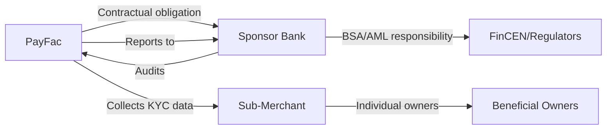
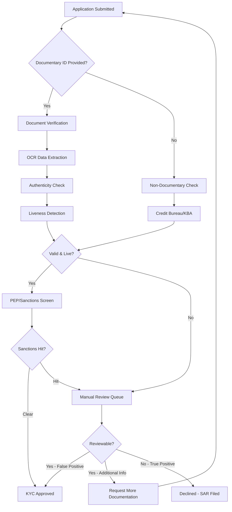

# KYC Requirements

> **Last Updated:** 2025-12-28
> **Status:** Complete

## Quick Reference

**Legal Requirement:** FinCEN Customer Identification Program (CIP) mandate (31 CFR 1020.220)

**Regulatory Authority:** Financial Crimes Enforcement Network (FinCEN) / U.S. Treasury

**Key Timeline:** FinCEN requires verification within "reasonable period" after account opening. **PayFac Best Practice:** Verify BEFORE enabling payment processing.

**Non-Compliance Penalties:**
- Civil penalties up to $5,000/day per violation
- OFAC violations: Up to $1,435,263 per violation (2025)
- Criminal penalties for willful violations

**PayFac Context:** While PayFacs may be exempt from direct BSA obligations, they have **contractual KYC obligations** from sponsor banks.

## Topics in This Section

Explore the detailed KYC topics:

| Topic | Description |
|-------|-------------|
| **[Verification Methods](./kyc/verification-methods.md)** | Documentary, non-documentary, and biometric verification techniques |
| **[Provider Landscape](./kyc/providers.md)** | Comparison of Jumio, Onfido, Persona, Alloy, Socure, and other vendors |
| **[PEP Screening](./kyc/pep-screening.md)** | Politically Exposed Person identification and enhanced due diligence |
| **[Implementation Guide](./kyc/implementation.md)** | Integration patterns, data retention, declining merchants, sponsor bank reporting |

## Overview

Know Your Customer (KYC) is the regulatory process of verifying the identity of individuals before establishing a business relationship. For Payment Facilitators, KYC applies to the individual owners, principals, and beneficial owners behind merchant businesses.

### Why KYC Exists

KYC requirements stem from the **Bank Secrecy Act (BSA)** and **USA PATRIOT Act**, designed to:

- Prevent money laundering and terrorist financing
- Combat fraud and identity theft
- Enable law enforcement to trace illicit funds
- Protect the financial system's integrity

### KYC vs. KYB Distinction

| Aspect | KYC (Know Your Customer) | KYB (Know Your Business) |
|--------|--------------------------|--------------------------|
| **Subject** | Individuals | Business entities |
| **Data Points** | Name, DOB, SSN, address | Legal name, EIN, formation docs |
| **Verification** | Government ID, credit bureau | Articles of incorporation, business license |
| **Objective** | Confirm individual identity | Confirm business legitimacy |
| **Use Case** | Sole proprietors, beneficial owners | LLCs, corporations, partnerships |

:::info Key Definitions

**KYC (Know Your Customer):** Process of verifying the identity of an individual customer

**CIP (Customer Identification Program):** Specific procedures required by FinCEN to verify customer identities (31 CFR 1020.220)

**CDD (Customer Due Diligence):** Broader ongoing monitoring of customer activity and risk assessment

**EDD (Enhanced Due Diligence):** Heightened scrutiny for high-risk customers (e.g., foreign PEPs, high-volume merchants)

:::

### PayFac KYC Responsibility

**Key Points:**
- PayFac performs KYC collection and initial verification
- Sponsor bank retains ultimate regulatory responsibility
- PayFac must maintain records for sponsor bank audits
- Failure = sponsor bank can terminate PayFac relationship

## Required Data Elements

Under FinCEN CIP Rule (31 CFR 1020.220), the following data points are **mandatory**:

| Data Element | U.S. Individuals | Non-U.S. Individuals | Verification Method |
|--------------|------------------|----------------------|---------------------|
| **Name** | Required | Required | Documentary (Government ID) |
| **Date of Birth** | Required | Required | Documentary |
| **Address** | Required | Required | Documentary or database |
| **ID Number** | SSN or ITIN | Passport or Alien ID | Documentary or database |

### Additional Data Points (Best Practice)

- **Middle name/initial:** Reduces false positives in sanctions screening
- **Phone number:** Contact verification, fraud prevention
- **Email address:** Communication, account recovery
- **Citizenship/nationality:** Determines tax obligations (FATCA, etc.)

## Verification Flow

### Typical Processing Times

- **Automated approval:** &lt;60 seconds (95%+ with AI-powered verification)
- **Manual review:** 1-3 business days (5-20% of applications)
- **Additional documentation:** 3-7 business days

## Self-Assessment Questions

**Q1: What is the difference between KYC and KYB?**

Click to reveal answer

**KYC (Know Your Customer):** Verifies the identity of **individuals** (name, DOB, SSN, address). Applied to sole proprietors and beneficial owners.

**KYB (Know Your Business):** Verifies the legitimacy of **business entities** (legal name, EIN, formation documents). Applied to LLCs, corporations, partnerships.

A PayFac onboarding an LLC would perform **KYB** on the LLC itself and **KYC** on all beneficial owners with 25%+ ownership.

---

**Q2: Is PEP screening mandatory under U.S. regulations?**

Click to reveal answer

**No.** Unlike OFAC sanctions screening (mandatory), PEP screening is **voluntary and risk-based**.

FinCEN guidance focuses on **Foreign PEPs** (higher corruption risk). Domestic PEPs are optional but best practice.

See [PEP Screening](./kyc/pep-screening.md) for complete requirements.

---

**Q3: What triggers a SAR filing during KYC?**

Click to reveal answer

**SAR Filing Triggers:**
- Sanctions list match (OFAC, UN, EU)
- Suspected fraud or identity theft
- Unusual transaction patterns during onboarding
- Known or suspected terrorist financing

**Important:** Do NOT notify the customer (illegal to "tip off"). File within 30 days.

See [Implementation Guide](./kyc/implementation.md) for SAR procedures.

## Related Topics

- [KYB Requirements](./kyb-requirements.md) - Business entity verification
- [Beneficial Ownership](./beneficial-ownership.md) - UBO identification rules
- [Sanctions Screening](./sanctions-screening.md) - OFAC requirements
- [Merchant Onboarding Overview](../index.md) - Full onboarding process

## References

### Official Regulatory Sources

- [FinCEN CIP Rule (31 CFR 1020.220)](https://www.fincen.gov/resources/statutes-regulations/chapter-x-financial-recordkeeping-and-reporting-requirements)
- [FFIEC BSA/AML Examination Manual](https://bsaaml.ffiec.gov/manual)
- [OFAC Compliance Resources](https://ofac.treasury.gov/compliance)

### Industry Standards

- [PCI DSS 4.0](https://www.pcisecuritystandards.org/document_library/)
- [ISO/IEC 30107-3](https://www.iso.org/standard/67381.html) - Liveness detection standard

### Card Network Resources

- [Visa PayFac Program Requirements](https://usa.visa.com/run-your-business/small-business-tools/retail-business-services/payment-facilitator.html)
- [Mastercard MATCH System](https://www.mastercard.us/en-us/business/overview/safety-and-security/match.html)

---

:::warning Time-Sensitive Information

**Regulatory Updates (2025):**
- **Corporate Transparency Act (CTA) Domestic Exemption:** As of March 21, 2025, U.S. domestic companies are EXEMPT from beneficial ownership reporting to FinCEN
- **TIN Collection Exemption:** June 2025 - Banks may now use third-party sources for TIN verification

Always verify current requirements with FinCEN, your sponsor bank, and legal counsel.

:::
