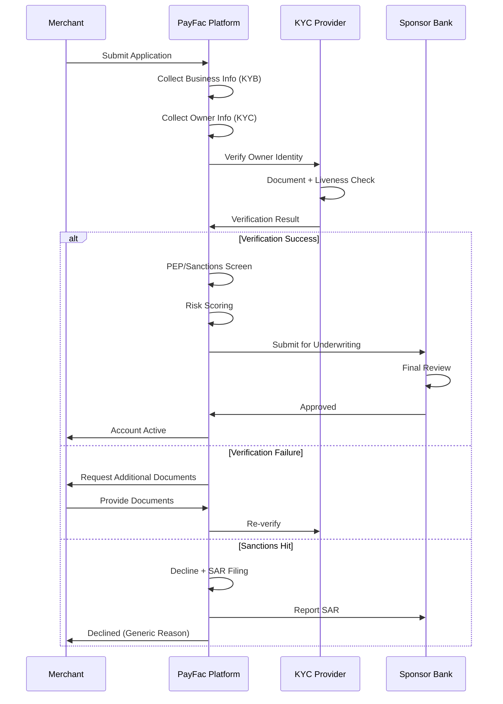

# KYC Implementation Guide

> **Last Updated:** 2025-12-28
> **Status:** Complete

This page covers practical implementation considerations for KYC processes in PayFac platforms.

## Where KYC Fits in Onboarding Flow



## Integration Patterns

### Synchronous (Real-time)

```typescript
// NestJS example: Synchronous KYC verification
import { Injectable } from '@nestjs/common';
import { JumioClient } from 'jumio-sdk';

@Injectable()
export class KycService {
  constructor(private jumioClient: JumioClient) {}

  async verifyIndividual(data: IndividualKycDto): Promise<KycResult> {
    // Submit verification request
    const verificationId = await this.jumioClient.createVerification({
      firstName: data.firstName,
      lastName: data.lastName,
      dob: data.dateOfBirth,
      country: data.country,
      callbackUrl: `${process.env.BASE_URL}/webhooks/kyc`,
    });

    // Wait for result (use webhooks in production for better UX)
    const result = await this.jumioClient.getVerificationResult(verificationId);

    return {
      verified: result.decision === 'APPROVED',
      verificationId,
      confidence: result.confidence,
      rejectionReasons: result.rejectionReasons,
    };
  }
}
```

### Asynchronous (Webhook-based)

```typescript
// NestJS example: Webhook handler for KYC results
import { Controller, Post, Body, Headers } from '@nestjs/common';

@Controller('webhooks')
export class WebhookController {
  constructor(private onboardingService: OnboardingService) {}

  @Post('kyc')
  async handleKycWebhook(
    @Body() payload: JumioWebhookPayload,
    @Headers('x-jumio-signature') signature: string,
  ): Promise<void> {
    // Verify webhook signature
    if (!this.verifySignature(payload, signature)) {
      throw new UnauthorizedException('Invalid signature');
    }

    // Process result
    if (payload.decision === 'APPROVED') {
      await this.onboardingService.approveKyc(payload.merchantId);
    } else {
      await this.onboardingService.rejectKyc(
        payload.merchantId,
        payload.rejectionReasons,
      );
    }
  }

  private verifySignature(payload: any, signature: string): boolean {
    // Implement HMAC verification
    // ...
  }
}
```

## Data Retention Requirements

**FinCEN CIP Rule:** Retain records for **5 years** after account closure.

### What to Retain

- Copy of identification documents (encrypted)
- Verification results and methods used
- Date of verification
- PEP/sanctions screening results
- Any additional due diligence documentation
- Declination rationale (if rejected)

### Storage Best Practices

- Encrypt at rest (AES-256)
- Encrypt in transit (TLS 1.2+)
- Access controls (role-based, audit logging)
- Backup and disaster recovery
- Geographic compliance (GDPR, data residency)

## Declining Merchants: Documentation

When declining a merchant due to KYC failure:

### What to Document

1. **Reason for declination** (specific: failed liveness, sanctions hit, false ID)
2. **Date of decision**
3. **Reviewer name** (if manual review)
4. **Supporting evidence** (verification report, screening results)

### SAR Filing Triggers

- Sanctions list match (OFAC, UN, EU)
- Suspected fraud or identity theft
- Unusual transaction patterns during onboarding
- Known or suspected terrorist financing

### SAR Timeline

- **File within 30 days** of detecting suspicious activity
- **Do NOT notify the customer** (illegal to "tip off")
- Provide generic declination reason: "Unable to verify identity" or "Does not meet underwriting criteria"

:::danger Never Tip Off a SAR Subject

**18 U.S.C. § 1956(c)(1):** It is a federal crime to notify someone that a SAR has been filed about them.

**Acceptable Declination Reasons:**

- "We are unable to verify your identity at this time."
- "Your application does not meet our underwriting criteria."
- "We cannot onboard your business based on our risk assessment."

**NEVER say:**

- "You are on a sanctions list."
- "We filed a Suspicious Activity Report."
- "Your activity appears fraudulent."

:::

## Sponsor Bank Reporting

PayFacs must provide sponsor banks with regular compliance reporting:

### Quarterly Reports

- KYC verification pass/fail rates
- High-risk merchant approvals (with EDD documentation)
- PEP-identified merchants and monitoring results

### Annual Reports

- Independent audit of KYC/AML program
- Policy and procedure updates
- Staff training records

### Ad-hoc Reports

- SAR filings (copy to sponsor bank compliance)
- Sanctions screening hits (immediate notification)
- Material policy changes

## Common Mistakes and How to Avoid Them

| Mistake | Impact | How to Avoid |
|---------|--------|--------------|
| **Accepting expired IDs** | Regulatory violation, fraud risk | Automate expiration date checks in verification flow |
| **Not performing liveness detection** | Deepfake fraud, synthetic identities | Require ISO 30107-3 PAD Level 1+ from provider |
| **Skipping PEP screening for high-volume merchants** | Money laundering risk, regulatory scrutiny | Implement risk-based triggers (volume &gt;$100k/month) |
| **Storing SSNs in plaintext** | PCI DSS violation, data breach liability | Encrypt at rest (AES-256), tokenize when possible |
| **Not documenting manual review decisions** | Audit failure, inconsistent decisions | Require reviewers to log reason, evidence, decision |
| **Delaying verification &gt;30 days** | FinCEN violation ("reasonable period") | Set internal SLA: 7 days max, automate reminders |
| **Tipping off SAR subjects** | Federal crime (18 U.S.C. § 1956) | Use generic declination language, train staff |
| **Not refreshing PEP status** | Miss changes in risk profile | Annual refresh for high-risk, event-driven for others |
| **Ignoring middle names** | False positives in sanctions screening | Collect and verify middle name/initial |
| **Accepting P.O. Box as primary address** | FinCEN violation (requires street address) | Validate address format, reject P.O. Boxes for primary |

## Common Rejection Reasons

### Document Quality Issues (40%)

- Blurry image, glare, shadows
- Cropped or incomplete ID
- Expired document
- **Fix:** Provide real-time feedback ("Image too dark, please retake")

### Incomplete Data (25%)

- Missing middle name
- Incorrect address format
- DOB mismatch (MM/DD vs DD/MM)
- **Fix:** Validate fields before submission, show format examples

### Information Mismatch (20%)

- Spelling differences (legal name vs. common name)
- Address transposition (123 Oak St vs 123 Oak Street)
- DOB typos
- **Fix:** Allow fuzzy matching, manual review for close matches

### False Positives (10%)

- Common name matches sanctions list
- Living near sanctioned address
- Adverse media for different person with same name
- **Fix:** Manual review with additional data points (DOB, nationality)

### Fraud Detection (5%)

- Synthetic identity (real SSN + fake name)
- Deepfake video
- Stolen identity
- **Fix:** Multi-factor verification, behavioral analytics

## Card Network Requirements

### Visa PayFac Certification

**KYC-Related Requirements:**

- Documented KYC/AML policies and procedures
- Annual independent audit of AML program
- Evidence of sub-merchant verification process
- PEP/sanctions screening capability
- MATCH list screening before onboarding

**Registration Fee:** $5,000

### Mastercard MATCH List

**MATCH (Member Alert to Control High-Risk Merchants):** Database of terminated merchants.

**Requirement:** PayFacs MUST check MATCH before onboarding every sub-merchant.

**Reason Codes:**

- **Code 01:** Account data compromise
- **Code 02:** Common point of purchase (fraud)
- **Code 04:** Excessive chargebacks
- **Code 05:** Excessive fraud
- **Code 06:** Money laundering
- **Code 12:** PCI DSS non-compliance
- **Code 14:** Illegal transactions

**Retention:** 5 years on list

**Impact:** Merchant listed on MATCH typically cannot be onboarded by any acquirer/PayFac during retention period.

## Related Topics

- [KYC Requirements Overview](../kyc-requirements.md) - Core KYC concepts
- [Verification Methods](./verification-methods.md) - Identity verification techniques
- [Provider Landscape](./providers.md) - Vendor comparison
- [Sanctions Screening](../sanctions-screening.md) - OFAC requirements
