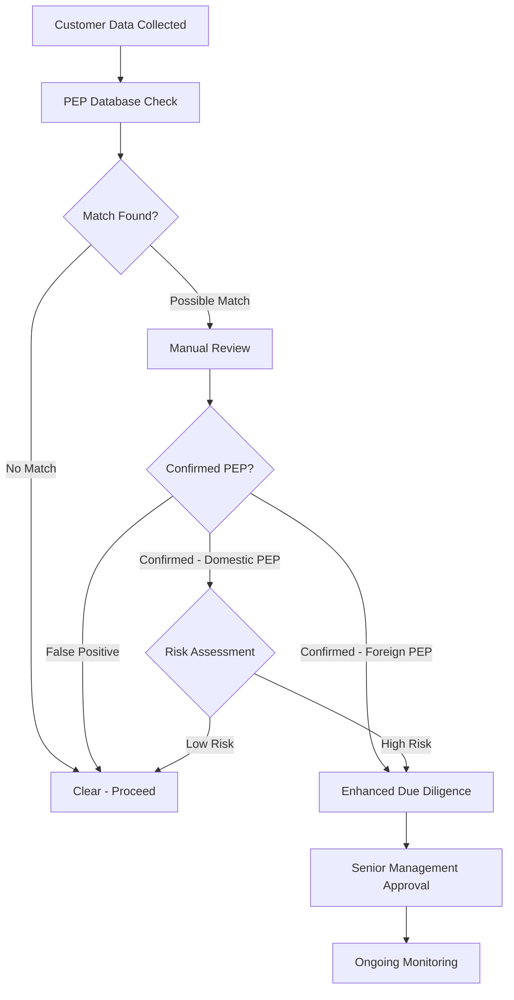

# PEP Screening

> **Last Updated:** 2025-12-28
> **Status:** Complete

This page covers Politically Exposed Person (PEP) identification and screening requirements for KYC processes.

## What is a PEP?

**Politically Exposed Person (PEP):** Individual who holds or has held a prominent public position, or their immediate family members/close associates.

### Examples

- Heads of state, government ministers
- Senior politicians, judges, military officers
- State-owned enterprise executives
- Central bank officials
- Ambassadors, consuls
- **Family members:** Spouses, children, parents
- **Close associates:** Business partners, advisors

## PEP Screening Requirements

:::warning PEP Screening is NOT Mandatory Under BSA/AML

Unlike sanctions screening (OFAC), **PEP screening is voluntary and risk-based** under U.S. regulations.

**FinCEN/Regulators Guidance:**

- Due diligence must be "commensurate with risk"
- No blanket requirement to screen all customers for PEP status
- **Focus on Foreign PEPs** (higher corruption risk)
- Domestic PEPs optional but best practice

**Distinction:**

- **PEP (general):** Broader term, risk-based screening
- **Senior Foreign Political Figure (SFPF):** Specific EDD requirements under 31 CFR 1010.620

:::

## When to Screen for PEPs

### Risk-Based Triggers

- High transaction volumes (&gt;$100k/month)
- International transactions (cross-border payments)
- High-risk industries (money services, jewelry, art)
- Unusual activity patterns (large cash deposits)
- Geographic risk (countries with high corruption indices)

### Screening Frequency

- **Onboarding:** Initial screen
- **Ongoing:** Annual refresh for high-risk merchants
- **Event-driven:** When suspicious activity detected

## PEP Screening Process

### Enhanced Due Diligence for Foreign PEPs

When a Foreign PEP is confirmed, you must:

- **Source of wealth documentation:** Where did their money come from?
- **Purpose of business relationship:** Why do they need payment processing?
- **Expected transaction patterns:** What volume and type of transactions?
- **Senior management approval:** Documented sign-off from compliance leadership
- **Ongoing monitoring:** Quarterly or more frequent review

## False Positive Handling

### Common False Positives

- Common names (e.g., "John Smith" matches thousands)
- Partial name matches (e.g., "Robert Johnson" vs "Bob Johnston")
- Family name matches without relationship
- Historical PEPs (no longer in office, low risk)

### Resolution Process

1. Review match details (name, DOB, nationality, position)
2. Request additional information if unclear
3. Document decision (cleared or confirmed PEP)
4. Retain documentation for audit (5 years minimum)

### Documentation Requirements

For each PEP screening decision, document:

- **Match details:** What triggered the alert
- **Investigation steps:** What you reviewed
- **Decision rationale:** Why cleared or escalated
- **Reviewer information:** Who made the decision
- **Date and timestamp:** When decision was made

## Adverse Media Screening

Adverse media screening often accompanies PEP checks and provides additional risk context.

### What is Adverse Media?

Negative news coverage indicating potential financial crime risk:
- Fraud allegations
- Corruption charges
- Money laundering investigations
- Terrorism connections
- Regulatory actions

### Why It Matters

- Identifies reputational risk before onboarding
- Detects fraud not yet reflected in sanctions lists
- Required for Enhanced Due Diligence (EDD)
- **Industry Spending:** $274.1 billion annually on financial crime compliance

### Challenges

- **High false positive rates:** Common names trigger irrelevant news
- **Language barriers:** Foreign-language news sources
- **Context understanding:** Distinguishing victim vs. perpetrator
- **Operational burden:** Manual review of flagged articles

### AI Solutions (2025)

Modern adverse media screening uses:
- Natural language processing (NLP) to understand context
- Entity resolution (disambiguate individuals)
- Sentiment analysis (positive vs. negative coverage)
- Automated risk scoring

### Providers

- Moody's Analytics (advanced NLP)
- Siron®One (AI-powered false positive reduction)
- World-Check (Refinitiv/LSEG)
- Dow Jones Risk & Compliance

## Best Practices

1. **Screen all merchants at onboarding** (even if not required)
2. **Apply risk-based EDD** to confirmed PEPs
3. **Document all screening decisions** for audit trail
4. **Refresh high-risk merchants annually**
5. **Train staff** on PEP identification and escalation

## Related Topics

- [KYC Requirements Overview](../kyc-requirements.md) - Core KYC concepts
- [Sanctions Screening](../sanctions-screening.md) - OFAC requirements (mandatory)
- [Verification Methods](./verification-methods.md) - Identity verification techniques
