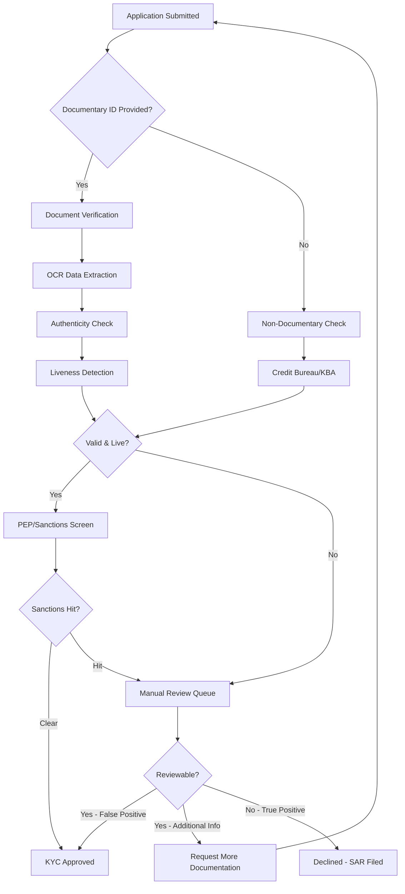

# KYC Verification Methods

> **Last Updated:** 2025-12-28
> **Status:** Complete

This page details the various methods used to verify individual identity during the KYC process.

## Documentary Verification

Verifying identity using **government-issued documents**.

### Acceptable Documents (Individuals)

- Unexpired driver's license (state or foreign)
- Passport (U.S. or foreign)
- State-issued ID card
- Military ID
- Tribal ID

### Requirements

- Must be current (not expired)
- Must contain photograph
- Must contain name, DOB, and address (or separate proof of address)
- Must be issued by a government authority

### Verification Process

1. Collect document image (front/back for driver's license)
2. Extract data via OCR (Optical Character Recognition)
3. Verify authenticity (microprinting, holograms, fonts, security features)
4. Match extracted data to customer-provided data
5. Perform liveness detection (confirm person is present, not using photo of ID)

## Non-Documentary Verification

Verifying identity using **independent sources** when documents are unavailable or require additional confirmation.

### Acceptable Methods

| Method | Description | Cost | Accuracy | Use Case |
|--------|-------------|------|----------|----------|
| **Contact Customer Directly** | Call provided phone, send mail to address | Low | Medium | Low-risk verification |
| **Credit Bureau Database** | Check Experian, Equifax, TransUnion records | $0.10-$1.00 | High | U.S. residents with credit history |
| **Public Database** | DMV records, voter registration, property records | $0.50-$2.00 | Medium-High | U.S. residents |
| **Knowledge-Based Authentication (KBA)** | Quiz on personal history (past addresses, loans) | $1.00-$3.00 | High | Thin-file or additional verification |
| **References** | Contact from other financial institutions | Low | Medium | Existing banking relationship |

### Knowledge-Based Authentication (KBA) Example

```
Question 1: Which of the following streets have you lived on?
A) 123 Oak Street
B) 456 Maple Avenue
C) 789 Pine Road
D) None of the above

Question 2: What was the monthly payment on your auto loan in 2020?
A) $250-$350
B) $350-$450
C) $450-$550
D) I did not have an auto loan
```

### KBA Limitations

- Requires credit history (excludes "thin-file" individuals)
- Data breach risk (stolen personal info can pass KBA)
- Privacy concerns (perceived as invasive)

## Biometric Verification

Modern KYC increasingly uses **biometric authentication** to combat deepfakes and synthetic identities.

### Liveness Detection Standards

| Standard | Level | Description | Use Case |
|----------|-------|-------------|----------|
| **ISO/IEC 30107-3 PAD Level 1** | Basic | Detects printed photos, masks, replays | Standard onboarding |
| **ISO/IEC 30107-3 PAD Level 2** | Advanced | Detects deepfakes, injection attacks | High-risk merchants |
| **CEN/TS 18099** | EU Standard | Injection attack detection (server-side deepfakes) | EU operations |

### Liveness Detection Techniques

- **Passive liveness:** AI analyzes single photo for micro-textures, reflections, depth
- **Active liveness:** User performs action (blink, turn head, smile)
- **Challenge-response:** Random sequence of actions (harder to pre-record)

:::danger Deepfake Threat (2025)

**Deepfake fraud has grown 2,000%+ in recent years:**

- 1 in 15 identity fraud attempts involves deepfakes
- Deepfake toolkits available for under $20
- Advanced AI can generate realistic video in real-time

**Mitigation:**

- Require ISO/IEC 30107-3 PAD Level 2 compliance from verification providers
- Use multiple factors (document + biometric + database)
- Monitor for suspicious patterns (multiple applications from same device)

:::

## Verification Flow



### Typical Processing Times

- **Automated approval:** &lt;60 seconds (95%+ with AI-powered verification)
- **Manual review:** 1-3 business days (5-20% of applications)
- **Additional documentation:** 3-7 business days

### Industry Benchmarks

- **Auto-approval rate:** 95%+ (modern AI systems)
- **False positive rate:** 30% of legitimate applications wrongly flagged (older systems)
- **Customer abandonment:** 68% abandon process if takes &gt;10 minutes
- **Lost clients:** 70% of financial institutions lost clients due to slow onboarding

## Related Topics

- [KYC Requirements Overview](../kyc-requirements.md) - Core KYC concepts
- [Provider Landscape](./providers.md) - Verification vendor comparison
- [PEP Screening](./pep-screening.md) - Politically Exposed Person checks
