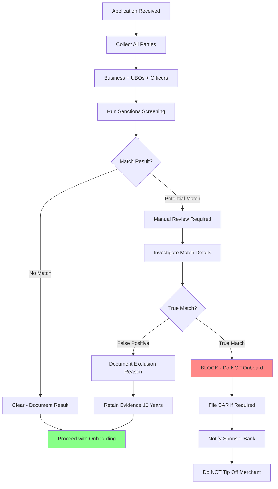

# Sanctions & Watchlist Screening

> **Last Updated:** 2025-12-28
> **Status:** Complete

## Quick Reference

**Key Facts:**

- **Primary Authority:** OFAC (Office of Foreign Assets Control) - U.S. Treasury Department
- **Key List:** SDN (Specially Designated Nationals and Blocked Persons)
- **Liability Type:** STRICT LIABILITY - civil penalties apply even without intent or knowledge
- **SDN Update Frequency:** Multiple times per week (often daily or even hourly)
- **Penalty Range:** Up to $356,579 per violation OR twice the transaction amount (whichever is greater)

**Critical Numbers:**

- **Record Retention:** 10 YEARS (extended from 5 years as of March 21, 2025)
- **Global Sanctions Records:** 57,000+ active records across 300+ programs
- **False Positive Rate:** 90-95%+ in many systems (industry benchmark)
- **50% Rule Threshold:** Entities owned 50%+ by blocked persons are automatically blocked

## Topics in This Section

Explore the detailed sanctions screening topics:

| Topic | Description |
|-------|-------------|
| **[Fuzzy Matching](./sanctions/fuzzy-matching.md)** | Name matching algorithms, Levenshtein, Jaro-Winkler, Soundex, and threshold tuning |
| **[False Positives](./sanctions/false-positives.md)** | Mitigation strategies, entity resolution, and exclusion list management |
| **[Screening Operations](./sanctions/operations.md)** | Real-time vs batch screening, ongoing monitoring, and record retention |
| **[True Match Procedures](./sanctions/true-match.md)** | Blocking actions, rejection communication, SAR filing, and OFAC reporting |
| **[Vendor Landscape](./sanctions/vendors.md)** | Dow Jones, World-Check, ComplyAdvantage, and vendor selection criteria |
| **[PayFac Implementation](./sanctions/payfac-implementation.md)** | Sponsor bank requirements and transaction monitoring |
| **[Enforcement Actions](./sanctions/enforcement.md)** | Recent OFAC cases and lessons learned |

## Overview

Sanctions screening verifies that merchants, their beneficial owners, and principals are not on government watchlists or prohibited from conducting financial transactions. This is a **legal requirement** with severe consequences for non-compliance.

### Why Sanctions Screening is Critical

**Strict Liability Standard:**

Unlike many compliance violations, OFAC sanctions enforcement operates under **strict liability**:

- Civil penalties apply even if you didn't know you were dealing with a sanctioned party
- Intent is NOT required for enforcement
- "We didn't know" is NOT a defense
- Good faith is NOT a defense
- Penalties can be assessed for each violation (per transaction)

### PayFac Responsibility

As a Payment Facilitator, you are responsible for screening:

- Every sub-merchant you onboard
- All beneficial owners (UBOs) of those merchants
- All control persons, officers, and principals
- Ongoing monitoring as sanctions lists evolve

### Sanctions vs. PEP Screening

| Aspect | Sanctions Screening | PEP Screening |
|--------|-------------------|---------------|
| **Purpose** | Identify prohibited parties | Identify higher-risk individuals |
| **Authority** | OFAC, UN, EU (legal prohibition) | AML/compliance frameworks |
| **Outcome if matched** | MUST BLOCK - cannot do business | Enhanced due diligence required |
| **Legal basis** | Strict liability enforcement | Risk-based compliance |
| **Flexibility** | Zero - absolute prohibition | Can onboard with proper EDD |

## OFAC & The SDN List

### What is OFAC?

The **Office of Foreign Assets Control (OFAC)** is a division of the U.S. Treasury Department that administers and enforces economic and trade sanctions based on U.S. foreign policy and national security goals.

### The SDN List

The **Specially Designated Nationals and Blocked Persons List** is OFAC's primary sanctions list containing individuals, companies, vessels, aircraft, and other entities.

**Consequences of SDN designation:**

- All property and interests in property MUST be blocked
- U.S. persons are prohibited from dealing with SDN parties
- No transactions, transfers, or business relationships permitted
- Applies to direct AND indirect transactions

### The 50% Rule

:::danger The 50% Rule
Entities that are owned 50% or more, directly or indirectly, by one or more blocked persons are **automatically blocked**, even if the entity itself is not explicitly listed on the SDN list.
:::

**Key Points:**

1. **Aggregate Ownership Counts:** Two SDN-listed individuals each owning 25% = blocked (total 50%)
2. **Indirect Ownership Applies:** If SDN owns 100% of Company A, and Company A owns Company B, Company B is blocked
3. **OFAC Does NOT Publish These Entities:** Compliance burden is on YOU to identify them

## Screening Process Flow

## Who Must Be Screened?

For every merchant application, screen ALL of the following:

1. **Business Entity** - Legal name, DBA names, previous names, parent companies
2. **Beneficial Owners (UBOs)** - Every individual with 25%+ ownership
3. **Control Persons** - Individuals with significant control regardless of ownership
4. **Officers and Principals** - CEO, CFO, COO, board members, authorized signers
5. **Related Entities** - Parent companies, subsidiaries, sister companies

## Self-Assessment Questions

**Q1: What is the legal standard for OFAC sanctions violations?**

Click to reveal answer

**Strict liability** - civil penalties apply even without intent or knowledge. "We didn't know" is not a defense. Each violation can result in penalties up to $356,579 or twice the transaction amount.

See [Enforcement Actions](./sanctions/enforcement.md) for recent cases.

---

**Q2: What happens if a merchant is found on the SDN list during onboarding?**

Click to reveal answer

You MUST:

- Immediately reject the application (do NOT onboard)
- Block all transactions
- Do NOT tip off the merchant (do not mention sanctions)
- File SAR if required
- Notify sponsor bank immediately
- Document all actions and evidence

See [True Match Procedures](./sanctions/true-match.md) for complete process.

---

**Q3: Why is ongoing screening necessary after onboarding?**

Click to reveal answer

Multiple reasons:

- SDN list updates **daily** (sometimes hourly)
- Existing merchants can be added to sanctions lists
- Beneficial ownership can change (new UBO may be sanctioned)
- OFAC expects continuous monitoring, not one-time screening

See [Screening Operations](./sanctions/operations.md) for monitoring frequency.

## Related Topics

- [KYC Requirements](./kyc-requirements.md) - Identity verification foundation for sanctions screening
- [Beneficial Ownership](./beneficial-ownership.md) - Identifying all UBOs to screen (25% threshold)
- [KYB Requirements](./kyb-requirements.md) - Business entity verification

## References

### Official OFAC Resources

- [OFAC SDN List Search](https://sanctionssearch.ofac.treas.gov/)
- [OFAC Sanctions Programs](https://ofac.treasury.gov/sanctions-programs-and-country-information)
- [OFAC Compliance Resources](https://ofac.treasury.gov/resources/compliance-resources)
- [OFAC 50% Rule Guidance](https://ofac.treasury.gov/faqs/topic/1506)
- [OFAC Framework for Compliance Commitments](https://ofac.treasury.gov/documents/ofac-framework-compliance-commitments)

### Additional Sanctions Lists

- [UN Consolidated Sanctions List](https://www.un.org/securitycouncil/content/un-sc-consolidated-list)
- [EU Sanctions Map](https://www.sanctionsmap.eu/)
- [UK Sanctions List](https://www.gov.uk/government/publications/the-uk-sanctions-list)

### Regulatory Guidance

- [FinCEN SAR Filing](https://www.fincen.gov/resources/filing-information)
