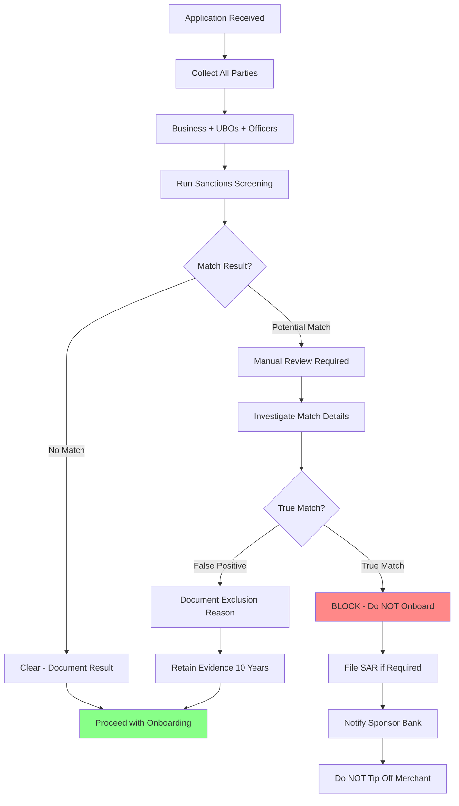
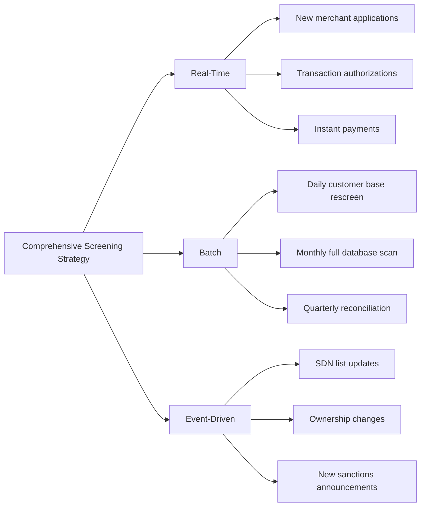

# Sanctions & Watchlist Screening

> **Last Updated:** 2025-12-26
>
> **Status:** Complete

## Quick Reference

**Key Facts:**
- **Primary Authority:** OFAC (Office of Foreign Assets Control) - U.S. Treasury Department
- **Key List:** SDN (Specially Designated Nationals and Blocked Persons)
- **Liability Type:** STRICT LIABILITY - civil penalties apply even without intent or knowledge
- **SDN Update Frequency:** Multiple times per week (often daily or even hourly)
- **Penalty Range:** Up to $356,579 per violation OR twice the transaction amount (whichever is greater, adjusted annually for inflation). Major cases reach hundreds of millions (GVA Capital: $215.99M in 2025)

**Critical Numbers:**
- **Record Retention:** 10 YEARS (extended from 5 years as of March 21, 2025)
- **Global Sanctions Records:** 57,000+ active records across 300+ programs
- **False Positive Rate:** 90-95%+ in many systems (industry benchmark)
- **50% Rule Threshold:** Entities owned 50%+ by blocked persons are automatically blocked

## Overview

Sanctions screening verifies that merchants, their beneficial owners, and principals are not on government watchlists or prohibited from conducting financial transactions. This is a **legal requirement** with severe consequences for non-compliance.

### Why Sanctions Screening is Critical

**Strict Liability Standard:**
Unlike many compliance violations, OFAC sanctions enforcement operates under **strict liability**. This means:
- Civil penalties apply even if you didn't know you were dealing with a sanctioned party
- Intent is NOT required for enforcement
- "We didn't know" is NOT a defense
- Good faith is NOT a defense
- Penalties can be assessed for each violation (per transaction)

**PayFac Responsibility:**
As a Payment Facilitator, you are responsible for screening:
- Every sub-merchant you onboard
- All beneficial owners (UBOs) of those merchants
- All control persons, officers, and principals
- Ongoing monitoring as sanctions lists evolve

Facilitating even a single payment for a sanctioned party can result in substantial penalties per violation, with aggregate penalties reaching hundreds of millions for egregious cases.

### Sanctions vs. PEP Screening

It's important to distinguish these two requirements:

| Aspect | Sanctions Screening | PEP Screening |
|--------|-------------------|---------------|
| **Purpose** | Identify prohibited parties | Identify higher-risk individuals |
| **Authority** | OFAC, UN, EU (legal prohibition) | AML/compliance frameworks |
| **Outcome if matched** | MUST BLOCK - cannot do business | Enhanced due diligence required |
| **Legal basis** | Strict liability enforcement | Risk-based compliance |
| **Flexibility** | Zero - absolute prohibition | Can onboard with proper EDD |

**PEP (Politically Exposed Persons)** are individuals in prominent political positions who may pose higher corruption risks. PEP status requires **enhanced due diligence**, not prohibition. Sanctions matches require **immediate blocking**.

## OFAC & The SDN List

### What is OFAC?

The **Office of Foreign Assets Control (OFAC)** is a division of the U.S. Treasury Department that administers and enforces economic and trade sanctions based on:
- U.S. foreign policy objectives
- National security goals
- Counterterrorism efforts
- Counter-narcotics programs
- Human rights concerns

### The SDN List

The **Specially Designated Nationals and Blocked Persons List** is OFAC's primary sanctions list containing:
- Individuals
- Companies
- Vessels
- Aircraft
- Other entities

**Consequences of SDN designation:**
- All property and interests in property MUST be blocked
- U.S. persons are prohibited from dealing with SDN parties
- No transactions, transfers, or business relationships permitted
- Applies to direct AND indirect transactions

### Current Comprehensive Sanctions Programs (December 2025)

:::warning Time-Sensitive Information
Sanctions programs evolve rapidly. The following reflects status as of December 2025.
:::

**Active Comprehensive Sanctions:**

| Country/Region | Since | Scope | Key Drivers |
|---------------|-------|-------|-------------|
| **Cuba** | 1960s | Nearly total embargo | Historical U.S. policy |
| **Iran** | 1979 (intensified) | "Maximum pressure" campaign re-launched Feb 2025 | Nuclear program, regional influence |
| **North Korea** | 2000s (intensified) | Comprehensive sanctions | Nuclear weapons, ballistic missiles |
| **Russia** | 2014 (expanded 2022) | Crimea, Donetsk, Luhansk regions | Ukraine invasion, territorial annexation |

**Recent Changes:**

:::tip Syria Sanctions Lifted
**Effective July 1, 2025:** Comprehensive sanctions on Syria were LIFTED. However:
- Individual SDN designations remain (terrorism, human rights violations, etc.)
- Syrian nationals previously designated remain on SDN list unless specifically delisted
- Entities owned 50%+ by sanctioned Syrian nationals remain blocked (50% Rule)
- Always check current SDN list rather than relying on country-program status alone
:::

**Sectoral Sanctions:**
In addition to comprehensive country sanctions, OFAC maintains targeted sanctions on specific sectors:
- Financial services
- Energy sector
- Defense and related materiel
- Metals and mining
- Technology sector

### The 50% Rule

One of the most important (and often overlooked) OFAC compliance concepts:

:::danger The 50% Rule
Entities that are owned 50% or more, directly or indirectly, by one or more blocked persons are **automatically blocked**, even if the entity itself is not explicitly listed on the SDN list.
:::

**Key Points:**

1. **Aggregate Ownership Counts:**
   - If two SDN-listed individuals each own 25% = blocked (total 50%)
   - Multiple SDN parties' ownership is combined

2. **Indirect Ownership Applies:**
   - If SDN owns 100% of Company A
   - Company A owns 100% of Company B
   - Company B is blocked (100% indirect ownership by SDN)

3. **Control Alone is NOT Sufficient:**
   - SDN must own 50%+ equity/voting interest
   - Control without ownership doesn't trigger automatic blocking
   - However, control can be basis for other OFAC actions

4. **OFAC Does NOT Publish These Entities:**
   - There is no list of "50% Rule blocked entities"
   - **Compliance burden is on YOU** to identify them
   - Must research ownership structures
   - Must calculate aggregate ownership percentages

**Practical Implication for PayFacs:**
When screening merchants, you must:
- Identify all beneficial owners (using 25% threshold for UBO identification)
- Screen each UBO against sanctions lists
- If any UBO is sanctioned, evaluate if they own 50%+ (alone or aggregated)
- Screen the merchant's corporate parents/subsidiaries for SDN ownership

## Other Sanctions Lists

While OFAC's SDN list is primary for U.S. PayFacs, you should be aware of other lists:

| List | Administrator | Update Frequency | U.S. PayFac Relevance |
|------|--------------|------------------|---------------------|
| **SDN List** | OFAC (U.S. Treasury) | Often daily | **PRIMARY - Required** |
| **UN Consolidated List** | United Nations Security Council | Periodic | Required (U.S. implements UN sanctions via OFAC) |
| **EU Consolidated List** | European Union | Frequent (weekly+) | If operating in EU or serving EU customers |
| **UK HMT Sanctions List** | UK Government (HM Treasury) | Frequent | If operating in UK or serving UK customers |
| **FBI Most Wanted** | FBI | As needed | Enhanced due diligence consideration |
| **Interpol Red Notices** | Interpol | Continuous | Enhanced due diligence consideration |

:::info Global Sanctions Landscape
As of December 2025, there are **57,000+ active sanction records** across **300+ programs globally**. Most U.S. PayFacs focus on OFAC compliance, but international operations require screening against local jurisdiction lists.
:::

**UK Specific Note:**
The UK's OFSI Consolidated List is being closed and archived on **January 31, 2026**. The UK Sanctions List became the primary reference for UK sanctions in July 2022.

## Who Must Be Screened?

For every merchant application, you must screen ALL of the following parties:

### 1. Business Entity
- Legal business name (as registered)
- DBA (Doing Business As) names
- Previous business names
- Parent companies
- Subsidiaries (if 50%+ owned)

### 2. Beneficial Owners (UBOs)
- Every individual with 25%+ ownership
- Direct and indirect ownership
- Apply 50% Rule for sanctioned owners

### 3. Control Persons
- Individuals with significant control regardless of ownership percentage
- Managing directors
- General partners (in partnerships)
- Trustees (for trusts)

### 4. Officers and Principals
- CEO, CFO, COO
- President, Vice Presidents
- Board members
- Authorized signers on accounts

### 5. Related Entities
- Companies owned by the merchant (if applicable)
- Companies that own the merchant
- Sister companies under common ownership

**Comprehensive Coverage is Critical:**
Sanctioned individuals often use complex corporate structures to obscure ownership. Screening only the business name is insufficient and can result in violations.

## Screening Process Flow

### Step-by-Step Process

**1. Data Collection:**
- Gather full legal names (individuals and entities)
- Collect dates of birth (for individuals)
- Obtain addresses and jurisdictions
- Document business relationships

**2. Automated Screening:**
- Run all collected data through screening system
- Use fuzzy matching algorithms (see below)
- Generate match scores for potential hits

**3. Match Review:**
- Review all potential matches manually
- Compare identifying details (DOB, address, nationality)
- Evaluate context and relationship to SDN entry
- Document review decision

**4. Disposition:**
- **Clear:** Proceed with onboarding, retain evidence
- **False Positive:** Document why match excluded, retain evidence
- **True Match:** BLOCK immediately, initiate escalation procedures

## Fuzzy Matching Algorithms

### Why Exact Matching Isn't Enough

Relying on exact name matches would allow sanctions evasion through:
- **Typos and misspellings:** "Mohammad" vs. "Muhammad"
- **Transliteration variations:** Arabic/Cyrillic names to Latin alphabet
- **Name order differences:** "John Smith" vs. "Smith, John"
- **Nicknames and aliases:** "Bob" vs. "Robert"
- **Missing middle names or initials**
- **Corporate name variations:** "ABC Corp" vs. "ABC Corporation" vs. "ABC Inc."

**Fuzzy matching algorithms** calculate similarity scores between names to identify potential matches even when spelling differs.

### Algorithm Comparison

| Algorithm | Method | Best For | Speed | Used By |
|-----------|--------|----------|-------|---------|
| **Levenshtein Distance** | Counts minimum edit operations (insert/delete/substitute) to transform one string to another | Complex names, business names | Slower | Most commercial AML solutions |
| **Jaro-Winkler** | Character similarity with prefix weighting (rewards matching first characters) | Individual names, typos | Faster | OFAC Sanctions List Search tool |
| **Soundex** | Phonetic encoding (encodes names by how they sound) | Similar-sounding names | Very fast | OFAC Sanctions List Search tool |
| **Double Metaphone** | Advanced phonetic encoding with multiple encodings per name | Complex pronunciations | Fast | Advanced screening systems |

**OFAC's Official Approach:**
The OFAC Sanctions List Search tool uses fuzzy matching algorithms (commonly reported to include Jaro-Winkler and Soundex-based approaches) to identify potential matches even when spelling differs.

### Setting Match Thresholds

**Common threshold ranges:**
- **95-100%:** Very likely match - investigate immediately
- **85-94%:** Possible match - manual review required
- **70-84%:** Lower probability - may review based on risk appetite
- **Below 70%:** Typically ignored (but configurable)

**Risk-Based Threshold Setting:**
- **High-risk industries:** Lower thresholds (more sensitive)
- **High-risk geographies:** Lower thresholds
- **Common names:** May need higher thresholds (e.g., "Mohammed Ahmed")
- **Business names:** Often need lower thresholds (more variation)

:::tip Threshold Tuning is Critical
Initial threshold settings will generate thousands of false positives. Continuous tuning based on review outcomes is essential to balance compliance with operational efficiency.
:::

## False Positive Management

### The False Positive Problem

**Industry Benchmark:** 90-95%+ of sanctions screening alerts are **false positives** (not actual matches).

**Historical View:** High false positive rates were once viewed as "better safe than sorry."

**Current View (2025):** High false positive rates indicate **poor technology and poor data quality**, not cautious compliance. Regulators and auditors now expect:
- Effective screening systems
- Tuned algorithms
- Reduced manual review burden
- Evidence of continuous improvement

### Why False Positives Occur

1. **Common names:** "John Smith" matches thousands of people
2. **Over-sensitive thresholds:** Catching too many low-probability matches
3. **Insufficient data points:** Screening name only without DOB/address
4. **Poor data quality:** Typos in merchant application data
5. **Lack of secondary screening:** Not using entity resolution

### Mitigation Strategies

**1. Use Secondary Identifying Data:**
- Date of birth
- Address/location
- Nationality/citizenship
- Passport/ID numbers (when available)
- Business registration numbers

**2. Apply Risk-Based Thresholds:**
- Higher thresholds for common names
- Lower thresholds for uncommon names
- Adjusted thresholds by geography
- Industry-specific tuning

**3. Implement Entity Resolution:**
Use AI/ML to:
- Link related records
- Identify unique entities
- Consolidate duplicate alerts
- Learn from historical review decisions

**4. Continuous Tuning:**
- Track false positive rates by name type
- Analyze review outcomes
- Adjust thresholds quarterly
- Update exclusion rules
- Improve data collection quality

**5. Maintain Exclusion Lists:**
- Document recurring false positives
- Create "known good" lists
- Require periodic review (annually)
- Justify exclusions with evidence

:::warning Exclusion List Risks
While exclusion lists reduce false positives, they create compliance risk. A person initially excluded as false positive could later be added to SDN list. Regular re-screening of exclusions is essential.
:::

## Real-Time vs. Batch Screening

### Real-Time Screening (Regulatory Expectation)

**Required For:**
- Card payment authorizations
- Instant payment systems (FedNow, RTP)
- High-risk transactions
- Merchant onboarding approvals

**EU Instant Payments Regulation (IPR):**
Effective **January 2025**, EU financial institutions must screen instant payments in **milliseconds** (sub-second processing). This is now the global standard expectation.

**Performance Requirements:**
- **Card authorizations:** 2-3 seconds total (screening must be &lt;1 second)
- **Instant payments:** &lt;10 seconds total (screening &lt;1-2 seconds)
- **Merchant onboarding:** Real-time during application flow

**Technical Considerations:**
- In-memory screening databases
- Local caching of sanctions lists
- Optimized fuzzy matching algorithms
- Distributed screening architecture
- Failover and redundancy

### Batch Screening (Supplemental Only)

**Appropriate Use Cases:**
- Insurance payments (non-immediate)
- Periodic customer database rescreening
- Historical transaction review
- Large-scale list update processing

**Limitations:**
- Creates gaps between real-time and batch updates
- Delayed detection of new sanctions
- Not acceptable as sole screening method

**OFAC Expectation:** Batch screening as **supplement only**, not replacement for real-time.

### Recommended: Hybrid Approach

**Best Practice:**
1. **Real-time:** All transactions and onboarding decisions
2. **Daily batch:** Full customer database against updated SDN list
3. **Event-triggered:** Ownership changes, major sanctions announcements
4. **Periodic batch:** Monthly/quarterly full rescreening (supplemental verification)

## Ongoing Monitoring

### Why One-Time Screening is Insufficient

**SDN List Dynamics:**
- Updates published multiple times per week
- Often daily or even hourly updates
- Emergency updates for breaking events
- Individuals/entities added without prior notice

**Merchant Changes:**
- Ownership can change after onboarding
- New beneficial owners may be sanctioned
- Corporate restructuring may create new exposure
- Existing customers may be added to SDN list

**Compliance Expectation:**
One-time screening at onboarding is **not sufficient**. Ongoing monitoring is required.

### Case Study: OFAC Finding of Violation

:::danger Real-World Enforcement Action
**Situation:** A bank believed its third-party vendor was screening the entire customer base **daily** against SDN updates.

**Reality:** The vendor only conducted full database screening **monthly**.

**Result:** A 14-day gap occurred after an individual was added to the SDN list.

**Outcome:** OFAC issued a **Finding of Violation** for failure to block transactions during the gap period.

**Lesson:** Verify vendor screening frequency. Document processes. Don't assume vendor capabilities.
:::

### Recommended Monitoring Frequency

| Screening Type | Frequency | Purpose |
|---------------|-----------|---------|
| **Real-time transaction screening** | Every transaction | Geographic risk, sanctions evasion detection |
| **Customer database screening** | Daily | Catch new SDN additions immediately |
| **Event-triggered screening** | Immediately upon event | Ownership changes, sanctions announcements |
| **Full database rescreen** | Monthly or quarterly | Supplemental verification, audit trail |

**Event-Triggered Scenarios:**
- Change in beneficial ownership
- Change in control persons or officers
- Corporate merger or acquisition
- Major OFAC sanctions announcement (e.g., new country program)
- Merchant moves to high-risk jurisdiction

### Automated Monitoring Systems

**Capabilities to Look For:**
- Automatic SDN list updates (multiple times daily)
- Triggered rescreening upon list updates
- Alert generation for new matches
- Workflow for match investigation
- Audit trail of all screening activity

**Integration Requirements:**
- Connection to merchant database
- Real-time transaction feed (for transaction monitoring)
- UBO data repository
- Ownership change notification system

## True Match Procedures

When you confirm a **true match** to the SDN list or other sanctions list:

:::danger Immediate Actions Required

**1. DO NOT Onboard** (if during application process)
- Immediately reject the application
- Do not grant system access
- Do not process any transactions

**2. Block Immediately** (if existing merchant)
- Suspend merchant account access
- Block all pending transactions
- Reject all future transaction attempts
- Freeze any funds held (consult legal counsel)

**3. DO NOT Tip Off** (Legal Requirement)
- Do not inform the merchant why they are blocked
- Do not mention sanctions or SDN list
- Use generic rejection language ("unable to approve at this time")
- Violation of "tipping off" prohibition can result in penalties

**4. File SAR if Required**
- Suspicious Activity Report to FinCEN
- Required for certain sanctions violations
- Consult compliance team/legal counsel
- File within required timeframe (typically 30 days)

**5. Notify Sponsor Bank**
- Immediate notification per partnership agreement
- Provide full details of match
- Coordinate on remediation steps
- Document all communications

**6. Block Property/Assets**
- If merchant has funds held (reserves, pending settlements)
- Must be blocked and reported to OFAC
- Cannot be released without OFAC authorization
- Consult legal counsel immediately

**7. Document Everything**
- Screening results showing match
- Analysis supporting true positive determination
- Date/time of discovery
- Actions taken
- Notifications sent
- Legal/compliance consultations
:::

### Rejection Communication

**DO say:**
- "We are unable to approve your application at this time."
- "Your application does not meet our underwriting criteria."
- "We cannot provide merchant services to your business."

**DO NOT say:**
- "You are on the SDN list."
- "You match a sanctions list."
- "OFAC prohibits us from working with you."
- Any mention of sanctions, watchlists, or specific reasons

### Blocked Property Reporting

If you are holding funds for a sanctioned merchant:

**Required Actions:**
1. **Block the funds** immediately (do not release)
2. **Report to OFAC** within 10 business days using Form TD F 90-22.50
3. **File annual reports** on blocked property (by September 30 each year)
4. **Maintain detailed records** of blocked property
5. **Do NOT release** without OFAC authorization (even if merchant demands funds)

**OFAC Blocked Property Contact:**
- Office of Foreign Assets Control
- U.S. Department of the Treasury
- Email: ofac.compliance@treasury.gov
- Hotline: 1-800-540-6322

## Vendor Landscape (2025)

Sanctions screening vendors range from enterprise-level platforms to API-first fintech solutions.

### Vendor Comparison

| Vendor | Tier | Strengths | Best For | Pricing |
|--------|------|-----------|----------|---------|
| **Dow Jones Risk & Compliance** | Tier 1 | Highest quality data, extensive coverage, low false positives | Large enterprises, banks | Enterprise |
| **Refinitiv World-Check** (LSEG) | Tier 1 | Most comprehensive dataset, global coverage, advanced analytics | Large financial institutions | Enterprise |
| **LexisNexis Bridger** | Tier 1 | Unmatched data depth, due diligence capabilities, entity resolution | Large banks, global operations | Enterprise |
| **ComplyAdvantage** | Mid-range | AI-driven, real-time updates, API-first, modern UX | Fintechs, PayFacs, digital-first | Mid-range |
| **Accuity** (LexisNexis) | Tier 2 | Payment screening focus, good coverage, reliable | Mid-sized companies, regional banks | Mid-range |
| **Chainalysis KYT** | Specialized | Crypto-native, blockchain screening, transaction monitoring | Crypto exchanges, DeFi platforms | Mid-range |

### Pricing Considerations

**Tier 1 (Enterprise):**
- Typically $50,000 - $500,000+ annually
- Per-user licensing + API call pricing
- Minimum commitments often required
- Comprehensive support and training
- Prohibitively expensive for small/mid-sized fintechs

**Mid-Range:**
- $10,000 - $100,000 annually
- More flexible pricing models
- API-first with usage-based pricing
- Faster implementation
- Better fit for PayFacs and fintechs

**API-Based Pricing Models:**
- Per-screening fee: $0.10 - $2.00 per check
- Monthly minimums: $500 - $5,000
- Volume discounts available
- Real-time and batch pricing tiers

### Vendor Selection Criteria

**Must-Have Features:**
1. **Real-time screening** (sub-second response times)
2. **Automatic SDN list updates** (at least daily)
3. **Fuzzy matching** with configurable thresholds
4. **RESTful API** for integration
5. **Audit trail** of all screening activity
6. **Match resolution workflow**
7. **Multiple list coverage** (OFAC, UN, EU, UK)

**Nice-to-Have Features:**
- PEP screening
- Adverse media screening
- Entity resolution/disambiguation
- Risk scoring
- Ongoing monitoring automation
- Case management system
- Reporting and analytics

**Integration Considerations:**
- API documentation quality
- Webhook support for list updates
- Batch screening capabilities
- Rate limits and SLAs
- Sandbox environment for testing
- Technical support responsiveness

## Record Retention Requirements

:::warning NEW REQUIREMENT (Effective March 21, 2025)
OFAC record retention period **extended from 5 to 10 YEARS** for all transactions, blocked property, and rejected transactions.
:::

### What Must Be Retained

**All Screening Results:**
- Positive matches (true and false positives)
- Negative results (no match)
- Match scores and algorithm details
- Manual review decisions
- Exclusion justifications

**Transaction Records:**
- Wire transfers
- Card payments (authorizations and settlements)
- Securities trades
- Any payment involving screened parties

**Blocked Property Records:**
- Documentation of blocked funds
- OFAC reports filed
- Communications with OFAC
- Release authorizations (if any)

**Rejected Transactions:**
- Applications rejected due to sanctions match
- Transactions blocked due to sanctions screening
- Justification for rejection
- Communications (compliant with no-tipping-off rule)

**Compliance Documentation:**
- Internal risk assessments
- Sanctions compliance policies
- Training records
- Audit reports
- Vendor due diligence

### Retention Timeline Details

**Standard Records:** 10 years from date of transaction

**Blocked Property:** 10 years **AFTER** property is unblocked
- If property never unblocked: **indefinite retention**
- If released by OFAC license: 10 years from release date

**Practical Implication:**
Some records may need to be retained **indefinitely** if sanctions are never lifted or property never released.

### Record Accessibility Requirements

Records must be:
- **Organized** and easily retrievable
- **Searchable** by transaction, merchant, date, etc.
- **Complete** (all supporting documentation)
- **Secure** (protected from unauthorized access/modification)
- **Available for OFAC inspection** upon request

**Common Storage Solutions:**
- Document management systems
- Compliance data warehouses
- Cloud storage with retention policies
- Dedicated compliance platforms

## PayFac-Specific Implementation Considerations

### Sponsor Bank Requirements

Your sponsor bank will impose sanctions screening requirements as part of the partnership agreement:

**Standard Requirements:**
- Sanctions screening of all merchants before onboarding
- UBO screening (all beneficial owners)
- Ongoing monitoring of merchant base
- Immediate reporting of true matches
- Periodic attestations of compliance
- Right to audit your screening processes

**Mastercard Rules Reference:**
- **Rule 1.2:** Payment facilitator eligibility requirements
- **Rule 7.6.5:** Payment facilitator compliance obligations

**Visa Requirements:**
Similar obligations under Visa Payment Facilitator program rules.

### Escalation to Sponsor Bank

:::info When to Escalate
**Immediate escalation required:**
- True match to SDN list
- Potential match with unclear determination
- Geographic transaction patterns suggesting sanctions evasion
- Merchant requests to process for high-risk jurisdictions
- Any uncertainty about sanctions compliance
:::

**Escalation Process:**
1. Document the issue thoroughly
2. Notify designated sponsor bank contact
3. Provide all screening evidence
4. Await sponsor bank guidance before proceeding
5. Document sponsor bank response
6. Implement directed actions

**Why This Matters:**
- Sponsor bank has ultimate liability for PayFac transactions
- Facilitating payment for sanctioned party = strict liability for sponsor bank
- Even domestic transactions to sanctioned parties are prohibited
- Sponsor bank may terminate PayFac relationship for violations

### Domestic Transactions Are NOT Exempt

**Common Misconception:** "We only process domestic U.S. transactions, so sanctions don't apply."

**Reality:** OFAC sanctions apply to:
- U.S. persons (individuals and entities)
- Transactions involving U.S. jurisdiction
- **Including purely domestic transactions**

**Example Violation:**
- U.S. merchant processes payment for U.S. customer
- Customer is on SDN list
- Transaction is **prohibited** even though both parties are domestic
- PayFac and sponsor bank can both face penalties

### Sub-Merchant Transaction Monitoring

Beyond onboarding screening, monitor transactions for:

**Geographic Red Flags:**
- Transactions originating from sanctioned countries
- IP addresses from high-risk jurisdictions
- Shipping addresses to prohibited regions
- Customer billing addresses in sanctioned territories

**Pattern Red Flags:**
- Unusual transaction volumes to/from high-risk countries
- Multiple small transactions to avoid detection
- Rapid changes in transaction geography
- Merchant business model inconsistent with transaction patterns

**Recommended Approach:**
- Real-time geographic screening of transactions
- Automated alerts for high-risk jurisdictions
- Investigation workflow for flagged transactions
- Merchant communication and remediation process

## Recent Enforcement Actions (2024-2025)

Understanding recent enforcement helps calibrate your compliance program.

### Major Cases

| Case | Penalty | Year | Violation Summary |
|------|---------|------|------------------|
| **GVA Capital Ltd.** | $215.99M | 2025 | Managing U.S. investments for sanctioned Russian oligarch Viktor Vekselberg |
| **EFG International AG** | $3.74M | 2024 | Processing transactions for clients in multiple sanctions programs |
| **Payward (Kraken)** | $24M+ | 2022 | Crypto exchange facilitated transactions from sanctioned regions (Crimea, Cuba, Iran, Sudan, Syria) |

### 2024 OFAC Enforcement Statistics

**Total Enforcement Actions:** 12 actions in 2024

**Total Penalties:** $48.8M (civil penalties)

**Industry Breakdown:**
- Financial Services: ~90% of total penalties
- Other industries: ~10%

**Key Trends:**
- Continued focus on financial institutions
- Increasing penalties for crypto-related violations
- Emphasis on compliance program effectiveness
- Strict liability consistently applied

### Lessons from Enforcement Actions

**1. Geographic Screening Failures:**
Many violations involve failure to screen transaction geography (IP addresses, customer locations).

**2. Insufficient Ongoing Monitoring:**
One-time onboarding screening is not enough. Ongoing monitoring gaps lead to violations.

**3. Vendor Reliance Risks:**
Assuming third-party vendors are screening properly without verification.

**4. Compliance Program Weaknesses:**
- Lack of written policies
- Insufficient training
- No independent audits
- Poor documentation

**5. Voluntary Self-Disclosure Benefits:**
Cases involving voluntary self-disclosure and remediation received significantly reduced penalties.

## Self-Assessment Questions

Test your understanding of sanctions screening:

### Basic Understanding

**1. What is the legal standard for OFAC sanctions violations?**

Click to reveal answer

**Strict liability** - civil penalties apply even without intent or knowledge. "We didn't know" is not a defense. Good faith is not a defense. Each violation can result in penalties up to $356,579 or twice the transaction amount (whichever is greater), with aggregate penalties potentially reaching hundreds of millions.

**2. What happens if a merchant is found on the SDN list during onboarding?**

Click to reveal answer

You MUST:
- Immediately reject the application (do NOT onboard)
- Block all transactions
- Do NOT tip off the merchant (do not mention sanctions)
- File SAR if required
- Notify sponsor bank immediately
- Document all actions and evidence
- Block any property/funds held

**3. What is the difference between a true match and a false positive?**

Click to reveal answer

- **True Match:** The screened party is actually the sanctioned individual/entity on the list. MUST BLOCK.
- **False Positive:** The screening system flagged a potential match, but upon investigation, it's a different person/entity with a similar name. Document exclusion reason and proceed.

### Intermediate Understanding

**4. What if a screening match is close but not exact (e.g., "Mohammad Ali" vs. "Mohammed Ali")?**

Click to reveal answer

This requires **manual review** using fuzzy matching principles:
1. Compare all available identifying data (DOB, address, nationality)
2. Evaluate name variations and transliteration
3. Consider context (business type, location)
4. Document review decision with supporting evidence
5. If insufficient data to exclude: treat as potential match and escalate
6. Retain all evidence for 10 years

Spelling variations are common (especially transliterations from Arabic, Cyrillic, etc.), so similar names must be investigated, not automatically excluded.

**5. Why is ongoing screening necessary after onboarding?**

Click to reveal answer

Multiple reasons:
- SDN list updates **daily** (sometimes hourly)
- Existing merchants can be added to sanctions lists
- Beneficial ownership can change (new UBO may be sanctioned)
- Corporate restructuring may create new 50% Rule exposure
- OFAC expects continuous monitoring, not one-time screening
- Gap between onboarding screening and future SDN addition creates violation risk

**Case example:** Bank faced OFAC Finding of Violation due to 14-day gap between SDN addition and detection.

### Advanced Understanding

**6. Explain the 50% Rule and its implications for PayFac screening.**

Click to reveal answer

**50% Rule:** Entities owned 50% or more (directly or indirectly) by one or more blocked persons are **automatically blocked**, even if not explicitly listed on SDN.

**Key points:**
- Aggregate ownership counts (two SDN parties with 25% each = blocked)
- Indirect ownership applies (SDN owns Company A → Company A owns Company B → Company B is blocked)
- Control alone without 50% ownership does NOT trigger automatic blocking
- OFAC does NOT publish these entities - compliance burden on businesses

**PayFac implications:**
- Must screen all UBOs (using 25% threshold for UBO identification)
- If any UBO is sanctioned, must calculate aggregate ownership
- Must screen merchant's parent companies and subsidiaries
- Cannot rely on SDN list alone - must analyze ownership structures
- Failure to apply 50% Rule can result in violations

**7. What is the current record retention requirement for sanctions screening, and what changed in 2025?**

Click to reveal answer

**Current Requirement (as of March 21, 2025):** **10 YEARS**

**Previous Requirement:** 5 years

**What must be retained:**
- All screening results (positive AND negative)
- Transaction records (wire transfers, card payments, etc.)
- Blocked property documentation
- Rejected transactions
- Compliance due diligence and screening logs
- Internal risk assessments and audit reports

**Special case - Blocked Property:** 10 years **AFTER** property is unblocked (potentially indefinite if never released)

**Practical impact:** Must ensure compliance systems and vendors can retain data for full 10-year period.

**8. A merchant has been onboarded for 6 months. Today, one of their UBOs is added to the SDN list. What actions must you take?**

Click to reveal answer

**Immediate actions:**
1. **Suspend merchant account** immediately (block all transactions)
2. **Do NOT tip off** merchant (do not mention sanctions)
3. **Notify sponsor bank** immediately
4. **Assess 50% Rule:** Does the sanctioned UBO own 50%+ (alone or aggregated with other sanctioned parties)?
   - If yes: merchant entity is automatically blocked
   - If no: still cannot do business (transactions would benefit sanctioned party)
5. **Block any funds held** (reserves, pending settlements)
6. **Report blocked property to OFAC** within 10 business days
7. **File SAR** if required (consult compliance/legal)
8. **Document everything:** discovery date/time, screening evidence, actions taken
9. **Review historical transactions** for potential prior violations
10. **Consider voluntary self-disclosure** to OFAC (consult legal counsel)

**What NOT to do:**
- Do not contact merchant about SDN match
- Do not release any funds
- Do not process any pending transactions
- Do not delay notification to sponsor bank

## Related Topics

- [KYC Requirements](./kyc-requirements.md) - Identity verification foundation for sanctions screening
- [Beneficial Ownership](./beneficial-ownership.md) - Identifying all UBOs to screen (25% threshold)
- [Ongoing Monitoring](../merchant-lifecycle/ongoing-monitoring.md) - Continuous compliance including sanctions rescreening
- [Risk Scoring](../underwriting/risk-scoring.md) - Risk-based approach to enhanced due diligence

## References

### Official OFAC Resources

- **OFAC SDN List Search:** https://sanctionssearch.ofac.treas.gov/
- **OFAC Sanctions Programs:** https://ofac.treasury.gov/sanctions-programs-and-country-information
- **OFAC Compliance Resources:** https://ofac.treasury.gov/resources/compliance-resources
- **OFAC Enforcement:** https://ofac.treasury.gov/recent-actions/enforcement-information
- **OFAC 50% Rule Guidance:** https://ofac.treasury.gov/faqs/topic/1506

### Additional Sanctions Lists

- **UN Consolidated Sanctions List:** https://www.un.org/securitycouncil/content/un-sc-consolidated-list
- **EU Sanctions Map:** https://www.sanctionsmap.eu/
- **UK Sanctions List:** https://www.gov.uk/government/publications/the-uk-sanctions-list

### Regulatory Guidance

- **FinCEN SAR Filing:** https://www.fincen.gov/resources/filing-information
- **EU Instant Payments Regulation (IPR):** 2025 implementation requirements
- **OFAC Instant Payment Systems Guidance:** Real-time screening expectations
- **OFAC Framework for Compliance Commitments:** https://ofac.treasury.gov/documents/ofac-framework-compliance-commitments

### Industry Resources

- **ETA (Electronic Transactions Association):** Payment industry compliance guidance
- **ACAMS (Association of Certified Anti-Money Laundering Specialists):** Sanctions screening training
- **Wolfsberg Group:** Best practices for financial institutions
- **SWIFT:** Cross-border payment sanctions screening standards
