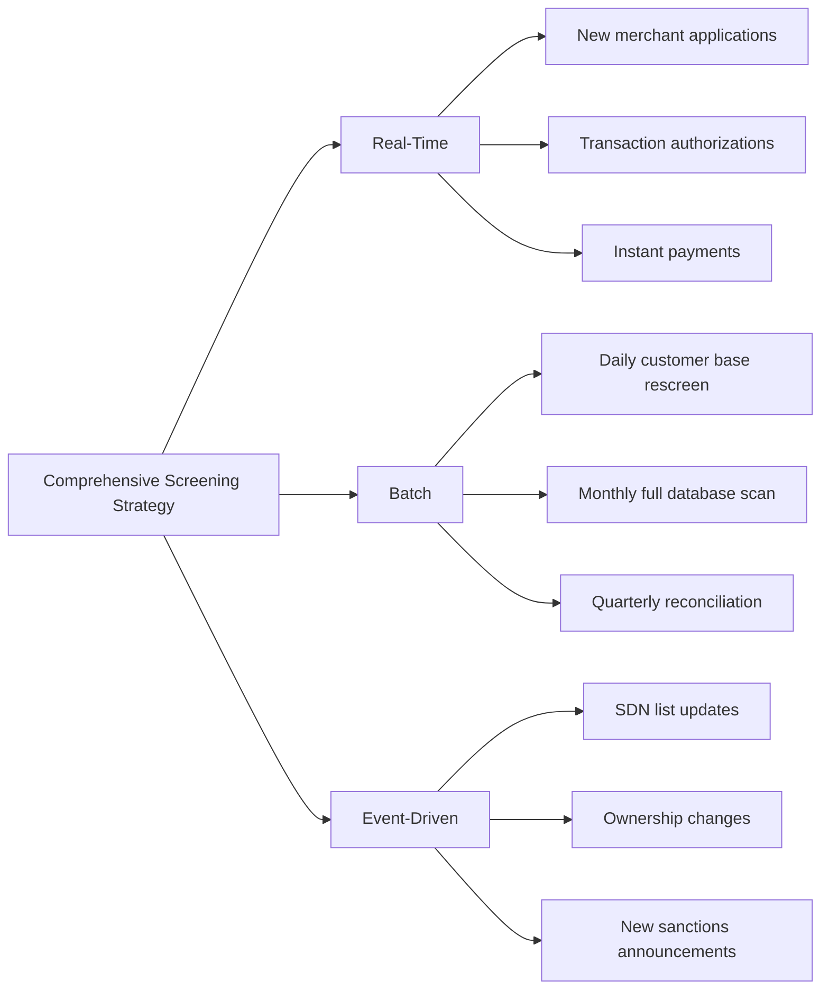
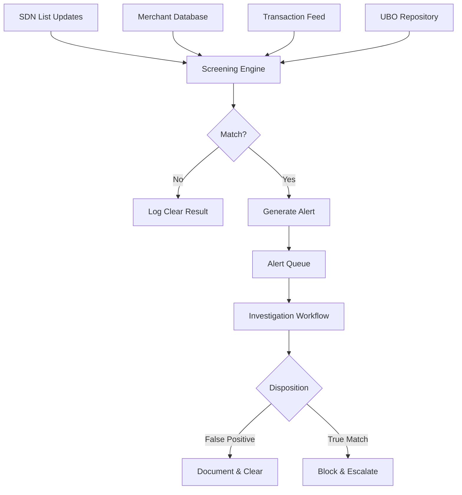

# Screening Operations

> **Last Updated:** 2025-12-28
> **Status:** Complete

This page covers operational aspects of sanctions screening including real-time processing, batch operations, and ongoing monitoring.

## Real-Time vs. Batch Screening

### Real-Time Screening (Regulatory Expectation)

**Required For:**
- Card payment authorizations
- Instant payment systems (FedNow, RTP)
- High-risk transactions
- Merchant onboarding approvals

**EU Instant Payments Regulation (IPR):**
Effective **January 2025**, EU financial institutions must screen instant payments in **milliseconds** (sub-second processing). This is now the global standard expectation.

**Performance Requirements:**
- **Card authorizations:** 2-3 seconds total (screening must be &lt;1 second)
- **Instant payments:** &lt;10 seconds total (screening &lt;1-2 seconds)
- **Merchant onboarding:** Real-time during application flow

**Technical Considerations:**
- In-memory screening databases
- Local caching of sanctions lists
- Optimized fuzzy matching algorithms
- Distributed screening architecture
- Failover and redundancy

### Batch Screening (Supplemental Only)

**Appropriate Use Cases:**
- Insurance payments (non-immediate)
- Periodic customer database rescreening
- Historical transaction review
- Large-scale list update processing

**Limitations:**
- Creates gaps between real-time and batch updates
- Delayed detection of new sanctions
- Not acceptable as sole screening method

**OFAC Expectation:** Batch screening as **supplement only**, not replacement for real-time.

### Recommended: Hybrid Approach

**Best Practice:**
1. **Real-time:** All transactions and onboarding decisions
2. **Daily batch:** Full customer database against updated SDN list
3. **Event-triggered:** Ownership changes, major sanctions announcements
4. **Periodic batch:** Monthly/quarterly full rescreening (supplemental verification)

## Ongoing Monitoring

### Why One-Time Screening is Insufficient

**SDN List Dynamics:**
- Updates published multiple times per week
- Often daily or even hourly updates
- Emergency updates for breaking events
- Individuals/entities added without prior notice

**Merchant Changes:**
- Ownership can change after onboarding
- New beneficial owners may be sanctioned
- Corporate restructuring may create new exposure
- Existing customers may be added to SDN list

**Compliance Expectation:**
One-time screening at onboarding is **not sufficient**. Ongoing monitoring is required.

### Case Study: OFAC Finding of Violation

:::danger Real-World Enforcement Action
**Situation:** A bank believed its third-party vendor was screening the entire customer base **daily** against SDN updates.

**Reality:** The vendor only conducted full database screening **monthly**.

**Result:** A 14-day gap occurred after an individual was added to the SDN list.

**Outcome:** OFAC issued a **Finding of Violation** for failure to block transactions during the gap period.

**Lesson:** Verify vendor screening frequency. Document processes. Don't assume vendor capabilities.
:::

### Recommended Monitoring Frequency

| Screening Type | Frequency | Purpose |
|---------------|-----------|---------|
| **Real-time transaction screening** | Every transaction | Geographic risk, sanctions evasion detection |
| **Customer database screening** | Daily | Catch new SDN additions immediately |
| **Event-triggered screening** | Immediately upon event | Ownership changes, sanctions announcements |
| **Full database rescreen** | Monthly or quarterly | Supplemental verification, audit trail |

### Event-Triggered Scenarios

- Change in beneficial ownership
- Change in control persons or officers
- Corporate merger or acquisition
- Major OFAC sanctions announcement (e.g., new country program)
- Merchant moves to high-risk jurisdiction

## Automated Monitoring Systems

### Capabilities to Look For

- Automatic SDN list updates (multiple times daily)
- Triggered rescreening upon list updates
- Alert generation for new matches
- Workflow for match investigation
- Audit trail of all screening activity

### Integration Requirements

- Connection to merchant database
- Real-time transaction feed (for transaction monitoring)
- UBO data repository
- Ownership change notification system

### System Architecture

## Record Retention Requirements

:::warning NEW REQUIREMENT (Effective March 21, 2025)
OFAC record retention period **extended from 5 to 10 YEARS** for all transactions, blocked property, and rejected transactions.
:::

### What Must Be Retained

**All Screening Results:**
- Positive matches (true and false positives)
- Negative results (no match)
- Match scores and algorithm details
- Manual review decisions
- Exclusion justifications

**Transaction Records:**
- Wire transfers
- Card payments (authorizations and settlements)
- Securities trades
- Any payment involving screened parties

**Compliance Documentation:**
- Internal risk assessments
- Sanctions compliance policies
- Training records
- Audit reports
- Vendor due diligence

### Retention Timeline Details

**Standard Records:** 10 years from date of transaction

**Blocked Property:** 10 years **AFTER** property is unblocked
- If property never unblocked: **indefinite retention**
- If released by OFAC license: 10 years from release date

**Practical Implication:**
Some records may need to be retained **indefinitely** if sanctions are never lifted or property never released.

### Record Accessibility Requirements

Records must be:
- **Organized** and easily retrievable
- **Searchable** by transaction, merchant, date, etc.
- **Complete** (all supporting documentation)
- **Secure** (protected from unauthorized access/modification)
- **Available for OFAC inspection** upon request

## Related Topics

- [Sanctions Screening Overview](../sanctions-screening.md) - Core concepts
- [True Match Procedures](./true-match) - When you find a real match
- [PayFac Implementation](./payfac-implementation) - Sponsor bank requirements
