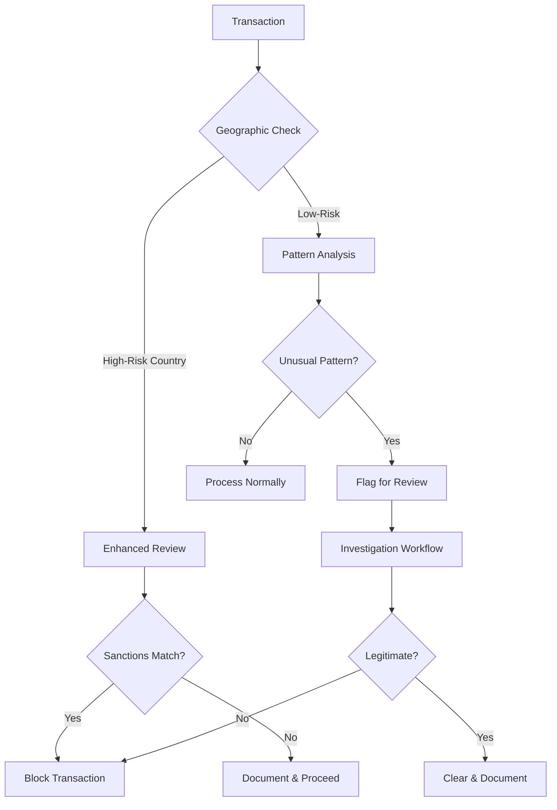

# PayFac Sanctions Implementation

> **Last Updated:** 2025-12-28
> **Status:** Complete

This page covers PayFac-specific implementation considerations for sanctions screening.

## Sponsor Bank Requirements

Your sponsor bank will impose sanctions screening requirements as part of the partnership agreement.

### Standard Requirements

- Sanctions screening of all merchants before onboarding
- UBO screening (all beneficial owners)
- Ongoing monitoring of merchant base
- Immediate reporting of true matches
- Periodic attestations of compliance
- Right to audit your screening processes

### Card Network Rules References

**Mastercard Rules:**
- **Rule 1.2:** Payment facilitator eligibility requirements
- **Rule 7.6.5:** Payment facilitator compliance obligations

**Visa Requirements:**
Similar obligations under Visa Payment Facilitator program rules.

## Escalation to Sponsor Bank

:::info When to Escalate
**Immediate escalation required:**
- True match to SDN list
- Potential match with unclear determination
- Geographic transaction patterns suggesting sanctions evasion
- Merchant requests to process for high-risk jurisdictions
- Any uncertainty about sanctions compliance
:::

### Escalation Process

1. Document the issue thoroughly
2. Notify designated sponsor bank contact
3. Provide all screening evidence
4. Await sponsor bank guidance before proceeding
5. Document sponsor bank response
6. Implement directed actions

### Why This Matters

- Sponsor bank has ultimate liability for PayFac transactions
- Facilitating payment for sanctioned party = strict liability for sponsor bank
- Even domestic transactions to sanctioned parties are prohibited
- Sponsor bank may terminate PayFac relationship for violations

## Domestic Transactions Are NOT Exempt

### Common Misconception

"We only process domestic U.S. transactions, so sanctions don't apply."

### Reality

OFAC sanctions apply to:
- U.S. persons (individuals and entities)
- Transactions involving U.S. jurisdiction
- **Including purely domestic transactions**

### Example Violation

- U.S. merchant processes payment for U.S. customer
- Customer is on SDN list
- Transaction is **prohibited** even though both parties are domestic
- PayFac and sponsor bank can both face penalties

### Key Point

Sanctions screening is required regardless of:
- Transaction geography
- Merchant location
- Customer location
- Payment method
- Transaction amount

## Sub-Merchant Transaction Monitoring

Beyond onboarding screening, monitor transactions for suspicious patterns.

### Geographic Red Flags

- Transactions originating from sanctioned countries
- IP addresses from high-risk jurisdictions
- Shipping addresses to prohibited regions
- Customer billing addresses in sanctioned territories

### Pattern Red Flags

- Unusual transaction volumes to/from high-risk countries
- Multiple small transactions to avoid detection
- Rapid changes in transaction geography
- Merchant business model inconsistent with transaction patterns

### Recommended Approach

### Implementation Recommendations

1. **Real-time geographic screening** of all transactions
2. **Automated alerts** for high-risk jurisdictions
3. **Investigation workflow** for flagged transactions
4. **Merchant communication** and remediation process

## Compliance Program Elements

### Required Components

1. **Written Policies & Procedures**
   - Sanctions screening methodology
   - Match review process
   - Escalation procedures
   - Documentation requirements

2. **Risk Assessment**
   - Annual sanctions risk assessment
   - Merchant portfolio analysis
   - Geographic risk evaluation
   - Product/service risk review

3. **Training**
   - Annual sanctions training for all staff
   - Specialized training for compliance team
   - Documentation of training completion

4. **Independent Testing**
   - Annual independent audit
   - Testing of screening effectiveness
   - Sample transaction review
   - Report to sponsor bank

5. **Designated Compliance Officer**
   - Named individual with sanctions responsibility
   - Authority to block transactions
   - Direct reporting to senior management

## Documentation Requirements

### For Every Screening Decision

- Date/time of screening
- Parties screened (names, aliases)
- Lists checked
- Match results (including scores)
- Disposition decision
- Reviewer (if manual)
- Supporting documentation

### For True Matches

- All standard documentation plus:
- OFAC notifications
- SAR filings
- Sponsor bank communications
- Blocked property reports
- Legal consultations

### Retention Period

**10 years** (as of March 21, 2025)

## Related Topics

- [Sanctions Screening Overview](../sanctions-screening.md) - Core concepts
- [True Match Procedures](./true-match.md) - When you find a match
- [Operations](./operations.md) - Screening frequency and processes
- [Enforcement Actions](./enforcement.md) - Recent OFAC cases
