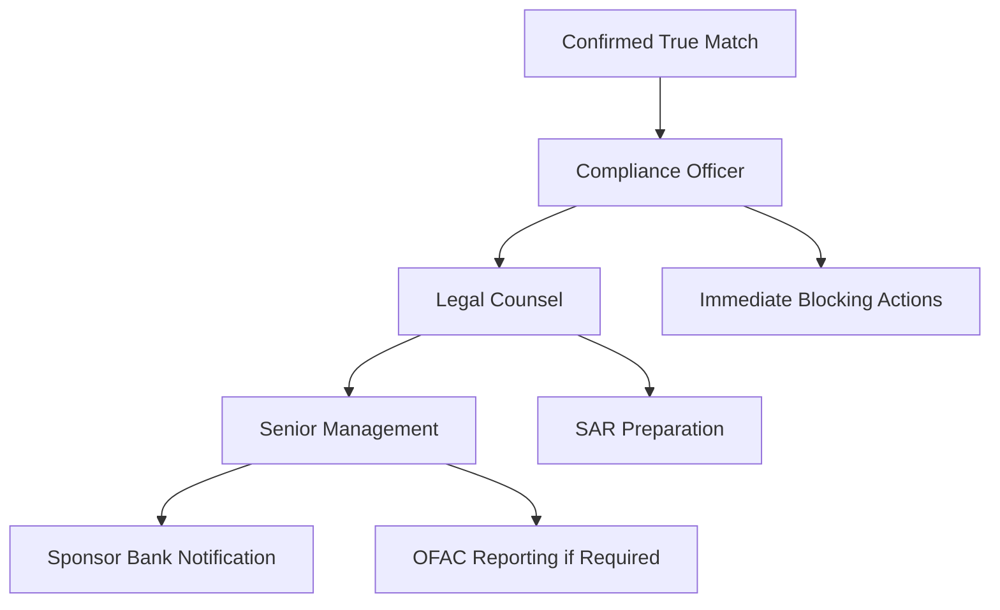

# True Match Procedures

> **Last Updated:** 2025-12-28
> **Status:** Complete

This page covers the required actions when a confirmed sanctions match (true positive) is identified.

## Immediate Actions Required

When you confirm a **true match** to the SDN list or other sanctions list:

:::danger Immediate Actions Required

**1. DO NOT Onboard** (if during application process)
- Immediately reject the application
- Do not grant system access
- Do not process any transactions

**2. Block Immediately** (if existing merchant)
- Suspend merchant account access
- Block all pending transactions
- Reject all future transaction attempts
- Freeze any funds held (consult legal counsel)

**3. DO NOT Tip Off** (Legal Requirement)
- Do not inform the merchant why they are blocked
- Do not mention sanctions or SDN list
- Use generic rejection language ("unable to approve at this time")
- Violation of "tipping off" prohibition can result in penalties

**4. File SAR if Required**
- Suspicious Activity Report to FinCEN
- Required for certain sanctions violations
- Consult compliance team/legal counsel
- File within required timeframe (typically 30 days)

**5. Notify Sponsor Bank**
- Immediate notification per partnership agreement
- Provide full details of match
- Coordinate on remediation steps
- Document all communications

**6. Block Property/Assets**
- If merchant has funds held (reserves, pending settlements)
- Must be blocked and reported to OFAC
- Cannot be released without OFAC authorization
- Consult legal counsel immediately

**7. Document Everything**
- Screening results showing match
- Analysis supporting true positive determination
- Date/time of discovery
- Actions taken
- Notifications sent
- Legal/compliance consultations

:::

## Rejection Communication

When communicating with a sanctioned party (or suspected sanctioned party), you must use carefully crafted language that does not reveal the sanctions status.

### DO Say

- "We are unable to approve your application at this time."
- "Your application does not meet our underwriting criteria."
- "We cannot provide merchant services to your business."

### DO NOT Say

- "You are on the SDN list."
- "You match a sanctions list."
- "OFAC prohibits us from working with you."
- Any mention of sanctions, watchlists, or specific reasons

### Sample Rejection Letter

```
Dear [Applicant Name],

Thank you for your interest in [PayFac Name] payment services.

After careful review, we are unable to approve your application at this time.
This decision is based on our internal risk assessment and underwriting criteria.

We appreciate your understanding.

Sincerely,
[PayFac Name] Underwriting Team
```

## Blocked Property Reporting

If you are holding funds for a sanctioned merchant:

### Required Actions

1. **Block the funds** immediately (do not release)
2. **Report to OFAC** within 10 business days using Form TD F 90-22.50
3. **File annual reports** on blocked property (by September 30 each year)
4. **Maintain detailed records** of blocked property
5. **Do NOT release** without OFAC authorization (even if merchant demands funds)

### OFAC Blocked Property Contact

- Office of Foreign Assets Control
- U.S. Department of the Treasury
- Email: ofac.compliance@treasury.gov
- Hotline: 1-800-540-6322

### Blocked Property Report Contents

- Date of blocking
- Description of property (funds amount)
- SDN entry matched
- Merchant/party information
- Basis for determination
- Actions taken

## SAR Filing

### When to File

- Confirmed sanctions match
- Suspected sanctions evasion
- Unusual patterns suggesting sanctions circumvention
- Any transaction involving blocked property

### SAR Timeline

- **File within 30 days** of detection
- **Do NOT notify** the subject
- **Retain records** for 10 years

### SAR Contents for Sanctions Violations

- Description of sanctions match
- SDN list entry matched
- Transaction details (if applicable)
- Blocked property amounts
- Actions taken by institution
- Supporting documentation

## Escalation Process

### Internal Escalation Path



### Sponsor Bank Notification

**Immediate notification required for:**
- Any confirmed SDN match
- Any blocked property
- Any SAR filing related to sanctions

**Information to Provide:**
- Merchant identification
- SDN entry matched
- Date/time of discovery
- Actions taken
- Funds blocked (if any)
- Proposed remediation steps

## Post-Incident Actions

### Immediate (Within 24 Hours)

- [ ] Account blocked
- [ ] Transactions rejected
- [ ] Funds frozen
- [ ] Sponsor bank notified
- [ ] Legal counsel consulted
- [ ] Documentation completed

### Short-Term (Within 10 Days)

- [ ] OFAC blocked property report filed (if applicable)
- [ ] SAR filed (if required)
- [ ] Internal incident report completed
- [ ] Root cause analysis initiated

### Long-Term (Ongoing)

- [ ] Monitor for related parties
- [ ] Maintain blocked property records
- [ ] File annual blocked property reports
- [ ] Retain records for 10+ years

## Related Topics

- [Sanctions Screening Overview](../sanctions-screening.md) - Core concepts
- [False Positives](./false-positives.md) - Ensuring accurate matches
- [PayFac Implementation](./payfac-implementation.md) - Sponsor bank requirements
- [Enforcement Actions](./enforcement.md) - Recent OFAC cases
