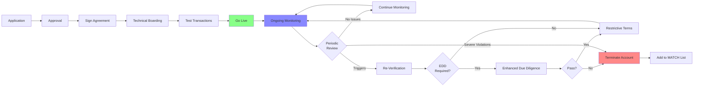

# Merchant Lifecycle

> **Last Updated:** 2025-12-28
> **Status:** Complete

## Overview

Merchant onboarding doesn't end at approval. The merchant lifecycle includes legal agreements, ongoing monitoring, periodic re-verification, and enhanced due diligence when risk indicators surface. This section covers post-approval merchant management.

## What You'll Learn

- **Merchant Agreements** - Merchant Processing Agreement (MPA), reserves, rolling reserves, and MATCH list
- **Ongoing Monitoring** - Transaction monitoring, re-verification triggers, and enhanced due diligence (EDD)

## Why Lifecycle Management Matters

Merchants change over time:

- **Business Model Evolution** - What starts as low-risk may become high-risk
- **Volume Growth** - Rapid scaling introduces new risks
- **Ownership Changes** - New principals may have different risk profiles
- **Performance Degradation** - Chargebacks and fraud can spike unexpectedly

Effective lifecycle management:

- Detects changes before they become problems
- Ensures ongoing compliance with regulations
- Protects sponsor bank relationship
- Maintains portfolio quality

## Lifecycle Stages

## Topics Covered

### Merchant Agreements

The legal foundation of the merchant relationship:

- **Merchant Processing Agreement (MPA)** - Core contract terms
- **Reserves** - Risk mitigation through fund holds
- **Rolling Reserves** - Percentage-based ongoing holds
- **MATCH List** - Terminated Merchant File and reporting obligations

### Ongoing Monitoring

Continuous oversight of merchant activity:

- **Transaction Monitoring** - Real-time and batch analysis
- **Re-Verification Triggers** - When to request updated information
- **Enhanced Due Diligence** - Deep investigation for elevated risk
- **Performance Reviews** - Periodic assessment of merchant health

## Key Concepts

### Merchant Processing Agreement (MPA)

The contract that governs the merchant relationship, including:

- Processing fees and pricing
- Chargeback liability
- Reserve requirements
- Termination conditions
- Indemnification clauses
- Data security obligations

### Reserves

Funds held by the acquirer/PayFac to cover potential chargebacks and losses:

- **Upfront Reserve** - One-time holdback at onboarding
- **Rolling Reserve** - Ongoing percentage hold (e.g., 10% for 180 days)
- **Minimum Reserve** - Floor amount regardless of volume
- **Reserve Release** - Conditions and timeline for returning funds

### MATCH List

The Member Alert to Control High-Risk Merchants (MATCH), formerly Terminated Merchant File (TMF):

- Shared database of terminated merchants
- Reason codes for termination
- 5-year retention period
- Inquiry and reporting obligations

### Ongoing Monitoring Triggers

Events that warrant re-verification or EDD:

- Chargeback ratio exceeds thresholds
- Fraud alerts or suspicious transactions
- Volume spikes beyond projections
- Customer complaints increase
- Ownership or business model changes
- Sanctions list additions

## Common Challenges

### Balancing Trust and Oversight

**The Dilemma:** Merchants resent excessive monitoring; inadequate monitoring creates risk

**The Approach:** Risk-based monitoring intensity

### Reserve Management

**The Challenge:** Reserves protect against losses but hurt merchant cash flow

**The Solution:** Calibrate reserve levels to actual risk, release promptly when safe

### MATCH List Reporting

**The Tension:** Over-reporting harms merchants unfairly; under-reporting violates network rules

**The Standard:** Report only when required by reason codes, document thoroughly

## Topics in This Section

| Topic | Description | Status |
|-------|-------------|--------|
| [Merchant Agreements](./merchant-agreements.md) | MPA terms, reserves, liability, and termination | Complete |
| [Ongoing Monitoring](./ongoing-monitoring.md) | Transaction monitoring, KYC refresh, EDD, and re-underwriting | Complete |
| [Quiz](./quiz.md) | Self-assessment with 5 questions covering all topics | Complete |

## Self-Assessment

Test your understanding with the [Merchant Lifecycle Quiz](./quiz.md):

- **Question 28:** KYC/KYB re-verification frequency and triggers
- **Question 29:** Address change verification procedures
- **Question 30:** Chargeback ratio re-underwriting process
- **Question 31:** Enhanced Due Diligence (EDD) triggers (10 specific scenarios)
- **Question 32:** Business model change risk assessment scenario

---

> **Next:** Start with [Merchant Agreements](./merchant-agreements.md) or jump directly to [Ongoing Monitoring](./ongoing-monitoring.md).
