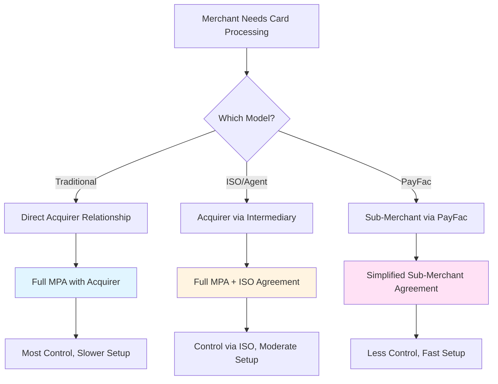
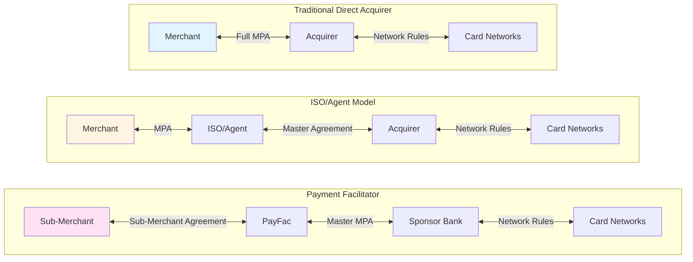
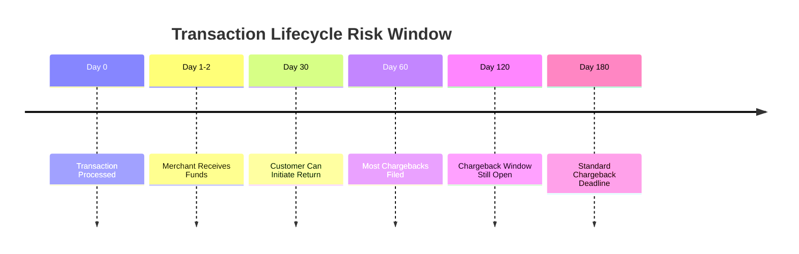
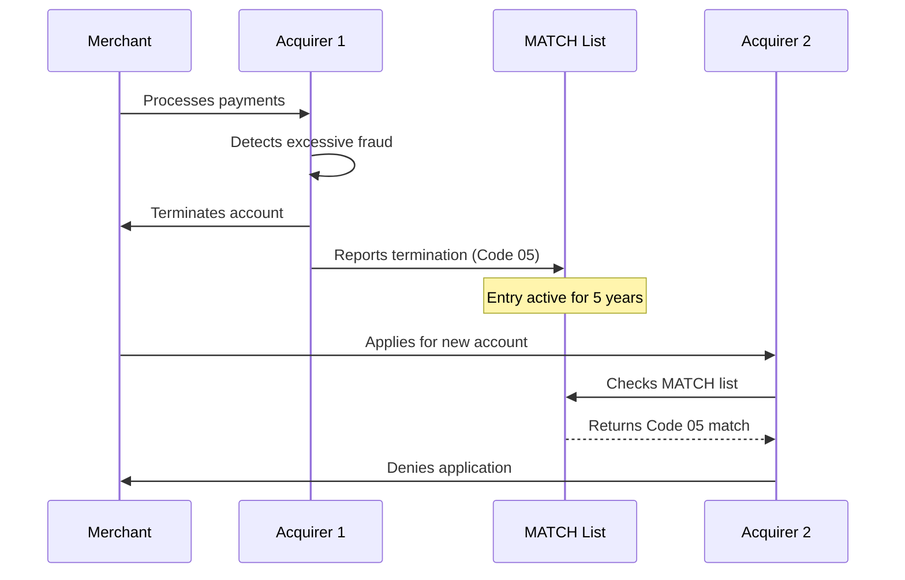
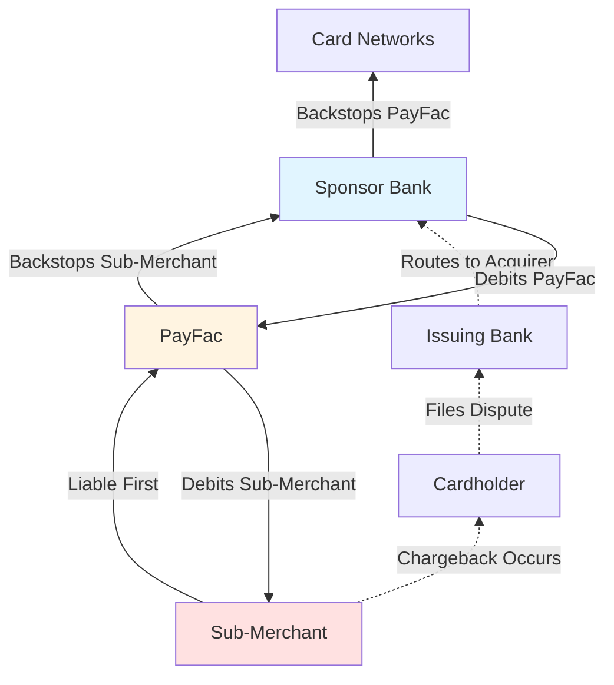

# Merchant Agreements & Reserves

> **Last Updated:** 2025-12-27
> **Status:** Complete

## Quick Reference

**Key Facts:**

- MPA (Merchant Processing Agreement) is the legal contract governing payment processing
- Traditional MPAs average 3-year terms with 90-day non-renewal notice
- Reserves protect acquirers from chargebacks, returns, and fraud losses
- MATCH list tracks terminated merchants for 5 years across 14 reason codes
- Sub-merchant agreements are simpler but provide less control than traditional MPAs

**Critical Numbers:**

- Standard reserve: 0-5% for 90 days
- High-risk reserve: 10-15% for 180 days
- Chargeback MATCH threshold: \>1% ratio AND \>$5,000 total
- Sub-merchant conversion threshold: $1M annual volume (US)

**Time-Sensitive Updates:**

- Code 06 changed from "Reserved" to "Coercion" (February 2025)
- California SB 478 prohibits separate surcharges (July 2024)
- Visa VAMP enforcement began October 2025

## Overview

When a business wants to accept card payments, they must enter into a contractual relationship with an acquirer (acquiring bank or payment processor). This relationship is governed by a **Merchant Processing Agreement (MPA)**, which defines:

- Payment processing services provided
- Fee structures and pricing
- Risk mitigation mechanisms (reserves)
- Compliance obligations
- Liability allocation
- Termination conditions

The structure and complexity of these agreements vary significantly based on the processing model:



Understanding these agreements is critical because they:

1. **Define financial risk exposure** (who pays when things go wrong)
2. **Impact cash flow** (reserves lock up merchant funds)
3. **Affect business continuity** (termination can be immediate)
4. **Determine operational flexibility** (contract terms vary widely)

## Merchant Processing Agreement (MPA)

### What is an MPA?

The **Merchant Processing Agreement** is a legally binding contract between a merchant and an acquirer that authorizes the merchant to accept card payments and defines the terms of that relationship.

**Key Components:**

- **Services Scope:** Card brands accepted (Visa, Mastercard, Amex, Discover)
- **Pricing Schedule:** Interchange-plus, flat rate, tiered pricing
- **Fees Disclosure:** Transaction fees, monthly fees, chargeback fees, ETFs
- **Processing Limits:** Monthly volume caps, average ticket limits
- **Reserves:** Amount, type, release conditions
- **Compliance Requirements:** PCI DSS, card network rules, KYC obligations
- **Liability Terms:** Fraud liability, data breach indemnification
- **Termination Clauses:** Notice periods, early termination fees, windup procedures

:::info Legal Structure
An MPA is typically structured as a "terms of service" agreement where the merchant agrees to abide by:

1. Acquirer's terms and conditions
2. Card network operating regulations (by reference)
3. Applicable laws and regulations (PCI DSS, AML, sanctions)

Merchants rarely negotiate terms in standard MPAs unless processing significant volume (\>$5M annually).
:::

### Standard Contract Terms

#### Contract Duration and Renewal

**Typical Structure:**

- **Initial Term:** 3 years (36 months)
- **Auto-Renewal:** Automatic renewal for successive 1-year terms
- **Non-Renewal Notice:** 90 days written notice required to prevent renewal
- **Early Termination Fee (ETF):** ~$495 (varies by processor)

**Example Timeline:**

```
Month 0: Sign MPA
Month 1-33: Active processing, can terminate with 90-day notice + ETF
Month 33: Non-renewal notice deadline (to avoid auto-renewal)
Month 36: Contract expires if notice given, otherwise renews for Year 4
```

:::warning Contract Lock-In
Many merchants miss the 90-day non-renewal window and are automatically locked into another year. Set calendar reminders at Month 30 to evaluate your options.
:::

#### Fee Structures

MPAs typically use one of three pricing models:

**1. Interchange-Plus (Most Transparent)**

- **Structure:** Interchange + Network Fees + Processor Markup
- **Example:** Interchange + 0.20% + $0.10
- **Best For:** Merchants processing \>$100K/month

**2. Flat Rate (Simplest)**

- **Structure:** Single percentage per transaction
- **Example:** 2.9% + $0.30 per transaction
- **Best For:** Small merchants, low volume, variable ticket sizes

**3. Tiered Pricing (Least Transparent)**

- **Structure:** Qualified, Mid-Qualified, Non-Qualified rates
- **Example:** 1.79% (qualified), 2.49% (mid), 3.49% (non)
- **Best For:** Processors (not merchants - avoid if possible)

**Additional Fees Commonly Included:**

- Monthly account fee: $10-$30
- PCI compliance fee: $5-$15/month
- Chargeback fee: $15-$25 per chargeback
- AVS/CVV validation: $0.05-$0.10
- Batch settlement fee: $0.10-$0.25
- Statement fee: $10-$15
- Early termination fee: $495 (if leaving before contract end)

#### Termination Rights

**Merchant-Initiated Termination:**

- **Standard:** 30 days written notice
- **Financial Obligation:** Pay ETF if within initial term
- **Reserve Impact:** Reserves typically held for 6-12 months post-termination

**Acquirer-Initiated Termination:**

- **With Cause:** Immediate termination (breach of contract, excessive fraud)
- **Without Cause:** Can terminate for any reason per contract terms
- **Reserve Impact:** May extend reserve hold period indefinitely

**Common Termination Triggers:**

- Chargeback ratio exceeds thresholds (\>1% is common trigger)
- Fraud losses exceed acceptable levels
- Volume dramatically exceeds underwritten limits
- Failure to maintain PCI compliance
- Business model change without approval
- Filing for bankruptcy
- MATCH list addition by another acquirer

:::danger Acquirer Termination Rights
Acquirers typically reserve the right to terminate immediately "with or without cause" while merchants must provide 30-90 days notice. This asymmetry is standard across the industry but creates significant business risk for merchants.
:::

### Processing Model Differences

The type of relationship significantly affects the merchant experience:



**Traditional Direct Acquirer:**

- **Setup Time:** 2-4 weeks
- **Underwriting:** Comprehensive bank underwriting
- **Fees:** Lowest (direct pricing)
- **Control:** Full account control
- **Support:** Direct acquirer relationship
- **Best For:** Established businesses, high volume

**ISO/Agent Model:**

- **Setup Time:** 1-3 weeks
- **Underwriting:** ISO submits to acquirer
- **Fees:** Mid-range (ISO adds markup)
- **Control:** Full account, serviced by ISO
- **Support:** ISO provides primary support
- **Best For:** Businesses needing local support, moderate volume

**PayFac Model:**

- **Setup Time:** Minutes to 2 days
- **Underwriting:** PayFac performs initial underwriting
- **Fees:** Highest (PayFac + acquirer markup)
- **Control:** Limited (PayFac controls account)
- **Support:** PayFac provides all support
- **Best For:** Startups, platforms, low initial volume

## Reserves

Reserves are funds held by the acquirer to cover potential losses from chargebacks, returns, fraud, or merchant insolvency. Think of reserves as a security deposit that protects the acquirer's financial exposure.

### Why Reserves Exist

When a merchant processes a transaction, settlement typically occurs within 1-2 days, but chargebacks can occur up to 180 days later (or longer for certain transaction types). This creates a timing gap:



If the merchant has already been paid but later goes out of business or disappears, the acquirer is liable for chargebacks. Reserves mitigate this risk.

### Types of Reserves

#### 1. Rolling Reserve

**Structure:** A percentage of each transaction is withheld and held for a specified period before release.

**Common Parameters:**

- **Withhold Rate:** 5-20% (most common: 5-10%)
- **Hold Period:** 30-180 days (most common: 180 days)
- **Release:** Automatic on a rolling basis

**Example Calculation:**

```
Merchant Processing Volume: $100,000/month
Rolling Reserve: 10% for 180 days

Month 1:
- Process: $100,000
- Withhold: $10,000 (held until Month 7)
- Merchant Receives: $90,000

Month 7:
- Process: $100,000
- Withhold: $10,000 (held until Month 13)
- Release Month 1 Reserve: $10,000
- Merchant Receives: $100,000 ($90K current + $10K release)

Steady State (Month 7+):
- Total Reserve Balance: $60,000 (6 months × $10K)
- Monthly Cash Flow: Normal (releases = new withholdings)
```

**Impact on Cash Flow:**

- **Startup Impact:** Significant (building up reserve for first 6 months)
- **Steady State:** Minimal (releases balance new withholdings)
- **Shutdown:** Reserves held for 6-12 months after closure

**Best For:**

- Merchants with consistent monthly volume
- Businesses with predictable chargeback patterns
- Moderate to high-risk categories

#### 2. Fixed/Upfront Reserve

**Structure:** A lump sum deposited upfront and held throughout the processing relationship.

**Common Parameters:**

- **Amount:** $5,000 - $50,000+ (based on projected risk)
- **Calculation:** 50-100% of estimated monthly volume
- **Release:** After account closure + chargeback window (6-12 months)

**Example:**

```
High-Risk Travel Merchant:
- Expected Monthly Volume: $50,000
- Fixed Reserve Required: $50,000 (100% of monthly volume)
- Due: Before processing begins

Scenario:
- Merchant deposits: $50,000 (from business capital)
- Begins processing immediately
- Reserve earns no interest (typically)
- Released 12 months after account closes
```

**Impact on Cash Flow:**

- **Startup Impact:** Severe (requires significant capital upfront)
- **Ongoing Impact:** None (doesn't grow with volume)
- **Shutdown:** Long wait for return

**Best For:**

- High-risk merchants (travel, nutraceuticals, adult)
- Merchants with poor credit history
- New merchants in risky verticals

:::warning Capital Requirements
Fixed reserves can be a significant barrier to entry for small businesses. A $50,000 upfront reserve is prohibitive for most startups. Some acquirers offer phased reserve builds (50% upfront, 50% over first 6 months).
:::

#### 3. Capped Reserve

**Structure:** A percentage is withheld until a maximum cap is reached, then withholding stops.

**Common Parameters:**

- **Withhold Rate:** 5-15%
- **Cap Amount:** Based on risk assessment
- **Release:** After account closure or when cap is reached

**Example:**

```
Merchant Processing Volume: $100,000/month
Capped Reserve: 10% up to $30,000 cap

Month 1: Withhold $10,000 → Reserve Balance: $10,000
Month 2: Withhold $10,000 → Reserve Balance: $20,000
Month 3: Withhold $10,000 → Reserve Balance: $30,000 (cap reached)
Month 4+: Withhold $0 → Reserve Balance: $30,000 (stable)

Cash Flow Impact:
- Months 1-3: Reduced by 10%
- Month 4+: Normal cash flow
```

**Best For:**

- Growing businesses (predictable endpoint)
- Merchants negotiating better terms over time
- Moderate-risk categories

#### 4. ACH Reserve

**Structure:** Specific to ACH processing, holding 20% for 60 days to cover ACH return window.

**Common Parameters:**

- **Withhold Rate:** 20% (industry standard)
- **Hold Period:** 60 days (ACH return window)
- **Release:** Rolling after 60 days

**Why Different?**
ACH transactions can be returned up to 60 days after processing (vs. 1-2 days for card transactions). Common return codes include insufficient funds, account closed, unauthorized transaction.

**Example:**

```
ACH Processing Volume: $50,000/month
ACH Reserve: 20% for 60 days

Month 1:
- Process: $50,000
- Withhold: $10,000 (held until Month 3)
- Merchant Receives: $40,000

Month 3:
- Process: $50,000
- Withhold: $10,000 (held until Month 5)
- Release Month 1 Reserve: $10,000
- Merchant Receives: $50,000 ($40K current + $10K release)

Steady State (Month 3+):
- Total Reserve Balance: $20,000 (2 months × $10K)
```

### Risk-Based Reserve Percentages

Reserve requirements scale with merchant risk profile:

| Risk Level | Reserve % | Hold Period | Examples | Reasoning |
|------------|-----------|-------------|----------|-----------|
| **Standard** | 0-5% | 90 days | Retail stores, restaurants, professional services | Low fraud, low chargeback risk |
| **Moderate** | 5-10% | 90-180 days | Subscriptions, SaaS, digital goods, B2B services | Moderate chargeback risk, future delivery |
| **High** | 10-15% | 180 days | Travel, event tickets, nutraceuticals, credit repair | High chargeback risk, long delivery windows |
| **Extreme** | Up to 100% | 180-365+ days | Adult content, crypto, gambling, MATCH-listed merchants | Very high fraud/chargeback risk, regulatory concerns |

**Risk Factors Affecting Reserve Levels:**

- **Chargeback History:** Previous chargeback ratios >0.5% increase reserves
- **Industry Vertical:** High-risk industries always have higher reserves
- **Business Age:** Startups often face higher reserves than established businesses
- **Credit Score:** Business and principal credit affects reserve terms
- **Processing History:** No history = higher reserves
- **Delivery Timeline:** Longer fulfillment = higher reserves (travel, subscriptions)
- **MATCH List Presence:** Any MATCH listing triggers highest reserves

### Reserve Calculation Examples

**Example 1: Standard Risk Retail Merchant**

```
Business: Local coffee shop
Monthly Volume: $50,000
Reserve Terms: 5% for 90 days

Month 1: Process $50,000 → Withhold $2,500 → Receive $47,500
Month 2: Process $50,000 → Withhold $2,500 → Receive $47,500
Month 3: Process $50,000 → Withhold $2,500 → Receive $47,500
Month 4: Process $50,000 → Withhold $2,500 → Release $2,500 → Receive $50,000

Steady-State Reserve Balance: $7,500 (3 months × $2,500)
Annual Cash Flow Impact: $7,500 tied up (15% of one month's volume)
```

**Example 2: High-Risk Subscription Business**

```
Business: Online nutraceutical supplements (monthly subscription)
Monthly Volume: $200,000
Reserve Terms: 15% for 180 days

Month 1: Process $200,000 → Withhold $30,000 → Receive $170,000
Months 2-6: Build reserve to $180,000 (6 months × $30,000)
Month 7+: Process $200,000 → Withhold $30,000 → Release $30,000 → Receive $200,000

Steady-State Reserve Balance: $180,000 (6 months × $30,000)
Annual Cash Flow Impact: $180,000 tied up (90% of one month's volume)
```

**Example 3: Travel Agency (Fixed + Rolling Reserve)**

```
Business: Online travel booking platform
Monthly Volume: $500,000
Reserve Terms: $100,000 fixed + 10% rolling for 180 days

Upfront: Deposit $100,000 fixed reserve
Month 1-6: Build rolling reserve to $300,000 (6 months × $50,000)
Steady State: Total reserves = $400,000

Cash Flow Impact:
- Initial: $100,000 upfront capital required
- Months 1-6: Reduced cash flow while building rolling reserve
- Month 7+: Normal cash flow ($50K withheld = $50K released)
- Shutdown: Wait 12 months to recover $400,000 reserve
```

### Release Conditions

Reserves are released when:

1. **Rolling Schedule:** Automatic release on rolling basis (e.g., Month 7 releases Month 1 withholdings)
2. **Cap Reached:** Withholding stops once capped reserve is fully funded
3. **Account Closure:** Held for 6-12 months after final transaction (covers chargeback window)
4. **Risk Reduction:** Renegotiation after proving lower risk (6-12 months clean processing history)
5. **Volume Threshold:** Some PayFacs release reserves after merchant processes certain volume ($100K+)

**Post-Termination Hold Periods:**

- **Low Risk:** 6 months
- **Moderate Risk:** 9 months
- **High Risk:** 12-18 months
- **MATCH Listed:** 18-24 months or indefinite pending resolution

:::tip Negotiating Reserves
After 6-12 months of clean processing (low chargebacks, no fraud), merchants can request reserve reductions. Document your clean history:

- Monthly chargeback reports showing \<0.5% ratio
- Fraud monitoring reports showing low fraud rates
- PCI compliance certificates
- Volume growth demonstrating stable business

Present this to your processor with a formal request to reduce or eliminate reserves.
:::

## MATCH List

The **Member Alert to Control High-Risk Merchants (MATCH)** list is a database maintained by Mastercard that tracks merchants terminated by acquirers for fraud, excessive chargebacks, or other violations. Despite being a Mastercard system, it's used industry-wide by all card brands.

:::danger Critical Impact
Being added to the MATCH list (also called TMF - Terminated Merchant File) effectively blacklists a business from accepting card payments for 5 years. It's extremely difficult to remove entries, and most acquirers automatically deny applications from MATCH-listed merchants.
:::

### What is the MATCH List?

**Purpose:**

- Alert acquirers to high-risk merchants before onboarding
- Prevent merchant "fraud shopping" (switching acquirers after termination)
- Protect payment ecosystem from repeat bad actors

**Key Characteristics:**

- **Maintenance:** Mastercard system, used by all networks
- **Duration:** 5-year automatic retention
- **Scope:** Global (affects processing worldwide)
- **Search:** Mandatory check during merchant onboarding
- **Matching:** Business name, DBA, TIN/EIN, principal SSN, address, phone
- **Removal:** Extremely limited (automatic 5-year purge, error correction, or Code 12 compliance path only)

**How It Works:**



### All 14 MATCH Reason Codes

When an acquirer terminates a merchant and reports them to MATCH, they must select one of 14 specific reason codes:

| Code | Reason | Description | Common Triggers |
|------|--------|-------------|-----------------|
| **01** | Account Data Compromise | Unauthorized access or disclosure of account data | Data breach, insufficient security, compromised POS |
| **02** | Common Point of Purchase | Fraud traced back to merchant as the likely source | Multiple fraud reports linked to merchant, card testing |
| **03** | Laundering | Money laundering activity | Structuring transactions, suspicious patterns, shell companies |
| **04** | Excessive Chargebacks | Chargebacks exceed 1% AND total $5,000+ in one month | Poor customer service, fraud, delivery issues, subscription billing |
| **05** | Excessive Fraud | Fraud-to-sales ratio \>8% OR fraudulent transactions \>$5,000/month | CNP fraud, account takeover, synthetic identity fraud |
| **06** | Coercion | Transaction processed due to threat of physical harm or violence | Merchant forced to process fraudulent transactions under duress |
| **07** | Fraud Conviction | Business principal convicted of fraud | Criminal fraud charges against owner/UBO |
| **08** | Mastercard Audit Program | QMAP/Security Rules violation | Failed Mastercard security audit, rule violations |
| **09** | Bankruptcy/Insolvency | Unable to meet financial obligations | Chapter 7/11 filing, outstanding debts, insolvency |
| **10** | Violation of Standards | Network rule violations | Operating outside approved MCC, selling prohibited goods, rule violations |
| **11** | Collusion | Merchant involved in fraudulent activity with others | Conspiracy to commit fraud, split processing, friendly fraud rings |
| **12** | PCI Noncompliance | Failed PCI DSS requirements | Level 1/2 merchant failed validation, data storage violations |
| **13** | Illegal Transactions | Transactions violating laws | Illegal goods/services, unlicensed activity, OFAC violations |
| **14** | Identity Theft | Account opened with false/stolen identity information | Synthetic identity fraud, stolen EIN/SSN, false principals |

:::warning Code 06 Update (February 2025)
Code 06 was previously "Reserved for Future Use" but was changed to "Coercion" in February 2025. This is a new reason code for rare situations where merchants are forced under threat to process fraudulent transactions. Most legacy documentation still shows "Reserved" for this code.
:::

### Reporting Requirements

**When to Report:**
Acquirers must report merchants to MATCH within **5 business days** of making the termination decision for any of the 14 reason codes.

**Required Information:**

- Business legal name and DBA
- Federal Tax ID (TIN/EIN)
- Principal owner information (name, SSN, DOB)
- Business address and phone
- Reason code (one of 14)
- Termination date
- Supporting documentation

**Monthly Maintenance:**

- Mastercard automatically purges entries older than 5 years
- Acquirers must update or confirm entries annually
- No manual removal except error correction or Code 12 compliance path

### Impact on Merchants

**Immediate Consequences:**

1. **Processing Termination:** Account closed immediately or within days
2. **Fund Holds:** Reserves extended to cover chargeback exposure (often 12-18 months)
3. **Reputational Damage:** MATCH listing signals high risk to entire industry

**Long-Term Consequences:**

1. **5-Year Blacklist:** Extremely difficult to obtain new merchant account
2. **High-Risk Processing:** Only ultra-high-risk processors will consider (if any)
3. **Premium Fees:** 2-3x normal rates + high reserves if accepted
4. **Business Impact:** May need to restructure business, change ownership, or shut down

**Secondary Effects:**

- Payment facilitators (PayFac) will deny sub-merchant applications
- E-commerce platforms may ban merchant from selling
- Chargeback monitoring programs (VDMP, ECP) may impose fines
- Business credit score may be affected
- Personal credit of principals may be affected (if guarantees were signed)

### Removal Process

MATCH removal is intentionally difficult to prevent abuse:

**Limited Removal Paths:**

1. **Automatic 5-Year Purge (Most Common)**
   - Entry automatically deleted after exactly 5 years
   - No action required by merchant or acquirer
   - Clean slate after waiting period

2. **Error Correction (Rare)**
   - Merchant must prove entry was made in error
   - Contact reporting acquirer with evidence
   - Acquirer must agree to remove (rarely happens)
   - Examples: Wrong business reported, identity theft victim, clerical error

3. **Code 12 Compliance Path (PCI Only)**
   - Only available for Code 12 (PCI Noncompliance)
   - Merchant must achieve full PCI compliance
   - Provide evidence to reporting acquirer
   - Acquirer may remove entry if satisfied
   - Still extremely rare in practice

**What Does NOT Work:**

- Paying outstanding debts (does not remove entry)
- Negotiating with new acquirers (they can't remove entries)
- Disputing with Mastercard directly (only reporting acquirer can remove)
- Legal action (rarely successful unless clear error)
- Restructuring business with new EIN (principals still match)

:::tip Preventing MATCH Listing
The best strategy is prevention:

**Monitor Key Metrics:**

- Keep chargeback ratio below 0.75% (well under 1% threshold)
- Maintain fraud-to-sales below 5% (well under 8% threshold)
- Respond to customer service issues proactively
- Address acquirer concerns immediately

**Early Warning Signs:**

- Chargeback ratio increasing month-over-month
- Acquirer requests additional documentation
- Reserve increases without explanation
- Account placed under review
- Volume caps imposed suddenly

If you see these signs, take immediate corrective action and communicate proactively with your acquirer.
:::

## Sub-Merchant Agreements (PayFac Model)

In the PayFac model, businesses don't sign traditional MPAs with acquirers. Instead, they sign **sub-merchant agreements** with the PayFac, who holds the master MPA with the sponsor bank.

### How Sub-Merchant Agreements Differ

**Comparison Table:**

| Aspect | Traditional MPA | Sub-Merchant Agreement |
|--------|-----------------|------------------------|
| **Counterparty** | Acquirer/Sponsor Bank | Payment Facilitator |
| **Bank Relationship** | Direct | Indirect (through PayFac) |
| **Underwriting** | Bank underwriting (comprehensive) | PayFac underwriting (streamlined) |
| **Setup Time** | 2-4 weeks | Minutes to 2 days |
| **Documentation** | Extensive (business financials, bank statements, tax returns) | Minimal (basic business info, SSN/EIN) |
| **Contract Length** | 3 years typical | Month-to-month or 1 year |
| **Fee Structure** | Lower (direct acquirer pricing) | Higher (PayFac markup added) |
| **Account Control** | Full merchant control | PayFac controls account |
| **Reserves** | Negotiable, risk-based | Typically 10-20% rolling or no reserve initially |
| **Support** | Acquirer/ISO support | PayFac support (often superior) |
| **Volume Limits** | Unlimited (with proper underwriting) | Often capped (e.g., $1M/year before upgrade required) |
| **Customization** | Highly negotiable for large merchants | Standardized terms |

### Sub-Merchant Agreement Structure

**Typical Components:**

1. **Services Scope**
   - Payment processing (card-present and/or card-not-present)
   - Settlement frequency (daily, weekly)
   - Payout methods (ACH, instant transfer)

2. **Fees**
   - **Transaction Fees:** Flat rate (e.g., 2.9% + $0.30)
   - **Monthly Fees:** Often waived or minimal ($0-$10)
   - **Chargeback Fees:** $15-$25 per chargeback
   - **Additional Services:** PCI compliance, fraud prevention (may be included)

3. **Risk Management**
   - **Reserves:** 10-20% rolling or none initially (PayFac assumes risk)
   - **Volume Limits:** $20K-$100K/month typical for new sub-merchants
   - **Transaction Limits:** $1K-$10K per transaction typical
   - **Rolling Holds:** PayFac may hold payouts for 7-30 days initially

4. **Compliance Obligations**
   - Accurate business representation
   - Compliance with prohibited activities list
   - Customer service requirements
   - Cooperation with fraud investigations

5. **Termination**
   - **Sub-Merchant:** Typically 30 days notice or immediate
   - **PayFac:** Can terminate immediately for cause or violation
   - **Final Settlement:** 90-180 days after termination

### Liability Cascade in PayFac Model

In the PayFac model, liability flows upward through the hierarchy:



**Liability Flow:**

1. **Primary Liability:** Sub-merchant is liable for chargebacks, returns, and fraud
2. **Secondary Liability:** PayFac absorbs loss if sub-merchant can't pay (business closed, insufficient reserves)
3. **Tertiary Liability:** Sponsor bank absorbs loss if PayFac can't pay (rare but possible)
4. **Network Liability:** Card networks ultimately backstop system (extremely rare)

**Example Scenario:**

```
Chargeback Event:
- Sub-merchant processes $10,000 transaction
- Customer disputes charge 90 days later
- Issuing bank files chargeback
- Sponsor bank debits PayFac's account
- PayFac attempts to debit sub-merchant's account

Scenario A: Sub-Merchant Has Funds
- Sub-merchant account debited $10,000 + $20 fee
- PayFac made whole
- Sub-merchant absorbs loss

Scenario B: Sub-Merchant Closed Business
- Sub-merchant account empty or closed
- PayFac absorbs $10,000 loss
- PayFac may pursue legal collection (often not worth it)
- This is why PayFacs maintain reserves and underwrite carefully

Scenario C: PayFac Insolvency (Rare)
- PayFac can't cover sub-merchant losses
- Sponsor bank absorbs losses
- Sponsor bank may terminate PayFac relationship
- Regulatory action likely
```

:::danger PayFac Risk Management
PayFacs manage this liability cascade through:

- Rigorous sub-merchant underwriting (even if fast)
- Rolling reserves on risky sub-merchants
- Volume and transaction limits
- Real-time fraud monitoring
- Quick termination of problematic sub-merchants

As a sub-merchant, understand that your PayFac is financially liable for your actions, which is why they may appear more restrictive than traditional acquirers.
:::

### Volume Thresholds and Account Conversion

**Why Thresholds Exist:**

PayFacs register sub-merchants under their master MID (Merchant ID), which allows streamlined onboarding but creates aggregated risk. Card networks impose limits on how large a sub-merchant can grow before requiring independent registration.

**Common Thresholds:**

- **US Market:** $1 million annual processing volume (Visa requirement)
- **International:** Varies by country and network (€500K-€1M in EU)
- **Transaction Count:** Some networks also impose transaction count limits
- **Percentage of PayFac Volume:** Networks may require conversion if sub-merchant exceeds 25% of PayFac's total volume

**Conversion Process:**

```
Sub-Merchant Approaches Threshold ($1M annual volume)

Step 1: PayFac notifies sub-merchant (typically 60-90 days before)
Step 2: Sub-merchant chooses path:
  - Option A: Move to traditional MPA (stay with PayFac as ISO)
  - Option B: Move to different acquirer
  - Option C: Limit volume to stay under threshold (not recommended)

Step 3: If staying with PayFac:
  - Complete full underwriting (financials, bank statements, etc.)
  - Sign traditional MPA
  - Obtain dedicated MID
  - Update payment integration (usually minimal changes)
  - Timeline: 2-4 weeks

Step 4: Benefits of conversion:
  - Lower fees (direct pricing, no PayFac markup)
  - Higher volume limits
  - More control over account
  - Better rate negotiations
```

**Example Fee Comparison:**

```
Sub-Merchant Processing $1.2M annually:

As Sub-Merchant:
- Rate: 2.9% + $0.30
- Annual fees: ~$35,000

After Conversion to Traditional MPA:
- Rate: Interchange + 0.25% + $0.10 (average ~2.3%)
- Annual fees: ~$28,000
- Savings: ~$7,000/year (20% reduction)

Plus: Greater control, higher limits, better support for large volume
```

### When to Choose Sub-Merchant vs Traditional MPA

**Choose Sub-Merchant Agreement (PayFac) When:**

- Starting out with low/no processing history
- Need to launch quickly (hours/days, not weeks)
- Processing \<$500K annually (fees less critical)
- Want integrated platform experience (e.g., Stripe, Square)
- Don't want to manage PCI compliance directly
- Prefer month-to-month flexibility
- Limited technical resources for integration

**Choose Traditional MPA When:**

- Processing \>$1M annually (cost savings significant)
- Established business with financial history
- Need customized pricing or terms
- Want direct control over merchant account
- Willing to invest time in underwriting (2-4 weeks)
- Have compliance resources (PCI, fraud monitoring)
- Need unlimited volume capacity

**Hybrid Approach:**
Many businesses start as sub-merchants for speed and simplicity, then convert to traditional MPAs once they reach volume thresholds or need better economics. This is a natural and common progression.

## Self-Assessment Questions

### Question 17: Merchant Agreement Terms

**Question:** What are the key components of a Merchant Processing Agreement (MPA), and how do termination rights differ between merchant and acquirer?

<details>
<summary>Click to reveal answer</summary>

**Key MPA Components:**

1. **Services Scope:**
   - Card brands accepted (Visa, Mastercard, Amex, Discover)
   - Processing types (CNP, card-present, or both)
   - Merchant category code (MCC)

2. **Pricing Structure:**
   - Fee model (interchange-plus, flat rate, tiered)
   - Transaction fees and basis points
   - Monthly fees, PCI fees, chargeback fees
   - Early termination fee (ETF)

3. **Processing Limits:**
   - Monthly volume cap
   - Average and maximum ticket size
   - Transaction count limits

4. **Risk Management:**
   - Reserve type and amount (rolling, fixed, capped)
   - Hold periods and release conditions
   - Chargeback liability

5. **Compliance Requirements:**
   - PCI DSS obligations
   - Card network rule compliance
   - KYC/AML requirements
   - Record retention

6. **Liability Terms:**
   - Fraud liability allocation (merchant typically liable for CNP)
   - Data breach indemnification (merchant typically indemnifies acquirer)
   - Network fine responsibility

7. **Contract Terms:**
   - Initial term (typically 3 years)
   - Auto-renewal provisions
   - Notice periods for non-renewal

**Termination Rights Comparison:**

| Aspect | Merchant Rights | Acquirer Rights |
|--------|----------------|-----------------|
| **Standard Notice** | 30 days written notice | Can terminate immediately |
| **Cause Required** | No (but must pay ETF in initial term) | No ("with or without cause" standard) |
| **Financial Penalty** | Early termination fee (~$495) | None |
| **Reserve Impact** | Held 6-12 months post-termination | May extend indefinitely |
| **Timing** | Must complete notice period | Immediate (especially for fraud/breach) |

**Why the Asymmetry?**

Acquirers have significantly stronger termination rights because:

- They bear financial risk (chargebacks can occur 6+ months later)
- Regulatory obligations require quick action on risky merchants
- Card network rules mandate immediate termination for certain violations
- Acquirer liability extends beyond merchant's business life

This asymmetry is standard across the industry and rarely negotiable except for very large merchants (\>$10M annual volume).

**Practical Implications:**

For merchants:

- Always have a backup processor relationship
- Monitor your key metrics (chargeback ratio, fraud rate)
- Build strong reserve cushion to avoid cash flow shock
- Set calendar reminders for contract renewal deadlines (Month 30 of 36)
- Maintain compliance to avoid "with cause" termination

</details>

### Question 18: Reserve Structures

**Question:** Explain the differences between rolling, fixed, and capped reserves. When would each type be used, and how do they impact merchant cash flow?

<details>
<summary>Click to reveal answer</summary>

**Reserve Type Comparison:**

**1. Rolling Reserve:**

**Structure:**

- Percentage of daily/monthly transactions withheld
- Held for specific period (30-180 days)
- Released on rolling basis (Month 7 releases Month 1 withholdings)

**Calculation Example:**

```
$100K monthly volume × 10% reserve × 6 months hold = $60K steady-state balance

Month 1: Withhold $10K → Reserve: $10K
Month 2: Withhold $10K → Reserve: $20K
Month 3: Withhold $10K → Reserve: $30K
Month 4: Withhold $10K → Reserve: $40K
Month 5: Withhold $10K → Reserve: $50K
Month 6: Withhold $10K → Reserve: $60K
Month 7: Withhold $10K, Release $10K → Reserve: $60K (steady state)
```

**When Used:**

- Moderate to high-risk merchants
- Consistent monthly volume businesses
- Subscription models, digital goods, services

**Cash Flow Impact:**

- **Startup (Months 1-6):** Significant impact, building to steady state
- **Steady State (Month 7+):** Minimal impact (releases = new withholdings)
- **Shutdown:** Long wait (6+ months) for full recovery
- **Example:** $100K/month business has $60K tied up (60% of monthly volume)

**2. Fixed/Upfront Reserve:**

**Structure:**

- Lump sum deposited before processing begins
- Held throughout relationship
- Released 6-18 months after termination

**Calculation Example:**

```
Travel merchant, $50K monthly volume:
- Fixed reserve: $50K (100% of monthly volume)
- Due: Before first transaction
- Held: Entire relationship + 12 months post-close
```

**When Used:**

- Very high-risk merchants (travel, adult, crypto)
- Merchants with poor credit or no processing history
- MATCH-listed merchants (if accepted at all)
- Businesses with long chargeback windows

**Cash Flow Impact:**

- **Startup:** Severe (requires significant upfront capital)
- **Ongoing:** None (doesn't grow with volume)
- **Shutdown:** Long wait for large lump sum return
- **Example:** $50K capital requirement before starting business

**3. Capped Reserve:**

**Structure:**

- Percentage withheld until maximum cap reached
- Withholding stops at cap
- Provides predictable endpoint

**Calculation Example:**

```
$100K monthly volume, 10% until $30K cap:

Month 1: Withhold $10K → Reserve: $10K
Month 2: Withhold $10K → Reserve: $20K
Month 3: Withhold $10K → Reserve: $30K (cap reached)
Month 4+: Withhold $0 → Reserve: $30K (stable)
```

**When Used:**

- Growing businesses demonstrating lower risk
- Negotiated terms after proving track record
- Moderate-risk businesses with potential for reclassification
- Compromise between merchant and acquirer

**Cash Flow Impact:**

- **Months 1-3:** Reduced by withholding percentage
- **Month 4+:** Normal cash flow resumes
- **Predictability:** Merchant knows exact amount and timeline
- **Example:** $30K total impact over 3 months, then normal

**Comparative Summary:**

| Reserve Type | Upfront Capital | Ongoing Impact | Steady-State Amount | Best For |
|--------------|-----------------|----------------|---------------------|----------|
| **Rolling** | Low | Moderate (build-up phase) | Based on volume × hold period | Consistent volume, moderate risk |
| **Fixed** | High | None | Fixed amount regardless of volume | High risk, poor history |
| **Capped** | Low | Temporary (until cap) | Predetermined cap amount | Growing businesses, negotiation |

**Risk-Based Selection:**

```
Low Risk (Retail, Services):
- 0-5% rolling for 90 days
- Impact: Minimal ($15K tied up for $100K/month business)

Moderate Risk (Subscriptions, Digital):
- 5-10% rolling for 180 days OR $10K-$25K capped
- Impact: Moderate ($30K-$60K for $100K/month business)

High Risk (Travel, Nutraceuticals):
- 10-15% rolling for 180 days OR $50K+ fixed
- Impact: Significant ($60K-$90K tied up)

Very High Risk (MATCH listed, Adult):
- 100% fixed ($50K-$100K+) OR 20%+ rolling for 365 days
- Impact: Severe (may be business prohibitive)
```

**Negotiation Strategy:**

After 6-12 months of clean processing history:

1. Document performance:
   - Chargeback ratio \<0.5%
   - Fraud rate \<1%
   - Volume consistency
   - PCI compliance

2. Request reduction:
   - Rolling: Reduce percentage or hold period
   - Fixed: Convert to rolling or capped
   - Capped: Lower cap amount

3. Leverage competition:
   - Get quotes from other processors
   - Use as negotiation tool
   - Consider switching if terms don't improve

**Cash Flow Planning:**

When evaluating reserves:

- **Startup Capital:** Ensure you have reserve amount + 3 months operating capital
- **Growth Planning:** Model impact of reserve build-up on expansion plans
- **Seasonal Business:** Reserves based on peak months can create cash crunches
- **Multiple Processors:** Split volume to reduce per-processor reserve requirements

</details>

## Related Topics

- [KYC/KYB Verification](../kyc-kyb/index.md) - Identity verification requirements before MPA
- [Risk Assessment](../underwriting/risk-scoring.md) - How risk scores determine reserve levels
- [Payment Facilitator Model](/ecosystem/payfac-model/overview.md) - PayFac structure and economics

**Coming Soon:**

- Chargeback Management - Understanding Code 04 MATCH trigger
- Monitoring Programs - VDMP/ECP/VAMP thresholds

## References

### Official Documentation

- [Mastercard MATCH Reference Guide](https://www.mastercard.us/en-us/business/overview/safety-and-security/match.html) - Official MATCH list documentation
- [Visa Acquirer Monitoring Program (VAMP)](https://usa.visa.com/support/small-business/security-compliance.html) - Visa chargeback monitoring
- [PCI SSC Documentation](https://www.pcisecuritystandards.org/) - PCI compliance requirements (Code 12)

### Industry Resources

- ETA (Electronic Transactions Association) merchant agreement guidelines
- Payments Journal - merchant agreement analysis articles
- CardFellow - pricing model comparison tools

### Regulatory

- Federal Reserve - payment system regulations
- California SB 478 - surcharge disclosure requirements (July 2024)
- New York GBL 518-b - surcharge cost limitations (February 2024)

### Time-Sensitive Information

:::warning Last Verified

- MATCH reason codes: December 2025 (Code 06 updated February 2025)
- Reserve percentages: December 2025 (industry standards)
- Volume thresholds: December 2025 ($1M US conversion requirement)
- State surcharge laws: December 2025 (CA SB 478, NY GBL 518-b)
- Visa VAMP: Launched April 2025, enforcement began October 2025
:::

---

**Next Steps:**

- Review [Merchant Lifecycle Overview](./index.md) for complete onboarding context
- Understand [Risk Scoring](../underwriting/risk-scoring.md) to see how reserves are determined
- Learn about chargeback management (coming soon) to avoid Code 04 MATCH listing
