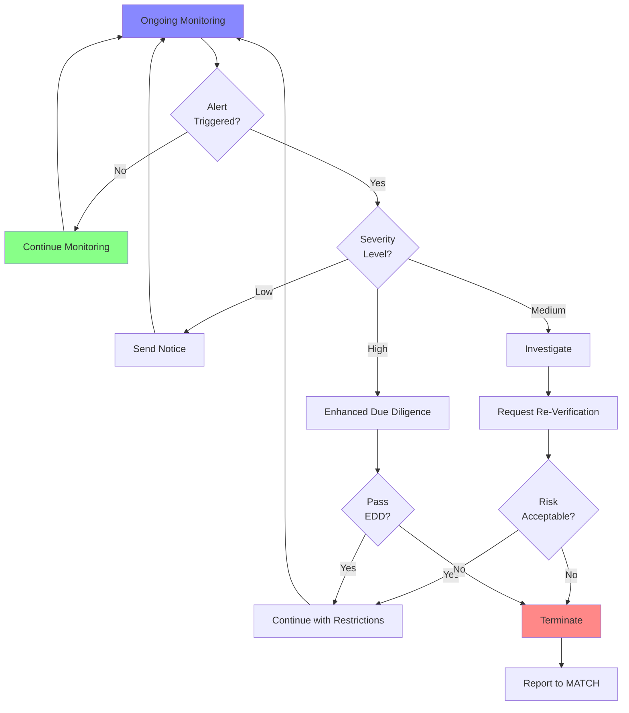

# Ongoing Monitoring

> **Status:** Pending content development
>
> **Last Updated:** 2025-12-25

## Overview

Ongoing monitoring is the continuous oversight of merchant activity to detect changes in risk profile, ensure compliance, and identify potential fraud or regulatory violations. Effective monitoring balances risk management with operational efficiency.

## Content Sections (To Be Developed)

### Why Ongoing Monitoring?

Merchants evolve after onboarding:

- **Business Model Changes** - Shift to higher-risk products/services
- **Volume Spikes** - Rapid growth may indicate fraud or unauthorized activity
- **Performance Degradation** - Chargebacks and fraud increase over time
- **Ownership Changes** - New owners may have different risk profiles
- **External Events** - Regulatory actions, lawsuits, negative publicity

Ongoing monitoring ensures:

- Compliance with card network rules
- Early detection of problems
- Sponsor bank protection
- Portfolio quality maintenance

### Types of Monitoring

#### Transaction Monitoring

**Real-Time Monitoring:**
- Velocity checks (transaction count/volume limits)
- Geographic anomalies (IP address vs. merchant location)
- High-risk transaction patterns
- Fraud score thresholds
- Authorization decline rates

**Batch Monitoring:**
- Daily chargeback ratio calculation
- Fraud-to-sales ratio
- Average ticket size changes
- Refund rate analysis
- Settlement pattern anomalies

#### Performance Monitoring

**Chargeback Monitoring:**
- Chargeback ratio: Chargebacks / Transactions
- Network thresholds:
  - Visa: 0.9% Early Warning, 1.8% Excessive
  - Mastercard: 1.0% Early Warning, 1.5% Excessive
- Reason code analysis

**Fraud Monitoring:**
- Fraud-to-sales ratio
- TC40 and SAFE reports (Visa fraud reporting)
- Fraud alerts from card networks

**Financial Monitoring:**
- Volume vs. projections
- Average ticket vs. underwriting
- Refund rate
- Settlement delays

#### Compliance Monitoring

**Regulatory Compliance:**
- PCI DSS compliance status
- SAR filing requirements
- Sanctions list re-screening
- License renewals (MTL, professional licenses)

**Operational Compliance:**
- Timely batch settlement
- Customer service quality
- Delivery timeframes
- Return policy adherence

### Monitoring Triggers

Events that warrant re-verification or enhanced due diligence:

**High Priority:**
- Chargeback ratio exceeds 1.0%
- Fraud alerts from card networks
- Sanctions list hit (ongoing screening)
- Ownership change notification
- Bankruptcy filing
- Regulatory action or lawsuit

**Medium Priority:**
- Volume 50%+ above projections
- Average ticket 50%+ above underwriting
- Customer complaint increase
- Refund rate exceeds 20%
- PCI non-compliance

**Low Priority:**
- Business anniversary (annual review)
- Ownership certification expiration
- License renewal due
- Website changes

### Re-Verification Process

When triggers occur, request updated information:

**Standard Re-Verification:**
- Updated beneficial ownership certification
- Current business financials
- Recent bank statements
- Website review
- Business license verification

**Enhanced Due Diligence (EDD):**
- In-depth investigation for elevated risk
- Additional documentation requests
- Site visit (physical location inspection)
- Customer reference checks
- Supplier verification
- Social media and reputation research

### Enhanced Due Diligence (EDD)

#### When EDD Is Required

- High-risk MCC with volume spikes
- Chargeback ratio approaching network thresholds
- Fraud alerts or suspicious activity reports
- Negative news or regulatory actions
- Ownership changes involving high-risk individuals
- Customer complaints alleging fraud or scams

#### EDD Process

1. **Information Gathering:**
   - Request additional documentation
   - Interview merchant principals
   - Review customer complaints and resolutions
   - Analyze transaction patterns in detail

2. **Investigation:**
   - Verify product/service delivery
   - Check supplier relationships
   - Validate customer satisfaction
   - Assess financial stability

3. **Risk Assessment:**
   - Update risk score
   - Evaluate mitigation options
   - Determine if relationship can continue

4. **Decision:**
   - Continue with no changes
   - Continue with restrictions (volume caps, higher reserves)
   - Place on monitoring program (enhanced oversight)
   - Terminate relationship

### Monitoring Automation

**Automated Alerts:**
- Threshold breaches (chargebacks, fraud, volume)
- Real-time transaction anomalies
- Compliance deadline reminders
- Sanctions list updates

**Dashboards:**
- Portfolio health metrics
- High-risk merchant lists
- Trending risk indicators
- Alert queue management

**Case Management:**
- Trigger to investigation tracking
- Documentation repository
- Decision audit trail
- Follow-up task assignment

### Monitoring Frequency

Risk-based monitoring intensity:

| Risk Level | Transaction Monitoring | Performance Review | Re-Verification |
|------------|------------------------|--------------------|--------------------|
| Low Risk | Daily batch | Quarterly | Annually |
| Medium Risk | Real-time + Batch | Monthly | Semi-annually |
| High Risk | Real-time + Batch | Weekly | Quarterly |

### Remediation Actions

When monitoring detects issues:

**Low Severity:**
- Informational notice to merchant
- Request explanation
- Update monitoring thresholds

**Medium Severity:**
- Formal warning
- Request corrective action plan
- Increase reserve
- Implement volume caps
- Enhanced monitoring

**High Severity:**
- Suspend processing (pending investigation)
- Require immediate corrective action
- Place on termination watch
- Initiate MATCH reporting process

**Critical:**
- Immediate termination
- MATCH list reporting
- SAR filing (if required)
- Notify sponsor bank

### Documentation Requirements

Maintain records of:

- Monitoring alerts and triggers
- Investigation steps and findings
- Merchant communications
- Decisions and rationale
- Corrective actions and outcomes

**Retention:** Minimum 5 years (often longer for regulatory compliance)

## Practical Implementation

### Monitoring Workflow

## Self-Assessment Questions

[Questions to be added covering monitoring types, triggers, and EDD processes]

## Related Topics

- [Merchant Agreements](./merchant-agreements.md) - Termination and MATCH reporting
- [Risk Factors](../underwriting/risk-factors.md) - What to monitor
- [Fundamentals](../underwriting/fundamentals.md) - Risk appetite

## References

- Visa Acquirer Monitoring Program (VAMP)
- Mastercard Excessive Chargeback Program (ECP)
- Card network fraud monitoring programs
- PCI DSS compliance requirements
