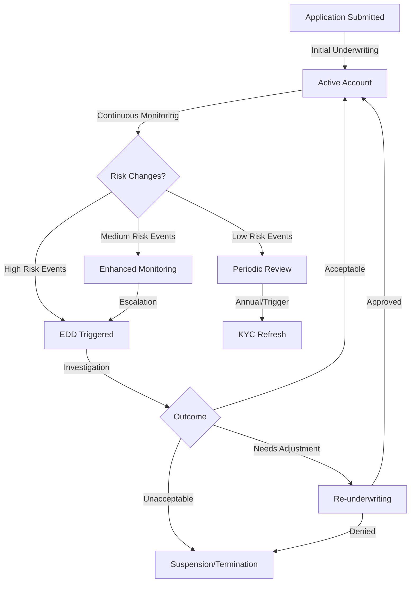
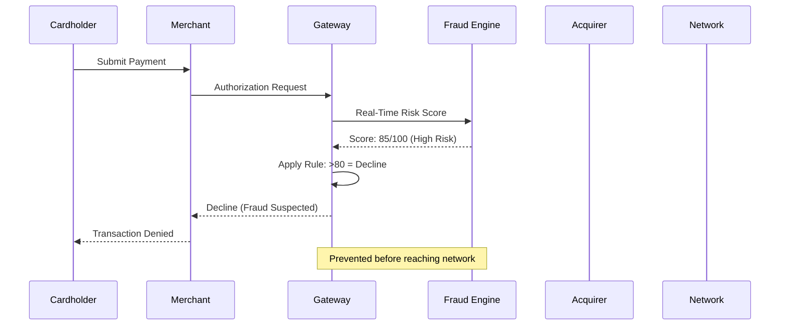
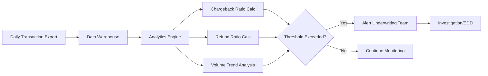
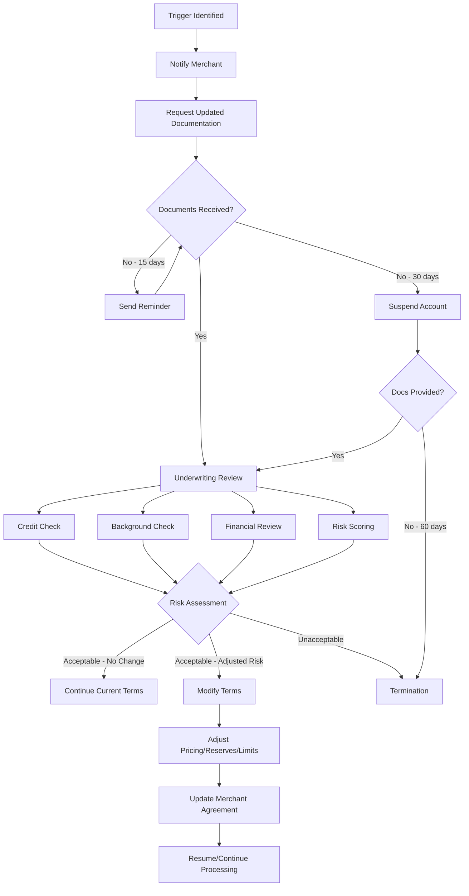
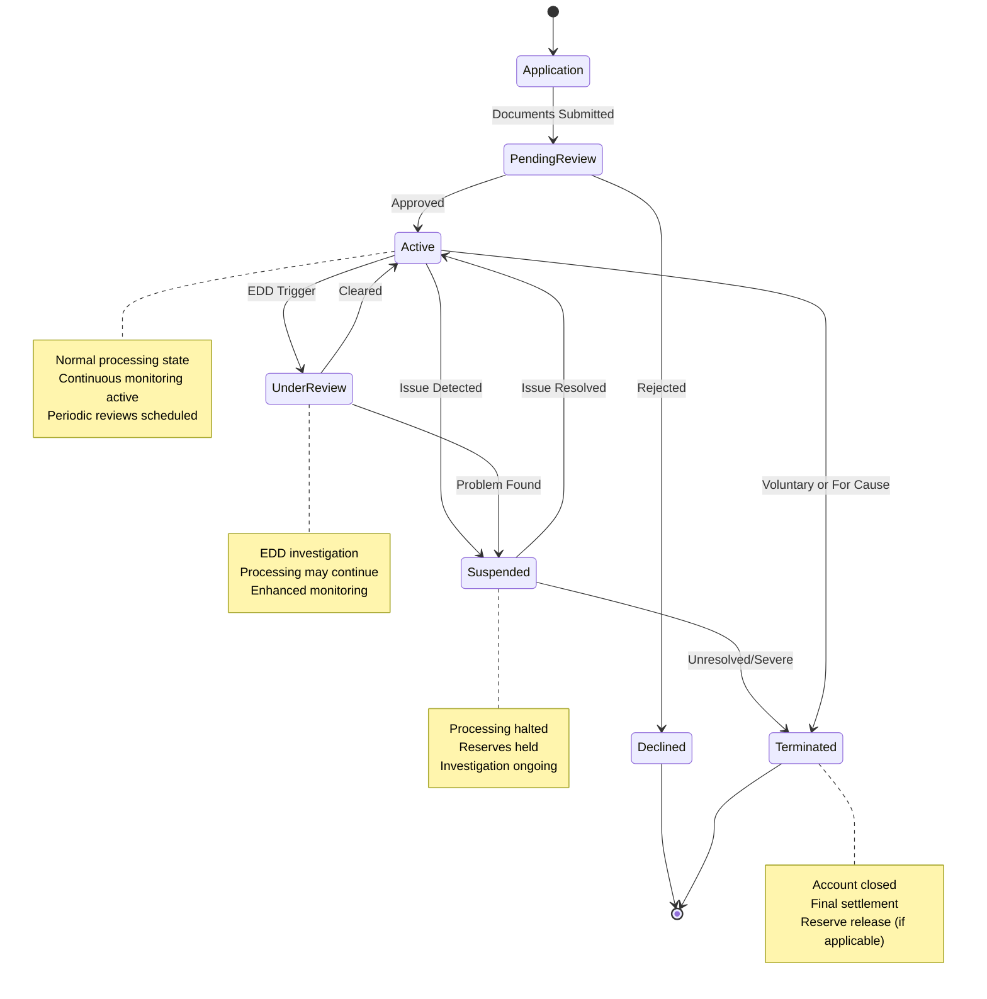
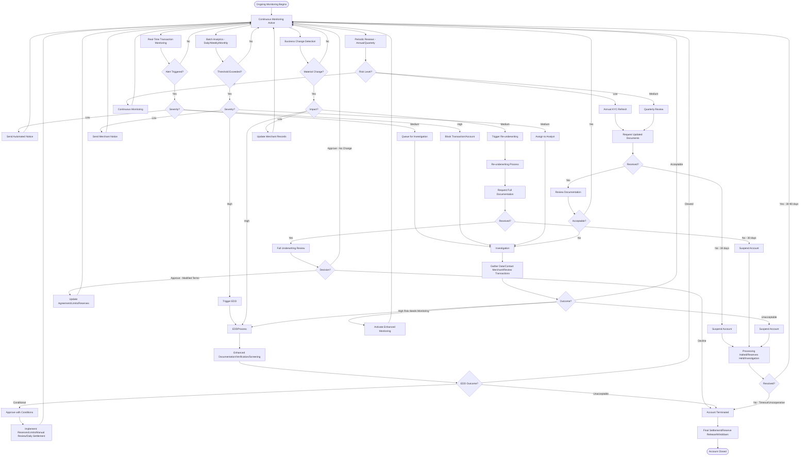

# Ongoing Monitoring & Re-verification

> **Last Updated:** 2025-12-28
> **Status:** Complete

## Quick Reference

**Purpose:** Detect emerging risks, ensure compliance, validate merchant behavior matches underwriting profile

**Key Principle:** Risk is dynamic - a merchant approved today may become risky tomorrow

**Monitoring Types:**
- **Transaction Monitoring:** Real-time and batch analysis of payment activity
- **Periodic KYC Refresh:** Scheduled re-verification of identity and business data
- **Business Change Monitoring:** Detecting material changes to merchant profile
- **Enhanced Due Diligence (EDD):** Deep-dive investigation when red flags emerge
- **Re-underwriting:** Full underwriting review when business materially changes

**Outcome:** Early risk detection, regulatory compliance, portfolio health maintenance

---

## Overview

Merchant onboarding is not a one-time event. **Ongoing monitoring** is the continuous process of evaluating merchant behavior, transaction patterns, and business changes throughout the merchant lifecycle to detect and mitigate emerging risks.

### Why Ongoing Monitoring Matters

1. **Risk Evolution:** A low-risk merchant can become high-risk through business changes, ownership transfers, or shifts in transaction patterns
2. **Regulatory Requirements:** AML/BSA, USA PATRIOT Act, and FinCEN regulations mandate continuous monitoring
3. **Network Compliance:** Visa VAMP and Mastercard ECM/EFM programs require acquirers to monitor and control dispute/fraud ratios
4. **Financial Protection:** Early detection of chargebacks, fraud, and credit deterioration protects against losses
5. **PCI Compliance:** Annual validation, quarterly scans, and continuous monitoring required
6. **Contractual Obligations:** Merchant agreements require notification of material business changes

### Risk Evolution Over Merchant Lifecycle



### Regulatory Framework

| Regulation | Requirement | Frequency |
|------------|-------------|-----------|
| **BSA/AML** | Customer due diligence (CDD) and ongoing monitoring | Continuous |
| **USA PATRIOT Act § 326** | Customer Identification Program (CIP) verification | Initial + triggers |
| **FinCEN CDD Rule** | Beneficial ownership verification | Initial + material changes |
| **OFAC** | Sanctions screening | Continuous (daily/real-time) |
| **PCI DSS 4.0** | Quarterly scans, annual assessment | Quarterly/Annual |
| **Card Network Rules** | Fraud/chargeback monitoring (VAMP, ECM, EFM) | Monthly |

---

## Key Terms

:::info Definitions

**Periodic Review:** Scheduled re-evaluation of merchant risk profile at defined intervals (annual, quarterly, etc.)

**Enhanced Due Diligence (EDD):** Intensive investigation triggered by high-risk indicators, requiring additional documentation and verification

**Re-underwriting:** Full underwriting review process applied to existing merchants when material business changes occur

**Business Change Monitoring:** Tracking modifications to merchant business model, ownership, location, or product offerings

**Merchant Lifecycle:** The complete journey from application through active processing to potential termination

**Ongoing Monitoring:** Continuous surveillance of merchant transactions, business changes, and risk indicators throughout the merchant relationship

**Perpetual KYC:** Modern approach using continuous data feeds instead of periodic manual reviews

:::

---

## Network Monitoring Programs

Card networks impose strict monitoring requirements on acquirers to control fraud and dispute ratios. Non-compliance results in fines, remediation requirements, and potential loss of processing rights.

### Visa VAMP (NEW - April 2025)

:::warning Critical Update - VAMP Replaces Legacy Programs

**Effective April 1, 2025:** Visa retired VDMP (Dispute Monitoring Program), VFMP (Fraud Monitoring Program), VFMP 3DS, and DGMFM (Digital Goods Merchant Fraud Monitoring) and replaced them with the unified **Visa Acquirer Monitoring Program (VAMP)**.

**Transition Timeline:**
- **June 2025:** VAMP monitoring begins (2.2% threshold, 1,500 min disputes)
- **October 2025:** Enforcement begins with fines ($10 per fraud/dispute)
- **April 2026 (US/EU):** Threshold tightens to 1.5% ratio (from 2.2%), same $10 fee structure applies

:::

**VAMP Merchant Thresholds:**

| Effective Date | Excessive Threshold | Minimum Monthly Disputes | Geography |
|----------------|--------------------|-----------------------------|-----------|
| June 2025 | 2.2% VAMP Ratio | 1,500 disputes | Global |
| October 2025 | 2.2% VAMP Ratio | 1,500 disputes (enforcement begins) | Global |
| April 2026 | **1.5% VAMP Ratio** | 1,500 disputes (under review) | US, EU only (other regions remain at 2.2%) |

**VAMP Ratio Formula:**

```
VAMP Ratio = (TC40 Fraud Notifications + TC15 Disputes in Current Month) ÷ TC05 Settled Transactions in Prior Month
```

- **TC40:** Fraud notifications from issuers (current month)
- **TC15:** Dispute notifications (current month)
- **TC05:** Settled transaction count (prior month - accounts for lag between settlement and dispute notification)

**Merchant Placement:**
- Merchant enters VAMP if **both** conditions met: VAMP Ratio ≥ threshold AND ≥ 1,500 disputes/month
- **Fees:** $10 per card-absent fraud transaction and $10 per dispute
- **Exit:** 3 consecutive months below threshold

**VAMP Acquirer Thresholds:**

| Effective Date | Above Standard | Excessive | Note |
|----------------|----------------|-----------|------|
| Current | ≥ 0.5% (50 bps) | ≥ 0.7% (70 bps) | Portfolio-level |
| April 2026 | **≥ 0.3% (30 bps)** | ≥ 0.7% (70 bps) | Tightened standard |

**Acquirer Responsibilities:**
1. Identify merchants exceeding thresholds within 30 days
2. Implement remediation plans (fraud tools, 3DS, transaction limits)
3. Report progress to Visa monthly
4. Terminate merchants who fail to improve within 4 months

---

### Mastercard ECM & EFM

**Excessive Chargeback Merchant (ECM):**

| Program Level | Threshold | Minimum Volume |
|---------------|-----------|----------------|
| **ECM (Standard)** | 1.5% chargeback ratio (150 bps) | **AND** 100+ chargebacks/month (both required) |
| **HECM (High Excessive)** | 3.0% chargeback ratio (300 bps) | **OR** 300+ chargebacks/month (either condition triggers) |

**Note:** Both ECM and HECM require a minimum of 1,000 transactions in the prior month to be eligible for program placement.

**Calculation:**
```
Chargeback Ratio = (Chargebacks Current Month) ÷ (Sales from Prior Month) × 100
```

**ECM Fees:**
- **ECM:** $100 per chargeback (after 100 threshold)
- **HECM:** $200 per chargeback

**Exit:** 3 consecutive months below threshold

**ECM Process:**
1. Month 1: Merchant identified, notification sent
2. Month 2-4: Remediation period (action plan required)
3. Month 5+: Continued non-compliance = acquirer fines escalate, potential termination

---

**Excessive Fraud Merchant (EFM):**

**Thresholds (ALL conditions must be met):**
1. **Volume:** ≥ 1,000 Mastercard transactions in previous month
2. **Amount:** ≥ $50,000 in fraud claims (Mastercard Reason Code 4837 - Fraudulent Transaction - No Cardholder Authorization)
3. **Fraud Ratio:** ≥ 0.50% fraud-to-sales ratio

**Scope:** Card-not-present (CNP) transactions only

**Calculation:**
```
Fraud Ratio = (Fraud Dollar Amount) ÷ (Sales Dollar Amount from Prior Month) × 100
```

**EFM Fees:**
- **Standard EFM:** $1,000 per month per merchant
- **High EFM:** $5,000 per month per merchant (≥ 1.0% fraud ratio)

**Exit:** 3 consecutive months below all thresholds

**EFM Process:**
1. Identification and notification
2. Mandatory fraud mitigation (3DS, velocity controls, AVS/CVV, behavioral analytics)
3. Monthly reporting to Mastercard
4. Non-compliance = account termination required

---

### Network Monitoring Program Comparison

| Aspect | Visa VAMP (2025) | Mastercard ECM | Mastercard EFM |
|--------|------------------|----------------|----------------|
| **Scope** | Fraud + Disputes (unified) | Chargebacks only | Fraud only (CNP) |
| **Metric** | (TC40 + TC15) ÷ TC05 | Chargebacks ÷ Sales | Fraud $ ÷ Sales $ |
| **Threshold** | 2.2% (1.5% in Apr 2026) | 1.5% (ECM) / 3.0% (HECM) | 0.50% (EFM) / 1.0% (HEFM) |
| **Minimum Count** | 1,500 disputes/month | 100 chargebacks/month | 1,000 transactions |
| **Fees** | $10 per fraud/dispute | $100-$200 per chargeback | $1,000-$5,000/month |
| **Exit** | 3 months below threshold | 3 months below threshold | 3 months below all thresholds |
| **Enforcement** | Oct 2025 (full Apr 2026) | Immediate | Immediate |

:::tip Key Insight

VAMP represents a **unified approach** to fraud and disputes, simplifying Visa's previously fragmented programs. Acquirers must now monitor a **single metric** but face **stricter thresholds** over time. PayFacs and ISOs must ensure sub-merchants/merchants stay well below network thresholds to avoid portfolio-level consequences.

:::

---

## Transaction Monitoring

Transaction monitoring is the continuous analysis of payment activity to detect anomalies, fraud, and emerging risks.

### What to Monitor

| Metric | Typical Threshold | Action if Exceeded |
|--------|-------------------|--------------------|
| **Chargeback Ratio** | 1.0% (internal), 1.5% (ECM) | Investigate, contact merchant, implement fraud tools |
| **Fraud Ratio** | 0.5% (internal), 0.5% (EFM) | Enhanced fraud detection, 3DS, velocity limits |
| **Refund Ratio** | 20% of sales | Verify business model, check for buyer remorse patterns |
| **Average Ticket** | 50% above underwriting | Re-verify business model, adjust limits |
| **Monthly Volume** | 50% above projections | Contact merchant, verify legitimacy, re-underwrite |
| **Velocity Spikes** | 3x daily average in 1 hour | Real-time block, fraud investigation |
| **Geographic Mismatches** | Cards from unexpected countries | AVS/CVV checks, 3DS, manual review |
| **Decline Rate** | >15% | Verify merchant practices, check for card testing |
| **Late Night Activity** | Unusual for business type | Investigate for account takeover |
| **Multiple Cards, Same IP** | 3+ cards in short window | Card testing detection, block IP |

:::info Example Monitoring Rules

**E-commerce Merchant (Apparel):**
- Approved average ticket: $75
- Approved monthly volume: $250,000
- Expected chargeback: 0.5%

**Triggers:**
- Single transaction >$500: Manual review
- Daily volume >$20,000: Alert underwriting
- Chargeback ratio >1.0%: Investigation + EDD
- Refund ratio >25%: Contact merchant
- Velocity >50 transactions/hour: Real-time alert

:::

### Real-Time vs Batch Monitoring

**Real-Time Monitoring:**
- **Timing:** During authorization flow (milliseconds)
- **Purpose:** Prevent fraudulent transactions before approval
- **Techniques:** Velocity checks, IP geolocation, device fingerprinting, behavioral analytics
- **Action:** Decline, 3DS challenge, manual review queue
- **Tools:** Kount, Riskified, Sift, Stripe Radar

**Example Real-Time Flow:**


**Batch Monitoring:**
- **Timing:** Post-settlement (daily, weekly, monthly)
- **Purpose:** Detect patterns, trends, and emerging risks over time
- **Techniques:** Cohort analysis, chargeback tracking, business change detection
- **Action:** Alerts, investigation, re-underwriting, account limits
- **Tools:** Tableau, Power BI, custom analytics platforms

**Example Batch Analysis:**


**When to Use Each:**

| Scenario | Real-Time | Batch |
|----------|-----------|-------|
| Card testing (multiple cards, same IP) | ✓ | |
| Velocity spike (50 txns in 10 min) | ✓ | |
| Chargeback ratio trending up over 3 months | | ✓ |
| Single transaction $10,000 (approved avg $100) | ✓ | |
| Business model change (retail → subscription) | | ✓ |
| OFAC sanctions list update | ✓ | ✓ |

---

## Periodic KYC/KYB Refresh

Periodic review ensures merchant information remains current and accurate. Frequency depends on risk classification.

### Refresh Schedule by Risk Level

| Risk Level | Traditional Approach | Event-Driven Approach | Perpetual KYC |
|------------|----------------------|------------------------|---------------|
| **Low Risk** | Every 3-5 years | Trigger-based only | Continuous data feeds |
| **Medium Risk** | Annually | Annual + triggers | Continuous + annual certification |
| **High Risk** | Quarterly or Continuous | Continuous monitoring | Real-time data feeds + quarterly review |
| **PEPs** | Continuous | Continuous | Real-time sanctions + adverse media |
| **High-Volume (>$10M)** | Annually | Semi-annual + triggers | Continuous + semi-annual audit |

**Risk Level Factors:**
- Transaction volume and average ticket
- Industry (high-risk vs low-risk MCC)
- Geographic exposure (cross-border, sanctioned regions)
- Chargeback/fraud history
- Business longevity and credit history
- Beneficial owner profiles (PEPs, sanctions, criminal records)

### What to Refresh

**Business Information:**
- Legal business name and DBA changes
- Physical address and registered agent
- Business phone, email, website
- MCC code accuracy
- State/local business licenses
- Tax ID verification (EIN)

**Ownership Information:**
- Beneficial owners (≥25% ownership)
- Control persons (authorized signers, executives)
- PEP status changes
- OFAC/sanctions screening (daily)
- Criminal background checks (annual)
- UBO certification (annual)

**Financial Information:**
- Bank account verification (voided check, bank letter)
- Credit report (business and personal)
- Financial statements (if required)
- Processing volume vs projections

**Compliance Information:**
- PCI DSS compliance (annual SAQ, quarterly scans)
- Data breach notifications
- Regulatory actions or lawsuits
- Industry-specific licenses (gaming, cannabis, money transmission)

### Perpetual KYC Trend

Traditional periodic reviews are manual, slow, and create gaps between review cycles. **Perpetual KYC** uses continuous data feeds to detect changes in real-time:

**Data Sources:**
- **Corporate Registries:** Automated feeds from Secretary of State filings (ownership, address changes)
- **Sanctions Lists:** Real-time OFAC, UN, EU updates
- **Adverse Media:** AI-powered news monitoring for negative press
- **Credit Bureaus:** Continuous monitoring for credit deterioration
- **Public Records:** Bankruptcy filings, liens, judgments, UCC filings
- **PEP Databases:** Political exposure screening

**Benefits:**
- **Real-time detection:** Changes identified within hours, not months
- **Reduced manual effort:** Automated alerts replace manual checks
- **Continuous compliance:** No gaps between review cycles
- **Scalability:** Handle thousands of merchants without proportional staff increase

**Vendors:** ComplyAdvantage, Sumsub, Trulioo, Refinitiv World-Check, Dow Jones Risk & Compliance

---

## Business Change Monitoring

Material changes to a merchant's business can alter risk profile and require re-evaluation.

### Types of Business Changes

| Change Type | Examples | Risk Impact | Required Action |
|-------------|----------|-------------|-----------------|
| **Address Change** | New physical location, registered agent change | Low-Medium | Verify new location, update records, re-screen |
| **Ownership Change** | Sale of business, new partners, >25% ownership transfer | High | Full UBO re-verification, background checks, re-underwriting |
| **DBA/Legal Name** | Rebranding, merger, legal restructure | Medium | Verify legal documentation, update merchant agreement |
| **MCC Change** | Shift to different product category | High | Re-underwriting, rate adjustment, compliance review |
| **Volume Increase** | >50% above underwriting projections | Medium-High | Verify legitimacy, adjust limits, potential re-pricing |
| **Website Changes** | New domain, product offerings, fulfillment terms | Medium | Verify website content, TOS, refund policy |
| **Bank Account Change** | New settlement account | Medium | Verify ownership, microdeposit validation |
| **Processing Model** | Card-present → card-not-present | High | Re-underwriting, fraud tools, 3DS implementation |
| **Fulfillment Changes** | Immediate → delayed delivery (30+ days) | High | Chargeback risk increase, adjust reserves |
| **Geographic Expansion** | Domestic → cross-border sales | High | Compliance review, multi-currency setup |

### Detection Methods

**Automated Monitoring:**
- **Website Scraping:** Daily checks for product, pricing, TOS changes
- **Transaction Pattern Analysis:** Detect MCC mismatches, volume spikes, new geographies
- **Corporate Registry Monitoring:** Automated feeds for ownership/address changes
- **Domain Monitoring:** New domains, expired SSL certificates, WHOIS changes

**Merchant Self-Reporting:**
- Contractual obligation to notify within 30 days of material changes
- Annual certification requirement (merchant confirms information accuracy)
- Proactive outreach for planned changes (new location, product launch)

**Third-Party Data Sources:**
- Credit bureau alerts (business and personal)
- Adverse media monitoring
- Industry databases (business license renewals, regulatory actions)

**Transaction Pattern Recognition:**
- Sudden average ticket increase (underwriting: $50, current: $200)
- MCC mismatch (approved for retail, processing subscription billing)
- Geographic shift (US-only → 50% international)
- Fulfillment delay (approved for immediate delivery, now 60-day pre-orders)

:::danger Compliance Requirement

Merchant agreements **must** include clauses requiring notification of material business changes within 30 days. Failure to notify can result in immediate suspension or termination. PayFacs should implement automated detection to not rely solely on merchant self-reporting.

:::

---

## Enhanced Due Diligence (EDD)

Enhanced Due Diligence is an intensive investigation triggered by high-risk indicators or suspicious activity. EDD goes beyond standard KYC/underwriting procedures.

### EDD Trigger Categories

**Customer-Based Triggers:**
- Beneficial owner identified as PEP (Politically Exposed Person)
- Sanctions list match (OFAC, UN, EU)
- Criminal background check reveals financial crimes
- Adverse media (fraud allegations, lawsuits, regulatory actions)
- Complex ownership structure (shell companies, offshore entities)
- High-risk nationality or residence (sanctioned countries, non-cooperative jurisdictions)

**Transaction-Based Triggers:**
- Chargeback ratio >1.0%
- Fraud ratio >0.5%
- Refund ratio >20%
- Volume spike >50% over 30 days
- Average ticket spike >50% above underwriting
- Geographic mismatch (cards from unexpected countries)
- Unusual transaction timing (late night, holidays)

**Event-Based Triggers:**
- Ownership change (>25% transfer)
- Bankruptcy filing (business or owner)
- Regulatory action (FTC complaint, state AG investigation)
- Data breach notification
- Network monitoring program placement (VAMP, ECM, EFM)
- PCI non-compliance
- Website content violations (prohibited products, misleading claims)

### EDD Process Components

**1. Enhanced Documentation Collection:**
- **Ownership:** UBO declaration with notarization, corporate structure chart
- **Financials:** 2-3 years financial statements (audited if available), tax returns
- **Source of Funds:** Bank statements, invoicing samples, supplier agreements
- **Business Operations:** Photos of physical location, inventory, staff
- **Licensing:** Industry-specific licenses (money transmission, gaming, cannabis)
- **Relationships:** Key vendors, suppliers, business partners

**2. Enhanced Verification:**
- **In-Person Verification:** Site visit to physical location
- **Video Call:** Interview with beneficial owners and control persons
- **Reference Checks:** Contact suppliers, landlord, business references
- **Independent Research:** Third-party reports (Dun & Bradstreet, LexisNexis)
- **Legal Review:** Corporate filings, UCC searches, litigation history

**3. Enhanced Screening:**
- **Deep Sanctions Search:** Check all BOs, control persons, and close associates
- **PEP Expanded:** Screen family members and close associates
- **Adverse Media:** Historical search (5-10 years), multiple languages
- **Criminal Background:** County, state, federal, international (Interpol)
- **Credit Deep Dive:** Personal and business credit, judgments, liens, bankruptcies

**4. Risk Assessment Update:**
- Re-score merchant using enhanced information
- Identify specific risk factors and mitigation strategies
- Determine if account should remain active, be limited, or terminated

**5. Decision & Documentation:**
- **Approve:** Continue with enhanced monitoring or adjusted terms (reserves, limits, rates)
- **Conditional Approval:** Implement specific controls (daily settlement, transaction limits, manual review)
- **Decline/Terminate:** If risks are unacceptable or merchant is uncooperative

**6. Ongoing Enhanced Monitoring:**
- More frequent reviews (quarterly vs annual)
- Lower thresholds for alerts
- Manual review of high-ticket transactions
- Continuous sanctions/PEP screening

:::tip EDD Best Practices

**Document Everything:** EDD investigations create defensible audit trails for regulators and auditors. Include rationale for approval/decline decisions.

**Use Technology:** EDD platforms (ComplyAdvantage, Sumsub, Refinitiv) automate screening, adverse media, and PEP checks, reducing manual effort and human error.

**Escalate Appropriately:** High-risk EDD cases should involve compliance officers, legal counsel, and potentially external consultants.

**Set Time Limits:** EDD should conclude within 30-45 days. Prolonged investigations create operational burden and merchant frustration.

:::

### Standard vs Advanced EDD Techniques

| Technique | Standard EDD | Advanced EDD |
|-----------|--------------|--------------|
| **Sanctions Screening** | OFAC SDN list | OFAC + UN + EU + country-specific lists |
| **PEP Screening** | Current officeholders | Current + former + family + close associates |
| **Adverse Media** | English-language, 1 year | Multi-language, 5-10 years, AI-powered |
| **Background Checks** | State-level criminal | Federal, state, county, international (Interpol) |
| **Site Verification** | Google Street View | In-person site visit, photos, staff interviews |
| **Financial Review** | Bank statements (3 months) | Financial statements (2-3 years), audited if available |
| **Ownership Verification** | Secretary of State filing | Notarized UBO declaration + org chart |
| **Reference Checks** | Self-provided references | Independent third-party verification |

---

## Re-Underwriting Process

Re-underwriting is a full underwriting review applied to existing merchants when material changes occur.

### When to Re-Underwrite

| Trigger | Reason | Example |
|---------|--------|---------|
| **Volume Increase >50%** | Risk exposure increases proportionally | Merchant approved for $100K/month now processing $200K/month |
| **Business Model Change** | Original risk assessment no longer valid | Retail store adds e-commerce site |
| **Ownership Change** | New owners = new risk profile | Partnership buys out sole proprietor |
| **MCC Change** | Different industry = different risk | Clothing store adds CBD products |
| **Fulfillment Change** | Chargeback risk profile changes | Immediate delivery → 60-day pre-orders |
| **Geographic Expansion** | Cross-border adds complexity | US-only → 50% European customers |
| **EDD Triggers** | High-risk indicators identified | Beneficial owner appears on sanctions list |
| **Network Monitoring** | VAMP, ECM, or EFM placement | Chargeback ratio exceeds 1.5% |
| **Credit Deterioration** | Increased financial risk | Business bankruptcy filing |
| **Contractual Requirement** | Annual or biennial re-underwriting clause | High-risk MCC requires annual review |

### Re-Underwriting Steps



**Step-by-Step:**

1. **Trigger Detection:** Automated alert or manual identification
2. **Merchant Notification:** Email/portal notification of re-underwriting requirement
3. **Document Request:** Provide checklist of required documents (usually same as initial underwriting)
4. **Document Review:** Verify completeness and authenticity
5. **Credit & Background Checks:** Run fresh reports (not older than 30 days)
6. **Financial Analysis:** Review bank statements, financial statements, tax returns
7. **Risk Scoring:** Apply underwriting risk model to updated data
8. **Decision:**
   - **Approve - No Change:** Continue existing terms
   - **Approve - Modified Terms:** Adjust pricing, reserves, volume limits, or settlement frequency
   - **Conditional Approval:** Implement controls (manual review, transaction limits, daily settlement)
   - **Decline/Terminate:** Unacceptable risk, provide wind-down period (30-60 days)
9. **Agreement Update:** If terms change, execute amendment or new merchant agreement
10. **Update Systems:** Reflect new terms in payment platform

**Timeline:** Re-underwriting should conclude within 30 days of document receipt. Prolonged reviews create operational disruption.

---

## Merchant Lifecycle States

Throughout the monitoring process, merchants move through various lifecycle states based on their risk profile and behavior.



### Lifecycle State Definitions

| State | Description | Processing Status | Monitoring Level | Typical Duration |
|-------|-------------|------------------|------------------|------------------|
| **Application** | Initial submission, pending review | Not active | N/A | 1-7 days |
| **Pending Review** | Underwriting in progress | Not active | Initial assessment | 3-10 days |
| **Active** | Approved and processing | Active | Standard monitoring | Ongoing |
| **Under Review** | EDD investigation, no suspension yet | Active (may be limited) | Enhanced monitoring | 15-45 days |
| **Suspended** | Processing halted due to risk concern | Suspended | Intensive investigation | 30-90 days |
| **Terminated** | Account closed permanently | Closed | Final settlement | 30-180 days (reserves) |
| **Declined** | Application rejected | Never activated | N/A | N/A |

**State Transition Triggers:**

- **Active → Under Review:** EDD trigger (chargeback spike, ownership change, adverse media)
- **Active → Suspended:** Immediate risk (OFAC match, fraud surge, regulatory action)
- **Under Review → Active:** Investigation cleared, risk acceptable
- **Under Review → Suspended:** Investigation reveals unacceptable risk
- **Suspended → Active:** Issue resolved, remediation complete
- **Suspended → Terminated:** Unable to resolve, merchant unresponsive, unacceptable risk

:::warning Reserve Management During Lifecycle Changes

When merchants move to **Suspended** or **Terminated** states, acquirers/PayFacs typically:
- **Increase rolling reserve** to cover potential chargebacks (up to 100% of processing volume)
- **Extend reserve hold period** (standard 180 days may extend to 270-365 days for high-risk)
- **Delay final settlement** until chargeback exposure period expires

This protects against chargebacks that may emerge after processing ceases.

:::

---

## Model-Specific Monitoring Responsibilities

Different payment models distribute monitoring responsibilities differently. Understanding these distinctions is critical for compliance and operational efficiency.

### Comprehensive Comparison Table

| Aspect | PayFac | ISO/MSP | Direct Acquirer/Processor | ISV/SaaS |
|--------|--------|---------|---------------------------|----------|
| **Primary Monitoring Scope** | All sub-merchants (100% responsibility) | Portfolio + individual merchants (shared) | Direct merchant relationships | Shared with payment partner |
| **Liability Exposure** | Up to 100% for sub-merchant activity | Shared with acquirer (typically 10-50%) | Full liability for merchant portfolio | Per partnership agreement (often limited) |
| **Underwriting Responsibility** | Full responsibility for sub-merchant underwriting | Advisory role; acquirer approves | Full responsibility for merchant underwriting | Payment partner handles underwriting |
| **Transaction Monitoring** | Real-time and batch for all sub-merchants | Portfolio-level + merchant-level (shared) | Real-time and batch for all merchants | Software-level monitoring + partner monitoring |
| **KYC/KYB Refresh** | PayFac conducts periodic reviews | ISO may assist; acquirer responsible | Direct acquirer conducts reviews | Partner conducts, ISV may provide data |
| **Network Reporting** | Reports to sponsor bank; sponsor reports to networks | Reports to processor/acquirer | Direct reporting to Visa/Mastercard | Partner reports to networks |
| **SAR Filing** | PayFac files SARs for sub-merchant suspicious activity | Acquirer/processor files SARs (ISO reports to acquirer) | Acquirer files SARs | Partner files; ISV may report internally |
| **PCI Compliance** | Level 1 Service Provider (annual ROC) | Per agreement (often Level 2-4) | Level 1 Merchant (annual ROC) | Level 1 Service Provider if handling card data |
| **Chargeback Management** | PayFac manages all sub-merchant chargebacks | ISO assists merchants; acquirer liable | Acquirer manages directly with merchants | Partner manages; ISV may provide tools |
| **Fraud Detection** | PayFac implements fraud tools for all subs | Portfolio tools + merchant-specific tools | Acquirer implements fraud detection | ISV software may include fraud detection |
| **EDD Triggers** | PayFac conducts EDD on sub-merchants | Shared responsibility (acquirer approves) | Acquirer conducts EDD | Partner conducts EDD |
| **Re-underwriting** | PayFac re-underwrites when triggers met | Acquirer re-underwrites; ISO may assist | Acquirer re-underwrites directly | Partner re-underwrites |
| **Regulatory Exams** | Subject to sponsor bank exams + direct exams | Acquirer examined; ISO may be reviewed | Direct FFIEC/OCC/Fed exams | Depends on registration status |
| **Technology Requirements** | Robust platform for sub-merchant monitoring | Portfolio analytics tools | Enterprise-level monitoring systems | SaaS platform integration + partner APIs |

---

### PayFac: Full Responsibility Model

**PayFac = Master Merchant:** All sub-merchant activity rolls up to the PayFac's MID (Merchant Identification Number). The PayFac is 100% liable for sub-merchant fraud, chargebacks, and regulatory compliance.

**Monitoring Responsibilities:**

1. **Sub-Merchant Onboarding:**
   - Full KYC/KYB for each sub-merchant
   - Beneficial owner verification (25% threshold)
   - OFAC/sanctions screening (initial + continuous)
   - Credit and background checks
   - Risk scoring and tiering

2. **Transaction Monitoring:**
   - Real-time fraud detection for all sub-merchant transactions
   - Velocity controls, IP geolocation, device fingerprinting
   - Batch analysis for chargeback, fraud, and refund ratios
   - Network monitoring (VAMP, ECM, EFM) for sub-merchants
   - Aggregate portfolio monitoring for sponsor bank reporting

3. **Periodic Reviews:**
   - Annual KYC refresh for low-risk sub-merchants
   - Quarterly or continuous monitoring for high-risk sub-merchants
   - Re-underwriting when business changes occur
   - EDD investigations for triggered alerts

4. **Compliance Obligations:**
   - **AML/BSA Compliance:** PayFac must have written AML program, appoint compliance officer, conduct independent audits
   - **SAR Filing:** PayFac files Suspicious Activity Reports for sub-merchant activity exceeding thresholds
   - **PCI DSS Level 1 Service Provider:** Annual Report on Compliance (ROC) by QSA, quarterly network scans
   - **Sponsor Bank Reporting:** Monthly or quarterly reports on portfolio health, exceptions, remediation

5. **Chargeback & Dispute Management:**
   - Investigate all chargebacks
   - Represent disputes with compelling evidence
   - Debit sub-merchant settlement accounts for chargebacks
   - Manage reserves and holdbacks

**Technology Requirements:**
- Sub-merchant onboarding platform (KYC, underwriting, agreements)
- Real-time fraud detection engine (Kount, Riskified, Sift)
- Transaction monitoring and analytics (chargeback tracking, risk scoring)
- Reserve and settlement management
- Compliance tools (OFAC screening, adverse media, PEP databases)
- Reporting dashboards for sponsor bank and internal stakeholders

**Sponsor Bank Relationship:**
- PayFac reports to sponsor bank (the registered acquirer with card networks)
- Sponsor bank conducts annual or semi-annual audits of PayFac operations
- Sponsor bank may impose portfolio limits, reserve requirements, and remediation plans
- Sponsor bank is ultimately liable to networks; will terminate PayFac if non-compliant

:::tip PayFac Portfolio Management

PayFacs must monitor at **two levels**:
1. **Individual sub-merchant:** Detect bad actors before they damage the portfolio
2. **Portfolio aggregate:** Ensure overall portfolio stays below network thresholds (VAMP, ECM, EFM)

A single high-risk sub-merchant can jeopardize the entire PayFac program if not detected and removed quickly.

:::

---

### ISO/MSP: Shared Responsibility Model

**ISO (Independent Sales Organization) / MSP (Member Service Provider):** Sales and support intermediary between merchants and acquirers. ISOs do not underwrite or settle; they refer merchants to acquirers and share in residual revenue.

**Monitoring Responsibilities:**

1. **Merchant Relationship Management:**
   - Ongoing communication with merchants
   - Assist merchants with questions, disputes, technical issues
   - Identify material business changes through regular contact
   - Educate merchants on compliance (PCI, network rules)

2. **Portfolio Monitoring:**
   - Track portfolio-level chargeback and fraud ratios
   - Identify merchants at risk of VAMP/ECM/EFM placement
   - Alert acquirer to problem merchants
   - May provide fraud prevention tools (AVS, CVV, 3DS) to merchants

3. **Chargeback Processing:**
   - Assist merchants in responding to chargebacks
   - Gather compelling evidence (tracking, signatures, terms)
   - Submit representments to acquirer
   - Educate merchants on chargeback prevention

4. **Limited Underwriting:**
   - ISOs may conduct initial screening (pre-qualification)
   - Provide merchant documentation package to acquirer
   - Acquirer makes final underwriting decision
   - ISO does not approve or decline merchants

5. **Fraud Prevention:**
   - Recommend fraud tools to merchants
   - Provide training on fraud detection (card testing, friendly fraud)
   - May resell third-party fraud solutions

**What ISOs DO NOT Do:**
- **Underwriting:** Acquirer underwrites and approves merchants
- **Settlement:** Acquirer settles funds to merchant
- **SAR Filing:** Acquirer files SARs for suspicious activity
- **Direct Network Reporting:** Acquirer reports to Visa/Mastercard
- **Legal Liability:** Acquirer is liable to networks (ISO has contractual liability to acquirer)

**Technology Requirements:**
- CRM for merchant relationship tracking
- Portfolio analytics dashboard (chargebacks, volumes, merchant health)
- Chargeback management tools
- Reporting to acquirer

**Acquirer Relationship:**
- ISO is contracted by acquirer (ISO Agreement)
- ISO shares in residual revenue (typically basis points on processing volume)
- ISO may have chargeback liability (e.g., ISO liable for first $10K per merchant chargeback)
- Acquirer can terminate ISO for poor merchant quality or non-compliance

:::warning ISO Liability Exposure

While ISOs do not underwrite merchants, they often have **contractual liability** to acquirers for chargebacks, fraud, or compliance failures. ISO agreements may include:
- **Chargeback Liability:** ISO liable for first $X per merchant or Y% of total chargebacks
- **Reserve Requirements:** ISO must maintain reserve account with acquirer
- **Termination Clauses:** Acquirer can terminate ISO for portfolio quality issues

ISOs should actively monitor their portfolio to avoid financial exposure.

:::

---

### Direct Acquirer/Processor: Full Control Model

**Direct Acquirer:** Registered member of card networks, directly underwrites and settles with merchants. No intermediary (PayFac or ISO) involved.

**Monitoring Responsibilities:**

1. **Merchant Underwriting:**
   - Full underwriting of each merchant application
   - Credit checks, background checks, financial analysis
   - Risk scoring and tiering
   - Pricing and reserve decisions

2. **Transaction Monitoring:**
   - Real-time fraud detection across entire merchant portfolio
   - Batch analytics for chargeback, fraud, refund trends
   - Network monitoring compliance (VAMP, ECM, EFM)
   - Identify merchants requiring remediation or termination

3. **Periodic KYC/KYB Refresh:**
   - Annual or risk-based review schedules
   - Re-underwriting for material business changes
   - Enhanced due diligence for high-risk merchants

4. **Regulatory Compliance:**
   - **AML/BSA Program:** Written program, compliance officer, independent audit
   - **SAR Filing:** File SARs for suspicious merchant activity
   - **OFAC Screening:** Initial and continuous sanctions screening
   - **PCI DSS Level 1:** Annual ROC, quarterly scans
   - **FFIEC Exams:** Subject to federal banking regulator examinations (OCC, Fed, FDIC)

5. **Chargeback & Dispute Management:**
   - Investigate all chargebacks
   - Work with merchants to gather compelling evidence
   - Represent disputes to networks
   - Assess chargeback fees to merchants
   - Manage reserves for high-risk merchants

6. **Network Reporting:**
   - Direct reporting to Visa, Mastercard, Amex, Discover
   - Monthly submissions of TC05 (settled transactions), TC40 (fraud), TC15 (disputes)
   - Remediation plans for merchants in VAMP, ECM, EFM
   - Acquirer-level monitoring (ensure portfolio stays below network thresholds)

**Technology Requirements:**
- Enterprise-level payment processing platform
- Fraud detection and prevention (Fraud.net, FICO Falcon, Kount)
- Chargeback management system
- Compliance tools (OFAC, adverse media, PEP screening)
- Reporting and analytics (portfolio health, risk trends)
- Settlement and reconciliation systems

**Regulatory Oversight:**
- Acquirers registered as MSPs with card networks
- Subject to FFIEC examinations (Federal Financial Institutions Examination Council)
- Must comply with OCC, Fed, or FDIC regulations (depending on bank charter)
- Annual third-party audits (Compliance, PCI, AML)

:::tip Acquirer Portfolio Thresholds

Direct acquirers must monitor at **merchant level** and **portfolio level**. If the portfolio exceeds network thresholds (VAMP ≥ 0.5%, ECM, EFM), the acquirer faces:
- Remediation requirements (action plans submitted to networks)
- Fines (per-transaction or monthly fees)
- Potential loss of sponsorship (in extreme cases)

Acquirers actively terminate high-risk merchants to protect portfolio health.

:::

---

### ISV/SaaS: Distributed Monitoring Model

**ISV (Independent Software Vendor) / SaaS Platform:** Software company that integrates payments into its platform (e.g., Shopify, Toast, Mindbody). ISVs typically partner with PayFacs, acquirers, or processors rather than becoming registered acquirers themselves.

**Monitoring Responsibilities:**

**1. Software-Level Monitoring:**
   - **User Behavior Analytics:** Detect account takeovers, unusual login patterns, rapid onboarding spikes
   - **Velocity Controls:** Limit transaction attempts per user, per timeframe
   - **Business Profile Verification:** Ensure users comply with software TOS (prohibited industries, business models)
   - **Integration Monitoring:** Detect API abuse, unusual integration patterns

**2. Data Sharing with Payment Partner:**
   - Provide business data (user profiles, business types, transaction patterns) to payment partner
   - Real-time alerts for suspicious activity detected at software level
   - Compliance with data-sharing agreements (GDPR, PCI)

**3. Partial KYC/KYB:**
   - ISVs may collect initial business data (EIN, address, beneficial owners) within software signup flow
   - Pass data to payment partner for full underwriting
   - ISV does NOT conduct credit checks, background checks, or sanctions screening (partner handles)

**4. Merchant Communication:**
   - Notify users of compliance requirements (PCI SAQ, KYC refresh)
   - Communicate payment partner policies (reserves, limits, prohibited transactions)
   - Escalate merchant issues to payment partner

**5. Chargeback Support:**
   - Provide transaction details to payment partner for chargeback representment
   - May build chargeback management tools into software (alert users, gather evidence)
   - Does not directly represent disputes to networks (partner handles)

**What ISVs DO NOT Do:**
- **Underwriting:** Payment partner underwrites merchants
- **SAR Filing:** Payment partner files SARs
- **Network Reporting:** Payment partner reports to networks
- **Settlement:** Payment partner settles funds
- **Legal Liability:** Payment partner is liable to networks (ISV has contractual liability to partner)

**Technology Requirements:**
- SaaS platform with payment integration (API/SDK)
- User management and access controls
- Software-level fraud detection (login monitoring, velocity)
- Compliance features (PCI DSS scope reduction via tokenization, iframes)
- Reporting dashboard for users (transaction history, chargeback alerts)
- Data-sharing APIs with payment partner

**Payment Partner Relationship:**
- ISV contracts with PayFac, acquirer, or processor (Revenue Share Agreement)
- ISV shares in processing revenue (often 10-50 basis points)
- Payment partner handles underwriting, compliance, settlement
- ISV may have contractual obligations (e.g., notify partner of prohibited merchants)

**Distribution of Responsibilities (Typical ISV Partnership):**

| Responsibility | ISV/SaaS | Payment Partner |
|----------------|----------|-----------------|
| Software onboarding | ISV | - |
| Initial business data collection | ISV | - |
| Full KYC/KYB underwriting | - | Partner |
| Credit/background checks | - | Partner |
| OFAC/sanctions screening | - | Partner |
| Transaction processing | - | Partner |
| Fraud detection (transaction-level) | Shared | Partner (primary) |
| Fraud detection (software-level) | ISV | - |
| Chargeback representment | ISV (support) | Partner (execution) |
| SAR filing | - | Partner |
| Network reporting | - | Partner |
| PCI DSS compliance | ISV (Level 1 SP if card data) | Partner (Level 1 SP) |
| Settlement | - | Partner |
| Reserves/holdbacks | - | Partner |

:::tip ISV Compliance Best Practices

**Scope Separation:** ISVs should minimize PCI scope by **never touching card data**. Use:
- **Tokenization:** Payment partner provides tokens; ISV stores tokens, not card numbers
- **Hosted Payment Pages:** Payment partner hosts checkout pages; ISV redirects users
- **JavaScript SDKs:** Card data submitted directly to payment partner; ISV never sees it

This reduces ISV's PCI compliance burden from Level 1 (annual ROC) to SAQ A or SAQ A-EP (self-assessment questionnaire).

:::

---

## Monitoring Workflow

The following diagram illustrates a comprehensive ongoing monitoring workflow applicable across all payment models.



**Workflow Key Points:**

1. **Multiple Entry Points:** Monitoring triggers can come from real-time, batch, periodic reviews, or business change detection
2. **Severity-Based Routing:** Alerts route to different actions based on severity (low = notice, medium = investigate, high = EDD/suspension)
3. **Escalation Paths:** Low-severity issues can escalate to EDD or suspension if investigation reveals problems
4. **Suspension as Safety Mechanism:** Accounts suspend when unresponsive, documents overdue, or high-risk issues detected
5. **Remediation Opportunities:** Merchants have chances to resolve issues before termination (enhanced monitoring, conditional approval)
6. **Termination as Last Resort:** Only when risk is unacceptable or merchant is uncooperative

---

## Technology & Automation

The scale of modern payment processing (millions of transactions daily) makes **manual monitoring impossible**. Technology and automation are essential.

### Monitoring Technology Market

The global transaction monitoring market is projected to reach **$20+ billion by 2025**, driven by:
- Increasing regulatory requirements (AML, KYC, sanctions)
- Growth in digital payments and e-commerce
- Rising fraud sophistication
- Expansion of cross-border commerce

### AI-Powered Monitoring Solutions

**Leading Vendors:**

| Vendor | Focus Area | Key Features |
|--------|------------|--------------|
| **ThetaRay** | AML transaction monitoring | AI-powered anomaly detection, reduces false positives by 90%+ |
| **ComplyAdvantage** | Sanctions, PEP, adverse media | Real-time screening, continuous monitoring, 200+ sanctions lists |
| **Sumsub** | KYC/KYB verification | Document verification, biometric liveness, ongoing monitoring |
| **Refinitiv World-Check** | PEP, sanctions, adverse media | Database of 5M+ high-risk profiles, daily updates |
| **Dow Jones Risk & Compliance** | PEP, sanctions, adverse media | 150+ million profiles, AI-powered adverse media scanning |
| **FICO Falcon** | Fraud detection | Machine learning models, scores transactions in real-time |
| **Kount** | E-commerce fraud | Device fingerprinting, velocity controls, AI risk scoring |
| **Riskified** | Chargeback guarantee | AI decisioning, chargeback liability transfer |
| **Sift** | Payment fraud, account abuse | 16,000+ signals, real-time scoring, digital trust platform |
| **Stripe Radar** | Integrated fraud detection | Machine learning, built into Stripe payment processing |

**Key Capabilities:**
- **Machine Learning:** Models trained on billions of transactions, detect patterns humans cannot see
- **Real-Time Scoring:** Risk assessment in milliseconds during authorization flow
- **Behavioral Analytics:** Identify anomalies in user behavior (login patterns, transaction sequences)
- **Device Fingerprinting:** Unique device identification to detect fraud rings
- **Continuous Screening:** Automated daily checks against sanctions, PEP, adverse media
- **False Positive Reduction:** AI reduces alert volume by 80-95%, focusing analysts on true risks
- **Adaptive Models:** Self-learning systems adjust to emerging fraud patterns

### Real-Time vs Batch Approaches

**Real-Time Monitoring:**
- **Use Case:** Prevent fraudulent transactions before approval
- **Latency:** &lt;100ms decision time
- **Techniques:** Rule-based (velocity, geolocation) + ML scoring
- **Action:** Decline, 3DS challenge, manual review queue
- **Volume:** Evaluate every transaction (100% coverage)

**Batch Monitoring:**
- **Use Case:** Identify trends, patterns, compliance violations
- **Latency:** Daily, weekly, monthly processing
- **Techniques:** Cohort analysis, chargeback tracking, business change detection
- **Action:** Alerts, investigations, re-underwriting, portfolio reporting
- **Volume:** Aggregate analysis across merchants and time periods

**Hybrid Approach (Best Practice):**
- Real-time for fraud prevention
- Batch for compliance, trend analysis, and strategic risk management
- Combined view provides comprehensive risk picture

### Technology Selection Criteria

When selecting monitoring solutions, consider:

**1. Coverage:**
- Transaction monitoring (fraud, chargebacks)
- KYC/KYB verification and refresh
- Sanctions/PEP/adverse media screening
- PCI compliance automation
- Network monitoring (VAMP, ECM, EFM)

**2. Integration:**
- API quality and documentation
- Compatibility with payment processing platform
- Webhooks for real-time alerts
- Data export for analytics

**3. Accuracy:**
- False positive rate (lower is better)
- False negative rate (how much fraud slips through)
- Model transparency (explainability)

**4. Scalability:**
- Transaction volume capacity
- Latency under load
- Geographic coverage (multi-region)

**5. Compliance:**
- SOC 2 Type II certification
- PCI DSS compliance
- GDPR, CCPA data privacy compliance
- Audit trail and reporting

**6. Cost:**
- Per-transaction pricing
- Monthly/annual licensing
- Setup and integration costs
- Professional services (consulting, training)

**7. Support:**
- Implementation assistance
- Ongoing support (SLA, response times)
- Training and documentation
- Managed services options

:::tip Build vs Buy Decision

**Build In-House If:**
- Unique business model requires custom rules
- Transaction volume is extremely high (negotiating power)
- Deep technical expertise in fraud/ML available
- Long-term strategic advantage from proprietary models

**Buy Third-Party If:**
- Speed to market is critical
- Lack of in-house fraud/compliance expertise
- Need continuous updates (new fraud patterns, sanctions lists)
- Want to leverage cross-industry fraud data (vendor network effects)

**Most modern payment platforms use hybrid:** Third-party for sanctions/PEP/adverse media (data feeds) + custom in-house models for transaction fraud (proprietary signals).

:::

---

## Self-Assessment Questions

Test your understanding of ongoing monitoring and re-verification:

### Question 1: KYC Refresh Frequency (Q28)

**Question:** How often should KYC/KYB information be re-verified? What events trigger immediate re-verification?

<details>
<summary>Click to reveal answer</summary>

**Re-Verification Frequency by Risk Level:**

| Risk Level | Traditional Schedule | Event-Driven | Perpetual KYC |
|------------|---------------------|--------------|---------------|
| Low Risk | Every 3-5 years | Trigger-based only | Continuous feeds |
| Medium Risk | Annually | Annual + triggers | Continuous + annual cert |
| High Risk | Quarterly/Continuous | Continuous | Real-time feeds + quarterly review |
| PEPs | Continuous | Continuous | Real-time sanctions + adverse media |

**Immediate Re-Verification Triggers:**
1. **Ownership Change:** >25% beneficial ownership transfer
2. **Adverse Media:** Negative news (fraud allegations, lawsuits, regulatory actions)
3. **Sanctions Match:** Owner appears on OFAC/UN/EU sanctions lists
4. **Credit Deterioration:** Bankruptcy, judgments, liens filed
5. **Regulatory Action:** FTC complaint, state AG investigation, license suspension
6. **Business Model Change:** Shift to different MCC, product offerings, fulfillment
7. **Volume Spike:** >50% increase above underwriting projections
8. **Network Monitoring:** Placement in VAMP, ECM, or EFM programs
9. **Chargeback/Fraud Spike:** Ratios exceed internal thresholds
10. **Address Change:** New physical location or registered agent

**Best Practice:** Implement **perpetual KYC** using continuous data feeds (corporate registries, sanctions lists, adverse media) to detect changes in real-time rather than waiting for scheduled reviews.

</details>

---

### Question 2: Address Change Procedures (Q29)

**Question:** A merchant notifies you of a business address change. Walk through the steps to verify and update this information. What risk factors do you assess?

<details>
<summary>Click to reveal answer</summary>

**Address Change Verification Process:**

**Step 1: Receive Notification**
- Merchant self-reports via portal, email, or phone
- OR detected through automated monitoring (USPS NCOA, corporate registry updates)

**Step 2: Request Documentation**
- Updated business license or certificate of good standing showing new address
- Utility bill (electric, water, gas) at new address
- Lease agreement or property deed
- Secretary of State filing confirmation (if registered agent changed)

**Step 3: Verify New Location**
- **Physical Verification:** Google Street View (minimum) or site visit (high-risk merchants)
- **Zoning Check:** Verify address is zoned for business operations (not residential)
- **Geographic Risk Assessment:** New location in high-fraud region or sanctioned area?
- **Landlord Verification:** Contact property owner to confirm business operates there

**Step 4: Re-Screen**
- **OFAC Sanctions:** New address in sanctioned country/region?
- **State Licensing:** Does new state require additional licenses (sales tax, money transmission)?
- **Network Rules:** Cross-border implications (domestic → international)?

**Step 5: Assess Risk Factors**

| Risk Factor | Low Risk Example | High Risk Example |
|-------------|------------------|-------------------|
| **Location Type** | Commercial office space | Virtual office/mail drop |
| **Geographic Region** | Same city/state | Moved to high-fraud state/country |
| **Timing** | Gradual relocation (30+ days notice) | Sudden/immediate move |
| **Business Model Fit** | Retail store to larger retail space | E-commerce to residential address |
| **Historical Behavior** | First move in 5 years | Third move in 12 months |
| **Performance** | Low chargebacks, stable volume | Recent chargeback spike |

**Step 6: Update Records**
- Merchant profile in payment platform
- Merchant agreement (if address is contractual term)
- Bank account verification (if settlement bank changed due to relocation)
- Tax jurisdiction (sales tax, state income tax)

**Step 7: Communicate**
- Confirm address update to merchant
- Notify relevant parties (sponsor bank if PayFac, acquirer if ISO)

**Step 8: Enhanced Monitoring (if Risk Detected)**
- If high-risk move (e.g., virtual office, high-fraud region), activate enhanced transaction monitoring for 90 days
- Lower velocity limits temporarily
- Increase manual review thresholds

**Red Flags Requiring EDD or Suspension:**
- Address is mail drop/UPS Store/virtual office (not valid for most business types)
- New address in sanctioned country (OFAC violation)
- Merchant has multiple rapid address changes (potential fraud)
- Cannot verify physical business presence at new location
- Address change coincides with other red flags (ownership change, volume spike, chargeback increase)

</details>

---

### Question 3: Chargeback Ratio Re-underwriting (Q30)

**Question:** A merchant's chargeback ratio increases from 0.3% to 1.8% over two months. Detail the re-underwriting process and factors you evaluate.

<details>
<summary>Click to reveal answer</summary>

**Re-Underwriting Process for Elevated Chargeback Ratio:**

**Step 1: Immediate Actions**
- **Alert Triggered:** Merchant exceeds 1.5% chargeback ratio (ECM threshold)
- **Contact Merchant:** Notify within 24-48 hours of detection
- **Implement Temporary Controls:**
  - Reduce daily processing limit (e.g., $50K → $20K)
  - Increase rolling reserve (5% → 15-20%)
  - Switch to daily settlement (instead of T+2)
  - Flag high-ticket transactions for manual review

**Step 2: Root Cause Analysis**

**Chargeback Reason Code Breakdown:**

| Reason Code Category | Typical % | Merchant Example | Root Cause |
|----------------------|-----------|------------------|------------|
| **Fraud (10.4, 4837)** | 60% | Merchant Example: 1.1% | Card testing, account takeover, stolen cards |
| **Product Not Received (13.1, 4855)** | 25% | Merchant Example: 0.45% | Shipping delays, tracking issues, fulfillment problems |
| **Product Unsatisfactory (13.3, 4853)** | 10% | Merchant Example: 0.18% | Quality issues, misleading descriptions |
| **Duplicate Processing (12.6, 4834)** | 3% | Merchant Example: 0.05% | Technical error, duplicate submission |
| **Cancelled Recurring (13.2, 4841)** | 2% | Merchant Example: 0.02% | Subscription billing after cancellation |

**Step 3: Investigate Business Changes**
- **Volume Spike?** Rapid growth attracts more fraud
- **Product Changes?** New products with higher return rates
- **Marketing Changes?** New ad campaigns attracting different customer base
- **Fulfillment Changes?** Switched to slower shipping method
- **Website Changes?** Unclear refund policy, misleading product descriptions
- **Ownership/Staff Changes?** New management unfamiliar with fraud prevention

**Step 4: Request Re-Underwriting Documentation**

**Required Documents:**
1. **Chargeback Analysis:**
   - Breakdown by reason code
   - Merchant's explanation for increase
   - Remediation plan (specific actions, timeline)

2. **Business Operations:**
   - Last 3 months bank statements (verify volume, refunds)
   - Shipping/fulfillment records (tracking, delivery times)
   - Refund policy (website screenshots, terms of service)
   - Customer service records (complaints, resolution times)

3. **Financial Health:**
   - Updated business credit report
   - Updated personal credit report (beneficial owners)
   - Financial statements (if available)
   - Tax returns (if required)

4. **Fraud Prevention Measures:**
   - Current fraud tools in use (AVS, CVV, 3DS, fraud scoring)
   - Internal fraud policies and training
   - Willingness to implement additional tools

**Step 5: Evaluate Re-Underwriting Factors**

**Favorable Factors (May Continue with Conditions):**
- Chargeback increase is recent (last 2 months) and identified early
- Merchant is cooperative, provides clear explanation
- Root cause is fixable (e.g., shipping delays now resolved)
- Merchant agrees to implement fraud tools (3DS, Kount, stricter AVS/CVV)
- Financial health remains strong (good credit, profitable)
- Prior history was excellent (0.3% chargeback ratio for 12+ months)

**Unfavorable Factors (Likely Termination):**
- Chargebacks are fraud-related (10.4, 4837) indicating compromised security
- Merchant is unresponsive or dismissive
- Root cause is unfixable (business model fundamentally flawed)
- Merchant refuses to implement fraud prevention
- Credit deterioration (personal/business bankruptcy, judgments)
- Pattern of prior issues (this is third chargeback spike)

**Step 6: Decision Matrix**

| Chargeback Ratio | Trend | Cooperation | Decision |
|------------------|-------|-------------|----------|
| 1.5-2.0% | Stabilizing/Declining | Excellent | **Conditional Approval:** Increase reserves, implement fraud tools, 90-day probation |
| 1.5-2.0% | Increasing | Poor | **Suspend:** Pending investigation/remediation |
| 2.0-3.0% | Any | Excellent | **Suspend:** Only resume if ratio drops below 1.0% within 60 days |
| 2.0-3.0% | Any | Poor | **Terminate:** Unacceptable risk |
| >3.0% | Any | Any | **Immediate Termination:** HECM threshold, portfolio risk |

**Step 7: Implementation (Conditional Approval Example)**

**Updated Terms:**
- **Rolling Reserve:** Increase from 5% to 20% for 90 days
- **Daily Limit:** Reduce from $50K to $30K until chargeback ratio &lt;1.0%
- **Settlement:** Daily (instead of T+2) to reduce exposure
- **Fraud Tools:** Mandatory 3DS for transactions >$100 or international cards
- **Monitoring:** Weekly chargeback ratio review (instead of monthly)
- **Probation:** 90 days to demonstrate improvement

**Merchant Agreement Amendment:**
- Document new terms in writing
- Merchant acknowledges understanding and acceptance
- Include specific performance targets (e.g., chargeback ratio &lt;1.0% for 3 consecutive months)

**Step 8: Ongoing Monitoring**

- **Weekly Reports:** Chargeback ratio, volume, transaction patterns
- **60-Day Review:** Assess progress
  - **Success (ratio &lt;1.0%):** Gradually relax controls (reduce reserve to 10%, increase limits)
  - **Failure (ratio >1.5%):** Proceed to termination
- **90-Day Review:** Final assessment
  - **Success:** Return to standard terms, continue quarterly monitoring
  - **Failure:** Terminate account

**Step 9: Termination Process (if Necessary)**

1. **Notice:** 30-day termination notice (if contractually required)
2. **Reserve Extension:** Hold reserves for 180-365 days (chargeback exposure period)
3. **Final Settlement:** Release remaining funds after reserve period
4. **MATCH List Reporting:** Add merchant to Terminated Merchant File (TMF) if fraud-related
5. **Documentation:** Preserve records for audit/litigation

:::danger Network Consequences

If merchant reaches **ECM threshold (1.5%)**, acquirer/PayFac faces:
- **Mastercard Fees:** $100 per chargeback over 100/month
- **Remediation Requirements:** Monthly reporting to Mastercard, action plans
- **Portfolio Impact:** Merchant chargebacks count toward acquirer/PayFac portfolio ratios
- **Sponsor Bank Scrutiny:** Sponsor may require termination to protect overall program

**Terminate quickly** to minimize financial and reputational damage.

:::

</details>

---

### Question 4: Enhanced Due Diligence Triggers (Q31)

**Question:** What is Enhanced Due Diligence (EDD)? List 10 specific scenarios that would trigger EDD for a merchant.

<details>
<summary>Click to reveal answer</summary>

**Enhanced Due Diligence (EDD) Definition:**

EDD is an **intensive investigation process** applied to merchants exhibiting high-risk indicators or suspicious activity. EDD goes beyond standard KYC/underwriting by requiring additional documentation, enhanced verification procedures, and deeper analysis of beneficial owners and business operations.

**Purpose:**
- Mitigate risk of fraud, money laundering, terrorist financing, sanctions violations
- Comply with AML/BSA regulatory requirements
- Protect payment provider from financial and reputational damage
- Make informed decision on account continuation

---

**10 Specific EDD Trigger Scenarios:**

**1. Beneficial Owner PEP Identification**
- **Scenario:** Background check reveals a 30% beneficial owner is a **Politically Exposed Person (PEP)** - former state senator now in private sector
- **Risk:** Increased corruption, bribery, money laundering risk
- **EDD Actions:** Enhanced sanctions screening (family, close associates), adverse media search (5-10 years), source of wealth verification, senior management approval

**2. OFAC Sanctions List Match**
- **Scenario:** Ongoing sanctions screening identifies a **beneficial owner match** to OFAC Specially Designated Nationals (SDN) list (90% name match + same DOB)
- **Risk:** Legal prohibition on doing business, severe penalties
- **EDD Actions:** Immediate account suspension, manual verification of match accuracy, legal counsel consultation, OFAC reporting if confirmed match

**3. Chargeback Ratio Spike**
- **Scenario:** Merchant's chargeback ratio increases from **0.4% to 1.6% in 60 days**, primarily fraud-related reason codes (10.4, 4837)
- **Risk:** Fraud ring, compromised security, network monitoring program placement
- **EDD Actions:** Chargeback reason code analysis, site visit to verify physical location, fraud tool audit, financial statement review, consideration of termination

**4. Volume Increase >100%**
- **Scenario:** Merchant approved for $200K/month is processing **$500K/month** within 90 days of activation
- **Risk:** Business model change, fraud, stolen goods, money laundering
- **EDD Actions:** Request explanation and supporting documentation (marketing campaigns, contracts, inventory receipts), bank statement verification, credit check update, potential re-underwriting

**5. Ownership Change >25%**
- **Scenario:** Merchant notifies that the **sole proprietor sold 40% ownership** to a new partner
- **Risk:** New beneficial owner introduces unknown risk (criminal history, poor credit, PEP status)
- **EDD Actions:** Full KYC on new owner (background check, credit check, OFAC screening), updated UBO declaration, corporate structure chart, re-underwriting of entire business

**6. Bankruptcy Filing**
- **Scenario:** Credit monitoring alert reveals **beneficial owner filed Chapter 7 personal bankruptcy** 30 days ago
- **Risk:** Inability to cover chargebacks/refunds, potential fraud to generate cash flow
- **EDD Actions:** Request bankruptcy documentation, assess impact on business operations, review financial statements, consider reserve increase or termination

**7. Adverse Media - Fraud Allegations**
- **Scenario:** Adverse media monitoring detects **news article alleging merchant sold counterfeit products**, with BBB complaints and pending lawsuit
- **Risk:** Regulatory action, chargebacks, reputational damage, potential criminal charges
- **EDD Actions:** Independent research (BBB, FTC, state AG), contact merchant for explanation, site visit to verify inventory authenticity, consider suspension pending resolution

**8. MCC Code Mismatch**
- **Scenario:** Transaction analysis reveals merchant approved for **MCC 5999 (Miscellaneous Retail)** is processing **80% of volume as MCC 5816 (Digital Games)**
- **Risk:** Interchange optimization fraud, prohibited product sales, network rule violations
- **EDD Actions:** Website review, transaction sample analysis, merchant explanation, re-underwriting for correct MCC, potential interchange penalties

**9. Website Content Violation**
- **Scenario:** Routine website monitoring detects **prohibited products** (CBD) added to e-commerce site, not disclosed during underwriting
- **Risk:** Network rule violations, regulatory action, chargebacks
- **EDD Actions:** Contact merchant immediately, request removal of prohibited content, verify compliance, consider termination if merchant refuses or product is illegal

**10. Regulatory Action Notification**
- **Scenario:** Merchant receives **FTC investigation notice** for deceptive marketing practices (auto-renewal subscriptions without clear disclosure)
- **Risk:** Fines, chargebacks, cease-and-desist order, reputational damage
- **EDD Actions:** Request copy of FTC notice, legal review, assess chargeback/refund trends, implement enhanced monitoring, increase reserves, potential termination if FTC finds violations

---

**Additional EDD Triggers (Beyond 10):**

11. **Geographic Risk:** Merchant begins processing 50%+ volume from high-fraud countries
12. **Multiple Rapid Business Changes:** Address, ownership, bank account all changed within 90 days
13. **Refund Ratio >20%:** Indicates potential buyer remorse, quality issues, or refund fraud
14. **Data Breach Notification:** Merchant reports compromise of cardholder data
15. **PCI Non-Compliance:** Merchant fails PCI SAQ or quarterly scan
16. **Network Monitoring Program Placement:** Visa VAMP, Mastercard ECM/EFM
17. **High-Value Fraudulent Transaction:** Single fraudulent charge >$10K
18. **Identity Theft Report:** Cardholder claims identity stolen, used at this merchant
19. **License Suspension:** State suspends business license or industry-specific license
20. **Customer Complaints:** Pattern of Better Business Bureau or social media complaints

:::tip EDD Outcome Tracking

Track EDD outcomes to improve risk models:
- **% Cleared:** How many EDD investigations result in account continuation?
- **% Terminated:** How many result in termination?
- **% Conditional:** How many result in modified terms?
- **False Positive Rate:** How many EDD triggers were ultimately non-issues?

Use this data to refine trigger thresholds and reduce unnecessary investigations.

:::

</details>

---

### Question 5: Business Model Change Scenario (Q32)

**Question:** A merchant originally underwrote as a retail clothing store ($15K/month, card-present) notifies you they are adding an e-commerce website and expect online sales to reach $150K/month within 60 days. Walk through your risk assessment and decision process.

<details>
<summary>Click to reveal answer</summary>

**Risk Assessment & Decision Process:**

---

**Step 1: Recognize Materiality of Change**

**Multiple Material Changes:**
1. **Processing Model:** Card-present → Card-not-present (CNP)
2. **Volume:** $15K/month → $165K/month (1000% increase)
3. **Risk Profile:** Low-risk (retail CP) → Higher-risk (e-commerce CNP)
4. **MCC Code:** May need update if product mix changes online
5. **Chargeback Exposure:** CNP has 3-5x higher chargeback rates than card-present
6. **Fraud Exposure:** CNP has 10x+ fraud rates vs card-present

**Conclusion:** This is **not a simple business change** - it requires **full re-underwriting**.

---

**Step 2: Initial Risk Assessment**

**Red Flags:**
- **Extreme Volume Spike:** 1000% increase in 60 days is highly unusual for legitimate business
- **Channel Shift:** Card-present to CNP fundamentally changes risk
- **Timeline:** 60-day ramp is aggressive (typical e-commerce ramps over 6-12 months)

**Questions to Ask Merchant:**
1. **What is driving this change?** (Business opportunity, market shift, investor funding?)
2. **Do you have e-commerce experience?** (First online venture vs existing online presence?)
3. **What is your marketing plan?** (Organic growth, paid ads, influencer partnerships?)
4. **What is your fulfillment plan?** (In-stock inventory, drop-ship, pre-order?)
5. **What is your product mix?** (Same clothing, or new products?)
6. **What is your website?** (Provide URL for review)
7. **Who built your website?** (Professional developer, Shopify/WooCommerce template, DIY?)
8. **What fraud prevention tools will you use?** (AVS, CVV, 3DS, fraud scoring?)

---

**Step 3: Request Re-Underwriting Documentation**

**Required Documents:**
1. **Business Plan:**
   - Marketing strategy (how will you drive traffic?)
   - Financial projections (revenue, costs, margins)
   - Competitive analysis (who are your competitors?)

2. **Website Review:**
   - Live URL (if launched) or staging site
   - Product descriptions, pricing, photos
   - Terms of Service (refund policy, shipping terms, privacy policy)
   - Checkout flow (payment page, 3DS implementation)
   - SSL certificate (HTTPS required)

3. **Fulfillment Plan:**
   - Inventory location and quantity
   - Shipping partners (USPS, UPS, FedEx)
   - Average delivery time (same-day, 3-5 days, 2 weeks)
   - International shipping? (Cross-border adds complexity)

4. **Financial Updates:**
   - Last 3 months bank statements (verify current $15K/month volume)
   - Updated business credit report
   - Updated personal credit reports (beneficial owners)
   - Source of funding for inventory/marketing (savings, loan, investor?)

5. **E-commerce Experience:**
   - Prior e-commerce history (other sites, marketplaces like Amazon/eBay)
   - Technical team (in-house developer, agency, DIY)
   - Customer service plan (phone, email, chat - hours of operation)

6. **Fraud Prevention:**
   - What tools are you implementing? (AVS, CVV, 3DS, Kount, Riskified)
   - Internal fraud policies (manual review thresholds, blacklist management)

---

**Step 4: Evaluate Risk Factors**

**Favorable Factors:**

| Factor | Evidence | Risk Mitigation |
|--------|----------|-----------------|
| **Established Business** | Operating retail store for 5+ years | Track record of legitimacy |
| **Low CP Chargeback History** | 0.1% chargeback ratio over 3 years | Demonstrates good business practices |
| **Strong Credit** | Personal 750+ FICO, business credit current | Financial stability |
| **Clear Explanation** | Detailed business plan, market research | Legitimate business expansion |
| **Professional Website** | High-quality design, clear policies | Reduces buyer confusion |
| **Fraud Tools** | Implementing 3DS, AVS/CVV mandatory | Proactive fraud prevention |
| **Realistic Projections** | 6-12 month ramp (not 60 days) | Conservative, achievable growth |
| **In-Stock Inventory** | Physical inventory verified | Can fulfill orders immediately |

**Unfavorable Factors:**

| Factor | Evidence | Risk Indicator |
|--------|----------|----------------|
| **Unrealistic Volume** | $15K → $150K in 60 days | Potential fraud, stolen goods, drop-shipping scheme |
| **No E-commerce Experience** | First online venture | Learning curve increases mistakes/chargebacks |
| **Poor Website** | Low-quality design, vague policies, no HTTPS | Customer confusion, chargebacks |
| **Delayed Fulfillment** | Pre-order model, 30+ day delivery | High chargeback risk (Product Not Received) |
| **Drop-Shipping** | No inventory, ships from third-party | Quality issues, shipping delays, fraud risk |
| **Aggressive Marketing** | Heavy paid ads, influencer deals | Attracts fraudsters, impulse buyers (high refunds) |
| **Credit Deterioration** | Recent delinquencies, high utilization | Financial stress |
| **Vague Explanation** | Cannot articulate business plan | Potential fraud |

---

**Step 5: Decision Matrix**

**Scenario A: Favorable Factors Dominate**

**Decision: Conditional Approval**

**Conditions:**
1. **Gradual Ramp:** Start with $30K/month online limit, increase by $30K every 30 days if performance is good
2. **Rolling Reserve:** Implement 10% rolling reserve for CNP transactions (held for 180 days)
3. **Fraud Tools:** Mandatory 3DS for all CNP transactions >$50 or international cards
4. **Enhanced Monitoring:** Weekly chargeback/fraud ratio review for first 90 days
5. **Settlement:** T+3 settlement (instead of T+2) to allow fraud detection window
6. **Manual Review:** Transactions >$500 flagged for manual review
7. **Updated Pricing:** CNP transactions priced at higher rate (e.g., 2.9% + $0.30 vs 1.9% + $0.10 for CP)

**Updated Agreement:**
- Execute amendment to merchant agreement documenting new terms
- Include specific performance metrics (chargeback &lt;1.0%, fraud &lt;0.5%)
- 90-day probation period with monthly reviews

**Monitoring Plan:**
- **Week 1-4:** Daily monitoring (volume, chargeback, fraud)
- **Week 5-12:** Weekly monitoring
- **Month 4+:** Monthly monitoring (if performance good)

---

**Scenario B: Unfavorable Factors Dominate**

**Decision: Decline CNP Processing**

**Reasons:**
- Unrealistic volume projections (red flag for fraud)
- No e-commerce experience
- Poor website quality
- Drop-shipping or pre-order model (high chargeback risk)
- Merchant cannot explain business plan clearly

**Alternative Offered:**
- **Gradual Pilot:** Start with $5K/month CNP limit for 6 months
- **Proof of Concept:** Demonstrate ability to manage CNP sales with low chargebacks
- **Re-apply:** After 6 months of successful pilot, re-apply for higher limits

**Risk Rationale:**
- A 1000% volume spike with no CNP experience is exceptionally high-risk
- If merchant fails (high chargebacks), could jeopardize entire PayFac/acquirer portfolio
- Better to decline or limit exposure than risk catastrophic loss

---

**Scenario C: Mixed Factors**

**Decision: Approve with Strict Controls**

**Hybrid Approach:**
1. **Approve Card-Present:** Continue existing $15K/month retail processing
2. **Separate MID for CNP:** Create new Merchant ID for e-commerce (isolate risk)
3. **Conservative CNP Limit:** Start with $20K/month CNP, increase gradually
4. **High Rolling Reserve:** 15-20% rolling reserve for CNP
5. **Mandatory Fraud Tools:** 3DS, AVS/CVV, fraud scoring (Kount, Riskified)
6. **Frequent Reviews:** Bi-weekly reviews for first 90 days

**Rationale:**
- Merchant has strong card-present track record (favorable)
- E-commerce is unproven (unfavorable)
- Separate MID isolates CNP risk from established CP business
- Conservative limits allow testing without catastrophic exposure

---

**Step 6: Implementation (Conditional Approval Example)**

**Timeline:**
- **Day 1:** Notify merchant of conditional approval, send terms
- **Day 3:** Merchant accepts terms, signs agreement amendment
- **Day 5:** Technical integration (if new gateway/MID required)
- **Day 7:** CNP processing activated with $30K/month limit
- **Day 30:** First review - assess volume, chargeback, fraud
  - **Good performance:** Increase limit to $60K/month
  - **Poor performance:** Maintain or reduce limit, investigate issues
- **Day 60:** Second review
  - **Good performance:** Increase limit to $90K/month
  - **Poor performance:** Consider suspension or termination
- **Day 90:** Final probation review
  - **Good performance:** Increase limit to $150K/month, reduce reserve to 5%, return to standard monitoring
  - **Poor performance:** Terminate CNP processing, maintain CP only

---

**Step 7: Ongoing Monitoring**

**Key Metrics to Track:**

| Metric | Target | Alert Threshold | Action if Exceeded |
|--------|--------|-----------------|---------------------|
| **Chargeback Ratio (CNP)** | &lt;0.75% | >1.0% | Investigation, fraud tool audit |
| **Fraud Ratio (CNP)** | &lt;0.5% | >0.5% | Implement stricter 3DS, reduce limits |
| **Refund Ratio** | &lt;15% | >20% | Contact merchant, verify product quality |
| **Average Ticket** | $50-75 (apparel) | >$150 | Verify business model change |
| **Decline Rate** | &lt;10% | >15% | Check for card testing, fraud attempts |
| **Geographic Mix** | 90% US | >20% international | Verify cross-border strategy |

**Red Flags for Immediate Suspension:**
- Chargeback ratio >2.0% in any 30-day period
- Fraud ratio >1.0%
- Customer complaints about non-delivery, counterfeit products
- Website goes offline or changes to prohibited products
- Beneficial owner sanctions list match
- Merchant becomes unresponsive

---

**Step 8: Document Decision**

**Underwriting File Must Include:**
- Initial application and retail approval documentation
- Notification of business model change
- Re-underwriting documentation (business plan, website review, financials)
- Risk assessment summary (favorable/unfavorable factors)
- Decision rationale (why conditional approval vs decline)
- Updated merchant agreement
- Monitoring plan and review schedule

**Audit Trail:** This documentation is essential for:
- Sponsor bank audits
- Card network examinations
- Regulatory compliance (AML/BSA)
- Litigation defense (if merchant disputes termination later)

---

:::tip Key Takeaway

**Business model changes are not simple profile updates.** A shift from card-present retail to card-not-present e-commerce fundamentally changes risk and requires **full re-underwriting**. Never approve material changes without:
1. Understanding the business rationale
2. Evaluating updated risk factors
3. Implementing appropriate controls (reserves, limits, monitoring)
4. Documenting the decision thoroughly

**When in doubt, start conservatively.** It's easier to increase limits for a successful merchant than to recover losses from a fraudulent one.

:::

</details>

---

## Related Topics

- [Merchant Agreements & Documentation](./merchant-agreements.md) - Contractual framework for ongoing monitoring obligations
- [Risk Factors & Scoring](../underwriting/risk-factors.md) - How risk is assessed and scored during underwriting and monitoring
- [Underwriting Fundamentals](../underwriting/fundamentals.md) - Initial KYC/KYB and underwriting processes
- [Payment Ecosystem Overview](/ecosystem/index.md) - Understanding industry players and their monitoring responsibilities

---

## References

**Network Monitoring Programs:**
- [Visa Acquirer Monitoring Program (VAMP) - April 2025](https://usa.visa.com/support/consumer/security-faq.html)
- [Mastercard Excessive Chargeback Program](https://www.mastercard.us/en-us/business/overview/safety-and-security/security-recommendations/excessive-chargeback-merchant-program.html)
- [Mastercard Excessive Fraud Merchant Program](https://www.mastercard.us/en-us/business/overview/safety-and-security/security-recommendations/excessive-fraud-merchant-program.html)

**AML/KYC Regulations:**
- [FinCEN Customer Due Diligence (CDD) Rule](https://www.fincen.gov/resources/statutes-regulations/guidance/customer-due-diligence-requirements-financial-institutions)
- [USA PATRIOT Act Section 326 (CIP)](https://www.fincen.gov/resources/statutes-regulations/usa-patriot-act)
- [OFAC Sanctions Programs](https://ofac.treasury.gov/sanctions-programs-and-country-information)

**PCI Compliance:**
- [PCI DSS v4.0 Requirements](https://www.pcisecuritystandards.org/document_library/)
- [PCI SSC Prioritized Approach](https://www.pcisecuritystandards.org/pci_security/prioritized_approach)

**Industry Resources:**
- [Electronic Transactions Association (ETA)](https://www.electran.org/)
- [Merchant Risk Council (MRC)](https://www.merchantriskcouncil.org/)
- [Federal Financial Institutions Examination Council (FFIEC)](https://www.ffiec.gov/)

**Technology Vendors:**
- [ComplyAdvantage - AML/Sanctions Screening](https://complyadvantage.com/)
- [Sumsub - KYC/KYB Verification](https://sumsub.com/)
- [ThetaRay - AI Transaction Monitoring](https://www.thetaray.com/)
- [Kount - Fraud Detection](https://kount.com/)
- [Riskified - E-commerce Fraud Prevention](https://www.riskified.com/)

---

:::warning Time-Sensitive Information

**Visa VAMP Timeline (Critical Dates):**
- **April 1, 2025:** VDMP, VFMP, VFMP 3DS, DGMFM programs retired; VAMP launches
- **June 2025:** VAMP monitoring begins (2.2% threshold, 1,500 min disputes)
- **October 2025:** VAMP enforcement begins ($10/fraud/dispute)
- **April 2026:** Acquirer Above Standard threshold tightens (0.5% → 0.3%)
- **April 2026 (US/EU):** VAMP Excessive threshold tightens (2.2% → 1.5%)

**PCI DSS 4.0:**
- **Effective March 31, 2025:** PCI DSS 3.2.1 retired, v4.0 is **mandatory** for all assessments
- All merchants must be assessed under v4.0 (v3.2.1 is no longer valid)

Acquirers, PayFacs, and ISOs must update monitoring systems and merchant communication to reflect these changes. Merchants must be educated on stricter thresholds and compliance requirements.

:::
