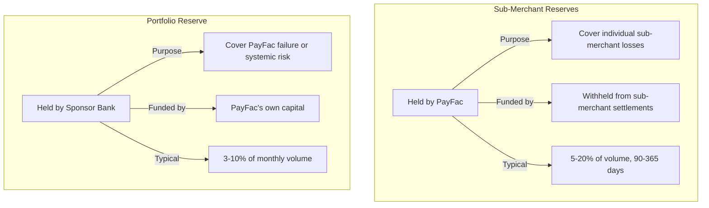

# Financial Requirements

> **Status:** Complete
>
> **Last Updated:** 2025-12-28

## Overview

Operating as a Payment Facilitator requires significant financial resources beyond technology and operations. Sponsor banks evaluate PayFac financial strength before approval and monitor it throughout the relationship. Understanding these requirements is essential for PayFac planning and sustainability.

## Why Financial Strength Matters

### Sponsor Bank Perspective

Sponsor banks require financial strength because:

1. **Liability Buffer:** PayFac is liable for all sub-merchant losses; sponsor needs confidence PayFac can cover
2. **Regulatory Compliance:** Banks must ensure their PayFac partners are financially sound
3. **Network Standing:** Weak PayFac financials can impact sponsor's network relationships
4. **Business Continuity:** PayFac failure creates chaos for sub-merchants and sponsor

### Financial Evaluation Criteria

| Criteria | What Sponsors Look For |
|----------|------------------------|
| **Net Worth** | Adequate capital relative to processing volume |
| **Liquidity** | Cash or equivalents to cover immediate obligations |
| **Profitability** | Sustainable business model |
| **Debt Levels** | Reasonable leverage ratios |
| **Insurance** | Appropriate coverage for risks |
| **Growth Rate** | Sustainable growth vs. overextension |

## Minimum Net Worth Requirements

### Typical Thresholds

**Based on Processing Volume:**

| Monthly Volume | Typical Net Worth Requirement |
|----------------|-------------------------------|
| Under $1M | $500k - $1M |
| $1M - $5M | $1M - $3M |
| $5M - $20M | $3M - $5M |
| $20M - $50M | $5M - $10M |
| Over $50M | $10M+ (negotiated) |

### Net Worth Calculation

**What Counts:**
- Cash and cash equivalents
- Marketable securities
- Accounts receivable (quality adjusted)
- Property and equipment (depreciated value)
- Other tangible assets

**What Doesn't Count:**
- Goodwill and intangible assets
- Related party receivables
- Restricted cash (reserves held by sponsor)
- Assets encumbered by debt

**Formula:**
```
Net Worth = Total Assets - Total Liabilities - Intangible Assets
```

### Audit Requirements

**Annual Financial Statements:**
- CPA-prepared (reviewed or audited based on size)
- GAAP-compliant
- Submitted to sponsor within 90-120 days of fiscal year end

**What Sponsors Review:**
- Balance sheet analysis
- Income statement trends
- Cash flow sufficiency
- Key financial ratios

**Key Ratios Monitored:**

| Ratio | Target | Concern Level |
|-------|--------|---------------|
| Current Ratio | Above 1.5 | Below 1.0 |
| Debt-to-Equity | Below 2.0 | Above 3.0 |
| Quick Ratio | Above 1.0 | Below 0.5 |
| Profit Margin | Above 5% | Below 0% |

### What Happens If Net Worth Drops

**Below Threshold Triggers:**
1. Sponsor notification requirement
2. Remediation plan required
3. Potential onboarding freeze
4. Increased reserve requirements
5. Enhanced monitoring

**Failure to Remediate:**
- Sponsor bank termination notice
- Wind-down of sub-merchant portfolio
- Potential MATCH reporting

## Insurance Requirements

### Errors & Omissions (E&O) Insurance

**Coverage Purpose:**
- Professional negligence claims
- Failure to perform services
- Misrepresentation
- Incorrect advice or guidance

**Typical Requirements:**

| Processing Volume | Coverage Amount | Est. Annual Premium |
|-------------------|-----------------|---------------------|
| Under $5M/month | $1M - $2M | $15k - $25k |
| $5M - $20M/month | $2M - $5M | $25k - $50k |
| Over $20M/month | $5M - $10M | $50k - $100k |

**Key Coverage Elements:**
- Defense costs
- Settlement payments
- Regulatory investigation costs
- Claims from sub-merchants

### Cyber Liability Insurance

**Coverage Purpose:**
- Data breach response costs
- Notification expenses
- Credit monitoring for affected individuals
- Regulatory fines (where insurable)
- Business interruption from cyber events
- Ransomware payments (some policies)

**Typical Requirements:**

| Processing Volume | Coverage Amount | Est. Annual Premium |
|-------------------|-----------------|---------------------|
| Under $5M/month | $1M - $2M | $10k - $20k |
| $5M - $20M/month | $2M - $5M | $20k - $40k |
| Over $20M/month | $5M - $10M | $40k - $80k |

**Why Critical for PayFacs:**
- Handle sensitive cardholder data
- Sub-merchant data exposure risk
- PCI DSS breach implications
- Regulatory notification requirements

### Fidelity Bond

**Coverage Purpose:**
- Employee theft
- Fraud by insiders
- Embezzlement
- Fund diversion

**Typical Requirements:**
- Coverage: $500k - $2M
- Annual Premium: $5k - $15k

**Why Required:**
- PayFacs handle significant fund flows
- Employee access to payment systems
- Settlement and disbursement controls

### Crime Insurance

**Coverage Purpose:**
- Third-party fraud
- Computer fraud
- Funds transfer fraud
- Social engineering attacks

**Typical Requirements:**
- Often combined with cyber liability
- Coverage: $1M - $5M
- Annual Premium: $10k - $30k

### Insurance Cost Summary

**Total Annual Insurance Budget:**

| Processing Volume | E&O | Cyber | Fidelity | Total |
|-------------------|-----|-------|----------|-------|
| $5M/month | $25k | $20k | $8k | ~$53k |
| $10M/month | $40k | $30k | $10k | ~$80k |
| $25M/month | $60k | $50k | $12k | ~$122k |

## Reserve Capital

### Two Types of Reserves



### Portfolio Reserve Requirements

**Calculation Factors:**

| Factor | Impact on Reserve |
|--------|-------------------|
| Processing Volume | Higher volume = larger reserve |
| High-Risk MCC % | More high-risk = higher reserve |
| Portfolio CBR | Higher CBR = higher reserve |
| PayFac Financial Strength | Weaker = higher reserve |
| Sponsor Risk Tolerance | Conservative sponsor = higher reserve |

**Typical Calculation:**

```
Base Reserve = Monthly Volume × Reserve Percentage

Reserve Percentage Ranges:
- Low-risk portfolio: 3-5%
- Mixed portfolio: 5-7%
- High-risk portfolio: 7-10%

Example: $10M/month, mixed portfolio
Reserve = $10M × 6% = $600,000
```

### Reserve Funding

**Initial Funding:**
- Must fund before processing begins
- Cash or letter of credit
- Some sponsors allow phase-in over 6-12 months

**Ongoing Adjustments:**
- Quarterly review based on portfolio performance
- Increases if CBR rises or risk increases
- Decreases possible with strong performance (rare)

### Reserve Release

**When Released:**
- PayFac relationship termination
- Wind-down period completion
- All chargeback periods expired (180+ days)

**Release Timing:**
- Typically 6-12 months after last transaction
- May be extended if disputes pending

## Liquidity Requirements

### Operating Capital Needs

**Cash Requirements:**

| Purpose | Typical Requirement |
|---------|---------------------|
| Chargeback Coverage | 2-3 months of expected chargebacks |
| Settlement Float | 2-5 days of daily volume |
| Operating Expenses | 3-6 months runway |
| Reserve Funding | Per sponsor requirements |

**Example: $10M/month Processing**

```
Chargeback Coverage (0.5% CBR):
  Monthly chargebacks: $50k
  3-month coverage: $150k

Settlement Float (2 days):
  Daily volume: ~$333k
  2-day float: $666k

Operating Expenses (3 months):
  Monthly OpEx: $200k
  3-month runway: $600k

Portfolio Reserve: $600k

Total Liquidity Need: ~$2M
```

### Cash Flow Management

**Settlement Timing:**
- Networks settle T+1 or T+2 to sponsor
- PayFac receives from sponsor T+2 or T+3
- Sub-merchant payouts vary (instant to weekly)

**Float Challenge:**
- If sub-merchants get instant payouts
- PayFac funds before receiving from sponsor
- Requires working capital or credit facility

**Cash Flow Example:**

| Day | Activity | Impact |
|-----|----------|--------|
| Mon | Sub-merchant processes $100k | - |
| Tue | Sub-merchant wants instant payout | PayFac funds $100k |
| Wed | Network settles to sponsor | - |
| Thu | Sponsor settles to PayFac | PayFac receives $100k |

**Float Period:** 2 days × $100k = $200k working capital needed

### Credit Facilities

**Types of Facilities:**

| Type | Purpose | Typical Terms |
|------|---------|---------------|
| **Revolving Line** | Operating cash flow | 1-3% over Prime |
| **Term Loan** | Capital investment | 5-10% fixed |
| **Letter of Credit** | Reserve funding | 1-2% annual fee |

**When Needed:**
- Instant payout products
- Rapid growth periods
- Seasonal volume fluctuations
- Reserve requirements exceed available cash

## Capital Planning Example

### Startup PayFac: $5M/month Target

**Year 1 Capital Requirements:**

| Category | Amount |
|----------|--------|
| **Net Worth Requirement** | $1,500,000 |
| **Portfolio Reserve** | $300,000 (6% × $5M) |
| **Insurance (annual)** | $55,000 |
| **Operating Capital** | $500,000 |
| **Technology Investment** | $200,000 |
| **Working Capital Buffer** | $250,000 |
| **Total Capital Need** | **~$2.8M** |

### Growing PayFac: $5M to $20M/month

**Capital Growth Requirements:**

| Metric | Year 1 | Year 2 | Year 3 |
|--------|--------|--------|--------|
| Monthly Volume | $5M | $12M | $20M |
| Net Worth Required | $1.5M | $3M | $5M |
| Portfolio Reserve | $300k | $720k | $1.2M |
| Insurance | $55k | $80k | $100k |
| Operating Capital | $500k | $1M | $1.5M |
| **Total Capital** | **$2.4M** | **$4.8M** | **$7.8M** |

**Growth Funding Sources:**
- Retained earnings
- Equity investment
- Debt financing
- Strategic partnership

## Self-Assessment Questions

### Question 1

**A startup plans to become a PayFac processing $5M/month. Calculate the approximate first-year capital requirements including net worth, reserves, insurance, and operating capital.**

<details>
<summary>Answer</summary>

**Capital Requirements Calculation:**

**Net Worth:**
- At $5M/month, typical requirement: $1.5M - $2M
- Use: **$1.75M** (midpoint)

**Portfolio Reserve:**
- Assuming mixed-risk portfolio: 6%
- $5M × 6% = **$300,000**

**Insurance (Annual):**
| Type | Coverage | Premium |
|------|----------|---------|
| E&O | $2M | $25,000 |
| Cyber | $2M | $20,000 |
| Fidelity | $1M | $8,000 |
| **Total** | | **$53,000** |

**Operating Capital:**
- Chargeback coverage (3 months): $75,000
- Settlement float (2 days): $333,000
- Operating runway (3 months): $150,000
- **Total:** ~$550,000

**Working Capital Buffer:**
- Unexpected needs, growth: $250,000

**Total First-Year Capital:**
```
Net Worth:        $1,750,000
Portfolio Reserve:  $300,000
Insurance:          $53,000
Operating Capital:  $550,000
Buffer:            $250,000
---------------------------------
Total:           ~$2.9M
```

**Funding Strategy:**
- Equity: $2M
- Debt/LOC: $900k
- Or: $2.9M all equity for stronger position
</details>

### Question 2

**Your PayFac has experienced rapid growth: volume doubled from $10M to $20M/month in 6 months. What financial adjustments are likely required?**

<details>
<summary>Answer</summary>

**Required Adjustments:**

**Net Worth:**
- Previous: $3M (for $10M/month)
- Required: $5M (for $20M/month)
- Gap: **$2M additional capital needed**

**Portfolio Reserve:**
- Previous: $600k (6% of $10M)
- Required: $1.2M (6% of $20M)
- Additional funding: **$600k**

**Operating Capital:**
- Settlement float doubled: +$666k
- Chargeback coverage doubled: +$50k
- Additional need: **~$700k**

**Insurance:**
- May need coverage increases
- E&O: $2M → $5M
- Cyber: $2M → $5M
- Additional premium: **~$25k-$40k/year**

**Total Additional Capital: ~$3.3M**

**Timing Pressure:**
- Reserve increase: Sponsor typically requires 30-60 days
- Net worth: May have grace period but expect compliance
- Operating capital: Immediate if offering instant payouts

**Lessons:**
1. Plan capital for target volume, not current volume
2. Maintain ongoing relationship with investors/lenders
3. Growth without capital = operational risk
4. Sponsor monitors financial covenants closely
</details>

### Question 3

**Your sponsor bank notifies you that net worth has dropped below the required threshold due to operating losses. What are the likely consequences and required actions?**

<details>
<summary>Answer</summary>

**Likely Consequences:**

**Immediate:**
- Formal notification from sponsor
- Enhanced monitoring status
- Weekly or daily reporting requirements
- Onboarding freeze (new sub-merchants)

**30-60 Days:**
- Mandatory remediation plan
- Timeline for restoring net worth
- Potential reserve increase
- Board/management attestations

**If Not Remediated:**
- Sponsor termination notice (30-90 days)
- Sub-merchant wind-down required
- MATCH reporting risk (depending on circumstances)
- Industry reputation impact

**Required Actions:**

**Week 1:**
1. Acknowledge notification in writing
2. Engage board/investors immediately
3. Begin financial analysis

**Week 2-4:**
1. Develop remediation plan:
   - Capital injection timeline
   - Cost reduction measures
   - Revenue enhancement initiatives
2. Submit plan to sponsor

**Month 2-3:**
1. Execute capital raise
2. Implement cost reductions
3. Report progress weekly to sponsor

**Prevention:**
- Monitor net worth monthly (not just quarterly)
- Build buffer above minimum (125% of requirement)
- Maintain relationship with investors for rapid capital calls
- Consider credit facilities for emergencies

**Key Insight:** Net worth deficiency is serious but recoverable if addressed quickly and transparently. Hiding or delaying makes it worse.
</details>

## Related Topics

- [Sponsor Delegation](./sponsor-delegation.md) - How financial requirements fit into sponsor relationship
- [Portfolio Risk Management](./portfolio-risk.md) - Managing portfolio to protect financial position
- [Sub-Merchant Management](./sub-merchant-management.md) - Reserve management at sub-merchant level

## References

- Sponsor bank financial requirements (varies by institution)
- Payment industry insurance requirements
- GAAP financial statement standards
- Card network financial requirements for acquirers
