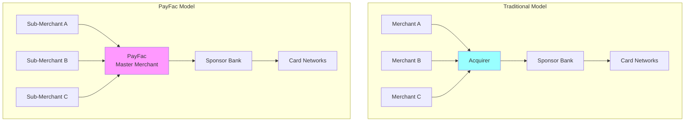

# PayFac Considerations

> **Status:** Complete
>
> **Last Updated:** 2025-12-28

## Overview

Payment Facilitators (PayFacs) have unique onboarding responsibilities that differ from traditional merchant onboarding. As a master merchant, the PayFac inherits underwriting, compliance, and risk management duties delegated by the sponsor bank. Understanding these responsibilities is critical for PayFac platform operations.

## What You'll Learn

- **[Sponsor Delegation](./sponsor-delegation.md)** - What responsibilities transfer from sponsor bank to PayFac
- **[Portfolio Risk](./portfolio-risk.md)** - Aggregate risk management across all sub-merchants
- **[Network Requirements](./network-requirements.md)** - Visa, Mastercard, VIRP, and VAMP compliance
- **[Sub-Merchant Management](./sub-merchant-management.md)** - MID structure, identification, and graduation
- **[Financial Requirements](./financial-requirements.md)** - Capital, insurance, and reserve requirements
- **[Quiz](./quiz.md)** - Test your understanding with 16 comprehensive questions

## Why PayFac Onboarding Is Different

### Traditional Merchant Onboarding

- Acquirer underwrites each merchant individually
- Sponsor bank approves each merchant
- Direct relationship: Merchant ↔ Acquirer ↔ Sponsor Bank

### PayFac Sub-Merchant Onboarding

- PayFac underwrites sub-merchants
- Sponsor bank approves PayFac's underwriting program (not each merchant)
- Indirect relationship: Sub-Merchant ↔ PayFac ↔ Sponsor Bank

## Key Differences

| Aspect | Traditional Acquirer | PayFac |
|--------|---------------------|---------|
| **Underwriting** | Bank underwrites each merchant | PayFac underwrites sub-merchants |
| **MID Assignment** | Unique MID per merchant | Sub-merchants share PayFac's MID |
| **Liability** | Bank liable for merchant losses | PayFac liable for sub-merchant losses |
| **Compliance** | Bank ensures merchant compliance | PayFac ensures sub-merchant compliance |
| **Reserves** | Bank holds merchant reserves | PayFac holds sub-merchant reserves |
| **MATCH Reporting** | Bank reports to MATCH | PayFac reports to MATCH |
| **Approval Authority** | Bank approves each merchant | PayFac approves sub-merchants (within program) |

## Topics Covered

### [Sponsor Delegation](./sponsor-delegation.md)

What responsibilities the sponsor bank delegates to the PayFac:

- Sub-merchant underwriting and approval
- KYC/KYB verification
- Sanctions screening
- Ongoing monitoring
- MATCH list reporting
- Sponsor bank audit mechanics

### [Portfolio Risk](./portfolio-risk.md)

Managing aggregate risk across all sub-merchants:

- Portfolio-level monitoring
- Concentration risk (industry, geography, volume)
- Aggregate chargeback ratios
- Network chargeback programs (VAMP, ECP)
- Risk-based pricing strategies

### [Network Requirements](./network-requirements.md)

Card network registration and compliance:

- Visa PayFac registration and VROL access
- Mastercard requirements and MATCH obligations
- VIRP (Visa Integrity Risk Program) for high-risk MCCs
- Network audit rights and preparation

### [Sub-Merchant Management](./sub-merchant-management.md)

MID structure and sub-merchant lifecycle:

- Master MID vs. Sub-Merchant ID (SMID)
- Descriptor requirements
- Chargeback routing mechanics
- Graduation process to direct MID

### [Financial Requirements](./financial-requirements.md)

Capital and insurance requirements:

- Minimum net worth requirements
- E&O, cyber liability, and fidelity insurance
- Portfolio reserve vs. sub-merchant reserves
- Liquidity and operating capital planning

## PayFac Onboarding Challenges

### Balancing Speed and Risk

**Challenge:** PayFacs promise fast onboarding (hours, not days) while maintaining compliance

**Solution:** Automated risk scoring, data validation, and risk-based decisioning

### Sub-Merchant Volume Limits

**Challenge:** Individual sub-merchants growing beyond PayFac program limits

**Solution:** Volume caps, graduation to direct MID, tiered underwriting

### Sponsor Bank Oversight

**Challenge:** Demonstrating effective risk management to sponsor bank

**Solution:** Robust reporting, audit trails, policy documentation, regular reviews

### Regulatory Compliance

**Challenge:** Inheriting compliance obligations for potentially thousands of sub-merchants

**Solution:** Automated compliance workflows, third-party verification services, dedicated compliance team

## Self-Assessment

Test your understanding with the **[PayFac Considerations Quiz](./quiz.md)** - 16 comprehensive questions covering sponsor delegation, portfolio risk, network requirements, and financial considerations.

---

## Navigation

| Previous | Up | Next |
|----------|-----|------|
| [Merchant Lifecycle](../merchant-lifecycle/index.md) | [Onboarding Module](../index.md) | [Sponsor Delegation](./sponsor-delegation.md) |
