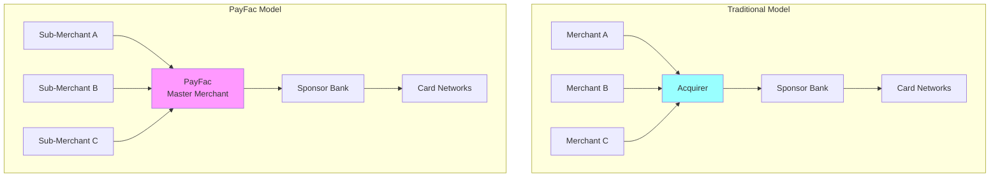

# PayFac Considerations

> **Status:** Pending content development

## Overview

Payment Facilitators (PayFacs) have unique onboarding responsibilities that differ from traditional merchant onboarding. As a master merchant, the PayFac inherits underwriting, compliance, and risk management duties delegated by the sponsor bank. Understanding these responsibilities is critical for PayFac platform operations.

## What You'll Learn

- **Sponsor Delegation** - What responsibilities transfer from sponsor bank to PayFac
- **Portfolio Risk** - Aggregate risk management across all sub-merchants

## Why PayFac Onboarding Is Different

### Traditional Merchant Onboarding

- Acquirer underwrites each merchant individually
- Sponsor bank approves each merchant
- Direct relationship: Merchant ↔ Acquirer ↔ Sponsor Bank

### PayFac Sub-Merchant Onboarding

- PayFac underwrites sub-merchants
- Sponsor bank approves PayFac's underwriting program (not each merchant)
- Indirect relationship: Sub-Merchant ↔ PayFac ↔ Sponsor Bank

## Key Differences

| Aspect | Traditional Acquirer | PayFac |
|--------|---------------------|---------|
| **Underwriting** | Bank underwrites each merchant | PayFac underwrites sub-merchants |
| **MID Assignment** | Unique MID per merchant | Sub-merchants share PayFac's MID |
| **Liability** | Bank liable for merchant losses | PayFac liable for sub-merchant losses |
| **Compliance** | Bank ensures merchant compliance | PayFac ensures sub-merchant compliance |
| **Reserves** | Bank holds merchant reserves | PayFac holds sub-merchant reserves |
| **MATCH Reporting** | Bank reports to MATCH | PayFac reports to MATCH |
| **Approval Authority** | Bank approves each merchant | PayFac approves sub-merchants (within program) |

## Topics Covered

### Sponsor Delegation

What responsibilities the sponsor bank delegates to the PayFac:

- Sub-merchant underwriting and approval
- KYC/KYB verification
- Sanctions screening
- Ongoing monitoring
- MATCH list reporting
- PCI compliance oversight
- Chargeback management

### Portfolio Risk

Managing aggregate risk across all sub-merchants:

- Portfolio-level monitoring
- Concentration risk (industry, geography, volume)
- Aggregate chargeback ratios
- Fraud rates across portfolio
- Sponsor bank reporting requirements

## PayFac Onboarding Challenges

### Balancing Speed and Risk

**Challenge:** PayFacs promise fast onboarding (hours, not days) while maintaining compliance

**Solution:** Automated risk scoring, data validation, and risk-based decisioning

### Sub-Merchant Volume Limits

**Challenge:** Individual sub-merchants growing beyond PayFac program limits

**Solution:** Volume caps, graduation to direct MID, tiered underwriting

### Sponsor Bank Oversight

**Challenge:** Demonstrating effective risk management to sponsor bank

**Solution:** Robust reporting, audit trails, policy documentation, regular reviews

### Regulatory Compliance

**Challenge:** Inheriting compliance obligations for potentially thousands of sub-merchants

**Solution:** Automated compliance workflows, third-party verification services, dedicated compliance team

## Self-Assessment

Complete the quiz questions in the study guide to test your understanding of PayFac-specific onboarding considerations.

---

> **Next:** Explore sponsor delegation and portfolio risk management in detail.
