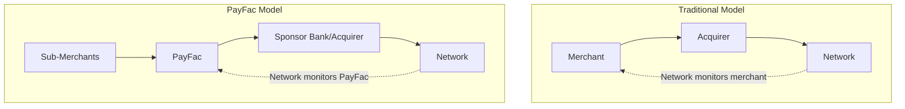

# Network Requirements

> **Status:** Complete
>
> **Last Updated:** 2025-12-28

## Overview

Payment Facilitators must register with each card network they process transactions for. This registration creates specific compliance obligations, monitoring requirements, and fee structures that differ from traditional merchant accounts.

### Why Network Registration Matters



**Key Distinctions:**
- **Traditional:** Network monitors individual merchant directly
- **PayFac:** Network monitors PayFac as a single entity; PayFac monitors sub-merchants

### Network Registration vs. Sponsor Bank Relationship

| Aspect | Sponsor Bank | Card Network |
|--------|--------------|--------------|
| **Role** | Provides processing capability | Provides transaction routing and rules |
| **Approval** | Approves PayFac program | Registers PayFac as participant |
| **Monitoring** | Portfolio-level performance | Compliance with network rules |
| **Liability** | Financial guarantor | Rule enforcement |
| **Relationship** | Contractual | Regulatory |

## Visa PayFac Requirements

### Registration Process

**Steps to Visa PayFac Registration:**

1. **Sponsor Bank Selection:** Identify acquiring bank willing to sponsor PayFac program
2. **Program Submission:** Sponsor bank submits PayFac application to Visa
3. **Review:** Visa reviews program structure, compliance capabilities
4. **Approval:** Visa grants PayFac registration
5. **VROL Access:** PayFac receives access to Visa Resolve Online

**Timeline:** 60-120 days typically

### VROL (Visa Resolve Online)

Visa's dispute management system that PayFacs must use:

- **Chargeback Notification:** Real-time alerts for disputes
- **Representment:** Submit evidence to fight chargebacks
- **Arbitration:** Escalate disputed cases
- **Reporting:** Access dispute metrics and trends

**Requirement:** All PayFacs must have VROL access and trained staff

### Visa VAMP (Acquirer Monitoring Program)

:::warning Time-Sensitive Information
Visa significantly restructured VAMP effective April 2025. PayFacs are now monitored at the **acquirer level** with much stricter thresholds (0.50%) than merchant-level thresholds.
:::

**Acquirer-Level Thresholds (For PayFacs - Effective April 2025):**

| Tier | Dispute Ratio | Effective Date | Monthly Fines |
|------|---------------|----------------|---------------|
| **Excessive** | 0.50% (50 bps) | April 1, 2025 | $25,000 - $100,000+ |
| **Above Standard** | 0.30% - 0.50% | January 1, 2026 | $10,000 - $25,000 |

**Merchant-Level Thresholds (For Individual Sub-Merchants):**

| Tier | Dispute Ratio | Effective Date | Region |
|------|---------------|----------------|--------|
| **Excessive** | 1.5% | June 1, 2025 | All regions |
| **Excessive** | 0.9% | April 1, 2026 | NA, EU, APAC only |

**Key Distinction:** PayFacs are monitored at the **acquirer portfolio level** (0.50% threshold), which is much stricter than individual merchant thresholds (0.9-1.5%). A PayFac portfolio exceeding 0.50% aggregate dispute ratio triggers VAMP, even if no individual sub-merchant exceeds 0.9%.

**Portfolio Impact:**
- VAMP applies at the **acquirer level** (entire PayFac portfolio)
- Target portfolio dispute ratio: below 0.40% for safety margin
- All sub-merchants contribute to aggregate ratio
- Single high-CBR sub-merchant affects entire portfolio

### Visa Sub-Merchant Identification

**Required Data Elements:**

| Field | Description | Example |
|-------|-------------|---------|
| **Sub-Merchant ID** | Unique identifier | SM-123456 |
| **Legal Name** | Business legal name | Acme Corp LLC |
| **DBA** | Doing Business As | Joe's Coffee |
| **MCC** | Merchant Category Code | 5812 |
| **Address** | Business location | 123 Main St |
| **Descriptor** | Statement descriptor | PAY*JOESCOFFEE |

**Descriptor Requirements:**
- Format: `PayFac*SubMerchantName`
- Must be recognizable to cardholder
- Customer service phone recommended

## Mastercard PayFac Requirements

### Registration Process

**Steps to Mastercard PayFac Registration:**

1. **Sponsor Relationship:** Establish acquiring bank partnership
2. **Program Documentation:** Submit compliance and operational procedures
3. **MATCH Access:** Obtain access to terminated merchant database
4. **Registration:** Formal registration as Payment Facilitator
5. **MasterCom Access:** Dispute management system access

### MATCH List Requirements

**Member Alert to Control High-Risk (Merchants)**

**Query Obligations:**
- Check MATCH before approving any sub-merchant
- Search by business name, owner name, tax ID
- Document all search results

**Reporting Obligations:**
- Report terminated sub-merchants within **5 business days**
- For fraud-related terminations: Report within 24-48 hours
- Use correct reason codes (14 total)
- Include required data elements

**Reason Codes:**

| Code | Reason |
|------|--------|
| 01 | Account Data Compromise |
| 02 | Common Point of Purchase |
| 03 | Laundering |
| 04 | Excessive Chargebacks |
| 05 | Excessive Fraud |
| 06 | Violation of Standards |
| 07 | Fraud Conviction |
| 08 | Mastercard Questionable Merchant |
| 09 | Bankrupt/Liquidation/Insolvency |
| 10 | Violation of Agreement |
| 11 | Business Activity Termination |
| 12 | Identity Theft |
| 13 | PCI-DSS Non-compliance |
| 14 | Illegal Transactions |

### Mastercard ECP (Excessive Chargeback Program)

**Thresholds:**

| Tier | Chargeback Ratio | Chargeback Count | Assessment |
|------|------------------|------------------|------------|
| **ECM** (Excessive Chargeback Merchant) | 1.5% | 100 | $1,000 - $25,000/month |
| **HECM** (High Excessive Chargeback Merchant) | 3.0% | 300 | $25,000 - $200,000/month |

:::info Threshold Logic
Mastercard ECP uses **OR** logic: merchants trigger the program if they exceed EITHER the ratio threshold OR the count threshold (not both). A merchant with 0.5% CBR but 150 chargebacks still enters ECM.
:::

**Key Difference from Visa:**
- ECP applies at **merchant level** (individual sub-merchants)
- PayFac must manage sub-merchants individually
- BUT aggregated reporting to sponsor

### MasterCom

Mastercard's dispute management platform:

- **Case Management:** Track disputes end-to-end
- **Document Exchange:** Upload representment evidence
- **Messaging:** Communicate with issuers
- **Reporting:** Dispute analytics and trends

## VIRP (Visa Integrity Risk Program)

### Overview

VIRP governs high-risk merchant categories requiring enhanced oversight and registration.

### Tier Classification

**Tier 1 (Highest Risk):**

| MCC | Description |
|-----|-------------|
| 5967 | Direct Selling (Nutraceuticals, supplements) |
| 7995 | Gambling |
| 7273 | Dating/Escort Services |
| 5122 | Drugs, Drug Proprietaries, Druggist Sundries |
| 5912 | Drug Stores, Pharmacies |

:::info NABP Exemption
MCCs 5122 and 5912 are **exempt** from VIRP Tier 1 fees if accredited by the National Association of Boards of Pharmacy (NABP). Verify accreditation before onboarding pharmacy merchants.
:::

**Tier 2 (Elevated Risk):**

| MCC | Description |
|-----|-------------|
| 5966 | Direct Marketing - Outbound Telemarketing |
| 7841 | Video Tape Rental (certain adult content) |
| 5962 | Telemarketing - Travel Related |

### VIRP Fees

**Registration Fee:**
- **$950 per sub-merchant** (Tier 1)
- One-time fee upon registration
- Required before processing

**Integrity Risk Fee:**
- **$0.10 per transaction**
- **0.10% of transaction volume**
- Ongoing fee on all transactions

**Example Impact:**

| Processing | Transactions | Txn Fee | Volume Fee | Total Monthly |
|------------|--------------|---------|------------|---------------|
| $50,000/mo | 2,000 | $200 | $50 | $250 |
| $100,000/mo | 4,000 | $400 | $100 | $500 |
| $500,000/mo | 20,000 | $2,000 | $500 | $2,500 |

### VIRP Impact on Sub-Merchant Economics

**Break-Even Analysis:**

At low volumes, VIRP fees can exceed profit margins:

```
Registration: $950 (one-time)
Monthly fees: $250 (at $50k/month)

First-year cost: $950 + ($250 × 12) = $3,950
Effective additional cost: 0.66% of annual volume

Minimum viable volume: ~$25k/month to be economical
```

**PayFac Considerations:**
- Set minimum volume requirements for VIRP MCCs
- Pass-through fees to sub-merchants
- Evaluate if VIRP categories fit program

## Discover and American Express

### Discover

**Aggregator Program:**
- Similar structure to Visa/Mastercard
- Registration through sponsor bank
- Sub-merchant identification requirements
- Dispute management through separate system

**Requirements:**
- Sponsor bank must have Discover agreement
- Sub-merchant data reporting
- Compliance with Discover Operating Regulations

### American Express

**Payment Service Provider Program:**
- Different structure than Visa/MC
- May require separate agreement
- OptBlue program for smaller merchants

**Requirements:**
- AmEx merchant of record relationship
- Sub-merchant disclosure requirements
- Compliance with AmEx policies

### When All Four Networks Are Needed

Most PayFacs start with Visa/Mastercard only, then add:

**Add Discover when:**
- Sub-merchants request it
- Volume justifies additional compliance burden
- Competitive positioning requires full acceptance

**Add AmEx when:**
- High-average-ticket sub-merchants (AmEx penetration higher)
- Premium market segments
- Corporate card acceptance important

## Network Audit Rights

### Visa Audit Rights

Visa can audit PayFacs for:
- Compliance with Visa Rules
- Sub-merchant identification accuracy
- Dispute management procedures
- Data security (PCI DSS)
- VIRP registration accuracy

**Audit Triggers:**
- Random selection
- VAMP program entry
- Complaint investigation
- Data breach response

### Mastercard Audit Rights

Mastercard can audit PayFacs for:
- MATCH reporting compliance
- ECP remediation
- Sub-merchant monitoring
- Network rule compliance

### Audit Preparation

**Maintain Ready Access To:**
- Complete sub-merchant files
- MATCH query and report logs
- Dispute response records
- Training documentation
- Policy and procedure manuals

## Self-Assessment Questions

### Question 1

**Your PayFac processes Visa and Mastercard. A large sub-merchant wants to accept all four major networks. What additional registrations and compliance requirements apply?**

<details>
<summary>Answer</summary>

**Additional Requirements:**

**Discover:**
- Registration through sponsor bank's Discover program
- Sub-merchant reporting to Discover
- Separate dispute management system access
- Compliance with Discover Operating Regulations

**American Express:**
- AmEx PSP (Payment Service Provider) agreement
- May require OptBlue enrollment
- Separate merchant of record considerations
- Different fee structures and disclosure requirements

**Operational Impact:**
- Four separate compliance frameworks
- Multiple dispute management systems
- Different reporting requirements
- Increased operational complexity

**Recommendation:** Evaluate whether volume justifies complexity. Start with Visa/MC, add Discover/AmEx based on sub-merchant demand and revenue opportunity.
</details>

### Question 2

**A sub-merchant applying to your PayFac is in MCC 5967 (nutraceuticals). What VIRP requirements apply and how do they impact the onboarding decision?**

<details>
<summary>Answer</summary>

**VIRP Tier 1 Requirements:**

1. **Registration Fee:** $950 one-time per sub-merchant
2. **Integrity Risk Fee:** $0.10/txn + 0.10% volume (ongoing)
3. **Enhanced Due Diligence:** Additional verification documentation
4. **Sponsor Approval:** Explicit approval required for Tier 1 MCCs

**Onboarding Decision Factors:**

| Factor | Consideration |
|--------|---------------|
| **Volume** | Is volume sufficient to absorb VIRP fees? |
| **Margin** | Does pricing cover additional costs? |
| **Risk** | Higher chargeback potential in nutraceuticals |
| **Sponsor** | Has sponsor approved this MCC category? |

**Minimum Viable Volume:**
- At $25k/month: VIRP fees = ~$75/month = 0.3% extra cost
- Below $15k/month: Often not economical

**Decision:** Approve only if volume >$25k/month, pricing covers VIRP fees + enhanced reserves, and sponsor has approved nutraceutical sub-merchants.
</details>

### Question 3

**Your portfolio's aggregate chargeback ratio is approaching 0.9%. What specific Visa and Mastercard programs are you at risk of triggering?**

<details>
<summary>Answer</summary>

**Visa VAMP:**
- **At 0.9%:** Early Warning threshold reached
- **Action Required:**
  - Develop remediation plan
  - Identify top chargeback sources
  - Monthly monitoring begins
  - No fines yet but documented warning

**Mastercard ECP:**
- **At 0.9%:** Below ECMP threshold (1.0%)
- **BUT:** Individual sub-merchants may already be in ECMP if they have >1.0% ratio + 100 chargebacks
- **Action:** Audit individual sub-merchant CBRs

**Critical Actions:**

1. **Immediate:**
   - Identify top 20 sub-merchants by chargeback volume
   - Implement enhanced monitoring
   - Communicate with sponsor bank

2. **30 Days:**
   - Tighten underwriting criteria
   - Terminate highest-CBR sub-merchants
   - Implement fraud prevention tools

3. **60-90 Days:**
   - Target portfolio CBR below 0.75%
   - Document all remediation efforts
   - Prepare for potential 2026 threshold tightening (0.9% becomes standard)
</details>

## Related Topics

- [Sponsor Delegation](./sponsor-delegation.md) - How network compliance relates to sponsor oversight
- [Portfolio Risk Management](./portfolio-risk.md) - Managing aggregate metrics
- [Sub-Merchant Management](./sub-merchant-management.md) - MID structure and identification

## References

- Visa Core Rules and Visa Product and Service Rules
- Visa Payment Facilitator Model Guidelines
- Mastercard Rules Manual
- Mastercard Payment Facilitator Standards
- VIRP Registration Requirements
- MATCH User Guide
