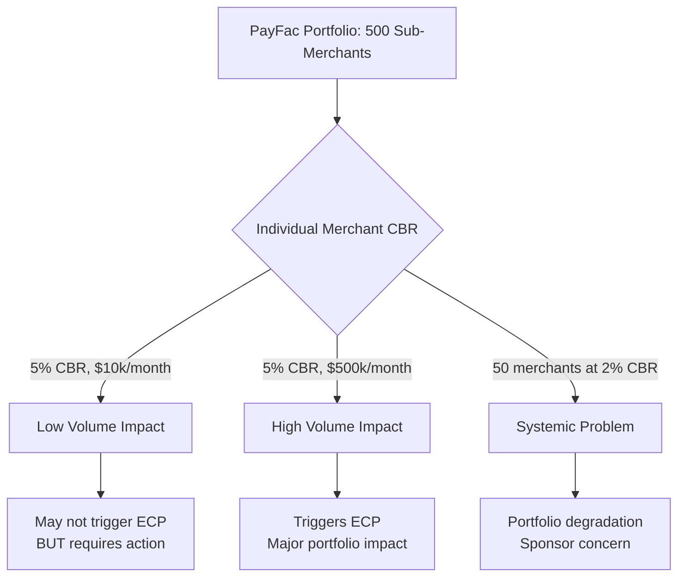
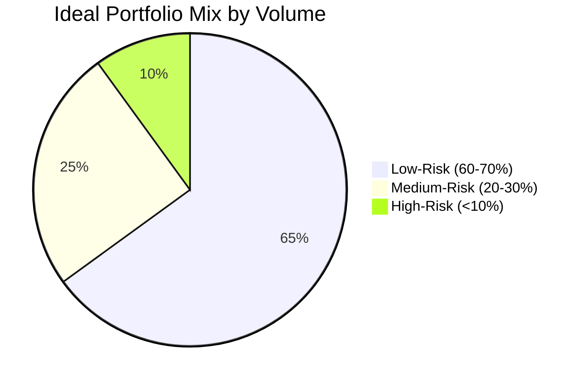

# Portfolio Risk Management

> **Status:** Complete
>
> **Last Updated:** 2025-12-28

## Overview

Unlike traditional acquirers who manage individual merchant risk, PayFacs must also manage portfolio-level risk - the aggregate exposure across all sub-merchants. A healthy portfolio is critical for maintaining sponsor bank relationships and card network standing.

### What Is Portfolio Risk?

Portfolio risk is the cumulative risk exposure from all sub-merchants, including:

- **Aggregate Losses** - Total chargebacks, fraud, and financial losses
- **Concentration Risk** - Over-exposure to specific industries, geographies, or business types
- **Systemic Risk** - Common vulnerabilities affecting multiple sub-merchants
- **Reputational Risk** - Bad actors damaging the PayFac's standing

### Why Portfolio Risk Matters

#### Sponsor Bank Relationship

Sponsor banks evaluate PayFacs on portfolio performance:
- Aggregate chargeback ratio (all sub-merchants combined)
- Portfolio fraud rate
- Concentration in high-risk MCCs
- Termination rates and MATCH reporting frequency

**Poor portfolio performance can result in:**
- Increased reserves required from PayFac
- Restrictions on new sub-merchant onboarding
- Mandatory remediation plans
- Sponsor bank termination (loss of processing ability)

#### Card Network Standing

Card networks monitor PayFacs for:
- Excessive chargeback programs (threshold breaches)
- Fraud monitoring program violations
- Compliance with network rules

**Network violations can trigger:**
- Fines and penalties
- Enhanced monitoring programs
- Suspension or termination

### Portfolio Monitoring Metrics

#### Aggregate Performance

**Chargeback Ratio:**
```
Portfolio Chargeback Ratio = Total Chargebacks / Total Transactions
```

Compare to network thresholds:

**Visa VAMP (Acquirer Level - applies to PayFacs):**
- Below 0.30%: Safe zone
- 0.30% - 0.50%: Above Standard (2026 threshold)
- Above 0.50%: Excessive - significant fines and remediation

**Mastercard ECP (Merchant Level):**
- Below 1.5%: Safe zone
- 1.5% + 100 chargebacks: ECM (Excessive Chargeback Merchant)
- 3.0% + 300 chargebacks: HECM (High Excessive)

:::warning Time-Sensitive Information
Visa significantly restructured VAMP effective April 2025. PayFacs are now monitored at the **acquirer level** with a 0.50% threshold (50 basis points), much stricter than merchant-level thresholds. Individual merchant thresholds are being phased down to 0.9% by April 2026.
:::

**Fraud Rate:**
```
Portfolio Fraud Rate = Fraud Losses / Total Volume
```

Industry average: 0.1% - 0.3% (varies by card environment)

**Sub-Merchant Attrition:**
```
Monthly Attrition = Terminated Sub-Merchants / Active Sub-Merchants
```

High attrition may indicate poor onboarding, service issues, or over-aggressive risk management.

#### Concentration Metrics

**MCC Concentration:**
```
MCC Concentration = Volume in Specific MCC / Total Portfolio Volume
```

**Risk:** Over-exposure to a single industry creates vulnerability to industry-specific events (e.g., regulatory changes, economic downturns).

**Best Practice:** Limit high-risk MCC concentration to &lt;20% of portfolio volume.

**Geographic Concentration:**
```
Geographic Concentration = Volume in Specific Region / Total Portfolio Volume
```

**Risk:** Regional economic issues or regulatory changes impact large portion of portfolio.

**Volume Concentration:**
```
Top 10 Sub-Merchant Volume = Top 10 Sub-Merchants' Volume / Total Portfolio Volume
```

**Risk:** Loss of a few large sub-merchants significantly impacts revenue and metrics.

**Best Practice:** Top 10 sub-merchants should represent &lt;30% of total volume.

### Portfolio Risk Limits

PayFacs should establish limits approved by sponsor bank:

#### Volume Limits

- Maximum sub-merchant monthly volume (e.g., $500k/month)
- Maximum sub-merchant annual volume (e.g., $5M/year)
- Portfolio volume cap (before sponsor approval required for increase)

**Graduation Path:** Sub-merchants exceeding limits may graduate to direct MID

#### MCC Restrictions

- Prohibited MCCs (e.g., adult content, gambling in some programs)
- High-risk MCC volume caps (e.g., max $1M/month in telemarketing)
- Aggregate high-risk volume (e.g., &lt;25% of portfolio)

#### Geographic Restrictions

- Approved countries for international sub-merchants
- High-risk jurisdiction exclusions
- Cross-border transaction limits

### Portfolio Diversification Strategies

#### Industry Diversification

- Target multiple industries to spread risk
- Balance high-margin high-risk with low-margin low-risk
- Avoid over-dependence on single vertical

#### Risk Tier Balancing

Maintain healthy mix:
- 60-70% low-risk sub-merchants (stable base)
- 20-30% medium-risk (growth and profitability)
- &lt;10% high-risk (highest margin but controlled exposure)

#### Geographic Diversification

- Multi-state or multi-country presence
- Avoid concentration in economically volatile regions

### Portfolio-Level Monitoring

#### Dashboards and Reporting

Track key metrics:
- Aggregate chargeback ratio (trending)
- Fraud rate by MCC and risk tier
- Sub-merchant count by status (active, suspended, terminated)
- Volume distribution by MCC
- Reserve adequacy vs. exposure

#### Early Warning Indicators

Signals of portfolio degradation:
- Chargeback ratio approaching thresholds
- Fraud rate increasing month-over-month
- High-risk MCC concentration growing
- Large sub-merchant showing early warning signs
- Multiple sub-merchants in same industry with issues

#### Remediation Actions

When portfolio metrics deteriorate:

**Preventive:**
- Tighten underwriting criteria
- Increase reserves for new high-risk sub-merchants
- Enhanced monitoring for specific MCCs
- Slow or freeze high-risk onboarding

**Corrective:**
- Terminate high-risk sub-merchants
- Require sub-merchant plan improvements
- Increase monitoring frequency
- Implement transaction limits

**Emergency:**
- Freeze all new onboarding (sponsor-mandated)
- Mass termination of high-risk portfolio segment
- Implement mandatory reserve increases

### Network Chargeback Programs

Understanding network monitoring programs is critical - breaching thresholds can result in significant fines and relationship damage with sponsor banks.

#### Visa VAMP (Visa Acquirer Monitoring Program)

VAMP monitors acquirers (and PayFacs through their sponsors) for excessive chargeback ratios.

**Acquirer-Level Thresholds (For PayFacs - Effective April 2025):**

| Tier | Dispute Ratio | Effective Date | Monthly Fines |
|------|---------------|----------------|---------------|
| **Excessive** | 0.50% (50 bps) | April 1, 2025 | $25,000 - $100,000+ |
| **Above Standard** | 0.30% - 0.50% | January 1, 2026 | $10,000 - $25,000 |

**Merchant-Level Thresholds (Individual Sub-Merchants):**

| Tier | Dispute Ratio | Effective Date | Region |
|------|---------------|----------------|--------|
| **Excessive** | 1.5% | June 1, 2025 | All regions |
| **Excessive** | 0.9% | April 1, 2026 | NA, EU, APAC only |

:::danger Critical Distinction
PayFacs are monitored at the **acquirer portfolio level** (0.50% threshold), which is much stricter than individual merchant thresholds. A PayFac portfolio exceeding 0.50% aggregate dispute ratio triggers VAMP, even if no individual sub-merchant exceeds 0.9%. Target portfolio below 0.40% for safety margin.
:::

**Portfolio Impact:**
- VAMP applies at the **acquirer/sponsor level**, not individual merchant
- For PayFacs, this means the **aggregate portfolio** chargeback ratio determines program entry
- Sponsor bank receives notifications and fines
- Sponsor passes requirements down to PayFac

**Remediation Requirements:**
1. Submit action plan within 30 days of program entry
2. Implement remediation measures (terminate high-CBR merchants, tighten underwriting)
3. Report monthly progress to sponsor
4. Exit program within 60-90 days or face escalating consequences

**Real-World Example:**
```
PayFac with 500 sub-merchants processing $50M/month:
- Total monthly transactions: 2,000,000
- Total monthly disputes: 12,000
- Chargeback ratio: 0.60%

Result: Enters VAMP Excessive tier (above 0.50%)
- Monthly fines: $25,000+
- Sponsor requires immediate remediation plan
- Must reduce portfolio CBR below 0.50% within 90 days
- Target: 0.40% for safety margin
- New onboarding likely frozen until remediated
```

#### Mastercard ECP (Excessive Chargeback Program)

ECP monitors individual merchants but aggregates at portfolio level for PayFacs.

**Thresholds:**

| Program | Threshold | Assessments | Notes |
|---------|-----------|-------------|-------|
| **ECM** (Excessive Chargeback Merchant) | 1.5% + 100 chargebacks | $1,000-$25,000/month per merchant | Applied to individual merchants |
| **HECM** (High Excessive Chargeback Merchant) | 3.0% + 300 chargebacks | $25,000-$200,000/month per merchant | Severe tier |

:::info Threshold Logic
Mastercard ECP uses **OR** logic: merchants trigger the program if they exceed EITHER the ratio threshold OR the count threshold (not both). A merchant with 0.5% CBR but 150 chargebacks still enters ECM.
:::

**Key Difference from Visa:**
- Mastercard programs apply at the **merchant level** (each sub-merchant tracked individually)
- BUT for PayFacs, sponsor bank sees **aggregate** of all merchants in programs
- Multiple sub-merchants in ECP indicates portfolio underwriting problems

**Portfolio vs Individual Merchant:**



**Why Individual High-CBR Merchants Still Matter:**
- Even if portfolio overall is healthy (0.7%), individual high-CBR merchants indicate:
  - Underwriting failures
  - Monitoring gaps
  - Potential for multiplication (similar merchants approved)
- Proactive management prevents portfolio degradation

**Example Scenario:**
```
Sub-merchant at 3% CBR processing $10k/month:
- Won't trigger network programs (volume too low)
- Portfolio impact: Negligible if isolated
- BUT: Must investigate and remediate because:
  - Demonstrates poor underwriting
  - If 50 similar merchants approved → portfolio at risk
  - Sponsor bank wants proactive management
```

#### Network Program Comparison

| Aspect | Visa VAMP | Mastercard ECP |
|--------|-----------|----------------|
| **Application Level** | Acquirer/Portfolio aggregate (0.50% for PayFacs) | Individual merchant (ECM at 1.5%, HECM at 3.0%) |
| **Threshold Logic** | AND logic (ratio + count) | OR logic (ratio OR count) |
| **Fines** | $25,000-$100,000+/month | $1,000-$200,000/month (per merchant) |
| **Remediation Period** | 60-90 days | 4 months (with milestones) |
| **Portfolio Impact** | Direct portfolio metric | Indirect (count of merchants in program) |
| **PayFac Concern** | Aggregate CBR must stay below 0.50% | Minimize count of individual merchants entering ECM/HECM |

### Reserves and Portfolio Risk

PayFac maintains reserves at two levels:

#### Sub-Merchant Reserves

Held from individual sub-merchants to cover their specific risk

#### Portfolio Reserve

PayFac's own reserve held by sponsor bank to cover portfolio-wide exposure

**Calculation Factors:**
- Portfolio volume
- Aggregate chargeback and fraud rates
- High-risk MCC concentration
- PayFac financial strength
- Sponsor risk tolerance

**Typical Range:** 5-15% of monthly portfolio volume, held for 90-180 days

### Risk-Based Pricing

PayFacs must balance competitive pricing with risk management through tiered pricing structures that reflect the true cost of risk across different merchant segments.

#### Pricing Tiers Based on Risk

| Risk Tier | Typical Pricing | Reserve | Examples |
|-----------|----------------|---------|----------|
| **Low-Risk** | 2.6% + $0.10 | 0-5% | Card-present retail, professional services |
| **Medium-Risk** | 2.9% + $0.30 | 5-10% | E-commerce, subscription services |
| **High-Risk** | 3.5% - 5.0% + $0.30 | 10-20% | Nutraceuticals, travel, high-ticket |
| **VIRP Tier 1** | 4.0%+ + $0.30 + $0.10 | 15-25% | Gambling, dating, CBD |

**VIRP (Visa Integrity Risk Program):** Additional monitoring for high-brand-risk industries with stricter requirements and higher fees.

#### Portfolio Economics

A sustainable PayFac portfolio requires careful balancing of risk tiers:



**Why This Balance Matters:**

**Can't Avoid All High-Risk:**
- High-risk merchants generate highest margins (3-5% vs 2.6%)
- Profitability requires some high-risk exposure
- Competitive differentiation - many competitors won't serve these merchants

**Can't Accept Only High-Risk:**
- Portfolio chargeback ratio would breach network thresholds
- Sponsor bank would restrict or terminate relationship
- Reserve requirements would become unsustainable
- Concentration risk too high

**Optimal Strategy:**
- **60-70% low-risk:** Stable base, consistent volume, low churn
- **20-30% medium-risk:** Growth segment, reasonable margins
- **Under 10% high-risk:** Highest margins but controlled exposure

#### Pricing vs Reserve Trade-off

Higher pricing enables higher reserves, creating self-funding risk coverage:

**High-Pricing / High-Reserve Model:**
```
Merchant pricing: 3.5% + $0.30
Reserve requirement: 20% of monthly volume
Monthly volume: $100,000

Monthly fees collected: $3,530
Reserve held: $20,000
Reserve accumulated over 6 months: $120,000

Coverage ratio: Reserve covers 3.4 months of volume
Risk buffer: Substantial protection against chargebacks
```

**Low-Pricing / Low-Reserve Model:**
```
Merchant pricing: 2.9% + $0.30
Reserve requirement: 10% of monthly volume
Monthly volume: $100,000

Monthly fees collected: $2,930
Reserve held: $10,000
Reserve accumulated over 6 months: $60,000

Coverage ratio: Reserve covers 2.1 months of volume
Risk buffer: Moderate protection, higher PayFac exposure
```

**Strategic Considerations:**

**When to Use High-Pricing/High-Reserve:**
- New sub-merchant (no processing history)
- High-risk MCC (nutraceuticals, travel)
- Delivery delays (pre-orders, custom goods)
- International merchants
- Poor credit history

**When to Use Low-Pricing/Low-Reserve:**
- Established sub-merchant (>12 months good history)
- Low-risk MCC (professional services, card-present retail)
- Immediate delivery model
- Strong financials and creditworthiness

**Portfolio-Level Reserve Strategy:**

Individual sub-merchant reserves should fund themselves:
```
Reserve Required = (Expected Chargeback Rate × 3) × Monthly Volume

Example - Medium Risk Merchant:
Expected CBR: 0.5%
Safety Multiple: 3x
Monthly Volume: $100,000

Reserve = (0.5% × 3) × $100,000 = $1,500

Hold Period: Until merchant demonstrates <0.3% CBR for 6 months
```

PayFac portfolio reserve is separate - funded by PayFac capital to cover systemic events.

### Sponsor Bank Reporting

Regular portfolio reports to sponsor:

**Monthly:**
- Aggregate performance metrics (chargebacks, fraud, volume)
- Sub-merchant counts by risk tier and status
- MCC distribution
- Top 10 sub-merchants by volume
- Terminated sub-merchants and MATCH reporting

**Quarterly:**
- Portfolio risk assessment
- Concentration analysis
- Policy exceptions and overrides
- Compliance certifications

**Annual:**
- Comprehensive portfolio review
- Underwriting policy evaluation
- System and control attestation

### Portfolio Risk vs. Sub-Merchant Risk

| Aspect | Sub-Merchant Risk | Portfolio Risk |
|--------|-------------------|----------------|
| **Focus** | Individual merchant | Aggregate across all merchants |
| **Metrics** | Merchant chargeback ratio | Portfolio chargeback ratio |
| **Action** | Approve/decline/terminate one merchant | Adjust overall underwriting criteria |
| **Impact** | Affects one relationship | Affects sponsor bank relationship |
| **Monitoring** | Real-time and periodic | Trending and forecasting |

## Practical Example

### Scenario: Portfolio Concentration Alert

**Situation:**
- PayFac has 500 sub-merchants
- 200 are in MCC 5999 (Misc. Retail - medium risk)
- These 200 represent 60% of total portfolio volume
- Industry experiences regulatory change affecting product category

**Risk:**
- Over-concentration in single MCC
- Regulatory change could trigger mass chargebacks or terminations
- Portfolio volume could drop 60% overnight

**Remediation:**
- Freeze new 5999 onboarding temporarily
- Accelerate diversification efforts (target other industries)
- Increase monitoring of existing 5999 sub-merchants
- Stress test portfolio with 5999 sub-merchant loss scenarios
- Communicate risk to sponsor bank proactively

## Self-Assessment Questions

### Question 1: Network Program Triggers
**A PayFac has 500 sub-merchants processing $50M/month with aggregate 0.65% chargeback ratio. What network programs are triggered, and what are the consequences?**

<details>
<summary>View Answer</summary>

**Programs Triggered:**

**Visa VAMP (Acquirer Level):**
- At 0.65%, the PayFac **exceeds the 0.50% Excessive threshold**
- This is a serious violation at the acquirer/portfolio level
- Monthly fines of $25,000 - $100,000+
- 60-90 day remediation period
- Must submit action plan to sponsor bank immediately

**Mastercard ECP:**
- Individual sub-merchants above 1.5% trigger ECM
- Portfolio-level 0.65% alone doesn't trigger ECP (ECP is merchant-level)
- BUT PayFac must audit individual merchant CBRs to identify any ECM triggers
- High aggregate often indicates multiple individual merchants with problems

**Consequences:**
1. Immediate notification from sponsor bank
2. Mandatory remediation plan within 30 days
3. Monthly fines ($25,000+) until ratio drops below 0.50%
4. Likely onboarding freeze until remediated
5. Enhanced weekly reporting to sponsor
6. Risk of sponsor relationship damage

**Required Actions:**
- Identify and terminate highest CBR sub-merchants
- Target portfolio below 0.40% for safety margin
- Tighten underwriting for new sub-merchants
- Implement enhanced fraud tools
- Increase reserves on existing high-risk merchants

</details>

### Question 2: Concentration Risk Analysis
**200 of a PayFac's 500 sub-merchants are MCC 5999 (Miscellaneous Retail) representing 65% of total volume. Is this concentration risky? Why or why not?**

<details>
<summary>View Answer</summary>

**Yes, this represents significant concentration risk.**

**Why It's Risky:**

1. **Single Point of Failure:** 65% of volume in one MCC means industry-specific issues could devastate the portfolio
   - Regulatory changes (e.g., product bans)
   - Economic downturns affecting retail
   - Network rule changes for the MCC

2. **Exceeds Best Practices:** Recommended maximum is 20% concentration in any single MCC

3. **Systemic Event Vulnerability:**
   - Example: COVID-19 impact on retail
   - Example: Regulatory crackdown on specific product categories

4. **Sponsor Concern:** This concentration would likely trigger sponsor bank scrutiny and potential restrictions

**Recommended Actions:**

1. **Immediate:** Freeze new MCC 5999 onboarding until concentration drops below 30%

2. **Short-term (30-90 days):**
   - Accelerate diversification efforts (target other industries)
   - Increase monitoring of existing 5999 merchants
   - Stress test: What if 50% of 5999 volume disappears?

3. **Long-term:**
   - Set MCC concentration limits in underwriting policy (max 25%)
   - Build automated alerts for concentration breaches
   - Report concentration to sponsor proactively

</details>

### Question 3: Reserve Types
**Distinguish between sub-merchant reserves and PayFac portfolio reserves. Who holds each, and what do they cover?**

<details>
<summary>View Answer</summary>

**Two Distinct Reserve Types:**

**Sub-Merchant Reserves:**
| Aspect | Details |
|--------|---------|
| **Held by** | PayFac |
| **Funded by** | Withheld from sub-merchant settlements |
| **Purpose** | Cover individual sub-merchant chargebacks, fraud, refunds |
| **Typical Range** | 5-20% of volume, 90-365 days |
| **Calculation** | Based on sub-merchant risk: MCC, processing history, delivery time |
| **Release** | After hold period if sub-merchant performs well |
| **Covers** | Individual sub-merchant failures only |

**PayFac Portfolio Reserve:**
| Aspect | Details |
|--------|---------|
| **Held by** | Sponsor bank |
| **Funded by** | PayFac's own capital |
| **Purpose** | Cover portfolio-wide exposure, systemic risk |
| **Typical Range** | 3-10% of monthly portfolio volume |
| **Calculation** | Based on: portfolio size, aggregate CBR, high-risk concentration |
| **Release** | Ongoing requirement, adjusted based on portfolio performance |
| **Covers** | Situations where sub-merchant reserves are insufficient |

**Key Difference:**
- Sub-merchant reserves protect **PayFac** from individual merchant losses
- Portfolio reserves protect **sponsor bank** from PayFac failure or systemic events

**Example:**
- PayFac processes $10M/month
- Holds $500k in sub-merchant reserves (distributed across 500 merchants)
- Sponsor holds $700k in portfolio reserve (7% of volume)
- Total reserve coverage: $1.2M against various risk scenarios

</details>

### Question 4: High-CBR Merchant Decision
**A sub-merchant has 5% chargeback ratio but processes only $10,000/month. The portfolio overall is at 0.7% CBR. How should the PayFac handle this?**

<details>
<summary>View Answer</summary>

**Analysis:**

Despite the high 5% individual CBR:
- Portfolio impact: Minimal (0.7% aggregate is healthy)
- Volume contribution: Small ($10k/month is under 1% of typical portfolio)
- Network trigger: Individual merchant doesn't trigger programs if portfolio is healthy

**However, this requires action because:**
1. 5% CBR is unsustainable for any merchant long-term
2. Multiple similar merchants would compound into portfolio problem
3. Demonstrates poor underwriting or monitoring
4. Could indicate fraud or business problems

**Recommended Actions:**

**Immediate:**
1. Contact sub-merchant to understand root cause
2. Implement enhanced monitoring
3. Set 90-day improvement deadline

**If pattern continues:**
1. Increase reserve to 25% of monthly volume
2. Implement daily funding holds
3. Require chargeback prevention training

**Remediation Target:**
- CBR must drop below 1.5% within 90 days
- Below 1.0% within 180 days

**If no improvement:**
1. Issue termination notice
2. MATCH report if required (depending on reason codes)
3. Withhold final reserves for 180+ days to cover post-termination chargebacks

**Key Lesson:** Even small merchants with high CBR need attention - they represent underwriting failures and could multiply across similar merchants.

</details>

### Question 5: Portfolio Trend Response
**Portfolio chargeback ratio is trending from 0.35% to 0.55% over 3 months. What preventive actions should a PayFac take?**

<details>
<summary>View Answer</summary>

**Trend Analysis:**
- 0.35% → 0.42% → 0.48% → 0.55% over 3 months
- **Already exceeds VAMP Excessive threshold (0.50%)**
- PayFac is in violation and facing fines
- On trajectory to worsen if no action taken

**Immediate Actions (Week 1):**

1. **Root Cause Analysis:**
   - Identify top 20 merchants by chargeback volume
   - Determine if concentrated in specific MCC, cohort, or geography
   - Check for fraud patterns or operational issues

2. **Enhanced Monitoring:**
   - Implement daily CBR tracking (vs monthly)
   - Set alerts at individual merchant level (>1.5% triggers review)

**Short-Term Actions (Month 1):**

3. **Underwriting Tightening:**
   - Increase risk scores required for approval
   - Add velocity checks (rate of new approvals)
   - Pause high-risk MCC onboarding

4. **Portfolio Cleanup:**
   - Terminate top 5 highest CBR merchants
   - Issue warnings to merchants >2% CBR
   - Implement chargeback recovery programs

5. **Communication:**
   - Proactively inform sponsor bank of trend and action plan
   - Better to disclose early than have sponsor discover

**Medium-Term Actions (Months 2-3):**

6. **Systematic Improvements:**
   - Deploy fraud prevention tools
   - Implement descriptor optimization
   - Add customer service improvements for sub-merchants

7. **Reserve Adjustments:**
   - Increase reserves on medium and high-risk merchants
   - Build portfolio reserve buffer

**Expected Outcome:**
- Stabilize within 30 days
- Decline below 0.50% within 60-90 days
- Target 0.40% for safety margin
- Minimize VAMP fine duration and avoid escalation

</details>

## Related Topics

- [Sponsor Delegation](./sponsor-delegation.md) - Responsibilities delegated to PayFac
- [Ongoing Monitoring](../merchant-lifecycle/ongoing-monitoring.md) - Individual merchant monitoring
- [Risk Factors](../underwriting/risk-factors.md) - Understanding sub-merchant risk

## References

- Visa Payment Facilitator Portfolio Monitoring Guidelines
- Mastercard Payment Facilitator Risk Management Standards
- Card network excessive chargeback programs
