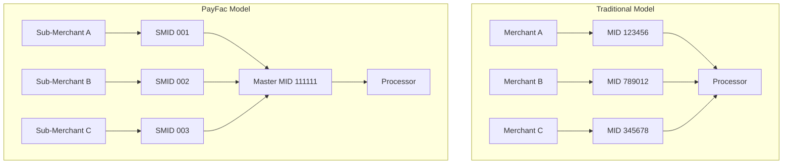
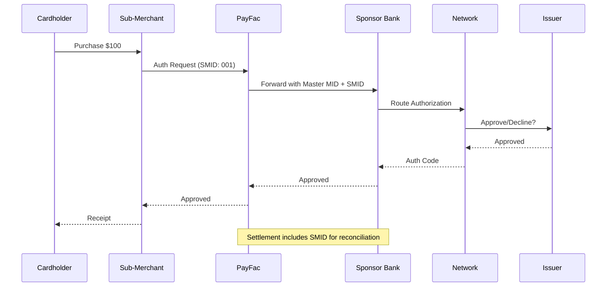
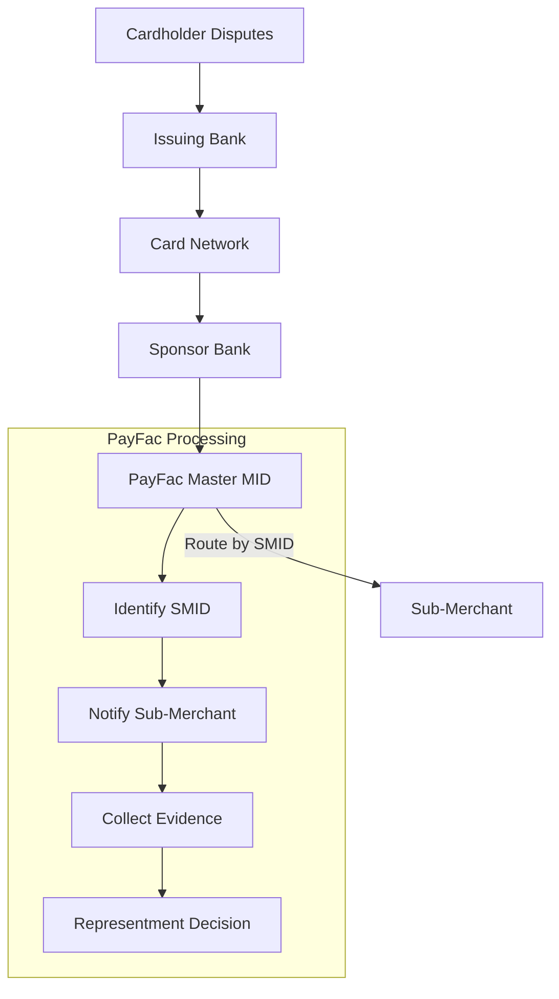
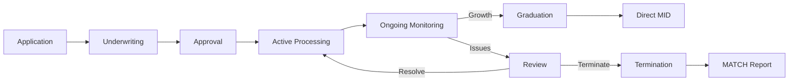

# Sub-Merchant Management

> **Status:** Complete
>
> **Last Updated:** 2025-12-28

## Overview

Understanding how sub-merchants operate under a PayFac's master MID is fundamental to PayFac operations. This includes MID structure, identification requirements, chargeback routing, and when sub-merchants should graduate to direct merchant accounts.

## MID Structure in PayFac Model

### Traditional vs. PayFac MID Structure



### Key Differences

| Aspect | Traditional MID | PayFac Master MID |
|--------|-----------------|-------------------|
| **Ownership** | Merchant owns MID | PayFac owns MID |
| **Network Relationship** | Direct | Through PayFac |
| **Settlement** | Direct to merchant | To PayFac, then to sub-merchant |
| **Liability** | Merchant liable | PayFac liable |
| **Chargebacks** | Direct to merchant | To PayFac, routed to sub-merchant |
| **Compliance** | Merchant responsible | PayFac responsible |

### Master MID Components

**PayFac's Master MID Contains:**
- Single network registration
- PayFac as merchant of record
- All sub-merchant transactions aggregated
- Single settlement account (funds to PayFac)

**Sub-Merchant Identifiers (SMIDs):**
- Unique identifier per sub-merchant
- Used for internal routing
- Required for network reporting
- Enables chargeback routing

## Sub-Merchant Identification

### Network Requirements

Each network requires sub-merchant identification in transactions:

**Visa Requirements:**

| Field | Description | Location |
|-------|-------------|----------|
| Sub-Merchant ID | Unique identifier | Authorization message |
| Sub-Merchant Name | Business name | Clearing record |
| Sub-Merchant MCC | Category code | Authorization & Clearing |
| Sub-Merchant Address | Business location | Clearing record |

**Mastercard Requirements:**

Similar structure with Payment Facilitator-specific fields:
- Payment Facilitator ID
- Sub-Merchant ID
- Sub-Merchant Name
- Sub-Merchant MCC

### Descriptor Requirements

**Statement Descriptor Format:**

```
[PayFac Name]*[Sub-Merchant Name]
```

**Examples:**
- `PAY*JOESCOFFEE`
- `PLATFORM*SMITHCONSULT`
- `ACMEPAY*GREENSTORE`

**Best Practices:**
- Use recognizable names (DBA, not legal name)
- Keep under 22 characters total
- Include customer service phone when possible
- Test with real cardholders before launch

**Common Problems:**
- Legal name instead of DBA: "ACME HOLDINGS LLC" vs "Joe's Store"
- Unrecognizable abbreviations: "ACMPY*GRNST" confusion
- Missing sub-merchant portion: just "PAY*" with no identifier

### Transaction Flow with Sub-Merchant ID



## Chargeback Routing Mechanics

### How Chargebacks Flow



### Chargeback Timeline

| Day | Action | Responsibility |
|-----|--------|----------------|
| 0 | Cardholder disputes | Issuer |
| 1-3 | Chargeback created | Network |
| 3-5 | PayFac notified | Sponsor Bank |
| 5-7 | Sub-merchant notified | PayFac (SLA: 24-48 hours) |
| 7-21 | Evidence collection | Sub-Merchant |
| 21-30 | Representment filed | PayFac |
| 45-120 | Resolution | Network |

### Financial Responsibility Chain

**When Sub-Merchant Can Pay:**
1. Sub-merchant provides evidence
2. PayFac represents on their behalf
3. If lost, debit sub-merchant settlement
4. If sub-merchant has insufficient balance, use reserve

**When Sub-Merchant Cannot Pay:**
1. Deduct from sub-merchant reserve
2. If reserve insufficient, PayFac covers
3. PayFac pursues recovery (collection)
4. If PayFac fails, sponsor draws portfolio reserve

### Reserve Usage for Chargebacks

```
Example: $500 chargeback on terminated sub-merchant

Sub-Merchant Reserve Balance: $300
Gap: $200

Step 1: Apply $300 from reserve → $200 remaining
Step 2: PayFac covers $200 from operating capital
Step 3: PayFac attempts collection (rarely successful)
Step 4: If PayFac distressed, sponsor uses portfolio reserve
```

## Sub-Merchant Graduation

### When to Graduate

**Volume Thresholds:**
- Processing >$500k/month consistently (6+ months)
- Approaching PayFac program limits

**Business Maturity:**
- 2+ years processing history
- Stable, growing business
- Strong financial position

**Performance Criteria:**
- Chargeback ratio below 0.5% consistently
- No fraud incidents
- No compliance violations

### Benefits of Graduation

| Benefit | Description |
|---------|-------------|
| **Better Rates** | Direct interchange access, no PayFac markup |
| **Higher Limits** | No PayFac volume caps |
| **Direct Relationship** | Bank relationship building |
| **Customization** | Control over settings, descriptors |
| **Credit Building** | Processing history for future financing |

### Graduation Decision Matrix

| Factor | Graduate | Stay with PayFac |
|--------|----------|------------------|
| **Volume** | Above $500k/month | Below $100k/month |
| **Growth** | Stable/Growing | Volatile/Seasonal |
| **CBR** | Below 0.5% | Above 1.0% |
| **Business Age** | Over 2 years | Under 1 year |
| **Preference** | Wants independence | Values simplicity |

### Graduation Process

**Step 1: Assessment (Week 1-2)**
- Evaluate sub-merchant readiness
- Discuss with sponsor bank
- Get acquirer quotes for direct MID

**Step 2: Application (Week 3-4)**
- Sub-merchant applies for direct MID
- New acquirer underwrites
- PCI compliance verification

**Step 3: Technical Setup (Week 5-6)**
- Gateway integration
- Terminal programming (if applicable)
- Descriptor configuration

**Step 4: Transition (Week 7-8)**
- Parallel processing (both MIDs active)
- Traffic migration
- Monitoring for issues

**Step 5: Completion (Week 9+)**
- Full cutover to direct MID
- PayFac relationship wind-down
- Final settlement and reserve release

### Contractual Considerations

**PayFac Agreement Terms:**
- Early termination fees?
- Notice period requirements?
- Reserve release timing?
- Non-compete clauses?

**Transition Support:**
- Data export requirements
- Historical reporting access
- Customer communication
- Tax document handling (1099 changes)

### Real-World Example

**Scenario: Growing E-Commerce Business**

| Metric | Month 1 | Month 12 | Month 24 |
|--------|---------|----------|----------|
| Volume | $25k | $150k | $600k |
| Transactions | 500 | 3,000 | 12,000 |
| CBR | 1.2% | 0.4% | 0.2% |
| Status | Onboarding | Stable | Graduation Candidate |

**Graduation Timeline:**
- Month 24: Volume exceeds $500k, CBR excellent
- Month 25: Discuss graduation, get acquirer quotes
- Month 26: Apply for direct MID
- Month 27: Technical integration
- Month 28: Parallel processing
- Month 29: Full cutover
- Month 30: Reserve released, relationship transitioned

**Outcome:** Sub-merchant saves ~0.5% in fees, PayFac maintains goodwill, potential referral relationship continues.

## Sub-Merchant Lifecycle Summary



## Self-Assessment Questions

### Question 1

**A cardholder sees "PAY*123456" on their statement and doesn't recognize the charge. They initiate a dispute. How could this have been prevented?**

<details>
<summary>Answer</summary>

**Problem:** Descriptor uses internal ID (123456) instead of recognizable business name.

**Prevention:**

1. **Proper Descriptor Configuration:**
   - Use DBA name, not legal name or internal ID
   - Format: `PAY*JOESCOFFEE` not `PAY*123456`
   - Test descriptors with real cardholders

2. **Best Practices:**
   - Include customer service phone in descriptor
   - Send email receipts with clear merchant name
   - Match online checkout name to statement descriptor
   - Train sub-merchants on descriptor importance

3. **Ongoing Monitoring:**
   - Track "unrecognized charge" chargebacks
   - Audit descriptors quarterly
   - Update descriptors when sub-merchants rebrand

**Key Insight:** Friendly fraud (disputes on legitimate charges) is often caused by poor descriptors. Prevention is easier than fighting chargebacks.
</details>

### Question 2

**A sub-merchant owes $50,000 in chargebacks but only has $30,000 in reserves and has stopped processing. Walk through the financial recovery process.**

<details>
<summary>Answer</summary>

**Step-by-Step Recovery:**

**Step 1: Reserve Application**
- Apply $30,000 reserve to chargebacks
- Remaining exposure: $20,000

**Step 2: PayFac Coverage**
- PayFac covers $20,000 from operating capital
- Required to meet chargeback obligations

**Step 3: Collection Efforts**
- Send demand letter to sub-merchant
- Engage collection agency if needed
- Consider legal action for larger amounts
- Recovery rate typically: 10-30%

**Step 4: Loss Recognition**
- Write off uncollectable amount
- Document for sponsor reporting
- Adjust underwriting criteria

**Lessons Learned:**
- Reserve was inadequate (10% vs needed 17%+)
- Should have held reserve longer (180+ days)
- Enhanced monitoring might have caught issues earlier
- Consider increasing reserves for similar merchants

**If PayFac Cannot Cover:**
- Sponsor draws from PayFac's portfolio reserve
- May trigger onboarding freeze
- Material impact on sponsor relationship
</details>

### Question 3

**Your top sub-merchant processes $1M/month with 0.15% CBR and has been with you for 3 years. They're asking about graduation. What factors should influence your recommendation?**

<details>
<summary>Answer</summary>

**Recommendation: Support Graduation**

**Positive Factors:**
- $1M/month = well above graduation threshold
- 0.15% CBR = excellent performance
- 3 years = proven track record
- Likely outgrown PayFac program limits

**Business Analysis:**

| Factor | Current (PayFac) | Direct MID |
|--------|------------------|------------|
| Effective Rate | ~3.0% | ~2.4% |
| Monthly Savings | - | ~$6,000 |
| Annual Savings | - | ~$72,000 |

**PayFac Considerations:**
- Losing $1M/month affects portfolio metrics
- Revenue impact: ~$30,000/month in fees
- Relationship value vs. short-term revenue

**Recommended Approach:**
1. Support graduation (goodwill, reputation)
2. Offer transition assistance
3. Explore ongoing partnership (referrals, future products)
4. Negotiate reasonable exit terms

**Key Insight:** Forcing high-performing merchants to stay creates resentment. Supporting graduation builds long-term relationships and referrals.
</details>

## Related Topics

- [Sponsor Delegation](./sponsor-delegation.md) - How sub-merchant management fits under sponsor oversight
- [Portfolio Risk Management](./portfolio-risk.md) - Managing aggregate sub-merchant risk
- [Network Requirements](./network-requirements.md) - Sub-merchant identification requirements
- [Merchant Agreements](../merchant-lifecycle/merchant-agreements.md) - MPA and terms

## References

- Visa Payment Facilitator Sub-Merchant Requirements
- Mastercard Payment Facilitator Standards
- Card network descriptor requirements
- Industry best practices for sub-merchant lifecycle management
