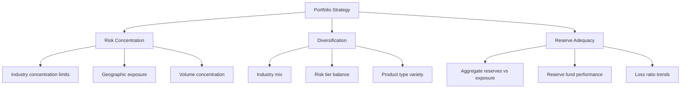
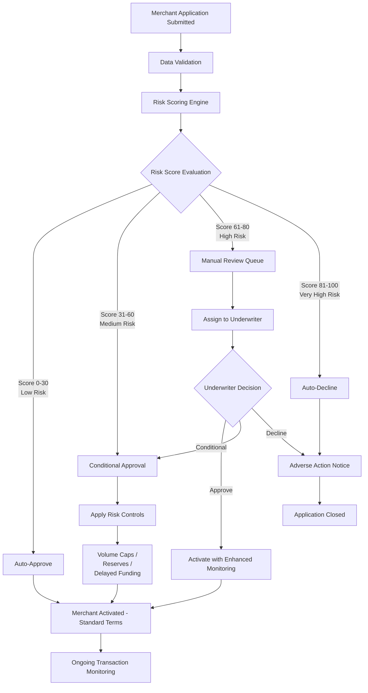
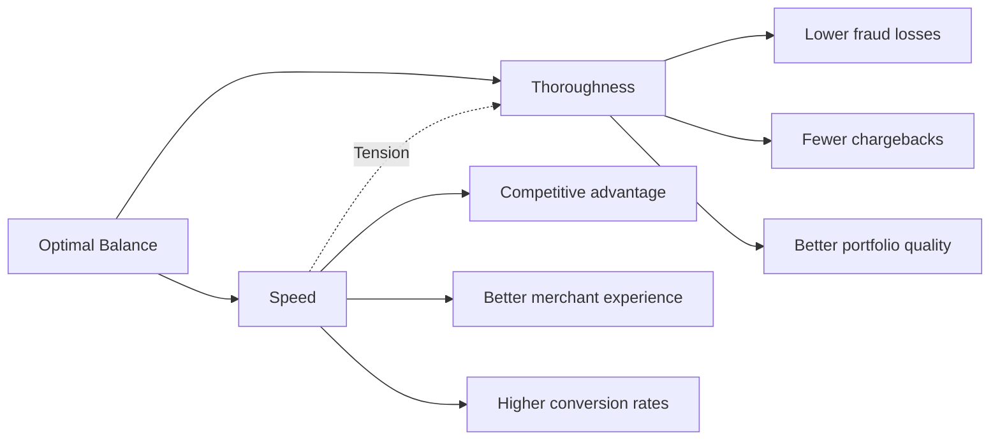

# Underwriting Fundamentals

> **Last Updated:** 2025-12-26
> **Status:** Complete

## Quick Reference

**Definition:** Underwriting is the comprehensive risk assessment process used to determine whether to approve a merchant to accept card payments, and under what terms.

**Core Objective:** Balance business growth (approving merchants to generate revenue) with risk management (preventing fraud, chargebacks, and regulatory violations).

**Key Decision Outcomes:**
- **Approve:** Merchant can start processing immediately
- **Conditional Approval:** Merchant approved with restrictions (volume caps, reserves, delayed funding)
- **Manual Review:** Application requires human evaluation
- **Decline:** Application rejected due to excessive risk

**Critical Timing:** Underwriting must be completed before a merchant processes their first transaction.

**Industry Benchmarks (2025):**
- US merchant rejection rate: 21%+
- Top performers achieve 70%+ straight-through processing (STP) rate
- AI-powered platforms: 80% auto-decision rate
- Traditional timeline: 10-14 days
- Modern automated: Minutes to hours for low-risk merchants

## Overview

### What is Underwriting?

Underwriting in the payments industry is the risk assessment process that determines:

1. **Should we accept this merchant?** (Approval decision)
2. **What terms should we offer?** (Pricing, limits, reserves)
3. **What monitoring is required?** (Transaction surveillance, periodic reviews)

Every payment processor—whether a traditional acquirer, ISO, or Payment Facilitator (PayFac)—must underwrite merchants before allowing them to accept card payments. This protects the processor, card networks, and the broader payments ecosystem from fraud, chargebacks, and regulatory violations.

### Why Underwriting Matters

**For Payment Processors:**
- **Risk Mitigation:** Prevents financial losses from chargebacks, fraud, and merchant defaults
- **Regulatory Compliance:** Meets card network rules and banking regulations
- **Portfolio Quality:** Maintains healthy merchant mix for sustainable business
- **Network Standing:** Avoids fines and penalties from card networks

**For Merchants:**
- **Market Access:** Gateway to accepting card payments
- **Speed to Market:** Fast underwriting = faster revenue generation
- **Fair Terms:** Proper risk assessment leads to appropriate pricing and limits

**For the Ecosystem:**
- **Consumer Protection:** Reduces fraudulent merchants
- **System Integrity:** Maintains trust in card payments
- **Brand Protection:** Prevents reputational damage from bad actors

### The Cost of Underwriting Errors

**Accepting High-Risk Merchants (False Positives):**
- Excessive chargebacks trigger card network monitoring programs
- Visa VAMP threshold: 1.5% (April 2025), dropping to 0.9% (January 2026)
- Mastercard Excessive Chargeback Program (ECP): 1.5%
- Financial losses from fraud and disputes
- Potential loss of processing privileges
- Regulatory scrutiny and fines

**Over-Underwriting (False Negatives):**
- Lost revenue from rejected good merchants
- Competitive disadvantage (merchants go to competitors)
- Damaged reputation in the market
- Missed growth opportunities

:::tip Business Reality
The best underwriting programs find the optimal balance: aggressive enough to capture revenue opportunities, conservative enough to avoid catastrophic losses. This is a continuous calibration process.
:::

## Key Terms and Definitions

:::info Core Underwriting Vocabulary

**Underwriting:** The process of evaluating a merchant's creditworthiness, business legitimacy, and risk profile to determine acceptance for payment processing services.

**Risk Appetite:** The level and type of risk an organization is willing to accept in pursuit of business objectives. Varies significantly across processors.

**Automated Decisioning / STP (Straight-Through Processing):** Applications that are approved or declined automatically by algorithms without human intervention. Top performers achieve 70%+ STP rates.

**Manual Review Queue:** Applications flagged by the automated system for human evaluation due to complexity, ambiguity, or elevated risk factors.

**Conditional Approval:** Merchant approved with risk mitigation controls such as volume caps, reserve requirements, or delayed funding schedules.

**Delegated Underwriting Authority:** Permission granted by an acquiring bank to a PayFac or ISO to make underwriting decisions on their behalf, within defined parameters.

**Risk Score:** Numerical assessment (typically 0-100) representing the likelihood of merchant-related losses. Higher scores indicate higher risk.

**Adverse Action Notice:** Legally required notification to merchants explaining why their application was declined, per FCRA and ECOA regulations.

:::

## Risk vs. Reward Framework

Effective underwriting requires evaluating both sides of the equation:

### Revenue Potential

**Factors to Consider:**
- Projected monthly processing volume
- Average ticket size
- Transaction frequency
- Pricing tier (interchange-plus, flat rate, etc.)
- Lifetime value potential
- Cross-sell opportunities (adjacent services)

### Risk Exposure

**Factors to Consider:**
- Chargeback probability (industry, delivery model)
- Fraud susceptibility (card-not-present, high-ticket items)
- Regulatory risk (licensed industry, age-restricted products)
- Financial stability (new business, funding gaps)
- Reputational risk (adult content, politically sensitive)
- Operational risk (merchant complexity, multi-entity structure)

### Portfolio-Level Thinking

Individual merchant decisions must consider the entire portfolio:

:::warning Portfolio Risk Management
A processor might decline a profitable low-risk merchant if accepting them would create excessive concentration in a single industry or geographic region. Conversely, they might accept a higher-risk merchant to diversify their portfolio.
:::

## Underwriting Decision Outcomes

Every merchant application results in one of these outcomes:

| Decision | Meaning | Typical Risk Score | Criteria Examples | Next Steps |
|----------|---------|-------------------|-------------------|------------|
| **Auto-Approve** | Immediate activation with standard terms | 0-30 (Low) | - Established business - Clean credit history - Low-risk industry - Complete documentation - No MATCH list presence | Activate merchant account; Standard monitoring |
| **Conditional Approval** | Approved with risk controls | 31-60 (Medium) | - Higher-risk industry - Limited operating history - Moderate volume - Some documentation gaps - Higher return rates | Apply restrictions: - Volume caps - Rolling reserves (10-20%) - Delayed funding (T+7) - Enhanced monitoring |
| **Manual Review** | Human evaluation required | 61-80 (High) | - Complex business structure - Edge case scenarios - Conflicting data points - High-volume new merchant - UBO verification issues | Assign to underwriter; Request additional documentation; Schedule merchant call |
| **Auto-Decline** | Immediate rejection | 81-100 (Very High) | - MATCH list presence - Prohibited industry - Fraudulent documentation - Severe credit issues - TMF (Terminated Merchant File) | Send adverse action notice; Document decision reasoning |

:::info Manual Review is Not a Failure
Many processors aim to minimize manual reviews for efficiency, but complex, high-value merchants often require human judgment. The goal is to route the *right* applications to manual review, not to eliminate it entirely.
:::

## Automated vs. Manual Underwriting

Modern underwriting programs leverage both automated decisioning and expert human judgment:

| Aspect | Automated Underwriting | Manual Underwriting |
|--------|------------------------|---------------------|
| **Decision Speed** | Minutes to hours | 1-14 days (depending on complexity) |
| **Cost per Application** | Low ($5-$20) | High ($50-$200+) |
| **Consistency** | High (rule-based, repeatable) | Variable (depends on underwriter experience) |
| **Complex Cases** | Limited (rules can't cover all scenarios) | Superior (human judgment, nuance) |
| **Scalability** | Extremely high (thousands/day) | Limited (depends on staff size) |
| **Best For** | - Low-risk merchants - High-volume applications - Standardized business models | - High-risk industries - Complex structures - Edge cases - Large merchants |
| **Accuracy** | Dependent on model quality | Dependent on underwriter expertise |
| **Documentation Review** | OCR + pattern matching | Full document analysis |
| **Continuous Improvement** | Model retraining with data | Training programs, guidelines |

**2025 Industry Trends:**
- 78% of financial institutions now use AI in underwriting
- Top performers achieve 80% auto-decision rate (approve OR decline)
- AI-powered platforms show 30% approval lift (more good merchants approved)
- Hybrid models (AI + human expertise) outperform pure automation

:::tip Best Practice
Use automated decisioning to handle the "easy" cases (clear approvals and clear declines), freeing underwriters to focus on the complex, high-value applications where human judgment adds the most value.
:::

## Underwriting Workflow

Here's how a typical merchant application flows through the underwriting process:

**Key Decision Points:**

1. **Data Validation:** Ensures application is complete and internally consistent
2. **Risk Scoring:** Automated evaluation produces numerical risk score
3. **Score-Based Routing:** Determines auto-decision vs. manual review
4. **Manual Review (if needed):** Underwriter applies expertise and judgment
5. **Risk Control Selection:** If conditional, determines appropriate restrictions
6. **Adverse Action:** If declined, provides legally compliant notice with reasons

## Tiered Underwriting Approaches

Most processors implement tiered underwriting, matching scrutiny level to risk profile:

| Tier | Risk Level | Underwriting Process | Documentation Required | Typical Merchants | Timeline | Approval Rate |
|------|------------|----------------------|------------------------|-------------------|----------|---------------|
| **Tier 1** | Low | Instant/Automated decisioning | - Basic business info - Owner SSN/EIN - Bank account | - Coffee shops - Retail stores - Restaurants - Professional services | Minutes | 85-95% |
| **Tier 2** | Medium | Light-touch review + spot checks | - All Tier 1 docs - Processing history - Business license | - Subscription services - Higher return rates - E-commerce - Service businesses | Hours to 1 day | 60-75% |
| **Tier 3** | High | Full underwriting process | - All Tier 2 docs - Financial statements - Supplier agreements - Operating licenses | - Travel agencies - Nutraceuticals - CBD products - Firearms | 1-3 days | 30-50% |
| **Tier 4** | Complex / Very High | Enhanced due diligence | - All Tier 3 docs - Legal entity docs - UBO verification - Third-party reports | - High-volume merchants - International operations - Multi-entity structures - Regulated industries | 1+ weeks | 10-30% |

:::warning Risk Tier Assignment
Risk tier is determined by multiple factors: industry MCC, processing history, business structure, projected volume, and delivery model. The same merchant might be Tier 1 for $10k/month and Tier 3 for $500k/month.
:::

## Service Level Agreement (SLA) Considerations

Underwriting speed has become a competitive differentiator:

**Merchant Experience Impact:**
- Faster approval = faster revenue generation for merchant
- Long wait times drive merchants to competitors
- Transparency in timeline expectations builds trust

**Industry Benchmarks by Tier:**

| Tier | Target SLA | Competitive SLA | World-Class SLA |
|------|------------|-----------------|-----------------|
| Tier 1 | 24 hours | 4 hours | Real-time (minutes) |
| Tier 2 | 3 days | 24 hours | 4 hours |
| Tier 3 | 7 days | 3 days | 24 hours |
| Tier 4 | 14 days | 7 days | 3 days |

**Queue Management for Manual Review:**
- Prioritize by merchant volume potential
- Track aging applications (avoid abandoned apps)
- Balance thoroughness with speed
- Provide status updates to merchants
- Escalation paths for high-value merchants

**Balancing Speed with Thoroughness:**

:::tip Strategic Approach
Invest in automation for speed on low-risk cases, freeing underwriters to be thorough on high-risk/high-value cases. Don't sacrifice quality for speed on complex merchants.
:::

## PayFac vs. Traditional Underwriting Model

The Payment Facilitator model fundamentally changes who performs underwriting and who bears the risk:

| Aspect | Traditional Model (ISO/Acquirer) | PayFac Model |
|--------|----------------------------------|--------------|
| **Who Underwrites** | Acquiring bank or bank-delegated ISO | PayFac (with delegated authority) |
| **Risk Ownership** | Acquirer bears risk of approved merchant | PayFac bears ALL sub-merchant risk |
| **Merchant of Record** | Each merchant is direct customer of acquirer | PayFac is merchant of record |
| **MID Structure** | Individual MID per merchant | Master MID + sub-merchant accounts |
| **Approval Speed** | Days to weeks (bank involvement) | Minutes to hours (PayFac decision) |
| **Documentation** | Extensive upfront | Streamlined (risk-based) |
| **Underwriting Authority** | Bank retains control | PayFac has delegated authority |
| **Liability Scope** | Limited to that merchant | ALL sub-merchants under master MID |
| **Reserve Requirements** | Per merchant | Aggregate + per sub-merchant |
| **Sponsor Bank Role** | Direct relationship with merchant | Oversees PayFac (not sub-merchants) |
| **Volume Limits** | Set by acquirer | PayFac sets (within sponsor limits) |
| **Pricing Flexibility** | Limited | High (PayFac controls sub-merchant pricing) |

**Why PayFacs Can Be Faster:**

1. **Delegated Authority:** No need to wait for bank approval on every merchant
2. **Risk Aggregation:** Can accept more risk per merchant because of portfolio diversification
3. **Technology Investment:** Built for speed (automated onboarding platforms)
4. **Simplified Documentation:** Can adjust requirements based on risk tier

**Why PayFacs Must Be More Vigilant:**

1. **Total Liability:** PayFac is responsible for ALL sub-merchant losses
2. **Sponsor Bank Monitoring:** Bank monitors PayFac's underwriting quality
3. **Network Scrutiny:** Card networks hold PayFac accountable for all activity
4. **Reputation Risk:** One bad sub-merchant can affect entire platform

:::danger PayFac Risk Concentration
If a PayFac's underwriting is too lax, a wave of sub-merchant fraud or chargebacks can:
- Deplete the PayFac's reserve fund
- Trigger sponsor bank termination
- Result in card network fines or loss of registration
- Lead to business failure

PayFacs must be **more** sophisticated in underwriting, not less.
:::

**PayFac Market Growth (2025):**
- 2,381 registered PayFacs (up from 1,244 in 2020)
- $4+ trillion in annual processing volume
- Growing adoption in SaaS, e-commerce platforms, and vertical markets

## Regulatory Considerations

Underwriting decisions are subject to several federal regulations:

### Fair Credit Reporting Act (FCRA)

**Applies When:** Merchant application involves pulling a consumer credit report (e.g., sole proprietor using personal credit).

**Key Requirements:**
- Obtain merchant consent before pulling credit report
- Provide adverse action notice if declined based on credit report
- Notice must include credit bureau name and contact information
- Merchant has right to dispute credit report inaccuracies

**Example Adverse Action Language:**
> "Your application was declined based in part on information obtained from Experian. You have the right to obtain a free copy of your credit report from Experian within 60 days..."

### Equal Credit Opportunity Act (ECOA)

**Applies When:** Making credit-related decisions (merchant processing is considered a form of credit extension).

**Key Requirements:**
- Cannot discriminate based on race, color, religion, national origin, sex, marital status, age
- Must provide written notice within 30 days of application
- Must provide specific reasons for denial (not vague statements)
- Applies to all applicants, not just those with credit bureau pulls

**Example Decline Reasons:**
- ✓ "Insufficient business operating history (less than 6 months)"
- ✓ "Excessive chargebacks at previous processor (4.2% rate)"
- ✗ "Does not meet our requirements" (too vague)
- ✗ "Business risk too high" (not specific enough)

### Consumer Financial Protection Bureau (CFPB) - AI Transparency

:::warning 2025 Regulatory Guidance
The CFPB has issued guidance requiring financial institutions to provide **specific reasons** for adverse actions, even when using AI or complex algorithms for decisioning.

**Key Requirement:** You cannot hide behind "the algorithm said no" - you must identify the specific factors that led to the decision.

**Practical Impact:** Requires explainable AI models and human-readable reason codes.
:::

**Example Compliant AI-Generated Adverse Action:**
> "Your application was declined based on the following factors:
> 1. High-risk industry classification (MCC 5967 - Direct Marketing)
> 2. Negative business credit score (below threshold)
> 3. Presence on MATCH list under Category 4 (Fraud)
>
> These factors were identified through our automated risk assessment system."

### State Money Transmitter Licensing (MTL)

**Requirement:** 49 states require money transmitter licenses for payment processors.

**Underwriting Impact:**
- Must verify merchant's own MTL compliance (if merchant moves money)
- PayFacs need MTL in states where sub-merchants operate
- Average annual compliance cost: ~$225,000 across multiple states
- Adds complexity to multi-state merchant approval

**Example Scenario:**
A PayFac onboarding a marketplace platform that facilitates seller payouts must verify:
1. PayFac has MTL in all states where sellers are located
2. Marketplace platform itself may need MTL depending on fund flow
3. Individual sellers do NOT need MTL (platform is money transmitter)

## Why Risk Varies by Industry

Not all merchants pose the same level of risk. Let's compare two merchants to illustrate:

### Example 1: Coffee Shop (Low Risk)

**Business Model:**
- Card-present transactions (customer swipes card at counter)
- Immediate delivery of product (coffee and pastry)
- Low average ticket ($8-$15)
- Tangible, perishable goods
- Straightforward product (no health claims, no age restrictions)

**Risk Profile:**
- **Chargeback Rate:** &lt;0.1% (customer present, immediate delivery)
- **Fraud Risk:** Very low (EMV chip cards, customer present)
- **Regulatory Risk:** Minimal (health permits only)
- **Delivery Disputes:** None (consumed on-site)
- **Product Claims:** None (standard food items)

**Likely Underwriting Outcome:** Tier 1 - Auto-approved in minutes

### Example 2: Nutraceutical Supplement Seller (High Risk)

**Business Model:**
- Card-not-present (online orders)
- Subscription billing (recurring charges)
- Higher average ticket ($50-$150/month)
- Intangible health claims ("lose weight," "boost immunity")
- Regulatory scrutiny (FDA, FTC)
- Future delivery (ships 3-7 days after order)

**Risk Profile:**
- **Chargeback Rate:** 2-5% (common in nutraceutical industry)
- **Fraud Risk:** Higher (card-not-present, subscription fraud)
- **Regulatory Risk:** High (FDA warnings, FTC enforcement)
- **Delivery Disputes:** Common ("never received," "didn't work")
- **Product Claims:** High risk (health claims attract regulatory action)

**Likely Underwriting Outcome:** Tier 3 - Full underwriting, 1-3 days, may require:
- Higher reserves (15-20% rolling)
- Volume caps until history established
- Proof of regulatory compliance
- Return/refund policy review

:::tip Understanding Risk Drivers

**High-Risk Characteristics:**
- Card-not-present transactions
- Subscription/recurring billing
- Future delivery (weeks or months out)
- Intangible goods (digital products, services)
- Health claims or regulatory scrutiny
- High ticket amounts
- New business with no history
- Industries with high chargeback rates

**Low-Risk Characteristics:**
- Card-present transactions
- Immediate delivery
- Tangible goods
- Low ticket amounts
- Established business history
- Straightforward product/service
- Low historical chargeback rates

:::

## How Delivery Timeframe Affects Risk

Delivery timeframe is one of the most critical underwriting factors:

### Immediate Delivery (Same Day)

**Examples:** Restaurants, retail stores, gas stations, movie theaters

**Risk Profile:**
- Customer receives product/service before leaving
- Disputes are rare (customer knows what they got)
- Merchant default less impactful (already delivered)
- Chargebacks typically only for fraud (stolen card)

**Chargeback Rate:** Typically &lt;0.5%

### Short Delivery (1-7 Days)

**Examples:** E-commerce, online retail, food delivery

**Risk Profile:**
- Small window for merchant to fail to deliver
- Customer disputes possible ("never arrived," "wrong item")
- Merchant typically collects payment before shipping
- Tracking numbers reduce disputes

**Chargeback Rate:** Typically 0.5-1.5%

### Medium Delivery (1-4 Weeks)

**Examples:** Custom goods, made-to-order items, pre-orders

**Risk Profile:**
- Greater opportunity for merchant failure
- Customer may forget purchase (subscription first charges)
- "Buyer's remorse" chargebacks more common
- Merchant needs working capital to fulfill

**Chargeback Rate:** Typically 1.5-3%

### Future Delivery (Months Out)

**Examples:** Travel (cruises, vacation packages), event tickets, crowdfunding, custom manufacturing

**Risk Profile:**
- **Highest risk category**
- Merchant may go out of business before delivery
- Customer circumstances change (can't travel, don't want product)
- Large volume of chargebacks if merchant fails
- Seasonal volatility (travel industry)

**Chargeback Rate:** Can exceed 5-10% if merchant fails

:::danger Future Delivery Risk Example

**Scenario:** A cruise booking company collects $500,000 in payments for cruises departing 6-12 months in the future. The company goes bankrupt 3 months later.

**Impact:**
- All customers file chargebacks (no cruise delivered)
- Processor must return $500,000 to customers
- If no adequate reserve, processor absorbs the loss
- This is why travel merchants typically require 10-20% rolling reserves

:::

**Underwriting Mitigation for Future Delivery:**
- Higher reserves (10-20% rolling reserve)
- Delayed funding (hold funds until delivery)
- Volume caps (limit exposure)
- Financial statement review (ensure working capital)
- Third-party delivery guarantees (travel insurance)

## New-to-Processing Merchant Considerations

Merchants with no prior payment processing history require special evaluation:

### Why New Merchants Are Higher Risk

**Lack of Track Record:**
- No historical chargeback data
- Unknown fulfillment capabilities
- Unproven business model
- No processing velocity patterns

**Uncertainty Factors:**
- Will they actually fulfill orders?
- Can they handle transaction volume?
- Do they understand chargeback management?
- Will they stay in business?

**Statistical Reality:**
- ~20% of small businesses fail in first year
- ~50% fail within five years
- New merchants disproportionately appear on MATCH list

### Underwriting Adjustments for New Merchants

| Risk Factor | Standard Merchant | New Merchant Approach |
|-------------|-------------------|------------------------|
| **Processing History** | Review 3-6 months statements | Cannot rely on - use other signals |
| **Credit Checks** | May waive for strong history | **Always required** (personal and business) |
| **Financial Statements** | Optional for low-risk | **Recommended** (verify capitalization) |
| **Reserves** | Risk-based (0-10%) | **Higher** (10-15% minimum) |
| **Volume Caps** | Based on history | **Conservative** (limit initial exposure) |
| **Monitoring** | Standard | **Enhanced** (daily review for first 30-90 days) |
| **Ramp Schedule** | Immediate full volume | **Gradual** (increase limits over time) |

### Alternative Data Sources for New Merchants

When processing history isn't available, underwriters evaluate:

**Business Indicators:**
- Business credit score (Dun & Bradstreet, Experian Business)
- Time in business (even if not processing cards)
- Industry reputation (reviews, BBB rating)
- Website quality and completeness
- Social media presence and engagement
- Physical location (vs. virtual/home-based)

**Owner Indicators:**
- Personal credit score (especially for sole proprietors)
- Industry experience (background in the business)
- Previous business ownership
- Educational background
- Professional licenses

**Financial Indicators:**
- Bank account history (no NSFs, positive balance)
- Business capitalization (sufficient working capital)
- Debt-to-income ratio
- Existing business revenue (non-card sources)

:::tip New Merchant Success Pattern

**Gradual Ramp Approach:**
1. **Month 1:** Approve with $25k/month cap, 15% reserve
2. **Month 2-3:** If clean history, increase to $50k/month
3. **Month 4-6:** If still clean, increase to $100k/month, reduce reserve to 10%
4. **Month 7+:** Move to standard monitoring and limits

This approach limits initial exposure while giving legitimate merchants room to grow.
:::

## Self-Assessment Questions

Test your understanding of underwriting fundamentals:

1. **What is the primary goal of merchant underwriting?**
   

   
Answer

   To balance business growth (approving merchants to generate revenue) with risk management (preventing fraud, chargebacks, and losses). It's about finding the optimal risk/reward balance, not simply rejecting all risk.
   

2. **What are the four possible underwriting decision outcomes?**
   

   
Answer

   - Auto-Approve (immediate activation)
   - Conditional Approval (approved with restrictions like reserves or volume caps)
   - Manual Review (requires human evaluation)
   - Auto-Decline (immediate rejection)
   

3. **Why can PayFacs typically approve merchants faster than traditional acquirers?**
   

   
Answer

   PayFacs have delegated underwriting authority from their sponsor bank, allowing them to make approval decisions without waiting for bank involvement. They also invest heavily in automated onboarding technology and can aggregate risk across their sub-merchant portfolio.
   

4. **What is the difference between automated decisioning and manual review?**
   

   
Answer

   Automated decisioning uses algorithms and rules to approve/decline applications instantly without human involvement (high speed, lower cost, best for low-risk standard cases). Manual review involves an underwriter evaluating the application (slower, higher cost, but better for complex or high-risk cases requiring judgment).
   

5. **Why is a coffee shop considered lower risk than a nutraceutical supplement seller?**
   

   
Answer

   Coffee shop: card-present transactions, immediate delivery, tangible goods, low ticket, minimal regulatory scrutiny, very low chargeback rates.

   Nutraceuticals: card-not-present, future delivery, intangible health claims, regulatory scrutiny (FDA/FTC), subscription billing, high historical chargeback rates (2-5%).
   

6. **What are the three federal regulations that govern underwriting decisions?**
   

   
Answer

   - FCRA (Fair Credit Reporting Act) - governs use of credit reports and adverse action notices
   - ECOA (Equal Credit Opportunity Act) - requires non-discriminatory lending and specific decline reasons
   - CFPB AI Transparency Guidance (2025) - requires explainable AI and specific reasons even with automated decisions
   

7. **What is straight-through processing (STP) and what rate do top performers achieve?**
   

   
Answer

   Straight-through processing (STP) is the percentage of applications that are automatically approved or declined without manual review. Top performers in 2025 achieve 70%+ STP rates, with AI-powered platforms reaching 80%.
   

8. **Why are merchants with future delivery timelines (like travel) considered higher risk?**
   

   
Answer

   Future delivery means significant time passes between payment and delivery. During this period, the merchant could go out of business, customer circumstances may change, or buyer's remorse may occur - all leading to high chargeback rates. If a travel merchant fails before trips occur, ALL customers will chargeback, creating massive processor exposure.
   

## Related Topics

- [Risk Factors](./risk-factors.md) - Detailed breakdown of specific risk indicators
- [Risk Scoring Models](./risk-scoring.md) - How automated risk scoring works
- [KYC Requirements](../kyc-kyb/kyc-requirements.md) - Identity verification and documentation
- [Ongoing Monitoring](../merchant-lifecycle/ongoing-monitoring.md) - Post-approval merchant surveillance
- [Portfolio Risk Management](../payfac-considerations/portfolio-risk.md) - Managing aggregate risk across merchants

## References

**Industry Research:**
- Strawhecker Group: "The State of the PayFac Market" (2025)
- McKinsey & Company: "AI in Financial Services Risk Assessment" (2025)
- Nilson Report: "US Merchant Rejection Rates" (2025)

**Card Network Resources:**
- Visa: "Visa Acquirer Monitoring Program (VAMP)" - threshold changes
- Mastercard: "Excessive Chargeback Program (ECP)" guidelines

**Regulatory Sources:**
- Federal Trade Commission (FTC): Fair Credit Reporting Act (FCRA) compliance guide
- Consumer Financial Protection Bureau (CFPB): Equal Credit Opportunity Act (ECOA) requirements
- CFPB: "AI Explainability in Adverse Action Decisions" (2025 guidance)
- Conference of State Bank Supervisors (CSBS): Money Transmitter Licensing requirements

**Payment Industry:**
- Electronic Transactions Association (ETA): "Payment Facilitator Best Practices"
- Payment Facilitator Standards Council: Registration and compliance guidelines

---

**Next Steps:** Proceed to [Risk Factors](./risk-factors.md) to learn about the specific indicators underwriters evaluate when assessing merchant applications.
