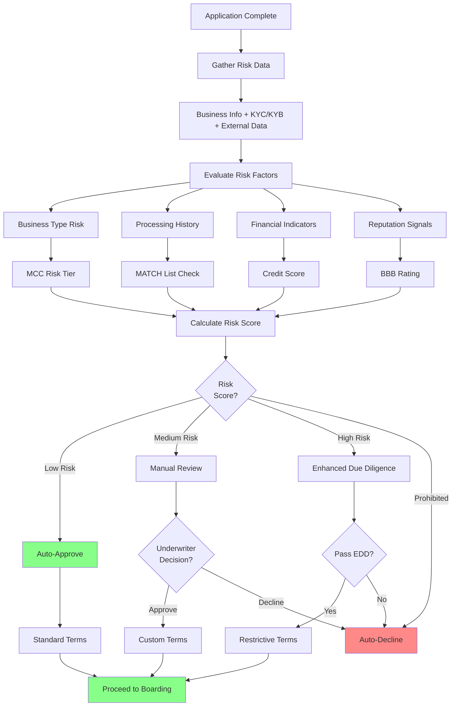

# Underwriting & Risk Assessment

> **Last Updated:** 2025-12-28
> **Status:** Complete

## Overview

Underwriting is the process of evaluating a merchant's risk profile to determine whether to approve their application, what pricing to offer, and what risk controls to implement. This is where KYC/KYB data meets business analysis.

## What You'll Learn

- **Fundamentals** - Core underwriting principles and objectives
- **Risk Factors** - Business indicators that signal merchant risk
- **MCC Codes** - Merchant Category Code classification and risk tiers
- **Risk Scoring** - Automated scoring models and decision frameworks

## Why Underwriting Matters

Proper underwriting protects against:

- **Fraud Losses** - Merchants who process stolen cards or synthetic identities
- **Chargeback Exposure** - High-risk business models with poor customer satisfaction
- **Regulatory Violations** - Prohibited business types or money laundering schemes
- **Sponsor Bank Risk** - Portfolio degradation that threatens your processing rights

## Risk Assessment Framework

## Key Concepts

### Risk-Based Decisioning

Not all merchants pose the same risk. Effective underwriting calibrates scrutiny to risk level:

- **Low Risk:** Automated approval, standard pricing, minimal monitoring
- **Medium Risk:** Manual review, conditional approval, enhanced monitoring
- **High Risk:** Enhanced due diligence, restrictive terms, reserves, intensive monitoring
- **Prohibited:** Automatic decline, no appeals

### The Underwriting Triangle

Balance three competing objectives:

1. **Conversion Rate** - Approve as many legitimate merchants as possible
2. **Risk Management** - Minimize fraud, chargebacks, and losses
3. **Operational Efficiency** - Automate decisions, reduce manual review

## Topics Covered

### Underwriting Fundamentals

- Goals and objectives of merchant underwriting
- Underwriting vs. credit underwriting (lending)
- Risk tolerance and appetite setting
- Underwriting policies and exception management

### Risk Factors

#### Business Type Risk
- Industry vertical risk profiles
- Product vs. service businesses
- Card-present vs. card-not-present
- Subscription and continuity models

#### Processing History
- MATCH list status (Terminated Merchant File)
- Prior merchant accounts
- Chargeback history
- Fraud history

#### Financial Indicators
- Business credit score
- Personal credit score (for small businesses)
- Time in business
- Projected processing volume
- Average ticket size

#### Reputation Signals
- BBB rating and accreditation
- Online reviews (Google, Yelp, Trustpilot)
- Litigation and regulatory history
- Website quality and professionalism

### MCC Codes

- What are Merchant Category Codes?
- MCC assignment process
- Risk tiers by MCC
- High-risk MCC categories
- Special restrictions (adult, gambling, nutraceuticals)

### Risk Scoring Models

- Rules-based scoring
- Machine learning models
- Third-party risk scores
- Score calibration and validation
- Decision thresholds

## Common Red Flags

1. **New Business, High Volume** - Recently formed entity projecting large volumes
2. **MATCH List Hit** - Previous termination for fraud or excessive chargebacks
3. **Mismatched Business** - Website content doesn't match stated business type
4. **High-Risk MCC** - Tobacco, adult, gambling, debt collection, etc.
5. **Suspicious Ownership** - Shell companies, frequent ownership changes
6. **Credit Issues** - Poor personal/business credit, bankruptcies
7. **Offshore Connections** - High-risk jurisdictions, IP address mismatches
8. **Unrealistic Projections** - Volume projections inconsistent with business age/size

## Topics in This Section

| Topic | Description | Status |
|-------|-------------|--------|
| [Fundamentals](./fundamentals.md) | Core underwriting principles and objectives | Complete |
| [Risk Factors](./risk-factors.md) | Business indicators that signal merchant risk | Complete |
| [MCC Codes](./mcc-codes.md) | Merchant Category Code classification and risk tiers | Complete |
| [Risk Scoring](./risk-scoring.md) | Automated scoring models and decision frameworks | Complete |
| [Quiz](./quiz.md) | Self-assessment with 14 questions covering all topics | Complete |

## Self-Assessment

Test your understanding with the [Underwriting & Risk Assessment Quiz](./quiz.md):

- **Questions 14-18:** Risk Factors (nutraceuticals risk, delivery timeframes, reserves, MATCH list)
- **Questions 19-22:** MCC Codes (assignment, misclassification, high-risk categories, interchange rates)
- **Questions 23-27:** Scenario Questions (complex underwriting decisions)

---

> **Next:** Start with [Fundamentals](./fundamentals.md) or jump to specific topics based on your interests.
