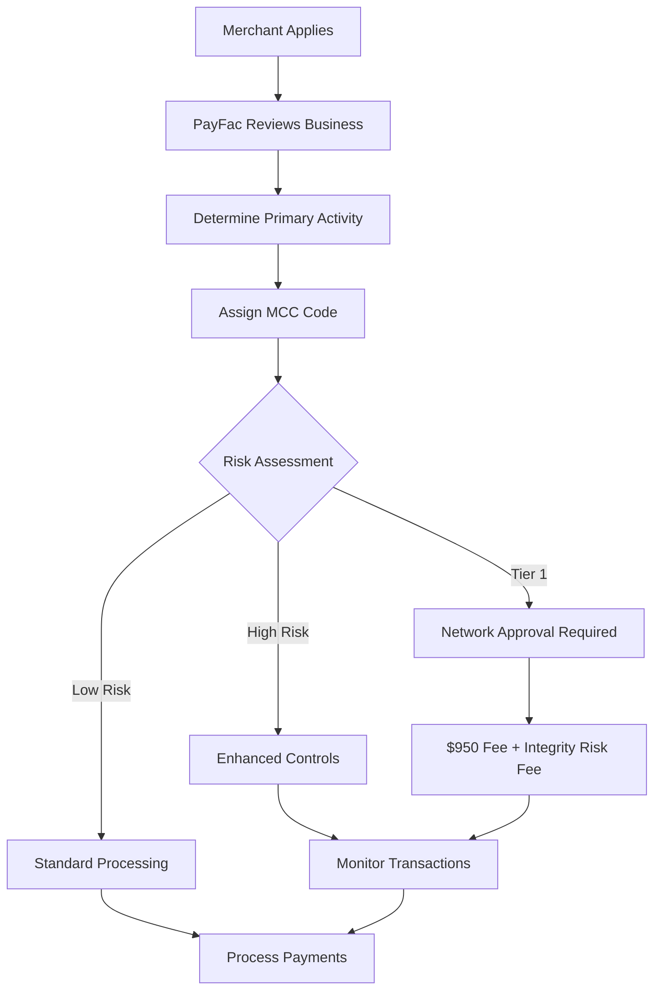
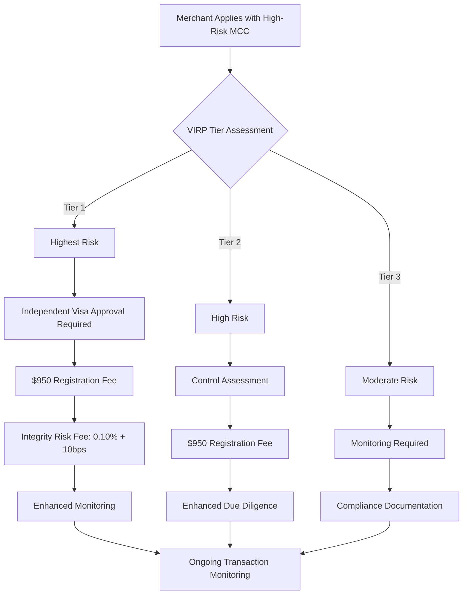
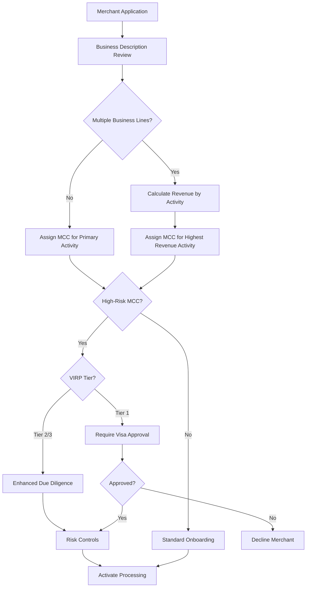

# Merchant Category Codes (MCC)

> **Last Updated:** 2025-12-26
> **Status:** Complete

## Quick Reference

**Key Facts:**

- 4-digit codes defined by ISO 18245:2023 standard
- Assigned by acquirers/PayFacs during merchant onboarding
- Based on merchant's primary business activity (highest sales volume)
- Directly impacts interchange rates, risk assessment, and regulatory compliance
- Visa periodically updates MCC assignment rules - check Visa Core Rules for latest

**Critical Numbers:**

- 1,000+ active MCC codes across all industries
- Tier 1 (highest risk): $950 registration fee + Integrity Risk Fee ($0.10 per transaction + 0.10% of transaction amount)
- Misclassification fines: $25,000+ per merchant
- California AB 1587: $10,000 per violation for firearms MCC misuse

**Integrity Risk Fee Calculation Example:**

- Transaction amount: $1,000
- Fee: $0.10 (flat) + $1.00 (0.10% of $1,000) = $1.10 total

**Important Documents:**

- ISO 18245:2023 - International MCC standard
- Visa VIRP (Visa Integrity Risk Program) - Replaced GBPP May 2023
- Mastercard BRAM (Business Risk Assessment and Mitigation)

:::warning Time-Sensitive Information
Visa periodically updates MCC assignment rules. Check Visa Core Rules for the latest requirements. Always verify current classification requirements with card network documentation.
:::

## MCC Quick Lookup by Industry

| Industry | Common Question | Correct MCC | Notes |
|----------|----------------|-------------|-------|
| **Coffee Shop** | Independent café | 5812 | Same as restaurants |
| **Coffee Shop** | Fast food chain (Starbucks) | 5814 | PIN debit may be required |
| **Grocery** | Traditional supermarket | 5411 | Lowest interchange rates |
| **Grocery** | Walmart Supercenter | 5310 | Discount store, NOT 5411 |
| **Grocery** | Costco/Sam's Club | 5300 | Wholesale club |
| **Pharmacy** | CVS, Walgreens (licensed) | 5912 | Standard risk |
| **Pharmacy** | Online pharmacy (unlicensed) | 5912 | VIRP Tier 1 |
| **Gas Station** | Pay at pump | 5542 | Preferential interchange |
| **Hotel** | Lodging charges | 7011 | Supports delayed charges |
| **Hotel** | Restaurant in hotel | 5812 | Separate MID recommended |
| **Gym** | Fitness membership | 7941 or 7997 | Recurring billing common |
| **SaaS** | Business software | 5734 or 7372 | Depends on delivery model |
| **E-commerce** | General online retail | 5999 | Catch-all for misc. goods |
| **Consulting** | Professional services | 8999 | Higher interchange |
| **Medical** | Doctor's office | 8011 or 8099 | Depends on specialty |
| **Nonprofit** | Charitable donations | 8398 | May qualify for special programs |
| **Legal** | Law firm | 8111 | Standard professional rates |

## Overview

A **Merchant Category Code (MCC)** is a four-digit number assigned to every business that accepts card payments. MCCs categorize merchants by their primary type of business activity, enabling card networks to:

1. **Calculate interchange fees** - Different business types qualify for different interchange programs
2. **Assess risk** - High-risk industries require enhanced monitoring and controls
3. **Track spending patterns** - Enables rewards programs and spending analytics
4. **Enforce regulations** - Supports compliance with industry-specific rules (gambling restrictions, firearms tracking)
5. **Prevent fraud** - Detects suspicious merchant activity and misclassification

The MCC system is standardized by **ISO 18245:2023**, though individual card networks maintain their own variations and risk classifications.



### Who Assigns MCCs?

In a traditional merchant relationship, the **acquiring bank** assigns the MCC during underwriting. In a PayFac model, the **PayFac** assigns MCCs to sub-merchants, taking on responsibility for:

- Accurate classification based on business activity
- Compliance with network rules
- Monitoring for misclassification
- Managing network registration fees for high-risk MCCs

:::danger Compliance Required
PayFacs are liable for MCC misclassification. Networks can impose fines of $25,000+ per merchant and terminate processing rights for systemic violations.
:::

## Key Terms

:::info Definitions

**MCC (Merchant Category Code):** Four-digit code classifying a merchant's primary business activity per ISO 18245 standard.

**Primary Business Activity:** The merchant's highest revenue-generating activity, which determines MCC assignment.

**VIRP (Visa Integrity Risk Program):** Visa's tiered risk framework introduced May 2023, replacing GBPP (Global Brand Protection Program).

**BRAM (Business Risk Assessment and Mitigation):** Mastercard's merchant risk classification system.

**Integrity Risk Fee:** Additional fee ($0.10 per transaction + 0.10% of transaction amount) charged on Tier 1 high-risk MCC transactions.

**MATCH List:** Member Alert to Control High-Risk Merchants - industry blacklist for terminated merchants.

**Interchange Optimization:** Legitimate practice of ensuring merchants qualify for lowest applicable interchange rates.

**MCC Misclassification:** Fraudulent or negligent assignment of incorrect MCC to reduce fees or bypass restrictions.

:::

## MCC Structure and Categories

MCCs are organized into 10 major ranges, each representing broad industry categories:

| Range | Category | Examples | Typical Risk Level |
|-------|----------|----------|-------------------|
| 0001-1499 | Agricultural Services | Veterinary services, agricultural cooperatives, landscaping | Low |
| 1500-2999 | Contracted Services | Construction, plumbing, electrical contractors | Low-Moderate |
| 3000-4000 | Transportation/Specific Companies | Airlines (3000s), car rental companies | Low |
| 4000-5000 | Transportation Services | Airlines, railroads, taxis, shipping | Low-Moderate |
| 5000-6000 | Retail Outlet Services | Grocery stores, clothing, department stores, gas stations | Low |
| 6000-7000 | Financial Services | Money transfer, cryptocurrency, securities brokers | High |
| 7000-8000 | Business Services | Hotels, auto repair, advertising, equipment rental | Low-Moderate |
| 8000-9000 | Professional Services | Legal, medical, accounting, consulting | Low |
| 9000-9999 | Government Services | Government agencies, postal services | Low |

:::tip Assignment Best Practice
The MCC should reflect where the merchant generates **the majority of their revenue**, not simply what they sell. A grocery store (5411) that adds a small pharmacy section remains 5411, not 5912 (Drug Stores).
:::

### MCC Lookup Resources

**Official Sources:**

- **ISO 18245:2023** - Official international standard (purchase required ~$200)
- **Visa Merchant Data Standards Manual** - Available through Visa member portal
- **Mastercard MCC Database** - Member access required

**Public Resources:**

- [Visa Merchant Data Standards Manual (PDF)](https://usa.visa.com/dam/VCOM/download/merchants/visa-merchant-data-standards-manual.pdf) - Official MCC list (Section 2)
- [Stripe MCC Guide](https://stripe.com/guides/merchant-category-codes) - Searchable MCC reference
- [IRS Publication 1220](https://www.irs.gov/pub/irs-pdf/p1220.pdf) - Includes MCC list for 1099-K reporting
- Your acquirer/processor documentation

:::tip MCC Database Maintenance
Card networks update MCCs periodically. Implement a process to:

- Monitor network bulletins for MCC changes
- Update your internal reference data quarterly
- Re-evaluate affected merchants when codes change
- Subscribe to network rule update notifications
:::

## Common MCCs Reference

### Low-Risk MCCs

| MCC | Description | Industry Category | Interchange Benefits |
|-----|-------------|-------------------|---------------------|
| 5411 | Grocery Stores, Supermarkets | Retail | Qualifies for Supermarket interchange (lowest rates) |
| 5812 | Eating Places, Restaurants | Food Services | Restaurant program rates |
| 5814 | Fast Food Restaurants | Food Services | Restaurant rates (Mastercard debit restricted) |
| 5311 | Department Stores | Retail | Eligible for Merit III/Retail programs |
| 5999 | Miscellaneous Retail | Retail | Standard retail rates |
| 7011 | Hotels, Motels | Lodging | Standard rates, supports delayed charges |
| 8111 | Legal Services | Professional | Standard professional services |
| 8999 | Professional Services (not elsewhere classified) | Professional | Standard rates |

### Moderate-Risk MCCs

| MCC | Description | VIRP Tier | Special Requirements |
|-----|-------------|-----------|---------------------|
| 5962 | Direct Marketing - Travel Related | Tier 3 | Enhanced monitoring required |
| 5966 | Direct Marketing - Outbound Telemarketing | Tier 3 | Enhanced monitoring, control assessment |
| 5993 | Cigar Stores and Stands | Tier 3 | Age verification, compliance monitoring |
| 6211 | Securities Brokers/Dealers | Tier 3 | Financial services compliance |

### High-Risk MCCs

| MCC | Description | VIRP Tier | Fees | Key Risks |
|-----|-------------|-----------|------|-----------|
| 5967 | Direct Marketing - Inbound Teleservices | Tier 1 | $950 registration + Integrity Risk Fee ($0.10/txn + 0.10%) | High chargeback rates, subscription billing disputes |
| 7273 | Dating/Escort Services | Tier 1 | $950 registration + Integrity Risk Fee ($0.10/txn + 0.10%) | Reputational risk, fraud, regulatory scrutiny |
| 7995 | Gambling, Casino Gaming, Lottery | Tier 1 | $950 registration + Integrity Risk Fee ($0.10/txn + 0.10%) | Regulatory compliance, fraud, responsible gaming |
| 5122 | Drugs, Proprietaries, Sundries | Tier 1 (pharma subset) | $950 registration + Integrity Risk Fee ($0.10/txn + 0.10%) | Prescription compliance, controlled substances |
| 5912 | Drug Stores, Pharmacies | Tier 1 (pharma subset) | $950 registration + Integrity Risk Fee ($0.10/txn + 0.10%) | Prescription compliance, controlled substances |
| 6051 | Non-Financial Institutions - Foreign Currency, Money Orders, Cryptocurrency | Tier 2 | $950 registration | AML/BSA compliance, volatility, fraud |
| 6012 | Financial Institutions - Merchandise and Services | Tier 2 | $950 registration | Regulatory oversight, credit risk |
| 4816 | Computer Network/Information Services | Tier 2 | $950 registration | Data security, fraud |
| 5816 | Digital Goods: Games | Tier 2 | $950 registration | Chargebacks, fraud |
| 5933 | Pawn Shops | High (no VIRP tier) | Standard | Stolen goods, fraud |

:::danger Tier 1 Requirements
Tier 1 MCCs require **independent Visa approval** before merchant can process. PayFacs cannot unilaterally onboard these merchants. Processing without approval risks immediate account termination and MATCH listing.
:::

## Risk Classifications

### Visa Integrity Risk Program (VIRP)

Introduced in **May 2023**, VIRP replaced the Global Brand Protection Program (GBPP) with a more nuanced three-tier system:



#### Background: GBPP to VIRP Evolution

**Legacy System: Global Brand Protection Program (GBPP)**

- Binary classification: High-risk or standard
- All high-risk MCCs treated identically
- Flat $500 registration fee
- Limited risk differentiation

**New System: Visa Integrity Risk Program (May 2023)**

- Three-tier nuanced approach
- Graduated fees based on actual risk level
- Tier 1: $950 + Integrity Risk Fee (increased from $500)
- Better alignment between fees and risk profiles

**Why Visa Made the Change:**

1. **Risk Differentiation:** Crypto (Tier 2) poses different risks than gambling (Tier 1)
2. **Cost Recovery:** Higher fees offset network fraud and compliance costs
3. **Proportional Oversight:** Allows targeted monitoring based on tier
4. **Industry Alignment:** Mastercard BRAM already used tiered approach

**Migration Impact (2023):**

- Existing high-risk merchants received 90-day transition period
- Some merchants moved to lower tiers (reduced fees)
- Others elevated to Tier 1 (increased fees and requirements)
- Many PayFacs exited certain verticals due to increased costs

#### Tier 1: Highest Risk

**MCCs:** 5967, 7273, 7995, 5122 (pharma), 5912 (pharma)

**Requirements:**

- Independent Visa approval before processing
- $950 registration fee per merchant
- Integrity Risk Fee: $0.10 per transaction + 0.10% of transaction amount on all transactions
- Comprehensive risk controls documented
- Quarterly compliance reporting

**Why Tier 1?**

- **5967 (Inbound Teleservices):** High chargeback rates from subscription billing, often used for nutraceuticals/negative option billing
- **7273 (Dating/Escort):** Reputational risk, potential for illegal activity
- **7995 (Gambling):** Regulatory compliance complexity, responsible gaming requirements
- **5122/5912 (Pharma - Subset Only):** Only high-risk pharmaceutical operations (online/mail-order pharmacies, unlicensed operations) are Tier 1. Traditional retail pharmacies (CVS, Walgreens) with proper licensing are standard risk

#### Tier 2: High Risk

**MCCs:** 6051 (Crypto), 6012, 4816, 5816

**Requirements:**

- Control assessment and documentation
- $950 registration fee per merchant
- Enhanced KYC/KYB due diligence
- AML/BSA compliance (for financial services MCCs)

**Why Tier 2?**

- **6051 (Cryptocurrency):** Volatility, AML concerns, fraud, regulatory uncertainty
- **6012 (Financial Services):** Credit risk, regulatory oversight
- **4816 (Computer Network Services):** Data breaches, fraud
- **5816 (Digital Goods: Games):** High chargeback rates, fraud

#### Tier 3: Moderate Risk

**MCCs:** 6211, 5966, 5968, 5993

**Requirements:**

- Enhanced monitoring
- Compliance documentation
- Standard registration (no additional fee)

### Mastercard BRAM

Mastercard's **Business Risk Assessment and Mitigation (BRAM)** program identifies high-risk merchant segments requiring enhanced controls:

**High-Risk Categories:**

- Telemarketing
- Adult entertainment
- Fantasy sports
- Cryptocurrency
- Skill-based gaming
- Tobacco/e-cigarettes

**BRAM Requirements:**

- Enhanced merchant screening
- Transaction monitoring
- Chargeback management programs
- Compliance with Mastercard standards

### High-Risk MCCs Deep Dive

#### Why These MCCs Are High-Risk

**Chargeback Propensity:**

- **5967 (Teleservices):** Negative option billing, customer confusion, "free trial" disputes
- **5816 (Digital Goods: Games):** Unauthorized purchases, buyer's remorse, account takeovers

**Regulatory Complexity:**

- **7995 (Gambling):** State-by-state legality, responsible gaming laws, age verification
- **5122/5912 (Pharma):** DEA scheduling, state pharmacy boards, HIPAA, counterfeit drugs
- **6051 (Crypto):** FinCEN compliance, state MTL requirements, sanctions screening

**Fraud Risk:**

- **5933 (Pawn Shops):** Money laundering, stolen goods
- **7273 (Dating/Escort):** Fraudulent profiles, human trafficking concerns
- **6051 (Crypto):** Exchange hacks, pump-and-dump schemes, ransomware payments

**Reputational Risk:**

- **7273 (Dating/Escort):** Potential association with illegal activity
- **5967 (Teleservices):** Consumer protection complaints, FTC investigations

:::warning Prohibited MCCs
Some PayFacs completely prohibit certain MCCs regardless of network classification:

- 7995 (Gambling) - unless licensed for gaming vertical
- 7273 (Adult services) - reputational risk
- 5967 (Teleservices) - chargeback liability
- 6051 (Crypto) - regulatory uncertainty

Always check your platform's acceptable use policy.
:::

## MCC and Interchange Rates

MCCs directly determine which **interchange programs** a merchant qualifies for, creating significant cost differences:

### Interchange Impact Examples

:::warning Illustrative Rates
Interchange rates below are approximate examples for educational purposes. Rates update April/October annually. Verify current rates at network documentation portals.
:::

| MCC | Business Type | Visa Interchange (Example) | Mastercard Interchange (Example) |
|-----|---------------|---------------------------|----------------------------------|
| 5411 | Grocery Store | 1.15% + $0.05 (Supermarket) | 1.03% + $0.15 (Supermarket) |
| 5812 | Restaurant | 1.54% + $0.10 (CPS Restaurant) | 1.58% + $0.10 (Consumer Restaurant) |
| 5999 | Misc. Retail | 1.51% + $0.10 (CPS Retail) | 1.58% + $0.10 (Merit III) |
| 8999 | Professional Services | 2.30% + $0.10 (Standard) | 2.40% + $0.10 (Standard) |
| 5967 | Teleservices (Tier 1) | 2.70% + $0.10 + Integrity Fee | 2.95% + $0.10 |

:::tip Interchange Optimization
**Legitimate:** Ensuring a restaurant (5812) qualifies for restaurant interchange through proper AVS/CVV submission.

**Misclassification:** Coding a teleservices company (5967) as professional services (8999) to avoid Tier 1 fees and monitoring.
:::

### How PayFacs Optimize for Merchants

**Correct Practices:**

1. **Accurate classification** - Assign MCC matching primary revenue source
2. **Data quality** - Ensure Level II/Level III data submission where eligible
3. **AVS/CVV verification** - Required for many preferential interchange programs
4. **Industry-specific programs** - Help merchants qualify (e.g., recurring billing programs)

**What to Avoid:**

- "MCC shopping" to reduce fees
- Mixing high/low-risk activities under single low-risk MCC
- Changing MCC without business model change
- Using catch-all codes (5999, 8999) when specific codes exist

### How MCCs Affect Consumers

MCCs impact consumers through rewards programs and card restrictions, which affects merchant payment preferences.

#### Credit Card Rewards by MCC

| Card Example | Bonus MCCs | Rate | Standard MCCs | Rate |
|--------------|-----------|------|---------------|------|
| Chase Sapphire | 5812 (Restaurants), 3xxx-4xxx (Travel) | 3X | All others | 1X |
| Amex Gold | 5411 (Grocery), 5812 (Restaurants) | 4X | All others | 1X |
| Discover It | Rotating (5542 Gas, 5411 Grocery) | 5% | All others | 1% |

**Common Consumer Confusion:**

- Walmart Supercenter (5310) ≠ Grocery bonus (5411)
- Target (5310) ≠ Grocery bonus
- Costco (5300 Wholesale) → Sometimes qualifies, often doesn't

**Merchant Impact:** Correct MCC = customers earn expected rewards = higher card usage preference

### MCCs and Chargeback Propensity

Certain MCCs have structurally higher chargeback rates due to inherent business model characteristics:

| MCC | Business Type | Typical CB Rate | Primary Reason |
|-----|---------------|-----------------|----------------|
| 5967 | Teleservices | 3-8% | Negative option billing, "free trial" disputes |
| 5816 | Digital Goods: Games | 2-5% | Unauthorized use, buyer's remorse |
| 5962 | Travel Services | 1-3% | Service not as described, cancellations |
| 5999 | Misc. Retail | 0.5-2% | Product not received, quality issues |
| 5812 | Restaurants | 0.2-0.5% | Low dispute rate (immediate service) |
| 5411 | Grocery | 0.1-0.3% | Very low (everyday purchases) |

**Why This Matters for MCC Assignment:**

- High-risk MCCs attract higher chargebacks BY DESIGN (business model)
- Misclassifying to avoid fees doesn't change underlying business risk
- Networks detect MCC/chargeback pattern mismatches
- Chargeback reason codes reveal true business type

**Detection Example:**
A merchant assigned MCC 5999 (expected ~1% CB rate) shows 4% chargebacks with reason codes citing "recurring billing dispute" (common for 5967). Network conclusion: Merchant is actually teleservices, investigation initiated.

#### Debit Card Restrictions

**Mastercard Debit Restrictions:**

- MCC 5814 (Fast Food): Signature not allowed, PIN required
- Some digital goods MCCs have restrictions

**Impact:** Merchants must support PIN debit to accept Mastercard debit at restricted MCCs

#### Corporate Card Controls

Many corporate/virtual cards restrict by MCC:

- Travel cards: Only MCCs 3000-4799, 7011
- Fuel cards: Only MCC 5542
- Office supply: Only MCC 5943

**Impact:** Incorrect MCC = corporate card declines = lost B2B sales

## MCC Assignment Process

### Determination Framework



### PayFac Implementation

:::info Educational Code Examples
The following code samples demonstrate the logical flow of MCC determination and risk assessment for learning purposes. Production implementations require:

- Comprehensive error handling and retry logic
- Database-backed MCC reference data (not hardcoded arrays)
- Audit logging for compliance
- Integration with your platform's data models
- Network API authentication and error handling
:::

**Step 1: Application Review**

```typescript
// Example: MCC determination logic in NestJS
export class MccDeterminationService {
  async determineMcc(application: MerchantApplication): Promise<string> {
    // Get business description and revenue breakdown
    const businessType = application.businessType;
    const revenueBreakdown = application.revenueByCategory;

    // Identify primary revenue source
    const primaryCategory = this.getPrimaryRevenueCategory(revenueBreakdown);

    // Map to MCC
    const proposedMcc = this.mapCategoryToMcc(businessType, primaryCategory);

    // Validate against high-risk list
    const riskTier = await this.riskService.assessMccRisk(proposedMcc);

    return proposedMcc;
  }

  private getPrimaryRevenueCategory(breakdown: RevenueBreakdown): string {
    return Object.entries(breakdown)
      .sort(([, a], [, b]) => b - a)[0][0]; // Highest revenue category
  }
}
```

**Step 2: Risk Assessment**

```typescript
export class MccRiskService {
  async assessMccRisk(mcc: string): Promise<RiskTier> {
    // VIRP Tier 1
    if (['5967', '7273', '7995', '5122', '5912'].includes(mcc)) {
      return {
        tier: 'VIRP_TIER_1',
        requiresNetworkApproval: true,
        registrationFee: 950,
        integrityRiskFee: { percentage: 0.10, basisPoints: 10 },
      };
    }

    // VIRP Tier 2
    if (['6051', '6012', '4816', '5816'].includes(mcc)) {
      return {
        tier: 'VIRP_TIER_2',
        requiresControlAssessment: true,
        registrationFee: 950,
      };
    }

    // VIRP Tier 3
    if (['6211', '5966', '5968', '5993'].includes(mcc)) {
      return {
        tier: 'VIRP_TIER_3',
        requiresMonitoring: true,
      };
    }

    // Standard risk
    return { tier: 'STANDARD' };
  }
}
```

**Step 3: Network Registration (Tier 1/2)**

```typescript
export class NetworkRegistrationService {
  async registerHighRiskMerchant(
    merchant: Merchant,
    mcc: string,
    riskTier: RiskTier
  ): Promise<RegistrationResult> {
    if (riskTier.tier === 'VIRP_TIER_1') {
      // Submit to Visa for approval
      const approval = await this.visaApi.requestMerchantApproval({
        merchantId: merchant.id,
        mcc: mcc,
        businessDocumentation: merchant.kycDocuments,
        riskControls: merchant.riskControlPlan,
      });

      if (!approval.approved) {
        throw new Error(`Visa approval denied: ${approval.reason}`);
      }

      // Charge registration fee
      await this.billingService.chargeRegistrationFee(
        merchant.id,
        riskTier.registrationFee
      );
    }

    return { registered: true, approvalId: approval.id };
  }
}
```

**Step 4: Ongoing Monitoring**

```typescript
export class MccComplianceMonitor {
  async monitorMccCompliance(merchant: Merchant): Promise<void> {
    // Check transaction patterns match assigned MCC
    const transactions = await this.getRecentTransactions(merchant.id);
    const mccMismatch = this.detectMccMismatch(
      merchant.assignedMcc,
      transactions
    );

    if (mccMismatch.detected) {
      // Flag for review
      await this.alertService.createAlert({
        merchantId: merchant.id,
        type: 'MCC_MISMATCH',
        severity: 'HIGH',
        details: mccMismatch.details,
      });

      // Potential misclassification
      if (mccMismatch.confidence > 0.8) {
        await this.initiateReview(merchant.id);
      }
    }
  }

  private detectMccMismatch(
    assignedMcc: string,
    transactions: Transaction[]
  ): MismatchResult {
    // Analyze descriptor patterns, transaction amounts, etc.
    // Compare to expected patterns for assigned MCC
    // Return mismatch probability and details
  }
}
```

### Multi-MCC Merchant Scenarios

#### When Merchants Have Multiple Business Lines

**Scenario 1: Restaurant with Retail Component**

- Primary: MCC 5812 (Restaurant) - 80% revenue
- Secondary: Retail packaged goods - 20% revenue
- **Decision:** Assign 5812, monitor for ratio changes
- **Action if ratio flips:** Evaluate separate MIDs or MCC change

**Scenario 2: Mixed High-Risk/Low-Risk**

- Primary: MCC 5999 (Misc. Retail) - 60% revenue
- Secondary: MCC 5967 (Teleservices) - 40% revenue
- **Problem:** Cannot blend high-risk and low-risk under single MCC
- **Solutions:**
  - Register as high-risk MCC (5967) with associated fees
  - Separate merchant accounts for each business line
  - Decline if attempting to avoid high-risk classification

**Scenario 3: Hotel with Multiple Services**

- Lodging: MCC 7011 - Primary
- Restaurant: MCC 5812 - Significant secondary
- Spa: MCC 7298 - Minor
- **Best Practice:** Multiple MIDs with different MCCs for proper tracking

:::danger MCC Blending Prohibited
**Never:**

- Assign low-risk MCC to hide high-risk revenue
- Use catch-all codes (5999, 8999) to obscure specific activities
- "Split" high-risk transactions across multiple low-risk MCCs

These practices constitute misclassification with severe penalties.
:::

### MCC Change Requests

Merchants may request MCC changes if their business model evolves:

**Valid Reasons:**

- Business expands into new primary revenue category
- Corporate restructuring changes primary activity
- Seasonal business shifts (e.g., ski resort adds summer activities)

**Process:**

1. Merchant submits change request with justification
2. PayFac reviews revenue breakdown (requires documentation)
3. Update KYC/KYB records if necessary
4. Re-run risk assessment for new MCC
5. If approved, update merchant profile and notify networks
6. Monitor transactions for compliance with new MCC

**Red Flags for MCC Change Requests:**

**Timing Indicators:**

- Request within 90 days of onboarding
- Request immediately after chargeback spike
- Request coinciding with network inquiry
- Request after receiving VIRP registration notice

**Pattern Indicators:**

- Multiple MCC change requests in short timeframe
- Requested MCC has significantly lower interchange
- Requested MCC avoids VIRP registration tier
- Change requested after merchant learned of high-risk fees

**Business Model Indicators:**

- Requested MCC doesn't match website/storefront
- No documentation supporting business model change
- Revenue breakdown doesn't support new MCC
- Transaction descriptors don't align with proposed MCC

**Investigation Protocol:**
When red flags detected:

1. Freeze MCC change request pending review
2. Request detailed documentation (financials, licenses)
3. Review 90 days of transaction data
4. Compare descriptor patterns to proposed MCC
5. Escalate to compliance if fraud suspected

:::danger Fraudulent MCC Changes
Changing MCC to avoid fees or monitoring is grounds for:

- Immediate account termination
- Addition to MATCH list
- Network fines ($25,000+)
- Legal liability for fraud

Document all MCC change requests thoroughly and investigate suspicious patterns.
:::

## MCCs for Emerging Business Models

### Marketplace Platforms

**Challenge:** Platforms facilitating third-party seller transactions don't fit traditional MCC classification.

**Approaches:**

| Approach | Description | Best For |
|----------|-------------|----------|
| Platform MCC | Single MCC for entire platform (e.g., 5399) | Simple marketplaces |
| Pass-through MCCs | Each seller gets appropriate MCC (PayFac model) | Diverse seller base |
| Category MCCs | Different MCCs by product category | Large platforms (Amazon model) |

**Examples:**

- **Etsy:** Sellers get individual MCCs (5970 artists, 5699 apparel)
- **DoorDash:** Uses 5812 (Restaurants) reflecting end service

### Buy Now, Pay Later (BNPL)

**Current Practice:**

- Some use MCC 6012 (Financial Institutions)
- Others use MCC 7399 (Business Services)
- Networks considering dedicated BNPL MCCs

**Risk Considerations:**

- CFPB consumer credit oversight
- Chargeback responsibility questions
- Interchange qualification disputes

### Software/SaaS Platforms

**Options by Business Model:**

| Primary Activity | Recommended MCC | Notes |
|------------------|-----------------|-------|
| Software sales | 5734 (Computer Software Stores) | Product-focused |
| Services | 7372 (Computer Programming) | Development/consulting |
| Digital apps | 5817 (Digital Goods - Applications) | Mobile/web apps |
| Industry-specific | Use industry MCC | Healthcare SaaS → 8099 |

### Cryptocurrency Merchants

**MCC 6051 is standard, but distinctions exist:**

- Exchange operations: MCC 6051
- ATM/kiosks: May use 6010 or 6011
- Merchant accepting crypto as payment: Use underlying business MCC

:::tip Emerging Model Guidance
When assigning MCCs for new business models:

1. Consult network representatives for guidance
2. Document your classification rationale extensively
3. Err toward higher-risk classification if uncertain
4. Monitor network bulletins for new MCC introductions
5. Be prepared to reclassify as standards evolve
:::

## Misclassification and Compliance

### Types of Misclassification

**Intentional Fraud:**

- Merchant deliberately misrepresents business to get lower fees
- PayFac knowingly assigns incorrect MCC to avoid network fees/monitoring
- "MCC washing" - processing for high-risk businesses under low-risk codes

**Negligent Misclassification:**

- Inadequate due diligence during onboarding
- Accepting merchant's self-classification without verification
- Failing to update MCC when business model changes
- Using catch-all codes (5999, 8999) when specific codes exist

**Edge Cases:**

- Multi-line businesses where primary activity is unclear
- Emerging business models not well-covered by existing codes
- Regional differences in business categorization

### Enforcement and Penalties

:::warning Verify Current Penalties
Network penalties are updated periodically. The figures below represent typical maximum penalties as of 2024-2025. Always verify current penalty schedules with your acquiring bank or network representative.
:::

#### Network Fines

**Visa:**

- Up to $25,000 per merchant for Tier 1 misclassification
- Up to $10,000 per merchant for Tier 2/3 misclassification
- Escalating penalties for repeated violations
- Potential suspension of processing rights

**Mastercard:**

- BRAM violations: Up to $5,000-$50,000 per merchant
- Systemic misclassification: Up to $100,000+ fines
- Compliance plan required for remediation

#### Account Termination

PayFacs or merchants engaging in misclassification may face:

- Immediate termination of processing agreement
- Addition to MATCH list (5+ year industry blacklist)
- Reserve holdbacks for chargeback liability
- Clawback of interchange differentials

#### State Penalties

**California AB 1587 (Signed 2022, Effective 2023):**

- Requires use of firearms/ammunition MCC (5723)
- $10,000 civil penalty per violation
- Creates private right of action
- Sets precedent for state-mandated MCCs

Other states considering similar legislation for:

- Cannabis (where legal)
- Kratom and supplements
- Political contributions

:::warning Legal Liability
PayFacs are liable for sub-merchant MCC misclassification. Ensure robust onboarding processes, regular audits, and transaction monitoring to detect potential violations.
:::

### Real-World Misclassification Cases

:::danger Case Studies

**Case 1: Nutraceutical Company**

- **Correct MCC:** 5967 (Teleservices) - VIRP Tier 1
- **Assigned MCC:** 8999 (Professional Services)
- **Detection:** Network monitoring flagged 8% chargeback rate
- **Penalties:** $25,000 fine + MATCH listing + 12 months interchange clawback
- **Outcome:** Lost all processing capabilities

**Case 2: CBD Online Retailer**

- **Correct MCC:** 5969 with enhanced due diligence
- **Assigned MCC:** 5999 (Misc. Retail) to avoid scrutiny
- **Detection:** Website review during routine audit
- **Penalties:** Account termination + 180-day reserve holdback + MATCH listing
- **Lesson:** CBD requires specific underwriting even where legal

**Case 3: California Firearms Dealer (AB 1587)**

- **Correct MCC:** 5723 (Firearms dealers)
- **Assigned MCC:** 5999 (Misc. Retail) to avoid tracking
- **Detection:** State auditor review
- **Penalties:** $10,000 per violation (500 transactions = $5M exposure)
- **Outcome:** Business bankruptcy, owner facing legal action

:::

**Key Takeaways:**

1. Networks detect misclassification through transaction pattern analysis
2. MATCH listing effectively ends a merchant's card acceptance ability
3. State laws add penalty layers beyond network rules
4. "Helping" merchants avoid proper classification harms everyone

### Best Practices for Compliance

**Onboarding:**

1. **Verify business type** - Don't rely solely on merchant attestation
2. **Review website/storefront** - Confirm described activities match reality
3. **Request documentation** - Business licenses, tax returns showing revenue breakdown
4. **Use decision trees** - Standardize MCC assignment logic
5. **Flag edge cases** - Manual review for unclear classifications

**Ongoing Monitoring:**

1. **Transaction pattern analysis** - Detect drift from expected MCC behavior
2. **Descriptor monitoring** - Ensure descriptors match assigned MCC
3. **Chargeback reason tracking** - High "product not as described" may indicate wrong MCC
4. **Periodic re-verification** - Annual review of high-volume merchants
5. **Change detection** - Alert on significant shifts in transaction patterns

**Documentation:**

1. **Audit trail** - Record MCC assignment rationale
2. **Change history** - Document all MCC updates with justification
3. **Network communications** - Maintain records of high-risk registrations
4. **Compliance reviews** - Regular internal audits of MCC accuracy

**Technology Solutions:**

```typescript
// Example: Automated MCC verification in Angular
@Component({
  selector: 'app-mcc-verification',
  template: `
    <form [formGroup]="mccForm">
      <mat-form-field>
        <mat-label>Proposed MCC</mat-label>
        <input matInput formControlName="mcc" (blur)="verifyMcc()">
        <mat-error *ngIf="mccForm.get('mcc').hasError('invalid')">
          MCC does not match business description
        </mat-error>
      </mat-form-field>

      <mat-chip-list *ngIf="riskAssessment">
        <mat-chip [color]="getRiskColor()" selected>
          {{ riskAssessment.tier }}
        </mat-chip>
      </mat-chip-list>

      <div *ngIf="riskAssessment?.tier === 'VIRP_TIER_1'" class="warning">
        <mat-icon>warning</mat-icon>
        Requires Visa approval and $950 registration fee
      </div>
    </form>
  `
})
export class MccVerificationComponent {
  mccForm: FormGroup;
  riskAssessment: RiskTier;

  async verifyMcc(): Promise<void> {
    const mcc = this.mccForm.get('mcc').value;
    const businessType = this.mccForm.get('businessType').value;

    // Verify MCC matches business description
    const validation = await this.mccService.validateMcc(mcc, businessType);

    if (!validation.valid) {
      this.mccForm.get('mcc').setErrors({ invalid: true });
      return;
    }

    // Get risk assessment
    this.riskAssessment = await this.mccService.assessRisk(mcc);
  }

  getRiskColor(): string {
    if (!this.riskAssessment) return 'primary';

    switch (this.riskAssessment.tier) {
      case 'VIRP_TIER_1': return 'warn';
      case 'VIRP_TIER_2': return 'accent';
      default: return 'primary';
    }
  }
}
```

## Common MCC Myths Debunked

### Myth #1: "Catch-all MCCs (5999, 8999) are safe choices"

**Reality:** Using catch-all MCCs when specific codes exist is considered **negligent underwriting** and can result in:

- Network audits and fines
- Lost preferential interchange rates
- Regulatory scrutiny

**When to use:** Only when NO specific MCC accurately describes the business.

---

### Myth #2: "MCC only affects interchange; nothing else matters"

**Reality:** MCCs impact:

- Risk assessment and reserve requirements
- Network monitoring intensity
- Consumer rewards programs
- Card acceptance (debit restrictions)
- Regulatory compliance (AML, sanctions)
- State-level tracking requirements

---

### Myth #3: "Small merchants don't need accurate MCCs"

**Reality:** Network rules apply **regardless of merchant size**. A $10K/month merchant triggers fines just as easily as a $10M/month merchant.

---

### Myth #4: "We can change MCC if chargebacks get too high"

**Reality:** Changing MCC to escape chargeback scrutiny is fraud. Networks monitor for this pattern and impose **severe penalties** including MATCH listing.

---

### Myth #5: "All pharmacies are VIRP Tier 1"

**Reality:** Only **unlicensed or high-risk** pharmaceutical operations are Tier 1. Properly licensed retail pharmacies (CVS, Walgreens) are standard risk with MCC 5912.

---

### Myth #6: "PayFacs can assign any MCC the merchant requests"

**Reality:** PayFacs are **liable** for accurate MCC assignment. Merchant preferences don't override proper classification. Assigning incorrect MCCs at merchant request is grounds for network fines and potential MATCH listing.

## Self-Assessment Questions

### Q19: What is an MCC code, and who assigns it?

**Answer:**

An **MCC (Merchant Category Code)** is a four-digit code defined by ISO 18245:2023 that classifies a merchant based on their primary type of business activity. MCCs are used by card networks to:

- Determine interchange rates
- Assess merchant risk levels
- Enable spending analytics and rewards programs
- Enforce regulatory compliance

**Assignment:**

- **Traditional model:** The acquiring bank assigns the MCC during merchant underwriting
- **PayFac model:** The PayFac assigns MCCs to sub-merchants and bears responsibility for accurate classification

The MCC should reflect the merchant's **primary revenue source** (highest volume activity), not secondary business lines.

**Common Mistakes:**

- ❌ "The merchant chooses their MCC" → ✅ Acquirer/PayFac assigns based on business analysis
- ❌ "MCCs are optional" → ✅ MCCs are mandatory for all card transactions
- ❌ "MCC can change anytime without justification" → ✅ Changes require documented business model changes

### Q20: Why would a merchant want a different MCC? Why is this problematic?

**Answer:**

**Why Merchants Want Different MCCs:**

1. **Lower interchange fees** - Some MCCs have preferential rates (e.g., supermarket vs. standard retail)
2. **Avoid high-risk classification** - Tier 1 MCCs incur $950 registration + integrity risk fees
3. **Bypass restrictions** - Some programs don't accept certain MCCs (gambling, adult services)
4. **Reduce monitoring** - High-risk MCCs require enhanced compliance and reporting

**Why This Is Problematic:**

1. **Fraud and misrepresentation** - Deliberately misclassifying is fraud
2. **Network fines** - $25,000+ per merchant for misclassification
3. **Account termination** - Can result in MATCH list addition
4. **Interchange clawbacks** - Networks can demand repayment of unearned rate benefits
5. **Legal liability** - State laws (like California AB 1587) impose civil penalties
6. **Consumer harm** - Prevents proper tracking for rewards, spending limits, regulatory oversight

**Legitimate scenarios:** A merchant whose business model genuinely changes (e.g., restaurant adds catering as primary revenue) may legitimately need an MCC update, but this requires documentation and proper process.

**Common Mistakes:**

- ❌ "Helping merchants get lower fees is good service" → ✅ Misclassification is fraud with severe penalties
- ❌ "It's fine if the merchant's business slightly overlaps" → ✅ Assign based on PRIMARY revenue source only

### Q21: Name three high-risk MCCs and explain why they're classified as high-risk

**Answer:**

**1. MCC 5967 - Direct Marketing - Inbound Teleservices (VIRP Tier 1)**

**Why High-Risk:**

- **Chargeback rates:** Negative option billing and "free trial" offers lead to customer disputes
- **Fraud patterns:** Often used for nutraceuticals, supplements with deceptive marketing
- **Regulatory scrutiny:** FTC enforcement actions common
- **Consumer complaints:** High volume of Better Business Bureau complaints

**Controls Required:**

- Visa approval required before processing
- $950 registration fee
- Integrity Risk Fee: $0.10 per transaction + 0.10% of transaction amount
- Clear disclosure requirements
- Chargeback monitoring programs

**2. MCC 7995 - Gambling, Casino Gaming, Lottery (VIRP Tier 1)**

**Why High-Risk:**

- **Regulatory complexity:** State-by-state legality, tribal gaming compacts
- **Responsible gaming:** Addiction concerns, self-exclusion requirements
- **Age verification:** Must prevent underage gambling
- **Fraud risk:** Account takeovers, stolen cards, money laundering
- **Geolocation:** Must verify customer location for legal compliance

**Controls Required:**

- Independent Visa approval
- $950 registration fee
- Integrity Risk Fee: $0.10 per transaction + 0.10% of transaction amount
- State licensing verification
- Geofencing technology
- Problem gambling resources

**3. MCC 6051 - Cryptocurrency and Digital Currency (VIRP Tier 2)**

**Why High-Risk:**

- **Volatility:** Price fluctuations create dispute risk
- **Regulatory uncertainty:** Evolving federal/state regulations
- **AML/BSA compliance:** FinCEN MSB registration, state MTL requirements
- **Fraud:** Exchange hacks, pump-and-dump schemes, ransomware payments
- **Sanctions risk:** OFAC compliance for cross-border transactions
- **Consumer confusion:** Complex products, buyer's remorse

**Controls Required:**

- $950 registration fee
- Control assessment documentation
- AML program with transaction monitoring
- Know Your Customer (KYC) verification
- State money transmitter licenses
- Sanctions screening

**Common Mistakes:**

- ❌ "High-risk just means higher fees" → ✅ High-risk means enhanced monitoring, network approval, compliance requirements
- ❌ "Tier 1 can be avoided with good documentation" → ✅ Tier 1 is based on MCC, not merchant quality

### Q22: How do MCCs affect interchange rates?

**Answer:**

MCCs directly determine which **interchange programs** a merchant qualifies for, creating significant rate differences:

**Mechanism:**

1. Each card network defines interchange programs tied to specific MCCs
2. Certain MCCs qualify for preferential "everyday spend" rates (grocery, gas, supermarkets)
3. High-risk MCCs may have higher interchange or additional fees
4. Professional services typically have standard (higher) interchange

**Examples:**

| MCC | Business Type | Visa CPS Rate | Standard Rate | Difference |
|-----|---------------|---------------|---------------|------------|
| 5411 | Grocery Store | 1.15% + $0.05 | 2.30% + $0.10 | Saves ~1.15% |
| 5812 | Restaurant | 1.54% + $0.10 | 2.30% + $0.10 | Saves ~0.76% |
| 5542 | Gas Station | 1.19% + $0.05 | 2.30% + $0.10 | Saves ~1.11% |
| 8999 | Professional Services | 2.30% + $0.10 | N/A | Standard rate |

**Volume Impact:**
For a restaurant processing $100,000/month:

- **Correct MCC 5812:** $1,540 + $100 = $1,640/month in interchange
- **Misclassified as 8999:** $2,300 + $100 = $2,400/month
- **Annual difference:** $9,120

**High-Risk Impact:**
For Tier 1 MCC 5967 processing $50,000/month (100 transactions averaging $500 each):

- **Base interchange:** ~$1,350
- **Integrity Risk Fee:** $10 (100 txns × $0.10) + $50 (0.10% of $50,000) = $60
- **Total:** $1,410/month + $950 registration

**Optimization vs. Fraud:**

- **Legitimate:** Ensuring a restaurant submits AVS/CVV to qualify for CPS Restaurant rates
- **Fraud:** Coding a telemarketing company (5967) as professional services (8999) to avoid Tier 1 fees

MCCs are foundational to payment economics and risk management—accurate classification protects all parties in the payment ecosystem.

**Common Mistakes:**

- ❌ "Higher interchange means worse for merchants" → ✅ Correct MCC + data quality = optimal rates for that business type
- ❌ "We can optimize by assigning grocery MCC to any store" → ✅ MCC must match actual primary business activity

## Related Topics

- [Underwriting Fundamentals](./fundamentals.md) - MCC assignment during merchant evaluation
- [Risk Factors and Assessment](./risk-factors.md) - How MCC influences overall risk scoring
- [Portfolio Risk Management](../payfac-considerations/portfolio-risk.md) - Aggregate risk from sub-merchant MCCs
- [Fee Breakdown](/ecosystem/fundamentals/four-party-model/fee-breakdown.md) - Interchange rate calculations
- [PayFac Overview](/ecosystem/payfac-model/overview.md) - Understanding the PayFac model and responsibilities

## References

**Official Standards:**

- [ISO 18245:2023](https://www.iso.org/standard/79450.html) - Merchant Category Codes
  - *Access:* Purchase required (~$200 USD)
  - *Alternative:* Network documentation provides practical MCC lists
- Visa VIRP Documentation - Via Visa member portal
  - *Contact:* Your Visa relationship manager for access
- Mastercard BRAM Program Guide - Via Mastercard member portal
  - *Contact:* Your Mastercard relationship manager

**Regulatory:**

- [California AB 1587](https://leginfo.legislature.ca.gov/faces/billNavClient.xhtml?bill_id=202320240AB1587) - Firearms MCC tracking requirement
  - *Effective:* July 1, 2023
  - *Enforcement:* California Attorney General
- [FinCEN MSB Registration](https://www.fincen.gov/money-services-business-msb-registration) - Required for MCC 6051 merchants

**Industry Resources:**

- [Visa Global Registry of Service Providers](https://www.visa.com/splisting/searchGrsp.do) - High-risk merchant registrations (public access)
- [IRS Publication 1220](https://www.irs.gov/pub/irs-pdf/p1220.pdf) - MCC list for 1099-K reporting
- [PCI Security Standards Council](https://www.pcisecuritystandards.org/) - Industry security requirements

**Network Updates:**

- Visa Core Rules - Check quarterly for MCC updates
- Mastercard Advisories - Subscribe for MCC change notifications

---

**Disclaimer:** MCC assignments, risk classifications, and interchange rates change regularly. Always consult current card network documentation and your compliance team for production implementations. This guide is educational and does not constitute legal or compliance advice.
