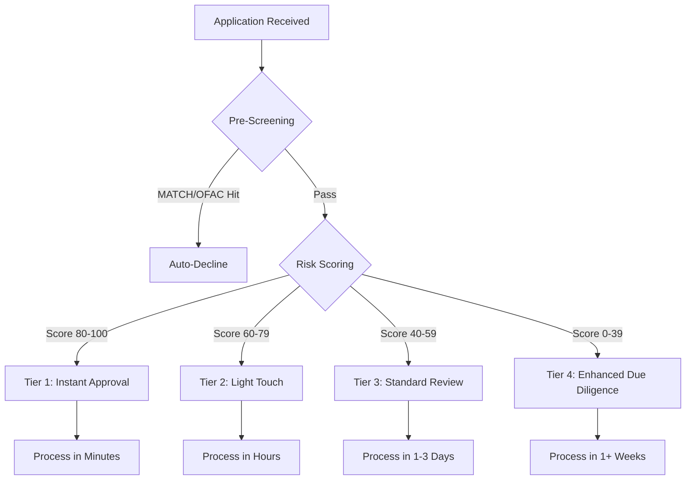
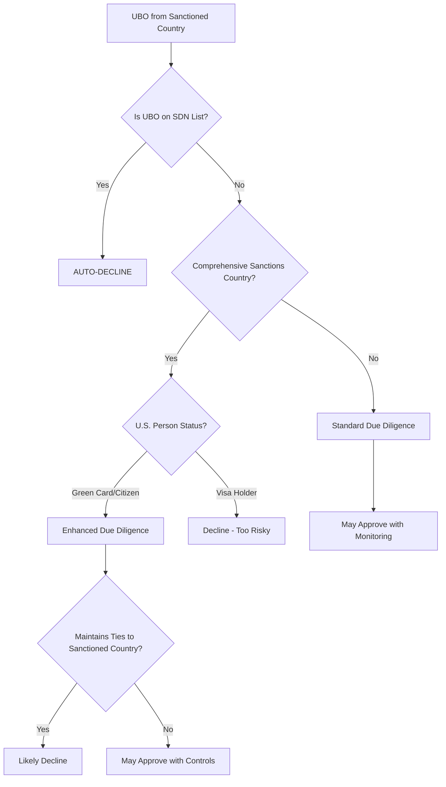

# Underwriting & Risk Assessment Quiz

Test your understanding of underwriting fundamentals, risk factors, MCC codes, and risk scoring models.

---

## Risk Factors

### Question 14

**What makes a "nutraceuticals" merchant higher risk than a "coffee shop" merchant?**

View Answer

**Nutraceuticals (Very High Risk):**

- **Card environment:** Card-not-present (online sales) = 15x higher fraud rate than card-present
- **Delivery timeframe:** Future delivery (ships days later) = more opportunities for disputes
- **Business model:** Often subscription-based with negative option billing = "forgot to cancel" chargebacks
- **Product claims:** Health claims ("lose weight fast," "boost immunity") = regulatory scrutiny (FDA/FTC)
- **Chargeback rate:** Industry average 2-5% (vs. &lt;0.5% goal)
- **Regulatory risk:** FDA warning letters, FTC enforcement actions are common
- **Customer disputes:** "Didn't work," "false advertising," "didn't authorize recurring charge"

**Coffee Shop (Low Risk):**

- **Card environment:** Card-present (EMV chip) = 0.06% fraud rate
- **Delivery timeframe:** Immediate (consumed on-site) = virtually no delivery disputes
- **Business model:** One-time purchase = no subscription disputes
- **Product:** Tangible, straightforward goods = no health claims or regulatory issues
- **Chargeback rate:** Industry average &lt;0.2%
- **Regulatory risk:** Minimal (health permits only)
- **Customer disputes:** Rare (customer present, immediate satisfaction/dissatisfaction)

**Key Difference:** The combination of CNP transactions, future delivery, subscriptions, health claims, and regulatory scrutiny makes nutraceuticals 10-25x riskier than card-present retail with immediate delivery.

**Why This Matters:** Underwriters must understand that risk is **additive**—multiple medium-risk factors can create a high-risk profile. A nutraceuticals merchant combines nearly every high-risk characteristic.

**Related Topic:** [Risk Factors](./risk-factors.md) - See "Business Type Risk by Industry" and "Card Environment Risk" sections

---

### Question 15

**How does delivery timeframe affect chargeback risk? Give examples.**

View Answer

Delivery timeframe directly correlates with chargeback risk:

**Immediate Delivery (Same Day):**

- **Example:** Restaurant meal, coffee shop, gas station
- **Chargeback Rate:** 0.1-0.4%
- **Why Low Risk:** Customer receives product before leaving, sees quality, disputes resolved immediately
- **Common Disputes:** Virtually none (stolen card fraud only)

**Short Delivery (1-7 Days):**

- **Example:** Amazon order, standard e-commerce
- **Chargeback Rate:** 0.5-1.5%
- **Why Medium Risk:** Small window for merchant failure, tracking reduces disputes
- **Common Disputes:** "Never arrived," "wrong item," "damaged in shipping"

**Medium Delivery (1-4 Weeks):**

- **Example:** Custom furniture, made-to-order items, pre-orders
- **Chargeback Rate:** 1.5-3%
- **Why Higher Risk:** Greater opportunity for merchant failure, buyer's remorse period
- **Common Disputes:** "Took too long," "not as described," "changed mind"

**Future Delivery (3+ Months):**

- **Example:** Cruise booked 8 months in advance, concert tickets, crowdfunding
- **Chargeback Rate:** 5-15% (if merchant fails)
- **Why Highest Risk:**
  - Merchant may go out of business before delivery
  - Customer circumstances change (illness, job loss, pandemic)
  - Buyer's remorse over long period
  - If merchant fails, ALL customers chargeback simultaneously
- **Common Disputes:** "Merchant didn't deliver," "canceled but not refunded," "business closed"

**Risk Mitigation by Timeframe:**

| Delivery Window | Reserve | Funding Delay | Additional Controls |
|-----------------|---------|---------------|---------------------|
| Immediate | 0-5% | T+1 to T+2 | Standard |
| 1-7 days | 5-10% | T+2 to T+3 | Tracking numbers |
| 1-4 weeks | 10-15% | T+7 to T+14 | Progress updates |
| 3+ months | 15-20% | T+30+ | Delivery guarantees, escrow |

**Why This Matters:** A travel agency collecting $800,000 for cruises departing 6-12 months out represents massive exposure. If the agency fails, ALL customers file chargebacks simultaneously. This is why travel merchants need 10-20% rolling reserves held until 90 days after delivery.

**Related Topic:** [Risk Factors](./risk-factors.md) - See "Delivery Timeframe Risk" section

---

### Question 16

**A merchant has never processed cards before. What additional risk factors should be considered?**

View Answer

New-to-processing merchants lack the primary risk indicator (chargeback history), requiring evaluation of alternative factors:

**Mandatory Additional Checks:**

1. **Credit History (Always Required)**
   - Personal credit for sole proprietors (FICO score)
   - Business credit if available (D&B PAYDEX, Experian Intelliscore)
   - Cannot waive for new merchants (no processing history to offset)

2. **Business Capitalization**
   - Bank statements showing adequate working capital
   - Ability to fulfill orders without using customer funds
   - 3-6 months operating expenses in reserve

3. **Time in Business (Even if Not Processing)**
   - How long has business operated (with other payment methods)?
   - Cash-only for years? Check business licenses, tax returns
   - Startup (&lt;6 months) = highest risk tier

4. **Owner Experience**
   - Industry experience (10 years in restaurant industry)
   - Prior business ownership (successful exit from previous company)
   - Professional background and education
   - Payment processing experience in previous roles

5. **Online Reputation**
   - Website quality, professionalism, SSL certificate
   - Social media presence and customer engagement
   - Google reviews, Yelp ratings
   - Better Business Bureau rating
   - No negative regulatory actions or complaints

6. **Business Legitimacy Verification**
   - Physical location vs. virtual/home-based
   - Operating licenses and permits
   - Supplier relationships and contracts
   - Inventory or service delivery capability

**Underwriting Adjustments for New Merchants:**

| Factor | Established Merchant | New Merchant |
|--------|---------------------|--------------|
| Reserve | 0-5% | 10-15% minimum |
| Volume Cap | Based on history | Conservative initial limits |
| Monitoring | Standard | Enhanced (daily/weekly for 90 days) |
| Funding | T+2 | T+5 to T+7 |
| Ramp Schedule | Immediate full volume | Gradual increases |

**Gradual Ramp Example:**

- Month 1: $25k cap, 15% reserve, daily monitoring
- Month 2-3: $50k cap if clean (no chargebacks, no fraud)
- Month 4-6: $100k cap, reduce reserve to 10%
- Month 7+: Standard limits and monitoring if performance good

**Statistical Reality:** ~20% of small businesses fail in first year, ~50% within five years. New merchants disproportionately appear on MATCH list.

**Why This Matters:** Without processing history, underwriters must rely on proxy indicators of merchant reliability. A "new" business may actually have experienced ownership—consider the full picture.

**Related Topic:** [Fundamentals](./fundamentals.md) - See "New-to-Processing Merchant Considerations" section

---

### Question 17

**What is the purpose of a reserve, and when should one be required?**

View Answer

**Purpose of Reserves:**

A reserve is funds held by the processor/acquirer to cover potential future chargebacks, refunds, and merchant obligations. It protects the processor from losses if:

- Merchant receives chargebacks after account closure
- Merchant goes out of business with unfulfilled orders
- Merchant lacks funds to cover disputed transactions
- Fraud or compliance issues create liability

**Types of Reserves:**

| Type | How It Works | Best For |
|------|--------------|----------|
| **Rolling Reserve** | X% of each transaction held for Y days, then released | Most common; balances protection with cash flow |
| **Fixed Reserve** | Upfront amount held for duration (e.g., $50k for 12 months) | Very high-risk merchants |
| **Capped Reserve** | Rolling reserve until maximum reached | Medium-risk with limited exposure |

**Rolling Reserve Example:**

10% reserve for 180 days:
- Today's $10,000 in sales → $1,000 held
- 180 days from now → $1,000 released (if no chargebacks)
- Creates a rolling balance that builds over time

**When Reserves Are Required:**

| Scenario | Reserve Recommendation | Reasoning |
|----------|----------------------|-----------|
| Low-risk established business | 0-5% for 90 days | Minimal risk, good history |
| Medium-risk or new business | 5-10% for 180 days | Moderate risk, building history |
| High-risk industry (travel, nutraceuticals) | 10-20% for 365 days | Elevated chargeback risk |
| Future delivery business | 15-20% until delivery + 90 days | Fulfillment risk |
| Prior chargeback issues | 15-25% for 365+ days | Proven elevated risk |
| Very high risk or specialty | 20-50% for 365+ days | Extreme risk mitigation |

**Specific Triggers for Reserves:**

1. New to processing (&lt;1 year history)
2. High-risk MCC (travel, nutraceuticals, telemarketing)
3. Future delivery (30+ days after payment)
4. High average ticket (>$500)
5. Poor credit score (&lt;650)
6. Prior processing issues (0.65%+ chargebacks)
7. No refund policy or restrictive policy
8. High projected volume vs. business size
9. Opaque ownership or complex structure
10. Card-not-present with subscription model

**Real-World Example:**

In 2020, COVID-19 caused ALL travel merchants to face simultaneous chargebacks. Processors with only 5% reserves lost millions; those with 15-20% reserves weathered the storm. This is why delivery timeframe determines reserve requirements.

**Important:** Reserves are merchant's funds (not processor's)—they must be returned when contract ends and all obligations satisfied. Reserve reduction is possible after 6-12 months of clean history.

**Why This Matters:** Reserves are the primary financial protection against merchant failure. Setting appropriate reserves requires balancing merchant cash flow needs against processor risk exposure.

**Related Topic:** [Risk Factors](./risk-factors.md) - See "Reserve Requirements by Risk Tier" section

---

### Question 18

**What is the MATCH list, and why is being added to it devastating for a merchant?**

View Answer

**What is the MATCH List?**

MATCH (Member Alert to Control High-Risk Merchants) is a database maintained by Mastercard that tracks merchants terminated by acquirers/processors for cause. Previously called the TMF (Terminated Merchant File).

**How It Works:**

- When a processor terminates a merchant for certain reasons, they must add the merchant to MATCH
- All processors check MATCH before approving new merchants
- Merchants remain on MATCH for **5 years** from the listing date

**MATCH Reason Codes:**

| Code | Reason | Description |
|------|--------|-------------|
| 01 | Account Data Compromise | Merchant's systems compromised, card data stolen |
| 02 | Common Point of Purchase | Merchant identified as source of fraudulent transactions |
| 03 | Laundering | Money laundering activity |
| 04 | Excessive Chargebacks | Most common—exceeded network thresholds |
| 05 | Excessive Fraud | Fraud rate above acceptable levels |
| 07 | Fraud Conviction | Owner convicted of fraud |
| 08 | Mastercard Questionable Merchant Audit Program | Failed compliance audit |
| 09 | Bankruptcy/Liquidation/Insolvency | Business failed while owing processor |
| 10 | Violation of Standards | Violated card network operating rules |
| 11 | Merchant Collusion | Participated in fraudulent schemes |
| 12 | PCI-DSS Non-Compliance | Failed to maintain security standards |
| 13 | Illegal Transactions | Processed transactions for illegal goods/services |
| 14 | Identity Theft | Merchant account opened using stolen identity |

**Why MATCH Listing is Devastating:**

1. **5-Year Duration:** Cannot be removed early; must wait full 5 years
2. **Industry-Wide Blacklist:** Virtually all processors check MATCH before approval
3. **Auto-Decline:** Most processors automatically decline any MATCH hit
4. **Business Closure:** Unable to accept credit cards = unable to operate for most businesses
5. **Limited Options:** Only specialized high-risk processors may accept MATCH merchants—at very unfavorable terms (30%+ reserves, 8%+ fees)
6. **Personal Impact:** Principals are also listed; starting a new business doesn't help
7. **Reputation Damage:** MATCH presence discovered during due diligence by partners, investors

**Who Gets Listed:**

- The **business** (legal name, DBA, tax ID)
- **All principals** (owners with 10%+ ownership)
- **Business address** and **bank account** (to catch re-applications)

**Threshold Example (Chargebacks):**

- Visa VAMP: >1.5% chargeback rate for 2+ months (tightening to >0.9% in 2026)
- Mastercard ECP: 1.5-2.99% = monitoring, ≥3.0% = high excessive
- Exceeding these thresholds triggers termination AND MATCH listing

**Can MATCH Listings Be Challenged?**

Yes, but rarely successful:
- Contact the listing processor to request removal
- Provide evidence that listing was erroneous
- If listing processor declines, escalate to Mastercard
- Only errors in fact (wrong merchant, incorrect data) warrant removal
- Legitimate listings cannot be removed—must wait 5 years

**Why This Matters:** MATCH listing is effectively a death sentence for a merchant's card acceptance ability. This is why processors take excessive chargebacks so seriously—termination has career-ending consequences for the merchant.

**Related Topic:** [Risk Factors](./risk-factors.md) - See "Processing History" section

---

## MCC Codes

### Question 19

**What is an MCC code, and who assigns it?**

View Answer

**What is an MCC Code?**

An **MCC (Merchant Category Code)** is a four-digit code defined by ISO 18245:2023 that classifies a merchant based on their primary type of business activity.

**Purpose of MCCs:**

1. **Determine interchange rates** - Different business types qualify for different interchange programs
2. **Assess merchant risk** - High-risk industries require enhanced monitoring
3. **Enable spending analytics** - Powers rewards programs and spending tracking
4. **Enforce regulations** - Supports compliance with industry-specific rules (gambling restrictions, firearms tracking)
5. **Prevent fraud** - Detects suspicious merchant activity and misclassification

**MCC Structure:**

| Range | Category | Examples |
|-------|----------|----------|
| 0001-1499 | Agricultural Services | Veterinary, landscaping |
| 1500-2999 | Contracted Services | Construction, plumbing |
| 3000-4000 | Transportation Companies | Airlines, car rental |
| 4000-5000 | Transportation Services | Taxis, shipping |
| 5000-6000 | Retail | Grocery, clothing, gas |
| 6000-7000 | Financial Services | Money transfer, crypto |
| 7000-8000 | Business Services | Hotels, auto repair |
| 8000-9000 | Professional Services | Legal, medical |
| 9000-9999 | Government | Agencies, postal |

**Who Assigns MCCs:**

- **Traditional model:** The acquiring bank assigns the MCC during merchant underwriting
- **PayFac model:** The PayFac assigns MCCs to sub-merchants and bears responsibility for accurate classification

**Assignment Rules:**

- MCC should reflect the merchant's **primary revenue source** (highest volume activity)
- Not based on secondary business lines
- PayFacs are **liable** for misclassification—networks can fine $25,000+ per merchant

**Common MCCs:**

| MCC | Business | Notes |
|-----|----------|-------|
| 5411 | Grocery Stores | Lowest interchange rates |
| 5812 | Restaurants | Restaurant program rates |
| 5814 | Fast Food | PIN debit may be required |
| 5999 | Misc. Retail | Catch-all for general retail |
| 7011 | Hotels | Supports delayed charges |
| 8999 | Professional Services | Standard rates |

**Common Mistakes:**

- ❌ "The merchant chooses their MCC" → ✅ Acquirer/PayFac assigns based on business analysis
- ❌ "MCCs are optional" → ✅ MCCs are mandatory for all card transactions
- ❌ "MCC can change anytime" → ✅ Changes require documented business model changes

**Why This Matters:** Correct MCC assignment is fundamental to interchange optimization, risk assessment, and regulatory compliance. Misclassification can result in network fines, account termination, and MATCH listing.

**Related Topic:** [MCC Codes](./mcc-codes.md) - Complete reference with risk tiers

---

### Question 20

**Why would a merchant want to be classified under a different MCC than their actual business? Why is this problematic?**

View Answer

**Why Merchants Want Different MCCs:**

1. **Lower interchange fees** - Some MCCs have preferential rates
   - Grocery (5411): 1.15% + $0.05
   - Professional Services (8999): 2.30% + $0.10
   - Difference on $100k/month = $1,150/month savings

2. **Avoid high-risk classification** - Tier 1 MCCs incur fees
   - $950 registration fee per merchant
   - Integrity Risk Fee: $0.10 per transaction + 0.10% of transaction amount
   - Enhanced monitoring requirements

3. **Bypass restrictions** - Some programs don't accept certain MCCs
   - Corporate cards may block gambling (7995) or adult services (7273)
   - Consumer spending limits on certain categories

4. **Reduce monitoring** - High-risk MCCs require enhanced compliance and reporting

5. **Escape network thresholds** - Avoid Visa VAMP or Mastercard ECP monitoring

**Why This Is Problematic:**

**Legal/Regulatory Consequences:**

- **Network fines:** $25,000+ per merchant for misclassification
- **Account termination:** Can result in MATCH list addition
- **Interchange clawbacks:** Networks can demand repayment of unearned rate benefits
- **State penalties:** California AB 1587 imposes $10,000 per violation for firearms MCC misuse

**Detection Methods:**

- Transaction pattern analysis (expected vs actual behavior)
- Chargeback reason code analysis
- Website/storefront audits
- Descriptor monitoring

**Detection Example:**

A merchant assigned MCC 5999 (expected ~1% chargeback rate) shows 4% chargebacks with reason codes citing "recurring billing dispute" (common for 5967 teleservices). Network conclusion: Merchant is actually teleservices → investigation initiated.

**Legitimate MCC Changes:**

A merchant whose business model genuinely changes (e.g., restaurant adds catering as primary revenue) may legitimately need an MCC update:

1. Merchant submits change request with justification
2. PayFac reviews revenue breakdown (requires documentation)
3. Update KYC/KYB records
4. Re-run risk assessment for new MCC
5. Monitor transactions for compliance

**Red Flags for MCC Change Requests:**

- Request within 90 days of onboarding
- Request immediately after chargeback spike
- Request coinciding with network inquiry
- Requested MCC has significantly lower interchange
- No documentation supporting business model change

**Why This Matters:** "Helping" merchants avoid proper classification is fraud, not customer service. The short-term fee savings are vastly outweighed by penalties: termination, MATCH listing, fines, and potential criminal liability.

**Related Topic:** [MCC Codes](./mcc-codes.md) - See "Misclassification and Compliance" section

---

### Question 21

**Name three high-risk MCC categories and explain why each is considered high-risk.**

View Answer

**1. MCC 5967 - Direct Marketing / Inbound Teleservices (VIRP Tier 1)**

**Why High-Risk:**

- **Chargeback rates:** 3-8% typical (vs &lt;0.5% target)
- **Business model:** Negative option billing and "free trial" offers lead to disputes
- **Fraud patterns:** Often used for nutraceuticals, supplements with deceptive marketing
- **Regulatory scrutiny:** FTC enforcement actions common
- **Consumer complaints:** High volume of Better Business Bureau complaints
- **"Friendly fraud":** Customers don't recognize recurring charges

**Controls Required:**

- Independent Visa approval before processing
- $950 registration fee
- Integrity Risk Fee: $0.10 per transaction + 0.10% of transaction amount
- Clear disclosure requirements and cancellation policies
- Chargeback monitoring programs

---

**2. MCC 7995 - Gambling, Casino Gaming, Lottery (VIRP Tier 1)**

**Why High-Risk:**

- **Regulatory complexity:** State-by-state legality, tribal gaming compacts
- **Responsible gaming:** Addiction concerns, self-exclusion requirements
- **Age verification:** Must prevent underage gambling
- **Fraud risk:** Account takeovers, stolen cards, money laundering
- **Geolocation:** Must verify customer location for legal compliance
- **Chargeback rates:** 2-8% due to losses disputes and buyer's remorse

**Controls Required:**

- Independent Visa approval
- $950 registration fee + Integrity Risk Fee
- State licensing verification
- Geofencing technology
- Problem gambling resources
- Strong authentication (KYC verification)

---

**3. MCC 6051 - Non-Financial Institutions: Cryptocurrency (VIRP Tier 2)**

**Why High-Risk:**

- **Volatility:** Price fluctuations create dispute risk ("I paid $100 for $80 worth of crypto")
- **Regulatory uncertainty:** Evolving federal/state regulations
- **AML/BSA compliance:** FinCEN MSB registration, state MTL requirements (49 states)
- **Fraud:** Exchange hacks, pump-and-dump schemes, ransomware payments
- **Sanctions risk:** OFAC compliance for cross-border transactions
- **Consumer confusion:** Complex products lead to buyer's remorse
- **Irreversibility:** Blockchain transactions cannot be reversed

**Controls Required:**

- $950 registration fee
- Control assessment documentation
- AML program with transaction monitoring
- Know Your Customer (KYC) verification
- State money transmitter licenses (~$225,000 annual compliance cost)
- Sanctions screening (OFAC SDN list)

---

**Additional High-Risk MCCs:**

| MCC | Category | Primary Risk |
|-----|----------|--------------|
| 7273 | Dating/Escort Services | Reputational risk, fraud, human trafficking |
| 5122/5912 | Pharmacies (online/unlicensed) | Controlled substances, counterfeit drugs |
| 5933 | Pawn Shops | Money laundering, stolen goods |

**Why This Matters:** High-risk doesn't mean "don't approve"—it means "apply appropriate controls." Understanding WHY each MCC is high-risk enables underwriters to design effective mitigation strategies.

**Related Topic:** [MCC Codes](./mcc-codes.md) - See "Risk Classifications" and "VIRP Tier" sections

---

### Question 22

**How do MCC codes affect interchange rates?**

View Answer

MCCs directly determine which **interchange programs** a merchant qualifies for, creating significant rate differences.

**Mechanism:**

1. Each card network defines interchange programs tied to specific MCCs
2. Certain MCCs qualify for preferential "everyday spend" rates (grocery, gas, supermarkets)
3. High-risk MCCs may have higher interchange or additional fees
4. Professional services typically have standard (higher) interchange

**Interchange Rate Examples (Illustrative):**

| MCC | Business Type | Visa CPS Rate | Standard Rate | Monthly Savings on $100K |
|-----|---------------|---------------|---------------|--------------------------|
| 5411 | Grocery Store | 1.15% + $0.05 | 2.30% + $0.10 | ~$1,150 |
| 5812 | Restaurant | 1.54% + $0.10 | 2.30% + $0.10 | ~$760 |
| 5542 | Gas Station | 1.19% + $0.05 | 2.30% + $0.10 | ~$1,110 |
| 5999 | Misc. Retail | 1.51% + $0.10 | Standard | Baseline |
| 8999 | Professional Services | 2.30% + $0.10 | N/A | Standard rate |
| 5967 | Teleservices (Tier 1) | 2.70% + Integrity Fee | N/A | Additional costs |

**Volume Impact Example:**

For a restaurant processing $100,000/month:
- **Correct MCC 5812:** $1,540 + $100 = $1,640/month in interchange
- **Misclassified as 8999:** $2,300 + $100 = $2,400/month
- **Annual difference:** $9,120

**High-Risk MCC Additional Costs:**

For Tier 1 MCC 5967 processing $50,000/month (100 transactions averaging $500):
- **Base interchange:** ~$1,350
- **Integrity Risk Fee:** $10 (100 txns × $0.10) + $50 (0.10% of $50,000) = $60
- **Registration fee:** $950 (one-time)
- **Total first month:** $2,360+ vs ~$1,350 for standard MCC

**Why Certain MCCs Get Lower Rates:**

- **Everyday spend categories** (grocery, gas): Networks want to encourage card usage
- **High volume/low ticket:** Lower fraud risk, higher transaction count
- **Card-present dominance:** Lower fraud rates justify lower interchange

**What Affects Qualification Beyond MCC:**

- **Data quality:** Submitting AVS/CVV enables CPS (Custom Payment Service) qualification
- **Transaction type:** Card-present vs card-not-present
- **Card type:** Consumer vs commercial vs premium rewards

**Optimization vs Fraud:**

- ✅ **Legitimate:** Ensuring a restaurant submits AVS/CVV to qualify for CPS Restaurant rates
- ❌ **Fraud:** Coding a telemarketing company (5967) as professional services (8999) to avoid Tier 1 fees

**Why This Matters:** MCCs are foundational to payment economics. For PayFacs, accurate MCC assignment optimizes merchant costs while maintaining compliance. Misclassification for fee avoidance is fraud with severe consequences.

**Related Topic:** [MCC Codes](./mcc-codes.md) - See "MCC and Interchange Rates" section

---

## Scenario Questions

### Question 23

**Scenario:** A new merchant applies. The business is 2 months old, sells dietary supplements online, ships internationally, and the owner has a personal bankruptcy from 3 years ago. Walk through the underwriting considerations.

View Answer

**Risk Assessment Summary:**

This merchant combines multiple high-risk factors requiring careful evaluation:

| Factor | Value | Risk Level | Points |
|--------|-------|------------|--------|
| Business Age | 2 months | Very High | 35 |
| Industry/MCC | Nutraceuticals (5967) | Very High | 50 |
| Card Environment | CNP (online) | High | 20 |
| Delivery Model | Ships internationally | High | 15 |
| Owner Credit | Bankruptcy 3 years ago | High | 25 |
| Processing History | None | Medium | 15 |
| **Total Risk Score** | | **Very High** | **160/100 (capped)** |

**Key Underwriting Considerations:**

**1. MCC Classification (5967 - Teleservices)**

- VIRP Tier 1 = requires independent Visa approval
- $950 registration fee + Integrity Risk Fee
- PayFac cannot approve unilaterally

**2. New Business Risk**

- 2 months old = highest failure rate tier (~30% first-year failure for e-commerce)
- No operating history to verify business model viability
- Cannot assess fulfillment capability

**3. Nutraceuticals Industry Risk**

- Average chargeback rate: 2-5%
- FTC/FDA regulatory scrutiny
- Health claims verification required
- Subscription/negative option billing common

**4. International Shipping**

- Cross-border chargebacks harder to defend
- Longer delivery timeframes = higher dispute window
- OFAC sanctions screening required for all shipments
- Currency conversion disputes

**5. Owner Bankruptcy**

- 3 years old = still significant risk (typically 7 years for full weight reduction)
- Indicates prior financial management issues
- Personal guarantee may have limited value

**Underwriting Decision Options:**

**Option A: Decline**

Most likely outcome given risk concentration:
- Very high-risk industry + new business + poor credit = exceeds risk tolerance
- Adverse action notice required with specific reasons
- Document: "Application declined due to: (1) High-risk industry classification (MCC 5967), (2) Insufficient business operating history (2 months), (3) Owner credit history concerns (bankruptcy within 5 years)"

**Option B: Approve with Extreme Controls (Specialized High-Risk Program)**

If PayFac has high-risk appetite and Visa approves:
- **Reserve:** 25-30% rolling for 365+ days
- **Volume cap:** $10,000/month initial (ramp based on performance)
- **Funding delay:** T+14 to T+30
- **Monitoring:** Daily review
- **Additional requirements:**
  - FDA compliance documentation
  - Clear refund policy (30-day minimum)
  - No negative option billing
  - Personal guarantee from owner
  - Supplier agreements verified
  - Website compliance review (no false health claims)

**Due Diligence Steps:**

1. Request 6 months of bank statements (verify capitalization)
2. Review website for FTC compliance (no false health claims)
3. Verify supplier relationships and inventory
4. Confirm refund/cancellation policy is clear
5. Pull credit report (verify bankruptcy details)
6. OFAC screening for all shipping destinations
7. Submit to Visa for Tier 1 approval

**Why This Matters:** This scenario tests ability to identify multiple compounding risk factors and understand that individual factors combine to create overall risk profile. Even if each factor alone might be acceptable, the combination typically warrants decline.

**Related Topics:**
- [Risk Factors](./risk-factors.md) - Combining risk factors
- [MCC Codes](./mcc-codes.md) - VIRP Tier 1 requirements

---

### Question 24

**Scenario:** A merchant was approved 6 months ago with $50K/month projected volume. They're now processing $500K/month with a 2% chargeback rate. What actions should be taken?

View Answer

**Immediate Risk Assessment:**

| Issue | Threshold | Current | Status |
|-------|-----------|---------|--------|
| Volume variance | &lt;300% projected | 1000% (10x) | **Critical** |
| Chargeback rate | &lt;1.5% | 2.0% | **Excessive** |
| Network threshold | Visa: 1.5% early warning | 2.0% | **Exceeds threshold** |

**This is a RED FLAG situation requiring immediate action.**

**Immediate Actions (Within 24 Hours):**

1. **Hold Next Payout**
   - Freeze disbursement pending review
   - Notify merchant of hold and review process

2. **Alert Risk Team**
   - Escalate to underwriting manager
   - Document timeline and findings

3. **Review Transaction Patterns**
   - Analyze transaction sizes, times, geographic distribution
   - Check for fraud patterns (velocity spikes, card testing)
   - Compare to original business description

4. **Network Notification Check**
   - Determine if merchant has triggered Visa VAMP or Mastercard ECP
   - If yes, initiate required reporting

**Investigation Steps:**

**Volume Analysis:**
- Why 10x increase? Legitimate growth or concerning pattern?
- Did product line change?
- Is merchant advertising consistent with original application?
- Check website for changes since approval

**Chargeback Analysis:**
- What reason codes are driving chargebacks?
- Are they concentrated (fraud vs disputes)?
- Customer complaint patterns?
- Timeline of chargeback increase

**Possible Scenarios:**

| Scenario | Volume Explanation | Chargeback Explanation | Action |
|----------|-------------------|------------------------|--------|
| **Legitimate Growth + Growing Pains** | Viral marketing success | Customer service overwhelmed | Re-underwrite, increase reserves, remediation plan |
| **Business Model Change** | Pivoted to different product | New product generates more disputes | Re-underwrite for new business model |
| **Fraud/Money Laundering** | Fraudulent transactions | Stolen card chargebacks | Terminate immediately, consider MATCH |
| **Merchant Distress** | Overselling capacity | Cannot fulfill orders | Terminate, hold reserves |

**Re-Underwriting Requirements:**

1. **Updated Application**
   - Current business description
   - Explanation for volume increase
   - Updated projected volumes

2. **Financial Documentation**
   - 3-6 months bank statements
   - Financial statements showing business can support volume
   - Proof of fulfillment capacity

3. **Chargeback Remediation Plan**
   - Root cause analysis
   - Specific actions to reduce chargebacks
   - Timeline for improvement

**New Terms (If Approved to Continue):**

| Element | Original Terms | New Terms |
|---------|---------------|-----------|
| Reserve | 10% | 20-25% |
| Volume Cap | $50K/month | Actual volume with 20% buffer |
| Funding | T+2 | T+7 |
| Monitoring | Weekly | Daily |
| Review Period | 90 days | Must achieve &lt;1% CB rate |

**Termination Criteria:**

If any of the following:
- Cannot explain volume increase
- Evidence of fraud or money laundering
- Refuses to cooperate with re-underwriting
- Cannot demonstrate fulfillment capability
- Chargeback rate doesn't improve within 60 days

**Network Implications:**

At 2% chargeback rate:
- **Visa VAMP:** Merchant is in "excessive" territory (>1.5%)
- **Mastercard ECP:** At 2%, qualifies for ECM program
- **Consequences:** Monthly fines, required remediation, potential MATCH listing

**Why This Matters:** Volume spikes combined with chargeback increases are classic indicators of merchant distress, business model change, or fraud. Waiting to act risks significant financial loss and network penalties.

**Related Topics:**
- [Ongoing Monitoring](../merchant-lifecycle/ongoing-monitoring.md)
- [Risk Factors](./risk-factors.md) - Volume variance monitoring

---

### Question 25

**Scenario:** During onboarding, a merchant provides a business license, but the address doesn't match their stated business address. What are the possible explanations and next steps?

View Answer

**Possible Explanations:**

**Legitimate Reasons:**

| Explanation | Likelihood | Verification |
|-------------|------------|--------------|
| **Recent relocation** | Common | Check USPS forwarding, business registration update filing |
| **Home-based business** | Common | License at home, operating address at commercial space |
| **Multiple locations** | Moderate | License at HQ, processing for branch location |
| **Virtual office** | Moderate | Physical mail address differs from registered address |
| **State registration vs operating** | Moderate | Incorporated in Delaware, operating in California |

**Concerning Reasons:**

| Explanation | Likelihood | Red Flags |
|-------------|------------|-----------|
| **Fraudulent application** | Low-Moderate | Using someone else's business license |
| **Shell company** | Low | License address is mailbox/virtual office |
| **Identity theft** | Low | Business doesn't actually exist at stated address |
| **Misrepresentation** | Moderate | Trying to appear more established |

**Verification Steps:**

**Step 1: Request Clarification**

Ask merchant directly:
- "We noticed your business license shows [Address A] but your application states [Address B]. Can you explain this discrepancy?"
- Document their response

**Step 2: Verify Both Addresses**

| Check | Method | What to Look For |
|-------|--------|------------------|
| License address | Secretary of State lookup | Is business registered there? |
| Stated address | Google Maps/Street View | Does business exist there? |
| License address | Property records | Who owns/rents this property? |
| Stated address | Phone directory | Is business listed there? |
| Both addresses | Site visit (high-risk) | Physical verification |

**Step 3: Additional Documentation**

Request supporting documentation:
- Lease agreement for operating address
- Utility bill at operating address
- Updated business license (if recently moved)
- State registration showing both addresses

**Step 4: Cross-Reference**

- Does bank account address match either location?
- Do principals' addresses make sense geographically?
- Does website show consistent address?

**Decision Framework:**

| Scenario | Evidence | Decision |
|----------|----------|----------|
| **Clear legitimate reason** | Updated registration, lease at new address | Proceed with approval |
| **Partially explained** | Some documentation, minor gaps | Conditional approval, enhanced monitoring |
| **Inconsistent explanations** | Story changes, documentation doesn't support | Decline |
| **Evidence of fraud** | License belongs to different entity | Decline, document for potential fraud report |

**Red Flag Combinations:**

Escalate to manual review if address discrepancy combined with:
- New business (&lt;6 months)
- No online presence
- High-risk MCC
- Principals at different geographic location
- Bank account at third location

**Documentation Requirements:**

Whatever the outcome, document:
- The discrepancy identified
- Merchant's explanation
- Verification steps taken
- Evidence reviewed
- Rationale for decision

**Why This Matters:** Address discrepancies are one of the most common fraud indicators, but also frequently have legitimate explanations. The key is systematic verification rather than automatic rejection or acceptance.

**Related Topics:**
- [KYC/KYB Requirements](../kyc-kyb/index.md)
- [Fundamentals](./fundamentals.md) - Data validation

---

### Question 26

**Scenario:** Design a tiered onboarding process that allows instant approval for low-risk merchants while flagging high-risk merchants for manual review. What criteria would define each tier?

View Answer

**Tiered Onboarding Framework:**

---

**Tier 1: Instant Approval (Auto-Approve)**

**Criteria (ALL must be met):**

| Factor | Requirement |
|--------|-------------|
| MCC | Low-risk only (5411, 5812, 5814, 5311, 7011, etc.) |
| Business Age | 2+ years |
| Credit Score | 700+ (owner or business) |
| Volume | &lt;$100K/month projected |
| Card Environment | Card-present or CNP with 3DS |
| Processing History | Clean (&lt;0.5% chargeback) or new-to-processing with strong credit |
| KYC/KYB | All verifications pass (identity, business registration) |
| MATCH/OFAC | Clear |

**Process:**
- Automated decisioning in seconds
- No human review required
- Standard terms: 0-5% reserve, T+2 funding

**SLA:** Real-time to 4 hours

---

**Tier 2: Light-Touch Review (Spot Check)**

**Criteria (ANY triggers Tier 2):**

| Factor | Trigger |
|--------|---------|
| MCC | Medium-risk (5999, 7399, subscription services) |
| Business Age | 6 months - 2 years |
| Credit Score | 650-699 |
| Volume | $100K-$250K/month |
| Processing History | None (new to processing) with good credit |
| Minor Verification Gaps | One minor KYC discrepancy |

**Process:**
- Quick manual review (15-30 minutes)
- Verify one or two key items
- May request one additional document

**SLA:** 4-24 hours

---

**Tier 3: Standard Review (Full Underwriting)**

**Criteria (ANY triggers Tier 3):**

| Factor | Trigger |
|--------|---------|
| MCC | Higher-risk (5962, 5966, 6211, travel) |
| Business Age | &lt;6 months |
| Credit Score | 600-649 |
| Volume | $250K-$500K/month |
| Processing History | 0.5-1.0% historical chargeback rate |
| Multiple Verification Gaps | Several KYC discrepancies |
| Complex Structure | Multiple owners, related entities |

**Process:**
- Full underwriting review (2-4 hours)
- Request processing statements
- Verify business legitimacy
- May require phone call with merchant

**SLA:** 1-3 business days

---

**Tier 4: Enhanced Due Diligence**

**Criteria (ANY triggers Tier 4):**

| Factor | Trigger |
|--------|---------|
| MCC | High-risk/VIRP Tier 1-2 (5967, 7273, 7995, 6051) |
| Credit Score | &lt;600 |
| Volume | >$500K/month |
| Processing History | >1.0% historical chargeback rate |
| International | Cross-border processing |
| Prior Issues | Previous termination (not MATCH listed) |
| Complex Structure | Opaque ownership, offshore entities |

**Process:**
- Senior underwriter review
- Comprehensive financial review
- Site visit may be required
- Network approval (VIRP Tier 1)
- Sponsor bank notification

**SLA:** 1-2 weeks

---

**Risk Scoring Matrix:**

| Factor | Weight | Low (0 pts) | Medium (5-10 pts) | High (15-25 pts) |
|--------|--------|-------------|-------------------|------------------|
| Business Age | 15% | 5+ years | 1-5 years | &lt;1 year |
| Industry/MCC | 25% | Retail CP | E-commerce | Nutra/Gambling |
| Credit Score | 20% | 720+ | 650-719 | &lt;650 |
| Volume | 10% | &lt;$50K | $50K-$200K | &gt;$200K |
| Processing History | 15% | &lt;0.3% CB | 0.3-0.65% CB | &gt;0.65% or none |
| Card Environment | 10% | CP only | CNP with 3DS | CNP no 3DS |
| Delivery Timeframe | 5% | Immediate | 1-7 days | 30+ days |

**Implementation Considerations:**

1. **Automation First:** Build rules engine to handle Tier 1 completely without human involvement
2. **Exception Routing:** Clear escalation paths for edge cases
3. **Continuous Learning:** Track override rates to calibrate thresholds
4. **SLA Monitoring:** Dashboard showing applications by tier and aging
5. **Sponsor Bank Alignment:** Ensure tiering aligns with sponsor requirements

**Why This Matters:** Tiered onboarding balances speed (competitive advantage) with thoroughness (risk management). The goal is to handle 60-70% of applications at Tier 1-2 while ensuring high-risk merchants receive appropriate scrutiny.

**Related Topics:**
- [Fundamentals](./fundamentals.md) - Tiered underwriting approaches
- [Risk Scoring](./risk-scoring.md) - Decision thresholds

---

### Question 27

**Scenario:** A merchant's beneficial owner is a citizen of a country under U.S. sanctions, but the business is U.S.-based and the owner is a U.S. permanent resident. Can they be onboarded?

View Answer

**Short Answer:** Potentially yes, but requires careful OFAC analysis and enhanced due diligence.

**Key Distinction:**

OFAC sanctions target:
1. **Countries/Regions:** Comprehensive sanctions (Cuba, Iran, North Korea, Syria, Crimea)
2. **Individuals:** Specially Designated Nationals (SDN) list
3. **Entities:** SDN list entries

**Critical Questions:**

| Question | Why It Matters |
|----------|---------------|
| Which country? | Comprehensive vs targeted sanctions differ significantly |
| Is the individual on SDN list? | SDN listing = automatic block, regardless of residency |
| What is their immigration status? | Permanent resident vs visa holder affects analysis |
| Do they maintain ties to sanctioned country? | Financial relationships, property, business interests |
| What is the business activity? | Some activities have specific restrictions |

**Sanctions Program Analysis:**

**Comprehensive Sanctions (Most Restrictive):**
- Cuba, Iran, North Korea, Syria, Crimea/Donetsk/Luhansk regions
- Prohibit nearly all transactions with the country
- Citizenship alone may create compliance concerns
- **Higher scrutiny required**

**Targeted/List-Based Sanctions:**
- Venezuela, Russia (partial), others
- Target specific individuals, entities, sectors
- Citizenship alone typically NOT a blocker
- **Standard due diligence may suffice**

**Decision Framework:**

**Enhanced Due Diligence Requirements:**

If proceeding with onboarding:

1. **OFAC Screening**
   - Screen full name, all aliases, date of birth
   - Screen against SDN, Blocked Persons, Sectoral lists
   - Screen business name and all related entities

2. **Negative News Search**
   - Search for connections to sanctioned entities
   - Political connections in sanctioned country
   - Prior sanctions violations

3. **Source of Funds**
   - Verify funds don't originate from sanctioned country
   - Review bank statements for suspicious transfers

4. **Ongoing Monitoring**
   - Enhanced transaction monitoring
   - Regular re-screening (quarterly minimum)
   - Flag any transactions touching sanctioned jurisdictions

**Documentation Requirements:**

- Copy of permanent resident card (Green Card)
- Declaration of no financial ties to sanctioned country
- Business purpose and customer base (ensure no sanctioned country nexus)
- Signed compliance acknowledgment

**Risk Mitigation Terms:**

| Control | Purpose |
|---------|---------|
| Enhanced monitoring | Detect sanctioned country transactions |
| Geographic restrictions | Block transactions from sanctioned regions |
| Periodic re-verification | Ensure status hasn't changed |
| Compliance attestation | Annual certification of no sanctioned ties |

**When to Decline:**

- Individual appears on SDN list
- Maintains financial accounts in sanctioned country
- Has ongoing business operations in sanctioned country
- Business serves customers in sanctioned country
- Cannot verify source of funds
- Recent immigration from sanctioned country (&lt;2 years)

**Legal Consultation:**

This scenario should involve OFAC compliance counsel because:
- Sanctions violations carry severe penalties ($250,000+ per violation)
- Criminal liability possible for willful violations
- Guidance can be nuanced based on specific facts
- OFAC provides licensing process for certain activities

**Why This Matters:** Sanctions compliance is non-negotiable—violations can result in criminal prosecution and massive fines. However, citizenship/nationality alone doesn't automatically disqualify someone. The key is systematic analysis of actual sanctions risk.

**Regulatory References:**
- [OFAC Sanctions Programs](https://ofac.treasury.gov/sanctions-programs-and-country-information)
- [SDN List Search](https://sanctionssearch.ofac.treas.gov/)

**Related Topics:**
- [Sanctions Screening](../kyc-kyb/sanctions-screening.md)
- [Beneficial Ownership](../kyc-kyb/beneficial-ownership.md)

---

## Related Study Materials

- [Fundamentals](./fundamentals.md) - Core underwriting principles
- [Risk Factors](./risk-factors.md) - Detailed risk indicators
- [MCC Codes](./mcc-codes.md) - Industry classification reference
- [Risk Scoring](./risk-scoring.md) - Scoring models and decision engines
- [KYC/KYB Index](../kyc-kyb/index.md) - Identity verification requirements
- [Merchant Lifecycle](../merchant-lifecycle/index.md) - Ongoing monitoring

---

> **Next:** Continue to [Merchant Lifecycle](/onboarding/merchant-lifecycle/) to learn about merchant agreements and ongoing monitoring.
