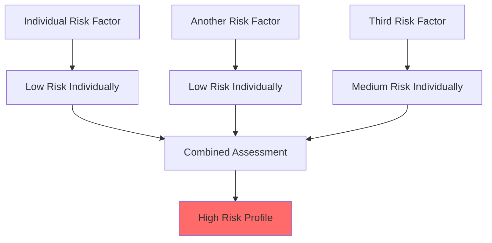
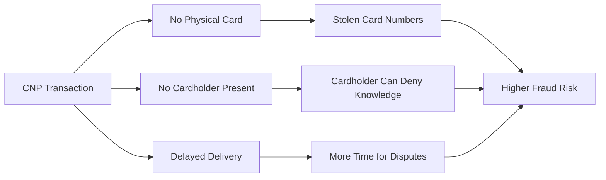
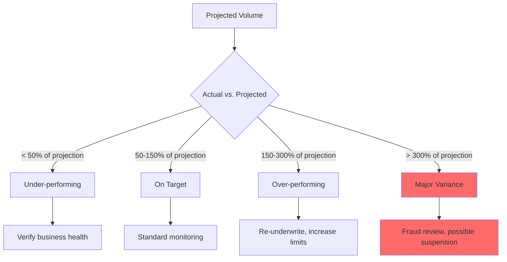
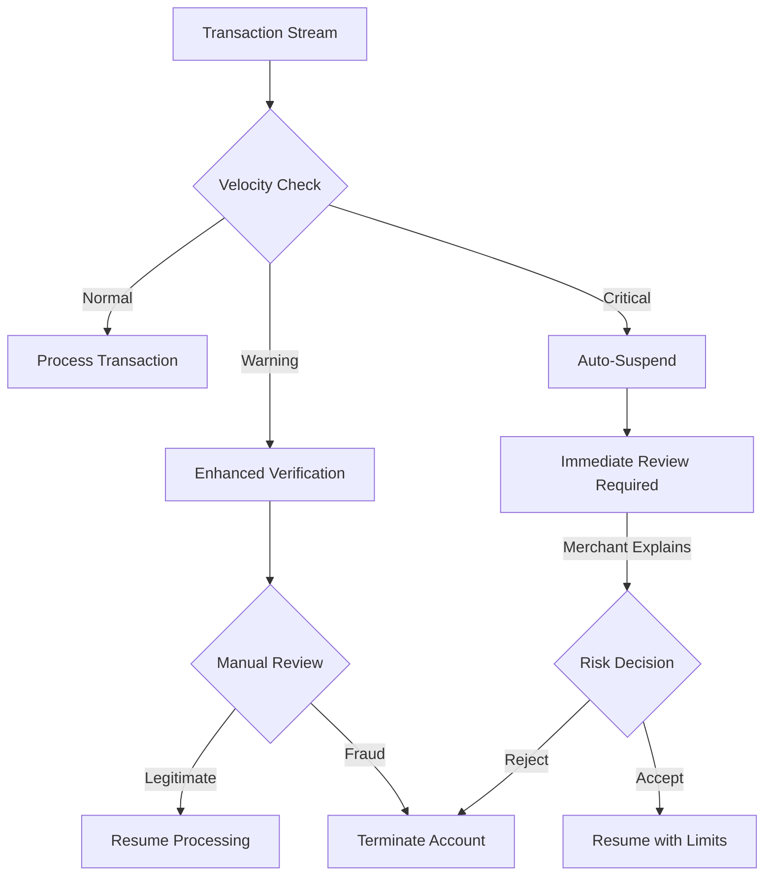
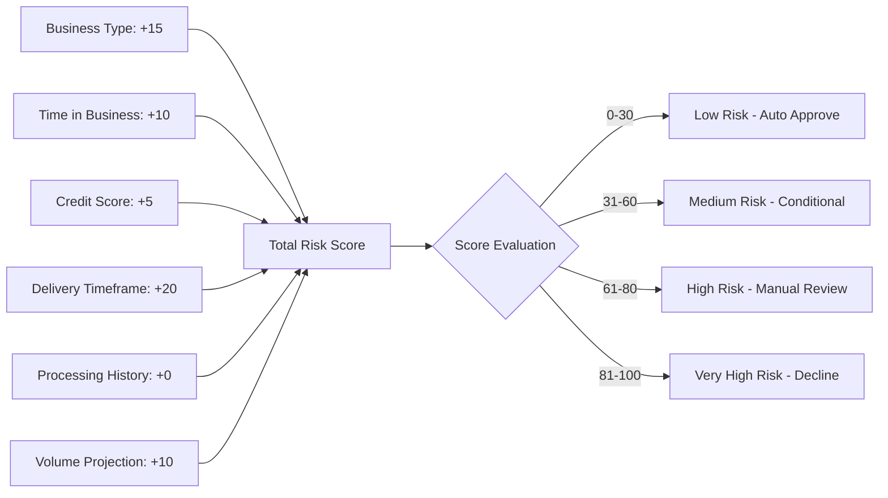
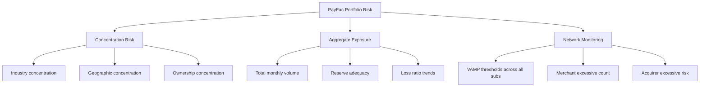

# Risk Factors in Underwriting

> **Last Updated:** 2025-12-26
> **Status:** Complete

## Quick Reference

**Purpose:** Identify and quantify merchant risk to determine approval decisions and appropriate terms.

**Key Insight:** Risk is **additive** - multiple medium-risk factors can create a high-risk profile.

**Critical Fact:** Individual risk factors matter less than their combination and context.

**Decision Impact:** Risk factors determine:

- Approval vs. decline
- Reserve requirements (0-50%)
- Volume limits
- Pricing tier
- Monitoring intensity

**PayFac Context:** Portfolio-level risk aggregation requires managing concentration across all sub-merchants.

## Overview

Risk factors are measurable characteristics of a merchant's business, processing history, ownership, and operations that indicate the likelihood of:

- **Fraud:** Stolen card usage, identity theft, fake businesses
- **Chargebacks:** Customer disputes exceeding acceptable thresholds
- **Regulatory Violations:** AML, sanctions, licensing non-compliance
- **Merchant Failure:** Business collapse leading to unfulfilled obligations
- **Reputational Damage:** Association with controversial or illegal activities

Effective underwriting evaluates **multiple dimensions** of risk simultaneously. A merchant may be low-risk in one dimension (established business) but high-risk in another (delivery timeframe), requiring nuanced evaluation.

:::tip Risk is Contextual
The same business characteristic can be low-risk in one context and high-risk in another. For example:

- $50,000 monthly volume = low risk for an established restaurant
- $50,000 monthly volume = high risk for a 1-month-old online business
:::

### Why Multiple Factors Matter

Risk rarely comes from a single factor. Instead, **combinations** of factors create risk profiles:



**Example Combination:**

- New business (&lt; 6 months) = Medium risk
- High-risk MCC (nutraceuticals) = Medium risk
- No processing history = Medium risk
- Poor owner credit score = Medium risk

**Individual Assessment:** Each factor alone might be acceptable

**Combined Assessment:** Together they indicate very high risk - likely decline or heavy restrictions

### Risk vs. Pricing Relationship

Higher risk doesn't always mean rejection. It often means adjusted terms:

| Risk Level | Typical Outcome | Reserve Requirement | Volume Limits | Funding Schedule | Pricing |
|------------|----------------|---------------------|---------------|------------------|---------|
| **Low** | Auto-approve | 0-5% (0-90 days) | Standard | T+1 or T+2 | Best rates |
| **Medium** | Conditional approval | 5-10% (90-180 days) | Capped initially | T+3 to T+7 | Mid-tier rates |
| **High** | Manual review + restrictions | 10-20% (180-365 days) | Strict caps | T+7 to T+14 | Higher rates |
| **Very High** | Decline or specialized program | 20-50% (365+ days) | Very limited | T+30+ | Premium rates |

## Business Risk Indicators

Business-level characteristics that affect overall risk assessment.

### Business Type Risk by Industry

Different industries have inherent risk levels based on historical performance data:

| Industry Category | Examples | Typical Chargeback Rate | Risk Level | Reasoning |
|------------------|----------|------------------------|------------|-----------|
| **Retail - Card Present** | Grocery, hardware stores, clothing boutiques | 0.10-0.30% | **Low** | Customer present, immediate delivery, tangible goods |
| **Restaurants & Food Service** | Restaurants, cafes, food trucks | 0.15-0.40% | **Low** | Card present, immediate consumption, low ticket |
| **Professional Services** | Law firms, accounting, consulting | 0.20-0.50% | **Low-Medium** | Established relationship, B2B transactions |
| **Retail - E-commerce** | General online retail | 0.50-1.00% | **Medium** | CNP, shipping delays possible, returns common |
| **Digital Goods** | Software, e-books, online courses | 0.80-2.00% | **Medium-High** | Intangible, easy chargebacks ("didn't work") |
| **Subscription Services** | SaaS, membership sites, streaming | 1.00-2.50% | **Medium-High** | Recurring billing disputes, "forgot to cancel" |
| **Travel & Hospitality** | Hotels, airlines, tour operators | 0.70-1.50% | **Medium-High** | Future delivery, cancellations, weather/health events |
| **Nutraceuticals** | Supplements, vitamins, weight loss | 2.00-5.00% | **High** | Health claims, negative options, regulatory scrutiny |
| **Telemarketing** | Outbound sales, free trial offers | 3.00-8.00% | **High** | Aggressive sales, buyer's remorse, elderly targeting |
| **Dating Services** | Online dating, matchmaking | 2.00-6.00% | **High** | Intangible results, emotional purchases, fake profiles |
| **Adult Content** | Adult entertainment, webcams | 3.00-10.00% | **Very High** | Fraud, family member disputes, regulatory issues |
| **Gambling** | Online casinos, sports betting | 2.00-8.00% | **Very High** | Addictive behavior, losses disputes, regulatory |

:::info Industry Benchmarks (2025)
**Overall US Average:** 0.65% across all industries

**By Transaction Type:**

- Card-Present: 0.10-0.50%
- Card-Not-Present: 0.93% (15x higher fraud rate than CP)

**Acceptable Range:** &lt;0.5% is considered "safe zone"

**Warning Thresholds:**

- **Visa VAMP (April 2025):** >2.2% merchant excessive (drops to >1.5% April 2026)
- **Visa VAMP (April 2026):** >0.9% early warning (drops from current >1.5%)
- **Mastercard ECP:** 1.5-2.99% = ECM program, ≥3.0% = HECM program
:::

### Card Environment Risk

The method of card presentation dramatically affects fraud and chargeback risk:

| Environment | Description | Fraud Rate (2025) | Chargeback Risk | Authentication | Risk Level |
|-------------|-------------|-------------------|-----------------|----------------|------------|
| **Card Present (CP)** | Physical card swiped/inserted/tapped at point of sale | 0.06% | Very Low | EMV chip, PIN | **Low** |
| **Card Not Present (CNP)** | Card details entered manually (online, phone, mail) | 0.93% (15x higher) | High | CVV, AVS, 3DS | **Medium-High** |
| **E-commerce** | Online shopping with shipping | 1.20% | High | 3DS2, device fingerprinting | **High** |
| **MOTO** | Mail Order / Telephone Order | 0.80% | Medium-High | Limited (CVV, address) | **Medium-High** |
| **Recurring/Subscription** | Saved card on file, automatic billing | 1.50% | Very High | Initial verification only | **High** |
| **Mobile In-App** | Purchases within mobile applications | 0.70% | Medium | App store protections vary | **Medium** |

**Why Card-Not-Present is Higher Risk:**



### ACH vs. Card Risk Comparison

Many PayFacs process both card and ACH transactions. Each has distinct risk characteristics:

| Risk Dimension | Card Transactions | ACH Transactions | Key Difference |
|----------------|-------------------|------------------|----------------|
| **Dispute Window** | 60-120 days (max 540 for fraud) | Up to 60 days (unauthorized) | Similar timeframe |
| **Dispute Rate** | 0.65% average (CNP: 0.93%) | 0.5-2.0% (returns/NSF) | ACH can be higher for some models |
| **Fraud Detection** | Real-time (milliseconds) | Batch processing (1-3 days) | Card = immediate feedback |
| **Return Codes** | Decline codes (insufficient funds immediate) | NSF returns 2-3 days later | ACH = delayed failure |
| **Liability** | Card networks arbitrate | Direct merchant liability (Nacha rules) | ACH = less protection |
| **Identity Verification** | Card issuer validates | Merchant validates account ownership | ACH = higher fraud if not verified |
| **Authorization** | Real-time approval/decline | No pre-authorization (debits process blind) | ACH = "push and pray" |

**ACH-Specific Risk Factors:**

| High-Risk ACH Scenario | Risk Level | Why It's Risky |
|------------------------|------------|----------------|
| Subscription Debits | High | Customer claims unauthorized, high return rates |
| Large First Transaction | High | No account validation, $5k+ initial debit = high NSF risk |
| Consumer Accounts | Medium-High | Higher return rates than business accounts |
| Manual Entry | Medium | Typed account numbers prone to typos |
| No Account Verification | Very High | Proceeding without confirming account ownership |

**ACH Underwriting Requirements:**

- Nacha Third-Party Sender (TPS) registration required for PayFacs
- ACH-specific reserves (often higher than card: 10-15% baseline)
- Account ownership verification (micro-deposits or instant verification via Plaid)
- Return rate monitoring (&lt;1% acceptable, >2% = Nacha violation risk)
- OFAC screening for all ACH transactions

:::info PayFac Consideration
Most modern PayFacs support both card and ACH, requiring dual risk frameworks. A merchant might be low-risk for cards (established, good history) but high-risk for ACH (new to bank transfers, large ticket debits).
:::

### Business Model Risk

How a merchant makes money affects delivery disputes and chargebacks:

| Business Model | Description | Primary Risk | Chargeback Rate | Mitigation Required |
|----------------|-------------|--------------|-----------------|---------------------|
| **One-Time Purchase** | Single transaction, no recurring | Low | 0.30-0.80% | Standard |
| **Subscription - Physical** | Monthly box, magazine delivery | Medium | 1.00-2.00% | Clear cancellation policy, reminder emails |
| **Subscription - Digital** | SaaS, streaming services | Medium-High | 1.50-3.00% | Easy cancellation, usage monitoring |
| **Free Trial → Paid** | Trial converts to subscription | High | 2.50-6.00% | Clear disclosure, reminder before charge |
| **Negative Option** | Auto-ship unless canceled | Very High | 4.00-10.00% | Heavy scrutiny, explicit consent required |
| **High Ticket** | Luxury goods, jewelry, electronics >$500 | Medium-High | 1.00-3.00% | Enhanced verification, shipping insurance |
| **Crowdfunding** | Pre-orders, project funding | Very High | 5.00-15.00% | Escrow, milestone delivery, project insurance |
| **Marketplace/Platform** | Third-party sellers | High | 2.00-5.00% | Seller vetting, holdbacks, buyer protection |

:::danger Negative Option Billing
**Definition:** Automatically shipping and charging customers unless they actively cancel.

**Why High Risk:**

- FTC scrutiny and enforcement actions
- High complaint rates (Better Business Bureau)
- "Didn't know I was being charged" disputes
- Regulatory violations common
- Many processors prohibit entirely

**If Allowed:** Requires explicit consent, clear disclosure, easy cancellation
:::

### Time in Business

Operating history is one of the strongest predictors of merchant stability:

| Time Operating | Risk Level | Reasoning | Typical Treatment |
|----------------|------------|-----------|-------------------|
| **5+ years** | **Low** | Proven business model, survived economic cycles, established customer base | Standard terms, lower reserves |
| **2-5 years** | **Low-Medium** | Established but less proven, fewer economic cycles weathered | Standard to slightly elevated reserves |
| **1-2 years** | **Medium** | Still establishing, vulnerable to market changes | Moderate reserves (5-10%), enhanced monitoring |
| **6-12 months** | **Medium-High** | Early stage, higher failure rate, unproven model | Higher reserves (10-15%), volume caps |
| **&lt; 6 months** | **High** | Startup, highest failure rate, no track record | Significant reserves (15-20%), strict limits, gradual ramp |
| **Pre-launch** | **Very High** | No operations yet, purely speculative | Often decline, or very restricted approval |

**Statistical Reality (SBA/BLS 2024 Data):**

- ~20% of small businesses fail in first year
- ~50% fail within five years
- ~70% fail within 10 years
- Established businesses (5+ years) have &lt;5% annual failure rate

**Industry-Specific Failure Rates (First Year):**

| Business Type | First-Year Failure Rate | Underwriting Impact |
|---------------|------------------------|---------------------|
| E-commerce/Online | ~30% | Higher reserves, stricter caps |
| Brick-and-Mortar Retail | ~15% | Standard underwriting |
| Professional Services | ~10% | Lower risk tier |
| Restaurants | ~25% | Moderate caution |

**Why This Matters:** An e-commerce startup (&lt;6 months) has ~30% probability of failure in year one, making reserves and volume caps critical protections.

:::tip New Business Exception
A "new" business may actually have experienced ownership. Consider:

- Owner's industry experience (10 years in restaurant industry)
- Previous business ownership (sold last company)
- Management team credentials
- Capitalization level

These factors can offset lack of business operating history.
:::

### Processing History

Prior payment processing experience is the best predictor of future performance:

| Processing History | Chargeback History | Risk Level | Typical Action |
|-------------------|-------------------|------------|----------------|
| **Clean Record** | &lt;0.3% chargebacks | **Low** | Standard approval, best terms |
| **Good Record** | 0.3-0.5% chargebacks | **Low-Medium** | Standard approval, normal monitoring |
| **Acceptable Record** | 0.5-0.65% chargebacks | **Medium** | Approval with monitoring, possible reserves |
| **Warning Level** | 0.65-1.0% chargebacks | **Medium-High** | Enhanced monitoring, reserves required |
| **High Level** | 1.0-1.5% chargebacks | **High** | Heavy reserves, volume caps, may decline |
| **Excessive** | >1.5% chargebacks | **Very High** | Likely decline (network monitoring threshold) |
| **Violations** | Network fines, monitoring programs | **Very High** | Decline or specialized high-risk program |
| **MATCH List** | Terminated for cause | **Prohibited** | Auto-decline (5-year blacklist) |

**Verification Methods:**

- Request 3-6 months of processing statements
- Contact previous processor (with merchant authorization)
- Check MATCH list (Member Alert to Control High-risk merchants)
- Review chargeback ratio trends (improving vs. worsening)
- Verify volume claims match statements

:::danger MATCH List
**What It Is:** Database of merchants terminated by processors for fraud, excessive chargebacks, or violations.

**Impact:** Merchants remain on MATCH for **5 years**, making it extremely difficult to get approved anywhere.

**Common Reason Codes:**

- **Code 01:** Account Data Compromise
- **Code 04:** Excessive Chargebacks (most common)
- **Code 05:** Excessive Fraud
- **Code 10:** Violation of Standards
- **Code 11:** Merchant Collusion

**Underwriting Action:** MATCH list hit = automatic decline for most processors
:::

### Credit History of Principals

Personal and business credit scores indicate financial responsibility:

#### Personal Credit (FICO Score)

| FICO Range | Risk Level | Typical Impact | Considerations |
|------------|------------|----------------|----------------|
| **750-850** | **Low** | Best terms, minimal reserves | Strong financial management |
| **700-749** | **Low-Medium** | Standard terms | Generally acceptable |
| **650-699** | **Medium** | May require reserves or guarantees | Some concerns, manageable |
| **600-649** | **Medium-High** | Higher reserves, possible co-signer | Increased scrutiny |
| **550-599** | **High** | Significant reserves, limited volume | Major concerns |
| **&lt; 550** | **Very High** | Often decline or specialized program | Severe financial distress |

**Special Considerations:**

- **Bankruptcy:** Recent (&lt;3 years) = very high risk; Discharged >5 years = less impact
- **Judgments/Liens:** Unresolved = high risk; Resolved/paid = medium risk
- **Payment History:** Pattern matters more than single late payment

#### Business Credit (Dun & Bradstreet, Experian Business)

| Score | Risk Level | Typical Impact |
|-------|------------|----------------|
| **80-100** | **Low** | Strong business credit, best terms |
| **60-79** | **Medium** | Acceptable, may require some reserves |
| **40-59** | **Medium-High** | Concerning, enhanced monitoring required |
| **&lt; 40** | **High** | Significant reserves or decline |

:::warning FCRA Compliance
**Fair Credit Reporting Act** requires:

- Merchant consent before pulling credit report
- Adverse action notice if declined based on credit
- Disclosure of credit bureau used
- Merchant's right to dispute inaccuracies

**Example Adverse Action:**
> "Your application was declined based in part on information from Experian (credit score 580). You have the right to obtain a free copy of your credit report from Experian within 60 days by calling 1-888-397-3742."
:::

## Transaction Risk Factors

Transaction characteristics that affect fraud and chargeback likelihood.

### Average Ticket Size

Transaction amount significantly affects fraud targeting and chargeback exposure:

| Average Ticket | Risk Level | Reasoning | Examples |
|----------------|------------|-----------|----------|
| **< $25** | **Low** | Low fraud appeal, disputes unlikely | Fast food, coffee shops, convenience stores |
| **$25-$100** | **Low-Medium** | Moderate appeal, standard retail | Casual dining, retail clothing, groceries |
| **$100-$500** | **Medium** | Attractive to fraudsters, meaningful chargebacks | Electronics, services, home goods |
| **$500-$2,000** | **High** | High fraud target, significant chargeback exposure | Jewelry, luxury goods, home repairs |
| **> $2,000** | **Very High** | Major fraud target, large losses per incident | High-end jewelry, electronics, B2B equipment |

**High-Ticket Underwriting Requirements:**

- Enhanced identity verification (3DS2, manual review)
- Shipping address verification
- Signature required delivery
- Insurance requirements
- Lower volume limits initially
- Higher reserves (proportional to exposure)

**Ticket Size Variance Red Flags:**

- Sudden spike in average ticket (fraud pattern)
- Inconsistent with industry norms
- Mismatched to stated business model

### Monthly Volume Projections

Projected processing volume must align with business capacity and history:

| Scenario | Projected Volume | Time in Business | Risk Assessment |
|----------|------------------|------------------|-----------------|
| **Conservative** | $10k/month | 3 years, retail shop | Low - realistic |
| **Moderate** | $50k/month | 1 year, e-commerce | Medium - monitor growth |
| **Aggressive** | $200k/month | 6 months, subscription | High - verify capacity |
| **Unrealistic** | $500k/month | New, no history | Very High - likely fraud or ignorance |

**Variance Monitoring:**



**Major Variance Triggers:**

- Merchant processing 3x-10x projected volume = potential fraud, money laundering, or BIN attack
- Merchant processing &lt;25% projected volume = business failure risk, application fraud

### Velocity Monitoring and Fraud Detection

Velocity refers to transaction speed and pattern changes that indicate fraud or BIN attacks:

**Velocity Metrics Monitored:**

| Metric | Normal Range | Warning Threshold | Critical Threshold | Action |
|--------|--------------|-------------------|-------------------|---------|
| **Transactions per Hour** | Consistent with business type | 3x normal rate | 5x+ normal rate | Auto-suspend for review |
| **Daily Volume Spike** | ±20% variance | 2x projected daily | 5x+ projected daily | Manual review required |
| **Card Testing Pattern** | Random amounts | Multiple $1-$5 transactions | 10+ small transactions in &lt;1 hour | Block + fraud alert |
| **AVS Mismatch Rate** | &lt;5% for e-commerce | 10-15% | >20% | Flag for fraud review |
| **Decline Rate Spike** | 2-5% baseline | 15-20% | >30% | Potential BIN attack |

**Automated Velocity Response:**



**Real-World Example - BIN Attack Detection:**

- **Day 1-30:** Merchant processes $30k/month (1,000 transactions)
- **Day 31:** Suddenly processes 500 transactions in 2 hours
- **Velocity Alert:** 500 transactions = 50% of monthly volume in 2 hours
- **Pattern:** Multiple cards, sequential numbers, different ZIP codes
- **Immediate Action:** Auto-suspend, freeze payouts, review for stolen card testing

:::danger Why Velocity Monitoring Matters
Fraudsters use compromised merchant accounts to test stolen card numbers rapidly. Without velocity monitoring, a single merchant could process thousands of fraudulent transactions before detection. The processor bears liability for all approved fraudulent transactions.
:::

### Delivery Timeframe Risk

Time between payment and product/service delivery is critical:

| Delivery Window | Examples | Chargeback Rate | Risk Level | Mitigation Required |
|-----------------|----------|-----------------|------------|---------------------|
| **Immediate (Same Day)** | Restaurants, retail stores, gas stations | 0.10-0.40% | **Low** | Standard procedures |
| **1-7 Days** | E-commerce, food delivery, local services | 0.50-1.50% | **Medium** | Tracking numbers, delivery confirmation |
| **1-4 Weeks** | Custom goods, made-to-order, pre-orders | 1.50-3.00% | **Medium-High** | Clear timelines, progress updates, reserves |
| **1-3 Months** | Major custom work, special orders | 2.00-5.00% | **High** | Milestone payments, escrow, insurance |
| **3+ Months** | Travel (cruises, vacations), events, crowdfunding | 5.00-15.00% | **Very High** | Major reserves (10-20%), delayed funding, guarantees |

**Why Delivery Timeframe Matters:**

1. **Merchant Failure Risk:** Longer delivery window = more time for merchant to go out of business before fulfilling
2. **Buyer's Remorse:** Customer circumstances change (cancel vacation, don't need product)
3. **Chargebacks Concentrated:** If merchant fails, ALL customers chargeback simultaneously
4. **Customer Forgetting:** Long gap between charge and delivery = "I didn't authorize this"

:::danger Future Delivery Disaster Scenario

**Real-World Example:**

A travel agency collects $800,000 for cruises departing 6-12 months in the future. At month 4, the agency:

- Faces cash flow problems (spent customer funds on operations)
- Cannot secure cruise bookings (supplier issues)
- Declares bankruptcy

**Chargeback Impact:**

- ALL 400 customers file chargebacks
- Processor must return $800,000 to cardholders
- If reserve was only 5% ($40,000), processor eats $760,000 loss
- This is why travel merchants need 10-20% **rolling reserves**

:::

**Reserve Requirements by Delivery Timeframe:**

| Delivery Window | Typical Reserve | Duration | Funding Schedule |
|-----------------|----------------|----------|------------------|
| Immediate | 0-5% | 0-90 days | T+1 to T+2 |
| 1-7 days | 5-10% | 90-180 days | T+2 to T+3 |
| 1-4 weeks | 10-15% | 180-365 days | T+7 to T+14 |
| 1-3 months | 15-20% | 365+ days | T+14 to T+30 |
| 3+ months | 20-50% | Until delivery + 90 days | T+30+ |

### Refund Policy Analysis

Merchant refund policies affect customer disputes and chargebacks:

| Refund Policy | Risk Level | Reasoning | Impact |
|---------------|------------|-----------|--------|
| **Full refund, 30+ days, no questions asked** | **Low** | Customer-friendly, fewer disputes escalate to chargebacks | Lower chargeback rates |
| **Full refund, 14-30 days, reasonable conditions** | **Low-Medium** | Standard retail policy, fair to both parties | Normal chargeback rates |
| **Partial refund or store credit only** | **Medium** | Customer dissatisfaction may lead to chargebacks | Higher dispute rates |
| **No refunds, all sales final** | **Medium-High** | Customers forced to chargeback for recourse | Significantly higher chargebacks |
| **No refunds + high-pressure sales** | **Very High** | Buyer's remorse + no legitimate recourse = chargebacks | Very high chargeback rates |
| **Unclear or hidden refund policy** | **High** | Violates card network rules, customer confusion | Disputes + regulatory issues |

:::warning Card Network Requirements
**Visa and Mastercard Mandate:**

- Refund policy must be clearly disclosed **before** purchase
- Policy must be displayed on website, checkout, receipt
- Cannot be more restrictive than disclosed
- "No refunds" policy requires **explicit** customer acknowledgment

**Violation = Merchant Liability** for chargebacks even if policy states "no refunds"
:::

**Refund Policy Red Flags:**

- Hidden or hard to find policy
- Policy contradicts customer service statements
- Overly restrictive for the product type (digital goods with no refunds)
- Changed after disputes arise
- Inconsistent application

### Chargeback History

Historical chargeback performance is the single best predictor of future chargebacks:

| Chargeback Ratio | Industry Benchmark (2025) | Risk Level | Action Required |
|------------------|---------------------------|------------|-----------------|
| **&lt; 0.3%** | Excellent | **Low** | Standard monitoring |
| **0.3-0.5%** | Good (safe zone) | **Low-Medium** | Normal monitoring |
| **0.5-0.65%** | Average (overall US avg) | **Medium** | Increased monitoring |
| **0.65-1.0%** | Warning level | **Medium-High** | Enhanced monitoring, corrective action plan |
| **1.0-1.5%** | Elevated | **High** | Significant reserves, volume caps, urgent remediation |
| **1.5-2.2%** | Excessive (network threshold) | **Very High** | Pre-arbitration holds, may need to exit merchant |
| **> 2.2%** | Visa VAMP Excessive (April 2025) | **Critical** | Terminate or extraordinary measures |

:::warning Network Monitoring Thresholds (2025/2026)

**Visa VAMP (Visa Acquirer Monitoring Program):**

| Period | Merchant Excessive | Early Warning | Acquirer Excessive | Safe Zone |
|--------|-------------------|---------------|-------------------|-----------|
| **Current (Apr 2025 - Mar 2026)** | >2.2% | >1.5% | >0.7% portfolio | &lt;0.5% |
| **April 2026 Forward** | >1.5% | >0.9% | >0.7% portfolio | &lt;0.5% |

**Impact of April 2026 Changes:**

- Thresholds tightening by 32-40%
- Merchants currently at 1.5-2.2% will move from "monitoring" to "excessive"
- Start remediation NOW if above 1.0%

**Mastercard ECP (Excessive Chargeback Program):**

- **ECM (Excessive Chargeback Merchant):** ≥100 chargebacks/month AND 1.5-2.99% ratio
- **HECM (High Excessive Chargeback Merchant):** ≥300 chargebacks/month AND ≥3.0% ratio

**Consequences:**

- Monthly monitoring fees ($5,000-$25,000)
- Required action plans and monthly reporting
- Potential fines up to $100,000+
- Possible termination and MATCH listing
- Acquirer portfolio penalties

:::

**Chargeback Calculation:**

```
Chargeback Ratio = (Total Chargebacks in Month) / (Total Transactions in Month) × 100
```

**Important:** Card networks use **count-based** ratios (number of transactions), not dollar-based.

**Example:**

- 1,000 transactions in March
- 8 chargebacks in March
- Chargeback Ratio = 8 / 1,000 × 100 = **0.8%**

## Risk Factor Matrix

Comprehensive matrix showing how individual factors map to risk levels:

| Risk Factor | Low Risk | Medium Risk | High Risk | Very High Risk |
|-------------|----------|-------------|-----------|----------------|
| **Time in Business** | 5+ years | 2-5 years | 6mo-2yr | &lt;6 months |
| **Processing History** | &lt;0.3% chargebacks | 0.3-0.65% chargebacks | 0.65-1.5% chargebacks | >1.5% or MATCH list |
| **Credit Score (Personal)** | 720+ | 660-719 | 600-659 | &lt;600 |
| **Industry/MCC** | Retail CP, restaurants | E-commerce, professional services | Travel, digital goods, subscriptions | Nutraceuticals, telemarketing, adult |
| **Card Environment** | Card-present (EMV) | Card-present (mag stripe) | CNP with 3DS | CNP without 3DS |
| **Delivery Timeframe** | Immediate (same day) | 1-7 days | 1-4 weeks | 30+ days |
| **Average Ticket** | &lt;$50 | $50-$200 | $200-$1,000 | >$1,000 |
| **Monthly Volume** | &lt;$50k (established) | $50k-$200k | $200k-$500k | >$500k (new business) |
| **Business Model** | One-time purchase | Subscription (clear) | Free trial → paid | Negative option |
| **Refund Policy** | Full refund 30+ days | Refund 14-30 days | Store credit only | No refunds |
| **Documentation** | Complete, verified | Complete, minor gaps | Incomplete, some verification issues | Falsified or missing |
| **Web Presence** | Professional, transparent | Basic but functional | Minimal or unclear | No website or suspicious |
| **Geographic Location** | US-based, established area | US-based, newer area | International (low-risk country) | High-risk country |
| **Ownership Structure** | Single owner, transparent | Partnership, clear structure | Multiple entities, complex | Opaque, shell companies |
| **Cross-Border Processing** | Domestic only | International (low-risk countries) | International (medium-risk) | Sanctioned/high-risk countries |
| **Currency Risk** | USD only | Major currencies (EUR, GBP, CAD) | Emerging market currencies | Crypto/high volatility |

### Cross-Border and Multi-Currency Risk

International processing introduces additional risk layers that require enhanced underwriting:

**Geographic Risk Factors:**

| Merchant/Customer Location | Risk Level | Primary Concerns | Mitigation Required |
|----------------------------|------------|------------------|---------------------|
| **US Merchant → US Customer** | **Low** | Standard domestic risk | Standard underwriting |
| **US Merchant → International Customer** | **Medium** | Cross-border chargebacks, FX disputes, delivery confirmation | 3DS, tracking, FX disclosure |
| **International Merchant → US Customer** | **High** | Jurisdiction issues, regulatory gaps, collection difficulty | Enhanced KYB, local entity verification, higher reserves |
| **High-Risk Country Involvement** | **Very High** | OFAC sanctions, fraud networks, compliance violations | Decline or specialized program |

**Currency Exchange Risk:**

- **FX Rate Disputes:** "I was charged more than expected due to conversion"
- **Multi-Currency Pricing:** Customer confusion about final charge amount
- **Settlement Currency:** If merchant settled in different currency than cardholder, disputes more complex
- **Volatility:** Emerging market currencies can swing 5-10%+ causing chargeback timing issues

**OFAC Sanctions Screening (Required for ALL International):**

- Beneficial owners must clear SDN (Specially Designated Nationals) list
- Countries/regions with restrictions: Cuba, Iran, North Korea, Syria, Crimea, Donetsk, Luhansk
- **Violation = Federal crime** (civil penalties up to $250,000+ per violation)
- Ongoing monitoring required (sanctions lists updated frequently)

**Cross-Border Underwriting Requirements:**

1. Local business registration verification in merchant's country
2. Tax identification in merchant's jurisdiction
3. Sanctions screening (OFAC, EU, UN lists)
4. Higher reserves (15-20% baseline for international)
5. Delayed funding (T+7 to T+14 minimum)
6. Legal jurisdiction agreements for collections
7. Currency disclosure requirements at checkout

:::warning International Merchant Caution
International merchants are inherently higher risk due to:

- Difficulty verifying business legitimacy remotely
- Limited recourse if merchant defaults (jurisdiction issues)
- Higher fraud rates in certain regions
- Regulatory compliance complexity
- Currency fluctuation exposure

Most PayFacs limit international merchants to &lt;10-15% of portfolio volume.
:::

## Combining Risk Factors

Risk assessment is about **combinations**, not individual factors in isolation.

### Additive Risk Model

Risk scores typically use weighted factors that add together:



### How Risk Weights Are Determined

Risk scoring weights are derived from historical loss data and predictive analytics:

**Weight Determination Methodology:**

1. **Historical Loss Analysis:** Analyze 3-5 years of chargeback/fraud losses; correlate to specific factors
2. **Statistical Significance:** Only factors with proven correlation are weighted
3. **Industry Benchmarks:** Compare internal data to card network benchmarks; adjust for risk appetite

**Example Weight Derivation - Time in Business:**

| Time in Business | Historical Loss Rate | Risk Points | Justification |
|------------------|---------------------|-------------|---------------|
| 5+ years | 0.05% average loss | 5 points | Baseline (proven track record) |
| 2-5 years | 0.12% average loss | 10 points | 2.4x baseline loss |
| 6mo-2yr | 0.35% average loss | 20 points | 7x baseline loss |
| &lt;6 months | 0.75% average loss | 35 points | 15x baseline loss |

**Example Weight Derivation - Industry/MCC:**

| Industry | Chargeback Rate | Fraud Rate | Combined Loss | Risk Points |
|----------|----------------|------------|---------------|-------------|
| Restaurant (CP) | 0.18% | 0.06% | 0.24% | 5 points |
| E-commerce | 0.65% | 0.93% | 1.58% | 20 points |
| Nutraceuticals | 3.50% | 2.00% | 5.50% | 50 points |

**Why Industry Receives Highest Weight:**

- Nutraceuticals have **23x higher combined loss** than restaurants
- Industry is the strongest single predictor of risk
- This is why MCC classification is critical in underwriting

**Combining Weighted Factors - Full Example:**

| Factor | Coffee Shop | Points | Nutraceutical Startup | Points |
|--------|-------------|--------|----------------------|--------|
| Time in Business | 8 years | 5 | 4 months | 35 |
| Industry/MCC | Restaurant | 5 | Nutraceuticals | 50 |
| Card Environment | CP | 5 | CNP | 20 |
| Credit Score | 750 | 5 | 620 | 20 |
| Processing History | 0.2% CB | 0 | New | 15 |
| **Total Score** | | **20** | | **140** |

**Decision:**

- Coffee Shop (20 points): **Auto-approve**, best terms
- Nutraceutical Startup (140 points, capped at 100): **Decline** or specialized high-risk program

**Model Calibration Targets:**

- **True Positive Rate:** % of high-score merchants who had losses (should be high)
- **False Positive Rate:** % of high-score merchants who were fine (should be low)
- **False Negative Rate:** % of low-score merchants with unexpected losses (target: &lt;1%)

### Example Scenarios

#### Scenario 1: Low-Risk Approval

**Merchant Profile:**

- Coffee shop, 8 years in business
- MCC 5814 (restaurant)
- Card-present transactions
- Immediate delivery
- Average ticket $12
- $30k/month projected volume
- Owner FICO 750
- Clean processing history (0.2% chargebacks)

**Risk Assessment:**

- Time in business: **Low** (5 points)
- Industry: **Low** (5 points)
- Card environment: **Low** (5 points)
- Delivery: **Low** (5 points)
- Credit: **Low** (5 points)
- Processing history: **Low** (0 points)

**Total Score:** 25/100 = **Low Risk**

**Decision:** Auto-approve, standard terms, 0% reserve, T+2 funding

---

#### Scenario 2: Medium-Risk Conditional Approval

**Merchant Profile:**

- E-commerce clothing retailer, 18 months in business
- MCC 5651 (family clothing)
- Card-not-present, 3-5 day shipping
- Average ticket $85
- $75k/month projected volume
- Owner FICO 680
- Prior processor showed 0.6% chargebacks

**Risk Assessment:**

- Time in business: **Medium** (20 points)
- Industry: **Medium** (15 points)
- Card environment: **Medium** (15 points)
- Delivery: **Medium** (10 points)
- Credit: **Medium** (10 points)
- Processing history: **Medium** (10 points)

**Total Score:** 80/100 = **Medium Risk**

**Decision:** Conditional approval

- 8% rolling reserve for 180 days
- $100k/month volume cap initially
- T+5 funding schedule
- Enhanced monitoring (weekly reviews)
- Re-underwrite at 6 months

---

#### Scenario 3: High-Risk Manual Review

**Merchant Profile:**

- Online supplement seller (weight loss), 4 months in business
- MCC 5499 (miscellaneous food stores - nutraceuticals)
- Card-not-present, subscription model
- Average ticket $120/month
- $200k/month projected volume
- Owner FICO 620
- No prior processing history (new to cards)

**Risk Assessment:**

- Time in business: **High** (30 points)
- Industry: **Very High** (35 points - nutraceuticals)
- Card environment: **High** (20 points - CNP + subscription)
- Delivery: **Medium** (10 points - ships within week)
- Credit: **Medium-High** (15 points)
- Processing history: **Medium** (15 points - new to processing)

**Total Score:** 125/100 (capped at 100) = **Very High Risk**

**Decision:** Manual review required, likely outcomes:

- **Option A (Decline):** Risk too high for standard program
- **Option B (Specialized Program):**
  - 20% rolling reserve for 365 days
  - $50k/month initial volume cap
  - T+14 funding (2-week delay)
  - Daily monitoring
  - Higher pricing tier
  - Proof of FDA compliance
  - Supplier agreements required
  - Personal guarantee from owner

---

#### Scenario 4: Combination Creates High Risk

**Merchant Profile:**

- Travel agency selling cruise packages
- 12 years in business (established!)
- MCC 4722 (travel agency)
- Card-not-present bookings
- Average ticket $3,500
- Cruises depart 6-12 months after booking
- $400k/month projected volume
- Owner FICO 740 (excellent!)
- Prior processor: 0.4% chargebacks (good!)

**Individual Factors:**

- Time in business: **Low** (established 12 years)
- Credit score: **Low** (FICO 740)
- Processing history: **Low** (0.4% ratio)

**BUT Combination Risk:**

- High average ticket ($3,500) = **High** (25 points)
- Future delivery (6-12 months) = **Very High** (35 points)
- High monthly volume = **High** (25 points)
- Total exposure = $400k/month × $3,500 avg = massive

**Total Score:** 85/100 = **High Risk**

**Decision:** Approve BUT with heavy protections:

- **20% rolling reserve** (held until 90 days post-cruise departure)
- **Delayed funding:** T+30 (hold funds for 30 days)
- **Financial review:** Quarterly financial statements required
- **Volume cap:** $500k/month maximum
- **Supplier verification:** Confirm cruise line contracts
- **Travel insurance:** Require or recommend to customers

:::tip Key Insight
Even "good" individual factors (established business, good credit, clean history) don't eliminate risk when **business model** creates structural vulnerability (future delivery, high ticket, concentrated exposure).
:::

### Red Flag Combinations

Certain combinations should trigger immediate scrutiny or decline:

**Automatic Decline Triggers:**

1. MATCH list presence + any other application
2. Sanctions screening hit (OFAC SDN list)
3. Prohibited industry (illegal goods/services)
4. Fraudulent documentation detected
5. Prior termination by same processor

**Immediate Manual Review Triggers:**

1. New business (&lt;6 months) + high-risk MCC + high volume projection
2. Poor credit (&lt;600) + no processing history + CNP business
3. Volume spike (3x+ projection) within first 90 days
4. Multiple failed businesses under same ownership
5. Opaque ownership structure + high-risk industry
6. Inconsistent information across application and verification

**Enhanced Due Diligence Triggers:**

1. High-risk country operations + large volume
2. Multiple related entities with same ownership
3. Sudden business model change
4. Cash-intensive business + high CNP volume
5. Unusual transaction patterns vs. stated business

## Industry Benchmarks and Standards

Understanding where merchants fall relative to industry norms:

### Chargeback Rates by Industry (2025 Data)

| Industry Vertical | Median Chargeback Rate | 75th Percentile | 90th Percentile | Network Threshold Risk |
|-------------------|------------------------|-----------------|-----------------|------------------------|
| Grocery & Supermarkets | 0.12% | 0.20% | 0.35% | Very Low |
| Restaurants (QSR/Casual) | 0.18% | 0.30% | 0.50% | Very Low |
| Retail Apparel (CP) | 0.25% | 0.40% | 0.65% | Low |
| Professional Services | 0.30% | 0.50% | 0.80% | Low |
| General E-commerce | 0.65% | 1.00% | 1.50% | Medium |
| Travel & Hospitality | 0.89% | 1.30% | 2.00% | Medium-High |
| Digital Goods/Software | 1.20% | 1.80% | 2.50% | High |
| Subscription Services | 1.50% | 2.20% | 3.50% | High |
| Nutraceuticals | 2.50% | 4.00% | 6.00% | Very High |
| Dating/Adult | 3.50% | 6.00% | 10.00% | Very High |

**Source:** Card network data, payment processor benchmarks, 2025

### Fraud Rates by Transaction Type (2025)

| Transaction Type | Fraud Rate (% of transactions) | Fraud Rate vs. Card-Present |
|------------------|-------------------------------|----------------------------|
| Card-Present (EMV Chip) | 0.06% | Baseline (1x) |
| Card-Present (Mag Stripe) | 0.15% | 2.5x higher |
| Card-Not-Present (no 3DS) | 0.93% | 15.5x higher |
| Card-Not-Present (with 3DS2) | 0.45% | 7.5x higher |
| Mobile In-App | 0.70% | 11.7x higher |
| Recurring/Subscription (initial) | 1.20% | 20x higher |
| Recurring/Subscription (subsequent) | 0.40% | 6.7x higher |

**Key Insight:** EMV chip adoption has dramatically reduced CP fraud, pushing fraud to CNP channels.

### Reserve Requirements by Risk Tier (Industry Standards)

| Risk Tier | Reserve % | Hold Duration | Funding Delay | Typical Merchants |
|-----------|-----------|---------------|---------------|-------------------|
| **Tier 1 (Low)** | 0-5% | 0-90 days | T+1 to T+2 | CP retail, restaurants, established e-commerce |
| **Tier 2 (Medium)** | 5-10% | 90-180 days | T+3 to T+7 | New e-commerce, services, moderate risk MCC |
| **Tier 3 (High)** | 10-20% | 180-365 days | T+7 to T+14 | Travel, high-ticket, future delivery, subscriptions |
| **Tier 4 (Very High)** | 20-50% | 365+ days | T+14 to T+30+ | Nutraceuticals, crowdfunding, high-risk specialized |

**Reserve Types:**

- **Rolling Reserve:** % of each transaction held for specified period, then released on rolling basis
- **Fixed Reserve:** Upfront amount held for duration (e.g., $50,000 held for 1 year)
- **Capped Reserve:** Rolling reserve until cap reached (e.g., 10% up to $100k maximum)

## PayFac Portfolio Risk Aggregation

Payment Facilitators must manage risk across their entire sub-merchant portfolio, not just individual merchants.

### Portfolio-Level Considerations



### Concentration Risk Management

PayFacs must avoid over-concentration in any single dimension:

| Concentration Type | Risk | Mitigation Strategy |
|--------------------|------|---------------------|
| **Industry** | If 60% of portfolio is travel, one industry crisis (COVID-19) devastates entire book | Limit any single industry to &lt;30% of portfolio volume |
| **Geographic** | All merchants in one state = state regulatory risk, natural disaster impact | Diversify across states/regions |
| **Volume** | Top 10 merchants = 80% of volume; if they leave, portfolio collapses | Balance large and small merchants |
| **High-Risk MCC** | Too many high-risk merchants = network scrutiny, sponsor bank concern | Cap high-risk at &lt;20% of total volume |
| **Ownership** | Same owner controls multiple sub-merchant accounts | Aggregate limits across related entities |

### Aggregate Reserve Requirements

PayFacs maintain reserves at two levels:

**Sub-Merchant Level:**

- Individual reserves based on each merchant's risk
- Protects against that specific merchant's chargebacks

**Platform Level (PayFac's Master Reserve):**

- Separate reserve required by sponsor bank
- Protects against aggregate portfolio risk
- Typically 1-5% of total monthly volume
- Replenished if depleted by losses

**Example:**

- PayFac processes $10M/month across 500 sub-merchants
- Individual sub-merchant reserves total $800k
- PayFac master reserve requirement: 3% × $10M = $300k
- **Total reserves:** $1.1M

### Network Threshold Monitoring

PayFacs must monitor **both**:

1. **Individual sub-merchant thresholds**
   - Any sub-merchant exceeding 1.5% = network excessive
   - Action required: Remediate or terminate

2. **Acquirer (PayFac) aggregate threshold**
   - Visa VAMP Acquirer Excessive: >0.7% across entire portfolio
   - All sub-merchant chargebacks count toward PayFac's aggregate ratio

**Calculation:**

```
PayFac Aggregate Ratio = (All Sub-Merchant Chargebacks) / (All Sub-Merchant Transactions)
```

**Example:**

- 500 sub-merchants
- 480 have &lt;0.5% chargeback rate (good)
- 20 have 2-3% chargeback rate (bad)
- Aggregate ratio = 0.85% (EXCEEDS 0.7% threshold)
- **Result:** PayFac enters VAMP program, faces fines, must remediate

:::danger PayFac Portfolio Risk

A PayFac can have 95% low-risk merchants and still face network penalties if the remaining 5% high-risk merchants generate excessive chargebacks.

**This is why PayFac underwriting must be STRICTER than traditional acquirer underwriting** - the PayFac bears ALL risk.

:::

### Sponsor Bank Risk Requirements

PayFacs operate under sponsor bank partnerships. Understanding **why** sponsor banks impose strict requirements helps underwriters make better decisions:

**Sponsor Bank Liability:**

The sponsor bank (e.g., Wells Fargo Bank, Fifth Third Bank, Esquire Bank) is the actual registered acquirer with Visa/Mastercard. The PayFac operates under the bank's BIN (Bank Identification Number).

**What This Means:**

- **Regulatory Liability:** Bank faces OCC/FDIC/Fed scrutiny for PayFac's merchants
- **Network Liability:** Bank's BIN is on every transaction; network fines hit the bank first
- **Financial Liability:** Bank may be required to cover PayFac losses if PayFac fails
- **Reputational Liability:** Merchant fraud/violations reflect on bank's brand

**Sponsor Bank Risk Requirements:**

| Requirement | Purpose | Impact on PayFac Underwriting |
|-------------|---------|------------------------------|
| **Master Reserve (1-5% of portfolio)** | Cover aggregate portfolio losses | PayFac must maintain $100k-$5M+ in reserves |
| **Portfolio Chargeback Limits (&lt;0.7%)** | Avoid Visa VAMP Acquirer Excessive | PayFac must terminate merchants approaching 1.5% |
| **Prohibited Industry Lists** | Bank risk appetite | PayFac cannot onboard even if willing to take risk |
| **Quarterly Financial Reviews** | Monitor PayFac solvency | PayFac must show capital adequacy, loss ratios |
| **Audit Rights** | Ensure compliance | Bank can review ANY merchant file, demand changes |
| **Immediate Termination Rights** | Exit bad merchants quickly | PayFac must have rapid offboarding processes |

**Why Sponsor Banks Care About Individual Sub-Merchants:**

Even though the PayFac manages the direct relationship, sponsor banks review:

- High-volume sub-merchants (>$1M/month typically)
- High-risk industries (travel, nutraceuticals, etc.)
- Merchants with excessive chargebacks
- Any merchant generating network violations

**Real-World Consequence:**

If a PayFac onboards too many high-risk merchants:

1. Sponsor bank receives network notifications (VAMP warnings)
2. Bank demands PayFac remediate or exit specific merchants
3. If not resolved, bank can **terminate the entire PayFac relationship**
4. PayFac loses ability to process for ALL sub-merchants (catastrophic)

:::tip Why This Matters for Underwriters
When evaluating a borderline merchant, remember: the sponsor bank relationship is the foundation of the entire PayFac business. One bad merchant isn't worth risking the whole platform.

**Common Sponsor Bank Restrictions:**

- Adult content: Usually prohibited entirely
- Gambling/cannabis: Only licensed, heavily restricted
- Crypto: Often prohibited or requires specialized approval
- High-risk MCC cap: &lt;20-30% of portfolio volume
- Individual merchant volume caps: $5M-$10M/month maximum
- Geographic restrictions: May exclude certain countries
:::

## Self-Assessment Questions

Test your understanding of risk factors in underwriting:

### Question 14: Why is a nutraceuticals merchant higher risk than a coffee shop?

<details>
<summary>Click to reveal answer</summary>

**Nutraceuticals (Very High Risk):**

- **Card environment:** Card-not-present (online sales) = 15x higher fraud rate
- **Delivery timeframe:** Future delivery (ships days later) = more disputes
- **Business model:** Often subscription-based = "forgot to cancel" chargebacks
- **Product claims:** Health claims ("lose weight fast") = regulatory scrutiny (FDA/FTC)
- **Chargeback rate:** Industry average 2-5% (vs. &lt;0.5% goal)
- **Regulatory risk:** FDA warning letters, FTC enforcement actions common
- **Customer disputes:** "Didn't work," "false advertising," "negative option billing"

**Coffee Shop (Low Risk):**

- **Card environment:** Card-present (EMV chip) = 0.06% fraud rate
- **Delivery timeframe:** Immediate (consumed on-site) = virtually no delivery disputes
- **Business model:** One-time purchase = no subscription disputes
- **Product:** Tangible, straightforward goods = no health claims or regulatory issues
- **Chargeback rate:** Industry average &lt;0.2%
- **Regulatory risk:** Minimal (health permits only)
- **Customer disputes:** Rare (customer present, immediate satisfaction/dissatisfaction)

**Key Difference:** The combination of CNP, future delivery, subscriptions, health claims, and regulatory scrutiny makes nutraceuticals 10-25x riskier than card-present retail with immediate delivery.

</details>

---

### Question 15: How does delivery timeframe affect chargeback risk? Give examples

<details>
<summary>Click to reveal answer</summary>

**Delivery timeframe directly correlates with chargeback risk:**

**Immediate Delivery (Same Day):**

- **Example:** Restaurant meal
- **Chargeback Rate:** 0.1-0.4%
- **Why Low Risk:** Customer receives product before leaving, sees quality, disputes resolved immediately
- **Common Disputes:** Virtually none (stolen card fraud only)

**Short Delivery (1-7 Days):**

- **Example:** Amazon order
- **Chargeback Rate:** 0.5-1.5%
- **Why Medium Risk:** Small window for merchant failure, tracking reduces disputes
- **Common Disputes:** "Never arrived," "wrong item," "damaged in shipping"

**Medium Delivery (1-4 Weeks):**

- **Example:** Custom furniture
- **Chargeback Rate:** 1.5-3%
- **Why Higher Risk:** Greater opportunity for merchant failure, buyer's remorse period
- **Common Disputes:** "Took too long," "not as described," "changed mind"

**Future Delivery (3+ Months):**

- **Example:** Cruise booked 8 months in advance
- **Chargeback Rate:** 5-15% (if merchant fails)
- **Why Highest Risk:**
  - Merchant may go out of business before delivery
  - Customer circumstances change (illness, job loss, pandemic)
  - Buyer's remorse over long period
  - If merchant fails, ALL customers chargeback simultaneously
- **Common Disputes:** "Merchant didn't deliver," "canceled but not refunded," "business closed"

**Risk Mitigation by Timeframe:**

- Immediate: No special mitigation needed
- 1-7 days: Tracking numbers, delivery confirmation
- 1-4 weeks: Progress updates, 5-10% reserve
- 3+ months: 15-20% reserve, delayed funding (T+30), delivery guarantees

</details>

---

### Question 16: What additional risk factors should be considered for a merchant with no processing history?

<details>
<summary>Click to reveal answer</summary>

**New-to-processing merchants lack the primary risk indicator (chargeback history), requiring evaluation of alternative factors:**

**Mandatory Additional Checks:**

1. **Credit History (Always Required)**
   - Personal credit for sole proprietors (FICO score)
   - Business credit if available (D&B, Experian Business)
   - Cannot waive for new merchants (no processing history to offset)

2. **Business Capitalization**
   - Bank statements showing adequate working capital
   - Ability to fulfill orders without using customer funds
   - 3-6 months operating expenses in reserve

3. **Time in Business (Even if Not Processing)**
   - How long has business operated (with other payment methods)?
   - Cash-only for years? Check business licenses, tax returns
   - Startup (&lt;6 months) = highest risk tier

4. **Owner Experience**
   - Industry experience (10 years in restaurant industry)
   - Prior business ownership (successful exit from previous company)
   - Professional background and education
   - Payment processing experience in previous roles

5. **Online Reputation**
   - Website quality, professionalism, SSL certificate
   - Social media presence and customer engagement
   - Google reviews, Yelp ratings
   - Better Business Bureau rating
   - No negative regulatory actions or complaints

6. **Business Legitimacy Verification**
   - Physical location vs. virtual/home-based
   - Operating licenses and permits
   - Supplier relationships and contracts
   - Inventory or service delivery capability

**Underwriting Adjustments:**

- **Higher Reserves:** 10-15% minimum (vs. 0-5% for established)
- **Volume Caps:** Conservative initial limits
- **Enhanced Monitoring:** Daily/weekly reviews for first 90 days
- **Gradual Ramp:** Increase limits over time as history builds
- **Delayed Funding:** T+5 to T+7 vs. T+2

**Gradual Ramp Example:**

- Month 1: $25k cap, 15% reserve, daily monitoring
- Month 2-3: $50k cap if clean (no chargebacks, no fraud)
- Month 4-6: $100k cap, reduce reserve to 10%
- Month 7+: Standard limits and monitoring if performance good

**Red Flags for New Merchants:**

- Projecting unrealistic volume for business size/age
- Poor credit with no offsetting factors
- No web presence or unprofessional website
- Vague business description or inconsistent information
- Reluctance to provide documentation
- High-risk MCC + new business + no experience

</details>

---

### Question 17: What is the purpose of a reserve, and when should one be required?

<details>
<summary>Click to reveal answer</summary>

**Purpose of Reserves:**

A reserve is funds held by the processor/acquirer to cover potential future chargebacks, refunds, and merchant obligations. It protects the processor from losses if:

- Merchant receives chargebacks after account closure
- Merchant goes out of business with unfulfilled orders
- Merchant lacks funds to cover disputed transactions
- Fraud or compliance issues create liability

**How Reserves Work:**

**Rolling Reserve (Most Common):**

- X% of each transaction is held for Y days, then released
- Example: 10% reserve for 180 days
  - Today's $10,000 in sales → $1,000 held
  - 180 days from now → $1,000 released (if no chargebacks)
  - Creates a rolling balance that builds over time

**Fixed Reserve:**

- Upfront amount held for duration
- Example: $50,000 held for 12 months
- Typically for very high-risk merchants

**Capped Reserve:**

- Rolling reserve until maximum reached
- Example: 10% rolling up to $100,000 cap
- Once cap reached, new funds replace released funds

**When Reserves Are Required:**

| Scenario | Reserve Recommendation | Reasoning |
|----------|----------------------|-----------|
| **Low-risk established business** | 0-5% for 90 days | Minimal risk, good history |
| **Medium-risk or new business** | 5-10% for 180 days | Moderate risk, building history |
| **High-risk industry or high-ticket** | 10-20% for 365 days | Elevated chargeback risk |
| **Future delivery business** | 15-20% until delivery + 90 days | Fulfillment risk |
| **Prior chargeback issues** | 15-25% for 365+ days | Proven elevated risk |
| **Very high risk or specialty** | 20-50% for 365+ days | Extreme risk mitigation |

**Specific Triggers for Reserves:**

1. New to processing (&lt;1 year history)
2. High-risk MCC (travel, nutraceuticals, telemarketing)
3. Future delivery (30+ days after payment)
4. High average ticket (>$500)
5. Poor credit score (&lt;650)
6. Prior processing issues (0.65%+ chargebacks)
7. No refund policy or restrictive policy
8. High projected volume vs. business size
9. Opaque ownership or complex structure
10. Card-not-present with subscription model

**Reserve Calculation Example (Simple):**

Merchant: Travel agency, 20% rolling reserve for 365 days

- Day 1: Process $100,000 → Hold $20,000 (released day 366)
- Day 2: Process $100,000 → Hold $20,000 (released day 367)
- ...
- Day 365: Process $100,000 → Hold $20,000 (released day 730)
- Day 366: Process $100,000 → Hold $20,000, release day 1's $20,000

**After ramp-up period, reserve balance stabilizes at ~$7.3M** (365 days × $20k/day average)

**Complex Reserve Scenario (Delivery-Based Release):**

**Merchant:** Cruise travel agency
**Terms:** 20% rolling reserve, held until 90 days **after cruise departure**

| Transaction Date | Cruise Departs | Charge | Funded (80%) | Reserve (20%) | Release Date |
|-----------------|----------------|--------|--------------|---------------|--------------|
| January 1 | August 1 | $4,000 | $3,200 | $800 | November 1 |
| January 30 | March 15 | $2,500 | $2,000 | $500 | June 15 |
| March 1 | December 1 | $6,000 | $4,800 | $1,200 | March 1 (next year) |

**Reserve Balance Over Time:**

| Month | New Sales | New Reserve | Released | Balance |
|-------|-----------|-------------|----------|---------|
| January | $100,000 | $20,000 | $0 | $20,000 |
| March | $100,000 | $20,000 | $0 | $60,000 |
| June | $100,000 | $20,000 | $500 (March cruise) | $99,500 |
| November | $100,000 | $20,000 | $800 (August cruise) | $158,700 |
| December | $100,000 | $20,000 | $0 | $178,700 |

**Steady-State Reserve:** ~$2.5-3M (20% × avg monthly volume × avg booking-to-departure window + 90 days)

**Account Termination Scenario:**

If merchant closes account:

1. Stop accepting new bookings (no new sales)
2. Continue holding ALL reserves until cruises depart + 90 days
3. If last cruise departs 12 months after closure → release 15 months after closure
4. Only then return remaining reserve (minus any chargebacks)

**Why This Matters:**
In 2020, COVID-19 caused ALL travel merchants to face simultaneous chargebacks. Processors with only 5% reserves lost millions; those with 15-20% reserves weathered the storm.

**Reserve Reduction:**
Reserves can be reduced or removed if merchant demonstrates:

- Consistently low chargeback rate (&lt;0.3%)
- 6-12 months of clean history
- No fraud or compliance issues
- Business stability and growth
- Improved credit or financial position

**Important:** Reserves are merchant's funds (not processor's) - they must be returned when contract ends and all obligations satisfied.

</details>

---

## Related Topics

- [Underwriting Fundamentals](./fundamentals.md) - Core underwriting principles and processes
- [MCC Codes](./mcc-codes.md) - Industry classification and risk tiers
- [Risk Scoring Models](./risk-scoring.md) - Quantifying and automating risk assessment
- [KYC Requirements](../kyc-kyb/kyc-requirements.md) - Identity and business verification
- [Beneficial Ownership](../kyc-kyb/beneficial-ownership.md) - UBO identification and screening
- [Ongoing Monitoring](../merchant-lifecycle/ongoing-monitoring.md) - Post-approval surveillance
- [Portfolio Risk Management](../payfac-considerations/portfolio-risk.md) - PayFac aggregate risk management

## References

**Card Network Resources:**

- Visa: "Visa Acquirer Monitoring Program (VAMP)" - Updated thresholds effective April 2025
- Visa: "VAMP 2026 Threshold Changes" - Early warning dropping to 0.9% (January 2026)
- Mastercard: "Excessive Chargeback Program (ECP)" - ECM and HECM standards
- Mastercard: "MATCH List User Guide" - Terminated merchant file criteria
- Visa/Mastercard: "MCC Directory" - Merchant category classification

**Industry Benchmarking:**

- Chargebacks911: "State of Chargebacks 2025" - Industry vertical analysis
- Nilson Report: "Card Fraud Losses 2025" - CP vs. CNP fraud rates
- Verifi/Visa: "2025 Chargeback Benchmark Report" - Industry comparisons
- LexisNexis: "True Cost of Fraud Study 2025" - CNP fraud trends

**Regulatory Guidance:**

- Federal Trade Commission (FTC): Fair Credit Reporting Act (FCRA) compliance
- Consumer Financial Protection Bureau (CFPB): Equal Credit Opportunity Act (ECOA)
- CFPB: "Adverse Action Notice Requirements" (2025)
- Financial Crimes Enforcement Network (FinCEN): Beneficial ownership rules

**Payment Industry:**

- Electronic Transactions Association (ETA): "Merchant Underwriting Best Practices"
- Strawhecker Group: "PayFac Reserve Requirements Study" (2025)
- Payment Facilitator Standards Council: "Portfolio Risk Management Guidelines"

**Risk Management:**

- Nacha: "ACH Risk Management Guidelines" (cross-reference to payment risk)
- PCI Security Standards Council: "Payment Risk and Data Security"

---

**Next Steps:**

- Review [Risk Scoring Models](./risk-scoring.md) to learn how these factors are quantified
- Study [MCC Codes](./mcc-codes.md) for detailed industry classification
- Complete the [Underwriting Quiz](./quiz.md) to test your knowledge
