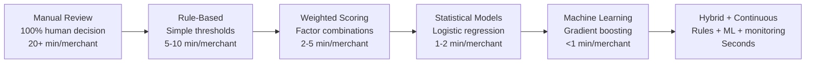
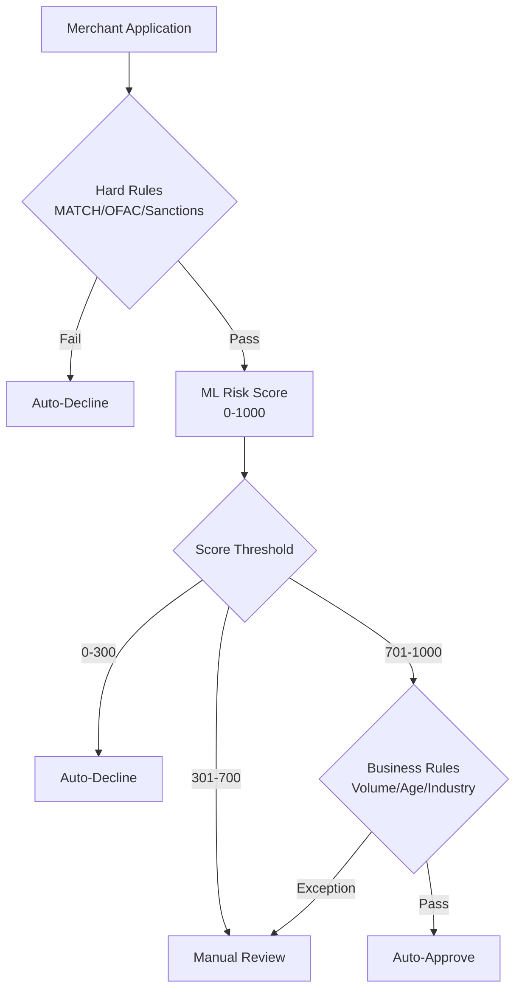
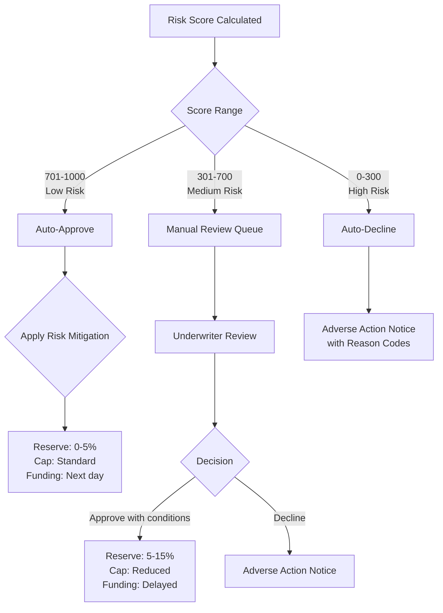
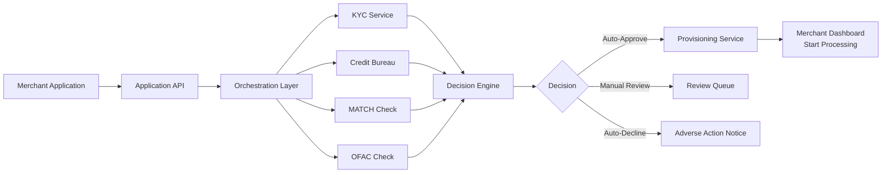

# Risk Scoring Models

> **Last Updated:** 2025-12-27
> **Status:** Complete

## Quick Reference

**Purpose:** Quantify merchant risk into actionable score to drive automated underwriting decisions

**Score Range:** Typically 0-100 or 0-1000 (higher = lower risk)

:::info Score Scale Standards
No industry standard exists. Choose one scale and stick with it:
- **0-100:** Simpler, easier to explain to non-technical stakeholders
- **0-1000:** More granular, easier to map from probability (0.001-1.0 → 1-1000)
- **0-1 (probability):** Used internally in ML models, typically converted to 0-1000 for display

**Consistency is key**—mixing scales across systems causes threshold confusion.
:::

**Decision Time:** &lt;2 minutes for automated systems, seconds for low-risk merchants

**Outcome:** Drives auto-approve, manual review, or auto-decline decisions

**Key Requirement:** Must be explainable for adverse actions (ECOA/Reg B)

**Current Trend:** Hybrid models combining rules + ML with continuous monitoring

## Overview

Risk scoring transforms raw merchant data into a quantifiable risk assessment that determines whether to approve, review, or decline a merchant application. Modern scoring systems have evolved from simple rule-based checklists to sophisticated machine learning models that can process hundreds of data points in seconds.

The goal is to balance **speed** (instant decisions for low-risk merchants) with **accuracy** (catching high-risk actors before they cause losses).

### Evolution of Risk Scoring



:::tip Industry Shift (2025)
PayFac platforms are moving from **periodic re-underwriting** to **continuous risk monitoring**, with scores updated in real-time based on transaction behavior, chargeback rates, and external signals.
:::

## Key Terms

| Term | Definition |
|------|------------|
| **Risk Score** | Numerical value (e.g., 0-100, 0-1000) representing merchant risk level |
| **Underwriting Model** | Algorithm or ruleset that calculates risk score from input data |
| **Decision Engine** | System that applies thresholds to scores to determine approve/review/decline |
| **Risk Tier** | Classification based on score range (e.g., Tier 1 = premium, Tier 5 = high-risk) |
| **Exception Handling** | Process for manual override of automated decisions |
| **Model Drift** | Degradation of model performance over time as data patterns change |
| **Explainability** | Ability to identify which factors contributed to a score or decision |
| **Adverse Action** | Decline or unfavorable terms requiring disclosure of reasons (ECOA) |

## Scoring Methodologies

### 1. Rule-Based Scoring

Simplest approach: binary pass/fail rules applied sequentially.

**Pros:** Fast, transparent, easy to explain
**Cons:** Rigid, misses nuanced patterns, high false positive/negative rates

**Example Rules:**
- Auto-decline if business on MATCH list
- Auto-decline if principal on OFAC list
- Auto-decline if annual volume &gt;$5M without financials
- Auto-review if business &lt;6 months old
- Auto-review if UBO owns &gt;3 other merchants

```typescript
// Example: Simple rule-based scorer in NestJS
interface RuleResult {
  passed: boolean;
  reason?: string;
  severity: 'block' | 'review' | 'flag';
}

class RuleBasedScorer {
  private rules: Array<(merchant: MerchantApplication) => RuleResult> = [
    this.checkMatchList,
    this.checkOfacList,
    this.checkBusinessAge,
    this.checkVolumeThreshold,
    this.checkOwnershipCount,
  ];

  async evaluateMerchant(merchant: MerchantApplication): Promise<{
    decision: 'approve' | 'review' | 'decline';
    triggeredRules: RuleResult[];
  }> {
    const results = this.rules.map(rule => rule(merchant));

    // Any blocking rule triggers auto-decline
    if (results.some(r => r.severity === 'block' && !r.passed)) {
      return {
        decision: 'decline',
        triggeredRules: results.filter(r => !r.passed),
      };
    }

    // Any review rule triggers manual review
    if (results.some(r => r.severity === 'review' && !r.passed)) {
      return {
        decision: 'review',
        triggeredRules: results.filter(r => !r.passed),
      };
    }

    return { decision: 'approve', triggeredRules: [] };
  }

  private checkMatchList(merchant: MerchantApplication): RuleResult {
    if (merchant.matchListStatus === 'found') {
      return { passed: false, reason: 'Business on MATCH list', severity: 'block' };
    }
    return { passed: true, severity: 'block' };
  }

  // Additional rules...
}
```

### 2. Weighted Factor Scoring

Assigns point values to different factors, sums to total score.

**Example Weighting:**

| Factor | Weight | Scoring Logic |
|--------|--------|---------------|
| Business Age | 15% | 0-6 mo: 0pts, 6-12 mo: 5pts, 12-24 mo: 10pts, &gt;24 mo: 15pts |
| Credit Score | 25% | &lt;500: 0pts, 500-600: 10pts, 600-700: 20pts, &gt;700: 25pts |
| Industry Risk | 20% | High-risk: 0pts, Medium: 10pts, Low: 20pts |
| Projected Volume | 15% | &gt;$500K: 0pts, $100K-$500K: 5pts, $50K-$100K: 10pts, &lt;$50K: 15pts |
| KYC Verification | 10% | Failed: 0pts, Partial: 5pts, Complete: 10pts |
| Website Quality | 5% | None: 0pts, Basic: 2pts, Professional: 5pts |
| Prior Processing | 10% | None: 0pts, 1-2 yrs: 5pts, &gt;2 yrs: 10pts |

**Total Score:** 0-100 scale

:::info Decision Thresholds (Example)
- **80-100:** Auto-approve, low reserve (0-5%)
- **60-79:** Manual review, standard reserve (5-10%)
- **40-59:** Enhanced review, high reserve (10-20%)
- **0-39:** Auto-decline
:::

### 3. Statistical Models

Use historical data to identify correlations between merchant attributes and outcomes (fraud, chargebacks, default).

#### Logistic Regression

Predicts probability of "bad outcome" (0-1 scale), converts to risk score.

**Formula:**
```
P(fraud) = 1 / (1 + e^-(β₀ + β₁x₁ + β₂x₂ + ... + βₙxₙ))
```

Where:
- β₀ = intercept
- β₁...βₙ = coefficients (learned from training data)
- x₁...xₙ = merchant features (age, volume, credit score, etc.)

**Pros:** Interpretable coefficients, well-understood, regulatory-accepted
**Cons:** Linear relationships only, requires feature engineering

#### Decision Trees

Tree structure of if-then rules, learned from data.

**Pros:** Non-linear patterns, handles categorical data, visual interpretation
**Cons:** Prone to overfitting, unstable (small data changes = different tree)

### 4. Machine Learning Models

#### Gradient Boosting (Industry Standard in 2025)

Ensemble of decision trees, each correcting errors of previous trees.

**Popular Implementations:**
- **XGBoost:** High performance, handles missing data
- **LightGBM:** Faster training, lower memory
- **CatBoost:** Handles categorical features natively

**Pros:** High accuracy, handles non-linear patterns, robust to outliers
**Cons:** Black-box, requires large training data, computationally intensive

```typescript
// Example: Integration with external ML model service
interface MLScoringRequest {
  businessAge: number;
  creditScore: number;
  industryMCC: string;
  projectedVolume: number;
  ownerCreditScore: number;
  websiteScore: number;
  // ... additional features
}

interface MLScoringResponse {
  riskScore: number; // 0-1000
  fraudProbability: number; // 0-1
  chargebackProbability: number; // 0-1
  featureImportance: { feature: string; importance: number }[];
  explanations: string[]; // SHAP values converted to text
}

class MLScoringService {
  async scoreMerchant(application: MerchantApplication): Promise<MLScoringResponse> {
    const request = this.buildFeatureVector(application);

    // Call external ML platform (Taktile, Alloy, custom model)
    const response = await this.mlClient.predict({
      modelId: 'merchant-risk-v3',
      features: request,
    });

    return response;
  }

  private buildFeatureVector(app: MerchantApplication): MLScoringRequest {
    return {
      businessAge: this.calculateBusinessAge(app.establishedDate),
      creditScore: app.businessCreditScore,
      industryMCC: app.mccCode,
      projectedVolume: app.projectedAnnualVolume,
      ownerCreditScore: app.principals[0]?.creditScore || 0,
      websiteScore: this.scoreWebsite(app.websiteUrl),
      // ... extract all model features
    };
  }
}
```

#### Random Forests

Ensemble of multiple decision trees, averaging their predictions.

**Pros:** Reduces overfitting vs single tree, handles high-dimensional data
**Cons:** Less interpretable than single tree, slower prediction

#### Ensemble Voting Methods

Combines multiple models for more robust predictions.

**Approaches:**

**Majority Voting (Classification):**
```
Model A: Approve | Model B: Approve | Model C: Decline
Result: Approve (2/3 vote)
```

**Weighted Averaging (Regression):**
```
Model A (weight 0.5): Score 750
Model B (weight 0.3): Score 680
Model C (weight 0.2): Score 800

Final Score = (750 × 0.5) + (680 × 0.3) + (800 × 0.2) = 739
```

**Stacking:**
- Train multiple base models (XGBoost, LightGBM, Random Forest)
- Train meta-model on base model outputs
- Meta-model learns optimal way to combine predictions

**When to Use Ensemble Voting:**
- High-stakes decisions (large merchants, high-risk industries)
- Model uncertainty is high (score near threshold)
- Compliance requirement for "second opinion"

**Trade-offs:**
- **Pros:** More robust, reduces overfitting, captures different patterns
- **Cons:** Slower inference, more complex explainability, higher maintenance

#### Neural Networks

Deep learning models with multiple hidden layers.

**Current Adoption in Merchant Underwriting:** Rare as of 2025

**Why Neural Networks Are Uncommon:**
- Most PayFacs have &lt;100K merchants (insufficient training data—neural networks need 500K+ samples)
- Explainability challenges outweigh marginal accuracy gains
- Gradient boosting achieves ~95% of neural network accuracy at a fraction of complexity
- Regulatory scrutiny remains high despite SHAP availability

**Where Neural Networks Excel:**
- Transaction-level fraud detection (billions of data points)
- Very high-volume consumer lending (millions of applicants)
- Complex pattern recognition where explainability is less critical

**When to Consider for Merchant Underwriting:**
- Portfolio &gt;500K merchants with 24+ months outcome data
- Complex feature interactions that gradient boosting can't capture
- Compliance team comfortable defending black-box models to regulators

**Pros:** Can learn extremely complex patterns, state-of-the-art accuracy in some domains
**Cons:** Requires massive training data (&gt;500K samples), true black-box, higher false positive rate in practice, hard to explain

:::warning Industry Reality (2025)
**Gradient boosting (XGBoost/LightGBM) dominates merchant scoring** due to better accuracy-to-explainability ratio. Most PayFacs should not pursue neural networks unless they have exceptional data scale and in-house ML expertise.
:::

### 5. Hybrid Approaches (Emerging Best Practice)

Combines rule-based + ML for optimal balance.

**Pattern:**
1. **Hard Rules First:** Screen for immediate red flags (MATCH, OFAC, sanctions)
2. **ML Scoring Second:** Score remaining applications with ML model
3. **Business Rules Last:** Apply thresholds and exceptions

**Benefits:**
- Speed: Rules catch obvious cases instantly
- Accuracy: ML handles nuanced patterns
- Compliance: Rules provide clear audit trail
- Flexibility: Easy to add new rules without retraining model



### 6. Cold Start Problem

**Challenge:** How to score merchant types the model has never seen (new industries, geographies, business models)?

**Solutions:**

**Fallback to Rules:**
- Use rule-based scoring for merchant types with &lt;100 training examples
- Gradually incorporate into ML model as labeled data accumulates

**Transfer Learning:**
- Train model on similar merchant types (e.g., score new "meal kit delivery" using "food delivery" data)
- Apply conservative confidence penalty (reduce score 10-15%)

**Conservative Defaults:**
- Assign median score (500-600) and route to manual review
- Track manual decisions to build training data for future model updates

**Feature Generalization:**
- Use industry-agnostic features (business age, credit score, volume) more heavily
- De-weight industry-specific patterns when entering new verticals

```typescript
class ColdStartHandler {
  async scoreNovelMerchant(app: MerchantApplication): Promise<RiskScore> {
    const trainingCount = await this.getTrainingExampleCount(app.mccCode);

    if (trainingCount &lt; 100) {
      // Insufficient training data - use fallback
      const ruleBasedScore = await this.ruleBasedScorer.score(app);
      return {
        score: ruleBasedScore,
        confidence: 'low',
        method: 'rule_based_fallback',
        reason: `Novel MCC ${app.mccCode} - insufficient training data`,
      };
    }

    // Sufficient data - use ML model
    return await this.mlScorer.score(app);
  }
}
```

:::tip Building Training Data
Every manual review decision is training data. Quarterly, retrain models incorporating underwriter decisions to improve coverage of edge cases and new merchant types.
:::

## Score Components and Data Inputs

Modern risk scoring models incorporate 100+ data points across multiple categories.

### 1. Application Data

**Business Information:**
- Legal name, DBA, entity type
- Business age (incorporation date)
- Industry (MCC code)
- Projected transaction volume/count
- Average ticket size
- Geographic location

**Principals:**
- Owner names, SSN, DOB
- Ownership percentage
- Home address
- Prior payment processing experience

**Financial:**
- Bank account details
- Credit card acceptance history
- Revenue projections

### 2. KYC/KYB Verification Data

- Identity verification status (pass/fail/manual)
- Document verification quality score
- Address verification (AVS results)
- Email/phone verification
- Business registration verification
- Tax ID verification (EIN, SSN)

### 3. External Data Sources

**Credit Bureaus:**
- Business credit score (Dun & Bradstreet PAYDEX, Experian Intelliscore)
- Personal credit score (FICO, VantageScore)
- Public records (liens, judgments, bankruptcies)
- Trade payment history
- Credit utilization

**Emerging (2025):** Cashflow-based scoring
- **Experian Credit+Cashflow:** Combines credit + bank transaction data (40% improvement in predictive power)
- **FICO UltraFICO:** Integrates Plaid data for thin-file applicants

**Negative Databases:**
- MATCH list (Mastercard terminated merchants)
- TMF (Visa Terminated Merchant File)
- OFAC sanctions list
- FBI Most Wanted
- State/federal criminal databases

**Digital Footprint:**
- Website age (WHOIS lookup)
- Domain SSL certificate
- Social media presence
- Online reviews (Google, Yelp, BBB)
- App store ratings (if applicable)

**Fraud Signals:**
- Email domain age
- Phone number type (mobile vs VOIP)
- IP address geolocation
- Device fingerprinting
- Velocity checks (multiple applications from same device/IP)

### 4. Behavioral Data (Re-Underwriting)

For existing merchants, scoring models incorporate transaction behavior:

- **Volume trends:** Growing, stable, or declining
- **Chargeback rate:** Industry-relative performance
- **Refund rate:** Abnormally high = customer dissatisfaction
- **Average ticket:** Drift from projected
- **Transaction patterns:** Time of day, geographic distribution
- **Reserve usage:** Has reserve been tapped for losses?

:::tip Continuous Monitoring (2025 Trend)
Leading PayFacs are replacing annual re-underwriting with **real-time risk scoring** that updates daily or per-transaction. Merchants flagged for elevated risk trigger automated actions (hold funds, reduce limits, initiate review).
:::

## Decision Thresholds

Risk scores are meaningless without thresholds that map to actions.

### Common Score Ranges

| Scale | Auto-Approve | Manual Review | Auto-Decline |
|-------|--------------|---------------|--------------|
| **0-100** | 80-100 | 60-79 | 0-39 |
| **0-1000** | 701-1000 | 301-700 | 0-300 |

### Decision Flow



### Risk-Based Pricing/Terms

| Risk Tier | Score Range | Reserve | Transaction Cap | Funding Schedule |
|-----------|-------------|---------|-----------------|------------------|
| **Tier 1 (Premium)** | 901-1000 | 0% | Unlimited | Next day |
| **Tier 2 (Standard)** | 701-900 | 5% | $50K/day | Next day |
| **Tier 3 (Monitored)** | 501-700 | 10% | $25K/day | T+2 days |
| **Tier 4 (High-Risk)** | 301-500 | 15-20% | $10K/day | T+7 days |
| **Tier 5 (Decline)** | 0-300 | N/A | N/A | N/A |

:::warning Industry Variance in Reserve Requirements
Reserve percentages vary significantly based on:
- **Industry:** High-risk MCCs (travel, adult, nutraceuticals, CBD) may require **20-50% reserves** or rolling reserves
- **Processor risk appetite:** Different PayFacs/acquirers have different tolerance levels
- **Merchant size:** Large merchants may negotiate lower reserves even at higher risk scores
- **Chargeback history:** Merchants with proven low chargeback rates may earn reserve reductions over time
- **Delivery model:** Delayed delivery (travel, events) increases reserve requirements vs immediate delivery

The table above reflects **typical e-commerce merchant reserves**. High-risk verticals often see 30-50% reserves or rolling reserves that release over 6-12 months.
:::

:::info Dynamic Thresholds
Some platforms adjust thresholds based on portfolio performance. If chargeback losses increase, the auto-approve threshold might raise from 701 to 750 temporarily.
:::

### Score Calibration

Raw ML model outputs (0.0-1.0 probabilities) need calibration to be meaningful risk scores.

**The Problem:**
Model predicts 0.15 fraud probability, but actual fraud rate at that score is 0.25—model is underconfident. Or model predicts 0.30 but actual is 0.15—model is overconfident.

**Calibration Techniques:**

| Technique | Description | Best For |
|-----------|-------------|----------|
| **Platt Scaling** | Fit logistic regression to model outputs | Binary outcomes, smooth calibration |
| **Isotonic Regression** | Non-parametric, monotonic calibration | Non-linear miscalibration |
| **Beta Calibration** | Extension of Platt for better tail behavior | Extreme probabilities matter |

**Monitoring Calibration:**
- Plot predicted vs actual fraud rates at each score decile
- Ideal: 45-degree line (predicted = actual)
- Recalibrate when significant deviation detected

**When Calibration Matters Most:**
- Probability-based pricing (e.g., "3% fraud risk = 50bps pricing premium")
- Combining scores from multiple models (must be on same scale)
- Regulatory reporting on expected vs actual loss rates

```typescript
class ScoreCalibrator {
  // Platt scaling: fit logistic regression on validation set
  async calibrate(rawScore: number): Promise<number> {
    // rawScore from ML model (0-1)
    // Apply learned calibration parameters
    const calibrated = 1 / (1 + Math.exp(-(this.a * rawScore + this.b)));
    return calibrated;
  }

  async validateCalibration(): Promise<CalibrationReport> {
    // Compare predicted vs actual rates per decile
    const deciles = await this.computeDecilePerformance();
    const deviations = deciles.map(d => Math.abs(d.predicted - d.actual));
    const avgDeviation = deviations.reduce((a, b) => a + b) / deviations.length;

    return {
      deciles,
      avgDeviation,
      needsRecalibration: avgDeviation &gt; 0.05, // &gt;5% average deviation
    };
  }
}
```

## Model Performance Metrics

### Statistical Metrics

**Kolmogorov-Smirnov (KS) Statistic**
- Measures separation between "good" and "bad" merchants
- Range: 0-100
- **Benchmarks for Merchant Underwriting (2025):**
  - 20-30: Acceptable (typical for small merchant portfolios)
  - 30-40: Good
  - 40-50: Very good (top-performing models)
  - &gt;50: Excellent (rare in merchant scoring; more common in consumer credit)

:::info Merchant vs Consumer Scoring
Merchant underwriting models typically achieve **lower KS scores** than consumer credit models due to:
- Smaller sample sizes (fewer merchants than consumer borrowers)
- Higher variance in merchant behavior across industries
- More heterogeneous population (business types vary widely)

A KS of 28 in merchant scoring is solid performance—don't benchmark against consumer credit models expecting 40+.
:::

**Gini Coefficient**
- Measures inequality in model predictions
- Range: 0-1
- **Benchmarks:**
  - 0.60-0.70: Acceptable
  - 0.70-0.80: Good
  - 0.80+: Strong

**AUC (Area Under ROC Curve)**
- Probability that model ranks random bad merchant lower than random good merchant
- Range: 0.5-1.0 (0.5 = random guessing)
- **Benchmarks:**
  - 0.70-0.80: Acceptable
  - 0.80-0.90: Good
  - 0.90+: Excellent

**Precision and Recall**
- **Precision:** Of merchants flagged as risky, what % were actually risky?
- **Recall:** Of all risky merchants, what % did we catch?
- **Trade-off:** High precision (few false alarms) vs high recall (catch all fraud)

### Operational Metrics

| Metric | Target (2025 Benchmarks) |
|--------|---------------------------|
| **Auto-Approval Rate** | 60-80% for low-risk verticals |
| **Manual Review Rate** | 15-30% |
| **Auto-Decline Rate** | 5-10% |
| **Time to Decision** | &lt;2 minutes (automated), &lt;24 hours (manual review) |
| **Override Rate** | &lt;5% (underwriters reversing model decisions) |

:::warning High Override Rate = Model Problem
If underwriters frequently disagree with model decisions, the model needs recalibration or feature engineering.
:::

### Business Metrics

| Metric | Definition | Target |
|--------|------------|--------|
| **Fraud Loss Rate** | Fraud losses / total volume | &lt;0.10% |
| **Chargeback Rate** | Chargebacks / total transactions | &lt;0.50% |
| **False Positive Rate** | Good merchants declined / total good merchants | &lt;2% |
| **False Negative Rate** | Bad merchants approved / total bad merchants | &lt;5% |

## Model Validation and Governance

### Backtesting

Test model on historical data to validate performance.

**Process:**
1. Split data: 70% training, 30% testing (or use time-based split)
2. Train model on training set
3. Score testing set (model has never seen this data)
4. Calculate KS, Gini, AUC on test set
5. Compare to production performance

**Red Flag:** Test performance significantly better than production = model overfitting

#### Training Data Window Selection

Choosing the right training data window critically impacts model performance:

| Window | Pros | Cons | Use When |
|--------|------|------|----------|
| **6 months** | Captures recent patterns | Insufficient data, overfits to trends | Never for initial models |
| **12 months** | Good recency | May miss seasonal patterns | Rapid market changes |
| **18-24 months** | Balances recency with sample size | May include outdated patterns | **Optimal for most merchant scoring** |
| **36+ months** | Large sample size | Includes obsolete patterns (pre-COVID, old fraud techniques) | Stable, low-risk verticals only |

**Handling Economic Shocks:**
- Consider excluding or down-weighting anomalous periods (March-June 2020)
- Or add explicit "shock period" features to help model learn context
- Test model performance on pre-shock, during-shock, and post-shock periods separately

**Seasonal Considerations:**
- Include at least one full annual cycle (12 months minimum)
- Retail merchants have holiday patterns; travel has summer peaks
- Short windows may miss seasonal fraud patterns

### Champion/Challenger Testing

Industry-standard approach to model deployment, also known as A/B testing.

**Terminology:**
- **Champion:** Current production model (receives 90-95% of traffic)
- **Challenger:** New model being tested (receives 5-10% of traffic)

**Pattern:**
1. Route 10% of applications to Challenger, 90% to Champion
2. Track performance metrics for both cohorts
3. If Challenger outperforms, gradually increase traffic
4. After 60-90 days, promote Challenger to Champion if validated

**Promotion Criteria:**
- Challenger must beat Champion by **statistically significant margin** (e.g., 5% improvement in KS)
- No degradation in key business metrics (approval rate, fraud rate)
- Explainability and compliance requirements met

**Rollback Plan:**
- Instant switch back to Champion if Challenger degrades performance
- Feature flag enables instant cutover without deployment

**Multiple Challengers:**
Some teams test 2-3 challengers simultaneously (5% each):
- Challenger A: New features
- Challenger B: Different algorithm
- Challenger C: Alternative threshold strategy

```typescript
// Example: A/B testing framework
class ModelRouter {
  async scoreApplication(app: MerchantApplication): Promise<RiskScore> {
    const variant = this.assignVariant(app.id);

    if (variant === 'control') {
      return await this.modelA.score(app); // Current production model
    } else {
      return await this.modelB.score(app); // New challenger model
    }
  }

  private assignVariant(applicationId: string): 'control' | 'challenger' {
    // Consistent hashing ensures same merchant always gets same variant
    const hash = this.hashFunction(applicationId);
    return hash % 100 < 10 ? 'challenger' : 'control'; // 10% to challenger
  }
}
```

### Drift Detection

Models degrade over time as market conditions change.

**Types of Drift:**
- **Concept Drift:** Relationship between features and outcomes changes (e.g., COVID-19 suddenly makes "retail" high-risk)
- **Data Drift:** Distribution of input features changes (e.g., more e-commerce applications)

**Monitoring:**
- Track KS/Gini/AUC monthly
- Alert if metrics decline &gt;10%
- Compare feature distributions (training vs production)

**Response:**
- Retrain model on recent data (last 12-24 months)
- Add new features (e.g., COVID impact score)
- Adjust thresholds

### Regular Recalibration

**Frequency:**
- **High-risk portfolios:** Quarterly
- **Standard portfolios:** Semi-annually
- **Stable portfolios:** Annually
- **Event-driven:** After major market shifts (pandemic, regulation change)

:::warning OCC Guidance (March 2025)
The OCC removed the annual model validation requirement. Validation frequency should be **risk-based**:
- High-risk models (large portfolios, complex ML): More frequent
- Low-risk models (small portfolios, simple rules): Less frequent
- Document the risk assessment justifying validation schedule
:::

### Documentation Requirements

**Model Inventory:**
- Model name, version, deployment date
- Model type (logistic regression, XGBoost, etc.)
- Features used
- Training data period
- Performance metrics at deployment

**Model Development Documentation:**
- Business problem statement
- Data sources
- Feature engineering logic
- Model selection rationale
- Validation results

**Ongoing Monitoring:**
- Performance dashboard (updated monthly)
- Override log (underwriter decisions vs model)
- Drift detection reports
- Incident log (model failures, data quality issues)

## Explainability Requirements

### Regulatory Framework

:::danger ECOA/Reg B Applies to Merchant Underwriting
Contrary to common belief, **FCRA (Fair Credit Reporting Act) does NOT apply** to merchant underwriting—it only applies to consumer transactions.

However, **ECOA (Equal Credit Opportunity Act) and Regulation B DO apply** to business credit decisions, including merchant underwriting.
:::

**Key Requirements:**

**ECOA/Regulation B:**
- Applies to business credit decisions (including payment processing agreements)
- Requires adverse action notices with **specific reasons** for denial
- Must provide reason codes or plain-language explanations
- Cannot discriminate on prohibited bases (race, religion, national origin, age, etc.)
- Applies even to automated underwriting systems

**Card Network Rules:**
- Visa/Mastercard require explainable decisions for merchant declines
- Must be able to justify adverse actions in dispute investigations
- Compliance programs must document decision logic

**FDIC Guidance (August 2025):**
- Eliminated **disparate impact analysis** requirement from ECOA fair lending exams
- Focus on **intentional discrimination** and **overt differential treatment**
- Reduced burden for banks using ML models

### Adverse Action Notices

When declining or offering unfavorable terms, must provide:

**Required Elements:**
1. Statement that action was taken
2. Name/address of creditor
3. ECOA notice (rights under federal law)
4. **Specific reasons** for adverse action (or statement that applicant can request reasons)

**Example Reason Codes:**
- Insufficient business credit history
- Business age less than required minimum (6 months)
- Projected volume exceeds risk tolerance for industry
- Unable to verify business registration
- High-risk industry (MCC 5967 - Direct Marketing)
- Excessive chargebacks at prior processor

:::tip Best Practice
Provide **top 3-5 factors** that contributed to decision, even if not explicitly required. Reduces disputes and improves applicant experience.
:::

### Explainability Methods for ML Models

**SHAP (SHapley Additive exPlanations) - Industry Standard**

Assigns each feature an "importance value" for a specific prediction.

**Example SHAP Output:**
```
Risk Score: 450 (Manual Review)

Top Contributing Factors:
+ Business Age (3 months): -120 points
+ Industry (MCC 5967): -80 points
+ Owner Credit Score (590): -50 points
+ No prior processing history: -30 points
+ Website quality (basic): -10 points
```

**Implementation:**
```typescript
interface SHAPExplanation {
  feature: string;
  value: any;
  contribution: number; // Positive = increases score, negative = decreases
  description: string;
}

class ExplainableScorer {
  async scoreWithExplanation(app: MerchantApplication): Promise<{
    score: number;
    decision: string;
    explanations: SHAPExplanation[];
  }> {
    const score = await this.mlModel.predict(app);
    const shapValues = await this.mlModel.explainPrediction(app);

    // Convert SHAP values to human-readable explanations
    const explanations = this.formatExplanations(shapValues);

    return {
      score,
      decision: this.getDecision(score),
      explanations: explanations.slice(0, 5), // Top 5 factors
    };
  }

  private formatExplanations(shapValues: any[]): SHAPExplanation[] {
    return shapValues
      .sort((a, b) => Math.abs(b.value) - Math.abs(a.value)) // Most impactful first
      .map(sv => ({
        feature: sv.featureName,
        value: sv.featureValue,
        contribution: sv.shapValue,
        description: this.generateDescription(sv),
      }));
  }

  private generateDescription(shapValue: any): string {
    if (shapValue.featureName === 'businessAge' && shapValue.shapValue < 0) {
      return `Business age (${shapValue.featureValue} months) is below average for approved merchants`;
    }
    // ... additional templates
  }
}
```

**LIME (Local Interpretable Model-Agnostic Explanations)**

Creates simplified model around specific prediction.

**Feature Importance (Random Forests, Gradient Boosting)**

Global importance: Which features are most important across all predictions?

**Counterfactual Explanations**

"If your business age was 12 months instead of 3 months, your score would increase to 680 (auto-approve threshold)."

## Exception Handling

Even the best models make mistakes. Manual override capabilities are essential.

### Override Policies

**When to Override:**
- Model score near threshold boundary (e.g., 695 when auto-approve is 701)
- Extenuating circumstances not captured in model (e.g., merchant is Amazon subsidiary)
- New merchant type model hasn't seen before
- Business relationship justifies higher risk (strategic partner, high volume potential)

**Authority Levels:**

| Role | Override Authority |
|------|-------------------|
| **Junior Underwriter** | +/- 50 points within manual review range |
| **Senior Underwriter** | Approve scores 500-700, decline scores 701-800 |
| **Underwriting Manager** | Approve any score with enhanced terms |
| **Chief Risk Officer** | Unlimited with board notification |

### Documentation Requirements

Every override must include:

1. **Reason for Override:** Specific justification
2. **Risk Mitigation:** What controls offset the elevated risk?
   - Higher reserve (e.g., 20% instead of 10%)
   - Lower transaction cap (e.g., $5K/day instead of $25K/day)
   - Delayed funding (T+7 instead of T+2)
   - Enhanced monitoring (daily instead of weekly)
3. **Approver:** Name and title of person authorizing override
4. **Timestamp:** When override occurred
5. **Supporting Evidence:** Documents/data supporting decision

```typescript
interface UnderwritingOverride {
  applicationId: string;
  originalScore: number;
  originalDecision: 'approve' | 'review' | 'decline';
  overrideDecision: 'approve' | 'decline';
  overrideReason: string;
  riskMitigation: {
    reserve?: number;
    transactionCap?: number;
    fundingDelay?: number;
    monitoringLevel?: 'standard' | 'enhanced' | 'high';
  };
  approver: {
    userId: string;
    name: string;
    role: string;
  };
  timestamp: Date;
  supportingDocuments?: string[];
}

class OverrideService {
  async applyOverride(
    applicationId: string,
    override: UnderwritingOverride,
  ): Promise<void> {
    // Validate approver has authority for this override
    await this.validateAuthority(override);

    // Log override for audit trail
    await this.auditLog.create({
      type: 'UNDERWRITING_OVERRIDE',
      applicationId,
      data: override,
    });

    // Update application decision
    await this.applicationRepository.update(applicationId, {
      decision: override.overrideDecision,
      riskMitigation: override.riskMitigation,
      overrideApplied: true,
    });

    // Notify sponsor bank if required
    if (override.originalScore < 400 && override.overrideDecision === 'approve') {
      await this.sponsorBankNotificationService.notifyHighRiskOverride(override);
    }
  }
}
```

### Audit Trail

All decisions (automated and manual) must be logged:

- Application ID
- Timestamp
- Model version used
- Input features and values
- Risk score
- Decision (approve/review/decline)
- Thresholds applied
- Override applied (if any)
- Final outcome

Retention: Typically 7 years per bank record retention requirements.

## Technology Landscape

### Major Platforms (2025)

**Decision Engine + ML Platforms:**

| Platform | Focus | Key Features |
|----------|-------|--------------|
| **Taktile** | No-code ML decisioning | Visual workflow builder, SHAP explanations, A/B testing |
| **Alloy** | Identity + risk | KYC/KYB + risk scoring, 100+ data sources |
| **Unit21** | Fraud + AML | Transaction monitoring, case management |
| **LendFoundry** | Credit decisioning | Origination + servicing, built for banks |
| **Dragin** | Custom ML models | Bring-your-own-model, feature store |

**Credit Bureaus & Data:**

| Provider | Product | Innovation (2025) |
|----------|---------|-------------------|
| **Experian** | Credit + Cashflow | Combines credit bureau + bank transaction data (40% improvement) |
| **Dun & Bradstreet** | Business credit | PAYDEX score, firmographics |
| **FICO** | UltraFICO | Integrates Plaid data for thin-file applicants |
| **Equifax** | Business credit | Bankruptcy prediction models |

**Fraud Data:**

| Provider | Coverage |
|----------|----------|
| **Verifi (Visa)** | MATCH list, chargeback alerts |
| **Ethoca (Mastercard)** | Chargeback prevention, alerts |
| **Sift** | ML fraud detection, device fingerprinting |
| **Sardine** | Behavioral biometrics, crypto fraud |

### Build vs Buy Decision

**Build Custom Model When:**
- Unique merchant base not represented in off-the-shelf models
- Proprietary data sources (e.g., platform transaction history)
- Very high volume (&gt;100K applications/year) justifies investment
- In-house data science team available

**Buy Platform When:**
- Standard merchant profiles (e-commerce, retail, etc.)
- Need to launch quickly (&lt;6 months)
- No data science expertise in-house
- Volume &lt;100K applications/year
- Want vendor support and compliance updates

## PayFac Implementation

### Decision Engine Integration



**Key Integration Points:**

1. **Pre-screening:** MATCH/OFAC checks before calling decision engine (no point scoring a sanctioned entity)
2. **Parallel Data Gathering:** Fetch KYC, credit, fraud data concurrently to minimize latency
3. **Score Caching:** Cache scores for 24-48 hours if applicant resubmits
4. **Async Review Queue:** Manual review applications go to task queue, don't block API response
5. **Webhook Notifications:** Notify applicant of decision via webhook/email

### Sponsor Bank Visibility

PayFacs must provide sponsor banks with visibility into underwriting decisions.

**Reporting Requirements:**
- **Real-time:** High-risk approvals (scores below certain threshold)
- **Daily:** All approvals/declines summary
- **Weekly:** Portfolio risk distribution, override log
- **Monthly:** Model performance metrics, drift analysis

**API Access:**
Some sponsor banks require direct API access to underwriting system to pull merchant data on-demand.

### Continuous Monitoring

Modern PayFacs score merchants continuously, not just at onboarding.

**Re-scoring Triggers:**
- **Time-based:** Daily, weekly, or monthly
- **Event-based:**
  - Chargeback received
  - High refund rate detected
  - Volume spike (&gt;3x normal)
  - Negative news (Google alerts, social media)
  - Credit score change (bureau monitoring)
  - UBO change

**Automated Actions:**

| Score Change | Action |
|--------------|--------|
| **Drop 100+ points** | Trigger manual review |
| **Drop below 500** | Reduce transaction cap 50% |
| **Drop below 400** | Hold next payout, initiate urgent review |
| **Drop below 300** | Suspend processing, force reserve increase |

```typescript
class ContinuousMonitoringService {
  @Cron('0 2 * * *') // Run daily at 2am
  async rescoreActiveMerchants(): Promise<void> {
    const merchants = await this.merchantRepository.findActive();

    for (const merchant of merchants) {
      const currentScore = merchant.riskScore;
      const newScore = await this.scoringService.score(merchant);

      const scoreDelta = newScore - currentScore;

      // Log score change
      await this.scoreHistoryRepository.create({
        merchantId: merchant.id,
        previousScore: currentScore,
        newScore,
        delta: scoreDelta,
        triggeredBy: 'scheduled_rescoring',
      });

      // Take action if significant drop
      if (scoreDelta <= -100) {
        await this.triggerManualReview(merchant, newScore, scoreDelta);
      }

      if (newScore < 500) {
        await this.reduceTransactionCap(merchant, 0.5); // 50% reduction
      }

      if (newScore < 400) {
        await this.holdNextPayout(merchant);
        await this.alertRiskTeam(merchant, newScore);
      }
    }
  }
}
```

### Risk Mitigation Based on Score

| Score Range | Reserve | Transaction Cap | Funding Delay | Monitoring |
|-------------|---------|-----------------|---------------|------------|
| **901-1000** | 0% | No cap | Next day | Monthly |
| **801-900** | 5% | $100K/day | Next day | Weekly |
| **701-800** | 10% | $50K/day | T+2 | Weekly |
| **601-700** | 15% | $25K/day | T+3 | Daily |
| **501-600** | 20% | $10K/day | T+7 | Daily + alerts |
| **&lt;500** | Case-by-case | Suspend or severe limits | Hold | Real-time |

## Self-Assessment Questions

1. **Your PayFac approves a merchant with a risk score of 680. The ML model's top contributing factors were: business age (2 months), high-risk MCC (5967), and owner credit score (610). The underwriter overrides to approve because the merchant is a subsidiary of a Fortune 500 company. What documentation is required for this override?**

   <details>
   <summary>Answer</summary>

   Required documentation:
   - **Reason for override:** Merchant is subsidiary of [Fortune 500 company name], verified via corporate structure documentation
   - **Risk mitigation:** Enhanced reserve (15% instead of 10%), lower transaction cap ($10K/day instead of $25K/day), enhanced monitoring (daily review instead of weekly)
   - **Approver:** Name and title of underwriting manager or CRO (must have authority for this level of override)
   - **Supporting evidence:** Corporate documentation proving subsidiary relationship, parent company financials, guarantee or cross-collateralization agreement if applicable
   - **Sponsor bank notification:** Since score &lt;700, notify sponsor bank of high-risk approval with override justification
   </details>

2. **Your gradient boosting model has a KS statistic of 45, Gini coefficient of 0.75, and AUC of 0.85. Over the past 3 months, the auto-approval rate has dropped from 70% to 55% without a change in applicant quality. What could be causing this, and how would you diagnose it?**

   <details>
   <summary>Answer</summary>

   **Likely causes:**
   - **Model drift:** Relationship between features and outcomes has changed (concept drift), or feature distributions have changed (data drift)
   - **Threshold creep:** Someone manually raised the auto-approve threshold without documenting
   - **Data quality issue:** One or more data sources returning degraded/missing data, causing scores to drop

   **Diagnosis steps:**
   1. **Check thresholds:** Verify auto-approve threshold hasn't changed (should be 701)
   2. **Compare feature distributions:** Plot histograms of key features (business age, credit score, etc.) for recent applications vs training data—look for significant shifts
   3. **Analyze declined applications:** What scores are they getting? Are they clustering near the threshold (e.g., 680-700) or much lower?
   4. **Check data sources:** Verify all external data sources (credit bureaus, KYC providers) are responding normally and returning expected data
   5. **Segment analysis:** Break down auto-approval rate by industry, geography, application source—is the drop uniform or concentrated?
   6. **Model recalibration:** If drift confirmed, retrain model on recent 12-month data window
   </details>

3. **You're implementing a new ML model that will replace your current rule-based system. The ML model has 15% higher accuracy in backtesting. How would you safely roll out this new model?**

   <details>
   <summary>Answer</summary>

   **Safe rollout strategy:**
   1. **Shadow mode first:** Run new ML model in parallel with rule-based system for 30 days, don't use ML scores for decisions yet. Compare decisions—where do they differ?
   2. **A/B test:** Route 10% of applications to ML model, 90% to rule-based system. Track metrics for both cohorts (approval rate, fraud rate, chargeback rate, override rate).
   3. **Monitor closely:** Daily review of ML decisions for first 2 weeks, weekly thereafter. Look for unexpected patterns.
   4. **Gradual ramp:** If ML performs well after 30 days, increase to 25%, then 50%, then 75%, then 100% over 3-4 month period.
   5. **Rollback plan:** Keep rule-based system active and able to take over with feature flag toggle if ML model has issues.
   6. **Document baseline:** Record current portfolio metrics (fraud rate, chargeback rate, approval rate) before rollout to measure ML impact.
   7. **Stakeholder communication:** Inform sponsor bank, underwriting team, and executive team of rollout plan and progress.
   </details>

4. **A declined applicant requests the specific reasons for denial per ECOA. Your neural network model is a black box. How do you respond?**

   <details>
   <summary>Answer</summary>

   **Response approach:**
   1. **Use SHAP values:** Even for neural networks, SHAP can provide feature-level explanations. Generate SHAP values for this specific prediction.
   2. **Provide top contributing factors:** "Your application was declined based on the following factors: (1) Business age (2 months) below minimum threshold, (2) High-risk industry classification (MCC 5967 - Direct Marketing), (3) Insufficient business credit history, (4) Projected transaction volume exceeds risk tolerance for startup businesses."
   3. **Explain in plain language:** Avoid technical jargon like "SHAP values" or "neural network layers"—translate to business reasons.
   4. **Include ECOA notice:** Provide required ECOA disclosure of applicant's rights.
   5. **Offer reconsideration:** "If circumstances have changed or you can provide additional documentation (e.g., proof of established business history, financials), you may reapply or request reconsideration."
   6. **Document response:** Log adverse action notice in compliance system.

   **Proactive measure:** Build explainability into model deployment from day one—don't wait for first adverse action request. All high-stakes ML models should have SHAP or LIME integration.
   </details>

5. **Your PayFac has 10,000 active merchants. You want to implement continuous risk scoring to replace annual re-underwriting. What's your implementation strategy?**

   <details>
   <summary>Answer</summary>

   **Implementation strategy:**

   **Phase 1: Data pipeline (Month 1)**
   - Build real-time data aggregation: transaction metrics (volume, chargeback rate, refund rate), external signals (credit score changes, negative news)
   - Create feature store: Centralized repository of merchant features updated daily

   **Phase 2: Scoring infrastructure (Month 2)**
   - Adapt onboarding model for re-scoring (some features differ: behavioral data vs application data)
   - Build batch scoring job: Score all 10K merchants nightly
   - Create score history table: Track score changes over time

   **Phase 3: Alerting and workflows (Month 3)**
   - Define alert thresholds: Score drop &gt;100 points, score &lt;500, score &lt;400
   - Build manual review queue for triggered alerts
   - Integrate with risk team's case management system

   **Phase 4: Automated actions (Month 4)**
   - Implement automated controls: Reduce caps, delay funding, hold payouts based on score ranges
   - Add override capability for risk team
   - Build merchant communication: Email notifications when score changes significantly

   **Phase 5: Reporting (Month 5)**
   - Dashboard for risk team: Portfolio risk distribution, score trends
   - Sponsor bank reporting: Daily high-risk alerts, weekly portfolio summary
   - Executive metrics: Portfolio health, early warning indicators

   **Phase 6: Optimization (Month 6+)**
   - Tune alert thresholds based on false positive rate
   - Add event-based triggers (chargeback, volume spike) in addition to scheduled daily scoring
   - Retire annual re-underwriting process once continuous monitoring proven effective
   </details>

6. **You're evaluating whether to build a custom risk scoring model or buy a vendor platform. Your PayFac processes $500M annually across 5,000 merchants in standard e-commerce verticals. What factors should drive your decision?**

   <details>
   <summary>Answer</summary>

   **Buy Platform Recommendation** for this scenario:

   **Reasons to buy:**
   - **Standard verticals:** E-commerce is well-represented in vendor training data—no unique merchant profiles requiring custom model
   - **Moderate volume:** 5,000 merchants and $500M volume don't justify the ongoing cost of in-house data science team (typically need $1B+ volume or 100K+ applications/year)
   - **Time to market:** Vendor platform can be deployed in 3-6 months vs 12-18 months to build custom
   - **Compliance:** Vendors handle model documentation, validation, adverse action reason generation out of box
   - **Ongoing maintenance:** Vendors handle model drift monitoring, recalibration, regulatory updates

   **Build custom if:**
   - **Unique merchants:** You specialize in a niche vertical (e.g., cannabis, crypto) not well-represented in vendor data
   - **Proprietary signals:** You have unique data sources (e.g., platform transaction history from related marketplace) that provide competitive advantage
   - **Data science team:** You already have ML engineers on staff
   - **Very high volume:** &gt;$5B volume or &gt;100K applications/year justifies build cost
   - **Differentiation:** Custom model is core competitive advantage vs other PayFacs

   **Hybrid option:** Buy vendor platform for baseline scoring, augment with custom rules/features for your specific risk areas. Many platforms (Taktile, Alloy) support bring-your-own-features.
   </details>

7. **Your model generates a risk score of 698 (just below the 701 auto-approve threshold). The underwriter sees this is an established business (5 years old) with excellent credit (780) but triggered the review because of a recent address change. Should this be overridden to approve, and what are the considerations?**

   <details>
   <summary>Answer</summary>

   **Likely should override to approve** with considerations:

   **Factors supporting override:**
   - **Near threshold:** 698 vs 701 is within margin of error—score is borderline
   - **Strong fundamentals:** 5-year business history and 780 credit score are strong positive indicators
   - **Explainable negative:** Address change is low-risk reason for score reduction (not fraud, chargebacks, or financial distress)
   - **Easily verifiable:** Can confirm address change is legitimate (business relocation, not identity theft)

   **Due diligence before override:**
   1. **Verify address change:** Check public records (USPS, business registration) to confirm legitimate relocation
   2. **Check reason for move:** Expansion (positive) vs eviction/downsizing (negative)
   3. **Verify identity:** Re-run KYC at new address to ensure no identity theft
   4. **Review transaction history:** If existing merchant, check for any recent behavioral changes

   **Risk mitigation for override:**
   - **Standard terms:** No need for enhanced reserve or reduced caps given strong profile
   - **Enhanced monitoring:** Flag for weekly review for first 60 days post-address change
   - **Document override:** "Business fundamentals strong (5-yr history, 780 credit). Recent address change verified as legitimate business relocation. Override approved by [Underwriter Name]."

   **Authority level:** Senior underwriter can approve this override (small score gap, low risk mitigation needed).
   </details>

## Related Topics

- [Underwriting Process Overview](./index.md) - How risk scoring fits into broader underwriting
- [Risk Factors](./risk-factors.md) - Detailed breakdown of variables used in scoring models
- [MCC Codes](./mcc-codes.md) - Industry classification impact on risk scores
- [KYC/KYB Verification](../kyc-kyb/index.md) - Identity data feeding into risk models

{/* Future modules - not yet created:
- Transaction Monitoring - Using behavioral data for re-scoring
- Chargeback Management - How chargebacks impact risk scores
*/}

## References

### Regulatory Guidance

- [ECOA (Equal Credit Opportunity Act)](https://www.consumerfinance.gov/rules-policy/regulations/1002/) - Applies to merchant underwriting
- [Regulation B](https://www.consumerfinance.gov/rules-policy/regulations/1002/) - Implementing regulation for ECOA
- [OCC Model Risk Management Guidance (March 2025)](https://www.occ.gov/news-issuances/bulletins/2025/bulletin-2025-5.html) - Removed annual validation requirement
- [FDIC Fair Lending Guidance (August 2025)](https://www.fdic.gov/news/financial-institution-letters/2025/fil25018.html) - Eliminated disparate impact from ECOA exams

### Industry Standards

- [PCI DSS](https://www.pcisecuritystandards.org/) - Payment Card Industry Data Security Standard
- [Visa Global Acquirer Risk Standards](https://usa.visa.com/support/small-business/security-compliance.html)
- [Mastercard Security Rules and Procedures](https://www.mastercard.us/en-us/business/overview/safety-and-security/security-recommendations.html)

### Credit Data & Scoring

- [Experian Credit + Cashflow](https://www.experian.com/business/products/cashflow-analytics) - Combines credit bureau + bank data
- [FICO UltraFICO](https://www.fico.com/en/products/fico-ultrafico-score) - Integrates Plaid transaction data
- [Dun & Bradstreet PAYDEX](https://www.dnb.com/products/finance-credit-risk/paydex.html) - Business credit score

### ML Model Explainability

- [SHAP (SHapley Additive exPlanations)](https://github.com/slundberg/shap) - Industry-standard explainability framework
- [LIME (Local Interpretable Model-Agnostic Explanations)](https://github.com/marcotcr/lime)

### Platforms & Vendors

- [Taktile](https://www.taktile.com/) - No-code decision engine with ML
- [Alloy](https://www.alloy.com/) - Identity verification + risk scoring
- [Unit21](https://www.unit21.com/) - Fraud detection and AML
- [Sift](https://sift.com/) - Digital trust & safety platform

---

*This guide reflects industry practices as of December 2025. Risk scoring methodologies and regulatory requirements evolve rapidly—verify current guidance before implementation.*
