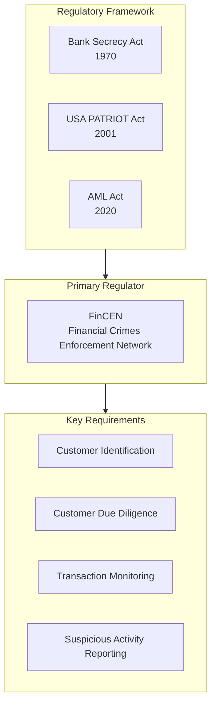
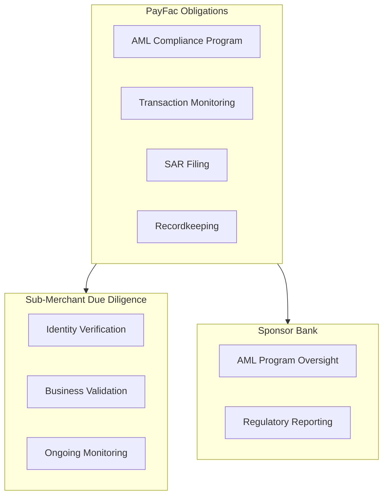

# AML & BSA Compliance

> **Last Updated:** 2025-02-17
> **Status:** Complete

Anti-Money Laundering (AML) and Bank Secrecy Act (BSA) compliance is mandatory for payment facilitators. These regulations require robust transaction monitoring, suspicious activity reporting, and comprehensive compliance programs.

## Quick Reference

| Requirement | Threshold | Deadline |
|-------------|-----------|----------|
| SAR (known suspect) | $5,000 | 30 days |
| SAR (no suspect) | $25,000 | 30-60 days |
| CTR | > $10,000 | Same day |
| SAR for insider abuse | Any amount | 30 days |

## What is AML/BSA?

### BSA (Bank Secrecy Act)

The BSA requires financial institutions to:
- Maintain records of cash transactions
- Report suspicious activities
- Implement AML compliance programs
- Conduct customer due diligence

### AML (Anti-Money Laundering)

AML refers to the broader set of laws, regulations, and procedures designed to prevent criminals from disguising illegally obtained funds as legitimate income.

## Section Contents

### [Money Laundering](./money-laundering.md)
- Three stages of money laundering
- Common patterns and red flags
- PayFac-specific risks

### [SAR Reporting](./sar-reporting.md)
- SAR filing requirements and thresholds
- CTR requirements
- Filing procedures and deadlines

### [Transaction Monitoring](./transaction-monitoring.md)
- Monitoring systems and rules
- Alert investigation workflow
- Documentation requirements

### [Quiz](./quiz.md)
- Self-assessment questions

## PayFac AML Obligations

Payment facilitators have specific AML responsibilities:

### Five Pillars of AML Compliance

| Pillar | Requirement |
|--------|-------------|
| 1 | Written AML policies and procedures |
| 2 | Designated compliance officer |
| 3 | Ongoing employee training |
| 4 | Independent testing/audit |
| 5 | Risk-based customer due diligence |

## Key Reporting Thresholds

### Suspicious Activity Reports (SARs)

| Situation | Threshold | Filing Deadline |
|-----------|-----------|-----------------|
| Known suspect identified | **$5,000** | 30 days |
| No suspect identified | **$25,000** | 30-60 days |
| Insider abuse | **Any amount** | 30 days |
| Money laundering suspected | **$5,000** | 30 days |
| MSB point of sale | **$2,000** | 30 days |

### Currency Transaction Reports (CTRs)

| Transaction Type | Threshold | Filing |
|------------------|-----------|--------|
| Cash transactions | > **$10,000** | Same business day |
| Aggregate cash (same person) | > **$10,000** | Same business day |

:::info PayFac Applicability
Many PayFacs qualify for the payment processor exemption if they:
- Facilitate payments for goods/services
- Operate through clearance and settlement systems
- Have agreements with merchants

Consult compliance counsel to determine your status.
:::

## Money Laundering Red Flags

| Category | Red Flags |
|----------|-----------|
| **Transaction Patterns** | Round-dollar amounts, just under thresholds, rapid movement |
| **Geographic** | High-risk countries, unusual locations |
| **Business** | Inconsistent with business type, sudden volume changes |
| **Customer Behavior** | Reluctance to provide information, multiple accounts |

Learn more: [Money Laundering Patterns](./money-laundering.md)

## Compliance Program Components

### Written Policies

| Policy Area | Contents |
|-------------|----------|
| AML Policy | Overall program description |
| CIP/KYC | Customer identification procedures |
| Transaction Monitoring | Monitoring rules and thresholds |
| SAR Procedures | Filing criteria and workflow |
| Training | Employee training requirements |

### Compliance Officer

| Responsibility | Description |
|----------------|-------------|
| Program oversight | Manage AML program |
| SAR decisions | Approve SAR filings |
| Regulatory liaison | Interface with examiners |
| Training | Ensure staff training |
| Updates | Keep program current |

### Training Requirements

| Audience | Frequency | Topics |
|----------|-----------|--------|
| All employees | Annual | AML basics, red flags |
| Compliance staff | Quarterly | Deep dive, updates |
| New hires | At onboarding | Full program overview |
| Board | Annual | Program status, risks |

## Recordkeeping Requirements

| Record Type | Retention Period |
|-------------|------------------|
| SAR filings | 5 years |
| CTR filings | 5 years |
| Customer identification | 5 years after account closure |
| Transaction records | 5 years |
| AML training records | 5 years |

## Related Topics

- [Merchant Monitoring](../monitoring-programs/merchant-monitoring.md) - Transaction monitoring
- [Fraud Prevention](../fraud-prevention/index.md) - Fraud vs. AML monitoring
- [Incident Response](../incident-response/index.md) - Reporting requirements

## References

- [FinCEN - Financial Crimes Enforcement Network](https://www.fincen.gov/)
- [FFIEC BSA/AML Examination Manual](https://bsaaml.ffiec.gov/manual)
- [FinCEN SAR Filing Instructions](https://www.fincen.gov/resources/filing-information)
