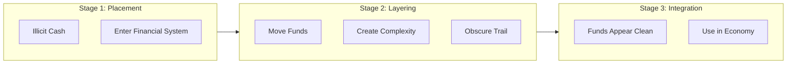
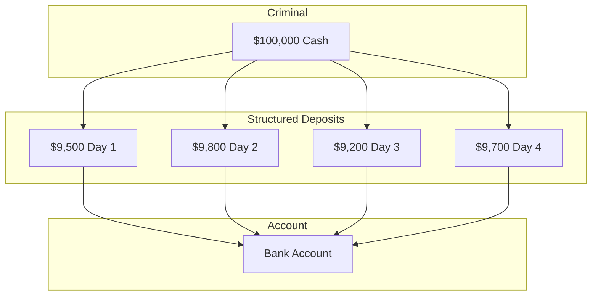
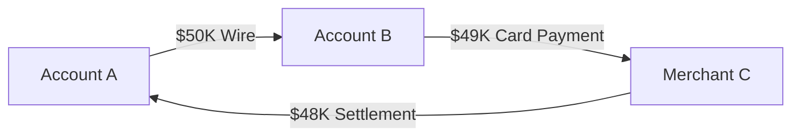
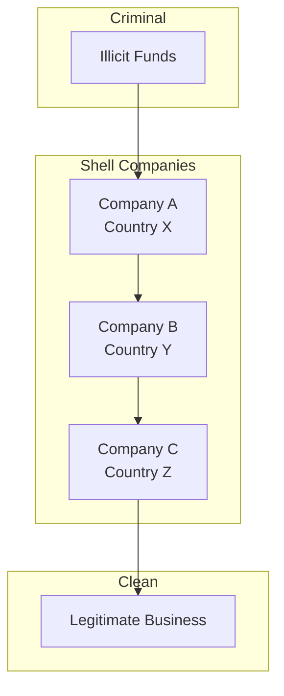

# Money Laundering

> **Last Updated:** 2025-02-17
> **Status:** Complete

Money laundering is the process of making illegally obtained money appear legitimate. Payment platforms are attractive targets for launderers because they process large volumes of transactions quickly. Understanding how laundering works is essential for building effective detection systems.

## Quick Reference

| Stage | Goal | Payment Platform Risk |
|-------|------|----------------------|
| Placement | Enter financial system | Processing illicit funds |
| Layering | Obscure origin | Complex transaction patterns |
| Integration | Use as legitimate | Merchant payouts |

## The Three Stages of Money Laundering

### Stage 1: Placement

The first stage involves getting illicit cash into the financial system.

| Method | Description | Detection |
|--------|-------------|-----------|
| **Structuring** | Breaking large amounts into smaller deposits | Transactions just under $10K |
| **Smurfing** | Using multiple people to make deposits | Multiple accounts, same patterns |
| **Cash-intensive business** | Mixing illicit cash with legitimate | Unusual cash volumes |
| **Currency exchange** | Converting to different currencies | Multiple currency transactions |

**PayFac Risk:**
- Sub-merchants used to process fraudulent transactions
- Fake sales to move cash through card network

### Stage 2: Layering

The second stage creates complex transaction patterns to obscure the money's origin.

| Method | Description | Detection |
|--------|-------------|-----------|
| **Multiple transfers** | Moving money between accounts | Rapid fund movement |
| **Shell companies** | Using fictitious businesses | No real business activity |
| **International transfers** | Moving across jurisdictions | Cross-border patterns |
| **Trade-based laundering** | Over/under invoicing | Price discrepancies |

**PayFac Risk:**
- Transactions between related merchants
- Complex refund patterns
- International settlement manipulation

### Stage 3: Integration

The final stage reintroduces "cleaned" money into the legitimate economy.

| Method | Description | Detection |
|--------|-------------|-----------|
| **Real estate purchase** | Buying property | Large purchases, cash |
| **Business investment** | Investing in companies | Unusual investment sources |
| **Luxury goods** | High-value purchases | Cash purchases of luxury items |
| **Loan repayment** | Paying back fake loans | Loans from unusual sources |

**PayFac Risk:**
- Merchant payouts to criminal accounts
- Legitimate-appearing business revenue

## Common Laundering Patterns

### Structuring (Smurfing)

Breaking large amounts into smaller transactions to avoid reporting thresholds:

**Red Flags:**
- Transactions consistently just under $10,000
- Multiple transactions on consecutive days
- Round or near-round amounts
- Same person, multiple accounts

### Round-Trip Transactions

Money sent out and returned through different channels:

**Red Flags:**
- Funds return to origin
- Multiple intermediaries
- Small "fees" deducted at each step

### Trade-Based Laundering

Using trade transactions to move value:

| Pattern | Example |
|---------|---------|
| Over-invoicing imports | Pay $100K for $50K goods |
| Under-invoicing exports | Receive $50K for $100K goods |
| Multiple invoicing | Invoice same goods multiple times |
| Phantom shipments | Pay for goods never shipped |

### Shell Company Networks

Using fictitious or dormant companies:

## PayFac-Specific Risks

### Merchant Account Laundering

Criminals obtain merchant accounts to process fraudulent transactions:

| Scheme | Method | Detection |
|--------|--------|-----------|
| **Fake sales** | Process cards for non-existent sales | No real customers, high refund rate |
| **Transaction laundering** | Process for other businesses | Inconsistent business type |
| **Bust-out** | Process heavily, then disappear | Sudden volume spike, then abandonment |

### Sub-Merchant Risks

| Risk | Description |
|------|-------------|
| Identity fraud | Fake business identities |
| Business front | Legitimate front for illicit activity |
| Collusion | Merchant and cardholder colluding |
| Aggregation | Processing for unauthorized third parties |

## Red Flags for Payment Platforms

### Transaction-Level Red Flags

| Red Flag | Pattern |
|----------|---------|
| Round amounts | $1,000, $5,000, $10,000 exactly |
| Threshold avoidance | $9,999, $9,800 repeatedly |
| Rapid velocity | Many transactions in short time |
| Unusual timing | Transactions at odd hours |
| Geographic mismatch | Transaction locations don't match business |

### Merchant-Level Red Flags

| Red Flag | Pattern |
|----------|---------|
| Inconsistent volume | Sudden spikes without explanation |
| High refund rate | Excessive refunds/voids |
| Minimal chargebacks | Suspiciously low for high-risk MCC |
| Address discrepancies | Business address issues |
| Ownership changes | Frequent beneficial owner changes |

### Network-Level Red Flags

| Red Flag | Pattern |
|----------|---------|
| Related merchants | Transactions between connected merchants |
| Common customers | Same customers across many merchants |
| Coordinated activity | Synchronized transaction patterns |
| Cross-border flows | Unusual international patterns |

## Risk Assessment

### High-Risk Industries

| Industry | Risk Factors |
|----------|--------------|
| Money services | Direct cash handling |
| Gambling/gaming | Cash-intensive, anonymous |
| Precious metals | High-value, portable |
| Real estate | Large transactions, cash |
| Virtual currency | Pseudonymous, cross-border |

### High-Risk Geographies

| Category | Examples |
|----------|----------|
| FATF blacklist | Countries identified as high-risk |
| Sanctioned | OFAC-sanctioned jurisdictions |
| Tax havens | Known for secrecy |
| Conflict zones | Areas with limited oversight |

### Risk Scoring Factors

| Factor | Higher Risk | Lower Risk |
|--------|-------------|------------|
| Business type | Cash-intensive, high-value | Retail, services |
| Geography | High-risk countries | Domestic, low-risk |
| Customer type | Anonymous, shell company | Established business |
| Transaction patterns | Unusual, complex | Consistent, explainable |
| Ownership | Complex, nominee | Clear, verified |

## Detection Approaches

### Rules-Based Detection

| Rule Category | Examples |
|---------------|----------|
| Threshold | > $10K single transaction |
| Velocity | > 5 transactions in 10 minutes |
| Pattern | Round amounts, just under reporting |
| Geographic | Transactions from high-risk countries |
| Relationship | Transactions between related parties |

### Machine Learning Detection

| Approach | Application |
|----------|-------------|
| Anomaly detection | Identify unusual patterns |
| Clustering | Group similar suspicious behavior |
| Network analysis | Map transaction relationships |
| Behavioral analysis | Detect changes from baseline |

## Related Topics

- [SAR Reporting](./sar-reporting.md) - Reporting suspicious activity
- [Transaction Monitoring](./transaction-monitoring.md) - Monitoring systems
- [Fraud Prevention](../fraud-prevention/index.md) - Fraud vs. AML

## References

- [FATF Money Laundering Typologies](https://www.fatf-gafi.org/)
- [FinCEN Advisories](https://www.fincen.gov/resources/advisories)
- [FFIEC BSA/AML Examination Manual](https://bsaaml.ffiec.gov/manual)
