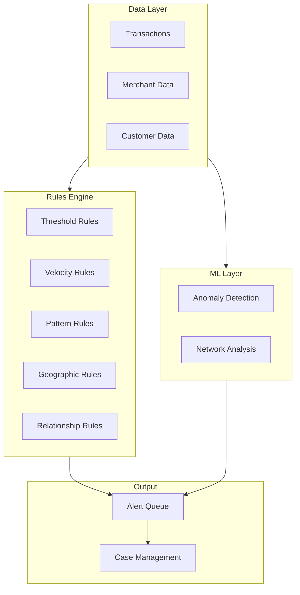

# AML/BSA Quiz

> **Last Updated:** 2025-02-17
> **Status:** Complete

Test your understanding of AML/BSA compliance with these self-assessment questions.

## Money Laundering

### Question 1: Three Stages

**What are the three stages of money laundering, and how might a payment platform be exploited at each stage?**

View Answer

**The Three Stages:**

| Stage | Goal | Payment Platform Risk |
|-------|------|----------------------|
| **Placement** | Get illicit cash into financial system | Processing fraudulent transactions, fake sales |
| **Layering** | Obscure the money's origin | Complex transaction patterns, refunds, transfers between merchants |
| **Integration** | Use cleaned funds in economy | Merchant payouts appearing as legitimate business revenue |

**PayFac-Specific Exploitation:**

**Placement:**
- Criminals obtain merchant accounts under false pretenses
- Process card transactions for non-existent sales
- Convert criminal proceeds to card network settlements

**Layering:**
- Transactions between related/colluding merchants
- Complex refund patterns to obscure origin
- Multiple sub-merchants used to create complexity

**Integration:**
- Merchant receives legitimate-looking settlement
- Funds appear as normal business revenue
- Integrated into legitimate economy

**Detection Focus:**
- Verify merchant legitimacy at onboarding
- Monitor for related party transactions
- Track unusual refund patterns

### Question 2: Structuring

**What is "structuring" and why is it a red flag?**

View Answer

**Definition:**
Structuring (also called "smurfing") is the practice of breaking large financial transactions into smaller ones to avoid regulatory reporting thresholds.

**Example:**
Instead of depositing $50,000 (which triggers a CTR):
- Day 1: $9,500
- Day 2: $9,800
- Day 3: $9,200
- Day 4: $9,700
- Day 5: $9,300

**Why It's a Red Flag:**

| Reason | Explanation |
|--------|-------------|
| **Intent to evade** | Specifically designed to avoid reporting |
| **Illegal** | Structuring itself is a federal crime |
| **Indicates criminal activity** | Why hide if funds are legitimate? |
| **BSA violation** | Violates Bank Secrecy Act |

**Detection Signals:**
- Transactions just under $10,000
- Round or near-round amounts
- Multiple transactions over short period
- Same person/account
- Pattern suggests awareness of threshold

**Response:**
- File SAR citing structuring
- Threshold: $5,000 (when suspicious)
- Document the pattern clearly

### Question 3: SAR Thresholds

**When must a SAR (Suspicious Activity Report) be filed? What's the threshold?**

View Answer

**SAR Filing Requirements:**

| Situation | Threshold | Deadline |
|-----------|-----------|----------|
| **Known suspect identified** | $5,000 | 30 days |
| **No suspect identified** | $25,000 | 30-60 days |
| **Insider abuse** | Any amount | 30 days |
| **Money laundering suspected** | $5,000 | 30 days |
| **BSA violation** | $5,000 | 30 days |

**When to File:**
A SAR must be filed when the institution knows, suspects, or has reason to suspect:
1. Transaction involves funds from illegal activity
2. Transaction designed to evade reporting requirements
3. Transaction has no business or lawful purpose
4. Transaction facilitates criminal activity

**Key Points:**
- "Reason to suspect" is a low bar
- Don't need proof of crime
- File if in doubt
- Document decisions not to file

**Deadline Calculation:**
- Clock starts when suspicious activity is detected
- 30 days is standard deadline
- Can extend to 60 days only if actively investigating and no suspect identified

### Question 4: Fraud vs. AML Monitoring

**What's the difference between transaction monitoring for fraud versus AML? What patterns differ?**

View Answer

**Key Differences:**

| Factor | Fraud Monitoring | AML Monitoring |
|--------|------------------|----------------|
| **Goal** | Prevent financial loss | Detect criminal activity |
| **Timing** | Real-time blocking | Often batch analysis |
| **Action** | Decline transaction | File SAR, investigate |
| **Outcome** | Immediate prevention | Regulatory reporting |

**Pattern Differences:**

| Fraud Patterns | AML Patterns |
|----------------|--------------|
| Unusual purchase behavior | Structuring (under thresholds) |
| Velocity (many transactions fast) | Round amounts |
| Geographic anomalies | Rapid fund movement |
| Device fingerprint mismatch | Related party transactions |
| Card testing (small amounts) | Inconsistent business activity |

**Overlap:**
Some patterns indicate both:
- Unusual velocity
- Geographic red flags
- Inconsistent with profile

**Different Response:**

| Pattern | Fraud Response | AML Response |
|---------|----------------|--------------|
| Card testing | Block, alert | Investigate, possible SAR |
| Structuring | May not detect | SAR required |
| Velocity spike | Real-time block | SAR if suspicious |
| Round amounts | Low fraud signal | High AML signal |

**Integration:**
Best practice is integrated monitoring that:
- Shares data between fraud and AML
- Routes alerts appropriately
- Avoids duplication
- Captures both fraud and AML patterns

## Scenario Questions

### Question 5: Transaction Pattern Analysis

**Scenario:** The platform detects a sub-merchant receiving many transactions just under $10,000, split across multiple days, always in round numbers. What might this indicate and what's the appropriate response?

View Answer

**Pattern Analysis:**

| Observation | Red Flag |
|-------------|----------|
| Just under $10,000 | Possible structuring to avoid CTR |
| Multiple days | Deliberate splitting |
| Round numbers | Unusual in legitimate commerce |
| Consistent pattern | Not random, appears intentional |

**This Pattern Indicates:**
- **Likely structuring** - deliberate avoidance of CTR threshold
- **Possible money laundering** - placement stage
- **Potential transaction laundering** - processing for illegitimate purpose

**Appropriate Response:**

**Immediate (24-48 hours):**
1. Flag account for enhanced monitoring
2. Pull complete transaction history
3. Review merchant onboarding documentation
4. Assess if business type explains pattern

**Investigation (1-2 weeks):**
1. Interview merchant (carefully, no tipping off)
2. Verify legitimate business operations
3. Document all findings
4. Escalate to compliance officer

**Decision:**
If pattern confirmed as suspicious:
- **File SAR** - Threshold met (> $5,000 suspicious)
- **Consider account action** - restriction or termination
- **Document decision** - complete investigation file

**SAR Narrative Should Include:**
- Total dollar amount
- Number of transactions
- Date range
- Pattern description
- Why activity lacks legitimate purpose
- Merchant information

### Question 6: Investigation Workflow

**What metrics should be monitored in real-time for AML compliance?**

View Answer

**Real-Time AML Monitoring Metrics:**

| Category | Metrics |
|----------|---------|
| **Transaction Level** | Amount, velocity, geography, round amounts |
| **Customer Level** | Profile deviations, account activity |
| **Merchant Level** | Volume patterns, refund ratios |
| **Network Level** | Related party transactions, circular flows |

**Specific Real-Time Checks:**

| Check | Threshold | Action |
|-------|-----------|--------|
| Single transaction | > $10,000 | Generate alert |
| Daily aggregate | > $10,000 | CTR trigger |
| Velocity | > 10 tx / hour | Alert |
| Round amounts | Multiple $X,000 | Alert |
| High-risk country | Any amount | Enhanced review |
| Sanctions match | Any | Block + alert |

**Dashboard Metrics:**

| Metric | Purpose |
|--------|---------|
| Alert volume | Workload management |
| Alert aging | SLA compliance |
| SAR filing rate | Regulatory compliance |
| False positive rate | Rule tuning needs |
| High-risk customer count | Portfolio risk |

**System Requirements:**
- < 5 minute latency for critical alerts
- Real-time sanctions screening
- Velocity tracking across time windows
- Aggregation across accounts/merchants

### Question 7: Compliance Program Design

**Design a monitoring system that would catch potential money laundering through a PayFac platform. What rules and scenarios would you implement?**

View Answer

**Comprehensive AML Monitoring System:**

**Rule Categories:**

**1. Threshold Rules:**
| Rule | Threshold | Alert Level |
|------|-----------|-------------|
| Large transaction | > $10,000 | Medium |
| Near-CTR | $9,000-$9,999 | High |
| Daily aggregate | > $10,000 | CTR + Alert |

**2. Velocity Rules:**
| Rule | Threshold | Alert Level |
|------|-----------|-------------|
| Transactions/hour | > 10 | Medium |
| Transactions/day | > 50 | High |
| New merchant spike | > 5x first month | High |

**3. Pattern Rules:**
| Rule | Pattern | Alert Level |
|------|---------|-------------|
| Round amounts | 3+ round in day | Medium |
| Structuring | Multiple just-under-threshold | Critical |
| Rapid in/out | Funds move within 24h | High |

**4. Geographic Rules:**
| Rule | Trigger | Alert Level |
|------|---------|-------------|
| High-risk country | Any transaction | High |
| Sanctioned country | Any transaction | Critical + Block |
| Location mismatch | Customer/merchant mismatch | Medium |

**5. Relationship Rules:**
| Rule | Pattern | Alert Level |
|------|---------|-------------|
| Related merchants | Transactions between | High |
| Circular flows | Funds return to origin | Critical |
| Common owners | Multiple merchants same owner | Medium |

**ML Models:**
- Anomaly detection for unusual patterns
- Network analysis for hidden relationships
- Behavioral scoring for profile deviations

**Alert Prioritization:**
| Priority | Criteria | SLA |
|----------|----------|-----|
| Critical | Sanctions, structuring | 24h |
| High | Multiple red flags | 48h |
| Medium | Single red flag | 5 days |
| Low | Minor deviation | 10 days |

## Summary

After completing this quiz, you should understand:

- [ ] The three stages of money laundering
- [ ] How payment platforms are exploited for laundering
- [ ] What structuring is and why it's illegal
- [ ] SAR filing thresholds and deadlines
- [ ] Difference between fraud and AML monitoring
- [ ] How to design AML monitoring systems
- [ ] Appropriate response to suspicious patterns

## Related Topics

- [Money Laundering](./money-laundering.md) - Detailed patterns
- [SAR Reporting](./sar-reporting.md) - Filing requirements
- [Transaction Monitoring](./transaction-monitoring.md) - Detection systems
- [Fraud Prevention](../fraud-prevention/index.md) - Complementary monitoring
