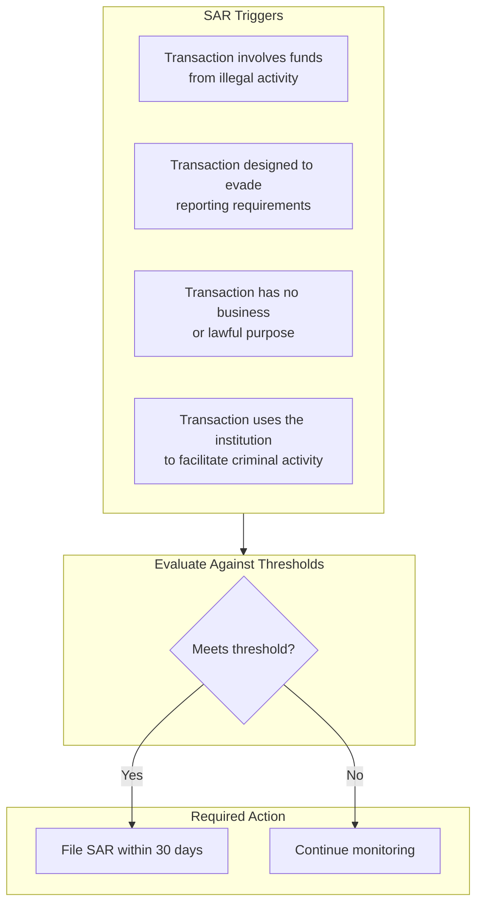
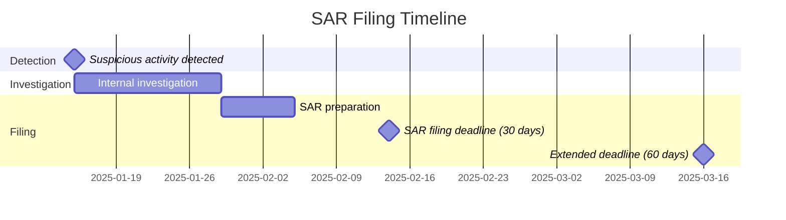
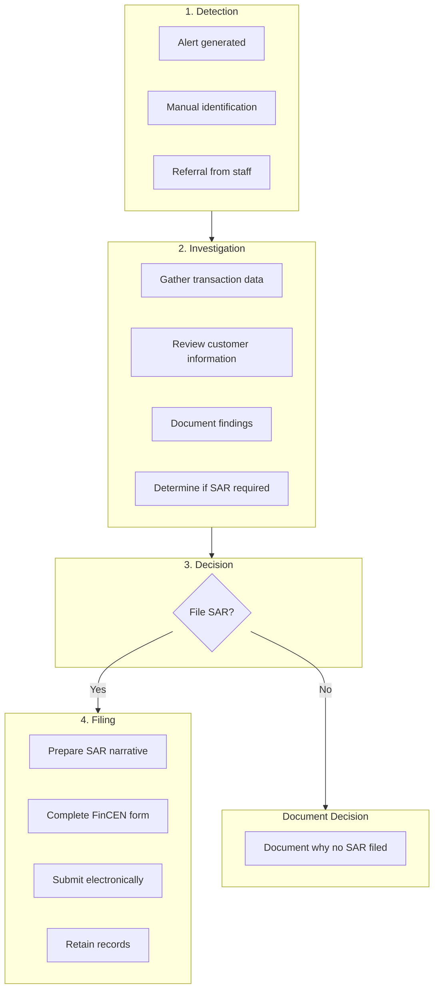

# SAR Reporting

> **Last Updated:** 2025-02-17
> **Status:** Complete

Suspicious Activity Reports (SARs) are the primary mechanism for reporting potential money laundering and financial crimes to FinCEN. Understanding when and how to file SARs is a critical compliance obligation.

## Quick Reference

| Report Type | Threshold | Deadline | Filed With |
|-------------|-----------|----------|------------|
| SAR (known suspect) | $5,000 | 30 days | FinCEN |
| SAR (no suspect) | $25,000 | 30-60 days | FinCEN |
| SAR (insider) | Any amount | 30 days | FinCEN |
| CTR | > $10,000 | Same day | FinCEN |

## Suspicious Activity Reports (SARs)

### What Triggers a SAR?

A SAR must be filed when the institution knows, suspects, or has reason to suspect:

### SAR Thresholds

| Situation | Threshold | Notes |
|-----------|-----------|-------|
| **Known suspect identified** | **$5,000** | Subject can be identified |
| **No suspect identified** | **$25,000** | Unknown perpetrator |
| **Insider abuse** | **Any amount** | Employee, director, agent |
| **Money laundering** | **$5,000** | Know, suspect, or reason to suspect |
| **BSA violation** | **$5,000** | Structuring, evasion |
| **MSB point of sale** | **$2,000** | Money services business transactions |

### SAR Filing Deadlines

| Situation | Initial Deadline | Maximum |
|-----------|------------------|---------|
| Suspect identified | 30 calendar days from detection | 30 days |
| No suspect, investigation ongoing | 30 days, may extend | 60 days |
| Ongoing activity | Continuing SARs every 90 days | N/A |

### SAR Filing Process

### SAR Narrative Requirements

The narrative is the most critical part of the SAR:

| Element | Description |
|---------|-------------|
| **Who** | Subject name, address, identification |
| **What** | Type of suspicious activity |
| **When** | Dates and times of activity |
| **Where** | Locations, accounts involved |
| **Why** | Why activity is suspicious |
| **How** | Method used, transaction details |

**Narrative Best Practices:**

| Do | Don't |
|----|-------|
| Be specific and factual | Use vague language |
| Include dollar amounts | Omit key details |
| Describe the pattern | Make conclusions of guilt |
| Reference supporting docs | Include privileged info |
| Use clear chronology | Ramble without structure |

### SAR Confidentiality

:::danger Tipping Off Prohibited
It is **illegal** to notify the subject that a SAR has been or will be filed. Violation carries criminal penalties.

- Do not tell the customer
- Do not include SAR reference in customer communications
- Limit internal knowledge to need-to-know
:::

## Currency Transaction Reports (CTRs)

### CTR Requirements

| Requirement | Details |
|-------------|---------|
| Threshold | > $10,000 in currency (cash) |
| Aggregation | Multiple transactions by same person in one business day |
| Filing deadline | 15 days after transaction |
| Form | FinCEN Form 112 |

### What Counts as Currency

| Currency | Not Currency |
|----------|--------------|
| US paper money | Checks |
| US coins | Wire transfers |
| Foreign paper money | Card transactions |
| Foreign coins | Money orders |

### CTR Exemptions

Certain customers may be exempt from CTR filing:

| Exempt Category | Examples |
|-----------------|----------|
| Banks | Domestic banks |
| Government | Federal, state, local agencies |
| Listed companies | NYSE, NASDAQ listed |
| Subsidiaries | Of listed companies |
| Established customers | After proper documentation |

:::warning Exemption Requirements
Exemptions require:
- Annual review
- Proper documentation
- No suspicious activity
:::

## Filing Procedures

### Electronic Filing

All SARs and CTRs must be filed electronically through FinCEN's BSA E-Filing System:

| Step | Action |
|------|--------|
| 1 | Register for BSA E-Filing account |
| 2 | Complete appropriate form |
| 3 | Submit electronically |
| 4 | Receive acknowledgment |
| 5 | Retain confirmation |

### Record Retention

| Record | Retention Period |
|--------|------------------|
| SAR filing | 5 years |
| CTR filing | 5 years |
| Supporting documentation | 5 years |
| Investigation notes | 5 years |
| Decision not to file | 5 years |

## Common SAR Scenarios

### Scenario 1: Structuring

**Pattern:** Customer makes multiple cash deposits of $9,500 over several days

**Analysis:**
- Appears designed to avoid CTR threshold
- Meets $5,000 SAR threshold
- File SAR citing structuring

### Scenario 2: Unusual Merchant Activity

**Pattern:** New merchant has sudden spike in volume, all transactions just under $1,000, high refund rate

**Analysis:**
- Pattern suggests potential laundering
- Evaluate total dollar amount
- If > $5,000 suspicious, file SAR

### Scenario 3: Related Party Transactions

**Pattern:** Multiple merchants owned by same individual transacting with each other

**Analysis:**
- May be layering activity
- Document the relationships
- If suspicious and > $5,000, file SAR

## SAR Quality Metrics

### Common Deficiencies

| Deficiency | Impact |
|------------|--------|
| Incomplete narrative | Can't understand activity |
| Missing subject info | Can't identify suspect |
| Late filing | Regulatory violation |
| No supporting docs | Can't verify |
| Vague descriptions | Not actionable |

### Quality Checklist

| Item | Verified |
|------|----------|
| All fields completed | ☐ |
| Narrative addresses 5 W's | ☐ |
| Dollar amounts accurate | ☐ |
| Dates correct | ☐ |
| Subject info complete | ☐ |
| Supporting docs referenced | ☐ |
| Filed within deadline | ☐ |
| Retained confirmation | ☐ |

## PayFac SAR Considerations

### Who Files?

| Entity | Responsibility |
|--------|---------------|
| PayFac | File SAR if you detect suspicious activity |
| Sponsor bank | May also file based on their monitoring |
| Both | Possible for same activity |

### PayFac-Specific Red Flags

| Red Flag | SAR Consideration |
|----------|-------------------|
| Transaction laundering | Sub-merchant processing for others |
| Bust-out | Rapid processing then abandonment |
| Unusual refunds | Refunds without corresponding sales |
| Geographic anomalies | Transactions inconsistent with business |
| Velocity spikes | Sudden unexplained volume |

## Related Topics

- [Money Laundering](./money-laundering.md) - Understanding what to look for
- [Transaction Monitoring](./transaction-monitoring.md) - Detection systems
- [Merchant Monitoring](../monitoring-programs/merchant-monitoring.md) - Ongoing oversight

## References

- [FinCEN SAR Filing Instructions](https://www.fincen.gov/resources/filing-information)
- [FinCEN CTR Filing Instructions](https://www.fincen.gov/resources/filing-information)
- [FFIEC BSA/AML Manual - SAR Section](https://bsaaml.ffiec.gov/manual)
