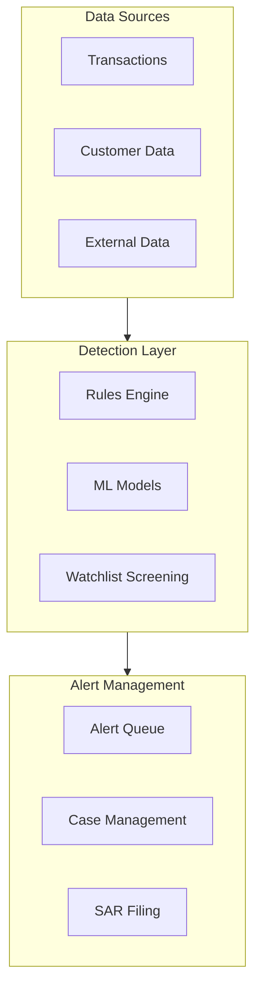
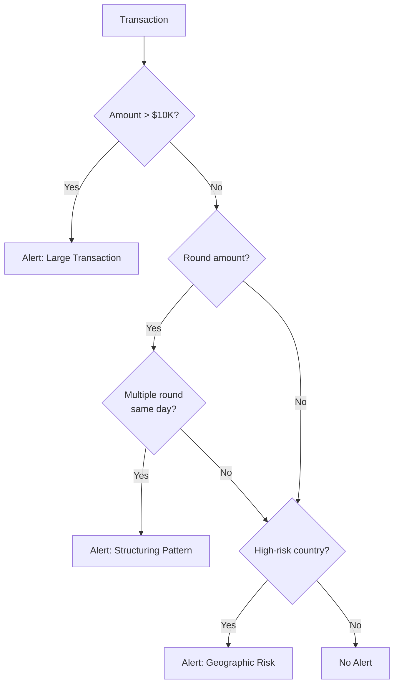
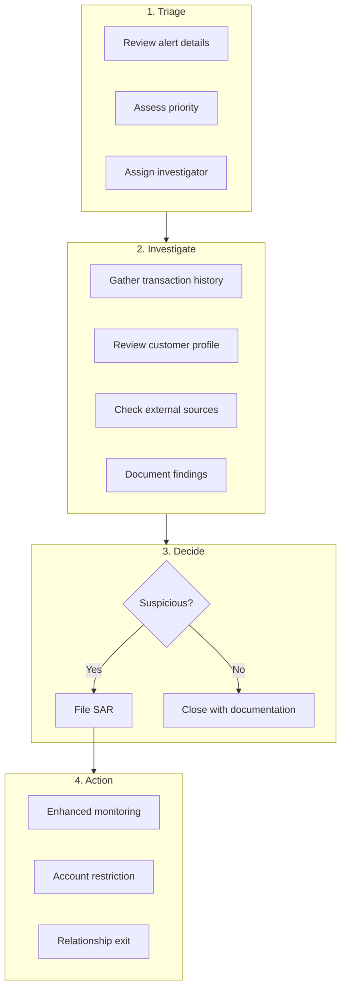
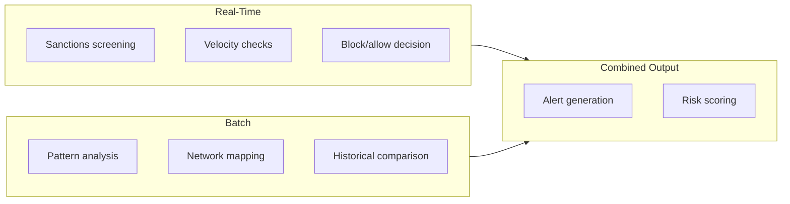

# AML Transaction Monitoring

> **Last Updated:** 2025-02-17
> **Status:** Complete

Transaction monitoring is the backbone of AML compliance. Effective monitoring systems detect suspicious patterns, generate alerts, and enable timely investigation and reporting.

## Quick Reference

| Component | Purpose |
|-----------|---------|
| Rules engine | Detect known patterns |
| ML models | Identify anomalies |
| Alert queue | Manage investigations |
| Case management | Document decisions |

## Monitoring Architecture

## Monitoring Approaches

### Rules-Based Monitoring

Rules detect known suspicious patterns:

| Rule Category | Example Rules |
|---------------|---------------|
| **Threshold** | Single transaction > $10,000 |
| **Velocity** | > 10 transactions in 24 hours |
| **Pattern** | Round amounts ($1,000 exactly) |
| **Structuring** | Multiple transactions just under $10,000 |
| **Geographic** | Transactions from high-risk countries |
| **Behavioral** | Activity inconsistent with profile |

### Example Rule Set

### ML-Based Monitoring

Machine learning complements rules by detecting unknown patterns:

| Approach | Application |
|----------|-------------|
| Anomaly detection | Identify unusual behavior |
| Clustering | Group similar suspicious patterns |
| Network analysis | Map relationships |
| Behavioral scoring | Detect profile deviations |

### Comparison: Rules vs. ML

| Factor | Rules | ML |
|--------|-------|-----|
| Known patterns | Excellent | Good |
| Unknown patterns | Poor | Excellent |
| Explainability | High | Medium |
| False positives | Higher | Lower |
| Maintenance | Manual updates | Self-learning |
| Implementation | Simpler | Complex |

**Best Practice:** Use both—rules for known patterns, ML for anomaly detection.

## Key Monitoring Scenarios

### Structuring Detection

| Signal | Detection |
|--------|-----------|
| Transactions just under $10K | Threshold rule |
| Multiple deposits same day | Velocity rule |
| Sequential round amounts | Pattern rule |
| Split transactions | Aggregation analysis |

### Rapid Movement of Funds

| Signal | Detection |
|--------|-----------|
| Quick in/out pattern | Time-based analysis |
| Minimal balance retention | Balance monitoring |
| Multiple transfer legs | Network analysis |

### Unusual Business Activity

| Signal | Detection |
|--------|-----------|
| Volume inconsistent with type | Profile comparison |
| Transactions outside normal hours | Time analysis |
| Geographic inconsistencies | Location analysis |
| Customer type mismatch | Behavioral analysis |

### Related Party Transactions

| Signal | Detection |
|--------|-----------|
| Transactions between linked accounts | Relationship mapping |
| Circular fund flows | Network analysis |
| Common beneficial owners | Entity resolution |

## Alert Investigation

### Alert Prioritization

| Priority | Criteria | SLA |
|----------|----------|-----|
| Critical | Large amount, known typology | 24 hours |
| High | Multiple red flags | 48 hours |
| Medium | Single red flag, moderate amount | 5 days |
| Low | Minor deviation | 10 days |

### Investigation Workflow

### Investigation Documentation

| Element | Required Content |
|---------|------------------|
| Alert details | Rule triggered, amount, parties |
| Transaction review | All relevant transactions |
| Customer review | Profile, history, KYC info |
| External research | Public records, news |
| Analysis | Why suspicious or not |
| Decision | SAR filing or closure |
| Approval | Supervisor sign-off |

## Alert Management

### Queue Management

| Metric | Target | Action if Exceeded |
|--------|--------|-------------------|
| Pending alerts | < 100 | Add resources |
| Average age | < 5 days | Prioritize old alerts |
| Critical alerts | 0 > 24h | Immediate escalation |
| Closure rate | > 90% in SLA | Process review |

### False Positive Management

| Strategy | Implementation |
|----------|----------------|
| Rule tuning | Adjust thresholds based on results |
| Whitelist | Exclude known good patterns |
| Feedback loop | Investigators flag poor rules |
| ML refinement | Retrain on disposition data |

### Quality Assurance

| Check | Frequency | Method |
|-------|-----------|--------|
| Sample review | Weekly | Manager reviews sample |
| Consistency | Monthly | Compare similar cases |
| Completeness | All cases | Checklist verification |
| Timeliness | Daily | SLA monitoring |

## Real-Time vs. Batch Monitoring

### Real-Time Monitoring

| Aspect | Details |
|--------|---------|
| Use case | Transaction blocking |
| Latency | Milliseconds |
| Scenarios | Sanctions, velocity |
| Architecture | Streaming (Kafka) |

### Batch Monitoring

| Aspect | Details |
|--------|---------|
| Use case | Pattern detection |
| Latency | Hours to daily |
| Scenarios | Structuring, network analysis |
| Architecture | Data warehouse, ETL |

### Hybrid Approach

## Monitoring for PayFacs

### Sub-Merchant Monitoring

| Monitor | Purpose |
|---------|---------|
| Onboarding anomalies | Detect application fraud |
| Volume patterns | Identify unusual activity |
| Refund ratios | Detect potential laundering |
| Geographic patterns | Flag unexpected locations |
| Related merchants | Identify connected entities |

### Aggregated Analysis

| Analysis | Detection |
|----------|-----------|
| Portfolio-level patterns | Systematic abuse |
| Cross-merchant activity | Related party transactions |
| Industry comparisons | Outlier identification |
| Temporal patterns | Coordinated activity |

## System Requirements

### Performance

| Metric | Requirement |
|--------|-------------|
| Transaction volume | Handle peak + 50% |
| Alert latency | < 5 minutes for critical |
| Rule updates | Deploy within hours |
| Data retention | 5+ years for investigation |

### Integration

| System | Integration |
|--------|-------------|
| Core platform | Real-time transaction feed |
| Customer data | Profile information |
| Watchlists | Sanctions, PEP lists |
| Case management | Alert disposition |
| Reporting | SAR filing system |

## Audit Trail Requirements

| Event | Logged Data |
|-------|-------------|
| Alert generated | Rule, transaction, timestamp |
| Alert assigned | Investigator, timestamp |
| Investigation actions | All steps taken |
| Decision made | Outcome, rationale |
| SAR filed | Filing reference, date |
| Closure | Reason, approval |

## Related Topics

- [Money Laundering](./money-laundering.md) - Patterns to detect
- [SAR Reporting](./sar-reporting.md) - Filing requirements
- [Merchant Monitoring](../monitoring-programs/merchant-monitoring.md) - Operational monitoring

## References

- [FFIEC BSA/AML Manual - Transaction Monitoring](https://bsaaml.ffiec.gov/manual)
- [FinCEN Advisories](https://www.fincen.gov/resources/advisories)
- [FATF Guidance on Correspondent Banking](https://www.fatf-gafi.org/)
