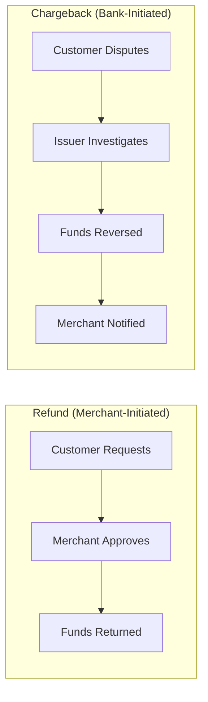
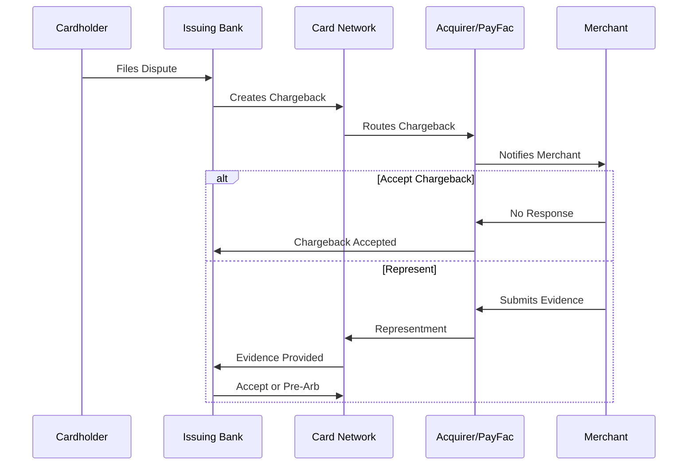
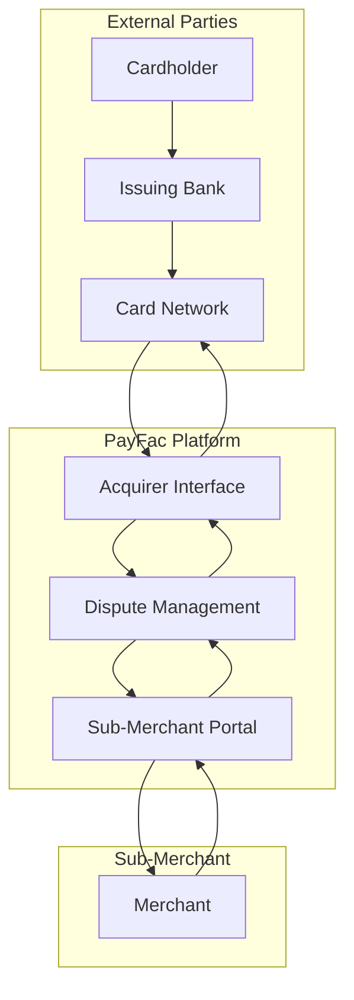

# Chargeback Management

> **Last Updated:** 2025-02-17
> **Status:** Complete

Chargebacks are the payment industry's consumer protection mechanism—and a PayFac's greatest operational challenge. A single merchant with uncontrolled chargebacks can cost hundreds of thousands of dollars in losses, fees, and program penalties.

## Quick Reference

| Metric | Target | Critical |
|--------|--------|----------|
| Chargeback Ratio | < 0.5% | 1.0% |
| Response Time | < 24 hours | Before deadline |
| Win Rate (fraud) | 20-30% | Varies by code |
| Win Rate (service) | 40-60% | With evidence |

## What is a Chargeback?

A **chargeback** is a forced reversal of a payment card transaction, initiated by the cardholder's issuing bank. Unlike a refund (which is merchant-initiated), a chargeback bypasses the merchant entirely and uses the card network's dispute resolution process.



### Why Chargebacks Matter for PayFacs

| Factor | Impact |
|--------|--------|
| **Financial Loss** | Transaction amount + chargeback fee ($15-100) + operational cost |
| **First-Line Liability** | PayFac absorbs loss before sponsor bank |
| **Ratio Monitoring** | Exceeding 1% triggers network programs |
| **Program Fines** | $10,000-100,000+ monthly during monitoring |
| **Termination Risk** | Excessive chargebacks can end acquiring relationship |

## Chargeback Lifecycle

The dispute process follows a defined path with strict timeframes:



### Key Stages

1. **Initiation** - Cardholder disputes transaction with issuing bank
2. **First Chargeback** - Issuer creates chargeback, funds debited from merchant
3. **Representment** - Merchant can submit evidence to dispute the chargeback
4. **Pre-Arbitration** - Second review if representment is rejected
5. **Arbitration** - Final decision by card network ($500+ filing fee)

Learn more: **[Chargeback Lifecycle](./lifecycle.md)**

## Reason Code Categories

Chargebacks are filed under specific reason codes that determine:
- Required evidence for representment
- Timeframes for response
- Win rate expectations

| Category | Visa Codes | Mastercard | Common Causes |
|----------|------------|------------|---------------|
| **Fraud** | 10.x | 48xx | Unauthorized use, stolen cards |
| **Authorization** | 11.x | 48xx | Declined auth, expired card |
| **Processing Errors** | 12.x | 48xx | Duplicate, wrong amount |
| **Consumer Disputes** | 13.x | 48xx | Not received, not as described |

Learn more: **[Reason Codes Reference](./reason-codes.md)**

## Representment Strategy

Fighting chargebacks requires compelling evidence matched to the reason code:

| Reason Code Type | Key Evidence |
|-----------------|--------------|
| Fraud (10.4/4837) | 3DS auth, AVS match, prior orders, IP/device |
| Not Received (13.1/4855) | Tracking, delivery confirmation, signed receipt |
| Not as Described (13.3/4853) | Product photos, description, return policy |
| Duplicate (12.6/4834) | Proof both charges are valid |

Learn more: **[Representment Guide](./representment.md)**

## Chargeback Ratio Calculation

Networks calculate your chargeback ratio monthly:

```
Chargeback Ratio = Chargebacks in Month / Transactions in Month × 100
```

:::warning Critical Thresholds
- **1% chargeback ratio** = Program entry for most networks
- **100 chargebacks minimum** = Usually required before ratio matters
- Both thresholds must typically be exceeded
:::

### Example Calculation

| Month | Transactions | Chargebacks | Ratio | Status |
|-------|-------------|-------------|-------|--------|
| January | 10,000 | 80 | 0.8% | Safe |
| February | 10,000 | 110 | 1.1% | **At Risk** |
| March | 10,000 | 150 | 1.5% | **Program Entry** |

## PayFac Chargeback Flow

As a PayFac, you're in the middle of the dispute process:



### PayFac Responsibilities

1. **Receive & Route** - Get chargebacks from acquirer, route to sub-merchant
2. **Time Management** - Ensure responses within deadlines
3. **Evidence Review** - Validate evidence before submission
4. **Financial Settlement** - Debit sub-merchant, manage reserves
5. **Ratio Monitoring** - Track aggregated and per-merchant ratios
6. **Remediation** - Work with high-risk merchants or terminate

## Section Contents

- **[Lifecycle](./lifecycle.md)** - Detailed dispute flow with timeframes
- **[Reason Codes](./reason-codes.md)** - Complete Visa/Mastercard reference
- **[Representment](./representment.md)** - Evidence requirements and strategy
- **[Quiz](./quiz.md)** - Test your chargeback knowledge

## Related Topics

- [Network Monitoring Programs](../monitoring-programs/network-programs.md) - What happens when ratios exceed thresholds
- [Reserve Management](../monitoring-programs/reserve-management.md) - Using reserves to cover chargebacks
- [Fraud Prevention](../fraud-prevention/index.md) - Preventing chargebacks at the source

**Ecosystem Context:**
- [Four-Party Model](/ecosystem/fundamentals/four-party-model/) - Why acquirers bear chargeback risk
- [PayFac Position](/ecosystem/fundamentals/four-party-model/payfac) - PayFac first-line liability explained

**Onboarding Context:**
- [Risk Factors](/onboarding/underwriting/risk-factors) - Chargeback prevention starts with proper underwriting
- [Ongoing Monitoring](/onboarding/merchant-lifecycle/ongoing-monitoring) - Continuous chargeback ratio monitoring

## References

- [Visa Claims Resolution (VCR) User Guide](https://usa.visa.com/dam/VCOM/download/about-visa/visa-rules-public.pdf)
- [Mastercard Chargeback Guide](https://www.mastercard.us/content/dam/public/mastercardcom/na/global-site/documents/mastercard-rules.pdf)
- [Chargebacks911 Industry Benchmarks](https://chargebacks911.com/)
