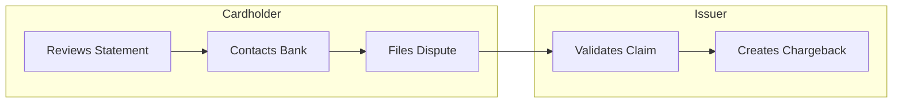
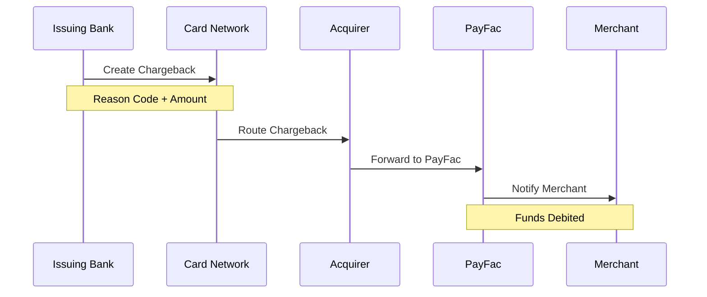
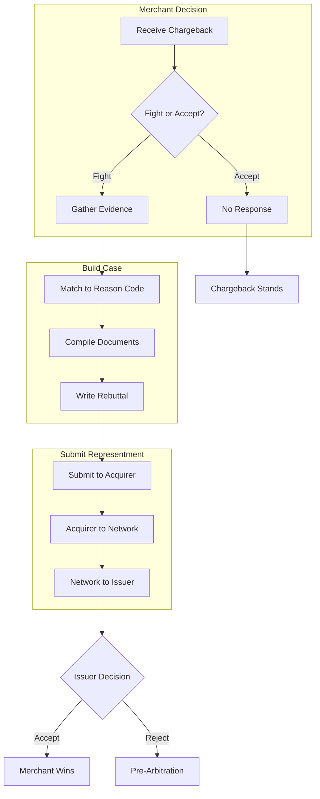
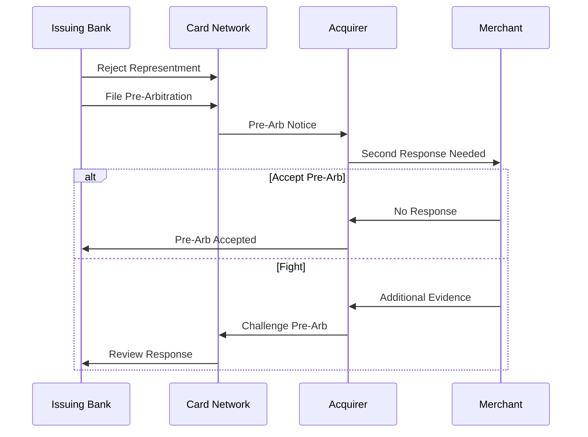
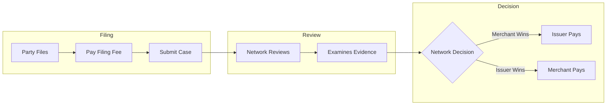
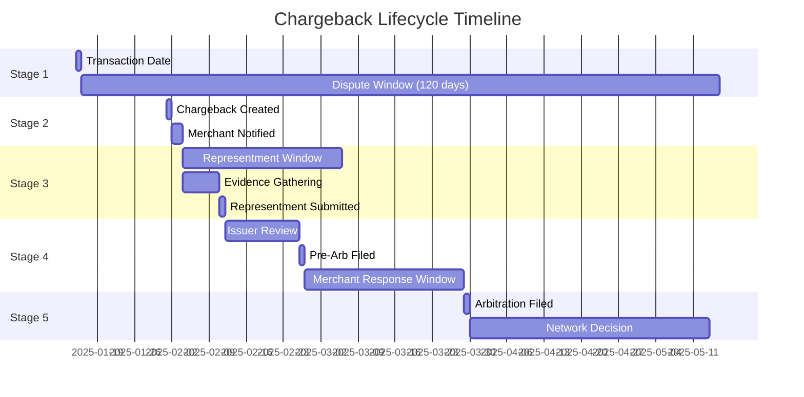
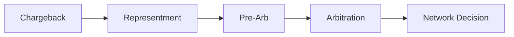

# Chargeback Lifecycle

> **Last Updated:** 2025-02-17
> **Status:** Complete

Understanding the complete chargeback lifecycle is essential for effective dispute management. Each stage has specific timeframes, responsibilities, and decision points.

## Quick Reference

| Stage | Visa Timeframe | Mastercard Timeframe | Who Acts |
|-------|---------------|---------------------|----------|
| Filing Window | 120 days | 120 days | Cardholder |
| First Chargeback | Immediate | Immediate | Issuer |
| Representment | 30 days | 45 days | Merchant |
| Pre-Arbitration | 30 days | 45 days | Issuer |
| Arbitration | 10 days | 45 days | Network |

## Stage 1: Dispute Initiation

The lifecycle begins when a cardholder contacts their issuing bank to dispute a transaction.

### Cardholder Dispute Windows

| Network | Standard Disputes | Fraud | Services Not Rendered |
|---------|------------------|-------|----------------------|
| Visa | 120 days | 120 days | 120 days from expected delivery |
| Mastercard | 120 days | 120 days | 120 days from expected delivery |

### Common Dispute Triggers

| Trigger | Percentage | Example |
|---------|------------|---------|
| True Fraud | 30-40% | Stolen card used online |
| Friendly Fraud | 40-50% | Cardholder forgot purchase |
| Merchant Error | 10-20% | Double charge, wrong amount |
| Service Issues | 10-15% | Not received, not as described |

## Stage 2: First Chargeback

Once the issuer validates the dispute, they create a formal chargeback through the card network.

### What Happens Financially

| Action | Amount | Timing |
|--------|--------|--------|
| Transaction Reversed | Original amount | Immediate |
| Chargeback Fee | $15-100 | Immediate |
| Reserve Adjustment | Varies | If applicable |

### PayFac First Chargeback Actions

1. **Debit Sub-Merchant** - Immediately debit transaction amount + fee
2. **Notify Merchant** - Send chargeback notification with deadline
3. **Start Timer** - Track response deadline
4. **Request Evidence** - Ask merchant for documentation
5. **Update Metrics** - Increment chargeback count and ratio

## Stage 3: Representment

The merchant can dispute the chargeback by submitting compelling evidence to prove the transaction was valid.

### Representment Deadlines

| Network | Standard | From Chargeback Date |
|---------|----------|---------------------|
| Visa | 30 days | Calendar days |
| Mastercard | 45 days | Calendar days |

:::danger Critical
Missing the representment deadline means automatic loss. The chargeback cannot be disputed after the deadline passes.
:::

### When to Represent vs. Accept

| Factor | Represent | Accept |
|--------|-----------|--------|
| Strong Evidence | Yes | No |
| Win Probability > 50% | Yes | Maybe |
| Transaction Value | High | Low |
| Reason Code | Service/Auth | True Fraud |
| Operational Cost | Justified | Not Worth It |

### Win Rates by Category

| Reason Category | Average Win Rate | Notes |
|-----------------|-----------------|-------|
| Fraud (10.x/48xx) | 20-30% | Requires 3DS, device data |
| Authorization (11.x) | 40-50% | Auth code evidence helps |
| Processing (12.x) | 60-70% | Usually clear evidence |
| Consumer (13.x) | 40-60% | Depends on documentation |

## Stage 4: Pre-Arbitration

If the issuer rejects the representment, they can initiate pre-arbitration—a second review before formal arbitration.

### Pre-Arbitration Deadlines

| Network | Response Window | From Pre-Arb Notice |
|---------|-----------------|---------------------|
| Visa | 30 days | Calendar days |
| Mastercard | 45 days | Calendar days |

### Pre-Arbitration Options

| Option | When to Use | Outcome |
|--------|-------------|---------|
| Accept | Weak case, low value | Chargeback final |
| New Evidence | Have additional proof | Continue dispute |
| Arbitration | Strong case, high value | Network decides |

## Stage 5: Arbitration

Arbitration is the final stage where the card network makes a binding decision.

### Arbitration Costs

| Network | Filing Fee | Losing Party Pays |
|---------|------------|-------------------|
| Visa | $500 | Yes + fees |
| Mastercard | $500 | Yes + fees |

:::warning Cost-Benefit Analysis
Only pursue arbitration when:
- Transaction value > $500 (to cover filing fee)
- Evidence is compelling
- Win probability > 70%
:::

### Arbitration Timeline

| Phase | Visa | Mastercard |
|-------|------|------------|
| Filing Deadline | 10 days from pre-arb | 45 days |
| Network Review | 30-60 days | 30-60 days |
| Final Decision | Binding | Binding |

## Complete Timeline Example

Here's a typical chargeback lifecycle from start to finish:

### Timeline Summary

| From | To | Days |
|------|-----|------|
| Transaction | Dispute Filed | 0-120 |
| Dispute | First Chargeback | 1-3 |
| Chargeback | Representment | 0-30 |
| Representment | Issuer Decision | 14-30 |
| Pre-Arb Filed | Response | 0-30 |
| Arbitration Filed | Decision | 30-60 |
| **Total Possible** | | **180-270 days** |

## Lifecycle by Outcome

### Scenario 1: Merchant Accepts

**Timeline:** 30 days
**Cost:** Transaction amount + chargeback fee

### Scenario 2: Representment Win

**Timeline:** 45-60 days
**Cost:** Operational cost only

### Scenario 3: Full Dispute (Arbitration)

**Timeline:** 120-180 days
**Cost:** $500 filing + potential loss

## PayFac Lifecycle Management

### System Requirements

| Capability | Purpose |
|------------|---------|
| Deadline Tracking | Never miss response windows |
| Evidence Repository | Store and retrieve documents |
| Workflow Automation | Route to right team members |
| Communication | Notify merchants, gather evidence |
| Reporting | Track ratios, win rates |

### Automated Actions

| Trigger | Action |
|---------|--------|
| Chargeback Received | Debit sub-merchant, send notification |
| 7 Days Before Deadline | Escalation notification |
| Representment Submitted | Update status, stop deadline timer |
| Issuer Decision | Credit/debit sub-merchant as appropriate |

## Related Topics

- [Reason Codes](./reason-codes.md) - Understanding why chargebacks are filed
- [Representment](./representment.md) - Building winning cases
- [Network Programs](../monitoring-programs/network-programs.md) - Consequences of excessive chargebacks

**Ecosystem Context:**
- [PayFac Position](/ecosystem/fundamentals/four-party-model/payfac) - Why PayFacs have first-line chargeback liability
- [Acquiring Banks](/ecosystem/industry-players/acquiring-banks/overview) - Acquirer's role in the liability chain

## References

- [Visa Claims Resolution (VCR) User Guide](https://usa.visa.com/dam/VCOM/download/about-visa/visa-rules-public.pdf)
- [Mastercard Dispute Resolution Guide](https://www.mastercard.us/content/dam/public/mastercardcom/na/global-site/documents/mastercard-rules.pdf)
