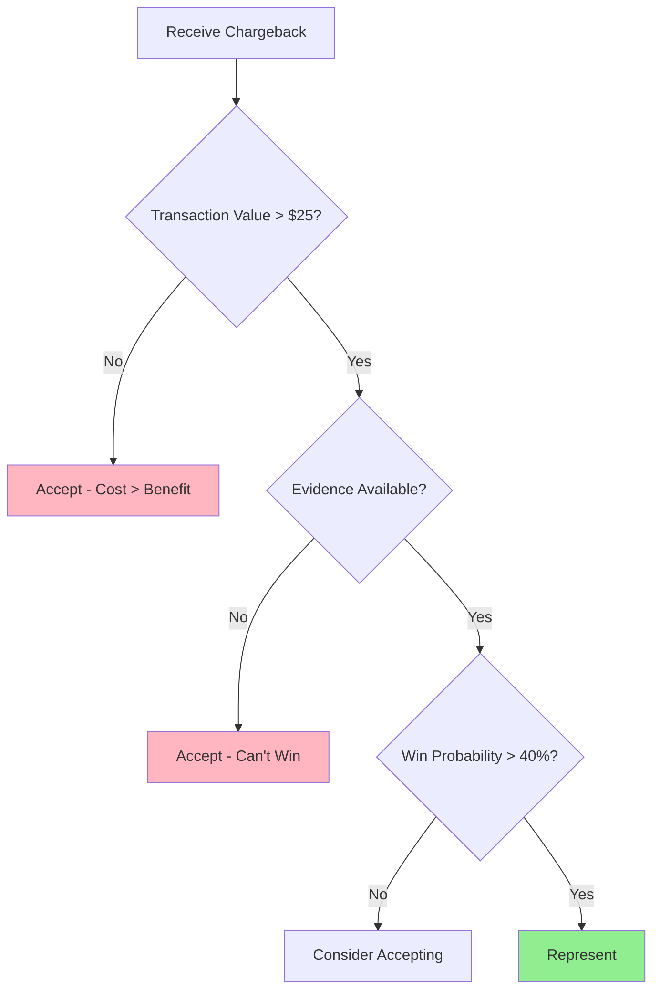
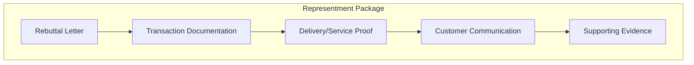
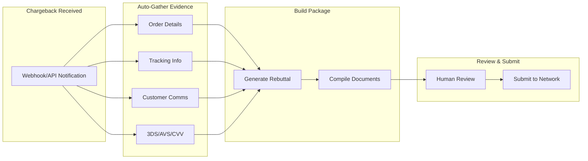
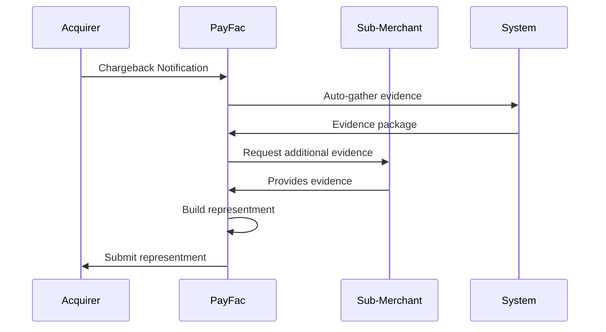

# Chargeback Representment

> **Last Updated:** 2025-02-17
> **Status:** Complete

Representment is the process of disputing a chargeback by submitting evidence that proves the transaction was valid. A well-built representment case can recover lost revenue and prevent the chargeback from counting against your ratio.

## Quick Reference

| Factor | Target | Impact |
|--------|--------|--------|
| Win Rate | 30-50% | Higher = more revenue recovered |
| Response Time | < 24 hours | Ensures no missed deadlines |
| Evidence Quality | Complete | Missing evidence = automatic loss |
| Automation | 80%+ | Reduces operational cost |

## When to Represent

Not every chargeback is worth fighting. Evaluate each case:



### Representment Decision Matrix

| Transaction Value | Evidence Strength | Win Probability | Decision |
|-------------------|-------------------|-----------------|----------|
| > $500 | Strong | > 60% | Always represent |
| $100-500 | Strong | > 40% | Represent |
| $25-100 | Strong | > 50% | Represent |
| < $25 | Any | Any | Accept (cost > benefit) |
| Any | Weak | < 30% | Accept |
| Any | None | 0% | Accept |

### Cost-Benefit Analysis

| Cost Factor | Amount |
|-------------|--------|
| Staff time to gather evidence | 15-30 minutes |
| Evidence preparation | 15-30 minutes |
| Submission processing | 5-10 minutes |
| **Total operational cost** | **$15-50** |

| Benefit Factor | Amount |
|----------------|--------|
| Transaction value recovered | Variable |
| Chargeback fee avoided | $15-100 |
| Ratio impact avoided | Long-term |

## Evidence Requirements by Reason Code

### Fraud Chargebacks (10.4 / 4837)

Fraud cases are challenging because the cardholder claims they didn't authorize the transaction.

| Evidence Type | Description | Impact |
|---------------|-------------|--------|
| **3D Secure Proof** | Authentication result, ECI indicator | Very Strong |
| **AVS Response** | Full match = strong, partial = medium | Medium-Strong |
| **CVV Response** | Match confirmation | Medium |
| **Device Fingerprint** | Matches previous valid orders | Medium |
| **IP Address** | Geographic location, consistency | Weak-Medium |
| **Previous Orders** | Same card/email made valid orders | Medium |
| **Customer Communication** | Emails confirming order | Medium |

**Example Evidence Package:**

```
1. 3D Secure authentication record showing ECI 05 (authenticated)
2. AVS response: Full match (Y/Y)
3. CVV response: Match (M)
4. Device fingerprint matching 3 previous successful orders
5. IP address: 192.168.1.1 (New York, NY - matches billing address)
6. Customer email confirming order receipt and satisfaction
7. Delivery confirmation with signature
```

### Not Received (13.1 / 4855)

Non-receipt cases require proof of delivery.

| Evidence Type | Description | Impact |
|---------------|-------------|--------|
| **Signed Delivery** | Recipient signature | Very Strong |
| **Photo Proof** | Carrier photo at delivery | Very Strong |
| **Tracking + Confirmation** | Delivered status from carrier | Strong |
| **GPS Coordinates** | Delivery location matches address | Strong |
| **Delivery Email** | Customer acknowledged receipt | Medium |

**Example Evidence Package:**

```
1. Carrier tracking number: 1Z999AA10123456784
2. Carrier: UPS Ground
3. Ship date: January 15, 2025
4. Delivery date: January 18, 2025
5. Delivery status: Delivered, Left at front door
6. Signature: John Smith
7. GPS coordinates: 40.7128° N, 74.0060° W (matches billing address)
8. Photo proof: Package at front door (attached)
```

### Not as Described (13.3 / 4853)

Product disputes require showing what was advertised matches what was delivered.

| Evidence Type | Description | Impact |
|---------------|-------------|--------|
| **Product Listing** | Original listing shown to customer | Strong |
| **Product Photos** | Actual item photos | Strong |
| **Return Policy** | Terms customer agreed to | Medium |
| **No Contact** | Customer didn't report issue | Medium |
| **Quality Inspection** | Third-party quality verification | Strong |

**Example Evidence Package:**

```
1. Screenshot of product listing as shown to customer
2. Product specification sheet
3. Photos of actual item shipped
4. Terms of service customer accepted (with timestamp)
5. Return/refund policy (30-day window not used)
6. Customer communication log (no complaints received)
7. Tracking confirming delivery
```

### Cancelled Recurring (13.2)

Recurring billing disputes require showing valid authorization.

| Evidence Type | Description | Impact |
|---------------|-------------|--------|
| **Terms of Service** | Subscription terms accepted | Strong |
| **Cancellation Policy** | How to cancel was communicated | Strong |
| **Cancellation Log** | No request received | Very Strong |
| **Usage Data** | Customer used service | Strong |
| **Renewal Notifications** | Advance billing notices | Medium |

**Example Evidence Package:**

```
1. Terms of service acceptance (IP, timestamp, checkbox confirmation)
2. Cancellation policy as shown at signup
3. Cancellation request log (no request from this customer)
4. Customer login/usage data showing active use
5. Renewal notification email sent 7 days before billing
6. Previous successful billing cycles (customer knew about recurring)
```

### Duplicate Processing (12.6 / 4834)

Duplicate claims require proving both transactions are valid.

| Evidence Type | Description | Impact |
|---------------|-------------|--------|
| **Separate Orders** | Different order numbers/dates | Very Strong |
| **Different Items** | Itemized receipts | Strong |
| **Different Tracking** | Separate shipments | Very Strong |
| **Customer Confirmation** | Emails for both orders | Medium |

**Example Evidence Package:**

```
Transaction 1:
- Order #10001, January 15, 2025, $150.00
- Items: Blue Widget (2), Red Widget (1)
- Tracking: 1Z999AA10123456784

Transaction 2:
- Order #10002, January 18, 2025, $150.00
- Items: Green Widget (3)
- Tracking: 1Z999AA10123456785

Both orders were placed separately by the customer and shipped
with different tracking numbers to the same address.
```

## Building the Representment Package

### Structure

A well-organized representment package includes:



### Rebuttal Letter Template

```markdown
RE: Chargeback Case [Case Number]
    Transaction Date: [Date]
    Transaction Amount: [Amount]
    Reason Code: [Code]

We are disputing this chargeback based on the following evidence:

[SUMMARY]
Brief 2-3 sentence summary of why this chargeback is invalid.

[EVIDENCE OVERVIEW]
1. [Evidence type 1]: [Brief description]
2. [Evidence type 2]: [Brief description]
3. [Evidence type 3]: [Brief description]

[DETAILED EXPLANATION]
[Paragraph explaining the transaction, customer relationship, and
why the chargeback reason is invalid]

[CONCLUSION]
Based on the evidence provided, we respectfully request this
chargeback be reversed in favor of the merchant.

Attached Documents:
- Document 1.pdf
- Document 2.pdf
- Document 3.pdf
```

### Evidence Documentation Standards

| Requirement | Standard |
|-------------|----------|
| File Format | PDF preferred, JPG/PNG acceptable |
| Resolution | Readable, 150+ DPI |
| File Size | < 5MB per file, < 25MB total |
| Legibility | All text clearly readable |
| Completeness | Full documents, not excerpts |
| Timestamps | Visible and verifiable |

## Win Rate Optimization

### Factors Affecting Win Rate

| Factor | Impact | Optimization |
|--------|--------|--------------|
| Evidence Completeness | +20-30% | Gather all available evidence |
| Response Time | +5-10% | Respond within 24 hours |
| Reason Code Match | +15-25% | Evidence matches specific code |
| Clear Narrative | +10-15% | Well-written rebuttal letter |
| Organization | +5-10% | Logical document structure |

### Win Rate Benchmarks

| Reason Code Category | Industry Average | Optimized |
|---------------------|------------------|-----------|
| Fraud (10.4/4837) | 20-25% | 30-35% |
| Authorization (11.x) | 45-55% | 65-75% |
| Processing Errors (12.x) | 55-65% | 75-85% |
| Consumer Disputes (13.x) | 35-45% | 50-60% |
| **Overall** | **35-40%** | **50-55%** |

### Tracking and Analysis

Monitor these metrics to improve representment performance:

| Metric | Purpose | Target |
|--------|---------|--------|
| Win Rate by Reason Code | Identify weak areas | > 40% |
| Response Time | Ensure no missed deadlines | < 24 hours |
| Evidence Completeness | Quality control | 100% |
| Cost per Representment | Efficiency | < $30 |
| Revenue Recovered | ROI tracking | > Cost |

## Automation Strategies

### Automated Evidence Gathering



### Integration Points

| System | Data Retrieved |
|--------|----------------|
| Order Management | Order details, items, amounts |
| Shipping/Fulfillment | Tracking, delivery confirmation |
| Payment Gateway | 3DS result, AVS/CVV response |
| CRM | Customer communications |
| Support System | Tickets, complaints, resolutions |

### Automation ROI

| Factor | Manual | Automated | Savings |
|--------|--------|-----------|---------|
| Time per case | 45-60 min | 10-15 min | 70-75% |
| Staff needed | 1 per 15/day | 1 per 50/day | 70% |
| Response time | 1-3 days | < 4 hours | 90% |
| Win rate | 35-40% | 45-55% | +25% |

## PayFac Representment Workflow

### Sub-Merchant Communication



### Sub-Merchant Portal Features

| Feature | Purpose |
|---------|---------|
| Chargeback Dashboard | View open cases, deadlines |
| Evidence Upload | Submit supporting documents |
| Status Tracking | Monitor case progress |
| Win Rate Analytics | Performance insights |
| Deadline Alerts | Never miss response windows |

## Related Topics

- [Reason Codes](./reason-codes.md) - Understanding what evidence is needed
- [Chargeback Lifecycle](./lifecycle.md) - The full dispute process
- [Fraud Prevention](../fraud-prevention/index.md) - Preventing chargebacks proactively

## References

- [Visa Claims Resolution Manual](https://usa.visa.com/dam/VCOM/download/about-visa/visa-rules-public.pdf)
- [Mastercard Dispute Resolution Guide](https://www.mastercard.us/content/dam/public/mastercardcom/na/global-site/documents/mastercard-rules.pdf)
- [Chargebacks911 Best Practices](https://chargebacks911.com/)
