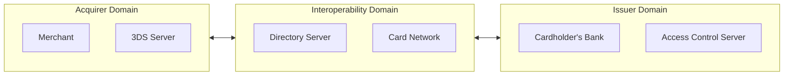
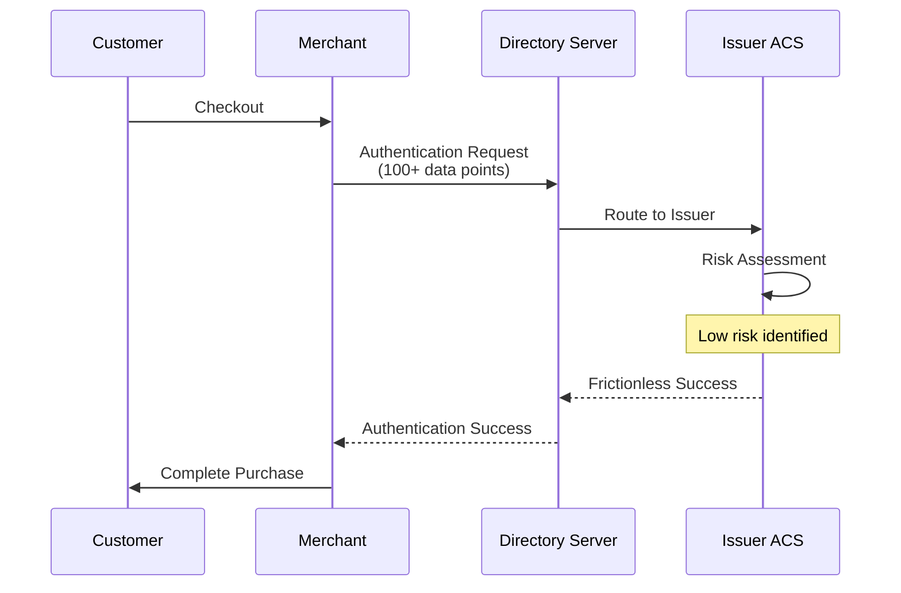
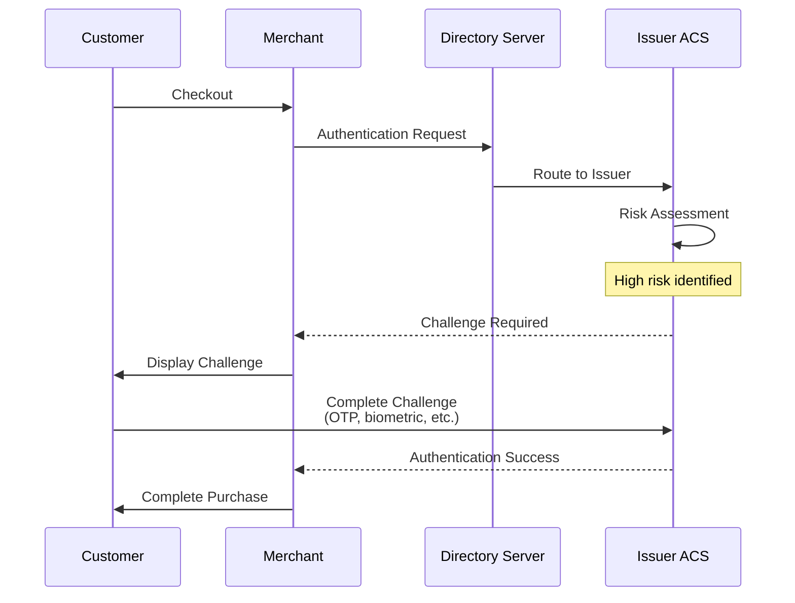
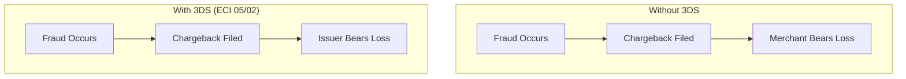
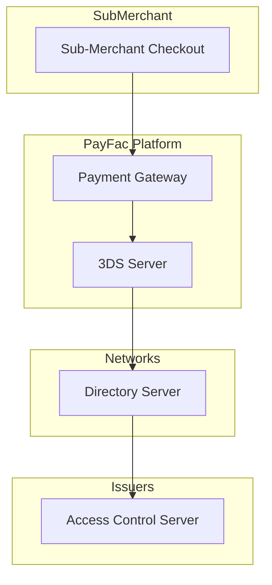

# 3D Secure

> **Last Updated:** 2025-02-17
> **Status:** Complete

3D Secure (3DS) is an authentication protocol that adds a layer of security for card-not-present transactions. For PayFac platforms, 3DS is essential for reducing fraud and shifting liability away from merchants.

## Quick Reference

| Item | Status (2026) |
|------|---------------|
| Current Version | 3DS 2.2 |
| 3DS 1.0 | Discontinued October 2022 |
| Global Merchant Adoption | 65% |
| Frictionless Success Rate | 90-95% |
| Top Performing Regions | UK, Ireland, Netherlands |

## What is 3D Secure?

3D Secure adds cardholder authentication to CNP transactions. "3D" refers to three domains involved:

### Brand Names

| Network | 3DS Brand Name |
|---------|---------------|
| Visa | Visa Secure |
| Mastercard | Mastercard Identity Check |
| American Express | SafeKey |
| Discover | ProtectBuy |
| JCB | J/Secure |

## 3DS2 vs 3DS1

:::warning 3DS1 Discontinued
Visa discontinued 3DS 1.0 support in **October 2022**. All merchants must use 3DS2.
:::

| Feature | 3DS1 | 3DS2 |
|---------|------|------|
| User experience | Page redirect | Embedded/native |
| Mobile support | Poor | Optimized |
| Data points | ~15 | ~100+ |
| Frictionless flow | No | Yes |
| Risk-based auth | No | Yes |
| Abandonment rate | 10-15% | 3-5% |

## Authentication Flows

### Frictionless Flow

Most transactions (90-95%) complete without customer interaction:

### Challenge Flow

High-risk transactions require customer verification:

### Challenge Methods

| Method | Description | User Experience |
|--------|-------------|-----------------|
| OTP via SMS | Code sent to phone | Medium friction |
| OTP via App | Code in banking app | Medium friction |
| Push notification | Approve in app | Low friction |
| Biometric | Fingerprint/Face ID | Low friction |
| Knowledge-based | Security questions | High friction |

## ECI Indicators

ECI (Electronic Commerce Indicator) values indicate the authentication result and determine liability shift:

### Visa / Amex / Discover / JCB

| ECI | Meaning | Liability Shift |
|-----|---------|-----------------|
| **05** | Fully authenticated | **Yes** |
| **06** | Attempted (cardholder not enrolled) | **Yes** |
| **07** | Authentication failed/not available | **No** |

### Mastercard

| ECI | Meaning | Liability Shift |
|-----|---------|-----------------|
| **02** | Fully authenticated | **Yes** |
| **01** | Attempted (stand-in service) | **Yes** |
| **00** | Authentication failed | **No** |
| **04** | Data Only (frictionless) | **No** |
| **06** | SCA exemption applied | **No** |
| **07** | Recurring authenticated | **Yes** |

:::tip Key Values
**ECI 05 (Visa) / 02 (MC)** = Full authentication, full liability shift
:::

## Liability Shift

When 3DS authentication succeeds, liability for fraud chargebacks shifts from merchant to issuer.

### How Liability Shift Works

### Liability Shift by Network

| Network | Shift Duration | Coverage |
|---------|---------------|----------|
| Visa | 90 days | Fraud chargebacks only |
| Mastercard | 30 days → 90 days | Fraud chargebacks only |
| Amex | Varies | Fraud chargebacks only |
| Discover | Varies | Fraud chargebacks only |

### What Liability Shift Does NOT Cover

| Not Covered | Explanation |
|-------------|-------------|
| Friendly fraud | Cardholder disputes legitimate purchase |
| Not received | Delivery disputes |
| Not as described | Product quality disputes |
| Service disputes | Any non-fraud reason code |

:::danger Critical Limitation
Liability shift only applies to **fraud chargebacks** (reason codes 10.4/4837). Friendly fraud, which represents **up to 75% of all chargebacks** (source: industry estimates 2024-2025), is NOT covered by liability shift.
:::

## PSD2 & Strong Customer Authentication (SCA)

PSD2 (Payment Services Directive 2) requires Strong Customer Authentication for European transactions.

### SCA Requirements

SCA requires **two of three** authentication factors:

| Factor | Type | Examples |
|--------|------|----------|
| Knowledge | Something you know | Password, PIN, security question |
| Possession | Something you have | Phone, token, card |
| Inherence | Something you are | Fingerprint, face, voice |

### SCA Timeline

| Date | Event |
|------|-------|
| September 14, 2019 | PSD2 SCA mandate effective |
| December 31, 2020 | Final enforcement deadline |
| October 14, 2024 | France: €100 daily exemption limit |
| March 10, 2025 | France: Auth exemptions restricted to EMV 3DS |
| ~2026 | PSD3/PSR1 expected |

### SCA Exemptions

| Exemption | Criteria | 3DS Required? |
|-----------|----------|---------------|
| Low value | < €30 (max 5 consecutive or €100 cumulative) | No |
| Low risk (TRA) | Fraud rate thresholds met | No |
| Trusted beneficiary | Cardholder whitelisted merchant | No |
| Recurring | Same amount, same merchant | First transaction only |
| Corporate cards | B2B payments | May be exempt |

### Transaction Risk Analysis (TRA) Thresholds

PSPs meeting fraud rate thresholds can request exemptions:

| Fraud Rate | Maximum Exemption Value |
|------------|------------------------|
| ≤ 0.01% | €500 |
| ≤ 0.06% | €250 |
| ≤ 0.13% | €100 |

## Implementation Considerations

### Integration Approaches

| Approach | Description | Complexity |
|----------|-------------|------------|
| Redirect | Customer redirected to 3DS page | Low |
| Embedded (iframe) | 3DS in modal on checkout | Medium |
| SDK (mobile) | Native in-app experience | High |
| API | Full control via APIs | High |

### Impact on Conversion

| Factor | Impact |
|--------|--------|
| Challenge flow | 5-20 second delay |
| Abandonment (3DS2) | 3-5% |
| Abandonment (3DS1) | 10-15% |

### Best Practices

| Practice | Benefit |
|----------|---------|
| Send maximum data | Higher frictionless rate |
| Use current SDK | Best mobile experience |
| Handle timeouts | Graceful fallback |
| Test thoroughly | Sandbox testing essential |
| Monitor auth rates | Track and optimize |

## Regional Requirements

### Japan (April 2025)

| Requirement | Detail |
|-------------|--------|
| Effective date | April 1, 2025 |
| Mandate | 3DS2 required on all transactions |
| Impact | All merchants must implement |

### Australia (AusPayNet)

| Requirement | Threshold |
|-------------|-----------|
| Fraud losses | > AUD 50,000 |
| Fraud ratio | > 0.2% for 2 consecutive quarters |
| Action | Must implement 3DS2 |

### Europe (PSD2/SCA)

| Requirement | Status |
|-------------|--------|
| SCA mandate | In effect |
| Exemptions | Available with TRA |
| Enforcement | Active |

## 3DS Data Elements

### Key Data Points Sent

| Category | Examples |
|----------|----------|
| Cardholder | Name, email, phone |
| Billing | Address, postal code, country |
| Shipping | Address, method, indicator |
| Account | Account age, transactions in 24h |
| Device | IP, user agent, screen size |
| Transaction | Amount, currency, type |

### Impact of Data Quality

| Data Quality | Frictionless Rate | Auth Success |
|--------------|-------------------|--------------|
| Minimal data | 50-60% | 70-75% |
| Standard data | 70-80% | 80-85% |
| Full data | 85-95% | 85-90% |

## PayFac 3DS Implementation

### Responsibilities

| Party | Responsibility |
|-------|---------------|
| PayFac | Integrate 3DS solution |
| PayFac | Configure risk thresholds |
| PayFac | Monitor authentication rates |
| Sub-merchant | Enable 3DS for their transactions |
| Issuer | Perform authentication |

### Architecture

### Monitoring Metrics

| Metric | Target | Alert Threshold |
|--------|--------|-----------------|
| Auth success rate | > 85% | < 75% |
| Frictionless rate | > 80% | < 60% |
| Challenge completion | > 70% | < 50% |
| Timeout rate | < 5% | > 10% |

## Related Topics

- [Fraud Patterns](./fraud-patterns.md) - Types of fraud 3DS prevents
- [Detection Tools](./detection-tools.md) - Complementary fraud tools
- [Chargeback Management](../chargebacks/index.md) - Handling disputes

## References

- [EMVCo 3D Secure Specifications](https://www.emvco.com/emv-technologies/3d-secure/)
- [Visa Secure Documentation](https://developer.visa.com/)
- [Mastercard Identity Check](https://developer.mastercard.com/)
- [EBA PSD2 SCA Requirements](https://www.eba.europa.eu/)
