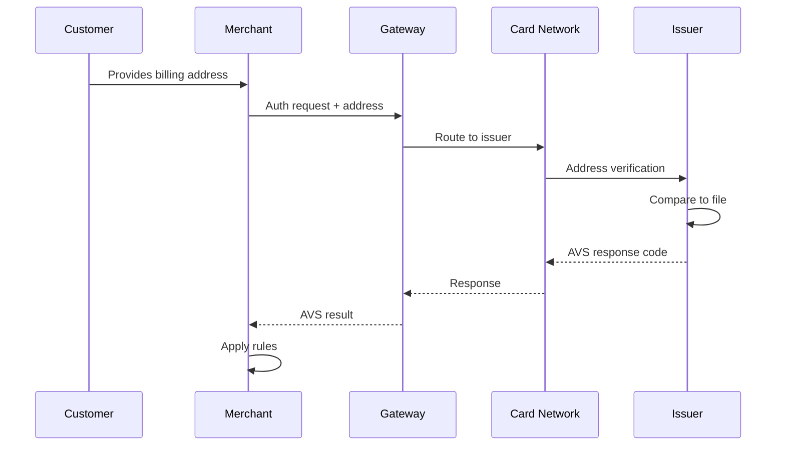
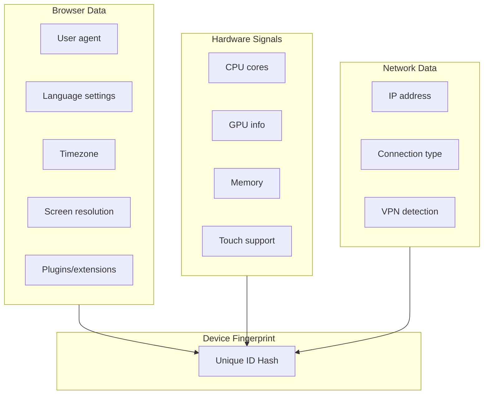
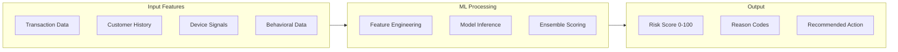
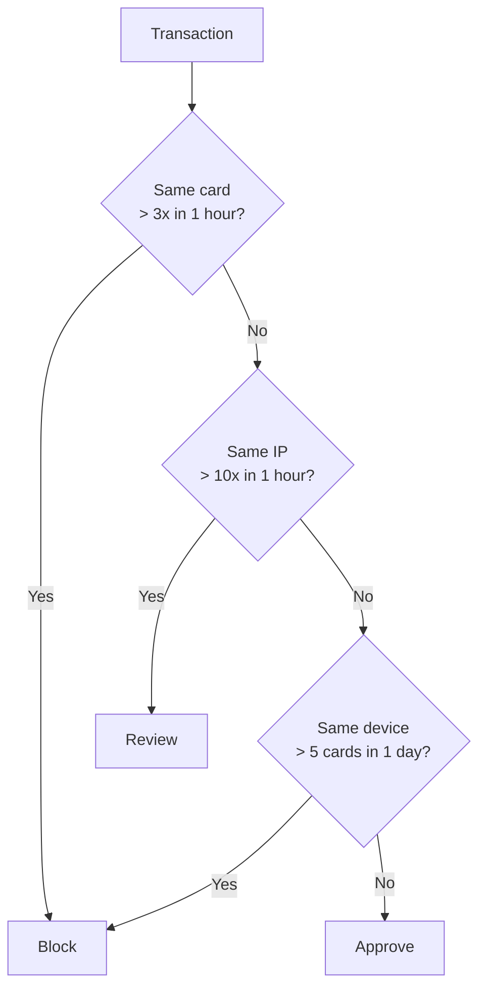
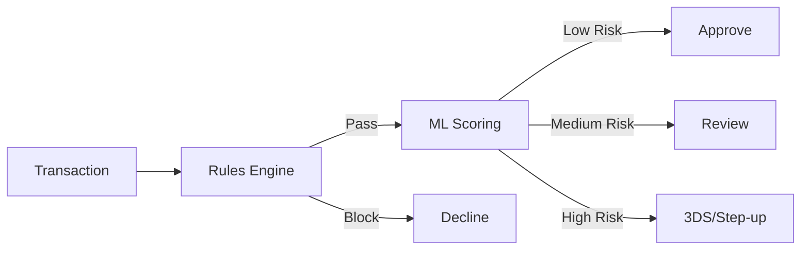
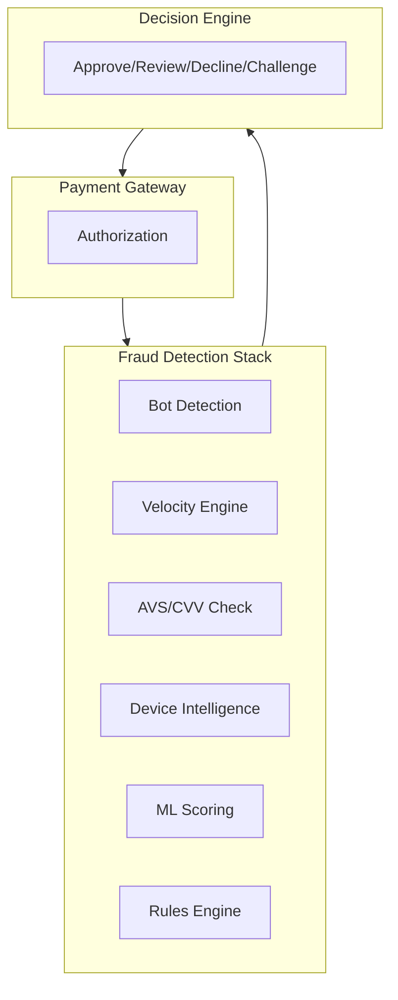

# Fraud Detection Tools

> **Last Updated:** 2025-02-17
> **Status:** Complete

Effective fraud prevention combines multiple detection tools in layers. Each tool catches different fraud patterns, and combined they provide comprehensive protection.

## Quick Reference

| Tool | Detection Rate | False Positives | Implementation |
|------|---------------|-----------------|----------------|
| AVS | 20-30% | Low | Easy |
| CVV | 20-30% | Low | Easy |
| Device Fingerprint | 40-50% | Medium | Medium |
| ML Scoring | 70-90% | Low | Complex |
| 3D Secure | 70-80% | Low | Medium |
| **Combined** | **90-95%** | **Optimized** | - |

## Address Verification Service (AVS)

AVS compares the billing address provided by the customer with the address on file with the card issuer.

### How AVS Works

### AVS Response Codes

| Code | Street | ZIP | Meaning | Risk Level |
|------|--------|-----|---------|------------|
| **Y** | Match | Match | Full match | Low |
| **X** | Match | 9-digit match | Full match | Low |
| **A** | Match | No match | Partial | Medium |
| **Z** | No match | Match | Partial | Medium |
| **W** | - | 9-digit match | Partial | Medium |
| **N** | No match | No match | No match | High |
| **U** | - | - | Unavailable | Unknown |
| **R** | - | - | Retry | Unknown |
| **S** | - | - | Not supported | Unknown |
| **E** | - | - | Error | Unknown |

### AVS Decision Matrix

| Response | Recommended Action |
|----------|-------------------|
| Y, X | Approve |
| A, Z, W | Review or apply additional checks |
| N | Decline or require additional verification |
| U, R, S | Apply other fraud checks |
| E | Investigate error, retry |

### AVS Limitations

| Limitation | Impact |
|------------|--------|
| US/Canada/UK focused | Limited international support |
| Format variations | "Street" vs "St." may not match |
| PO Box handling | May not match properly |
| Apartment numbers | Often excluded from matching |
| Issuer participation | Not all issuers respond |

## CVV/CVC Verification

CVV (Card Verification Value) confirms the customer has physical possession of the card.

### CVV Codes by Network

| Network | Code Name | Location | Digits |
|---------|-----------|----------|--------|
| Visa | CVV2 | Back | 3 |
| Mastercard | CVC2 | Back | 3 |
| American Express | CID | Front | 4 |
| Discover | CID | Back | 3 |

### CVV Response Codes

| Code | Meaning | Action |
|------|---------|--------|
| **M** | Match | Approve |
| **N** | No match | Decline |
| **P** | Not processed | Review |
| **S** | Should be present | Decline |
| **U** | Issuer not certified | Apply other checks |
| **X** | No response | Retry/Review |

:::danger PCI Compliance
CVV codes must **NEVER be stored**, even encrypted. Storing CVV violates PCI-DSS and card network rules.
:::

### CVV Best Practices

| Practice | Recommendation |
|----------|----------------|
| Always collect | Require CVV on all CNP transactions |
| Decline N responses | No match = high fraud risk |
| Recurring transactions | Don't require CVV after initial auth |
| Decline S responses | Missing CVV on card-present transaction |

## Device Fingerprinting

Device fingerprinting creates a unique identifier for a user's device based on its configuration and characteristics.

### Data Points Collected

### Fingerprint Components

| Component | Stability | Uniqueness |
|-----------|-----------|------------|
| User agent | Low (updates) | Medium |
| Screen resolution | Medium | Low |
| Timezone | High | Low |
| Canvas fingerprint | High | High |
| WebGL fingerprint | High | High |
| Audio fingerprint | High | High |
| Font list | Medium | High |
| IP address | Low | Medium |

### Device Intelligence Use Cases

| Use Case | Application |
|----------|-------------|
| Fraud detection | Link transactions to known bad devices |
| Account takeover | Detect login from new device |
| Card testing | Identify multiple cards from same device |
| Bot detection | Identify automated/non-human traffic |
| Multi-accounting | Detect users with multiple accounts |

### Effectiveness

| Configuration | Detection Rate | False Positives |
|---------------|---------------|-----------------|
| Standalone | ~70% | Higher |
| + Behavioral Analytics | ~90% | Lower |
| + ML Models | ~95% | Lowest |

### Limitations

| Challenge | Impact |
|-----------|--------|
| Privacy browsers | Reduced fingerprint uniqueness |
| VPNs/proxies | IP-based signals less reliable |
| Device spoofing | Sophisticated fraudsters can fake |
| Mobile limitations | Fewer signals available |
| GDPR/privacy | Requires disclosure and consent |

## Machine Learning Fraud Scoring

ML-based fraud detection uses algorithms to identify fraudulent transactions based on patterns in historical data.

### ML Model Architecture

### Common ML Models

| Model Type | Use Case | Advantages |
|------------|----------|------------|
| Random Forest | Classification | Interpretable, handles imbalance |
| XGBoost/CatBoost | High accuracy | Best performance, fast |
| Logistic Regression | Baseline | Simple, interpretable |
| Neural Networks | Complex patterns | Handles non-linear relationships |
| Isolation Forest | Anomaly detection | Unsupervised, finds outliers |

### Performance Metrics

| Vendor/System | Recall | Precision | AUC |
|---------------|--------|-----------|-----|
| Top ML systems | 95%+ | 80%+ | 97%+ |
| Stripe Radar | - | - | 38% fraud reduction |
| Industry average | 80-90% | 70-80% | 90-95% |

### Feature Categories

| Category | Example Features |
|----------|-----------------|
| Transaction | Amount, time, merchant category, currency |
| Customer | Account age, purchase history, frequency |
| Device | Fingerprint, IP, geolocation, user agent |
| Behavioral | Session duration, mouse movement, typing speed |
| Network | Relationship to known fraudsters, device graphs |

### ML Scoring Thresholds

| Score Range | Risk Level | Typical Action |
|-------------|------------|----------------|
| 0-20 | Low | Auto-approve |
| 21-50 | Medium | Apply additional checks |
| 51-75 | High | Manual review or 3DS |
| 76-100 | Very High | Decline or step-up auth |

## Rules-Based Detection

Rules-based systems use explicit conditions to identify fraud patterns.

### Common Rule Categories

| Category | Example Rules |
|----------|--------------|
| Velocity | > 5 transactions/hour from same IP |
| Geographic | Billing country ≠ IP country |
| Amount | Transaction > 3x average for customer |
| Time | Transaction at unusual hour |
| Pattern | Multiple failed auths then success |

### Velocity Rules Example

### Rules vs. ML Comparison

| Factor | Rules-Based | Machine Learning |
|--------|-------------|------------------|
| Setup time | Fast | Requires training data |
| Maintenance | Manual updates | Self-improving |
| Explainability | High | Medium (with explainers) |
| New fraud types | Slow to adapt | Detects anomalies |
| False positives | Can be high | Typically lower |
| Best for | Known patterns | Evolving threats |

### Hybrid Approach

Best practice combines rules and ML:

## Implementing Detection Layers

### Recommended Layer Order

| Order | Tool | Purpose |
|-------|------|---------|
| 1 | Bot Detection | Filter automated attacks |
| 2 | Velocity Rules | Block obvious abuse |
| 3 | AVS/CVV | Basic verification |
| 4 | Device Intelligence | Context and history |
| 5 | ML Scoring | Risk assessment |
| 6 | 3D Secure | Authentication if needed |
| 7 | Manual Review | Edge cases |

### Integration Architecture

### Performance Optimization

| Optimization | Benefit |
|--------------|---------|
| Async processing | Lower latency |
| Cached device data | Faster lookups |
| Pre-computed features | Real-time scoring |
| Tiered evaluation | Quick decisions for clear cases |
| A/B testing | Continuous improvement |

## Related Topics

- [Fraud Patterns](./fraud-patterns.md) - Types of fraud to detect
- [3D Secure](./3d-secure.md) - Authentication-based prevention
- [Network Programs](../monitoring-programs/network-programs.md) - Consequences of high fraud

## References

- [EMVCo 3DS Specifications](https://www.emvco.com/)
- [PCI DSS - CVV Requirements](https://www.pcisecuritystandards.org/)
- [Stripe Radar Documentation](https://stripe.com/radar)
