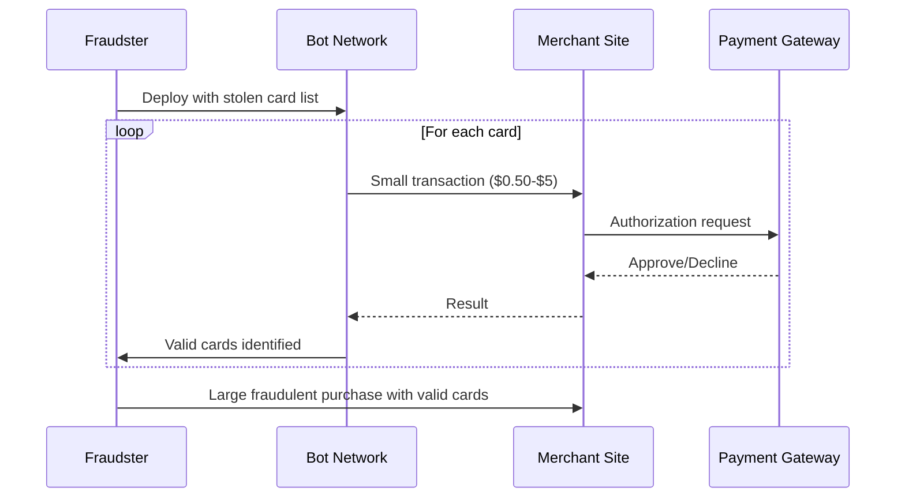
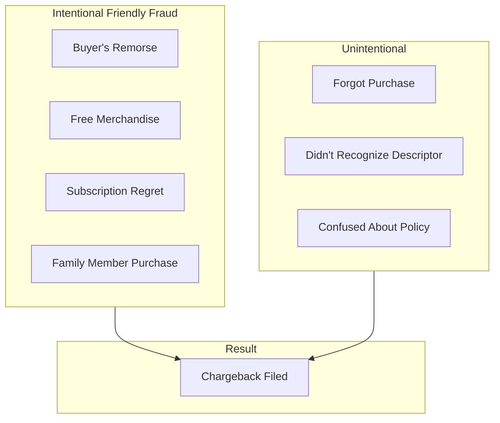
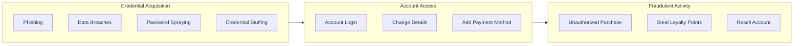
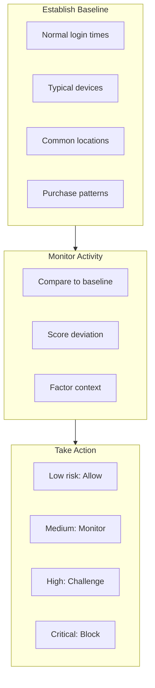
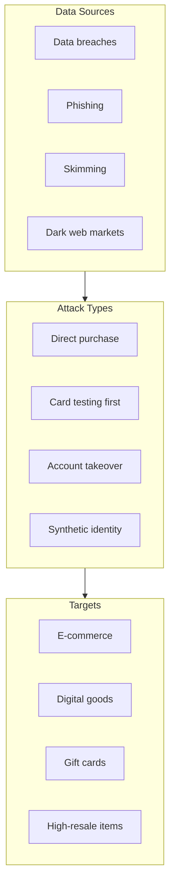
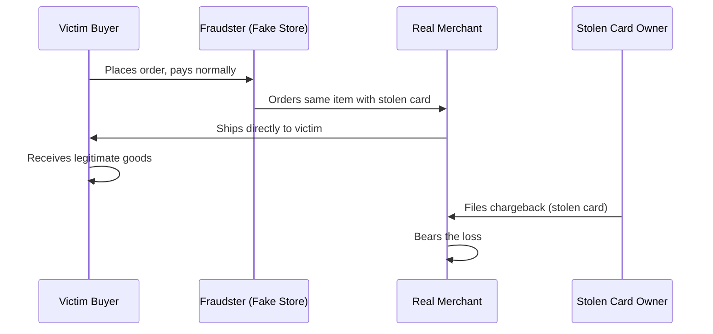

# Fraud Patterns

> **Last Updated:** 2025-02-17
> **Status:** Complete

Understanding fraud patterns is essential for building effective detection systems. Each fraud type has distinct signatures and requires different prevention approaches.

## Quick Reference

| Fraud Type | % of Fraud | Detection Difficulty | Prevention |
|------------|------------|---------------------|------------|
| Card Testing | 5-10% | Medium | Velocity limits |
| Friendly Fraud | Up to 75% of CBs | Very Hard | Documentation |
| Account Takeover | Growing | Hard | Behavioral analytics |
| CNP Fraud | 65% of losses | Medium | 3DS, ML scoring |

## Card Testing

Card testing (also called "carding") is when fraudsters validate stolen card numbers by attempting small transactions before making larger fraudulent purchases.

### How Card Testing Works

### Detection Signals

| Signal | Pattern | Risk Level |
|--------|---------|------------|
| Transaction size | $0.50 - $5.00 | High |
| Velocity | Multiple cards, same device/IP | Critical |
| Success rate | Many declines from same source | Critical |
| Sequential BINs | Cards with similar numbers | High |
| Time pattern | Rapid-fire submissions | Critical |

### Velocity Thresholds

| Metric | Threshold | Action |
|--------|-----------|--------|
| Transactions per IP/hour | > 10 | Flag for review |
| Transactions per IP/hour | > 25 | Auto-block |
| Failed auths per IP | > 5 in 10 min | Block IP |
| Cards per device | > 3 in 1 hour | Block device |
| Sub-$5 transactions | > 3 per card/day | Review |

### Prevention Strategies

1. **Velocity Limits** - Block sources exceeding thresholds
2. **CAPTCHA** - Add friction for suspicious sessions
3. **Device Fingerprinting** - Identify repeat offenders
4. **Minimum Transaction Amount** - Set floor above testing amounts
5. **Bot Detection** - Block automated traffic
6. **BIN Monitoring** - Alert on sequential card attempts

## Friendly Fraud (First-Party Fraud)

Friendly fraud occurs when legitimate cardholders dispute valid transactions. This is the **most common chargeback source** and the hardest to prevent.

### Scale of the Problem

| Metric | Value | Source Year |
|--------|-------|-------------|
| Share of all chargebacks | Up to 75% | 2024-2025 |
| First-party fraud rate | 36% of all fraud | 2024 |
| Merchants reporting | 79% experience it | 2024 |
| Projected growth | +40% by 2026 | Projection |

:::danger Critical Challenge
Friendly fraud is the #1 chargeback source, and **3D Secure provides NO protection** against it. Liability shift only applies to third-party fraud.
:::

### Common Friendly Fraud Scenarios

### Detection Signals

| Signal | Indicator | Risk Level |
|--------|-----------|------------|
| Delivery confirmed | Tracking shows delivered | Medium |
| Prior purchases | Same customer bought before | Low |
| No contact attempt | Customer didn't reach out first | Medium |
| Digital goods | Instant delivery, hard to prove receipt | High |
| Subscription | Recurring charge after months of use | Medium |

### Prevention Strategies

1. **Clear Billing Descriptors** - Recognizable name on statements
2. **Delivery Confirmation** - Signature, photos, GPS
3. **Customer Communication** - Order confirmations, shipping updates
4. **Easy Refund Process** - Make refunds easier than chargebacks
5. **Usage Tracking** - Log product/service usage for evidence
6. **Clear Terms** - Explicit return/refund policies at checkout

### Representment Evidence

| Scenario | Key Evidence |
|----------|--------------|
| Physical goods | Tracking, delivery confirmation, signature |
| Digital goods | Download logs, access logs, IP address |
| Services | Usage logs, customer communications |
| Subscriptions | Terms acceptance, usage history, cancellation policy |

## Account Takeover (ATO)

Account takeover occurs when fraudsters gain access to legitimate customer accounts through credential theft or compromise.

### 2026 ATO Landscape

| Metric | Value |
|--------|-------|
| Stolen accounts for sale | 2.5 million (early 2026) |
| Cyber incidents from phishing | 90% |
| Loyalty fraud from ATO | 52% |

### Attack Methods

### Detection Signals

| Signal | Pattern | Action |
|--------|---------|--------|
| New device + location | Login from unknown device/location | Challenge/MFA |
| Profile changes | Email, address, phone changed | Alert + verify |
| Password reset | Followed by payment method add | High risk |
| Unusual time | Login at abnormal hours | Monitor closely |
| Velocity | Multiple login attempts | Rate limit |

### Prevention Strategies

1. **Multi-Factor Authentication** - Require MFA for sensitive actions
2. **Behavioral Analytics** - Detect deviations from baseline behavior
3. **Device Recognition** - Track trusted devices
4. **Step-Up Authentication** - Challenge for unusual activity
5. **Account Change Notifications** - Alert on profile updates
6. **Credential Monitoring** - Check against breach databases

### Behavioral Analytics Approach

## CNP Fraud

Card-Not-Present fraud occurs in transactions where the card is not physically presented—primarily e-commerce, phone orders, and mail orders.

### CNP vs. Card-Present Fraud

| Metric | Card-Present | Card-Not-Present |
|--------|-------------|------------------|
| Fraud rate | 0.06% | 0.93% |
| Multiplier | Baseline | **15.5x higher** |
| Share of fraud losses | 35% | **65%** |
| Processing fees | 1.50-2.50% | 1.80-3.50% |

### Why CNP Is Higher Risk

| Factor | Impact |
|--------|--------|
| No physical card | Can't verify EMV chip |
| No cardholder presence | Can't check ID |
| Easy to scale | Automated attacks possible |
| Global reach | Cross-border fraud easier |
| Stolen data availability | Billions of compromised cards |

### CNP Fraud Methods

### Prevention Layers

| Layer | Tool | Effectiveness |
|-------|------|---------------|
| Authentication | 3D Secure | 70-80% + liability shift |
| Verification | AVS + CVV | 20-30% |
| Intelligence | Device fingerprinting | 40-50% |
| Scoring | ML fraud models | 70-90% |
| Rules | Velocity, geo-blocking | 20-40% |

### High-Risk Product Categories

| Category | Risk Factor | Why |
|----------|-------------|-----|
| Gift cards | Very High | Cash equivalent, untraceable |
| Electronics | High | High resale value |
| Digital goods | High | Instant delivery, no shipping address |
| Luxury items | High | High value, resale market |
| Travel/tickets | High | Immediate use, transferable |

## Triangulation Fraud

Triangulation fraud involves a fraudster acting as a middleman between a legitimate buyer and merchant.

### How It Works

### Why It's Hard to Detect

| Challenge | Description |
|-----------|-------------|
| Legitimate buyer | Real customer with valid payment |
| Valid shipping | Goes to real address |
| No red flags | Transaction looks normal |
| Delayed discovery | Chargeback comes later |

### Detection Signals

| Signal | Pattern |
|--------|---------|
| Shipping address mismatch | Card billing ≠ shipping |
| First-time customer | No purchase history |
| Unusual product selection | Matches common resale items |
| Multiple orders | Same item, different cards |

## Emerging Fraud Trends (2026)

### AI-Powered Fraud

| Threat | Description |
|--------|-------------|
| Deepfake verification | Bypassing identity verification |
| AI-generated content | Fake documents, communications |
| Automated attacks | More sophisticated bot networks |
| Synthetic identities | AI-created fake personas |

### Counter-Measures

| Defense | Application |
|---------|-------------|
| AI fraud detection | Fight AI with AI |
| Behavioral biometrics | Detect non-human patterns |
| Real-time risk scoring | Instant assessment |
| Multi-layer authentication | Defense in depth |

## Related Topics

- [Detection Tools](./detection-tools.md) - AVS, CVV, device fingerprinting
- [3D Secure](./3d-secure.md) - Authentication and liability shift
- [Chargeback Management](../chargebacks/index.md) - Handling fraud chargebacks

## References

- [Chargebacks911 - Friendly Fraud Statistics](https://chargebacks911.com/chargeback-stats/)
- [Javelin Strategy - Account Takeover Research](https://www.javelinstrategy.com/)
- [Federal Reserve - CNP Fraud Rates](https://www.kansascityfed.org/research/payments-system-research-briefings/)
