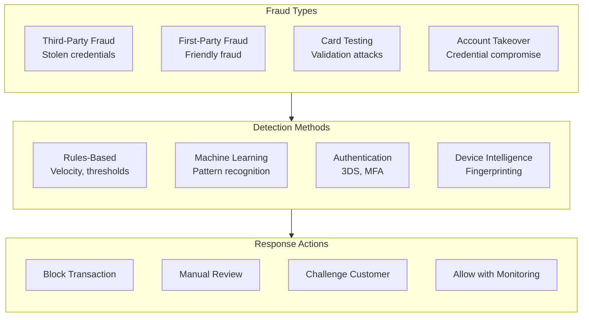
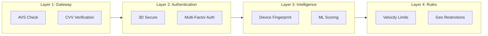
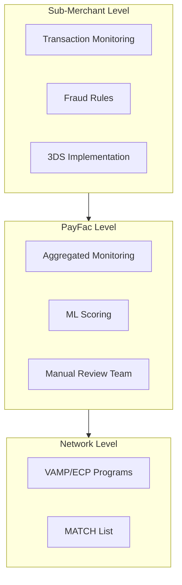

# Fraud Prevention

> **Last Updated:** 2025-02-17
> **Status:** Complete

Payment fraud costs the industry billions annually. For PayFac platforms, effective fraud prevention is essential—not just to protect revenue, but to avoid network monitoring programs and maintain processing relationships.

## Quick Reference

| Metric | 2024 Data | Trend |
|--------|-----------|-------|
| Global Card Fraud | $33.4 billion | Growing to $43B by 2026 |
| CNP Fraud Share | 65% of fraud losses | Increasing |
| Friendly Fraud | Up to 75% of chargebacks | Growing 40% by 2026 |
| CNP vs CP Fraud Rate | 15.5x higher | Persistent gap |

## Fraud Landscape Overview

## Fraud Categories

### By Source

| Category | Description | % of Fraud | Prevention Difficulty |
|----------|-------------|------------|----------------------|
| **Third-Party** | Stolen cards, credentials | 60-70% | Medium |
| **First-Party** | Friendly fraud, disputes | 36%+ (growing) | Very High |
| **Synthetic** | Fabricated identities | Growing | High |

### By Transaction Type

| Type | Fraud Rate | vs. Card-Present |
|------|------------|------------------|
| Card-Present (CP) | 0.06% | Baseline |
| Card-Not-Present (CNP) | 0.93% | **15.5x higher** |

:::warning CNP Fraud Dominance
CNP fraud accounts for **65% of total fraud losses** despite being a smaller share of transaction volume. E-commerce and digital payments are primary targets.
:::

## Defense Layers

Effective fraud prevention uses multiple layers:

### Layer Effectiveness

| Layer | Detection Rate | False Positives | Implementation |
|-------|---------------|-----------------|----------------|
| AVS/CVV | 20-30% | Low | Easy |
| 3D Secure | 70-80% | Low | Medium |
| Device Intelligence | 40-50% | Medium | Medium |
| ML Scoring | 70-90% | Low | Complex |
| **Combined** | **90-95%** | **Optimized** | - |

## Section Contents

### [Fraud Patterns](./fraud-patterns.md)
- Card testing attacks and detection
- Friendly fraud (first-party fraud)
- Account takeover (ATO)
- CNP fraud trends

### [Detection Tools](./detection-tools.md)
- AVS and CVV verification
- Device fingerprinting
- Machine learning fraud scoring
- Rules-based detection

### [3D Secure](./3d-secure.md)
- 3DS2 implementation and flows
- Liability shift rules
- SCA/PSD2 compliance
- Frictionless vs. challenge authentication

### [Quiz](./quiz.md)
- Self-assessment questions

## Key Statistics (2024-2026)

### Fraud Volume

| Metric | 2024 | 2026 Projected |
|--------|------|----------------|
| Global Card Fraud | $33.4B | $43B |
| US CNP Fraud | $9.2B | $12.9B |
| Global Chargebacks | 238M | 337M (42% increase) |

### Fraud by Type

| Fraud Type | % of Total | Trend |
|------------|------------|-------|
| Friendly Fraud | Up to 75% of chargebacks | +40% by 2026 |
| First-Party Fraud | 36% of all fraud | Up from 15% (2023) |
| Account Takeover | 52% of loyalty fraud | Growing |

### Detection Performance

| Method | Detection Rate | Notes |
|--------|---------------|-------|
| 3DS2 Frictionless | 90-95% pass | Most transactions avoid challenge |
| ML Fraud Scoring | 95% recall | Top systems achieve 97% AUC |
| Device + Behavioral | 90%+ | Combined approach best |

## PayFac Fraud Responsibilities

As a PayFac, you have specific fraud obligations:

### PayFac Fraud Obligations

| Obligation | Requirement |
|------------|-------------|
| Sub-merchant monitoring | Real-time fraud monitoring per merchant |
| Ratio tracking | Monitor fraud ratios against network thresholds |
| 3DS implementation | Offer 3DS to sub-merchants |
| High-risk identification | Flag merchants with elevated fraud |
| Network compliance | Stay below VAMP/ECP thresholds |

## Related Topics

- [Network Monitoring Programs](../monitoring-programs/network-programs.md) - VAMP, ECP, MATCH consequences
- [Chargeback Management](../chargebacks/index.md) - Handling fraud chargebacks
- [PCI Compliance](../pci-compliance/index.md) - Protecting cardholder data

## References

- [EMVCo 3D Secure Specifications](https://www.emvco.com/emv-technologies/3d-secure/)
- [Visa Secure Documentation](https://developer.visa.com/)
- [Mastercard Identity Check](https://developer.mastercard.com/)
- [Nilson Report - Card Fraud Statistics](https://nilsonreport.com/)
