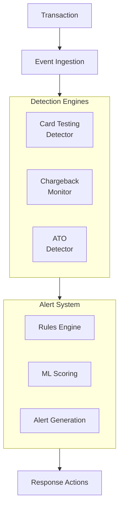

# Fraud Prevention Quiz

> **Last Updated:** 2025-02-17
> **Status:** Complete

Test your understanding of fraud prevention with these self-assessment questions.

## Detection Tools

### Question 1: AVS Response Codes

**A transaction returns AVS code "A" (street match, no ZIP match). What is the appropriate action?**

<details>
<summary>View Answer</summary>

**AVS Code "A" Meaning:**
- Street address matches
- ZIP code does NOT match

**Risk Level:** Medium

**Appropriate Actions:**
1. **Don't auto-decline** - partial match indicates some validity
2. **Apply additional checks:**
   - Verify CVV match
   - Check device fingerprint
   - Review ML fraud score
   - Consider 3DS authentication
3. **Consider transaction value** - higher value = more scrutiny

**Context Matters:**
- First-time customer: Higher risk
- Repeat customer with history: Lower risk
- Digital goods: Higher risk
- Physical goods with shipping verification: Lower risk

**Best Practice:** Use AVS as one input to risk scoring, not as a sole decision factor.
</details>

### Question 2: CVV Storage

**A developer asks: "Can we store encrypted CVV codes for subscription renewals?" What is the correct response?**

<details>
<summary>View Answer</summary>

**Correct Response: NO - Never store CVV codes under any circumstances.**

**Why:**
1. **PCI DSS Violation** - Storing CVV violates PCI DSS requirement 3.2
2. **Card Network Rules** - Visa, Mastercard, etc. prohibit CVV storage
3. **Post-Authorization Requirement** - CVV must not be stored after authorization

**For Subscriptions:**
- First transaction: Collect and verify CVV
- Subsequent charges: Do NOT require CVV
- Use tokenization: Store token, not card data
- Merchant-initiated transactions: CVV not required

**Consequences of Storing CVV:**
- PCI compliance failure
- Card network fines
- Potential termination of processing rights
- Increased liability for data breach
</details>

### Question 3: Device Fingerprinting

**What are the limitations of device fingerprinting as a sole fraud prevention method?**

<details>
<summary>View Answer</summary>

**Limitations:**

| Limitation | Impact |
|------------|--------|
| **Privacy browsers** | Reduced fingerprint uniqueness (Tor, Brave) |
| **VPNs/proxies** | IP-based signals unreliable |
| **Device spoofing** | Sophisticated fraudsters can fake signals |
| **Mobile limitations** | Fewer data points available |
| **Shared devices** | Multiple users = false positives |
| **Device changes** | New device ≠ fraud |
| **GDPR/privacy** | Requires consent and disclosure |

**Detection Rate:**
- Standalone: ~70%
- With behavioral analytics: ~90%
- With ML models: ~95%

**Best Practice:**
Device fingerprinting should be ONE layer in a multi-layer fraud stack, not the sole method. Combine with:
- Behavioral analytics
- ML scoring
- AVS/CVV
- 3D Secure
</details>

## Fraud Patterns

### Question 4: Card Testing Detection

**What transaction patterns indicate card testing is happening?**

<details>
<summary>View Answer</summary>

**Card Testing Signals:**

| Signal | Pattern |
|--------|---------|
| **Transaction size** | $0.50 - $5.00 range |
| **Velocity** | Multiple transactions in quick succession |
| **Source concentration** | Same IP/device, different cards |
| **Decline rate** | High number of declines |
| **Sequential BINs** | Cards with similar numbers |
| **Time pattern** | Rapid-fire, often overnight |

**Detection Thresholds:**

| Metric | Alert Threshold |
|--------|-----------------|
| Cards per IP/hour | > 3 |
| Failed auths per IP/10 min | > 5 |
| Sub-$5 transactions/day | > 3 per card |
| Cards per device/day | > 5 |

**Immediate Actions:**
1. Block IP/device temporarily
2. Add CAPTCHA
3. Increase minimum transaction amount
4. Alert for investigation
</details>

### Question 5: Friendly Fraud

**Explain friendly fraud. Why is it particularly difficult to prevent?**

<details>
<summary>View Answer</summary>

**What is Friendly Fraud?**
Friendly fraud occurs when a legitimate cardholder makes a valid purchase, then disputes the charge as unauthorized or claims the goods/service wasn't received.

**Scale:**
- **Up to 75%** of all chargebacks
- **36%** of all fraud is first-party
- Growing **40%** by 2026

**Why It's Difficult to Prevent:**

| Challenge | Explanation |
|-----------|-------------|
| **Legitimate customer** | Real person, real card, real purchase |
| **No red flags** | Transaction looks completely normal |
| **3DS doesn't help** | Liability shift only covers third-party fraud |
| **Subjective claims** | "I don't remember" or "It wasn't as described" |
| **Customer favor** | Issuers often side with cardholders |

**Prevention Strategies:**
1. Clear billing descriptors (recognizable name)
2. Delivery confirmation with signature/photos
3. Detailed order confirmations
4. Easy refund process (easier than chargeback)
5. Usage logging for digital goods/services
6. Clear terms at checkout

**Key Insight:** The best defense against friendly fraud is **documentation for representment**, not detection.
</details>

### Question 6: CNP Fraud Comparison

**A merchant suddenly shows a spike in small transactions ($1-5) from different cards, all from the same IP address. What might this indicate?**

<details>
<summary>View Answer</summary>

**This pattern strongly indicates CARD TESTING.**

**Evidence Analysis:**
- **Small transactions**: Testing stolen cards before larger purchases
- **Multiple cards**: Validating batch of stolen credentials
- **Same IP**: Automated bot or single fraudster
- **Pattern consistency**: Classic card testing signature

**Immediate Actions:**

1. **Block the IP address** - Stop ongoing attack
2. **Review recent approvals** - Any cards validated may be used soon
3. **Check for follow-up transactions** - Large purchases from same cards
4. **Implement velocity controls** - Prevent future attacks

**Technical Response:**
```
Alert Criteria:
- > 3 different cards from same IP in 1 hour
- Transaction amounts < $5
- High decline rate from same source

Action:
- Auto-block IP for 24 hours
- CAPTCHA for all transactions from similar patterns
- Flag all approved cards for monitoring
```

**Prevention:**
- Rate limiting per IP/device
- Bot detection
- Minimum transaction amounts
- CAPTCHA for suspicious patterns
</details>

## 3D Secure

### Question 7: Liability Shift

**What is the "liability shift" with 3D Secure, and why does it matter?**

<details>
<summary>View Answer</summary>

**Liability Shift Explained:**

When 3DS authentication succeeds (ECI 05/02), liability for fraud chargebacks shifts from the **merchant** to the **issuer**.

```
Without 3DS:
Fraud → Chargeback → MERCHANT pays

With 3DS (authenticated):
Fraud → Chargeback → ISSUER pays
```

**Why It Matters:**

| Factor | Impact |
|--------|--------|
| **Financial protection** | Merchant doesn't bear fraud losses |
| **Chargeback ratio** | Shifted chargebacks don't count |
| **Risk reduction** | Less exposure to monitoring programs |

**ECI Values for Liability Shift:**

| Network | Successful | Attempted | No Shift |
|---------|------------|-----------|----------|
| Visa | 05 | 06 | 07 |
| Mastercard | 02 | 01 | 00 |

**Critical Limitations:**

| NOT Covered | Reason |
|-------------|--------|
| Friendly fraud | Legitimate cardholder disputes |
| Not received | Delivery disputes |
| Not as described | Quality disputes |
| Any non-fraud code | Only covers fraud reason codes |

**Key Insight:** Liability shift only covers ~20-25% of chargebacks (fraud). The 75%+ that are friendly fraud are NOT protected.
</details>

### Question 8: SCA Requirements

**What does Strong Customer Authentication (SCA) require under PSD2?**

<details>
<summary>View Answer</summary>

**SCA Requirement:**
Two of three authentication factors must be used:

| Factor | Type | Examples |
|--------|------|----------|
| **Knowledge** | Something you know | Password, PIN |
| **Possession** | Something you have | Phone, card, token |
| **Inherence** | Something you are | Fingerprint, face |

**Where SCA Applies:**
- European Economic Area (EEA) transactions
- Online payments initiated by customer
- Account access

**Exemptions Available:**

| Exemption | Criteria |
|-----------|----------|
| Low value | < €30 (max 5 or €100 cumulative) |
| Low risk (TRA) | PSP meets fraud rate thresholds |
| Recurring | Same amount, same merchant |
| Trusted | Cardholder whitelisted merchant |
| Corporate | B2B payments |

**TRA Fraud Rate Thresholds:**

| Fraud Rate | Max Exemption Value |
|------------|---------------------|
| ≤ 0.01% | €500 |
| ≤ 0.06% | €250 |
| ≤ 0.13% | €100 |

**Key Point:** Even with exemptions, the **issuer makes the final decision** and can require a challenge.
</details>

## Scenario Questions

### Question 9: Fraud System Design

**Scenario:** Design a real-time monitoring system that would catch: (a) card testing, (b) chargeback ratio spikes, (c) potential ATO. What signals would trigger alerts?

<details>
<summary>View Answer</summary>

**Multi-Threat Detection System Design:**



**A) Card Testing Detection:**

| Signal | Threshold | Action |
|--------|-----------|--------|
| Small transactions (< $5) | > 3 per card/day | Flag |
| Cards per IP/hour | > 5 | Block |
| Failed auths per source | > 3 in 10 min | Block |
| Sequential BINs | > 2 attempts | Alert |

**B) Chargeback Ratio Monitoring:**

| Signal | Threshold | Action |
|--------|-----------|--------|
| Daily ratio | > 0.5% | Warning |
| Weekly ratio | > 0.75% | Alert |
| Monthly ratio | > 1.0% | Critical alert |
| Single merchant spike | > 2x normal | Investigate |

**C) Account Takeover Detection:**

| Signal | Threshold | Action |
|--------|-----------|--------|
| New device + profile change | Within 24 hours | Block changes |
| Failed logins | > 5 in 10 min | Lock account |
| Login from new country | Unusual location | MFA required |
| Password reset + payment add | Same session | Manual review |

**Implementation:**
- Real-time streaming architecture (Kafka/Kinesis)
- Sub-second latency for blocking decisions
- ML models updated daily with new patterns
- Human review queue for edge cases
</details>

### Question 10: 3DS Implementation Decision

**Scenario:** A sub-merchant processes $500K/month in e-commerce. Their chargeback ratio is 0.8% (trending up) with most chargebacks being fraud (10.4/4837). Should they implement 3D Secure? What are the trade-offs?

<details>
<summary>View Answer</summary>

**Recommendation: YES - Implement 3D Secure immediately.**

**Analysis:**

| Factor | Current State | With 3DS |
|--------|---------------|----------|
| Chargeback ratio | 0.8% (dangerous) | Likely 0.3-0.5% |
| Fraud chargebacks | Primary issue | Liability shifts |
| VAMP/ECP risk | High (approaching 1%) | Reduced |
| Conversion impact | 100% | 97-99% (3DS2) |

**Trade-offs:**

| Positive | Negative |
|----------|----------|
| Liability shift on fraud | 5-20 second delay |
| Lower fraud chargebacks | 3-5% checkout abandonment |
| Network compliance | Implementation cost |
| Reduced fraud losses | Issuer can still decline |

**ROI Calculation:**

```
Monthly volume: $500,000
Current fraud chargebacks: 0.5% × $500K = $2,500/month

With 3DS (assuming 70% fraud reduction):
- Fraud savings: $1,750/month
- Conversion loss (3%): $15,000 × margin
- Net depends on margin

High-margin business: Clear positive ROI
Low-margin business: Still positive due to ratio protection
```

**Implementation Priority:**
1. Enable 3DS for all transactions > $100
2. Use frictionless flow to minimize friction
3. Monitor authentication rates
4. Expand to lower thresholds if needed

**Critical Factor:** At 0.8% and trending up, they're one bad month from VAMP entry. 3DS is essential for ratio protection, regardless of financial ROI.
</details>

## Summary

After completing this quiz, you should understand:

- [ ] AVS and CVV response codes and appropriate actions
- [ ] Device fingerprinting capabilities and limitations
- [ ] Card testing patterns and detection strategies
- [ ] Why friendly fraud is the biggest chargeback challenge
- [ ] 3D Secure liability shift scope and limitations
- [ ] SCA requirements and exemption criteria
- [ ] Multi-layer fraud detection system design

## Related Topics

- [Fraud Patterns](./fraud-patterns.md) - Detailed fraud type analysis
- [Detection Tools](./detection-tools.md) - AVS, CVV, ML scoring
- [3D Secure](./3d-secure.md) - Authentication implementation
- [Network Programs](../monitoring-programs/network-programs.md) - Consequences of high fraud
