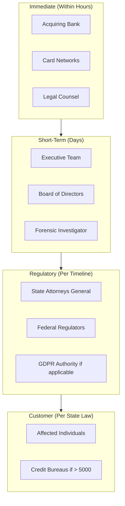
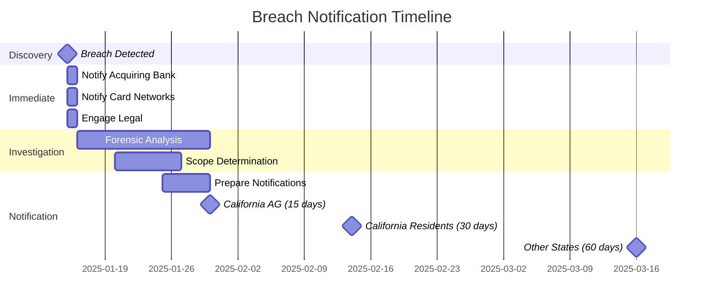

# Breach Notification

> **Last Updated:** 2025-02-17
> **Status:** Complete

Data breach notification is governed by a patchwork of state laws, card network rules, and regulatory requirements. Understanding these requirements is critical for timely and compliant breach response.

## Quick Reference

| Jurisdiction | Timeline | Key Requirement |
|--------------|----------|-----------------|
| Card networks | Immediate | Notify acquiring bank |
| California (2026) | 30 days | + 15 days to AG if > 500 |
| Oklahoma (2026) | 60 days | Expanded data types |
| Most states | 30-60 days | "Without unreasonable delay" |
| GDPR (if applicable) | 72 hours | Supervisory authority |

## Notification Hierarchy



## Card Network Requirements

### Visa

| Requirement | Timeline |
|-------------|----------|
| Notify acquiring bank | Immediately upon discovery |
| Account Data Compromise notification | Within 24 hours |
| Containment | Within 60 business days |
| PCI Forensic Investigator | If required by Visa |

**Failure to contain within 60 days may trigger mandatory PFI investigation.**

### Mastercard

| Requirement | Timeline |
|-------------|----------|
| Notify acquiring bank | Immediately |
| Account Data Compromise Event | Within 24 hours |
| Provide compromised account data | As soon as available |
| Forensic investigation | As required |

### Notification Content

| Element | Required Information |
|---------|---------------------|
| Nature of incident | What happened |
| Data types compromised | PAN, expiration, CVV, etc. |
| Number of accounts | Count or estimate |
| Date of compromise | When it occurred |
| Date of discovery | When you found out |
| Containment status | What's been done |

## State Breach Notification Laws

### Key State Requirements (2026)

| State | Timeline | Notable Requirements |
|-------|----------|---------------------|
| **California** | 30 days to residents, 15 days to AG | Applies when ≥ 500 residents affected |
| **Oklahoma** | 60 days | Expanded data types (biometrics, government IDs) |
| **New York** | "Expedient" + 60 days to AG | SHIELD Act requirements |
| **Massachusetts** | "Promptly" | Director of Consumer Affairs |
| **Texas** | 60 days | AG notification required |

### Notification Trigger

Most state laws require notification when:

| Element | Requirement |
|---------|-------------|
| Personal information | State-defined (usually SSN, financial, health) |
| Breach | Unauthorized acquisition of data |
| Residents | Individuals residing in that state |
| Harm likelihood | Some states require harm assessment |

### Payment-Specific Data

| Data Type | Typically Triggers Notification |
|-----------|-------------------------------|
| Primary Account Number (PAN) | Yes |
| Name + PAN | Yes |
| CVV/Security Code | Yes |
| Expiration Date (with PAN) | Usually yes |
| Cardholder Name alone | Usually no |

## Notification Timeline Summary



## Customer Notification

### Notification Methods

| Method | When Required |
|--------|---------------|
| Written letter | Standard method |
| Email | If prior consent obtained |
| Substitute notice | If > 500,000 affected or cost > $250,000 |
| Phone | May supplement written |

### Required Content

| Element | Description |
|---------|-------------|
| Nature of breach | What happened in plain language |
| Data types | What information was exposed |
| Actions taken | What you're doing about it |
| Contact information | How to reach you |
| Recommendations | Steps customer should take |
| Credit monitoring | Offer if applicable |

### Sample Notification Structure

```
NOTICE OF DATA BREACH

[Date]

Dear [Customer Name],

We are writing to inform you of a security incident that may have
affected your payment card information.

WHAT HAPPENED
[Description of incident, dates, discovery]

WHAT INFORMATION WAS INVOLVED
[Specific data types affected]

WHAT WE ARE DOING
[Actions taken to address the incident]

WHAT YOU CAN DO
[Recommended steps for the customer]

FOR MORE INFORMATION
[Contact details, resources]

Sincerely,
[Company Name]
```

## Credit Bureau Notification

### When Required

| Condition | Requirement |
|-----------|-------------|
| > 5,000 individuals affected | Notify credit bureaus |
| > 1,000 in some states | State-specific requirements |

### Credit Bureaus

| Bureau | Contact |
|--------|---------|
| Equifax | Security Freeze |
| Experian | Security Freeze |
| TransUnion | Security Freeze |

## Regulatory Notifications

### Federal Regulators

| Regulator | When to Notify |
|-----------|----------------|
| FTC | If consumer data involved |
| SEC | If material to public company |
| OCC/FDIC | If bank-supervised |
| FinCEN | If suspicious activity involved |

### State Attorneys General

| Requirement | Details |
|-------------|---------|
| Timing | Varies (15-60 days) |
| Format | State-specific forms |
| Content | Incident details, affected count |

## Documentation Requirements

### Incident Documentation

| Document | Contents |
|----------|----------|
| Incident report | Timeline, actions, decisions |
| Notification log | Who, when, how notified |
| Evidence preservation | Chain of custody |
| Forensic report | Technical findings |

### Retention

| Record | Retention Period |
|--------|------------------|
| Notification copies | 5+ years |
| Incident documentation | 5+ years |
| Legal correspondence | 7+ years |
| Forensic reports | 7+ years |

## Post-Breach Actions

### Remediation

| Action | Timeline |
|--------|----------|
| Patch vulnerabilities | Immediate |
| Reset credentials | As needed |
| Enhance monitoring | Ongoing |
| Update controls | Based on findings |

### Follow-Up

| Action | Timeline |
|--------|----------|
| Customer inquiry handling | Ongoing |
| Regulatory follow-up | As required |
| Legal proceedings | As needed |
| Insurance claims | Per policy |

## Related Topics

- [Incident Response Overview](./index.md) - Response procedures
- [PCI Compliance](../pci-compliance/index.md) - PCI requirements
- [Network Programs](../monitoring-programs/network-programs.md) - Network obligations

## References

- [IAPP State Breach Notification Chart](https://iapp.org/resources/article/state-data-breach-notification-chart/)
- [PCI DSS Incident Response Guidelines](https://www.pcisecuritystandards.org/)
- [FTC Data Breach Response Guide](https://www.ftc.gov/business-guidance/resources/data-breach-response-guide-business)
